# 【开源周刊 49】基于Python的股票数据分析系统 ｜ 高性能且稳定的独立浏览器 ｜ React应用可视化性能检测工具 ｜ 开源告警管理和AIOps平台 ｜ - P1 - 程序员四阿哥 - BV1sfkiYtEqz

欢迎收看github weekly第49期，以下是本期要跟大家分享的开源项目。

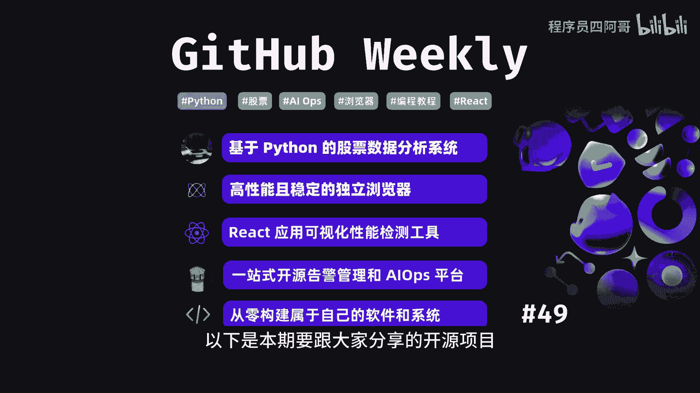

基于Python的股票数据分析系统，in stock是一个综合性的量化投资系统，他能够抓取每日股票和ETF的关键数据，计算各种股票指标，识别K线形态，并提供多种选股策略。

in stock不仅包括每日股票数据，资金流向，分红配送等信息，还基于talent和pandas计算30多种指标，并能精准识别61种K线形态，同时提供docker镜像，方便安装。

是一个功能全面的量化投资工具。

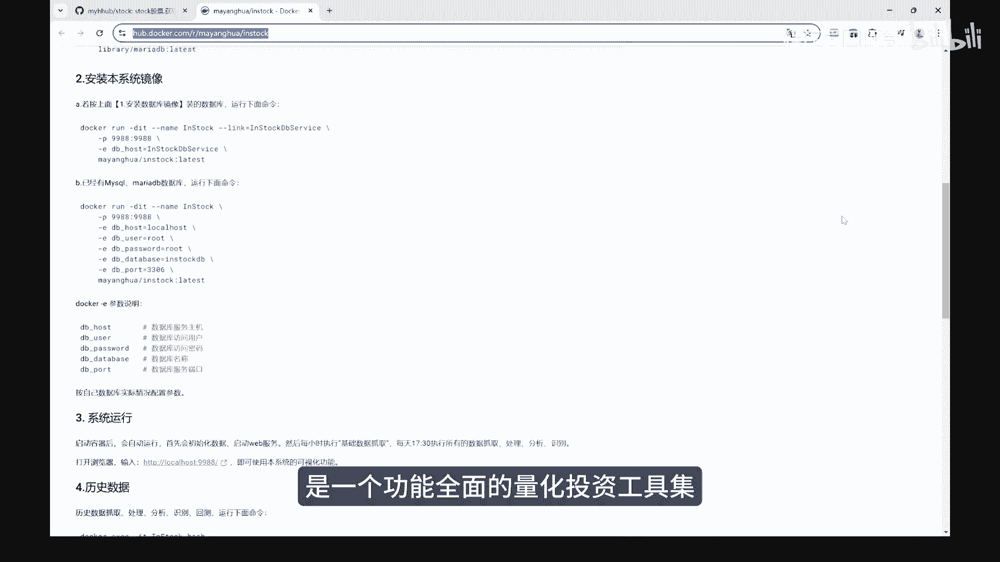

集高性能且稳定的独立浏览器，lady bird是一个独立的开源浏览器项目。

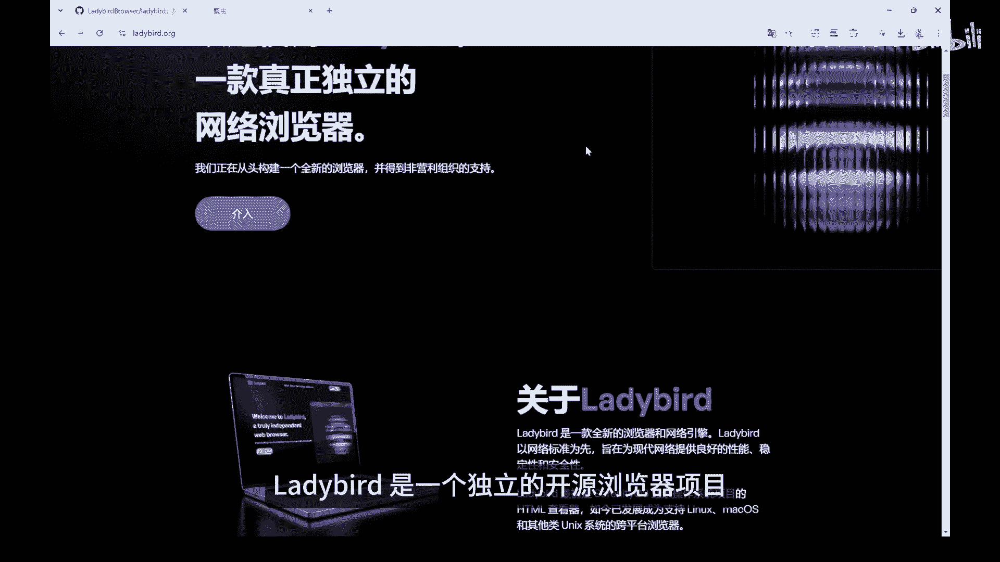

由非营利组织支持，旨在遵循网络标准来渲染现代网页。

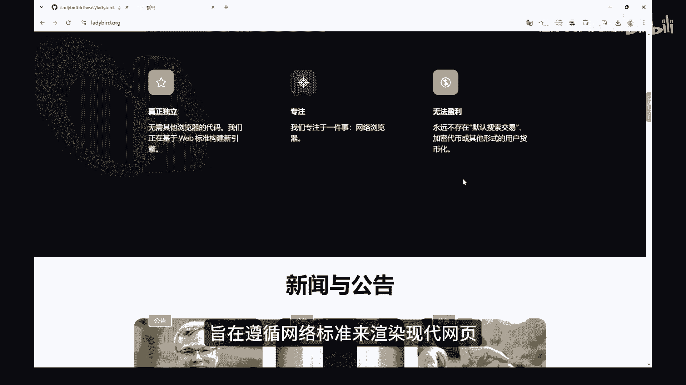

提供高性能稳定性和安全性的浏览体验，该项目起源于thread TOS操作系统的HTML查看器，现已发展成为支持LINUX。

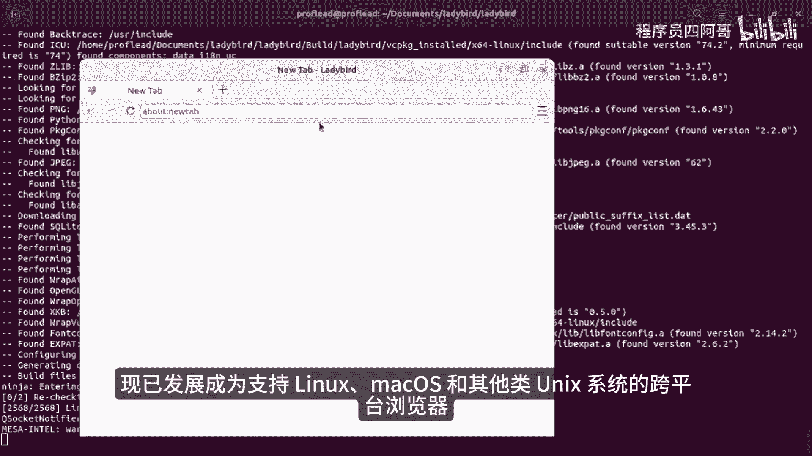

Mac os和其他类UNIX系统的跨平台浏览器，lady bird浏览器以其独立性为特色，不依赖于现有的浏览器引擎代码，而是从头构建其引擎。

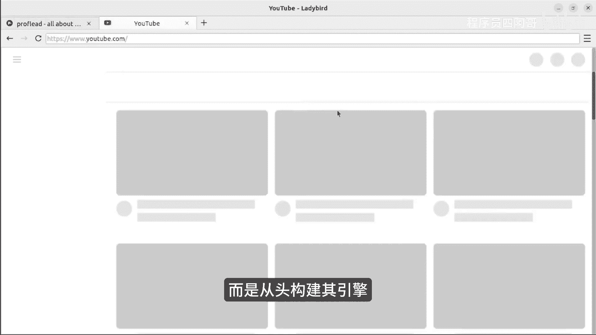

使用C加加作为主要编程语言，并集成了包括live web。

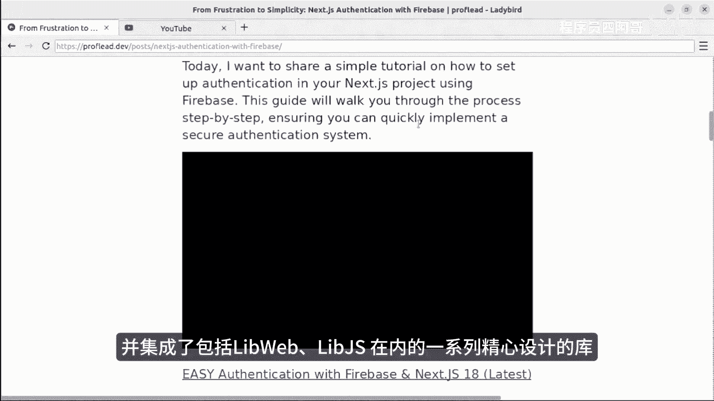

lib js在内的一系列精心设计的库，覆盖web技术，全站react应用可视化性能检测工具，react scan是一个react性能检测工具，它能够自动检测并以界面化的方式显示。

react应用程序中可能导致性能问题的组件，它通过视觉反馈，帮助开发者识别导致性能问题的渲染，并且无需手动更改代码，从而简化了性能检测和优化的过程，一站式开源告警管理和AI ops平台。

keep是一个开源的告警管理和IOS平台。

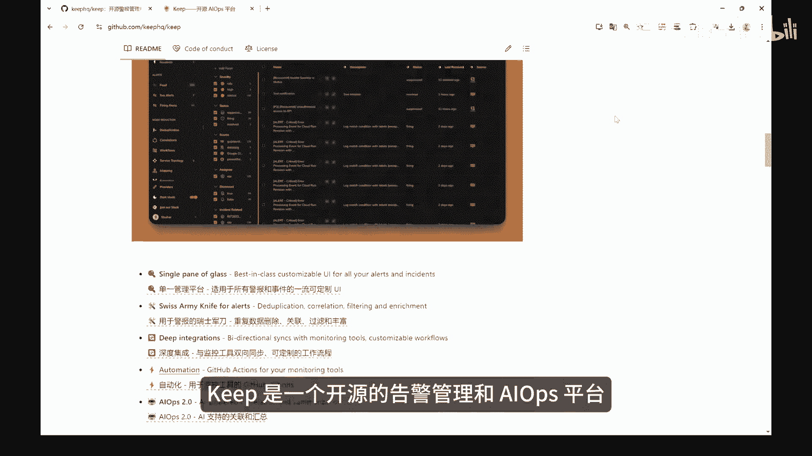

它通过提供一个统一的界面，来管理所有告警和事件，支持告警去虫丰富过滤和关联，并具备双向集成和自动化工作流。

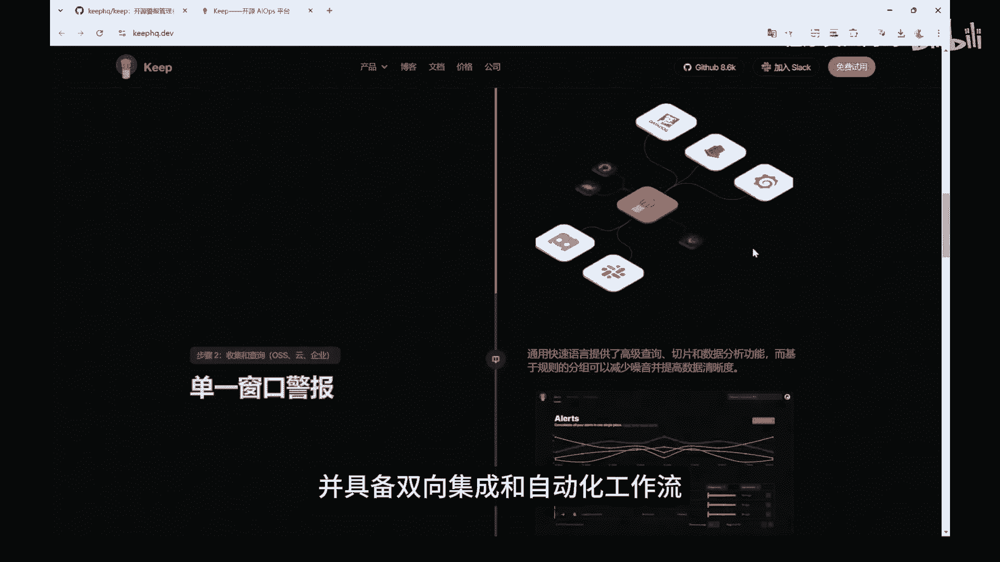

keep支持多种监控工具，数据库和通信平台的集成，可有效降低警报噪音，优化运营效率，除了优化了告警管理流程，key牌通过AI技术，提升了告警处理的效率和准确性，从零构建自己的软件和系统教程。

Build your own，X，项目，收集了一系列涉及各个技术领域的实践教程，旨在帮助开发者从零开始，构建各种技术工具和系统，如HTTP服务器。

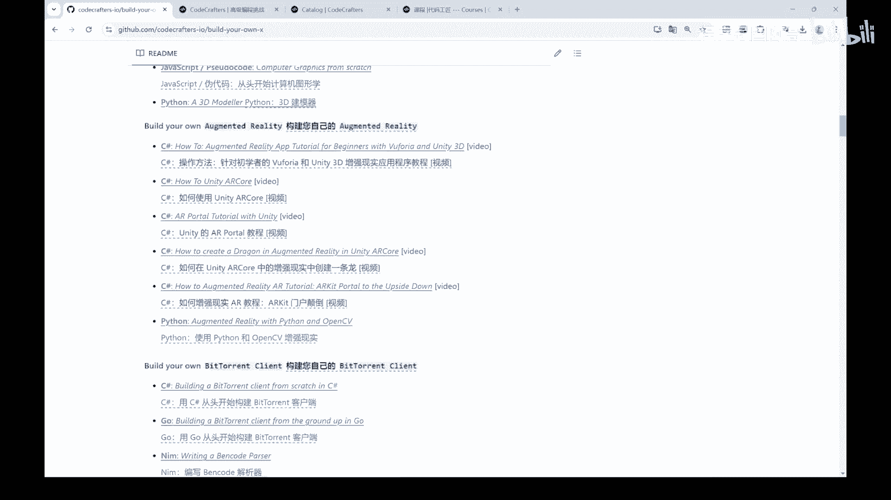

Redis，Kafka，编译器，操作系统数据库等。

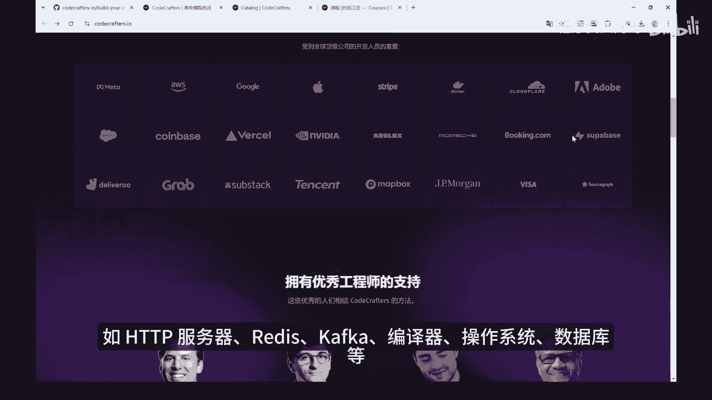

通过亲自动手实现，开发者可以深入理解技术原理，提升编程能力，教程涵盖了rust go，Python js，java等众多语言，并且提供了详尽的构建步骤，以便不同背景的开发者。

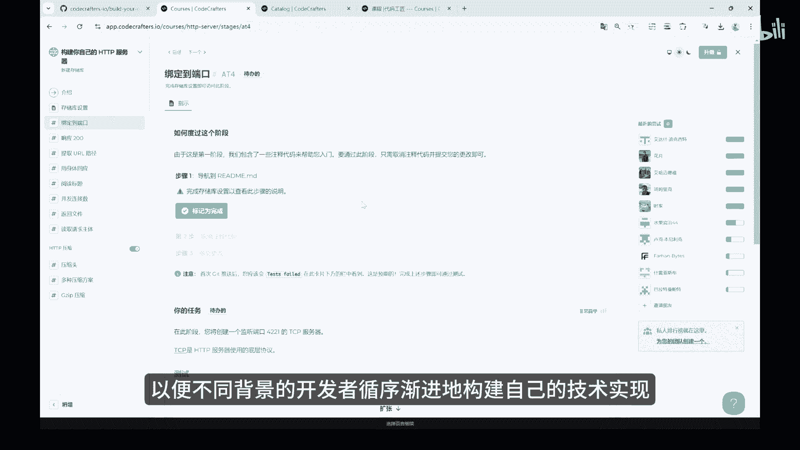

循序渐进地构建自己的技术实现，以上就是本期github weekly的全部内容，感谢你的观看，我是四阿哥。

