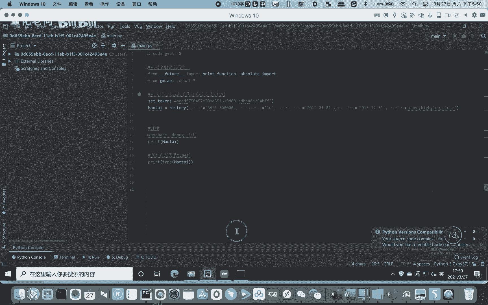
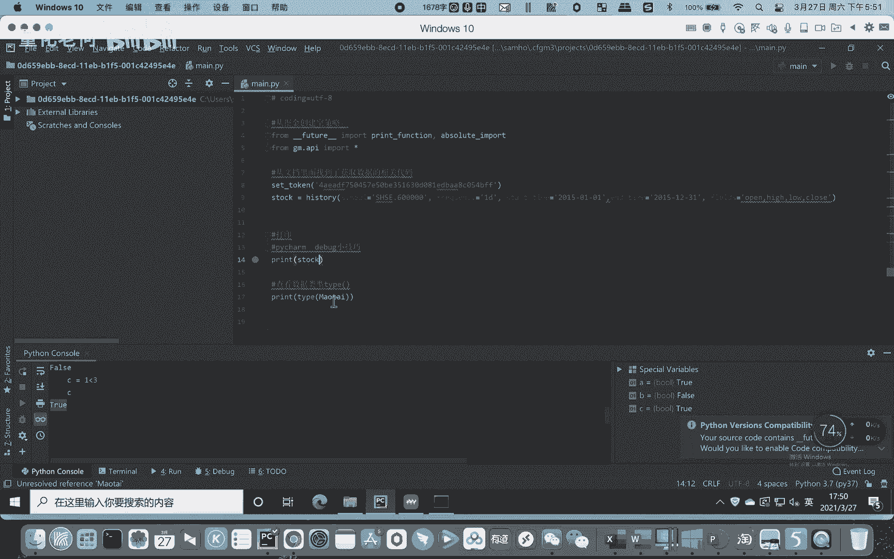
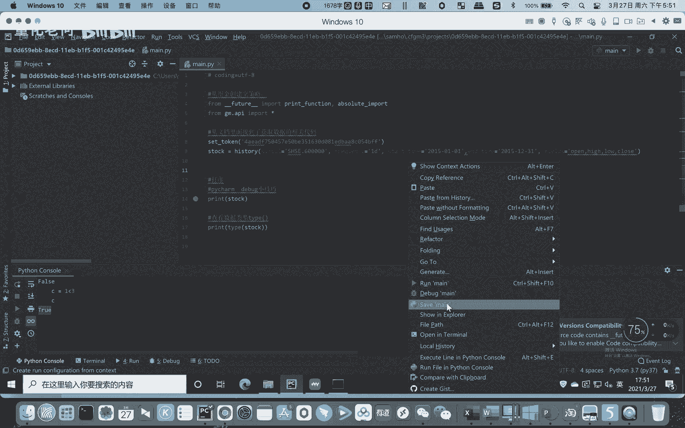
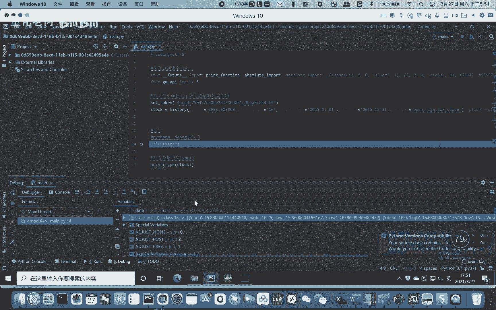
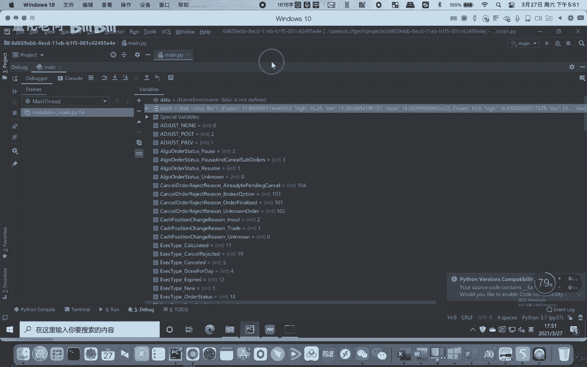
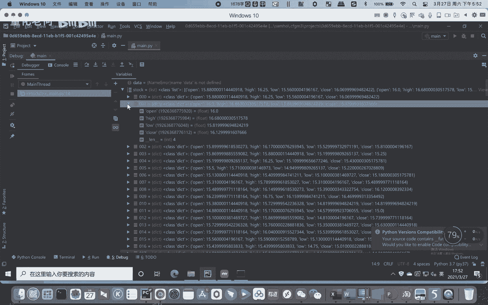

# Python股票实战课程204-数据类型和结构与量化交易的关系 - P1 - 量化老何 - BV18y41187Ep

线的同学们大家好，然后我们之前讲到一些基本数据类型，还有基本数据结构，那其实跟我们量化交易有什么关系的呢对吧，但其实学那些东西那么枯燥，没感觉出有什么用啊，老师你为什么还不教我怎么样弄策略是吧。

所以其实啊，这个我们基本的数据类型和数据结构啊，就是我们的一个打地基啊，所以只有我们对这个基础有充分的了解之后，我们后面做策略，或者说呃做一些代码的编写才会更加方便啊，为什么这么说呢。

啊我们再回到之前我们的的一个实例当中。

是吧，那比如说我们这边呃，显示的这个我们先设置一个断点哈，设置一个断点，我们看看。

设置断点之后，我们还是右键debug调试。

我们希望希望能看一看它的这个类型，右键at watch。

然后大家能看得到，这个是我们获取到的一个行情数据是吧，历史行情数据让我们把它打开。

是吧，首先我们看到这个是什么，这个stop这个呃变量里面放的是什么列表，是不是这里每一个都是一个列表，一共有200多个，因为一年的预数据嘛，然后每一个单独的数据它里面是什么，它是字典是吧，字典打开。

然后这边它有四个key啊，四个key每一个key open开盘价，它的值都是什么类型，浮点型对吧啊，15。88，这里高开高低收嘛，K线嘛对吧，所以说其实啊，你永远都不能觉得之前这些东西是没有用的。

要不然就是我们没必要花那么多心思，让去大家做练习，但如果这些东西你不掌握的话，其实你根本就到后面，你会发觉我们Python的代码没办法写下去啊，所以这个就是一个我们的一个打地基。

一个基础好吧，所以就各位同学一定要好好的完成我们的作业，好好看我们的内容，然后我何老师今天讲的内容呢，其实之前给大家发的那个基础代码里面，小甲鱼老师的视频有更加详细的一个讲解。

但是何老师就会讲的更简单一点，就就小甲小甲鱼的视频，他会给你讲的很细啊，呃就是很全，但是何老师的视频就会给你挑一些重点啊，拿出来是吧，就像我们期末考试之前给大家划重点回顾一样。

这些东西都是我们很常用的东西，所以各位同学一定要好好，完成我们的一个闯关题啊。