# Python股票实战课程205流程控制 - P1 - 量化老何 - BV1BM4m1r7Xt

哈喽各位同学们呃，大家好，我是油量在线的何文峰老师，然后呃下面我们要学习我们的呃第三个内容啊，第三个内容就是循环跟分支语句啊，这是它有一个专业名词了，就是我们的一个嗯称之为我们流程的控制啊。

流程控制就是说我们很多时候啊写代码，它不是一个呃完全的由上往下的一个过程哈，就是他很多时候我们要涉及到一些啊判断啊，或者是一些循环重复的工作的时候呢，我们需要做嘛做一些这样的一个控制结构啊，控制结构嗯。

是我先说循环啊，循环是什么意思，比如说我要从嗯1~10是吧，从一数到十就123456789十，这个就是一个我们一个呃数据范围里面，我们要重复的访问里面的某个呃全部元素，这是一种循环。

或者说我们限定一定的条件，比如说我从一数到十啊，每数一下就给我读出来，所以这个也是一种去限定一个数据范围，在数据范围里面重复的工作，这也是我们称之为一种循环，对不对，那么循环有两种。

在Python里面有一个叫for循环，有一个叫while循环，他们呃各有用法各有用法，然后我这边要给大家做一个演示。

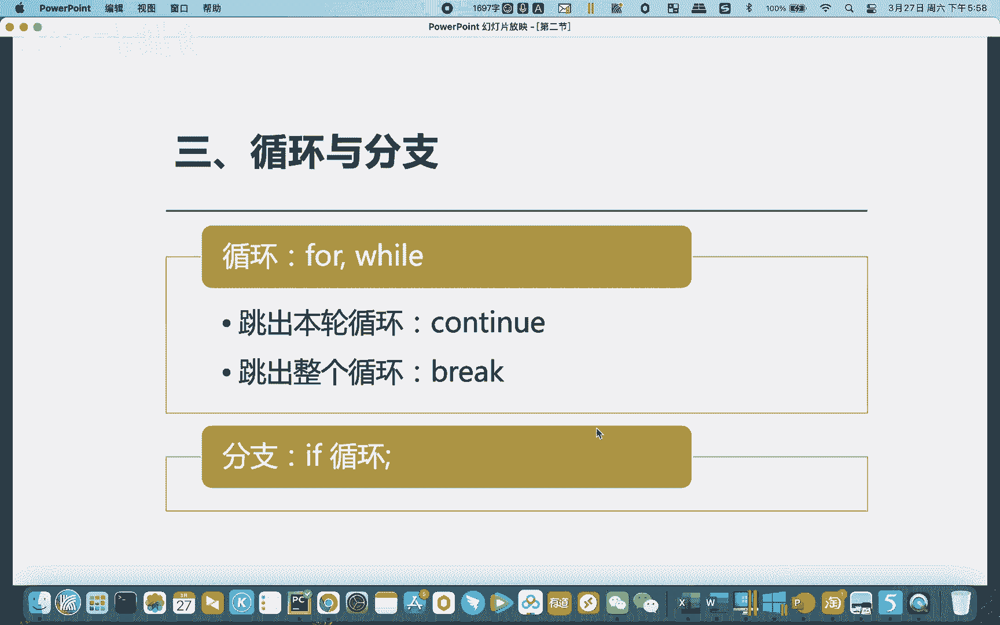

首先我们说for循环，for循环啊，很多时候与列表结合，去便利数据啊，这是我们for循环，比如说我们设置list，EC1等于123456789十是吧，类似一，对吧，他就是这么一个列表。

我们可以用一个简单的办法就是for，I in list1，啊你要这这种做法，你要就是这种写法，你要记住啊，这个没什么好说的，list是吧，后面冒号for i就是你设置设定一个临时的变量。

in list list就是你要便利的对象，后面加一个冒号，要换行，按回车换行，然后print，I，换行再换行，它就运行了123456789十对吧，他就这种就是我们是说循环遍历嘛，便利里面的数据嘛。

然后这个就是OK比较简单。

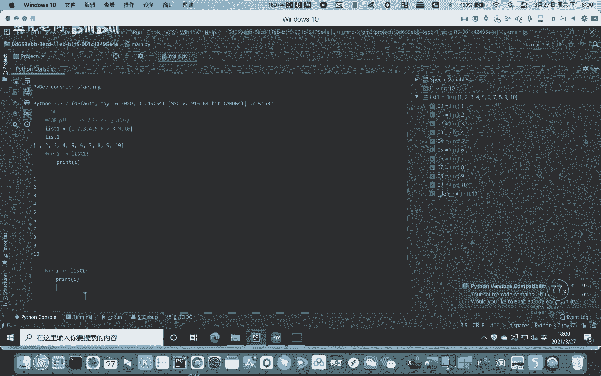

那么while while又是一个什么样的概念呢。

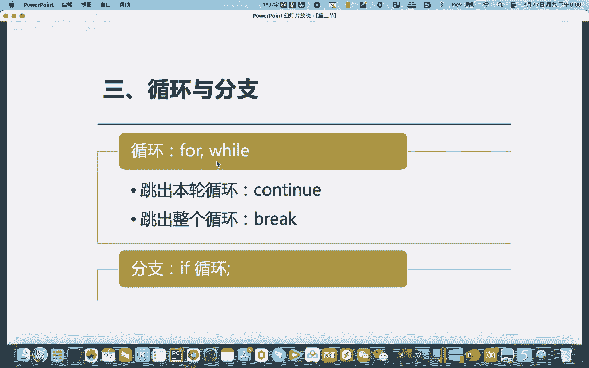

限限定，限定数据范围，数据次数进行工作，这个怎么理解，比如说while，是吧，I先设定一个变量哦，I等于零，然后while，I小于十的话，小于十的话，PRI对吧，他现在是零嘛。

然后我们下面还要对它进行I加等于加等于一，这I加等于一是一种Python的写法，其实实际上你可以I等于I加一，这里面的是一样的对吧，你这样写是一样的，就是说我每循环一次，我就I就给它加一了，对吧是吧。

然后后面会怎么样是吧，他这边就会从10123456789是吧，然后当它大于十的时候，他不满足这个条件嘛，它就会跳出，所以他就限定他的工作次数跟范围，然后再显示出来，这是while的一个用法。

但很多时候我们称之为一种流程控制嘛。

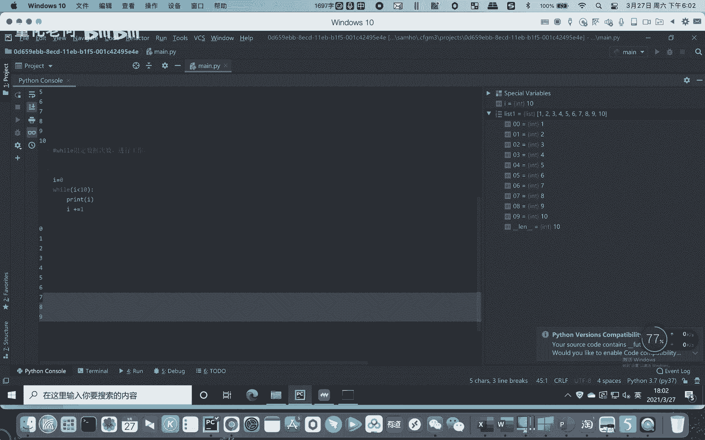

流程控制有些时候，某一些时候就是我们想跳出本轮循环，跳出本轮循环对吧啊，所以这个我们先给大家讲，跳出本轮循环就跳出这个循环。

就遇到一些符合条件的就跳出了，那比如说我们从while这里来看，I小于十嘛，当I等于十的时候，他自然就会跳出了，是不是，但很多时候我们不想等到这个条件，我们怎么办，比如有些时候，是吧，比如说，哎。

if i等于五，这边要注意啊，一个写法哈，当你要赋值的时候是一个等号，当你要判断它们是否一致的时候，你就要两个等号，CONCONTINUE啊，continue好吧，这边是什么意思呢，当它等于五的时候呢。

当它等于五的时候呢，就不要显示，对不对，当它等于五的时候就不要显示啊，其他都要显示，我们看看这个语句是哎，我们再来重置一下，I等于零，因为我们之前加过了，是不是，然后这边我们再来，运行这个代码是吧。

1234，你看五就是没了，就当我们I等于五的时候呢，我们就是要什么跳出本轮的一个循环。

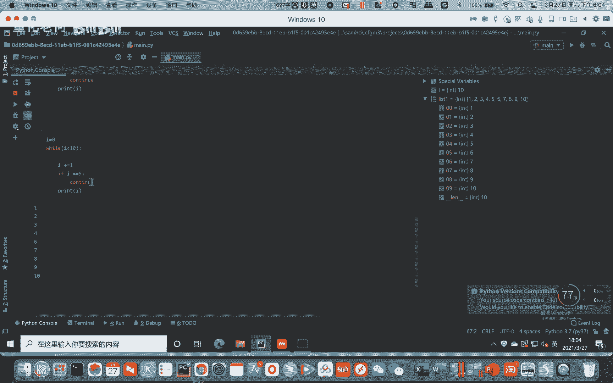

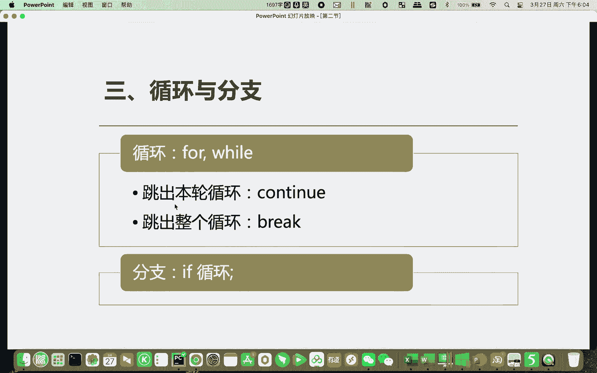

用continue这个语句对吧，这个有意思吧。

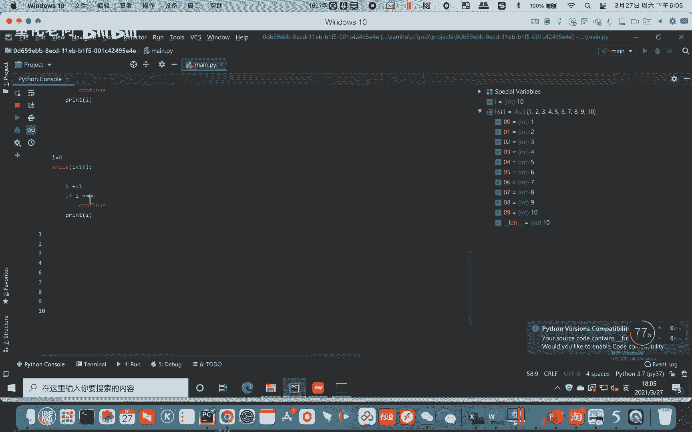

那么当我想跳出整个循环的时候，就用break，只有break了啊。

这个怎么说，比如说我们还是，I等于，复位一下I等于零对吧，因为它运行完之后，它就IH就等于十了，然后这边的话嗯，比如说这里我们用break会发生什么BREAK啊，break会发生什么。

我们看一下啊啊复位I等于零，那么I小于十的时候，它就会循环，但是它I等于五的时候，他就break，我们看下什么效果，所以说OK1234运行到四的时候，再往下它就到五嘛，等于五吗。

遇到五他就什么break break什么意思。

跳出本轮循环，整个循环都结束掉，所以这两个就是我们用循环的时候的一个流程，控制的一个办法。

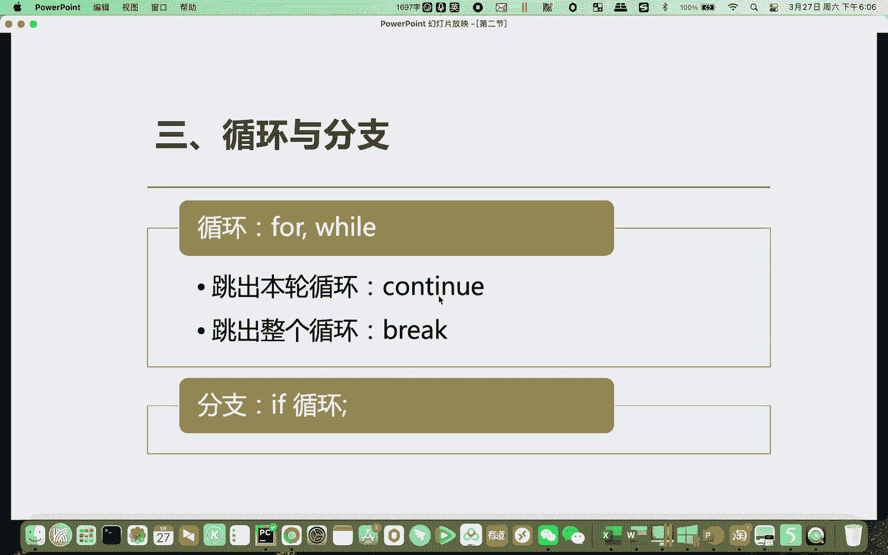

一个办法好吧，然后我们这边也能看到了。

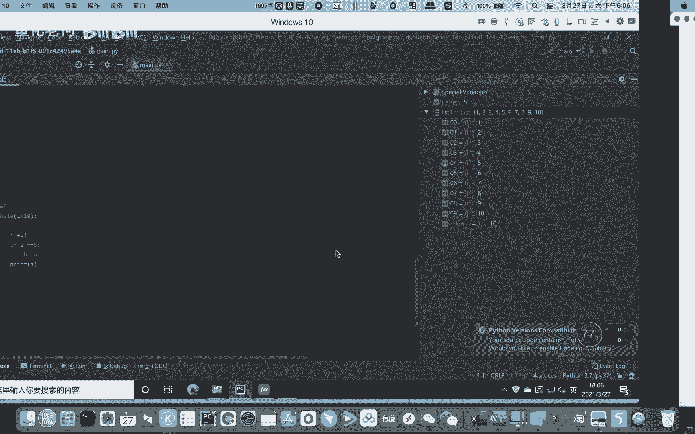

用了一些呃分支的语句，就是用if if语句就是用来分支。

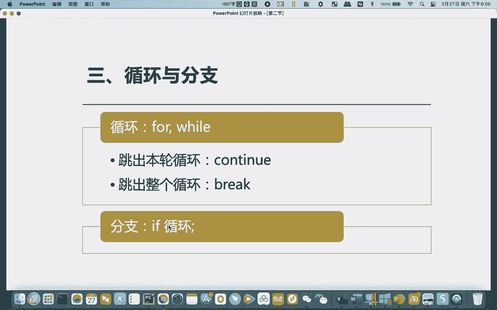

用来分支，那么这个又是一个嗯怎么样的一个方法呢，if在我们语句里面非常常用的，比如说我们if哈，首先我们呃一个变量，一个变量A等于十是吧，然后我们if a等于，零的时候加一个冒号啊，这里一个等号。

两个等号我们要判断是不是，所以两个等号if等于零，等于零是吧，然后呢下面else，A不等于零是吧，就很简单，就是这个就是我们的一个标准的一个语句，就是A当if if后面就是一个判断的条件对吧。

判断的条件后面加一个冒号啊，下一个下一句就是我要执行的一个语句对吧，if a等于零的话，显示等于零，else else就是否则啊，否则就是如果它不符合这个逻辑判断条件，不符合。

如果跳到else这边运行这个语句，我们看一下，就很显然他是A不等于零对吧啊，如果我们复制一下A等于零的话，A等于零，我们再来看看这个语句，A等于零，它就判断符合来运行这里。

那很多时候我们可能遇到的情况很多，可能中间我们还会多一重判断啊，多重判断这个是什么样的呢，Else if，else if if这这这里是两重分支啊，这边就三重分支了啊，三重分支是吧。

这边就是那么A等于零，A等不等于一呢是吧，Print a，A，等于一是吧，A等于一嗯，OK那这边的话呢肯定如果这两个不符合，才到第三个嘛，A不等于零，也不等于一，所以这个明白它里面的关系吗，对吧。

比如这里就逻辑逻辑条件它一重重来好不好，就这个逻辑条件符合它就到这里啊，如果这个不符合他到下一个逻辑条件，那等不等于一呢，那等于一，它就显示这里，如果这两个不符合它才会到else这边，大家明白我意思吗。

所以这个就是一个三重三重嵌套的一个额，就三重分支好吧，比如说我们这里A等于A等于零的话，他这边就是等于零了，A等于一的话，复制一下一，我们再来运行一下，以A等于一嘛，是不是，那我们现在就是A等于三。

A等于三，我们再来运行一下啊，就A不等于零，也不等于一，所以这个这个就是做法，那么你还可以共鸣，是啧，就是我们还可以有三重四重else if是吧，这个的嵌套啊，你可以重复的做无限做啊，所以这个A等于五。

这个行不行，这个也是一样的啦，是不是这个你可以多重啊，多重分支，这个都没问题了，就是做法都是类似的，做法都类似的，这个就是一个他的一个if，是我们Python里面分叉语句的一个做法，好吧。

希望这个例子能让大家明白，然后后面我要给大家设置一个啊动手闯关啦。

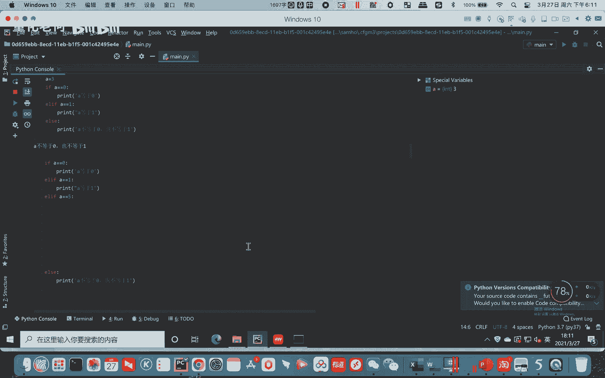

闯关就是我只要做一个就好了，列表，list1等于123456789十，十一十二十三，利用循环和分支语句，找出可以被三，整除的数值，并print好吧，这个很很很简单嘛，这个就是大家都理解啊。

先给你定义一个列表，然后你用分支和循环语句，然后找出能被三的整除的数值啊，六能被三整除，那369 12都能被三整除好吧，就把这几个数字打印出来，这就是我们的一个闯关题。

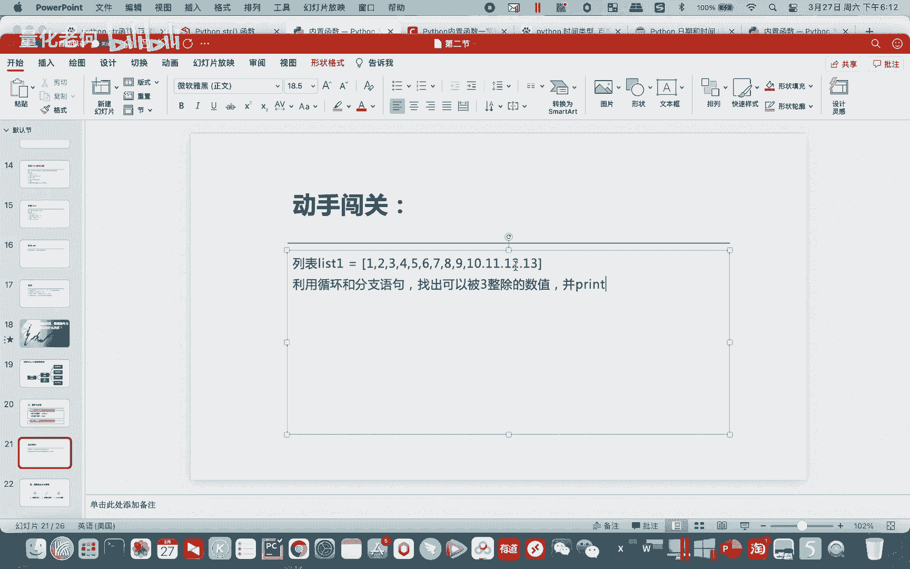