# Python股票实战课程206函数 - P1 - 量化老何 - BV1Ry41187pg

哈喽各位朋友大家好，欢迎各位同学回到我们的课程当中，然后呢我们又开始新的一小节的内容啊，我们这一小节就是给大家讲讲，我们函数的定义和调用，还有我们在定义函数的时候。

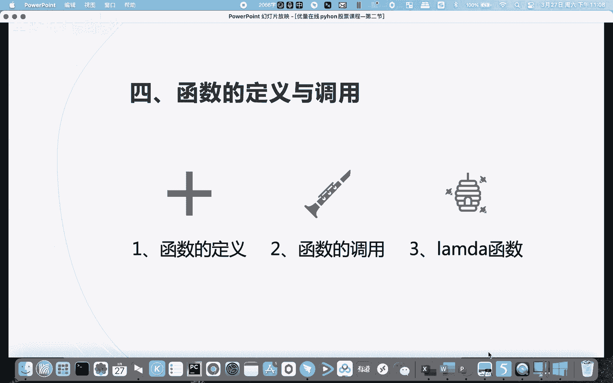

需要注意的一些地方。

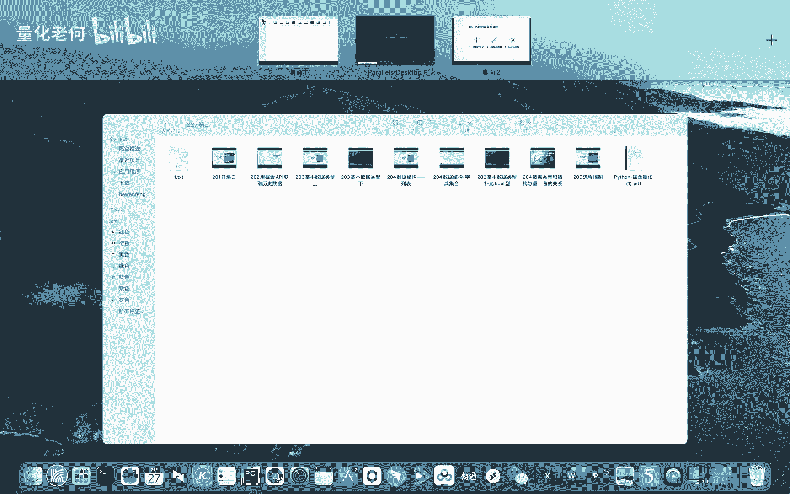

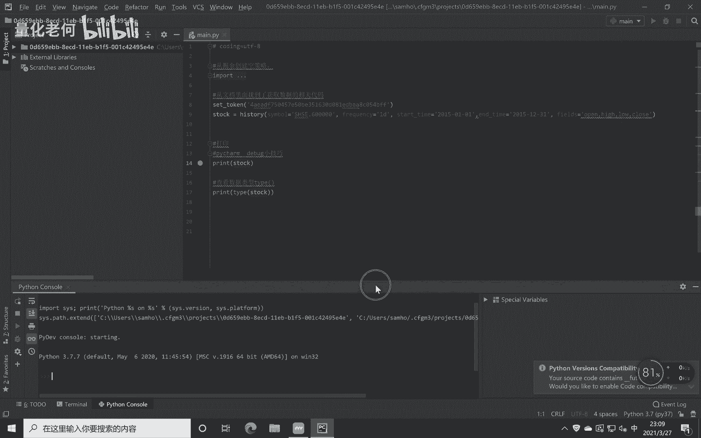

那么啊到底什么叫函数呢，函数就是说我们之前不是也写了一些代码段嘛，对吧，我们写代码的时候呢。

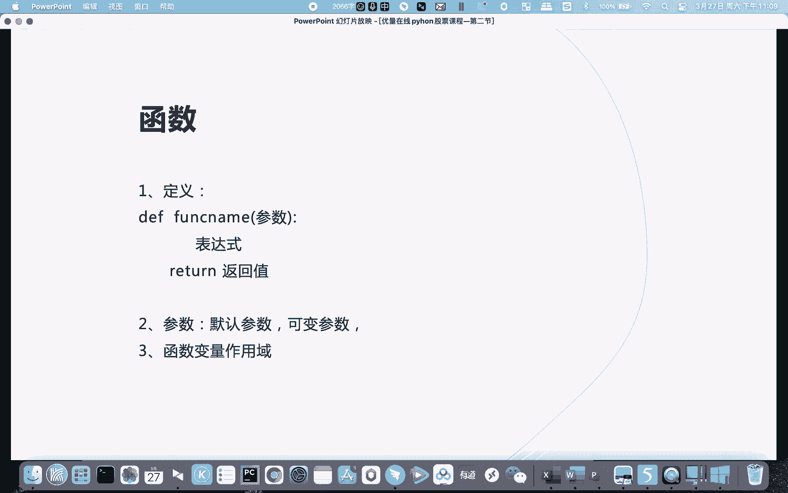

嗯就是之前是在这边写是吧，在这边写，写完它有你输入一些内容，他就给你反馈，但是它并不会嗯给我们彻底保存下来对吧，所以很多时候我们想呃，把一些代码封装到一个代码段里面，后面我们调用它就好了。

就不用反复的去呃复制粘贴代码，所以这个时候我们就需要去写一些啊，写一些函数啊，把代码封装到一个函数的样式里面。

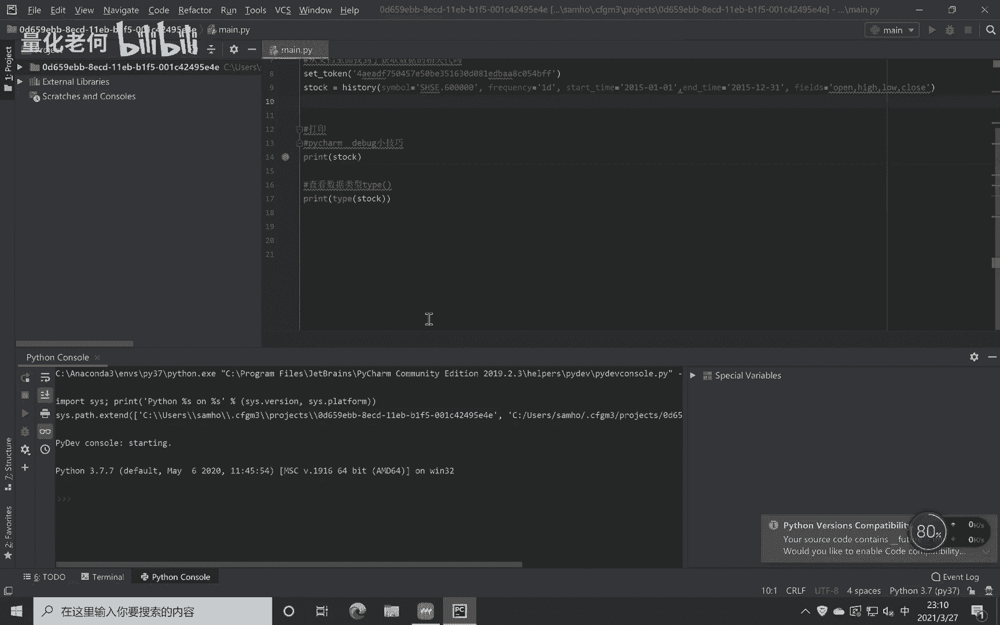

函数的定义是这样子，前面有一个关键字叫DEFDEF，后面就是函数的名字，然后呃一个小括号，小括号里面可能会有参数哈，然后再最后一个冒号，下一行就写一些表达式，就是我们处理这么一些函数啊。

处啊处理呃处理数据的一些代码段啊，这个表达式写完之后呢，又通过一个关键字叫return，然后把处理好的值返回给上一级调用它的函数，那么我们这边呢就呃写一个。

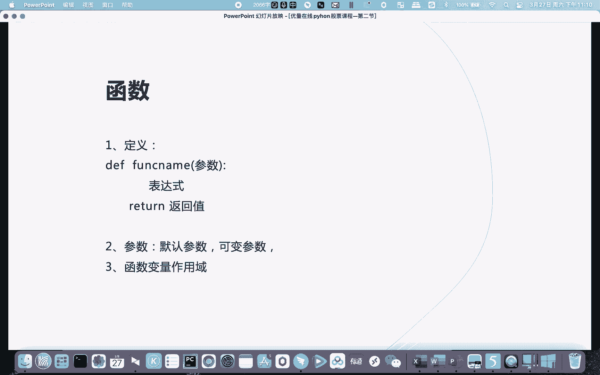

就比如说，我们在一个哎用掘金啊，用掘金，上次我们获取历史数据的这么一个函数，这边我们右键新建一个，叫做FUNC的一个Python的文件，好吧，那这边就有一个函数了对吧，然后呢这边我们就是可以写一些函数。

那比如说嗯我们现在要编写一个编写一个，函数啊做一些算法运，就是做一些算额数学运算吧，啊DEF是吧，关键字，然后呢我们用一个呃DS，的这么一个函数，后面呢我们设置一个参数X，然后加一个冒号。

那这边我们需又要用这个函数来干嘛呢，我们用来between，我们就是return啊，然后然后二乘以X加一对吧，就是这边就是S参数，就是输入端嘛，我输入一个数，然后你给我返回return啊，这样写不太好。

我们加一个中间变量，加一个中间变量，就是哎A，那么输入端就是这个X然后我们二乘以X加一，然后赋值给这个变量B是不是，然后我们再返回B就可以了，然后我们这边调用一下啊，电一下，这里我们输入MAIN啊。

然后下面它自动弹出啊这么一个啊，下面一个提示符，我们鼠标点击一下，它就变成了这样子，这个就是我们呃这个程序的一个入口函数，我们运行这个程序的时候，它会自动的跳到这边呃，让我们呃运行里面的代码。

然后我们就是用呃print，然后DS，我们输入一个五吧，好输出啊，DS啊，五我们把这个函数里面输入一个五进去，再打印出来，然后我们右键运行一下，啊是吧，那这边就返回一个11了。

就是2×5加一就等于11啊，那这么一个函数啊。

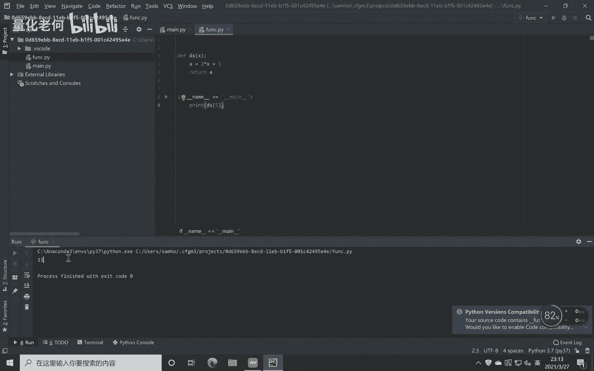

就大大家看到首先它有个参数啊，中间有表达式，有返回值，这就是我们函数的一个定义。

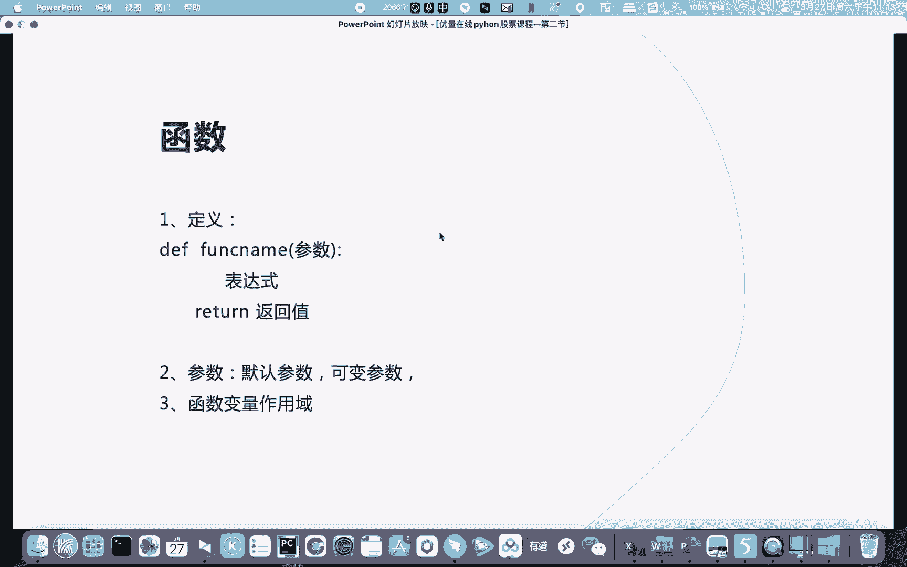

后面的话呢其实调用也很很简单是吧，我down的时候直接用到函数名，然后把输入把那个参数输入给它就可以了，呃也可以把它就是tap等于DS，三啊，然后再输出这个tamp其实也是可以的，是吧。

那2×3加一就等于七了，那time就等于七，然后我们就是可以看到设一个断点就能看得到，也能看到他的一个一个变化的情况哈，那这边我们设置两个断点，在return这里设置一个断点对吧，设置完断点之后。

我们右键用debug fc，那他就来到这里了，他告诉我们额我们调用这个函数的时候呢，把三传过去，那X就等于三是吧，然后A就等于23加就等于七嘛，最终返回这个七啊，返回给上一级。

就是把这个这个七就返回到我们这个tap，这里了啊，所以大家都能看得比较清晰哈，那跳到这边那time就等于七了，然后再plan出来，所以我们就用了一个函数，就是设置两个断点，再用debug。

就能看得出它整个呃，我们一个函数流程的流动啊，我们这个整个程序的一个流动是怎么样的，这也是一个小技巧，OK然后要给大家讲一个呃参数的问题。

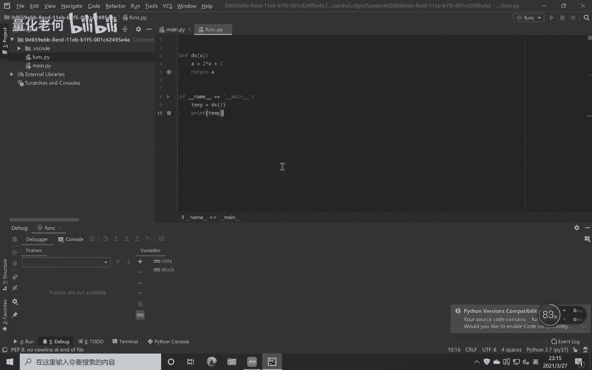

这个参数呢嗯首先要讲一下。

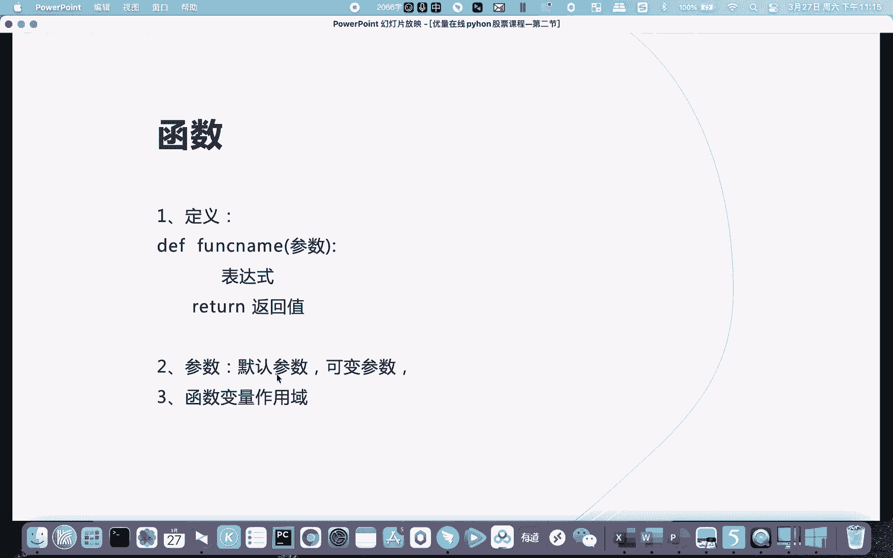

就默认的参数，这个参数也是大有学问啊，那我们这边改装一下X如果是等于一的话啊，那这边我定义的时候X就等于一，先把它赋个值，那这是有一个什么样的作用呢，这是我们这边就可以不输入一个参数，我们再来运行。

对吧他这边就是等于三了等于三了，就我们看看到底是发生了什么事，用debug模式啊，我们这边看到他X就等于一了，哪怕我们这里调用它的时候没有赋予一个值，但是他这里呃。

这个就是一个我们称之为默认函数的一个做法，我们在定义的时候呃，默认给它赋赋一个值，那么诶我们哪怕我们在调用的时候不给它赋值，它就默认的调用这个呃默认的函数啊，如果我们这里就给他弄一个八，我们再试试看。

如果我们外部有函数输入的情况之下呢，他就不会用默认函数，用我们外部输入的一个函数啊，他就是这个意思好吧，这个就关于嗯，关于我们一个。

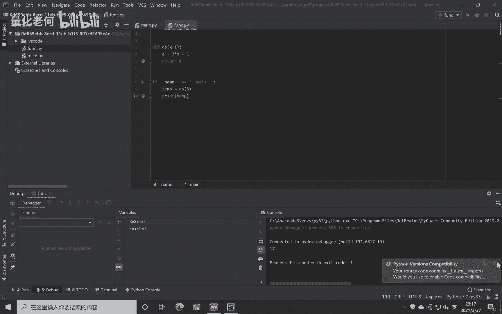

一个默认函数的一个讲解哈，呃这边呢还要讲一个讲一下我们这个可变的。

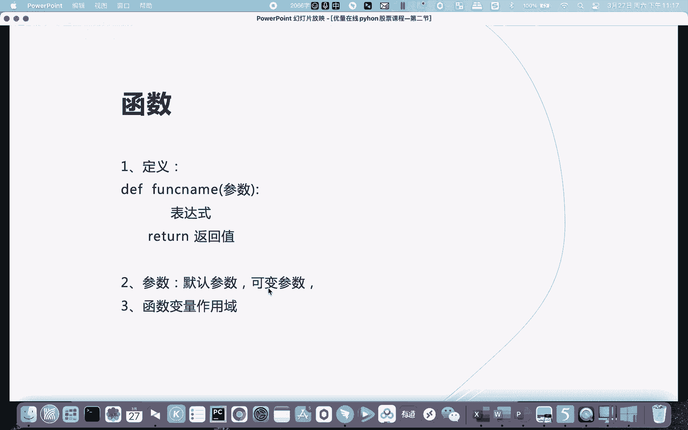

可变的参数，就有一些时候啊我们需要输入多个参数的时候，那这边有时候我们可以输入多个参数，参数也可以有多个啊，e f at是吧，ADD1给他定义多个参数，a add1哈。

那这个呢我就这里输入A加A跟X跟Y了，X跟Y对不对，然后冒号啊，下去下去我就用一个哎，哎that等于嗯，以下等于X加Y，然后再去哦，不好意思，可能我X加Y了，这么奇怪，X加Y。

然后这边就是一个return啊，我这里应该用了中文的符符号DEF，return就是return3就是一个加号，是不是，那我们这边的话就是用呃，这边我们就用ADD a h d1哈，然后三是啊。

我们也是在这边设置一个参数，哎小心啊，这里我们Python编程的时候要注意一点啊，就是呃我们Python就是需要这个空格要对齐，你不不可能随便在一个地方多一个空格，要不然它会报错哈。

然后我们右键用debug，那么很简单啊，我们用上上面就调用这个A1是吧，然后三四那S就等于3Y就等于四了，最终记出来1S就等于七，那这就是一个两之前额上面D是一个参数，这边是两个参数，那如果是三个参数。

也是差不多这样子一个调用的形式，但有一种额就是，有一种参数比较奇怪的，有一种函数就比较参数比较特殊的情况，就是你很多时候，你不知道自己会有多少个参数啊，那这个就有点麻烦了，这个我们要用到一个称之为。

可变参数的东西啊，这个是怎么用的呢，DEF比如说，这个时候我们调用一个新号，然后加一个PAR，是不是，然后这边呢就是我们就用哎，lab函数就就看它里面到底有多少个的意思啊，输入了，个参数。

Format a，好嘞，那这边的话就没有return了，return0啊，那或者这这一句不，如果你没有返回值的话，这句不写也没关系，那这个就比较特殊了，就比如说我们这里FUI比赛，那这里的。

所以我们12345678是吧，八个参数进去，然后我们这边设一个断点，看看会发生什么什么样的情况啊，啊，那这边的话呢，我们就发现这边他就变成了一个叫TUBTOB，就是一个呃元组啊，元组跟列表差不多。

然后他这里就是我们输入的参数都去到这边，然后变成一个元组输入到这里，这个PAR我们看到是吧，它变成一个数列的一个形式啊，输入进去，然后后面呢就是LN就是看它的一个个数嘛，啊LN个数是八。

然后就是输入八个对吧，你输入了八个参数啊，然后返回零就是time就等于零了。

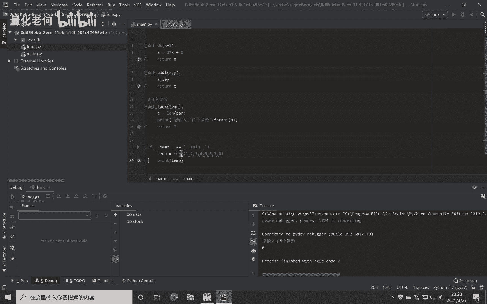

所以这个就是一个呃可变参数的一个一个方法，然后然后下面呢就是一个函数变量的一个作用。

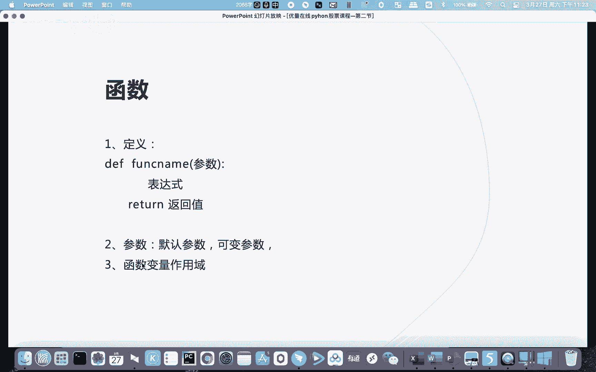

那这边呢就要讲到，里面的一个变量作用域的范围对吧，变量作用域的范围啊，那这个就是，需要需要给大家讲一讲哈，那比如说我们再定义一个函数EF啊，然后ABC不要用这种名字，比如说FUNFUN3啊，然后再给它。

嗯嗯我们不就不输入参数了，这里就是我们在外部输入一个变量，比如说这个是A等于啊1万，然后我们就是在里面A等于0。1，然后再，然后就没有返回值啊，就是这样子，我们这边就是，放三是吧，然后正常来说是这样啊。

我在外面定义了一个参，就是一个变量，然后这个fund里面我把这个A是吧，变成0。1，然后我们这里没有返回值，就不用，然后我们再把A就是打印一下哈，就看看我们函数内部能不能就是改变函数。

就是它这里的A的这个值是吧，我们来运行看看，右键运行，啊我们会发现这边呢，就是这里这边还是1万是吧，还是A还是1万，这个0。1并没有改，这为什么呢，因为你在函数内部的函数的作用域，只有在这个函数里面。

你出去的话就没有了，那比如说我们这里设置一个B，是不是我在里面函数里面定义了一个B啊，然后这里输出B它有没有问题呢，打印一下，啊他这边说B你没有定义，name b没有定义。

那说明其实你那个在函数里面的一个，变量的范围仅限于你函数里面，那当你函数外面的话呢，你是不能去访问的，OK不能去访问的啊，所以这个就是一个呃函数作用域的一个范围，那么这边就给大家讲。

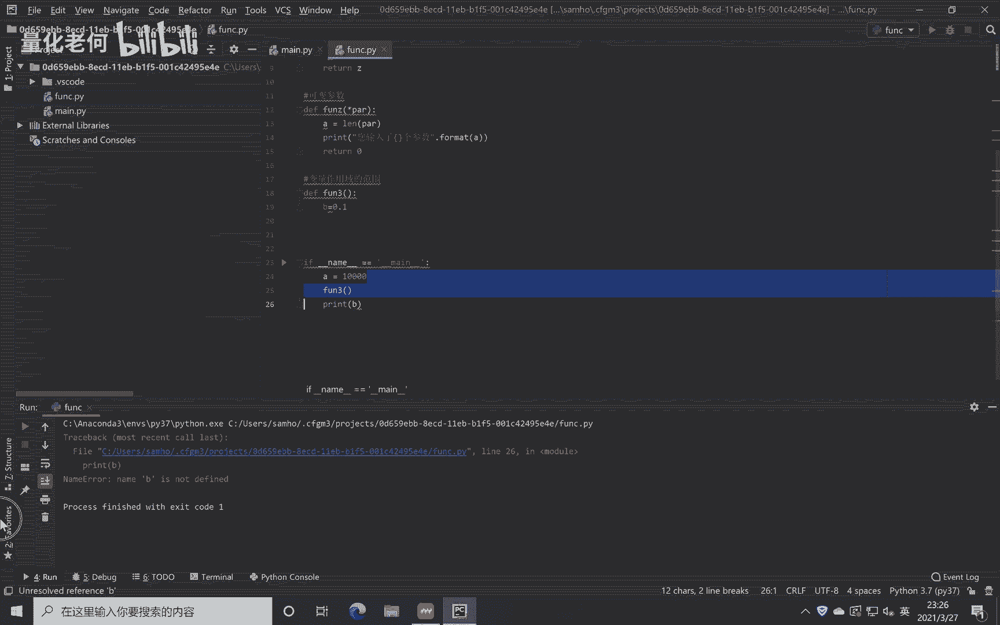

就是简单的讲讲这个函数了是吧。

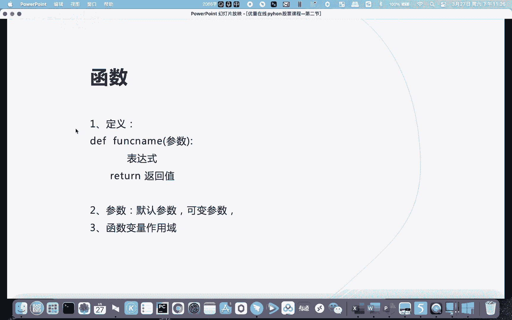

然后这边调用的方法也给也给大家演示了一下，怎么样去调用啊，未必会有返回值，但是有返回值的时候，你也要知道去怎么处理。

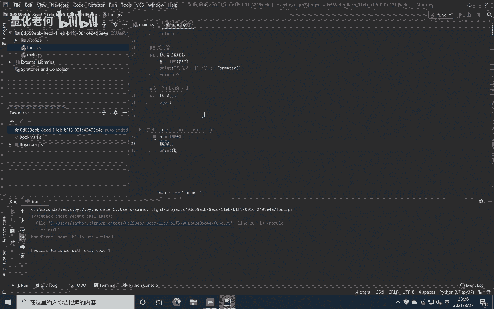

OK好函数这一块就讲到这里，然后要给大家讲讲这个拉姆达的一个表达式，哈拉姆达的表达式，比如说嗯我们DS的一个我们DS啊，在DS里面有一个这样的一个，就是刚刚写了哈这么一个函数啊。

就其实有一些时候我们就感觉哎呀，就是去每次都要做一些函数运算的时候啊，都要去定义啊，定义了又要又要去调用，感觉很麻烦，我能不能写成一句，这是Python里面就有这样的一个语法。

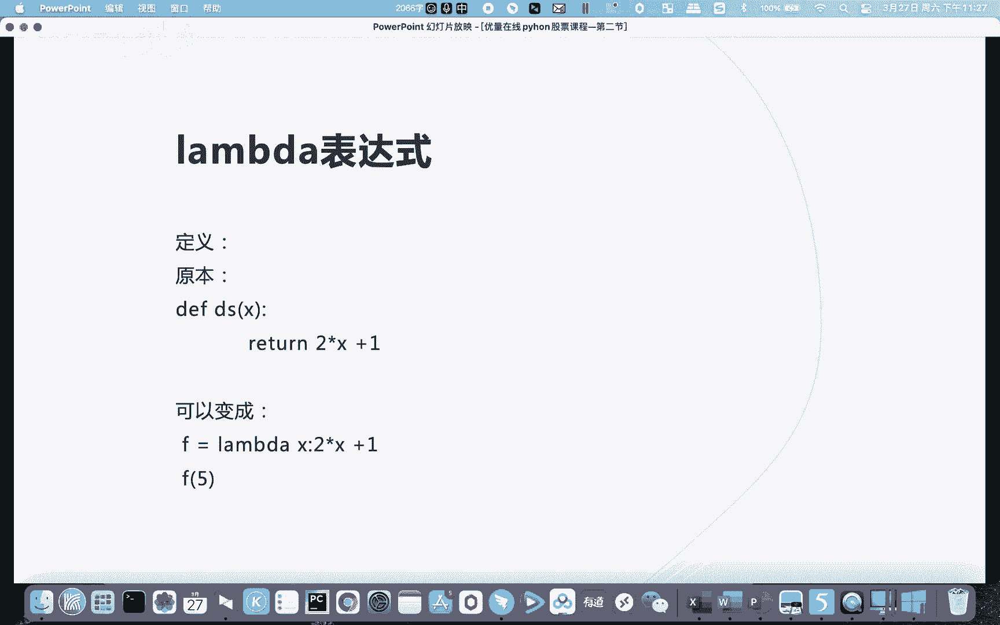

我们来看看，就比如说嗯，哎一个result，就等于啊，DS我们就有一句话要写成等于拉姆达，啊比如说FUN，是吧，Reshell，S t，等于拉姆达X就是，等于number法xx的话，它就等于嗯。

就等于2X加一，是吧，然后这样子的话我们就是直接一句话就写完了，就是没有，就是他就这一句话的意思就是说这里输入一，然后你给他返回就返回2X加一啊，把它定义到这个函数里面，然后我们现在试试看F方式。

我们再来输出一个，比如说五吧，对不对，然后这边一个直接打印就好了，就11了啊，这边的话就不用就是一种我不用，就是用一用一个标准的函数的形式去把它写，我用一一行就快速的进行定义啊。

那这样呢就这样那么大的函数就是这个作用哈，就让你发快速的用一句话，创建一些比较简单的一个函数呃，另外也要注意啊，就是这种情况又那么的函数，一般适用于我们就不会复用的一些代码，比如说这个代码。

我这里可能哎这用用用完就好了，我就不想特意去写个函数是吧，就可能是这些代码比较简单，我用一次就好，我不用去再去重新弄个诶DFFUNFUNK啊，然后再去调用它，这是一个快速的创建函数，调用函数的一种方式。

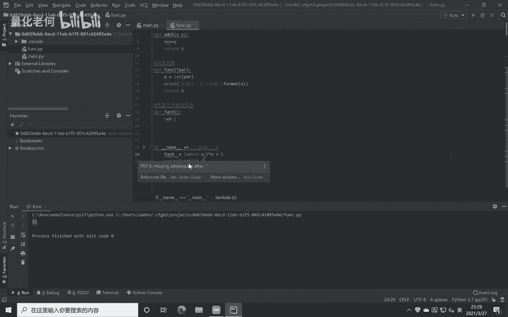

那么好，那么这一种就是那么大的一个表达式啊，然后这边有一个闯关啊，闯关这边呢就是大家能看得到呃，比如说像我这里就是创建了一个FC。

然后写了几个函数对吧。

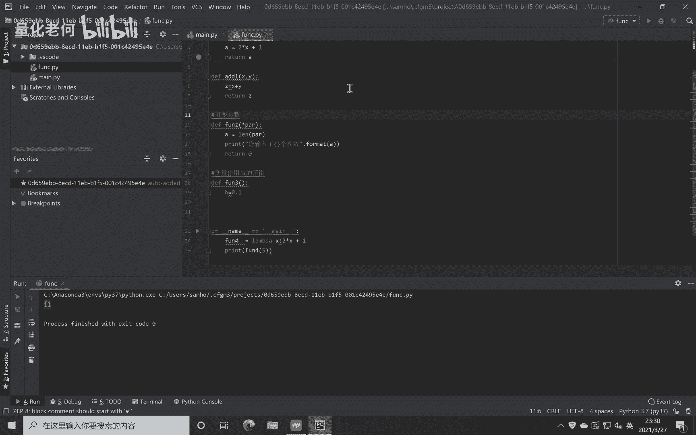

然后也用这种慢的方法定义，那各位同学参考我视频的做法呃，也完成这四个闯关题啊，四个闯关题，然后这边要讲的就是一个，啊前面三个应该都会做啊，那第三个就是要用到上一个小节的一个呃集合。

set的这一个知识对吧，然后他输入的是一个列表，返回的也是一个列表啊，这个没什么问题，然后这边下面下面就是要用到一个关键字，可能就是一个MAD max，一个关键字给他讲展示看看吧。

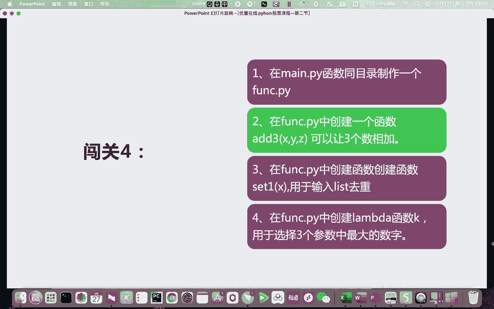

很简单啊，这里就是一个MMAX啊，max啊，它本身就是一个关键词，那你可以弄去弄个啊，max1也行，max等于123啊，然后这边就是，运行看看，啊这是会选出一个最大的数出来了，那你自己弄的话呢。

你不能你诶，你调用的一个函数名不能跟他一样啊。

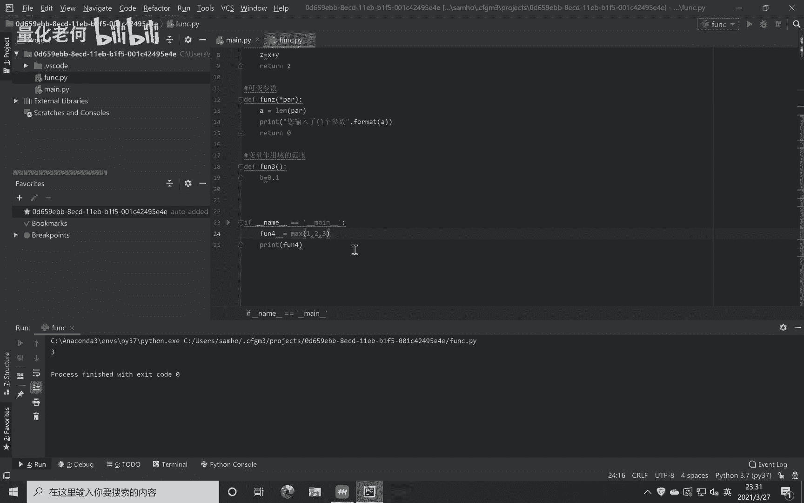

哦这个那么大啊那么大，Ok。

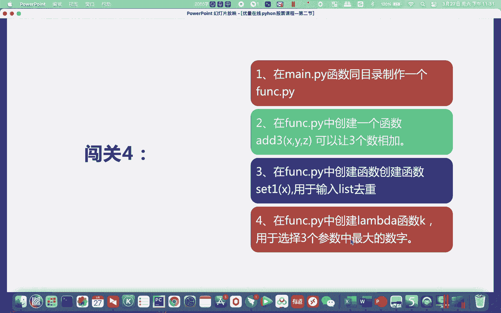

要那么大没有函数名啊，就是你这边要知道这个关键字才能做第四个。

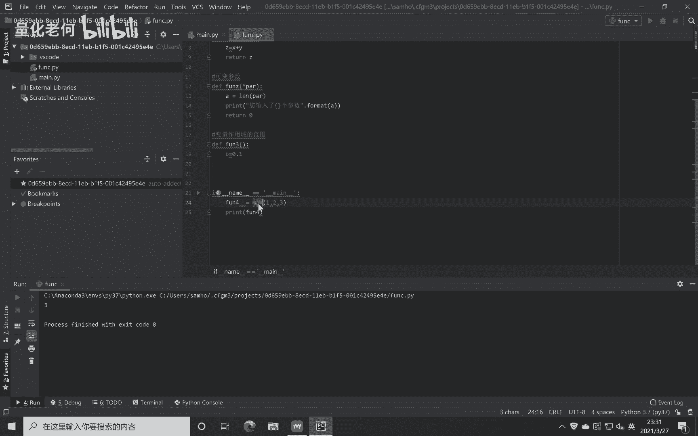

第四个小杰的哈，小杰的这么一个闯关好吧，然后OK那关于函数就是讲到这。

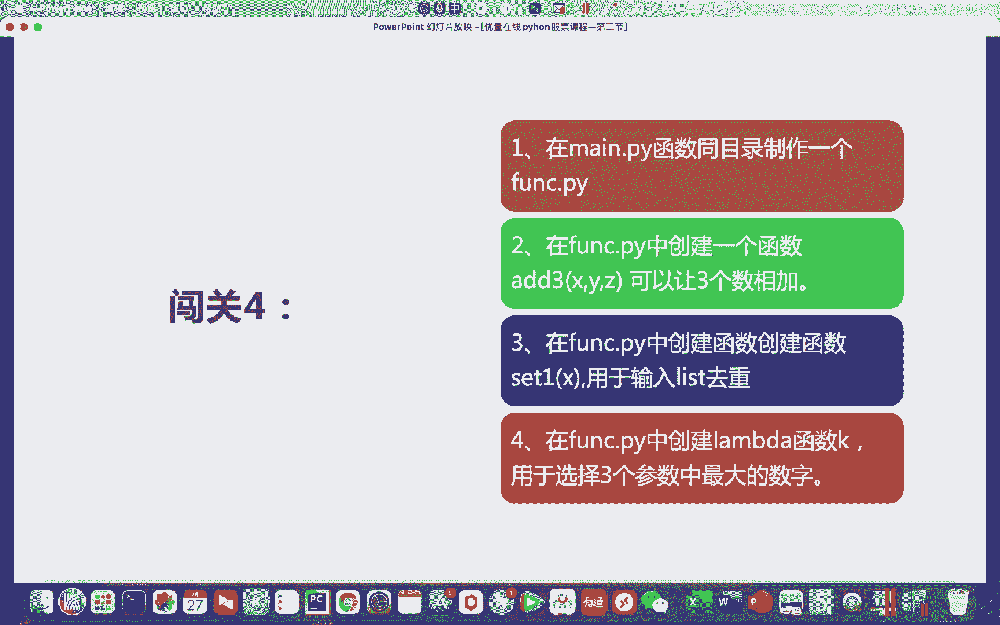