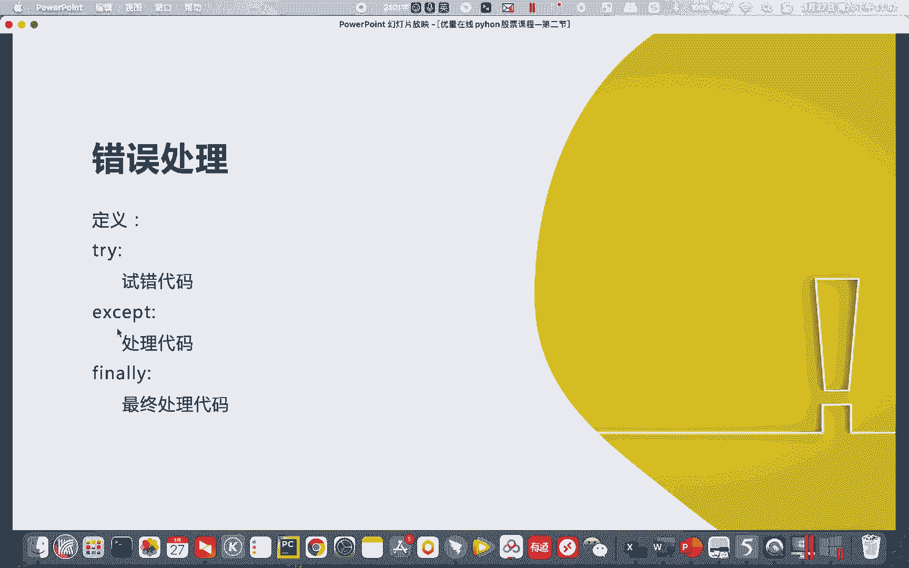
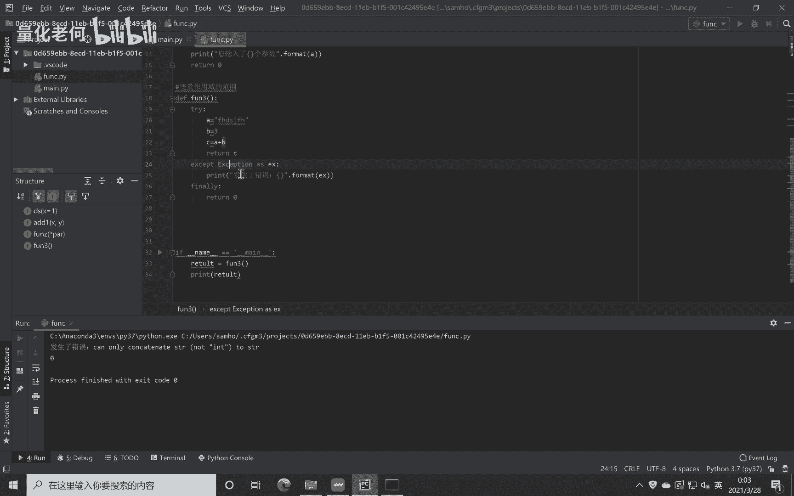
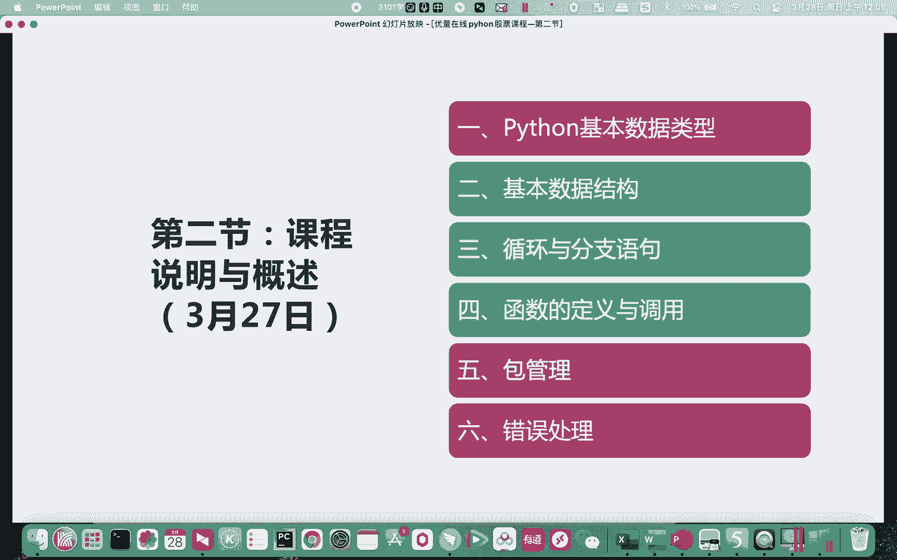
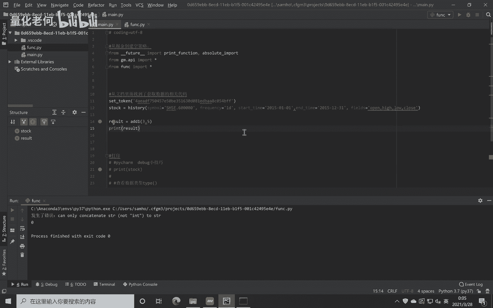

# Python股票实战课程208错误处理 - P1 - 量化老何 - BV1db421v7c7

好各位流量在线的学员，各位晚安，然后现在不知不觉录课程也已经录了一天了，然后我们终于终于到了最后，今天最后一个内容就是一个呃抽处理啊，抽处理嗯，我们先跳到相关的一个PPT。

那么很多时候我们写一些代码对吧，写一些代码在调试上面，如果我们代码量稍微大一点，就会呃遇到一些问题，有一些时候我们是不知道某一些函数，会不会有错误，或者说它出现错误的时候。

我们希望他能按照我们的想法去处理的时候，我们就会用到一些呃错误处理的函数啊，错误处理的函数就是用try，然后一些试错代码，except一个处理代码，后面这个finally呢其实比较少用啊，一般就不用啊。

一般就不用，就try跟except就能呃，基本上做一些基本的错误处理。

那这个是怎么用的呢，那比如说我们这边有一个，这边我们用这个放三啊，放三，比如说我们写一些错误的代码，错误的代码，错误的代码怎么写呢，A等于你好是吧，B等于一个数值，C等于A加B。

然后我们return c这么一个代码啊，第一个是一个STR是一个字符串是吧，第二个是一个整形，我们用一个字符串跟整形加起来，它肯定是一个错误是吧，因为它你不是记，你如果是呃，如果是两个都是字符串的话。

它就会它会加起来，它会把它串在一起，如果这两个数字的话，他会进行数学运算，但你把这两个加在一起，他肯定会报错，那我们试一下啊，有没有报错，就是我们excel，等于放三是吧，嗯运行一下，啊对吧，红色字了。

tap f错误啊，类型错误，你不能让一个字符串跟整形相加是吧，不能相加好，然后呢，我们现在要进行一个错误的处理了，try啊，各位同学要注意啊，我们Python里面其实是其实是有一个。

没有一没有太多的括号，是不是，但是我们有一个语法就是要对齐，比如说这边try下面就要对齐啊，print f发生了类型，发生了错误对吧，EXCESSIONXX1X对吧，就把这个错误的类型啊。

把错误的类型记录下来，点format，这个plant值得跟大家一说啊，那这边就是一个双引号，中间一些就是字符字符字符型的文字嘛，然后点format，就是我要在这个括号里面填这个es的内容。

我们现在运行看看，好那么这边就没有红字了是吧，所以所以说它就是他就是没有一个错误，没有错误是吧，就其实发生了错误，发生了里面啊，正常来说如果你不加try，它会一串红字，但是现在的话呢他哪怕发生了错误。

它就不会一堆红字，它就会自动的跳到这边运行这一段代码是吧，发生了错误，这边也告诉你这个错误的原因啊，然后假如你这里是一个没有错误的话，那是怎么办呢，比如你这里是一个五是吧，再运行，对吧。

然后我们再PRAN一下，Result，啊你把它变成五，它没有错误的话呢，他直接就不会运行这下面的这些东西了，对吧，不会运行下面的这些东西了，然后呢哎这边的话就是就是正常通过运行，这里就返回就可以了。

就没有运行到下面，那么finally又是怎么回事呢，Finally f i finally，最终那比如这边呢，最终我还是要返回return0对吧，一推零，就比如说我运行这段代码，但是我遇到错误的时候呢。

你给我反馈，最终我也是我最终还是要一个返回值，这个返回值就是零对吧，我们再来运行一下，比如说这里遇到错误了，他就运行了这一句对吧，运行了这一句，然后最终他还是有返回值，返回零对吧。

我们还是这个excel还是有赋值，然后把它打印出来，所以这就是我们的一个错误处理的流程，有一些我们写到最后代码量很大的时候，我们就非常需要这样的办法来处理我们的函数，因为你真的不知道你代码量一多。

你真的不知道他是中间会出现什么幺蛾子，比如说我们有一有些时候获取数据的时候，又或者是一些网络原因导致了我们一些错误，你你在正常编码的时候，你没办法去去完全避免这些问题，你只能是通过这样的错误处理的手段。

对你的一个嗯函数的处理流程做一些优化。

或者是一些加固，Ok，所以这个就是我们的一个错误处理的一个代码，那么好了，那么我们今天的主要内容就讲完了，这个Python的基础内容讲完了，那么有一些有过其他开发的一些朋友就会说，哎呀何老师。

你这就讲完了，不会吧，你面向对象都给没有给我们讲呀，这个怎怎么搞，是不是呃，为什么没有讲呢，就是如果我们立足于掘金这个平台，其实我觉得我们没有必要去折腾，这个面向对象啊。

如果各位同学真的想学习面向对象呢，可以看我们的一个课程的资料，课程的资料，但是话说回来，我们就是这个课程啊，这课程立足于实战啊，立足于实战，我并不是为了要给大家讲Python很深的东西，来开这门课。

我开这门课的目的是，让大家学你们该学的东西啊，该学的必须要学的东西，然后呃后面就是对我们的课程开发不造成障碍，这样就没问题了，所以说所以说就是没有给大家讲面向对象啊，各位朋友有兴趣的话呢。

可以看我之前给你们发的一些基础的教程，小甲鱼老师的教程里面有讲哈，这个你们可以去看，但是我这边就不讲了，因为我们后面课程不会用到面向对象啊，但是不会面对面用到面向对象，有一些同学也会问了。

那你很多时候你撤了，里边这么一些跨函数的一些调用是吧，有一些跨函数的调用，你是怎么处理的呢，啊他这个绝境这边有一个机制。

比如说我们，出了研究新建一个策略啊，稍微复杂一点的策略好吧，比如说一个布林策略吧，你看到函数很多啊，各种函数对吧，就是我们一般用面向对象的最重要的办法，最重要的因素是我们要跨这函数。

我们有一些东西要跨这些函数去传输对吧，所以我们要用到面向对象要寻址，但是其实这个呃掘金这块还是为了，我觉得是这个设计问题啦，他们也很用心，他们不想各位朋友，就真的弄得像VNPY这么复杂。

然后他们就采取了一个机制，用这个关键字contact content，点后面你加个什么什么东西，你复制给他，然后他记录到这content的一个里面了，然后你利用这个content进行一个调用啊。

跨函数的一个调用，它就不会成为一个障碍，所以基于这种机制呢，我们就不用不用又面向对象的东西了啊，呃对所以其实我后面就想着，如果他不用的话，我就不为大家造成更多的障碍了，那我就不讲了，好吧。

呃所以这是我觉得也是好的，就就是不让大家弄这么复杂啊，既然就这个绝经也是为了简化一点啊，才采取了这么一个机制啊，我觉得挺好，OK所以今天的内容就讲完了，最后最后，呃，最后呢就我们有五个闯关哈。

五个闯关就是这是课后作业，课后作业的话，我要求要求每一位学员啊全部都做好了，然后把代码或者有一些就没代码，你就截个图啊，就告诉我你这一号闯关，2号闯关，5号闯关集合好，发到老师的邮箱里面啊。

这是老师的QQ邮箱，然后备注好你是哪个同学，然后我会检查哈，我会改作业好吧，那今天的课程就到这里了，然后呃下一下一周的话，我们再来更新啊，这一周内容比较多呃，特别是对于一些弱基础的朋友的话呢。

你们需要多花一点时间跟心思哈，然后哪怕你上完何老师的课时候，我觉得你之前给你们发的御史资料，你们还是需要去看的啊，行那么非常感谢大家的支持。

