# Python股票实战课程302a驱动模式 - P1 - 量化老何 - BV1Zn4y197wV

哈喽各位流量在线的同学大家好，那么我们回到我们本次的课程当中，那么本次的课程呢，我要主要从三方面给大家讲讲，我们的这个掘金量化的策略编写入门啊，这个通希望通过本节的一个学习，我们能够呃了解掘金三。

他那个嗯整个车队开发的一个，基础的一些信息啊，那么首先我们来看第一小节，这个策略的驱动模式啊，呃在这边要讲一讲，我们本小节到底应该怎么去怎么去学习啊，因为我们开始要之前都是做一些学习基础哈。

从本节开始我们要讲策略了，讲策略的话呢，呃这边给大家的学习方法就是，第一你要找到并且打开啊掘金的这个Python文档，同时呢你要在PY创里面，随时准备打开我们拍创的一个工程。

从而进行我们的一个策略编辑和调试对吧，调试跟PY创的一个配置之前都讲过了哈，如果就是在这边没有太过清晰的话呢，就呃请回去回顾一下之前两节的一个课程，然后拍创的文档就是这个。

拍摄的文档就是这个啊就是我们的这个文档啊，也会我也会上传一下吧，上传到本节里面，本节的那个呃本课的一个下载里面哈，然后呢嗯掘金对吧，嗯排唱，这边都打开一下，都打开一下，好所以这个就是必须的啊。

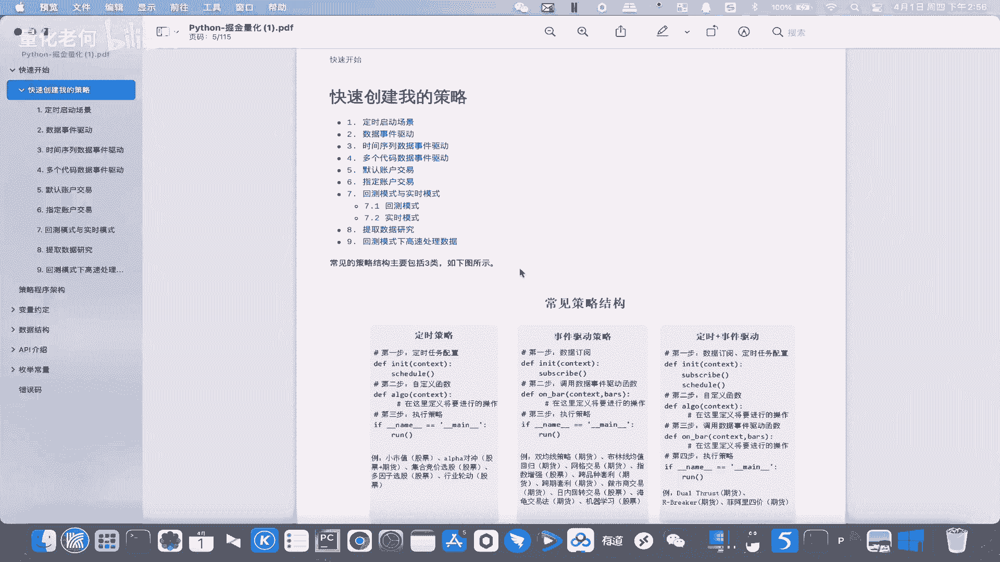

额文档，还有我们的一个拍创掘金啊，这个环境配置好之后呢。

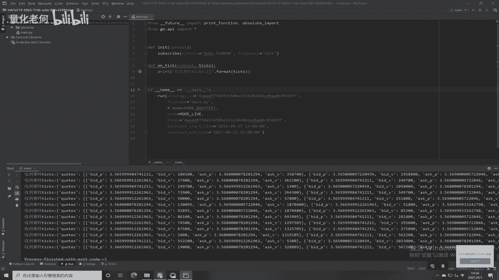

就可以进行我们嗯本节课的一个学习学习，首先给大家介绍一下哈，我们掘金里面有几种驱动的一个模式啊，这个模式呢就是第一我们有定时的模式，定时的模式就是说每天盘中额到了某个时间，就要执行某个算法。

我们这一种称之为一个定时的一个模式啊，嗯第二种呢就是一个驱事件驱动的一个模式，事件驱动呢，就是说，我不是按照一定的时间来执行某个脚本了，我是说嗯把我们想要的行情。

它打包成为bar或者打包成为TICKE啊，来到我们策略当中，我们就我们就是启动我们写在on bar或者on ticket，里面的一些函数是吧，一些代码，这种我们称之为bug或者ticket。

行情的一个事件驱动啊，那么第三种呢就是呃前面两种的一个结合，就是说我既要定时驱动，我又要事件驱动是吧，就比如说嗯这个它有它的一个应用场景啊，它有它的应用场景啊，那比如说我们呃在收盘之前。

我们检查一下我们的一个仓位的一个情况啊，同时当我的这个呃订阅的标的来的一个新的bug，导致我们布林带突破的时候，他也会开仓对吧，这个也是一个应用场景啊，就说啊我们订阅bar是吧，来到有bug过来的时候。

更新我们的一个指标嘛，更新我们的布林代码啊，然后收盘的时候收盘之前，比如说呃14。55分，我们就把所有的仓位平掉啊，这也是一个应用场景，所以说呃在里面有三种模式，定时定时模式啊。

还有一个我们的一个事件驱动的模式，还有一个两解的一个结结合，所以我们额要从实例里面给大家讲解一下，这些模式是怎么样一个操作的啊，第一个就是一个定时启动的一个模式啊，那这个下面就有一个很简单的例子。

在每天交易日的14。50分，买入200股的是吧，200股浦发银行的这个股票哈，那代码呢就是在我们的这个文档里面，代码就在这里是吧，这里有一个定时驱动的代码哈，那我们面对这些代码呢。

就你全部拷贝进去是不实际的啊，最好我觉得作为一个比较比较好的一个方式呢，你关键的行，你考过去其实就可以了啊，在绝经里面呢，它同样有相应的一些代码，我们回到掘金，回到解禁之后呢，我们回去在策略研究这边。

然后点击一下嗯，这个新建的策略。

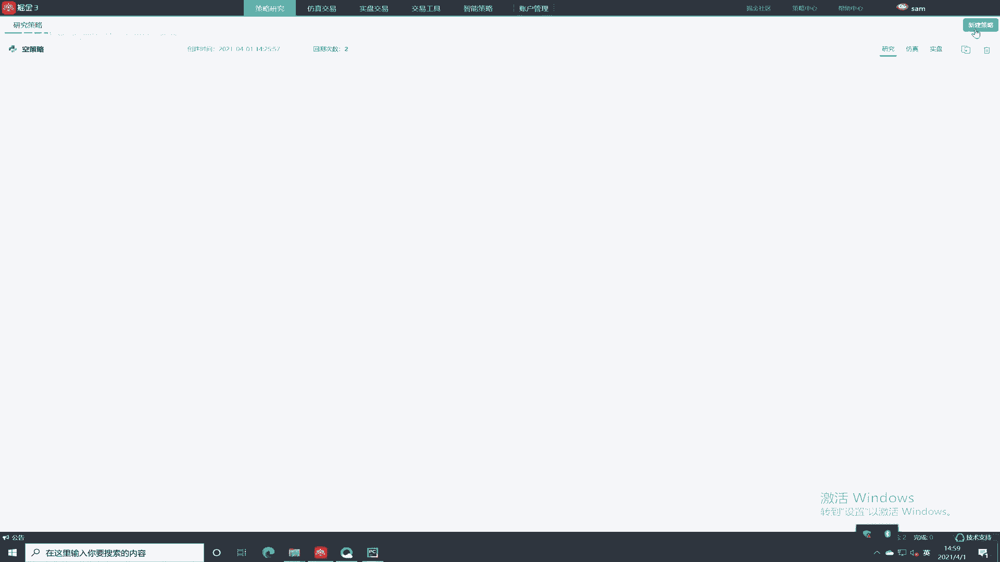

然后这边有一个定时的任务对吧，定时的任务打开。

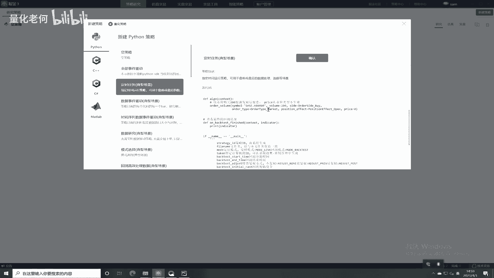

策略编辑啊，那到了这边呢，额掘金的这个平台，自动的帮我们生成了一个策略哈，帮我们生成了一个策略，我们看一下这这边token呢，也是我们自己的一个token，它还可以让我们进行回撤对吧。

我们来看一下这个是一个定时任务，定时任务的话它分为两部分，第一个就是在entity，就说我们初始化的时候啊，就算我们每次进入到我们这个脚本里面，它都会运行一次这个初始化，他的第一站就到了这个初始化对吧。

到初始化之后呢，他这里有一个schedule，一个定时的计划，定时的计划，那就是呃针对这边有一个one day，就一天，然后摊rule就是这个时间它运行这个脚本，那本质上呢它就在每天的频率的。

在这个时间去运行这个脚本对吧，这边呃解释的也比较清楚啊，这个执行频率呢有一天一周是吧，额这个还有一小时对吧，所以这个就是我们的一个定时任务，他的一个操作方式哈，那么，他在指定的时间它会运行这个阿狗。

然后呢，你必须把阿狗111个叫做我们称之为这个呃，函数的一个形式就写在这边，然后呢他要做什么动作呢，就是买入，这里是一个涡轮，Order volant，就是一个买入的意思啊，买入我们的这个股票的代码啊。

然后数量是多少啊，然后下面这边是什么呢，那你也不太用管了，反正他就是这边他就是一个marketing，这个以市价啊，买入啊，以市价的话呢，他在这里价格就不用不用讲了，side就是买是吧。

order就order side by就是买，还有一个SD就是卖啊，还有个sell就是卖，然后就是，我们可以直接在掘金这边选择派三七是吧，点这里，然后选择我们的一个派三七，然后点击运行。

我们再回到外面去再看一下，这边就是有一个回车的记录了，对吧，这回撤的记录里边呢，我们就来，大概能看得到我们这个策略的一个绩效是吧，嗯反正蓝色的就是五零，就是那个沪深300啊。

红色的就是我们的一个策略是吧，他回撤的时间就很短了，但这个策略就没有什么回撤的意义，它只是一个范例而已，后面我们做其他策略的时候，再给大家做一个演示，OK所以这个就是我们的策略的基本的一个架构。

跟编辑的问题，这个架构呢，是跟我们这边是一模一样的，这个图里边是一模一样的，有一个schedule，然后有一个阿狗，对吧啊，这样子的一个策略的架构，就可以完成我们的一个定时的策略。

好我们再来去到Python来看一看右键，J源管理器中打开，点击project右键，用排唱打开。

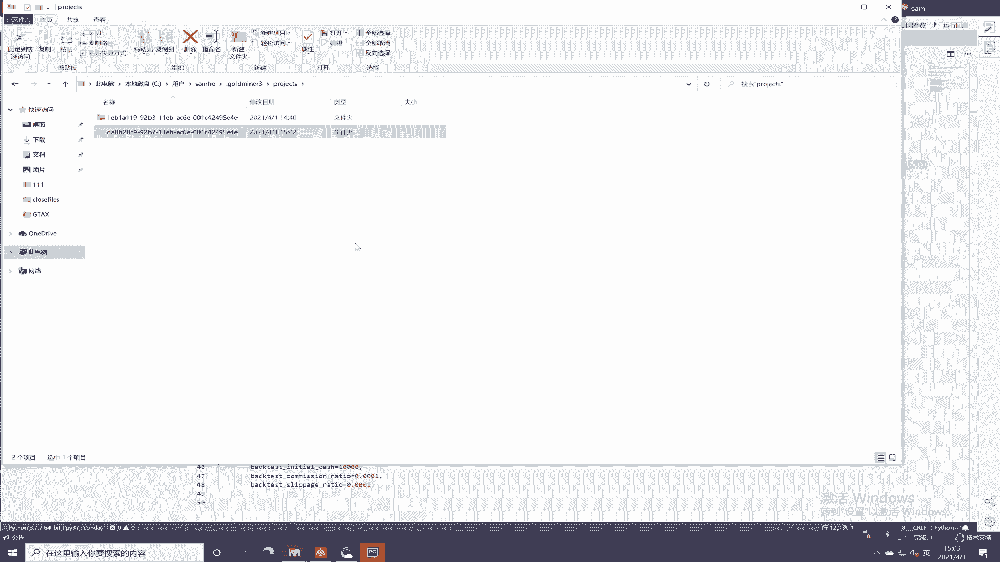

我这边就打开了啊，同样的也要选择一下那个派三七啊，选择之后呢，我们想以调试的一种模式看看，反正这边一个mod是move battest，就这个回撤的一个模式啊，回撤的一个模式。

然后我们在这两个地方设断点，看看他是否在指定的时间执行啊，是否啊，我们刚刚进入这个策略的时候，他就会运行我们这个entity啊，反右键，Run debug，没有debug。

OK所以我们呃一运行我们这个脚本，它就跳到entity这里，就执行我们的这个订阅是吧，下一步啊，下一步我们能看得到啊，能看得到，首先我们之前订阅的是14：50分是吧，去执行这个脚本，让我们看得到。

我们现在在我们的车里面，这个now这里是14：50分啊，是因为他回撤时间是从，11月1号开始嘛，所以现在就是他2月对吧，十2020年11月2号，我们再运行一下，3号四号五号六号，看到没有，这个now。

这个时间，反正他总是在指定的时间里面运行这个脚本，可，好然后，最终的话呢他这边有一个函数，就捕捉我们运行完的一些指标，他回车完毕之后，就告诉我们，我们这个策略的一个额绩效，是一个怎么样的一个情况啊。

这边都有讲，都有打印，这里我们就能看得到他的一个策略的，基本上的一个情况，当然这个我们可以用图图形界面去看啊，就是给大家执行这么长时间啊。

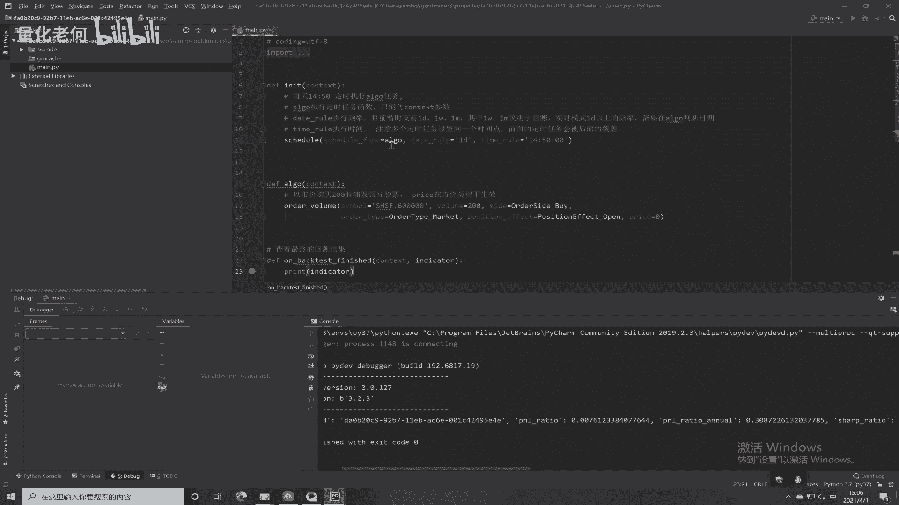

目的就是要介绍一下我们这个啊定时策略，定时策略它的一个操作方式啊，要给大家讲的，第二个就是我们的一个事件驱动啊，事件驱动的一个场景，这边有一个闯关题，每天，开盘，每天14点，每天十，每天9。35。

买入100股茅台啊，编写策略，使用定时模式，使用定时场景，回撤时间3年，就最近3年，你用我们的一个定时场景schedule啊，来编写这个策略，每天9。35买入100股啊，就3年前到现在啊。

你看一下的一个绩效的情况好吧，我们到了场景二这边，场景二这边呢，就是说我们要我们进入一种新的模式，这个就是，还是要学会看文档啊，我们要经常看这个文档啊，要学会怎么看现驱动呢。

就首先你要是呃subscript就订阅啊，订阅订阅通常是针对一到多个股票的，一个标的啊，你订阅之后呢，呃它就会按照bar或者ticket的形式发到你，这个我们称之为一个回调函数啊，回调函数里面。

然后你在回调函数里面，你就会会可以进行一些比如说买卖的动作，更新指标的动作，诸如此类的对吧，然后我们看一下我们的一个实例，就在subscript啊，接口订阅之后会返回TEQU8数据。

每产生一个或一组会自动触发的，on tick或者on bar里面执行的内容啊，那这边呢就订阅浦发银行一天的bug啊，每产生一次罢呃，就是启动一次呃调用，从而打印我们这个bug一个信息啊，这这没有买卖。

就打印一下而已啊，打印一下打印一下对吧，我们看看我们绝境里面有没有这个实力亏血。

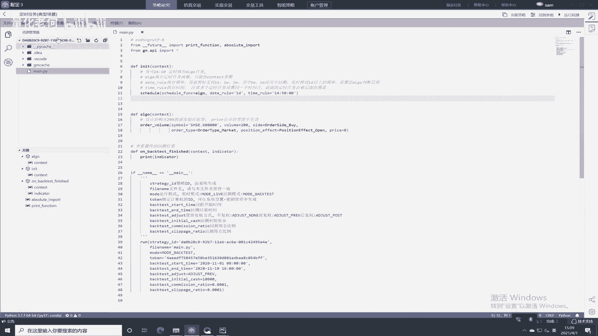

新建策略，啊这边有一个事件驱动典型的一个场景对吧，就是我们要的东西。

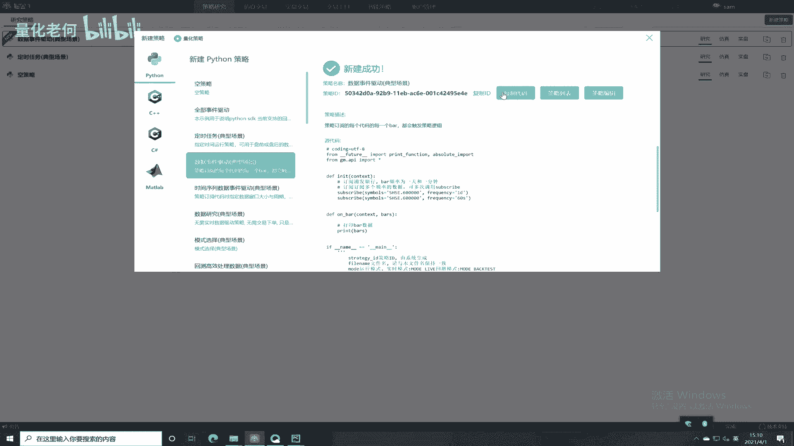

所以这些范例啊，我们最好每一个都要熟悉掌握它，那相当于我们可以掌握，我们掘金的这个开发环境了，那首先浦发银行对不对，订阅了这个浦发银行啊，这里有一份额，反正就是有一天的one day，就一天嘛。

60S就是60秒嘛，一分钟嘛，他订阅了两个啊，然后呢就把它打印出来，OK然后我们确定我们选的是派三七，这边我们点右键运行，啊这里咳一闪而过很多啊，我们就看起来也不方便，我们就去到呃拍窗里面对它进行调试。

资源管理器，点project返回上一级目录，右键。

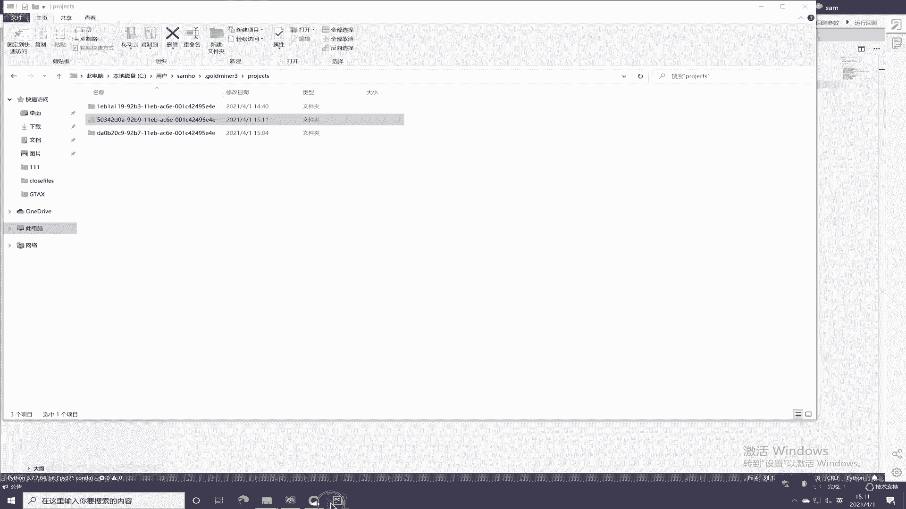

打开啊，就是我们在那边的代码是吧，也要甩一下，派三七，好进来之后呢，有一些同学问啊，为什么有时候右键这边这个run是灰色的啊，大家看一下啊，你下边这边有一个进度条啊，正常来说你右键灰色的时候呢是吧。

你右键乱着，你亏车的时候呢，下面有个进度条摆在不停的一个滚动，它在检索你呃这个工程里面的所有代码，所以在他检索完之前，你是不能运行这个右键乱的啊，因为我这个电脑是比较快，所以我这个检索时间会快一点。

OK然后我们又重新的再打断点，我们在这里是打一个，这边打一个好吧，这两个断点之后，我们再用右键debug，首先肯定会去到这个entity这个函数啊，就是我们每一次运行这个我们这个mine，点PY的代码。

它第一个就去到，去到我们这个ma这个entity里面啊，进行初始化，我们称之为一个初始化的动作，他进去以后呢，就是首先就订阅了，订阅了这个同一个品种，浦发银行普通两个周期是吧，OK那我们再看跳跳到这里。

这边就是一个bus，我们看一下这个bus啊，他现在现在就是，嘶现在就是那个浦发银行啊，然后时间呢就是09：31分啊，9。31分，所以他应该是一个一分钟的一个半对吧，再跳，是吧，这里就是，32分啊。

三十三三十三开始，34结束是吧，BOBEOB是这个意思，所以大家看一趟了，每分钟他都会有一个半对吧，现在是一分钟的，都是一分钟的啊，都是一分钟的，他这边就显示给我们显示最后一个八，只有一个榜。

这是最新的对吧，我们获取到是最新的bug，我们多跳几步，发觉诶他很有趣，他反正每分钟就给我们刷新，每分钟就给我们刷新好，然后我们那奈何老师这个one day的棒没有出来啊，那当然是啊。

因为他没有经过一天嘛，我们可以这里哎sorry，我们可以这边这一行把它备注掉，我们再来运行一下，啧我们现现在来看一下啊，那还是有数据吗，那这个数据是嗯2号的，就是22年11月2号对吧。

然后这边是2号的收盘的，就是收盘后的一个时间15。15分，那默认他就日线，它就把EOB就是到这边了，对不对，所以他就是给我们的是一个预期，我们来看一下，关注一下这个预期啊，现在是，11月呃。

11月2号三号四号五号六号，你看到的是不是一个日线，然后在里面高开低收，so全部都在里面，所以它是一个完整的K线啊，当然还有成交量，这个frequency是day啊，所以就看能看得到。

就是我们订阅了什么品种，订阅了什么样的周期，它就会呃通过返回到，反正他比如说你呃一分钟结束了，或者是你一天结束了，在结束的时间他会给你发这个bug，Ok，所以这一点就是一个典型的一个很简单的一个。

事件驱动的场景，什么叫事件啊，在这边简单的定义来说就是ticket，Ticket，就是说每秒给你报价是吧，嗯一个最小的呃时间快就是一秒给你报价大，就是指定的K线啊，形成了一个K线，再给你再发给你。

形成一个事件在驱动你这个N8啊，还有往下的一个策略。

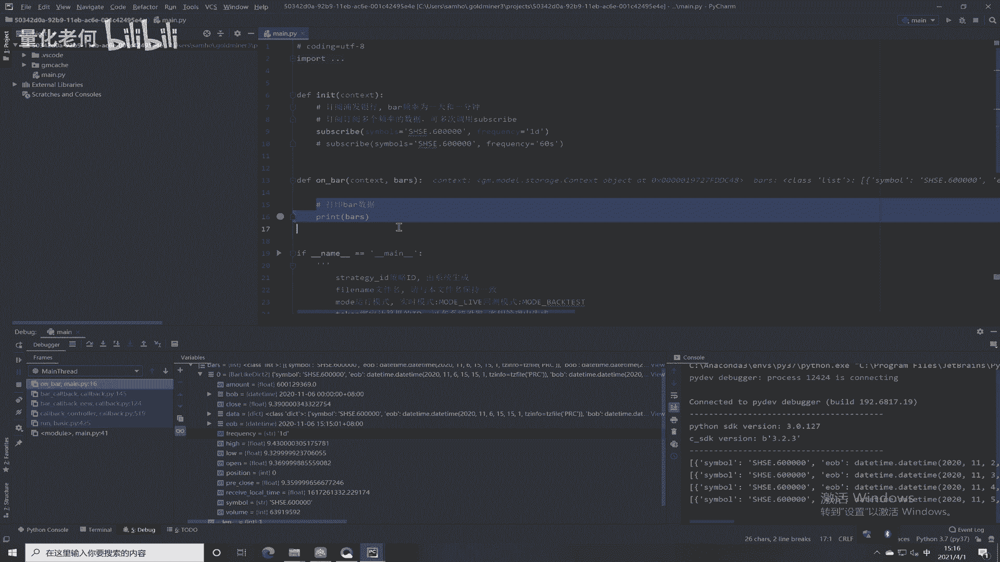

一个代码块的呃的运行好吧，那关于这一块呢就是一个事件驱动呢，就讲到这里哈，所以这个啊首先我们在文档里面看到啊，然后再到我们在绝境里面的代码去运行啊，这样就会比较直观一点，这个因为太简单了。

就不要就不做那个闯关了啊，我们看场景三，场景三更有趣一点啊，场景三呢就是时间序列事件驱动啊，这个讲的很拗口，那我何老师简单的给大家讲一下，他这个到底是是什么东西啊，还是回到我们的一个文档上面了。

时间序列驱动啊，那这边我们就能看得到吗，反正他给你产生一个最新的，反正他就是你订阅了之后呢，他会给你一个bar。

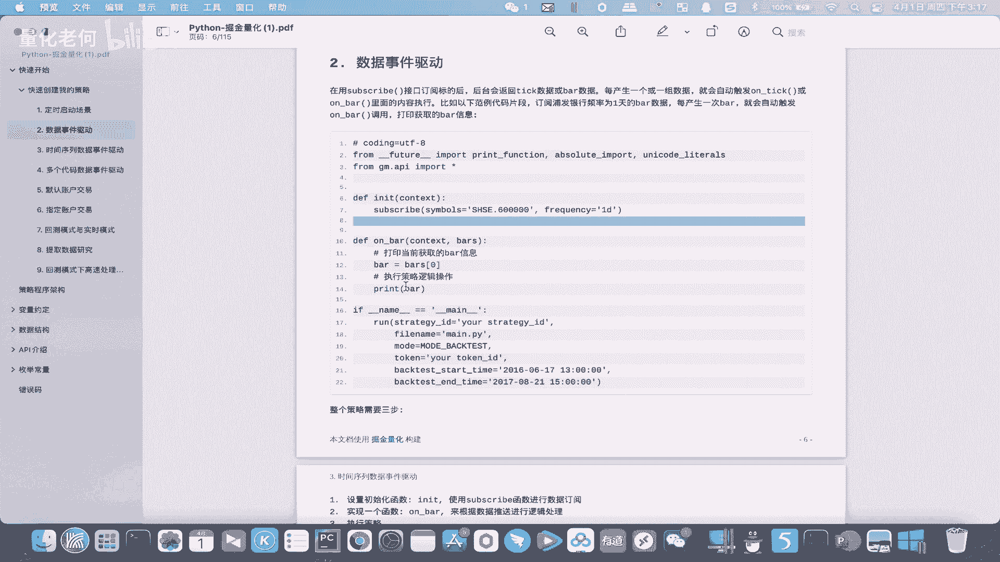

这个bar就只有一个嘛，对不对，他永远就给你一个嘛，给你的是最新的一个bug对吧，在回车里面最新的一个bug。

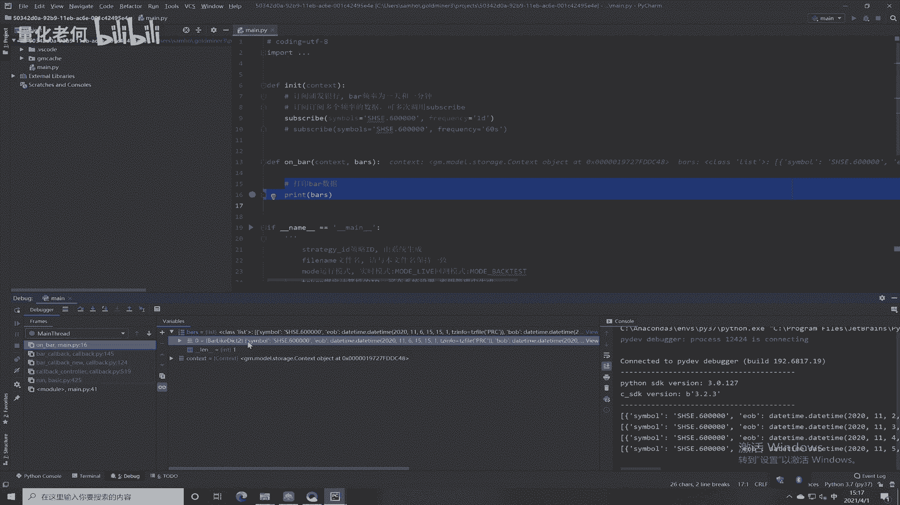

然后呢，但是很多时候我们啊其实需要更多，需要更多的K线对吧，我们为什么呢，因为嗯，很多时候我们需要用K线来做一些，指标的初始化，OK这边讲到一个概念，就是，获取多一些K线，实现指标的初始化。

实现一下指标的初始化啊，嘶就很简单了，我给大家举个例子啊，我们举个ma是吧，m a close呃，60，就是你要有这条均线，你想要这条均线，是不是比如说你突破均线就做多嘛，嗯就开多嘛。

就跌破均线就平多嘛，很简单的一个策略，那首先你要有这个均线，你要均线，你首先得想一想，你是不是必须获得前面60根K线是吧，这个ma60嘛，是不是前面60根K线你才能产生这个均线。

所以很多时候我们在订阅的时候，我们需要，我们需要多一些的数据了是吧，指定数据窗口的大小与周期啊，就这个意思啊，就是说我们在订阅的时候，我们多要一些K线啊，就可以在subscript的函数里面。

去对它进行指定，OK我们回到文档里面，我们看一下，对比一下有没有发现什么不同，也还是浦发银行，也还是一天，但是后面加了个account是吧，account50啊，我们先不要管，我们待会就把它打印出来。

看看看看有有没有一些什么样的不同啊，在这边大家先记住。

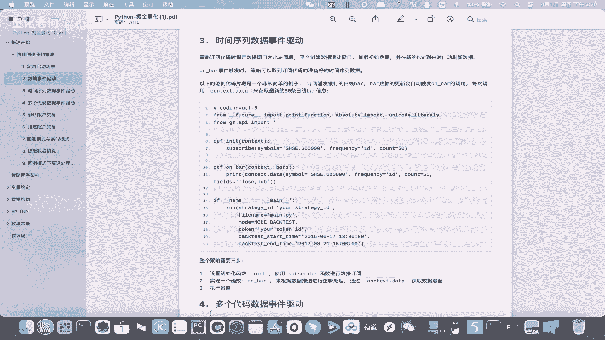

大仙记住啊，我们每次过来这边呢，他这里就只有，无论我们订阅的是一分钟，还是说订阅的是一天，你会发觉bus里面永远都是只有一个是吧对吧好，我们现在要创建一个新的一个实例。

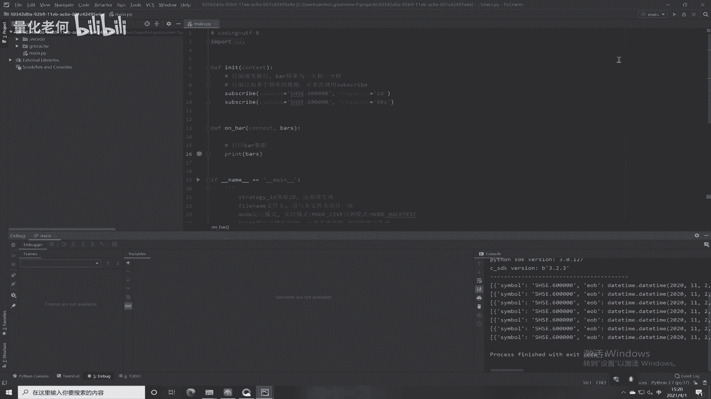

创建一个新的一个实例，就是。

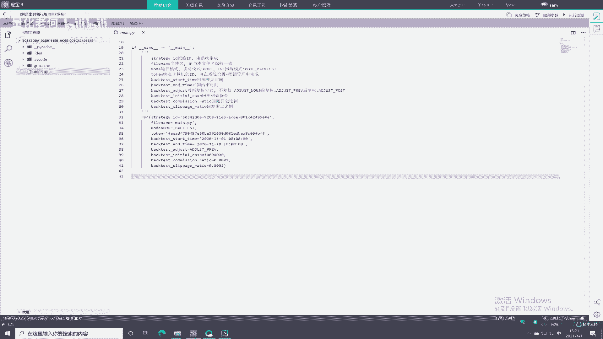

时间序列啊，事件驱动。

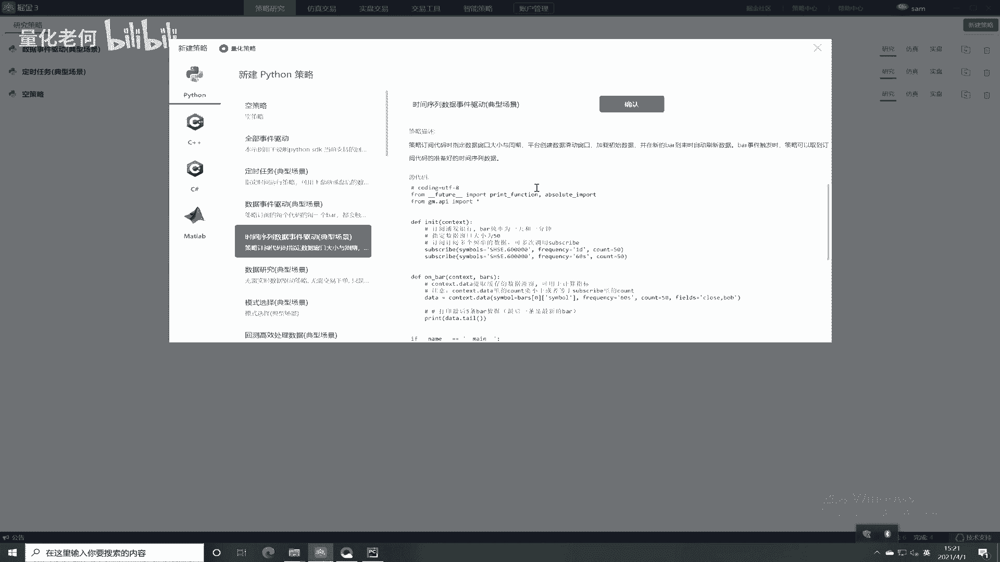

OK点击进去确定，我们为了简单起见啊，我为了简单起见，我们先把一分钟的去掉，我们就看日线啊，我不想把事情弄得太复杂，OK我们马上去到拍创啊，在这边就不运行了，资源管理器porter返回上一级目录。

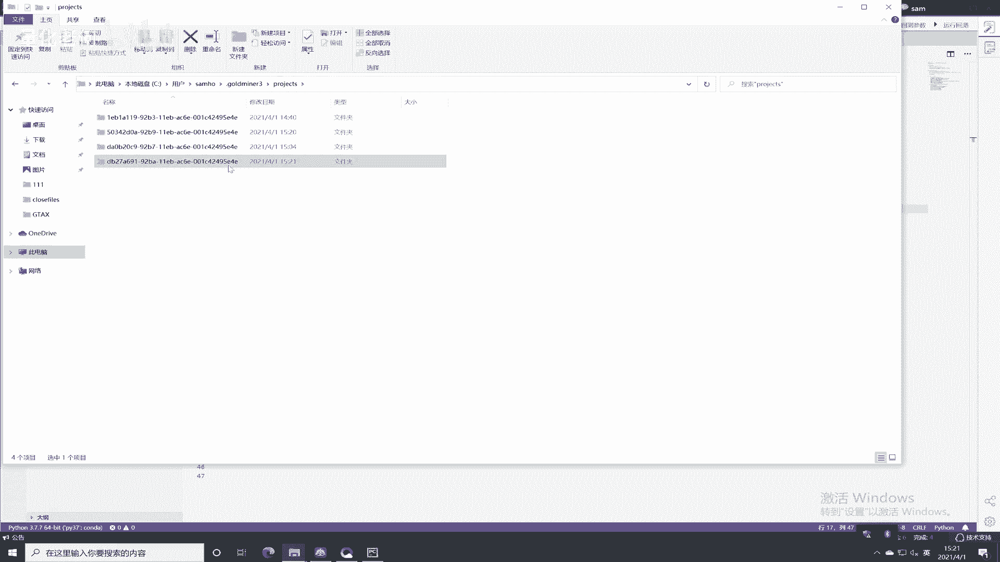

右键，常规操作啊，设置解释器，派上7apply，OK好打断，点了，首先肯定也是在这里了，对不对，然后点一下data，就这两个就可以了啊，其实这个额不订阅也没关系啊，就你要知道它多了一个参数，就是50好。

右键，逆行，哦不好意思，右键debug，我们就来到这里，那么点开这个bus，一个，啊这边还是一个啊，然后呢我们到下面这里去看data，哦这里就不对了，这里他是，这里是60秒，我们改一下。

啊这边我们改一下，因为这里data这里是60秒啊，所以我们也要跟他同步啊，这里订阅要60秒同步重新运行，好啊，到了这里我们看到bar其实还是只有一个对吧，还是给我们最新的一个B对吧。

就比如这里就是就九点啊，11月2号的09：30分对吧，到31分30分开始，31分结束了，这个K线，然后区别在于哪里呢，区别在于这个data这边我们点一下，是不是这边。

data这里订阅了close跟BOB啊，BOB就是它的一个开始时间嘛，我们能看得到它能获取之前的是吧，50个0~49吗，50个数据，OK这是50个数据，50个数据都能获取到，在我们这个data这边啊。

所以这个account设置了之后，你再用data等于content data啊，就能获取到我们的啊这个50个数据了，这里我要再再做一个例子，比如说我我这边设置100个，我们能不能获取到100个。

我们再来运行一下，哎我们发现了，那这里我们设置了100，但实际上我们还是只能设置到这个，50个数据诶，为什么呢，为什么呢，因为上面这边只给你订阅了50个，所以你这里的account不可以大于。

这这边SSCRIPT里面的一个account，你两边设置设置成100之后呢，就应该没什么问题，好吧，那现在已经有100个，好那这个策略最终我们来归纳一下嘶，首先这边我们订阅是吧，60秒60秒的一个K线。

一分钟K线account等于100，然后呢，他发给我们事件驱动的bus里面呢，也还是只有一个数据，这个是最新的一个bug对吧，因为我们呃，苦车第一天是从那个11月1号开始嘛，那这边的话。

他就给我们发到了2号的这个数据啊，因为回车当天开始那一天是他是不运行的啊，OK所以获取到的是最新的一个K线，然而我们可以通过contact点data的这么一个函数，获取到数据。

放到我们这个data的一个变量里面啊，然后通过这样的一种方法，我们就能获得我们当前这个K线，之前的若干的K线，比如这边是100就是100根的这么一个K线，这个就是我们在盘中获取历史数据。

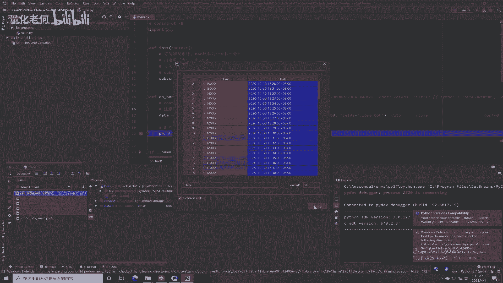

然后用来初始化我们指标的一种办法，多获取一些K线，本质上这边写的很复杂，其实就是这么1K就这么一回事啊，一些，最新的K线获取一些获取，看，个，最新的K线啊，OK就大概是这么一回事，好我们先呃中场休息啊。

那么下午待会回来。

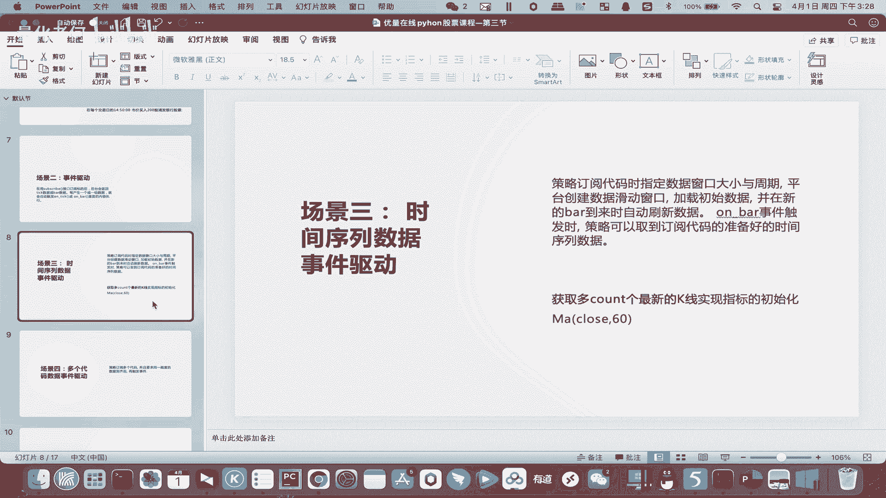