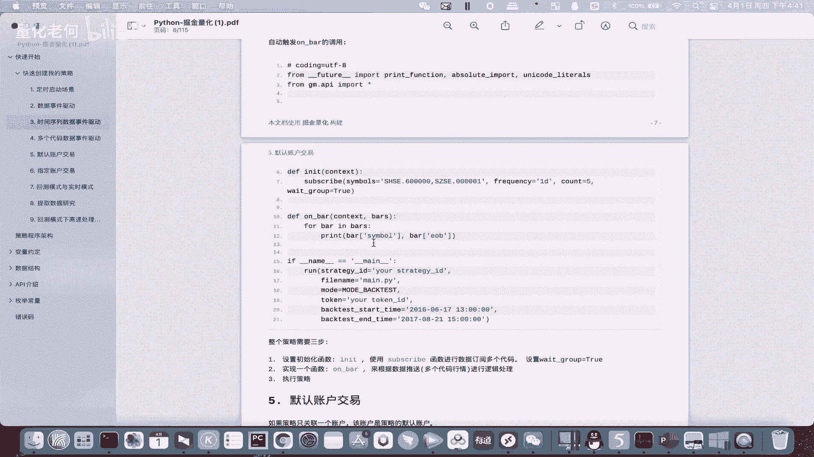
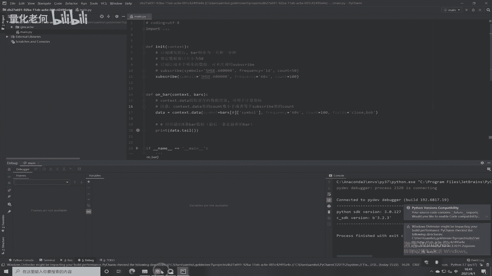
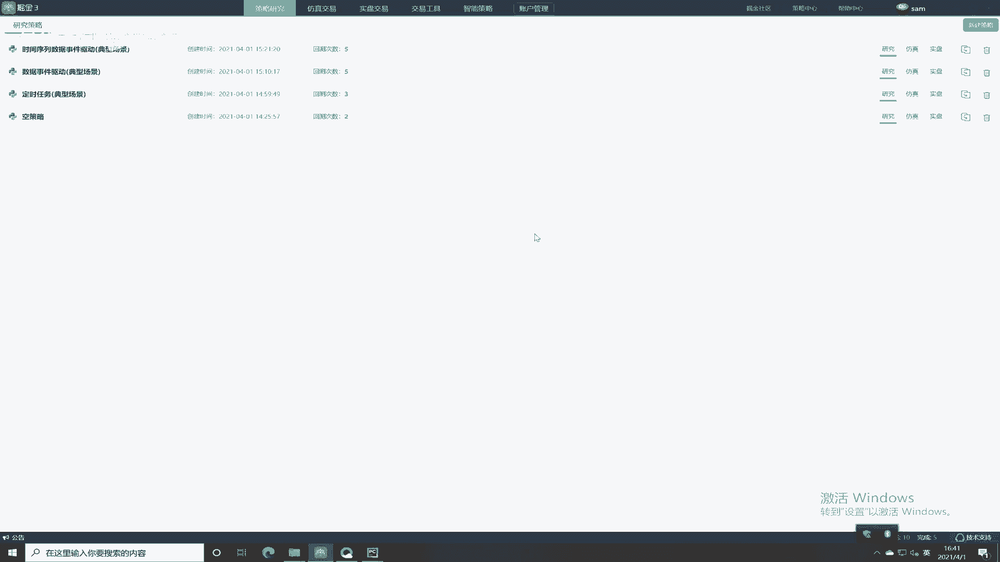
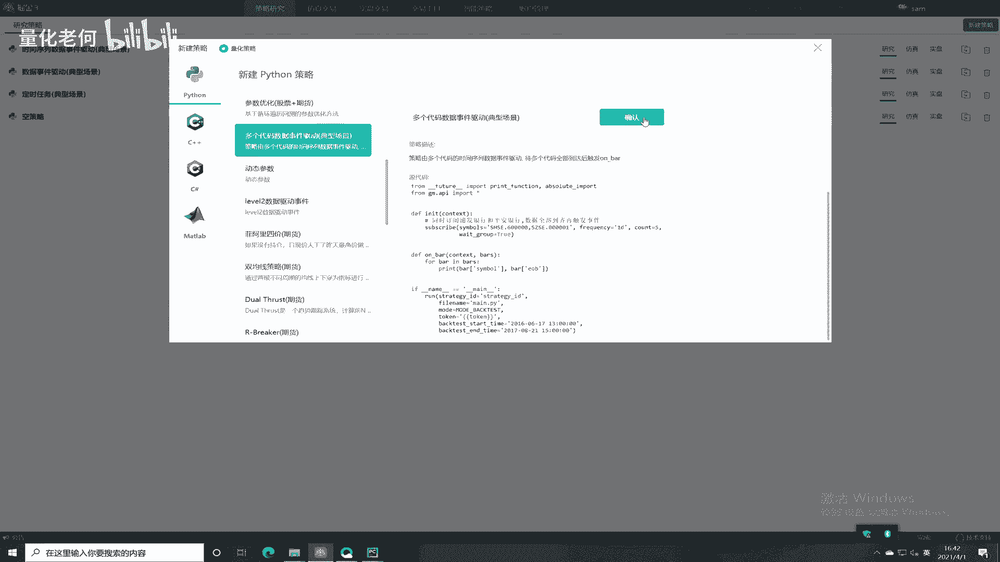
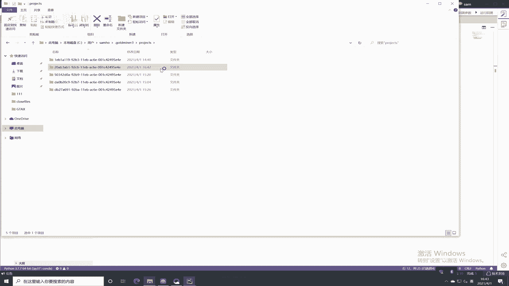
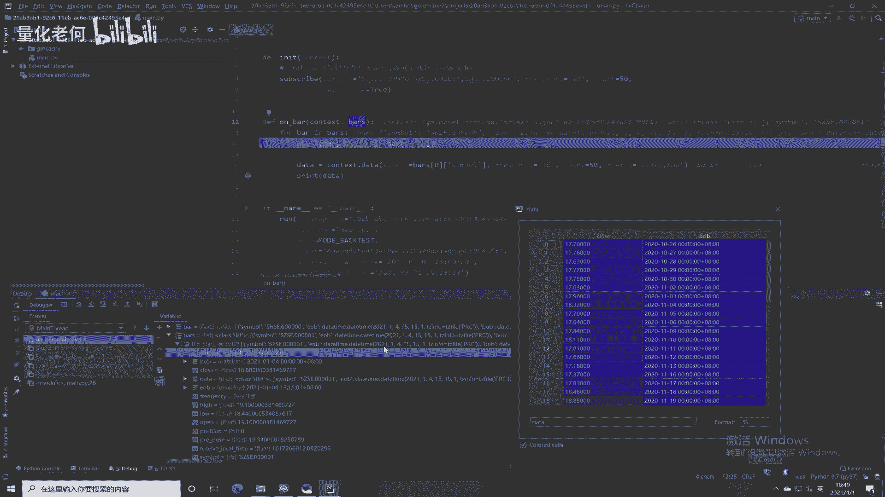
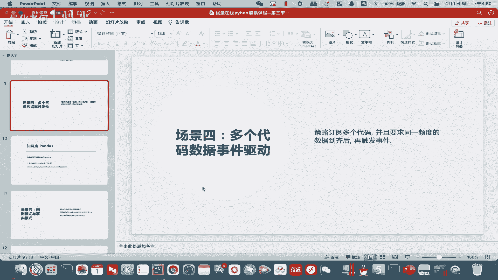
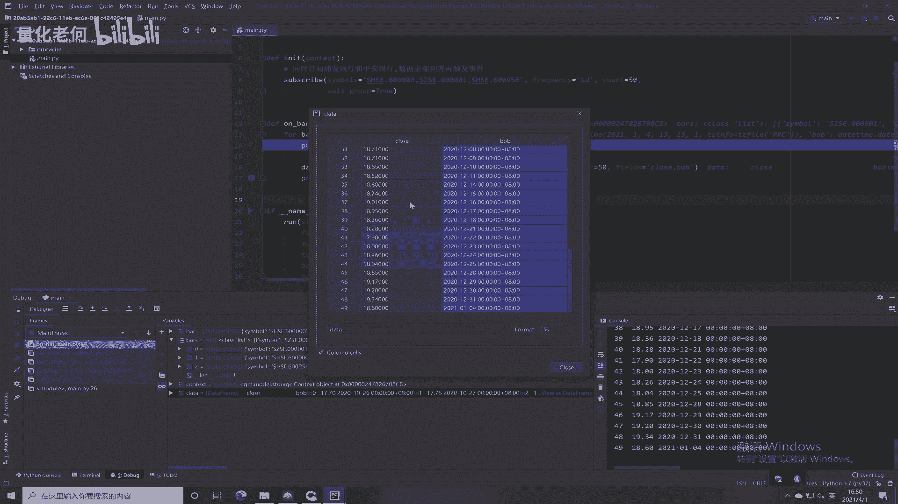
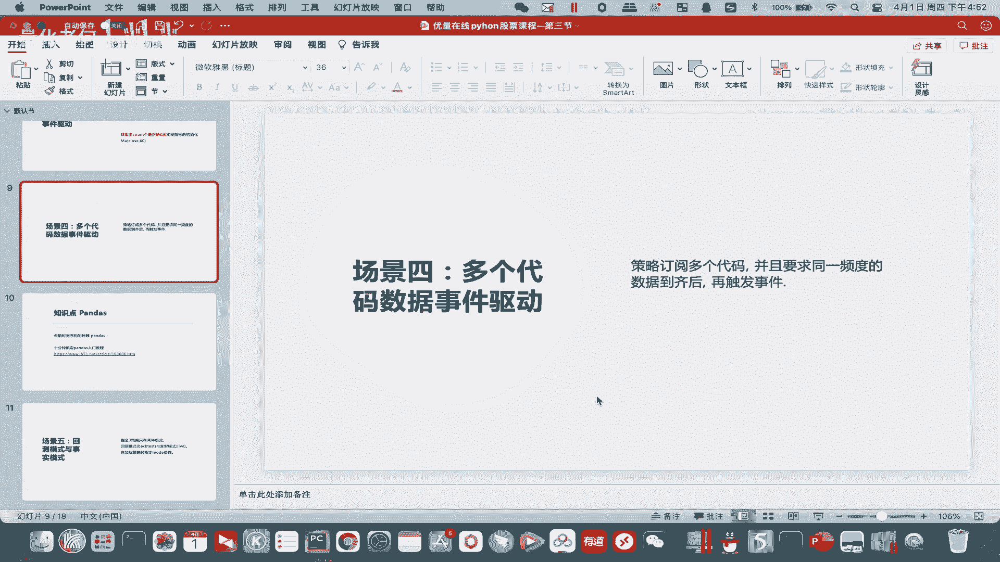

# Python股票实战课程302b多标的驱动模式 - P1 - 量化老何 - BV1iz421b7BT

好的我们继续我们的一个课程讲解，那么我们讲第四个场景就是一个呃，多个代码是事件驱动啊，多个代码数据事件驱动，他这个的意思就是说，我们可以同时订阅多个代码啊，比如说多个股票，并且要求啊。

咳要求同一频度的数据到齐之后再触发啊，我们也按照惯例看看我们的一个，文档，啊这边就是一个简单的例子啊，订阅一个浦发银行，还有平安银行的日线霸，在浦发银行和平安银行到齐之后。

再触自动触发这个on b的机制啊，额其中用到一个参数，就是这个we grow等于true是吧，用到了这个啊，然后account这里就等于五，可以获取前面五根日线E线级别的K线好。

然后呢额这边我们去到我们的代码里面。

回到绝经。

新建，嗯我看这边，我们看一下多个代码数据事件驱动，OK确定。

那么这边呢首先它是回车模式，然后嗯，这个订阅的是两个啊啊两个股票，然后也在同一个，就是呃单引号里面用逗号隔开啊，然后frequency是日线，CONN是5v go就是等于true，v go等于true。

这个是关键字啊，他就等齐之后再一起出发，然后呢触发之后就当然去到on bar这里啦，on bar这里我们看一下，跟之前我们讲的有什么不同，同样我们打开拍窗，Porter，点上一级目录，右键。

同样也选择一下拍三七解释器，这个几乎每建一个新的工程，我们都要选择，好，然后也是要打断点，嗯我们在这里打好了，对，逮一个就行了，右键debug，到了这边我们要着重看一下，bus里面它就有两个了。

就我们所订阅的两个代码对吧，所订阅的两个代码里面，所以他是这样子，他这边是同时订阅两个，那等两个K线到齐之后呢，在一起通过bus这里触发两个，那我们如果多弄几个的话，它就会是啊有多几个了。

比如说我重新再弄一个，比如弄一个，看看行不行，哦弄错了，这个是深圳的股票，啊弄这个吧，呃我们这边注意啊，不能用中文字符啊，我刚刚用了一个中文的字符，所以他一直报错，好我们这边看一下bus是不是变成了。

哦是不是这个股票当时还没有，还是两个吧，我们这边变成，2020年2021年1月，一号，3月，啊所以这个这个股票这个股票比较新啊，所以OK现在我们看到了就有三个股票了，反正你这边订阅的越多啊。

他这这里bus一次给你的啊就越多，它们的周期跟时间都是一样的，你看都是2021年1月4号是吧，嗯这个是一个日线级别的，所以我们通过这样的方式，可以同时订阅多个股票诶，嗯然后也能看一下，也能看到他们的。

theta如果要获取历史数据的话呢，也能看到他们的，S t o，Context，Data，对吧，把我们上一节课的代码拷贝过来，这边变成WDWD，然后只能获取五个了，你上面五个这边也只有五个会。

我们弄成50好了，OK再来运行一下，是吧，这边都能获取得到他们的一个信息，点一下啊，它也是出现这样的一种表格式的，一种数据格式啊，OK好，然后通过这个16，我们就能看得到。

怎么如何同时订阅多个多个策略了，是不是多个标的啊，多个标的反正他都会打包在这个bus里面是吧，然后我们再逐个for循环，就可以对它们分别进行处理了。

呃这就是本小节的一个内容啊，就是一个多个代码的一个数据驱动的一个形式，嗯就讲到这里嗯，后面会有一个闯关题，这个闯关题就是，就是同时订阅，同时订阅一个我们的一个嗯五只股票，Be，对其收盘价进行打印。

需要用for循环，OK就是跟我们实力差不多啊，自己动手一下，然后这这一边就第四个场景就讲完了，那么我们在做的时候。

就会发现有一个比较有意思的点，就是是吧我们获取到的它这个历史数据啊，我们在这边点一点会看到这种表格式的，是吧，表格式的一种显示啊，那这个呢需要给大家讲一讲，这个就是我们用到了一个包。

这个包叫做pandas，pandas哈，这个pandas呢是专门用来，分析我们金融时间序列的，一个非常棒的一个工具，呃，那这边呢就有一个入门的一个教程，入门的一个教程啊。

那这边呃就专门针对怎么样学习这个包的啦，包括这个内容呢，我在嗯我们的一个预习课里面，预习课的资料里面也有给大家发哈，申莫凡老师讲的也讲得比较通俗易懂呃，在这边对这个pandas就有个要求哈。

也是作为我们的一个闯关题，就是我们要完完整整的啊，完完整整的把这一套就是入门的一个教程，自己敲一遍啊，大概需要十来分钟左右就可以敲完了对吧，这个也做完，作为一个我们的呃一个课后的一个作业啊。

这边也有很具有非常有趣的地方，这边就是有用到一些呃跨图的东西啊，我们后面都会有用到嗯，这个就不给大家讲了，因为那个玉石资料或者这个文档里面都有啊，自己学会自己动手敲一下哈。

OK所以这个就是一个pandas的一个知识点，pandas这个包我们后面会广泛的用到对吧，也作为一个闯关题已经写到这里了，然后的话，这就是我们本个小节的一个内容。

