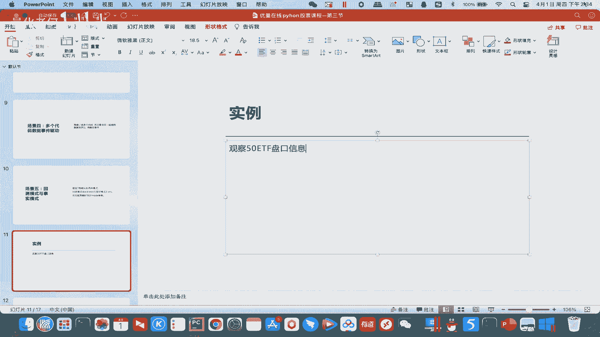
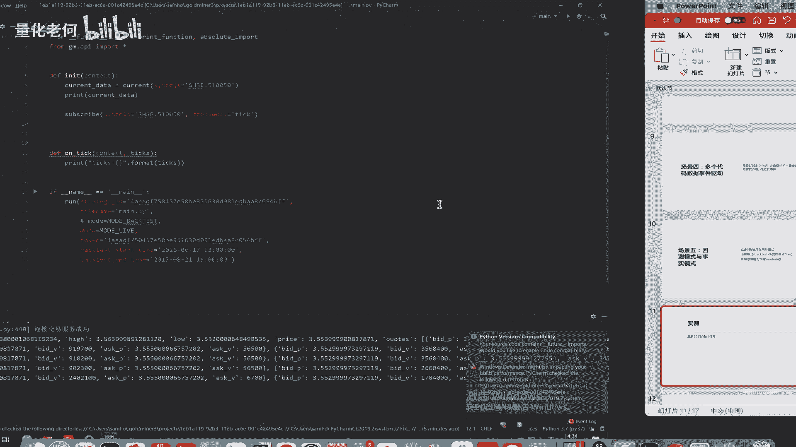
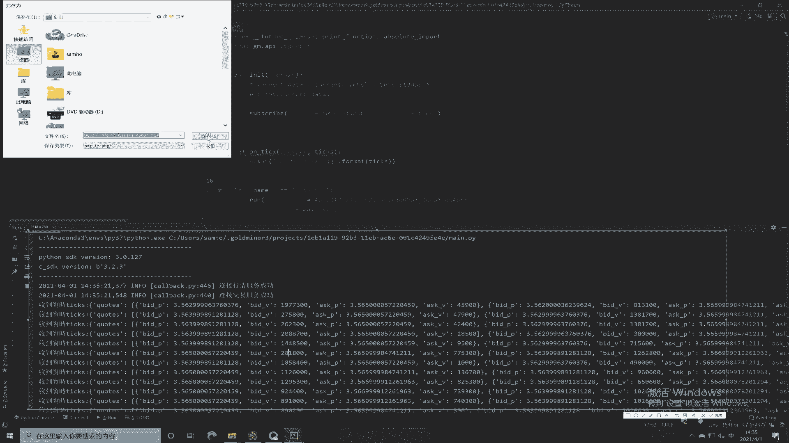
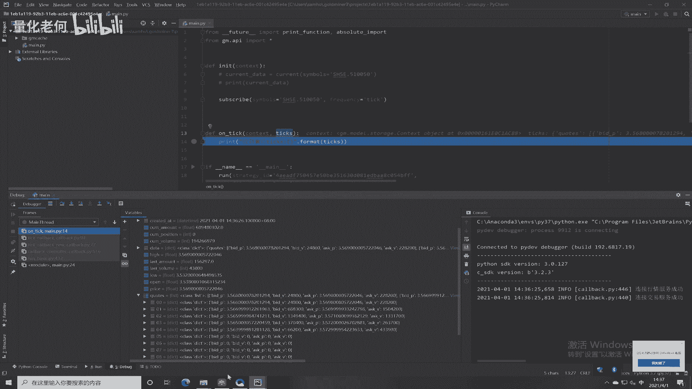
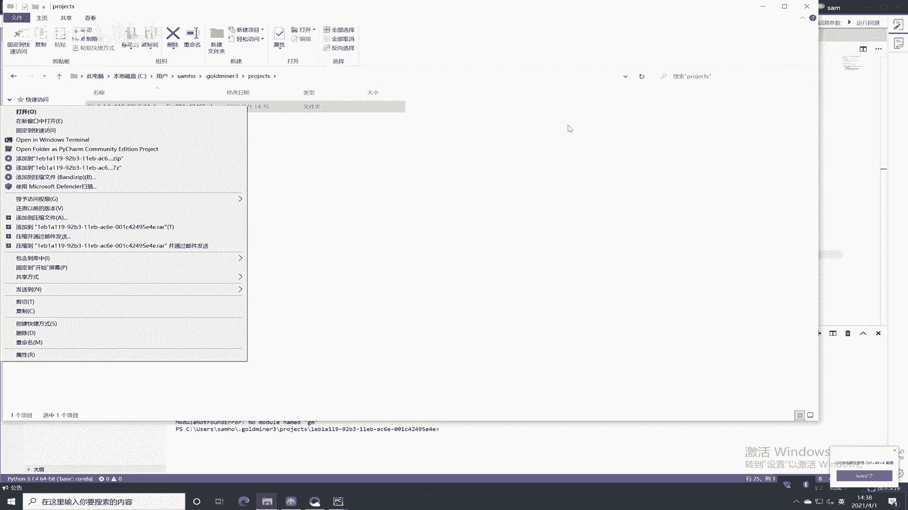
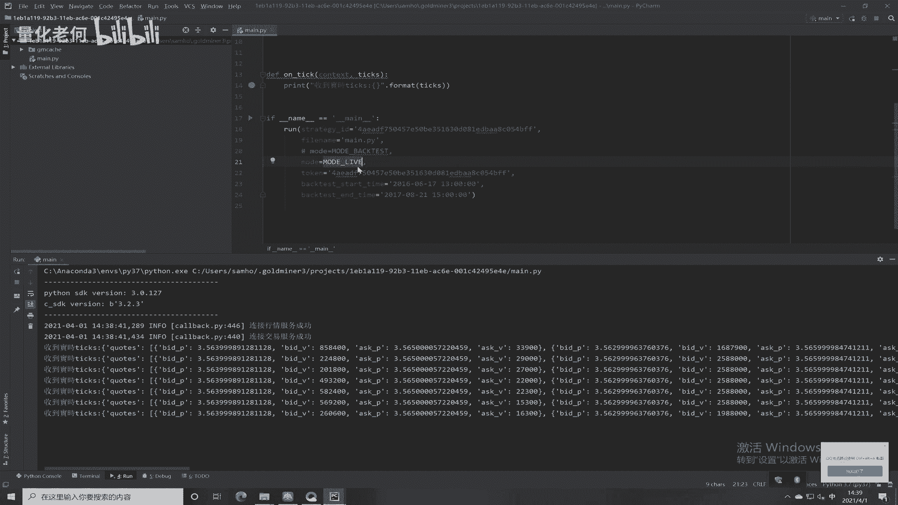
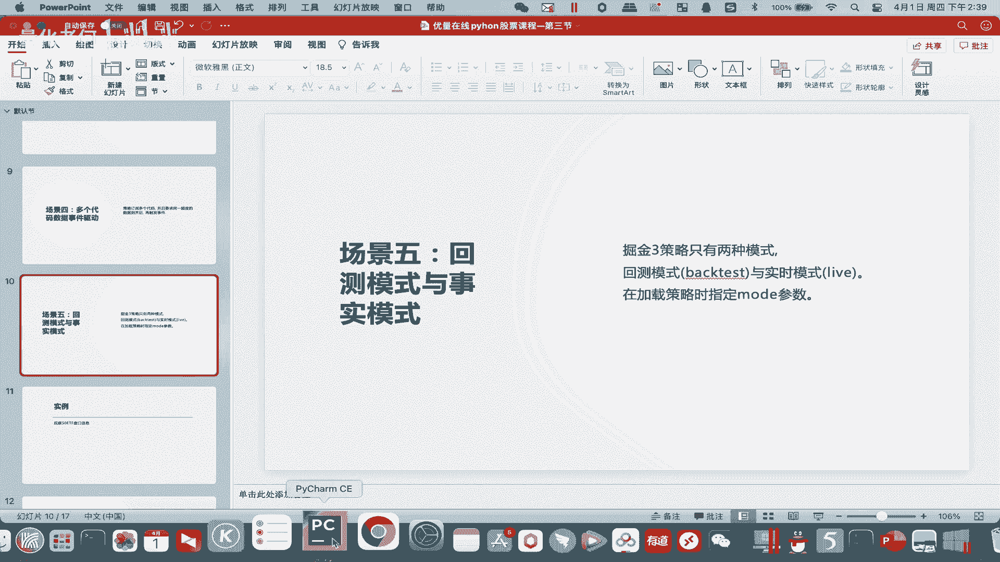

# Python股票实战课程302c 实时模式的讲解 - P1 - 量化老何 - BV1rJ4m1g7tK

哈喽各位云南在线的同学们，大家好，然后呢今天呃我们要讲解一下，就是呃我们在掘金三里面两种模式，一个是回撤模式，一个是啊实盘的模式啊，这两者做是呃我们应该做怎么样的一个区分啊，他们各有一些什么样的作用啊。

这边要给大家讲讲，让我们先来看文档，先来看文档，那么这边的话呢，其实它只是文档里面只是告诉我们，可以通过这两个关键字啊，来加载策略的时候进行区分，那就是这个mo得这里回车模式。

better就是嗯by test，然后实盘模式就是这个move life啊，那么额回撤模式大家用的比较多啦，我们在平常的一个回测里面，都用到一个回车模式，我着重想给大家讲讲这个实盘的模式。

实盘模式我们在加载车的时候，这边mod就用mod life，那么它又是有一个什么样的作用呢，啊那我们就是配合我们的一个实例啊，对我们的这个实时的模式进行一个讲解哈，那首先我们看回我们的一个机器上面。

我们这个实例是什么呢，实例，对策略对啊，50ETF这个基金啊，观察，盘口信息啊，观察我们这个50ETF这个基金，当前的盘口信息啊，注意一下啊，现在现在是开盘时间是吧。

所以我们在开盘时间来做这个事，我们先回到我们这个机器上面啊。

回到机器上面，首先我们写的这个是吧，我们首先订阅了一个函数，就是这边先备注掉啊，我们这边先订阅了一个5510050，然后这里的它的频率是ticket是吧，所以正常来说每每一到每来一个新的ticket。

他就会发给我们啊，然后这边mod这边是mod life，我们是一个实时的模式，然后我们订阅了这个510050之后呢，这边有一个on ticket用来接收我们的一个行情啊，这边我们做一些备注，收到实时。

ticket啊啊，这样子的话，我们现在来运行一下，看吧他这边每来一个ticket，他都会发给我们哈，这个ticket里面有什么呢，啊，那先大大大家先看一下，这个不断的接收到最新的一个行情。

最新的一个行情，我们截个图发上去啊，对吧，收到这个最新的。

OK不断的收到最新的一个ticket哈，最新的一个ticket，那我们看看它到底是不是最新的，我们点这里断点右键debug模式看一看，是吧，然后这里收到的这就是我们收到的ticket。

就是这个tickets对吧，把它打开啊，它里面除了现在的一个是吧，Quarter，这里呢就是能看到现在tick的一些信息，对吧，比如说big us啊，现在是多少，对吧啊，这些都会有都会有，对吧。

那这边我们就能看得到这个ticket里面，到底是一个什么样的东西啊，什么样的东西，嗯就非常清晰非常清晰，通过这个实例嘞，我们就能看到啊。

我们就能看到我们的这个，啧我们的这个盘口的信息啊，就是通过通过我们的这个alive这个模式对吧，我们可以看到市市市面上面最新的东西啊，我们仅需仅仅需要呃在就是说，啊这个代码啊，在这里你这里运行回车。

其实他是看不到的啊，其他是没东西啊，没东西的，你必须跳到这个我们拍窗上面，跳到我们这个拍窗上面，右键是吧，然后资源管理器，然后project啊，这演示都是我们常规的一个操作哈，右键。

然后用Python去打开。

打开之后呢，选择我们上次的一个拍三七对吧，选择我们上次的一个拍三期啊，之后呢再来运行，你就能看到你的一个ticket的运行情况了，所以这个就是我们一个呃mode life啊。

这个实施模式给我们的一些简便，特别在我们要呃，调试我们的策略或者代码的时候呢，这个是非常方便的啊，啊这就是呃我们一套程序，我们已经在嗯已经在已经写好了啊，回撤里面写好。

但是我们在实盘调试的时候先走一下这一步，Wood life，这一步可以有助于我们更好的调试。

我们的一个策略，OK所以这以上就是我们的一个呃，实施模式的这么一个讲解，那么呃回撤模式呢，就是我们正常的策略都就是一个回撤模式了，那我们呃之前也给大家做了大量的一个讲解哈，所以这个回撤模式啊。

实时模式的这个讲解就到此结束哈，到时候我们呃就是最后闯关的时候，会有这么一道题啊，各位就是用我们用开盘时间呃，对茅台进行我们的一个盘口的一个获取，也是用也是用我们类似的代码对吧。

所以同学们都要自己去实现一下，我们的这个策略啊。

实现一下我们这个策略啊，代码量不多，代码量不多，但是呢嗯就是非常有用哈，是获取在实盘当中获取我们盘口的一些信息。

