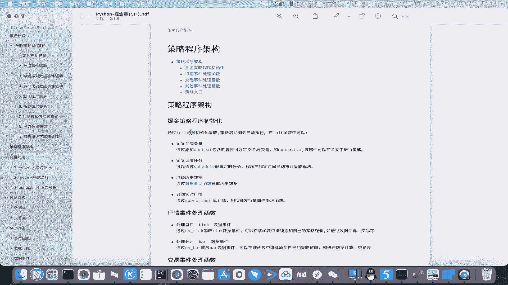
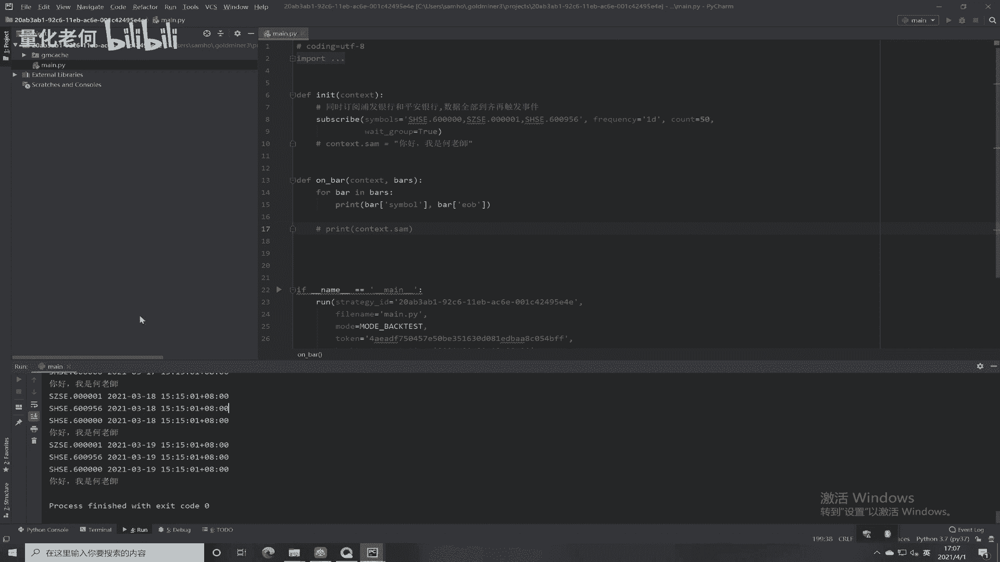
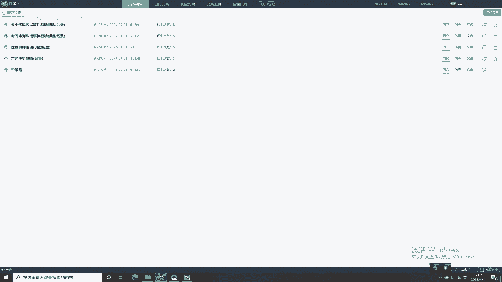
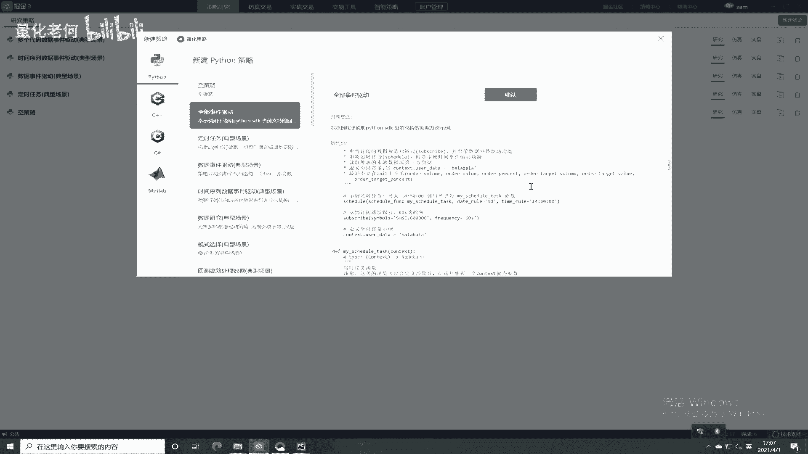
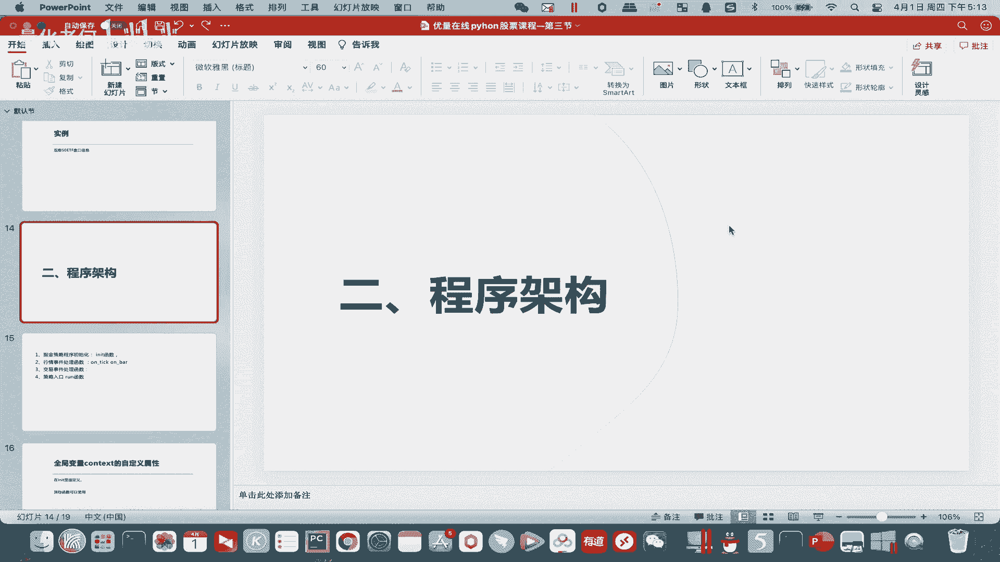
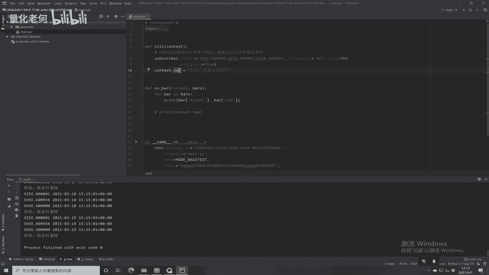
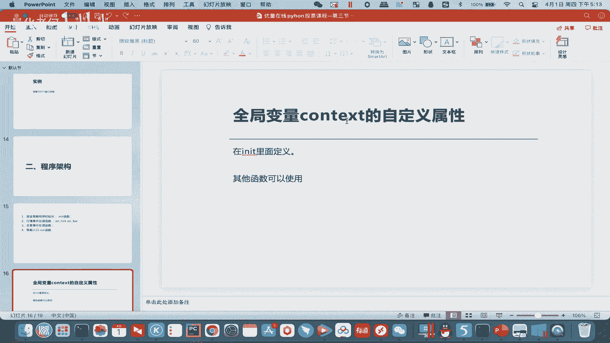
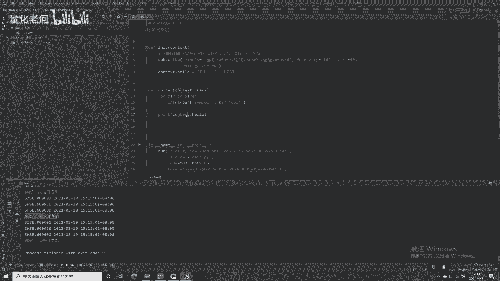
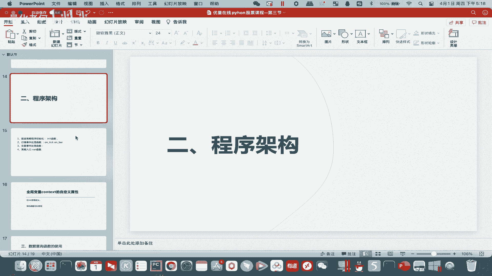

# Python股票实战课程303 策略程序架构入门 - P1 - 量化老何 - BV1k6421f7Gp

Hello，流量在线的同学们，大家好，我是何老师，然后呃，接下来呢我们要继续的给大家介绍我们的呃，本节的一个内容，我们是一个基本节，是一个呃量化策略的一个编程入门呃，我们会在本节给大家介绍一些比较常见。

也比较简单的一些实例啊，呃我的课程目标，本节是要为大家贯穿，首先我们在掘金生产生存策略，然后用用那个呃拍创去调试，还有怎么样看我们的这个文档啊，这么一些细节呢要给同学们进行一个贯穿。

然后之前已经讲解了一定内容，那么现在我们要讲我们的一个程序的一个架构，程序架构的问题呢，就是我想结合代码一起讲哈，然后首先看我们的这个文档，文档这边有一个叫做程序架构。

这边就给大家讲我们的程序大概分为几部分啊，那第一个部分就是这个entity的函数哈，entity函数它是干嘛的，它告诉我们程序啊，启动就会自动执行unity里面的函数，那里面可以放什么。

首先它可以放contest全局变量啊，这个我会待会给大家讲呃，这个全局变量主要是用来在跨函数之间传输的，第二个就是我们之前有讲嘛，这周有讲这个嗯定时启动的一个场景。

就用这个schedule配置定时任务啊，然后用如果有事件驱动的话呢，就用soft script呃，查询我们的这个呃事件驱动啊，然后呢也可以准备一些历史数据啊，准备历史数据呢我下一个小节会给大家讲。

所以这个就这个就是entity呃。

要做的一个东西啊，我们现在。

回到掘金，有一个实力是非常好的。

新建策略，全部事件驱动。

嗯呐打开之后呢，我们就可以以这个策略为一个蓝本来研研究呃，研究我们的一个策略了，那首先有一个entity，是不是基本上该有的它都有，首先有那个呃schedule是吧，那个定时定时器啊。

我们称之为定时器吧，然后有一个subscript呃，订阅器啊，有一个叫有一个呃content user data，一个全局变量是吧，所以这个就是我们的一个entity这个函数啊，它的基本的一些功能。

反正我们运行我们这个呃慢点，PY文件一定会首先会运行这个my entity的，这个初始化的一个函数，这个就是一点，然后另外一点就是四行情事件处理的函数啊，这个就是我们一个on ticket跟on8了。

那么我们你订阅的是subscript，这里是ticket的话，你过来了就是ticket，如果subscript是八的话，过来就是八，反正呃你触发了这个函数，就运行里面的一个代码。

我们大概来看一下on take是吧，on tc这边也告诉我们tick里面到底有什么东西，它是什么一个数据类型对吧，那我们之前学数据类型，现在已就已经能用得上了，就大概能看得到他们是一个怎么样的。

一个数据类型，然后对反正就是你订阅了ticket，它就会触发这些啊，这代码，然后bar也是一样的对，然后如果你订阅了on bar，它就会嗯执行到这边是吧，比如说他这里60秒，60秒就是一个bar了。

对不对啊，60秒就是一个bug，如果你如果你这边是ticket的话，那那他订阅了就是ticket了，他回到ticket那边，这个就是大家要了解的一个情况，就讲完这个事件事件处理处理函数之后呢。

要给大家讲我们的一个交易事件处理函数，其实这个呃，就当我们主要是说发一笔单出去以后啊，我们要发出去以后，我们就是要监测我们那个订单的执行情况，他是那个嗯是成交了还是部分成交了，还是没成交了，要不要追单。

这么一些细节，我们都要照在这个呃交易处理函数里面去处理，也给大家看一下，就是是吧，on bus studio是吧，这个有更新的话，它会返回这么一个order的事件了啊，order的事件啊。

这个这个到时候我讲实盘的时候，会给大家讲清楚它的一个用途，然后要讲的就这个account，Account studi，就账户的一个呃，你账户的一个状态情况，就是响应连接还是断开啊，这边都有哈。

这边都有呃，后面的呢就先不要去了解了，后面的其实各有各的用途，各有各的用途哈，就是给大家讲一下，这个就是交易处理函数，其他函数就是这个ever是吧，比如说我们看到这里有一个F的函数，On effort。

就是底层SDK出错的时候就返回了一个函数，比如说掘金下面底层呃，有一个bug导致了错误，他会通过这个来反馈给我们，好吧，OK最后就是一个行情入口了，行情入口是一个乱的函数。

乱函数大家都已经其实呃有接触过了，就这边，run这边呢它主要是就是if lab等于mm，这个就是我们的一个整个拍点，所有Python文件的一个入口的函数嘛，就说你运行这个我们的这个慢点PY。

他首先就会去到这里是吧，再来通过run去到这里之后呢，再再来运行我们这个run的这个函数，run里面你要你要它有一个策略的id，有一个fire name，就这个一般都不用改它。

然后more mod我们有讲过一个回撤模式来实施模式，然后token是每个人都不一样的，安装的时候有讲过，那点击点击右上角这个SAM，这里就这个你名字这里就能看得到你这个id。

然后bat test的时间，回撤的时间，你初始资金是多少是吗，你的手续费是多少，划点是多少都可以设置，所以这个就是我们的一个入口，程序入口的这么一个慢的一个函数啊，反正就是呃就是，通过这样的一个讲解。

我们就大概能了解我们整个策略的一个架构啊，策略程序的一个架构啊，就是分为这么几块啊，就各位同学要熟悉这个，要熟悉一下这个架构方面的一些内容，然后下面就要给动手，给大家做一个小实验，就是基于。

就我们上一个实例啊，我们想就是contact，这个就是contact变量呃，它是它其实主要的作用呢其实都有讲到啊。

主要的作用就是用来全局去去运输，我们需要额一个全局变量啊，全局变量它你可以自定义一些属性，让它在所有的函数之间畅畅行无阻。

呃，我们来做一个演示，首先我定义一个content，你定义什么都行了是吧，Hello，这个是新的属性是吧，你好，我是老师，然后这边我再调用一下看吧，我就entity这里对这个contact进行调用。

然后这边我就on bar，这里我就可以把它打印出来，那打印出来当然要跟你定义的是一样的，我们再运行一下，OK看到没有，就是说呃在这里就有一个就prime嘛运行一遍，它就呃反正他就执行完这个轮回。

他就给我执行这个语句啊，那我定义了这个contact点，Hello，这个变量呢，在我们每一个就跨了两个函数进行调用。

所以这个contact主要是这个意思，那我们后面也做了一个闯关题，这个场观题就是，第五，在嗯，定义content，De，time time1变量，用于存放函数预存放嗯，策略启动时间。

并在on bar打印，好就是这个题你要定义一个自变量啊，然后在entity里面定义，然后在N8里面打印，OK所以今天的内容就是这样子啊，这是我们的一个程序架构方面，给大家进行了一个讲解哈。

所以我们看怎么样学习学习这种方法，第一你必须找到你的文档，啊文档要学会看，你不看是学不会的啊，看里面就有非常详细的一些内容，然后第二呢，你要在掘金上面找到你的一些实例是吧，找到一些实例啊。

要看他们是怎么样一些定义，其实上面都写的很清楚，这一段代码干什么，那一段代码干什么是吧，所以我们多看就能更好的掌握里面的一些内容，这个自己学会看了，比何老师一句一句的讲更重要，因为一一句一句地讲。

里面掘金其实内容也有很多讲是永远不会讲的，完整的，只有说我引导你们怎么样去看代码是吧，看文档还有看代码啊，你们通过这样的一种方式，才能彻底快速的掌握绝经，这个非常棒的一个工具。

OK然后今天我们只是通过一些呃，概念上面的一些讲解，大概给大家讲了几这几个函数，那其实讲的永远都不够深，你看后面的课程，比如说下下面几周，我会通过策略再给大家讲解啊，我不喜欢那个护照的。

对着那个文档来读，我喜我喜欢通过后面我自己编的一些实例，再给大家讲，这些东西其实是干什么的，他们应该怎么样去学习跟调用它对吧，那么我们看文档，文档里面其实还有很多东西的。

比如说我们拿这个content content这个函数是吧，变量约定这里点content，你会发觉诶哇原来content这个属性除了自定义，我们刚刚用过的以外，还有很多，比如说固有属性。

这些全部都可以调用的是吧，所以说我们学会看文档之后，就能有进一步学习的这个空间和方法，然后就是这些内容，其实呃今天讲的只是说概念，先让大家了解这个策略的架构了，后面还有很深的内容，我会在后面的课程当中。

再给大家做更加深入的一个讲解好，那么我们第二节一个程序架构的一个初级入门。

就讲解结束。