# Python股票实战课程406案例学习 - P1 - 量化老何 - BV1Py411z7Sa

Hello，欢迎回到我们Python股票情绪化实战班，我是何文峰老师啊，那我们今天是第四节的，第五讲，就是我们的一个实例的讲解，那么经过我们本次课程前面四个内容的讲解呢，啊讲解了非常多的内容是吧啊。

指标的制作啊，包括我们理念上面那些东西，包括了大盘知识，然后呢，最后我们要用一个案例来给大家结束。

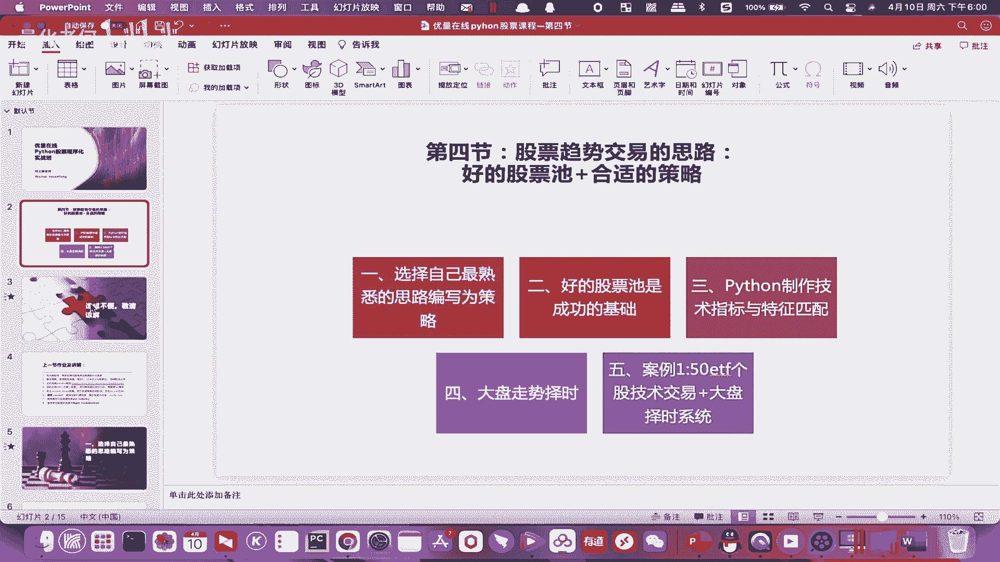

今天的一个课程，这个案例就是这样的，这个案例就我们知道50ETF它是一个ETF基金，然后他有50个个股啊，我们50个个股呢，他就分别给他们套一套这个，布林带的一个交易系统，OK每一个都有一个交易系统。

然后再加上每一个大盘指石啊，啊这样弄完之后呢，我们就是中间还有一个技术难点，就是怎么样把我们的个股的开平仓，跟我们的大盘择时能够联系起来，这个是一个，我们这个案例要给大家讲解的一个内容。

好吧嗯然后讲解完这个内容之后呢，最后有个闯关，这个闯关题我觉得是比较高难度啊，比较高难度，我希望是能够加入成交量的因素，具体怎么用啊，你们每个同学自己发挥想象力，你们是量价齐升才开仓也好。

或者是你们用这个成交量做一些呃，行情过滤也好，或者加在大盘折时上面也好，都没关系，我希望只是希望你们能够加进去啊，那你加进去这个系统，首先你要读懂这个系统，对不对好，那现在我们就带大家来读一遍。

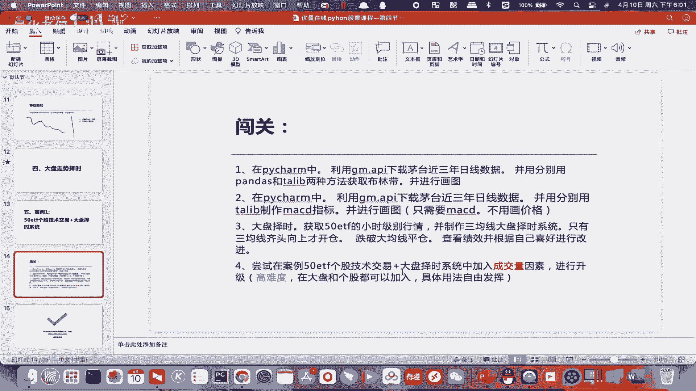

带大家来读一遍，其实有了上一节课的基础呢。

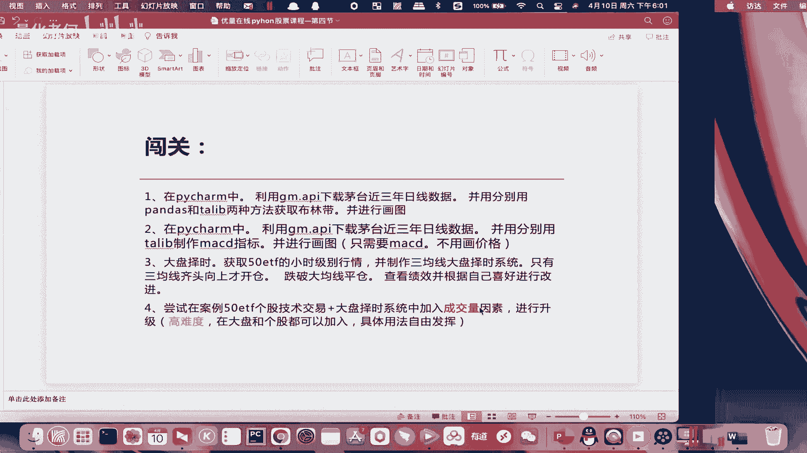

同学们就已经比较容易去掌握了啊，那么这个就是之前发过给大家的，为了同学们的方便学习，我会再发一遍啊，发一遍以后呢，老规矩啊，token自己改，知道没有，token自己要改一下啊，token自己改。

或者你我觉得你直接把代码copy上去就好了，你剩下这个就是你自己的啊，然后这边要给大家讲了，首先初始化设置了一些参数啊，额有用布林带了，布林带就是这三个参数有用一个长的均线了。

这个长的均线是用来做一个方向性的，一个过滤的好吧，然后这边一个index index就是大盘的意思啊，index就是指数嘛啊指数的一个，60啊，应该是一个均线啊，指数60均线。

然后percent这里就0。1，因为这个下单呢就不按手数了，我们按资金资金量来下来下单，对不对，然后这边我弄了一个折时的开关，折时开关怎么用，后面给大家讲啊，所以这个策略本身就是有点偏中高阶了啊。

我是希望同学们能够看懂哈，然后这一行就是get container啊，这个你们要去查啊，怎么查，不用我告诉你了吧，在那个文档上面自己查，这个是有什么用啊，总之这个的作用就是获取我这个50ETF底下。

因为这个是00050嘛，这个是大盘嘛，对不对，这个大盘底下的个股啊就能获取出来了，那这边你可以设断点，看看你的个股选哪50个个股，然后这边就对这些个股进行一个订阅了，订阅这边就是900秒。

900秒是多少，时间除以60就是15分钟，对不对，这不就除以15分钟，这个account你要去取足够多的一个数量，因为你看这这里最大的就是一个1440嘛，所以我就写1500啊啊这个是没问题啊。

然后这边有两个订阅，另外一个订阅就是这个index index400050，是不是就是我们呃五零的这个股票，然后它的周期是一天，one day1天是吧，在这里我们就可以同时订阅两个了。

就订阅两个推电两个之后呢，有些同学就问哎，你来两个，你两个不同周期的B你怎么区分，然后我们这里B点FRS这里来，我们可以对他作为一个区分是900秒的，亦或是亦或是你那个，亦或是你是一天的。

这样你就能区分出你是大盘还是个股，对不对啊，如果你要问哎，何老师，如果我大盘跟个股都投一个周期怎么办，那你只能是按照你的里面，其他的一些要素来分了对吧，说明暂时就这么做啊。

所以这个OK就大概是这么回事啊，这个这个变量好像没用啊，这好像没用，这两个都好像没什么用，就是订阅完之后呢，然后on bar里面我们就是v goth嘛，v goth层这边就是你等齐这边50个个股。

你才从统一发一个bus，对不对，统一发一个bus啊，然后这这里就只有一个标的，这个这个就没关系了，对不对，然后他这边就会OK发过来，发过来之后呢，那这边就是个股的啦，这边就是个股，GOGO过来之后呢。

contact等data是不是，然后每一个都去取它的一个长，取它的一个那个K线，往前取K线嘛，取到之后计算布林带的三条布林带，还有一个长均线，因为我要做大数均线的过滤啊，然后获取仓位。

获取现在的一个剩余资金，获取总资金，啊下面就接着给大家讲了，就是这边我们的一个收盘价啊，大于不林上轨，还有我们的收盘价大于我们的大均线，所以总的来说就是这样啊，这个策略逻辑就是我给大家画个图。

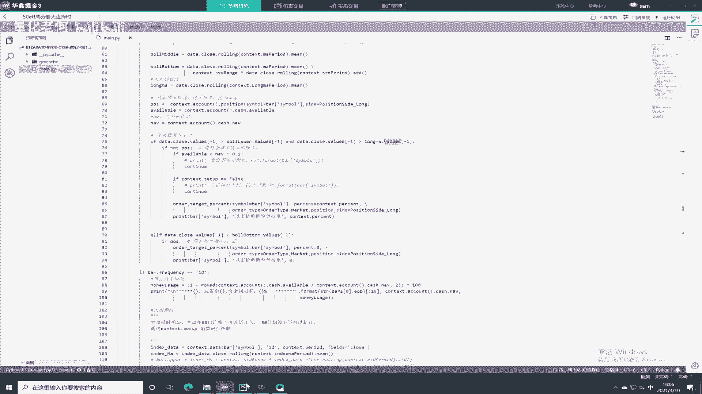

呃这边就是采用，那笔在哪，好这边就是这样子，这就是我的，首先快一条，大的均线对不对，然后画个布林啊，首先跨一条大的均线，这大的均线啊够大了吧，然后呢哎，价格价格这么早吗，这么早。

是不是要这边跨再跨个步流嘛，步流慢一点吧，大概就这样，画的不怎不怎么好看啊，啊啊就是我看看看逻辑。

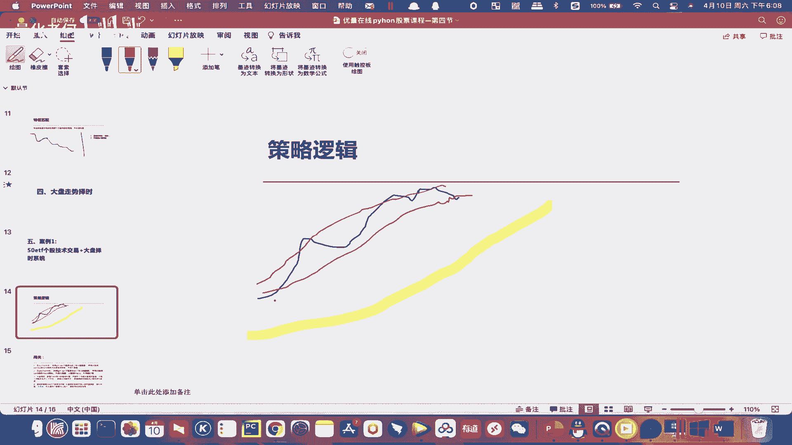

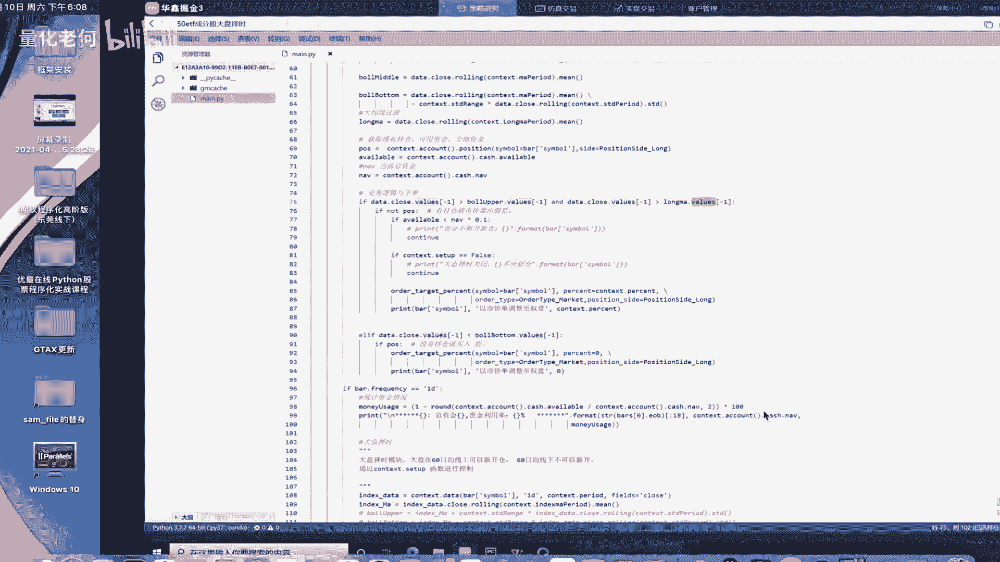

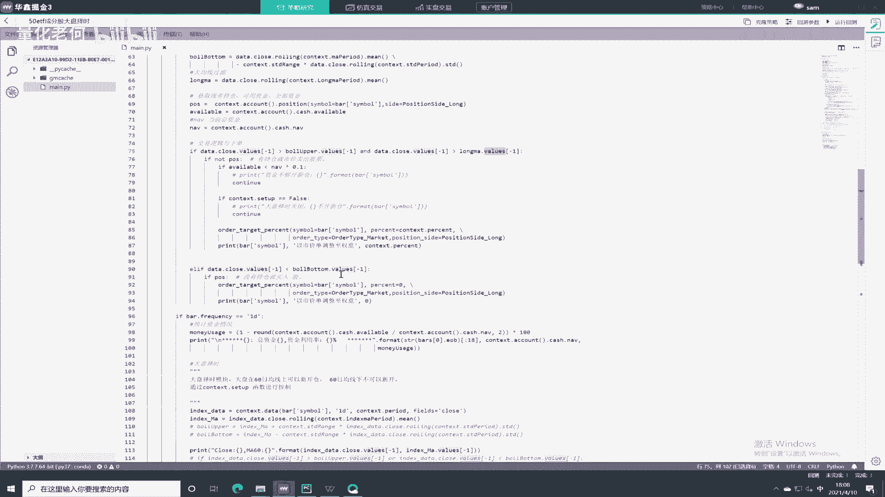

OK明白，就首先我的开仓逻辑呢就是就是说，嗯首先你在价格因为开多嘛，你在股票不能做空，对不对，价格在大均线上面，而且它突破了这个上轨，这里嗯这边这本就开多了，对不对，这边啊开多了，然后他回到了下轨啊。

那就平多了，就希望来虚势的时候，我们通过这样的方式把他抓住。

我们看看代码它是不是这样子，是不是，然后价格大于布林上轨嘛，然后价格大于上大均线，是不是就这样一种方式，然后如果他没有持仓的话呢，呃要判断这里是AVIABLE，是你可用资金吗。

可用资金你小于的你总资金的一成，那就continue就下一轮的就不做了，是不是如果set up sell等于FS，要等一下讲哦，下就一个大盘走势相关的，他这里就是target，就起码你资金够了。

是不是你大于你总资金的0。1，你就可以，这里就是all the target percent，就是按照我直径的总的资金比例去下这个单，要下这里是0。1，就我用一成资金去下这个单，然后就是下单完成啊。

然后呢当我的data等于close，就是1K线嘛，15分钟的K线小于布林下轨的时候，那我就要把权重调至零，就是说我要平掉，OK所以就这么简单了。

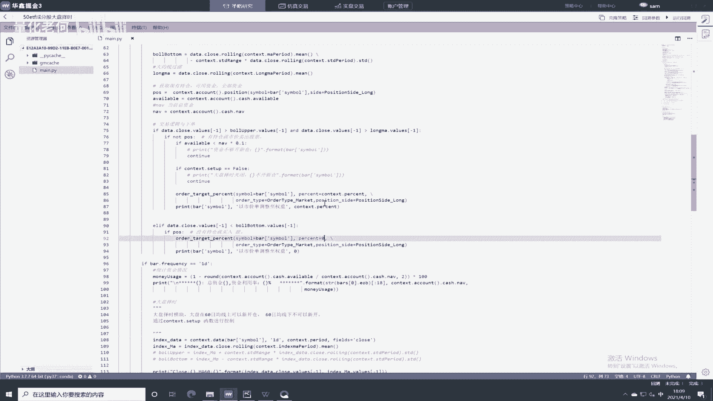

就这么简单，就这么简单，大家都能理解吧，都能理解吧，啊他这里这里就不太难啊，这里不太难，就是一个开仓平仓的逻辑，搞清楚之后呢，我们后面还要讲一个大盘的择时的问题。

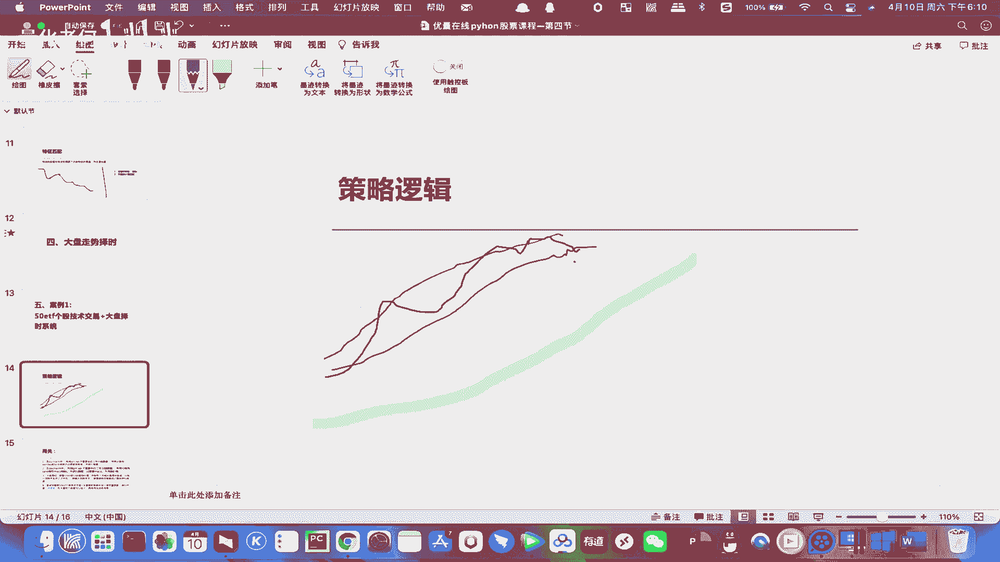

大盘直接我就不画图了，直接给大家看啊，给大家看，index data的这边呢就是获取它的一个，因为我之前subscript是预线嘛，那这边content data获取数据也是预线啊，也是日线。

然后这里弄一个MAMA这里是60嘛，我就60域，60个日线级别，E线级别的60K60个ma ma60啊，明白吗，就是一个日线级别的60天的一个均线，用60天的均线来做过滤，当它在60天均线以上的时候。

我这个是set up，这个对不对，是一个开关了，就打把它打开啊，这个大盘折时打开就说明了它可以开多是吧，这大盘持时关闭的时候呢，啊我就设置它不能开多了啊，不能开多啊。

在这边我们开仓的时候是不是有一个CR8，如果set up等于false的话呢，它就continue啊，就不往下走了，就跳出这这一轮循环，对不对啊，所以说他这里的一个大盘折时的逻辑是，如果你的日线级别的。

这个大盘的指标在60日均线以下的话呢，他就是不能开新仓，不能开新仓，但是他并没有要求他把现有的仓位都平掉，它什么时候平，还是按照个股它的一种方式来做，对不对啊，所以这个策略大家都拿去跑一下。

这个策略是一个正收益的一个策略啊，正收益的一个策略稍微改一下呢，它是有可以实盘的潜力的啊。

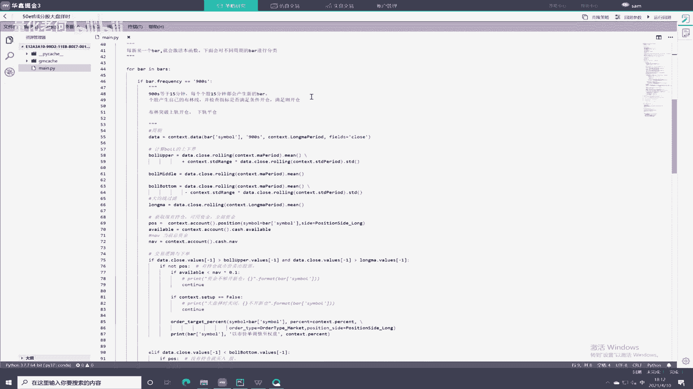

这还是需要改进还是需要改进，这就是我们的一个啊，我们的一个做法，就是它首先它有个股的一个布林带，加大均线的做法，然后大盘只是用了六十六六十根那个啊，60日均线，然后他这中间有联动。

然后下面的下面呢要求大家，这个闯关要加入成交量的一个因素进去啊，简单一点的做法是，加入大盘的一个成交量的因素进去啊，这一点也希望大家做一下，但是最后一个闯关题，对绝大多数同学就不做要求嗯。

对绝大多数同学的要求就是说你看懂，我给你们的这个案例策略就好了啊，如果你不具备改造的能力，就不要改，好不好，如果想挑战一下的话呢，就可以做一下第四题啊，前面三道题是要求一定要做的好不好。

OK那今天的课程内容就到这里啊。

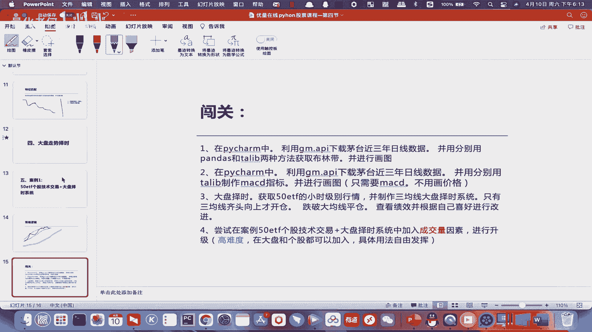

啊非常感谢各位支持啊，何老师的课程，希望大家都能听得懂，而且能完成我们的作业。

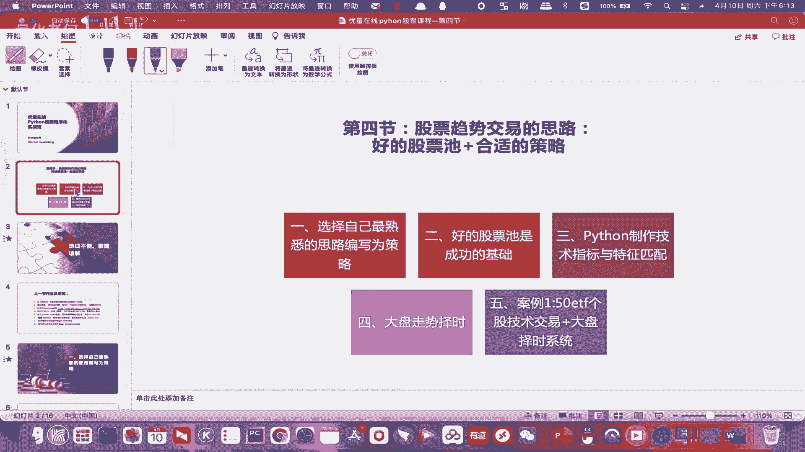