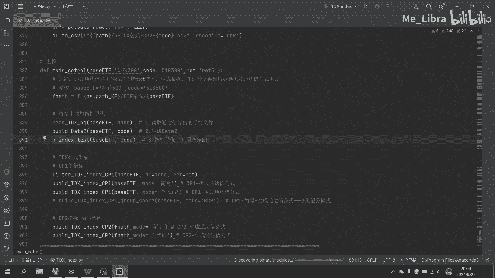
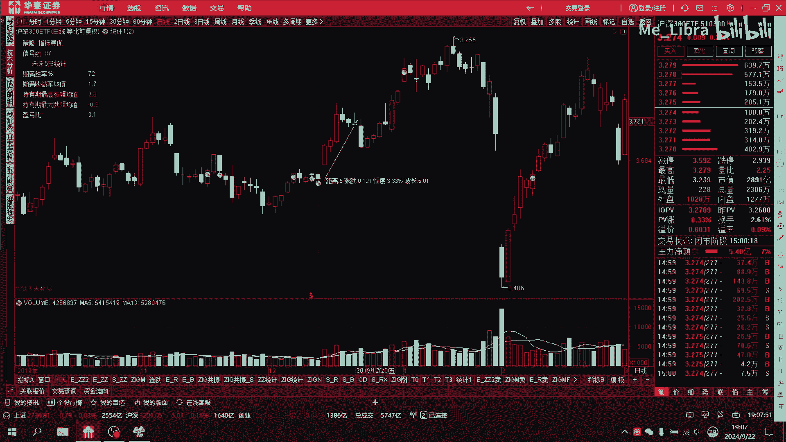

# Python自动指标寻优 生成通达信公式 - P1 - Me_Libra - BV18xskepEcC

我最近想做一个工具，就是指定一个个股，借助Python的程序化呢自动的构建很多很多指标，然后呢在指标和其相互组合中，找到优势的高胜率指标，然后找到其参数，最后将这些挖掘出来的优势条件呢。

自动生成通达信的指标公式。

可以在通达信中直接使用，然后还可以在通达信里记住一个个的统计指标，直观的观察这个策略的胜率及盈亏比情况，就比如说我们拿这个沪深300的ETF来举例，最终的策略呈现效果是这样的，其中左上角的这部分呢。

就是这部分就是Python指标挖掘之后的策略，在通达信里的统计数据的展现，这些数据和Python的回测统计结果是一致的，其中图中这些黄色的点是策略所对应的信号点，我们将其标记在了其实K线的收盘价的位置。

统计内容呢包含了这几个部分，总体的信号数，期满后的胜率，起码收益率均值，持有期最高价的涨幅均值，还有持有期最大的亏损均值，还有基金亏比，我们先挨个介绍一下这些统计数据的意义，信号数顾名思义呢。

就是这个行情里总共出现的信号次数，在数据挖掘过程中呢，我们希望的信号数量及分布的情况，是什么样子呢，首先是希望信号足够的多，这样就可以满足我们日常的交易频率的要求，另外就是信号足够的分散。

这样就可以满足我们对数据统计可靠性的要求，一般来说呢对于一只单只的ETF，我觉得一个月左右，有一次可靠度高的信号就可以了，我们也是根据这个来控制Python数据挖掘的目标的，如果想要提高信号密度。

那我们就多添加几只ETF或者个股就可以了，几个个股同时提供信号，就完全可以满足我们日常的交易平等的要求了，期满你的胜率呢这个很好理解，也就是买入之后持有固定时长的日期，然后到期后卖出，如果卖出后为盈利。

则即为一个胜利一次，如果为亏损呢，则即为失败一次，而所有的交易次数中呢，胜率次数的比例即为起码胜率，这个是我们评价一个交易策略是否为优势，策略的最最重要的一个指标，期满收益率均值，也就是说在所有信号下。

持有期满后平均收益率的均值，持有期最高的涨幅均值，举例子来说，比如说我们持有五天，那么这个就是在我们五天中达到最高的涨幅的，平均值是多少，同理社区的最大跌幅均值，就是在这五天中可以达到最大的亏损的均值。

但是这个亏损不代表，最后持有期满的真实亏损哈。

只是在持有期期间的最极端的亏损情况，的一个均值统计而已，盈亏比这是另一个特别重要的指标，也就是上升空间和下跌空间的比值，在这里呢，我们取持有期最高涨幅均值除以最大跌幅均值，作为盈亏比。

我们进行Python数据挖掘的目标，就是找到一定持有期，比如说5日持有期，下期满，剩余期买胜率高，收益率均值高，其盈亏比高的指标，这个对于不懂编程的人来说呢，基本上只能靠人肉一个一个的策略的去试。

不仅指标编写麻烦，进行指标组合的测试，也只能是无头苍蝇一样乱撞，更何况大部分人可能还不会写通达信公式，这对于他们来说，投资真的只能是人云亦云，没有自己的判断，没有评估标准。

在网络上或者在投资书上看别人推荐的指标，盲目试错，任人欺，偏于宰割，经过多年的Python回测，我其实发现一个现象，就是网络上和书籍上盛传的那些形态策略，基本上大多是无效的。

也就是说经过全A股的Python回测测试，你会发现他们的胜率基本上只是一半一半，也就是说网上流传的那些形态策略的成功案例，只是经过筛选，只是经过精心筛选之后展示给你的罢了。

还有另一半失败的案例根本就没有展现给你，你也看不到，所以你不知道，作为理科生呢，我只相信统计数据，所以我在想能否借助Python强大的编程能力，来帮助我们自动测试大量的指标，并自动寻找优势的指标组合。

比如说我通过我通过程序自动测试，指标及其组合高达10万多组，这是我人工手动一个一个测试，10年都测试不完的工作量，在这个想法下，我爆肝一个月，编写了这个程序工具，针对指定的单个ETF进行指标扫描测试。

进行各种情况下的条件组合的胜率及盈亏比，统计情况，然后在这些条件组合中，筛选出符合我们要求的，胜率及盈亏比的指标组合，这将作为我们最后转换成通达信公式，的最终组合，然后下一个问题就来了。

优势指标组合已经通过Python选出来了，那我们该怎么将这个转化成通达信的公式呢，刚开始是需要人工手工的，在通达信中根据Python挖掘出来的指标，构建对应的通达信指标。

然后在通达信中一个一个的编写公式，组合条件说实话很累，而且很容易编写出错，而且对于懒人来说，确实不喜欢这么低效耗费劳动力和时间的事情，所以我在想，如果能再编写一个程序代码。

然后将Python自动寻找到优势指标之后，自动的将优势指标变形成完整的，从拉线公式就好了，于是又抱肝数日，容易实现了这个想法，我现在要做的只是把Python自动续约后的结果，生成了通达信公式。

直接粘贴到通达信里就好了，然后借助通达信里的统计指标，来观察策略的效果，完美运行。

唉不过值得指出的是，这个指定ETF的挖掘出的策略，只针对指该指定的ETF有效，对其他的股票或者ETF，它未必是有效的，因为这是个高度定制化的策略，该挖掘是挖掘该股的股性的策略。

而不同的股与基金的股性是不同的，你要按照他的股性来，而不是盲目的用于测试性格完全相反的个股，当然也有人会问了，虽然这个数据回溯很好看，但是过去的统计数据并不代表未来也是如此啊，这个确实是这样。

但是如果你连过去的统计数据都不相信的话，而只能靠人云亦云的随波逐流，那这个和赌博是不是更没有任何区别呢，当然呢胜率只是一方面，很多时候你在买入之后如何进行仓位管理，这是一个另一个。

这是另一个特别重要的部分了，比如虽然胜率只有50%，但是你通过合理的仓位管理，是可以将胜率再提高不少的，比如说定投网格交易等等等等的一些方法，这是后话啊，后面我也会专专门针对这些资金策略的，一个策略。

编写具体的程序，进行一个相关的回测，寻找在这些指定策略下最优势的仓位管理策略，这样的话在高胜率的策略结合最佳的仓位管理，在高胜率的策略结合最佳的仓位管理策略，那么这就是高确定的事情。

再也不会被没有回测验证的，低胜率的策略所欺骗，那如果你有想挖掘的个股或者ETF，甚至或者期货品种，只要是通达信上可以查到的，任何品种都可以联系我，我可以帮你把这个个股的股性挖出来。

一键生成你的定制化的高胜率的策略。