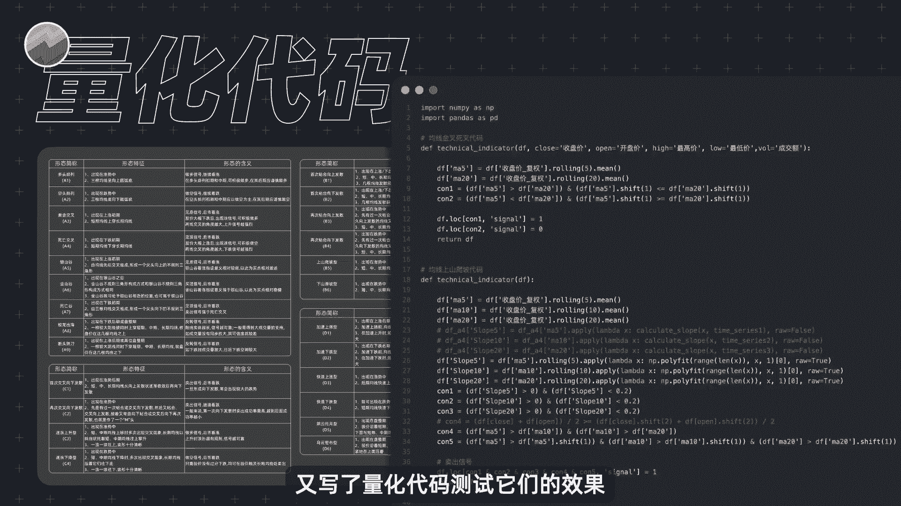
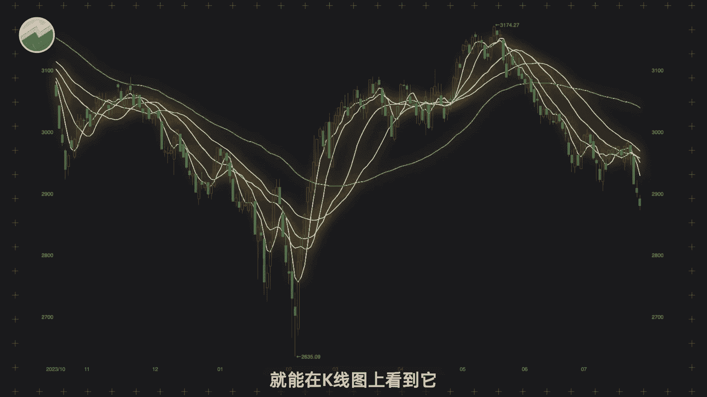
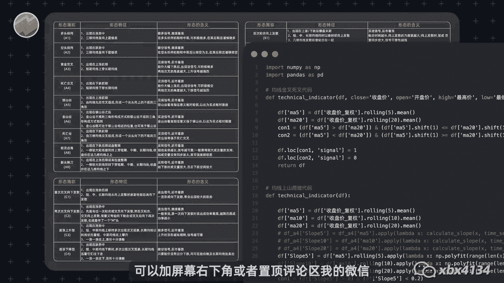
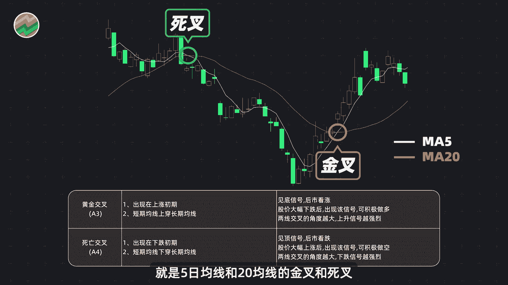
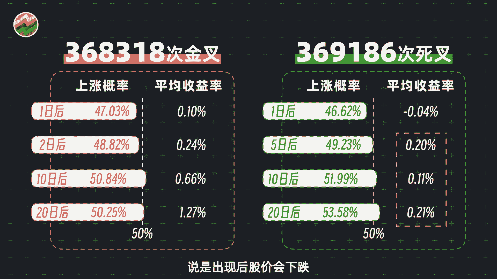
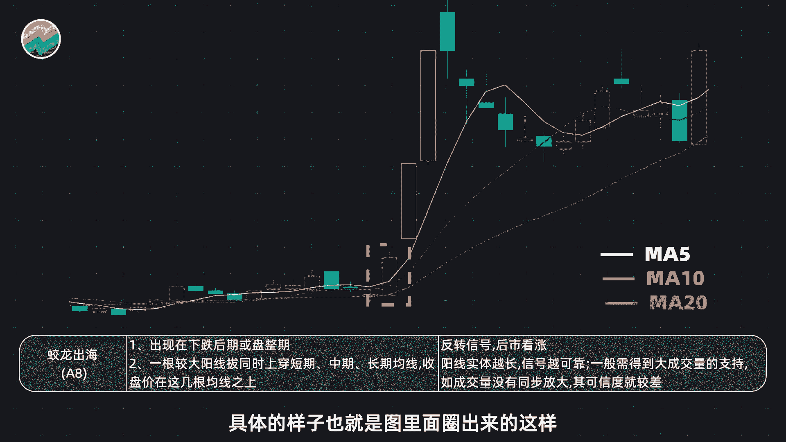
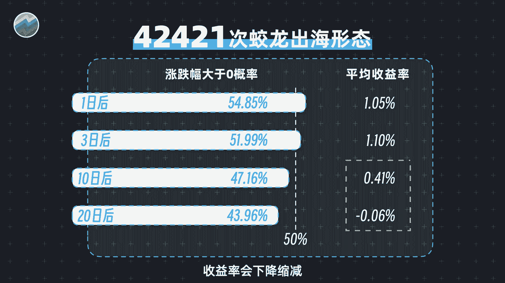
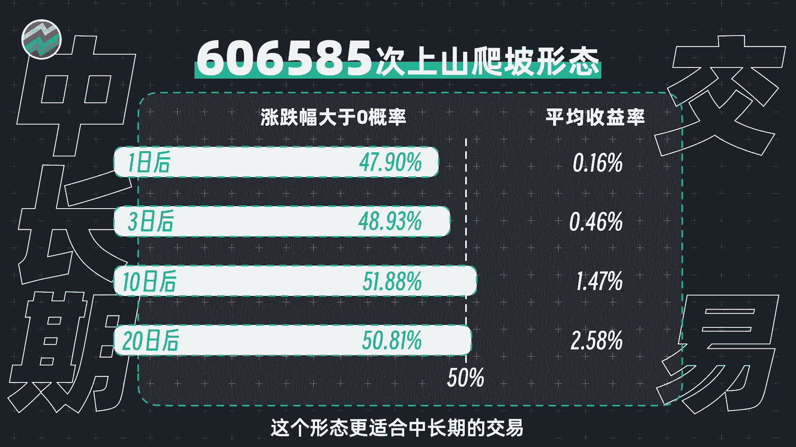
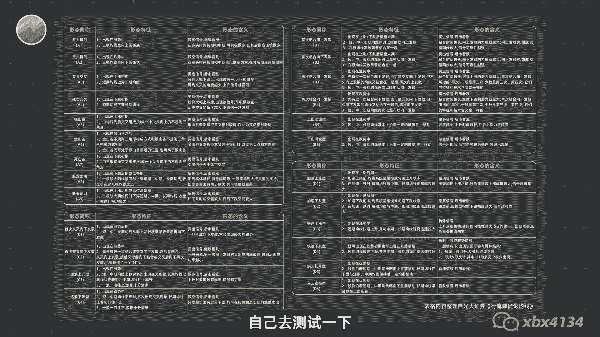
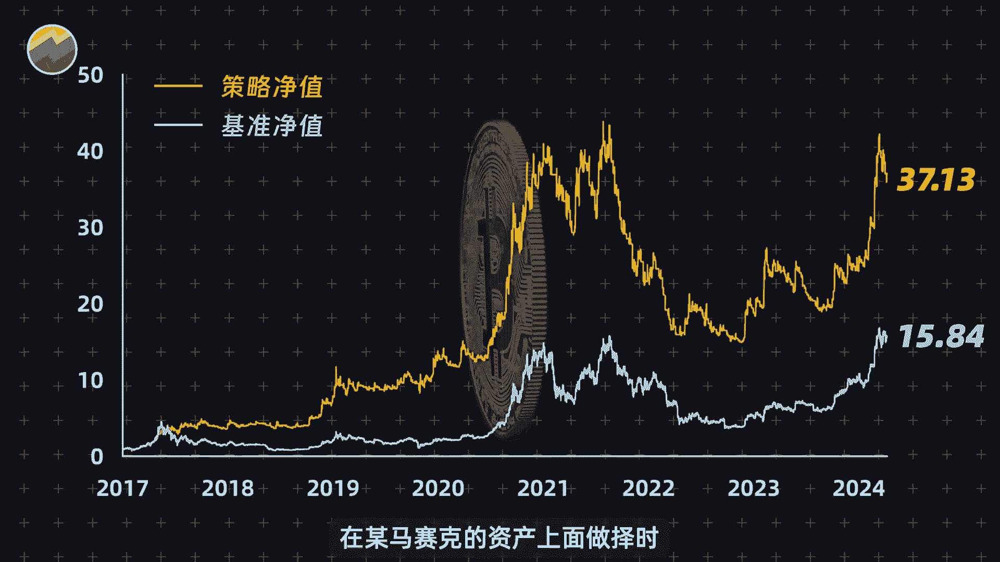

# Python量化25种均线用法，哪些有用，哪些没用？【量化交易邢不行啊】 - P1 - 量化交易邢不行啊 - BV1vz421B7ZB

我整理归纳了炒股最常用的25种均线用法。

又写了量化代码测试它们的效果。

就为了挑出几个最能打的形态分享给大家，大家好，我是专注于量化投资的。

行不行，炒股的朋友应该都知道均线吧，毕竟打开行情软件就能在K线图上看到，他一些官媒的报道当中也会用它来分析行情。

我也经常在网上看到一些老师说，用他们的均线战法，一年能翻好几倍，那当然是很激动了，但我们做量化交易的还是比较习惯用数据说话，老师们的案例虽好，可只有一张图，也很难让，但我相信我就花了点时间。

整理出了25种最常用的均线形态，还归纳了它们的用法，又写了一个可以测试所有形态效果的Python，量化程序，就把他们都测试了一遍，总的来说呢有好有坏，下面就挑几个有代表性的介绍一下。

剩下的呢可以加屏幕右下角或者置顶评论区，我的微信问我拿那测试的程序代码和数据。

自己去试一下，首先呢就是大家平时用的最多的均线，金叉和死叉。

它们的用法是这样的，图中我们圈出来的就是5日均线和二，10日均线的金叉和死叉。

测试结果呢是这个样子的，从2007年至今，金叉和死叉都出现了大概37万次，胜率也都不是很高，但是金叉的赔率呢还可以，平均收益，在短期内基本上可以忽略不计，但中长期表现来看还是不错的，至于死叉。

说是出现后股价会下跌。

可结果却完全相反，确定这真的是一个卖出信号吗，我们再介绍两种测试效果最好的均线形态，一个叫做蛟龙出海，它的用法呢是这样的，具体的样子。

也就是图里面圈出来的这样非常的霸气啊，一根大阳线，千军万马来相见，用历史数据测试的结果是这样的，当中出海形态在出现了短期内，未来股价上涨的概率呢都是在50%以上，平均收益呢也有百分之一点几。

但中长期看啊，收益率会下降。

所以总体来看呢，这个形态更适用于短线交易，而非中长期的持有，还有个形态呢叫做上山爬坡。

它的用法是这样的，具体案例呢如图所示，测试结果呢是这个样子，形态出现后，股价在短期内上涨的概率并不高，平均收益率虽少，但在稳步上升出现20天之后啊，更是高达2。58%，这对于一个简单的均线指标来说。

已经算是很高了，更何况它还出现了60万次，总的来说呢，这个形态更适合中长期的交易。

均线形态的效果呢我们就介绍到这里，剩下的用法，因为时间有限，没法一一展示，你可以加屏幕右下角或者置顶评论区，我的微信问我要了程序和用法，自己去测试一下。

最后给大家透露一点小秘密，虽然我们测试出A股的部分均线用法是有效的，但就像我经常说的，与其花时间提高牌技，我更愿意寻对手更弱的牌局，其实也就是说我们不用去高手扎堆的地方。

要更主动的去寻找一些竞争对手更弱的环境，光是交易啊，在平时的生活工作当中，换一个对手更弱的牌局，也会让你更加的轻松，在均线上面呢也是一样，比如就算只用最简单的均线指标，在马赛克的资产上面做择时。

我们也能得到很好的策略效果，所以说我们要用科学的方法做投资，而不是仅仅主观的去拍脑袋，根据一些似是而非的经验去做决策，归根到底一句话，用数据说话。

感谢大家的点赞，关注和转发，我是行不行。