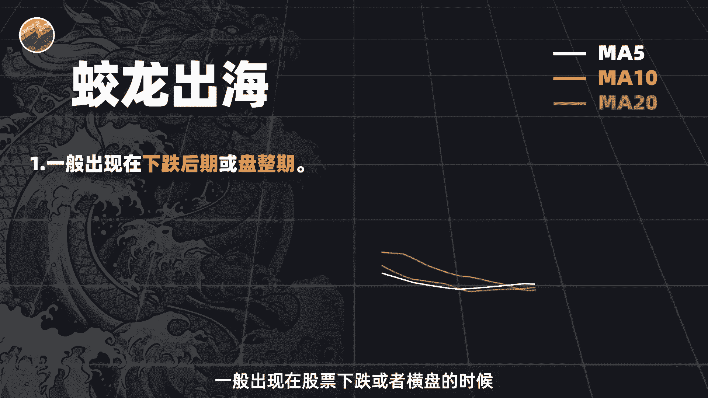
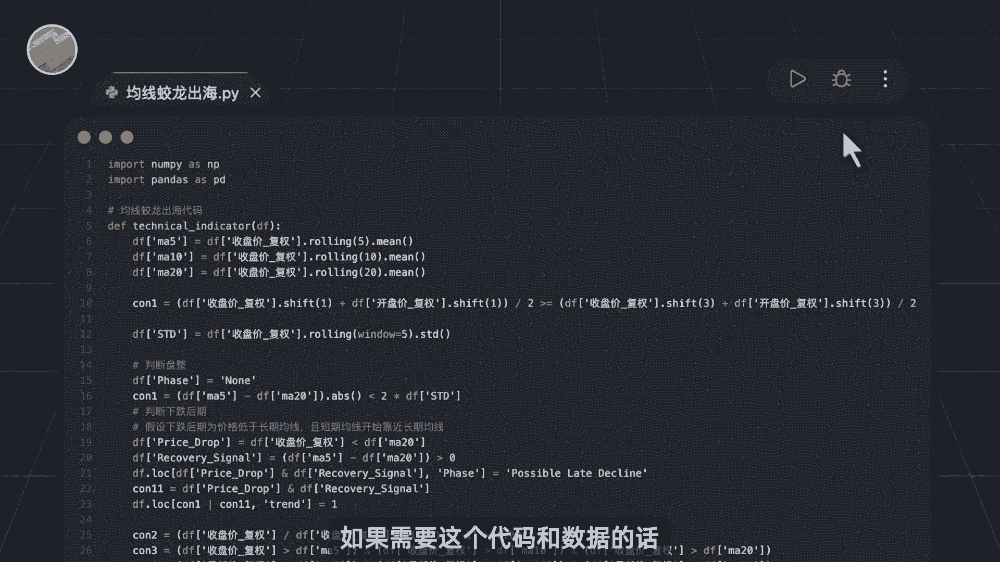
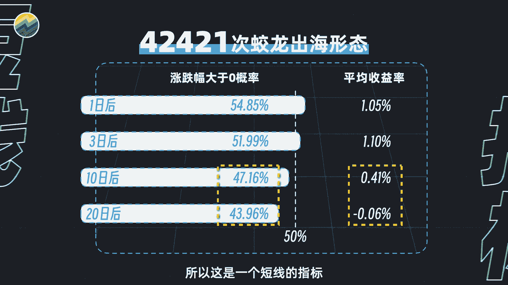
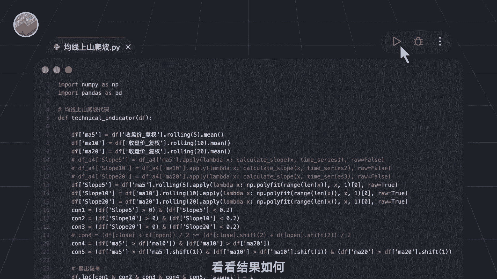
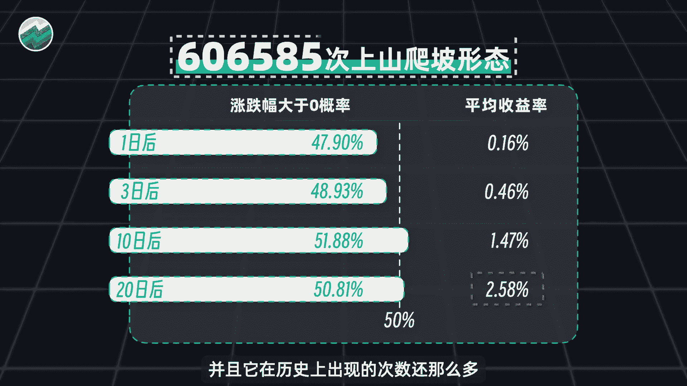
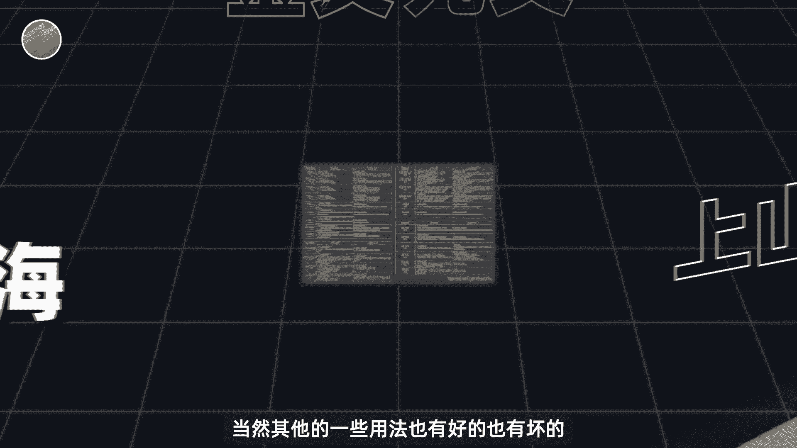
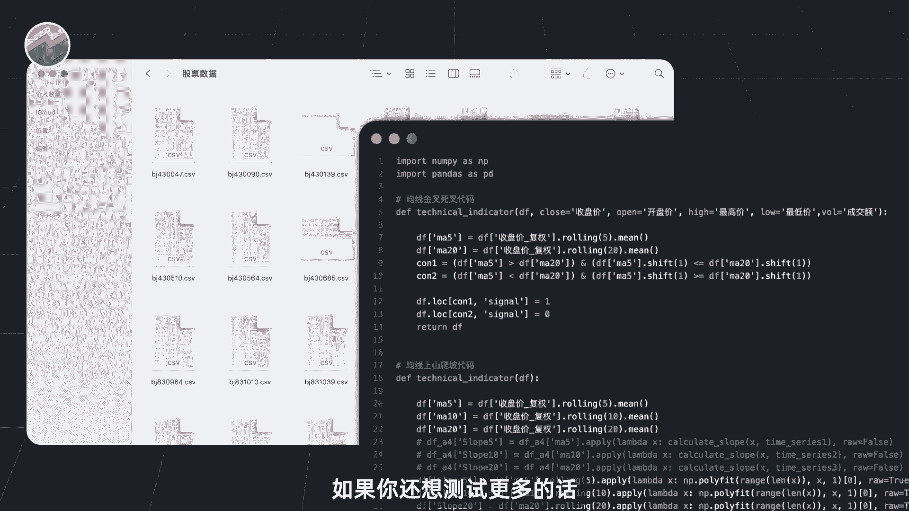
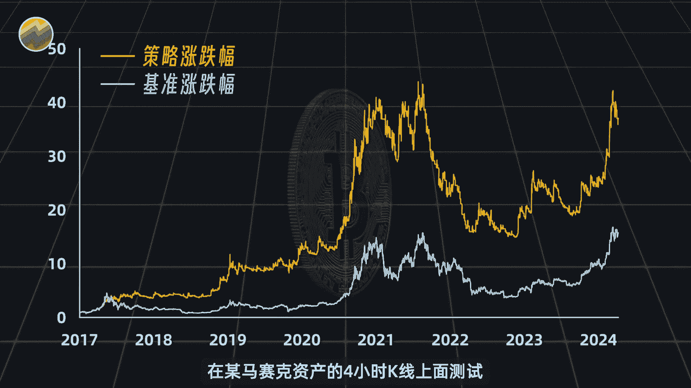

# Python量化25种均线用法，哪些有用？【量化交易邢不行啊】 - P1 - 量化交易邢不行啊 - BV1nb421p7Lr

大家好。

我是专注于量化投资的，行不行，关注我科学投资不盲目，我们就直接介绍两种测试表现优异的用法，我们先来介绍蛟龙出海的用法，这霸气的名字一听就感觉不同凡响了，根据网上的描述呢。

这个形态一般出现在股票下跌或者横盘的时候。

当我们看到某一天一根较大的阳线自下而上，穿过了5日，10日20日均线，并且呢最后收盘价在这几根均线之上，这就意味着蛟龙出海了，后续股价会不断的上涨，途中圈出来的地方就是蛟龙出海，形态，非常的霸气啊。

一根大阳线，千军万马来相见，那蛟龙出海这个均线形态实际效果又如何呢，我们同样借助全部A股历史数据和Python代码，来帮助我们进行计算。

你只需要打开这个PY后缀的代码，点击运行即可，如果需要这个代码和数据的话。

大家可以在评论区留言，也都是可以直接发给大家的，程序运行结果呢如图所示，从2007年至今啊，蛟龙出海形态总共出现过4万多次，在出现之后的短期内呢，未来股价上涨的概率都是在50%以上。

平均收益率啊也很不错，有百分之一点几，但中长期看啊，收益率会下降减缩，所以这是一个短线的指标。

所以总体来看，这个均线形态更适合用于短期的交易。

而非中长期持有，除此以外呢，还有上山爬坡型，也是我们测试后认为值得聊一聊的均线形态。

上山爬坡型一般会出现在涨势当中，5日十日，20日均线会沿着一定的坡度向上移动，坡度越小，上升时间越长呢，未来的上涨力度也就越强，比如这个图中的股票，在这段时间内，它的三根均线就像登山一样在不断地爬坡。

而且这座山呢也不是很陡峭，所以当这个形态确认之后，股价也在不断的温和上涨。

我们也同样写好了上山爬坡行来的代码，运行一下，看看结果如何。

从07年至今呢，上升爬坡形态总共出现了61万次，这个形态出现之后啊，短期内，未来股价上涨的概率并没有超过50%，平均收益率虽然少，但是呢又稳步上升，出现20天之后啊，平均收益率更是达到了2。58。

相对于这样一个简单的均线指标来说，已经是很惊人的收益了，并且它在历史上出现的次数还那么多。

所以总的来说啊，上单爬坡形态比较适合中长期的一个交易。

至此呢，我们从25种均线和方法当中，挑了最常见的金叉和死叉进行测试，也介绍了两种，我们认为在不同情况下有有效果的形态，当然其他的一些用法呢也有好的也有坏的。

时间有限，我们就不一一介绍了，如果你还想测试更多的话。

大家可以在评评论区留言，问我要的数据和代码把玩一二，亲自测试一番，虽然我们上面分享了几个不错的形态，看似跑跑代码就能得出很简单的样子，但说实话背后花费的精力却一点都不少，比如说均线的联合趋势的确认。

各种模糊到无法量化的表达描述，这些都会让我们很头疼，最终研究出来确实花了很多的精力啊，并且呢25种形式在当中只挑了两个，给大家分享介绍，性价比很低，所以非常需要大家的点赞支持，点完赞之后呢。

这边可以再给大家透露一个小心得，虽然我们上面在讲到了，均线在A5上面的部分用法是有效的，但就像我经常说的，与其花时间提高牌技，我更愿意你花时间寻找对手更弱的牌局，这句话的意思是呢，不要去高手扎堆的地方。

要更主动的去寻找一些竞争对手更弱的环境，其实不光是交易啊，在平时的工作生活当中，换一个对手，个人的牌局会让你更加的轻松，那这句话放到均线上面也是一样的，比如说我们就用最简单的均线指标。

在某马赛克资产的四小时K线上面。

测试得到的数据，这个呢就是效果好，最后还是那句话，我们要科学的做投资，而不是仅仅主观的去拍脑袋，根据一些似是而非的经验去做决策，归根到底一句话，用数据说话，那么本期视频就到此结束，我是专注量化投资的。

行不行，关注我。