# Python量化25种均线用法，常见均线有哪些？【量化交易邢不行啊】 - P1 - 量化交易邢不行啊 - BV1yx4y147Bo

大家好。

我是专注于量化投资的，行不行，关注我科学投资不盲目，首先呢我们来验证最常见的均线用法，金叉和死叉，假设我们现在有两根均线，代表短期的5日均线和代表长期的20日均线。

当5日均线从下往上穿过20日均线的时候。

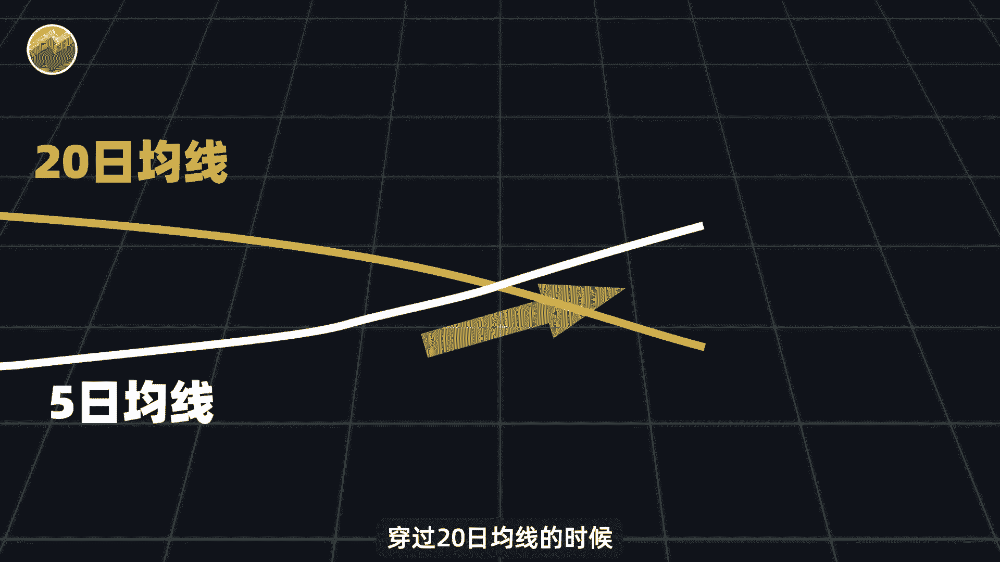

就会形成一个交叉，英文叫做cross，然后大师们说啊，这是一个非常好的买点。

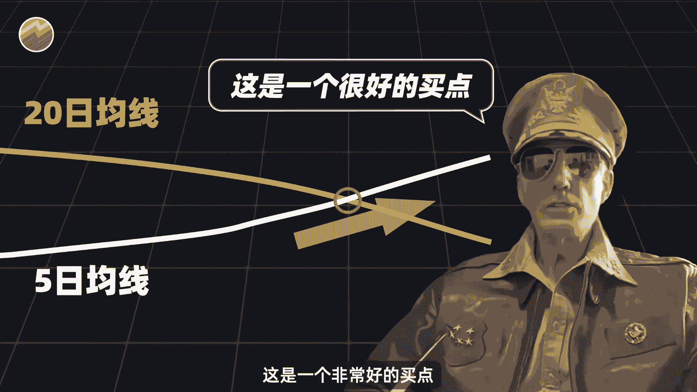

此时呢应该去买入股票，所以呢就把这个交叉叫做黄金交叉，简称金叉。

意思啊就是这个买点价值千金，我印象中，很早很早之前有一篇讲A股股市的小说，名字就叫做金叉，大家感兴趣可以找出来一读，回到我们这个金叉啊。

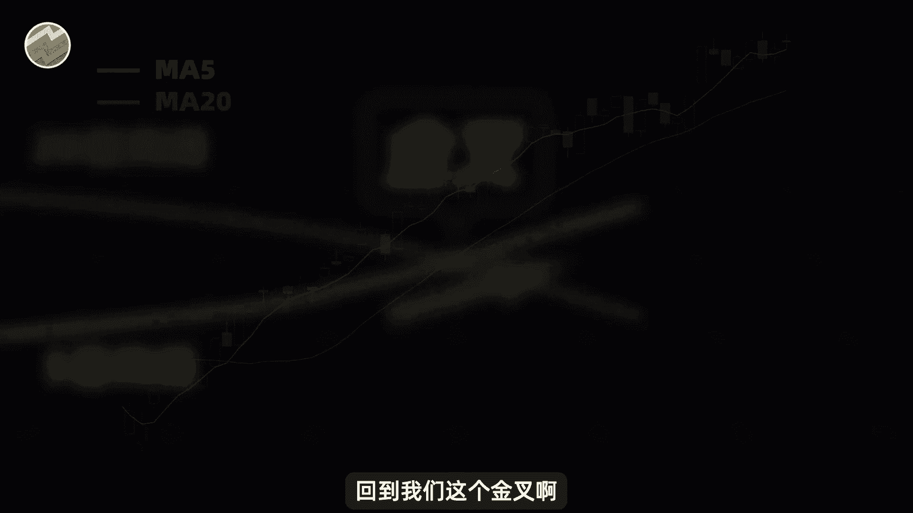

比如说图中这个股票的K线在发生后，股价也确实一路上涨，那么反过来。

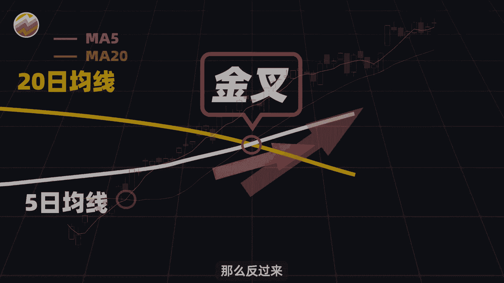

当5日均线从上往下穿过20日均线的时候，就会形成死亡交叉。

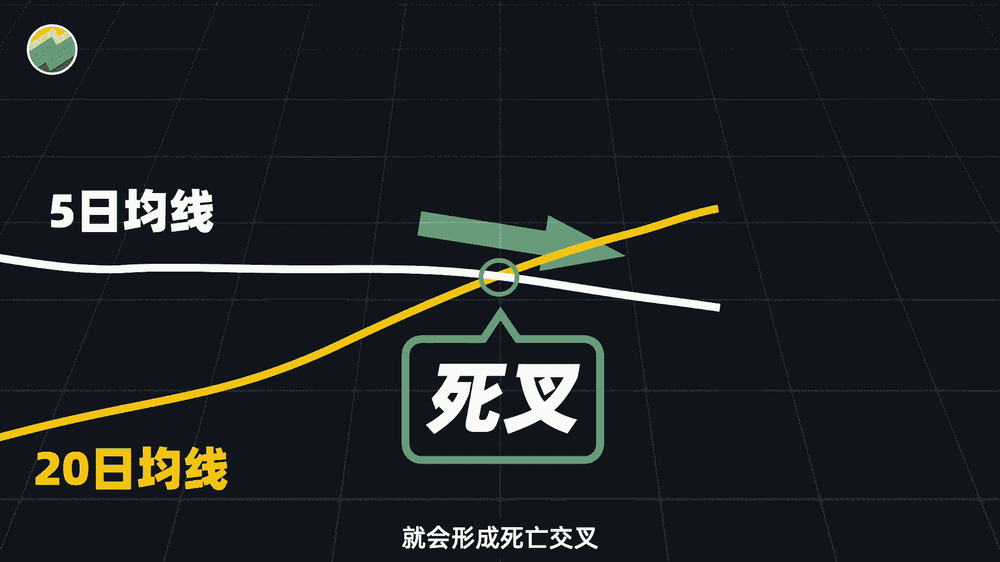

此时呢被认为是股票的一个卖点之后，股价大概率会下跌，称之为死叉。

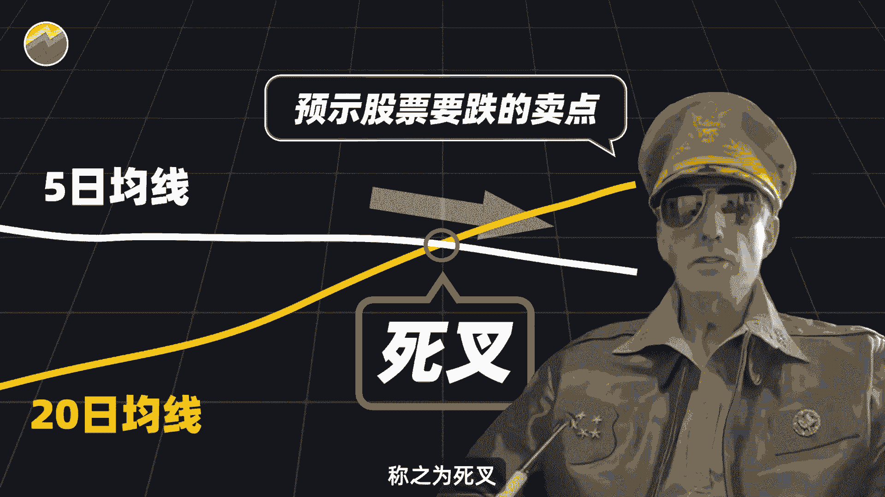

比如说图中这个股票在死叉过后，股价呢就一直下跌，关于均线金叉，死叉的案例还有很多啊，这边个再给大家展示几个，都是我们A股历史上确实发生过的，那么这么一看好像还是挺有用的啊。

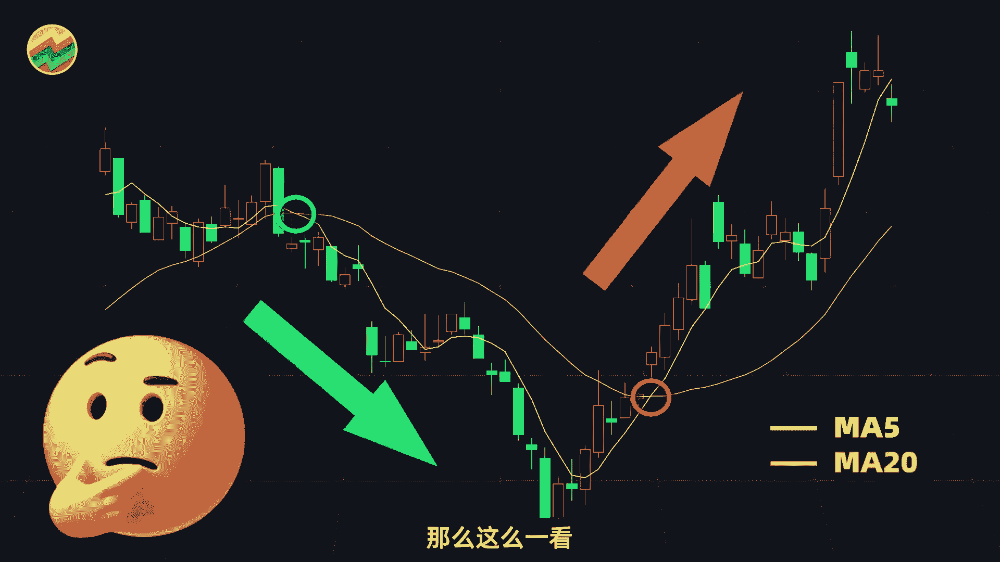

确实金叉之后股价在涨，死叉之后呢，股价又在跌，但我我们啊不能只是像那些股评家一样，对着几张图就轻易的得出结论，想要准确的得出结论呢。

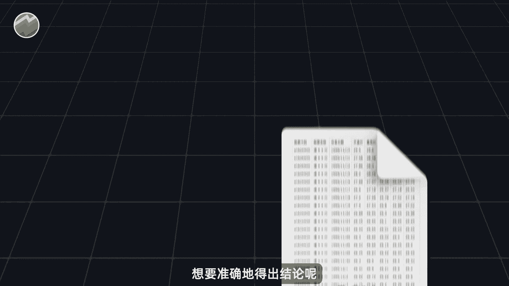

我们需要通过A股全部的历史数据，找出历史上所有的均线金叉和死叉，并且借助Python代码统计之后的上涨一下跌概率，这样才有说服力。

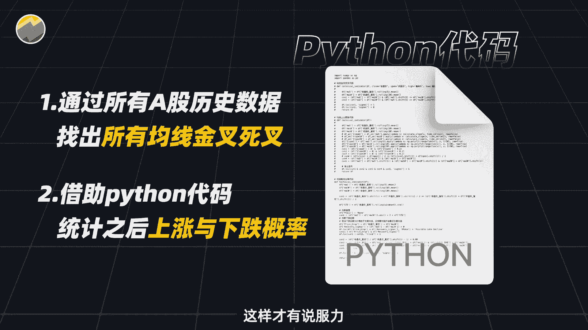

相关的数据和代码呢我们都已经准备好了，你只需要打开这个PY后缀的文件。

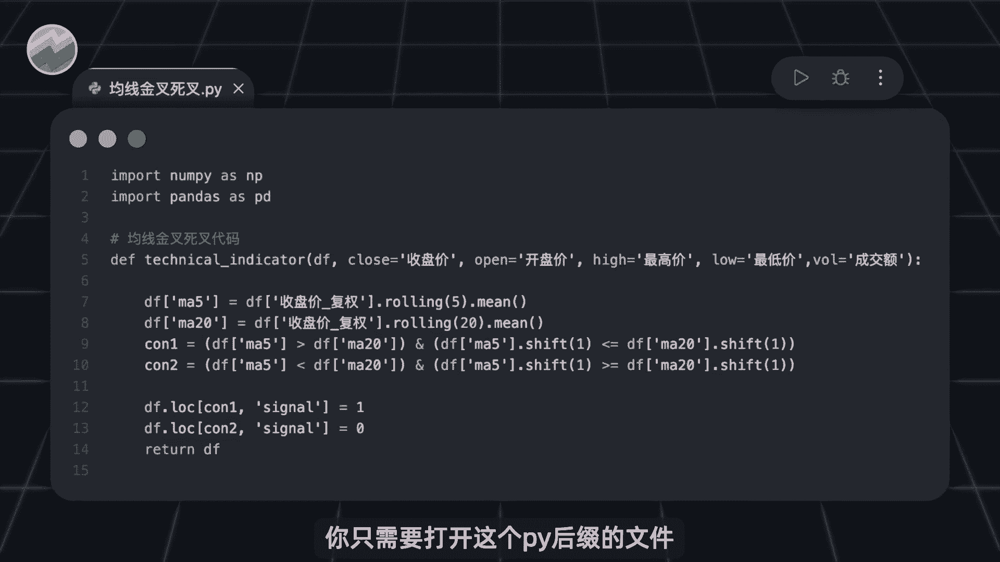

点击运行即可，程序运行结果如图所示，从2007年至今，A股历史上呢总共发生了37万次的均线，金差额复查，金叉发生之后呢，股价上涨的概率大概在50%左右，和抛硬币是差不多的。

并且他的平均收益啊在短期内很小，基本上可以忽略不计，但是从中长期看啊，十天之后它的平均收益率有0。66，二，十天之后有1。27，这个表现是非常不错的，也间接说明了金叉作为这样的一个买点。

虽然他的胜率是五五开的，但是赔率还是可以的，反观我们这个均线死叉发生之后，股价下跌的概率呢，同样是在50%附近，但是未来的平均收益啊，基本都是正和死叉会下跌的，这个预期啊完全的相反。

所以这确定是一个卖出信号吗。

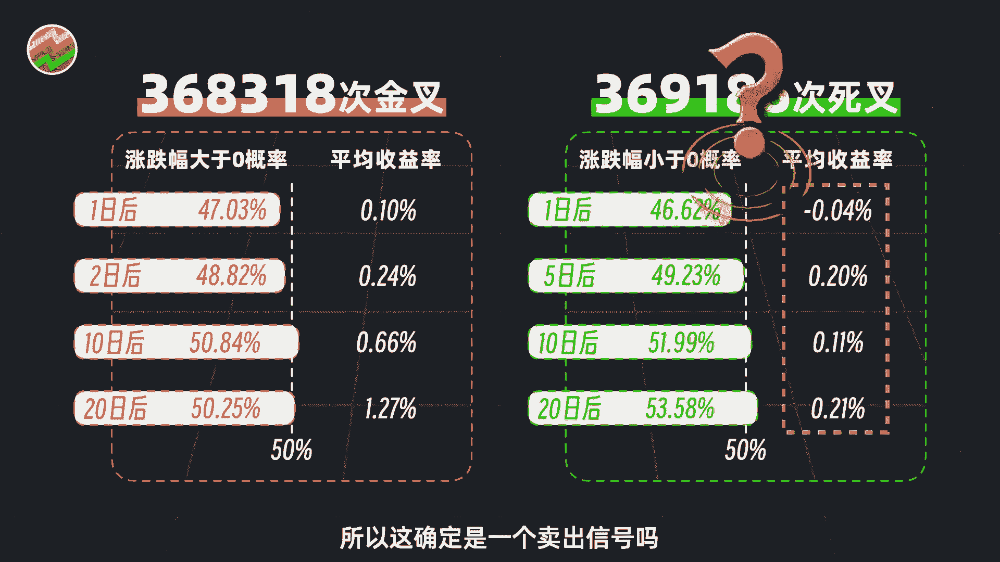

所以有了这个数据啊，就非常直观地证明，不管是金叉，死叉都是不能很简单的直接去运用的。

但不管怎么说，我们也可以确定均线的金叉在上面。

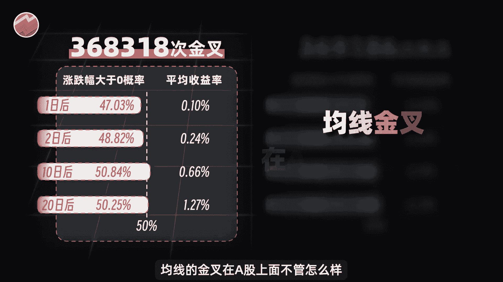

不管怎么样，确实是有一些效果的，而死叉呢则完全没有效果。

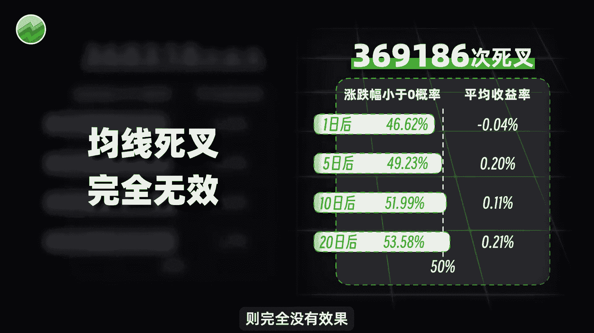

然后呢由于时间关系，剩余的20多种均线用法，我们也无法一一给大家讲解，接下来呢我们就直接介绍两种测试。

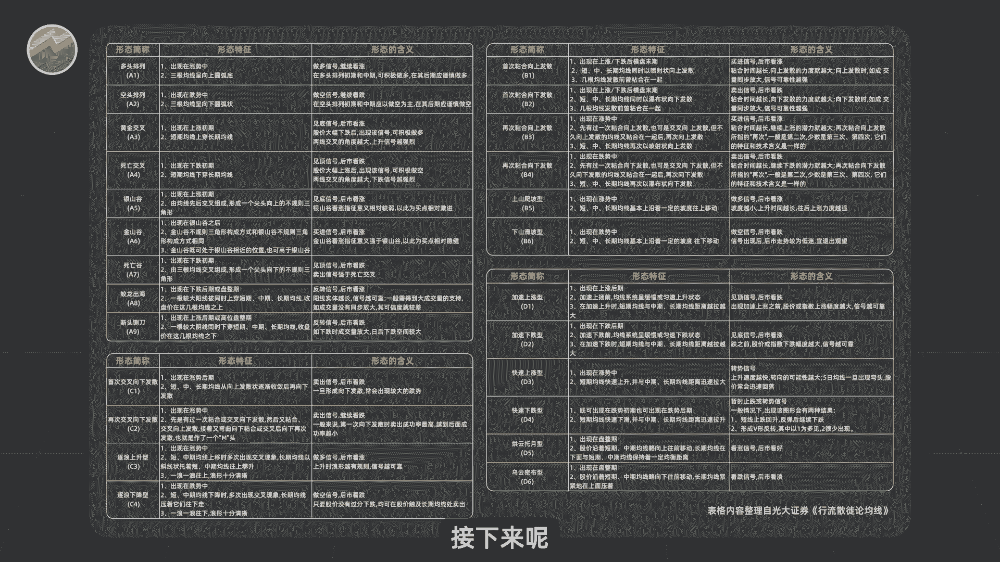

表现优异的用法，至于其他的呢，大家想知道到效果如何的话，可以问我要了相关的数据和代码，自己去做测试，我是行不行。

