# Python量化交易，手把手教你量化开发环境安装及搭建 #自动化 #编程入门 #量化交易 #股票 #期货 - P1 - 无限超人Infinitman - BV1XDtwe9EbJ

Hello，各位亲爱的投资者朋友们，大家好，欢迎来到大抄手量化投资课堂，嗯我们今天呢先跟大家说一个事，就是我们的啊上个视频跟大家说的收尾计划，那这个计划呢，是得到了我们很多投资者朋友们的响应啊。

那我们目前呢第一批的哦培训已经开始了啊，那第一批的话我们主要是面向呢全职的交易员，还有部分有啊量化经验的啊，这个交易员啊，那如果啊我们第一批啊没有选上的比较紧啊，因为我们第一批主要是挑选了十个。

十个左右的这么一个名额啊，因为我们为了保证质量，我们每一批的话我们都是精挑细选的啊，那如果说我们第一批没有通知你啊，就是没有选上的话，没关系啊，我们后面的话，我们第二批可能这几天啊也会通知大家啊。

那嗯希望大家呢也能够认真来参与进来啊，这是哦要跟大家说的这么授予计划的一个事情，那第二个的话呢我们一起来看一下啊，我们嗯上个视频跟大家说了啊，我们年前完成了我们的1。9。8的啊，完整的版本的升级。

那我们现在这个版本几乎涵盖了我们啊，目前的所有的功能，就是我们目前在用的所有功能的改造，基本都是完成了啊，那这个呃改造完成之后呢，我们所有功能我们后面就不再拓展了啊，那会在上面去优化。

那我们现在的版本是1。9。9版本啊，是这几天今刚更新的，那这个1。9。9版本呢，主要是在1。9。8上面做了一些优化，包括我们的运行速度啊方面，还有一些啊啊性能的优化提升方面做了优化。

所以大家现在然后拿的这个版本啊，是1。9。9的版本，如果不是的话，那当我们官网下载最新的好吧，那呃很多朋友反馈说我们的这个版本啊，安装就是我们大号手系统安装上去的话，就很多可能会出现一些各种问题。

或呃什么模块找不到了啊，或者说一些啊没法正常运行这种现象出现啊，那嗯基本的原因是可能你的电脑啊，你的那个呃包括你的Python版本不对啊，或者是说你的电脑的一些一些依赖包，没有按正确的安装起来。

基本的话呢嗯我们这个是呃打出去的这个包，包括我们的开发版也好，包括我们的执行版也好啊，都是非常完善的，我们已经在很多电脑上都测过了啊，如果不是的话，那可能就是安装有问题哈。

那根据各个呃投资者朋友的反馈呢，我们今天呢我们再跟大家进行一遍完整的啊，这个安装啊，希望大家这次能够仔细，再按照我们的这个视频来操作一遍，好吧可以，那么我们嗯现在进行一次完整的安装。

这个视频可能会有点长啊，希望大家呢能够啊认真看下来啊，然后把这个系统希望能够自己安装起来好吧，可以，那安装我们的系统的话呢，首先就要登录我们的官网，那官网的话是不是有很多同学，好多朋友可能还不知道啊。

那没关系，我们直接嗯跟大家讲，怎么找我们官网注大搜索电话投资啊，那中阴癌的话呢，我们的啊这个啊这个就是我们的大号电话投资，简单易用的这个哈，这是我们的大抄手。

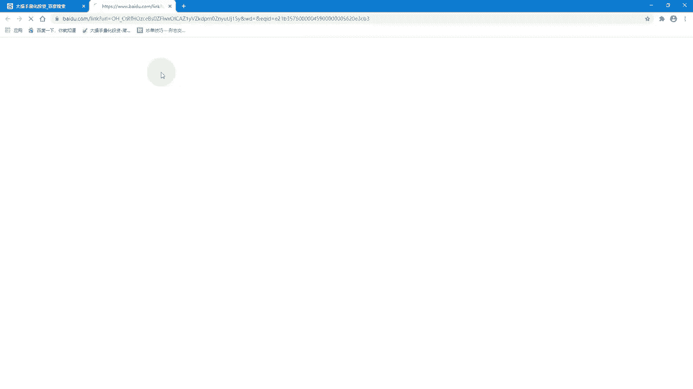

那如果你不输入不搜索的话，那你直接输入我们的文字也可以啊，但是说点com啊，这也可以，那如果说啊进来网址之后呢。

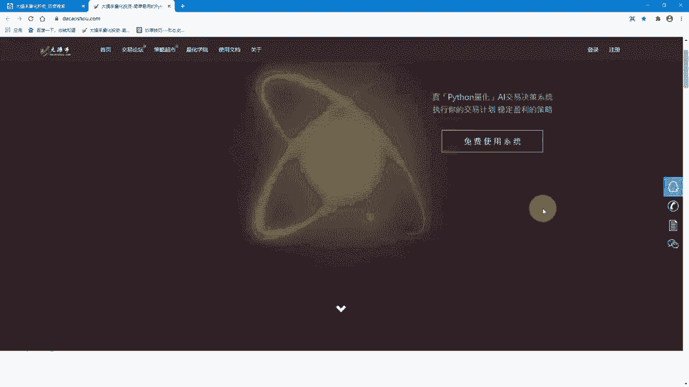

你第一步你没有账号的话，先注册一个账号啊，这应该都知道注册完成之后呢，我们就登录啊，那登录的话呢啊你就账号密码登录完成之后。

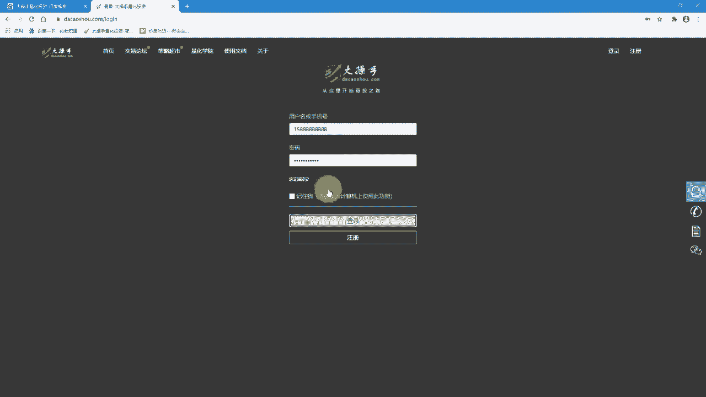

在我们这个后台里面啊，我们可以看到总览可以看到的积分，还有你的token，还有这个啊，后面我们预期做一个完善的话呢，会有时间会去跟大家做一些些啊，包括策略啊，公开的策略，还有我们这个嗯跟整个一些。

包括我们目前在做的一些计划的，所有的知识的材料，可能我们都会上传上来啊，然后呢呃在我们的这个后台这边的啊，决策管理系，决策系统的管理，然后右边啊就点点下来，后面有一个哦客户端下载啊，那客户端下载的话呢。

大家点进来之后，可以在这边看到我们的这个下载链接，还有我们的这个验证码啊，那那你把验证码先复制出来好吧，先复制一下。

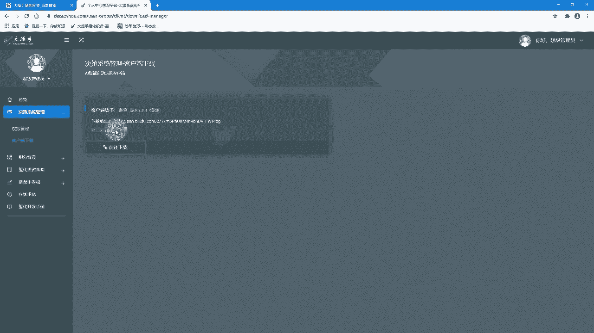

先复制一下，你直接点前往下载，那进来之后呢，呃应该会有一个验证码直接输进去就可以，那我这边应该是已经登录过，所以不需要再验证码啊，那进来之后呢，如果哦如果这些呃文件啊，这些文件的话呢，你可以根据你需要。

比如说你现在要呃执行版或开发版啊，当然我们1991。9。9的执行版，还没有上传上来哈，我们后面会补充，那如果现在我们只需要安装这个开发版哈，我们只要把这个开发版的压缩包给下载下来啊，直接给下载下来啊。

还有啊我们的这个Python的环境，如果你不是python3。7。3的话，你这个也要下载下来，还有包括这些环境的配置依赖，你都下载下来哦，如果你都不懂的话呢，你就怎么样，你就直接把我们的整个这个文件夹。

直接下载下来啊，直接下载下来，这样有问题吗，直接整个文件夹下载下来啊，那下载完成之后呢，啊我这边就不再下载了，因为下载东西比较大好吧，那我们直接来看一下我们下载完成的内容啊，下载的话你可以嗯，下载的话。

它如果需要安装这个啊，百度客户端的话，你就直接去安装哈，那像呃有些是要求你要安装的，你没有安装的话，你就反正就按照他的他的这个要求吧，按照他这个要求去下载下来就可以了，这个应该很多朋友应该都会哈。

这就不再讲得很详细了，下载完成之后呢，你就直接打开你的下载这个目录像，我这边呢是已经把我这个整个完整的啊，是把我这个整个完整的这个哦，这个整个完整都下载下来了啊，都下载下来了好，那下载下来的话呢。

我们现在就要执行安装啊，那执行安装的话呢，我们现在的话安装的话，其实我们只要啊安装我们的这个开发版，还是我们的开发版，因为如果是执行版的话呢，啊如果执行版的话，那你直接双击就可以运行。

那开发版的话不一样，开发版的话就是我们要自己写代码，那这个的话呢就是我们要进行啊，这个整个环境的配置啊，那因为我们是基于Python语言开发的，所以我们第一步呢你安装我们这个开发版的话。

就是要安装Python啊，那Python的话呢很多朋友可能已经安装完了，如果安装完了话，没关系，你先打开你这个命令行小的windows键加R，好这个运行的窗口拉出来之后呢，你直接输CMD，CMD啊。

好输完人之后呢，在这个黑框里面啊，你输入Python啊，输Python，然后回车，然后大家可以看到你现在这个Python的这个版本啊，可以看到，大家可以看到你的Python的这个版本是什么版本啊。

大家可以看一下你Python的版本啊，那现现在我这边提示这个Python的版本，我这边是3。7。1啊，3。7。1，那一般来说，我们这边如果是从3。7。1到3。7。5，我们这个系统应该都是会支持的哦。

差别不大啊，差别不大，那如果是嗯，你的3。8。0或3。9。0以上的版本，可能会有些差别哦，那如果是3。7。1的话，你直接尝试去运行了哈，就先不用安装去尝试运行，那如果不是的话，我们安装的话。

我们重新安装一下啊，重新安装一下，那安装的话大家呃先点开你这个电脑的这个呃，我们先右键哈，先右键你这个电脑，在你这个此电脑上面右键属性啊，然后把这个高级系统啊点点一下，然后点环境变量在这个pace啊。

就下面这个pace这边，就系统变量这个pace这边啊，你把这个你的Python配置的这两个路径啊，先删掉好，一个是Python的安装路径的script这个路径啊，这个先删掉。

还有一个是你这个Python这个整个的路径啊，这个也删掉啊，然后确定就把那两个文件先删掉啊，确定这两个文件在哪里呢，这两个文件是在你Python你之前安装的Python的版本啊。

比如说我之前安装的python373啊，就这两个相关的这两个路径，你先把它删掉啊，先删掉，那没关系啊，那啊三完成之后呢，我们再到那个我们的Python的环境，安装这个目录底下啊。

在我们这个下载下来这个目录的这个文件里面，有一个Python的这个版本啊，好我们双击啊，这个python373这个EXE，好我们双击之后呢，打开这个页面哈，这个界面呢大家要记住，我们先看这个界面。

这个界面底下呢有两个啊，这个勾选框啊，默认是勾了一个，然后我们要把第二个也勾起来啊，这attention to3。7to pass，这个也要勾起来啊，勾起来之后呢，我们不要点这个上面这个我们点下面这个。

大家看到这个下面这个我们点一下哦，点下面这个就两个箭头，我们点下面这个箭头好，那个这个电箭头点完之后呢，哦我们这个页面我们直接在next next，在这个页面呢我们要去选的。

我们在这个browser底下哈，browser啊，我们这边呢选一下，然后我们这边在这个呃里面，我们要选择我们安装的目录哦，那我们这边没有一个目录，我们新建一个吧，我们新建一个，比如叫做new哦。

Python373，啊在这个new python373这个目录好，我们建完了之后，我们点一下点确定啊，大家可以看到我们这个目录已经被改过来了，叫new python373好，然后我们直接all。

Python如果是呃单单这个安装的话，它的过程是比较快的哈，大概可能就是如果你电脑性能好一点的话，一分钟以内应该能安装完哦，那我们稍等一下，等待这个安装完成，好安装完成之后呢，上面会有提示。

Set up successful，就说明你安装成功了啊，那下面有一个disable pace the limit，这个哦啧大家要记住哈，这个里面啊，如果这个提示你就直接点一下就可以了啊。

就是这个是因为有些呃路径可能比较长，这个就是去限制那个东西，你直接点一下啊，点一下这个啊，好那直接是close好，那现在你的系统里面呢，python3。71。3的版本是已经安装完成了。

我们要先按验证一下，我们这个Python是不是安装成功，我们一样啊，我们先把我们这个运行这个界面啊，呼出出来就是我们的windows键加R，然后直接输入CMD啊，好那在进来这边的话呢。

啊我们在这个命令窗口呢再输入PATI，好，大家可以看到，我们现在这个Python是已经变成3。7。3的，这个版本了，大家看到没，我们这次已经是3。7。3的版本了，好那说明我们这个版本是安装成功了啊。

这个第一步安装Python啊，我们安装完成了好，那第二步接下来的第二步呢，这个我们就要去配置我们这个Python的这个环境，因为我们Python里面有很多依赖，那如果不配的话。

默认从国外的服务器直接拉配置，下载的话会很慢，所以我们要配置这个镜像源，那配置的方法呢，我们在这里面啊啊给大家附了一份文档啊，我们点开看一下，啊在双击点开之后呢，我们可以看到我们这个里面啊。

跟跟大家说了，我们要怎么样去配置这个好，我们就按照步骤来进来，做好第一步就是我们在什么呢，我们在我们这个呃，在我们的这个文件夹最上方的路径，我们输入我们的这个复制粘贴我们这个app data啊。

然后回车啊，它就会默认进入到这个目录底下了，那这个目录底下呢啊我们再看这个说明，文档底下有一个什么PIP的这个路径，如果没有的话，你要去创建啊，我这边是已经存在了啊，已经存在这个路径没有的话。

你就要去新建我这个PIP的这个目录，好，新建PIP的这个目录啊，因为我已经存在了，所以我就不建了哈，那没有的话，你就建一个，然后PIP的目录创建出来了，我们进来好，进来的话呢，我们嗯完成进来之后呢。

我们就把什么了，我们就把我们刚刚的这个呃底下的这个哦，我们的路径底下有个PRP的这个呃文件，PRP点IINI，就是在我们刚刚给大家看的啊，刚刚我们这个路径底下是不是有个PIP点。

IINI这个文件复制一下，然后呢直接粘贴到我们的这个哦，刚创建那个pip文件底下啊，直接粘贴进来啊，这样就行了啊，这样就OK了，好那这样完成之后呢，见完人之后啊，我们啊配置的好就算完成了啊。

那我们这边就不验证了哈，我们就不验证，我们直接再进入下一步了啊，好那配置完成之后呢，我们再再来啊，再来再来，这个现在是python373，现在是python373啊。

那我们这至此呢我们的这个Python的环境啊，算是整个已经配置完成了，好配置完成了之后呢，接下来呢嗯你就要安装你这个Python的开发工具啊，因为我们如果在Python这个开发工具里面去做开，发哦。

会很简单的哈，我建议大家是一定要把它安装起来啊，那这个安装的话就很简单，我这边就不再讲了啊，这边就是哦你双击双击，然后直接直下一步，直接一直下一步啊，直接下一步，然后安装完成之后呢。

你就会在界面上生成你的这个拍唱的这个。

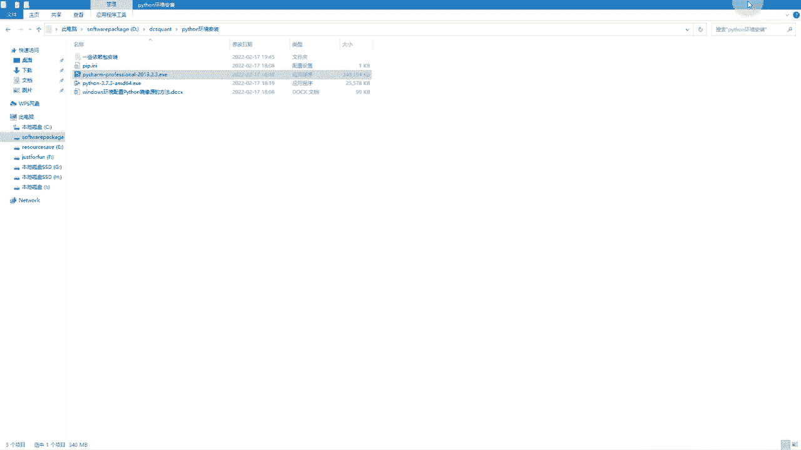

运行的文件啊，一般来说我们这个要确保我们这个目录哈，大家看我们现在这个目录都是有中文的对吧，我建议大家呢一定要把先把这个啊中文啊，这个路径先解压出来哦，现在呢就把我们这个工程这个先解压出来，我们就解压。

比如说我解压到当前文件夹啊，就解压到当前文件夹，就生成我们这个目录就可以了，就到大仓手199199这个目录就可以，然后把这个目录整个目录复制出来，好复制到我们这个啊同级的这个目录。

就DCSQUT底下这个目录，那这个目录进来的话，就是我们项目，大家就按照这这个层级过来就可以了哦，你不要再多一层了，明白吗，就比如说我这个是DCXQU的，然后这个是大仓手。

199底下就是我们项目的文件啊，那这样的话有什么好处，这样的话呢，我们就直接呢把我们这个项目大家看，把我们这个项目拖拖到我们的这个PON里面啊，拖到这个拍上图标上。

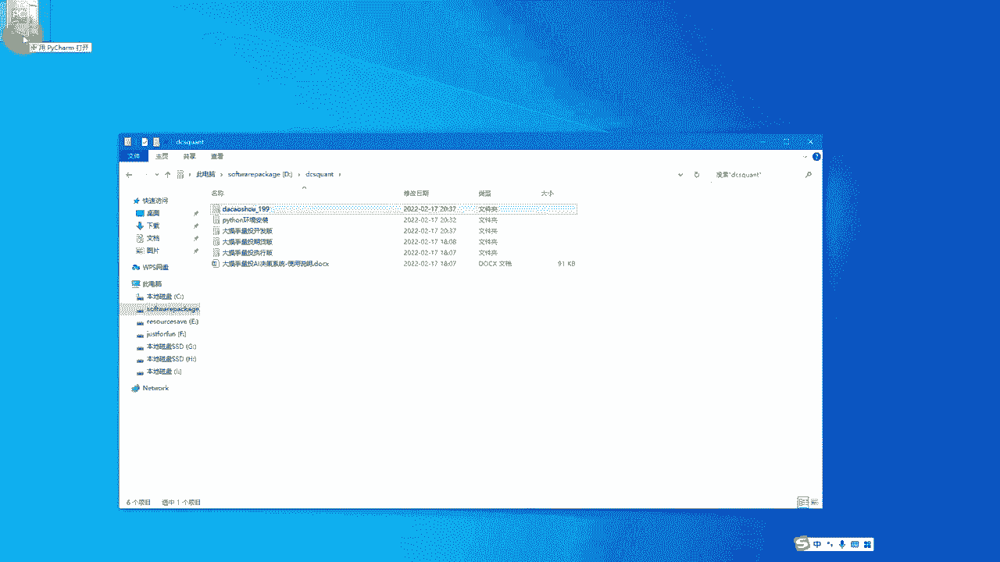

然后直接放开鼠标放开啧，用这种方式打开的话呢会比较快捷啊，大家可以看到我们直接打开的话，他就会直接整个工程是完整的过来了啊，大家看到我的顶层的话，就是一个大抄手199底下。

就是我们这些分目录就没有在一层，大抄手19199的哦，大家因为可能会有还会有一层，就是因为你这个目录的层级不对，你打开的目录层级不对啊，你就按照这样的操作就行了啊，这是一个，那我们进来了之后呢。

好大家可以看到哈，我们呢先双击我们的run strategy，我们双击这个目录啊，双击这个目录，大家看到我们现在代码啊，我们代码呢是可以看到了啊，是可以看到了，那我们现在呢要有一步很关键。

就是安装我们的依赖，啧啊这个安装依赖的话呢，就是我们底下这一堆依赖的话呢，在我们安装Python其实很多并没有自带的啊，很多要去安装哦，那安装的话呢，我们这几个我们可以直接根据这个里面来安装，就可以了。

呃当然在这个目录底下，就在我们这个python199这个目录底下，我们进来到我们这个目录，就在这个目录底下，大家呃通过CMD，通过我们这个命令行好，先定位到这个里面来CD啊。

然后呢啊这D把这个目录把这个路径复制出来，然后直接右键右键的话就可以直接连贴了啊，这CD然后这右键好进来好，然后没有进来的话，你再敲入一个D直接输入D冒号啊，那现在就进来了啊，好进来的话呢。

大家看到我们这个路径，就是我们现在所处的这个路径了哈，就在这个目录底下好，那我们现在这个命令行啊，我们已经定位到我们这个目录底下了，好那定位完成之后呢，我们接下来呢嗯大家可以先呃。

先不用管这个命令窗口啊，我们可以先关掉，我们只是备用啊，我们最主要的，因为我们在这边已经ba at的脚本给大家写好了，所以我们在这边的话呢，你可以直接执行，也可以直接双击这个执行也可以啊。

我们直接双击吧，好吧，直接在双击install点bat啊，我们双击它啊，好那双击它的话呢，大家可以看到啊，我们这边也就一直在安装了，好那安装的话大家可以看到在这边日志哈。

这边出现了一个是嗯什么index htp s p IP，这个是这个就是我们配置的那个清华的镜像，如果你的这个呃HTTP后面跟的不是这个链接的话，嗯你就要看一下你的镜像源有没有配置。

因为如果你没有配置镜像源的话，下载是非常慢的啊，那如果配置镜像源的话，我们安装这个require底下的文件就很快啊，那如果是嗯像这种卡住的情况啊，大家可以看到我们现在安装到一半，现这种卡了，卡住了对吧。

那卡住了，这边的话呢呃就按回车，然后按回车啊，它就会继续往下走，在安装的过程中，你可以不断去按这个回车，呃如果你的网络比较快的话，整个安装的过程大概是一到2分钟哦，我们稍等一下，等待它安装完成好。

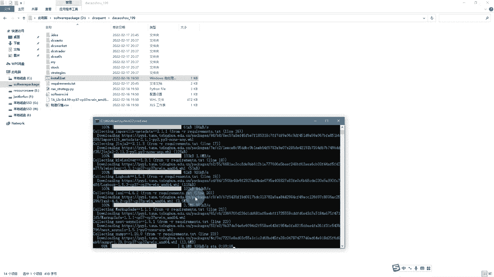

安装完成之后呢，大家可以看到我们这边呢最终安装完成之后呢，是要出现这个提示的啊，最后一步应该是successively install ta live啊，什么0。4。19，那最后会出现请继续啊。

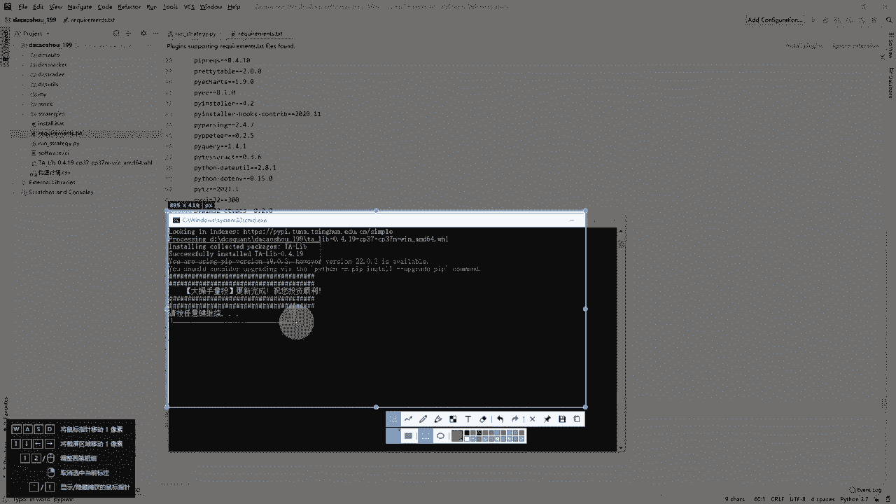

这样的话才是一个完整的安装完安装过程啊，你直接回车就可以了啊，那我这边是模拟哈，我这边模拟，有些同学可能安装过程的时候，会出现一个什么啊，这个是因为你安装过程可能，有些拉的过程可能偏慢。

或者说我们这个版本有问题，那一般我们这个版本不会出现问题的啊，这个是我为了演示，给大家做了一个错误的版本啊，那这个没关系，就是你就按照这样安装，如果是有版本问题的话，你再重新啊。

把那个版本啊拎出来重新安装就可以了，比如说我这边是因为我这个啊p IP win3，这个版本找不到，因为我这个是错的啊，那这个版本我们已经做好了，一般不会出现这个问题，如果是这种问题的话。

再单独安装就可以，那怎么单独安装呢啊我们先回车安装完成啊，那比如说我安装整个过程呢，就只有这个版本啊是有问题的啊，只有这个是有问题的啊，那其他都正常好，那我们现在回车啊，回车之后呢。

我们啊现在就单独要安装我们这个版本了啊，啊因为我们这个版本刚刚提示说，我们这边的这个是错的啊，我们刚刚这个错的，因为我们这个是错的，那我们现在就单独安装这个啊，我们直接拷出来。

然后是通过我们这个命令行的安装就可以了啊，命令行我们刚打开了嘛，然后我们直接p IP install，然后直接把我们刚才这个缺少了这个模块啊，这个依赖我们再重新手动安装一遍，好OK那我们这个额。

我们再把这个模块再单独安装了啊，我们等待它彻底完成，好大家看到一般安装完成之后，它会有一个successfully，就是成功的意思，sucessfully installed就成功的意思哈。

那我们这个模块也补充安装完成了，那至此呢我们所有的依赖啊就安装完成了，安装完成了之后呢，我们打开啊，我们刚刚啊这个工程啊，这工程啊，那我们这里面的所有的依赖，我们刚就是安装这个里面的啊。

这个版本还有依赖相互对应的版本，那我们现在可以尝试来运行一下，我们的这个啊整个项目了啊，那我们一样第一步呢你要去设置text，设置token哦，那token的话，这个token的话在哪里拿呢。

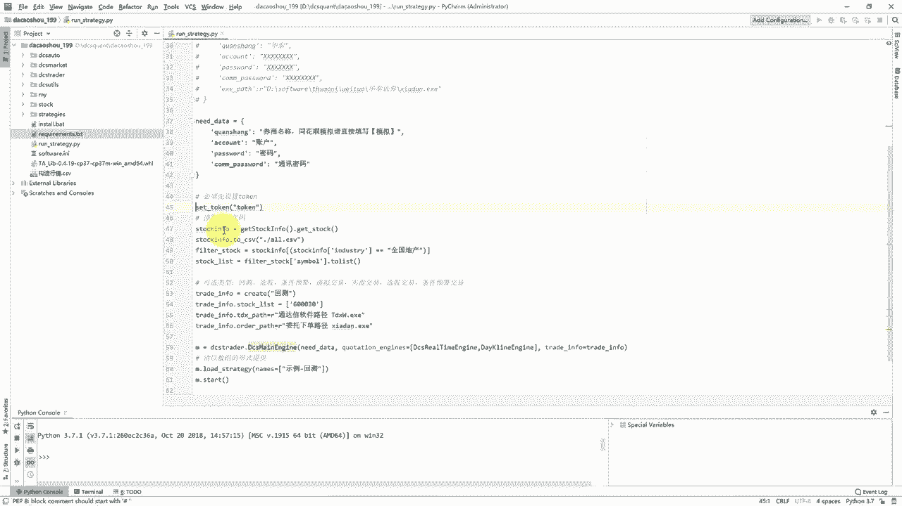

啊这个token你把这个前面的井号去掉，然后设置token token的话呢，就在你的这个权限管理啊。

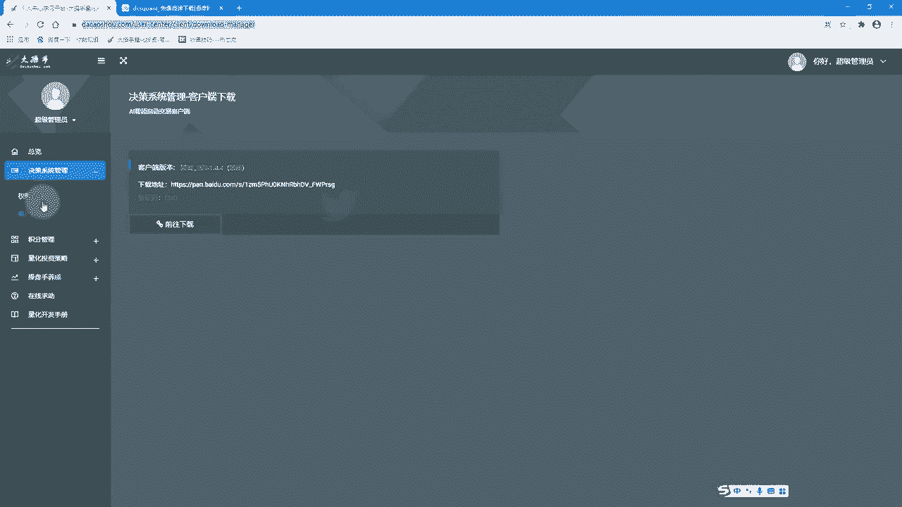

嗯就在你这个嗯代号所官网。

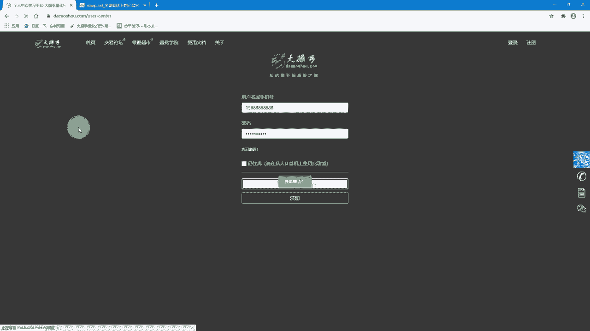

这个权限管理里面啊，大家看到我们这个token你把它复制出来啊。

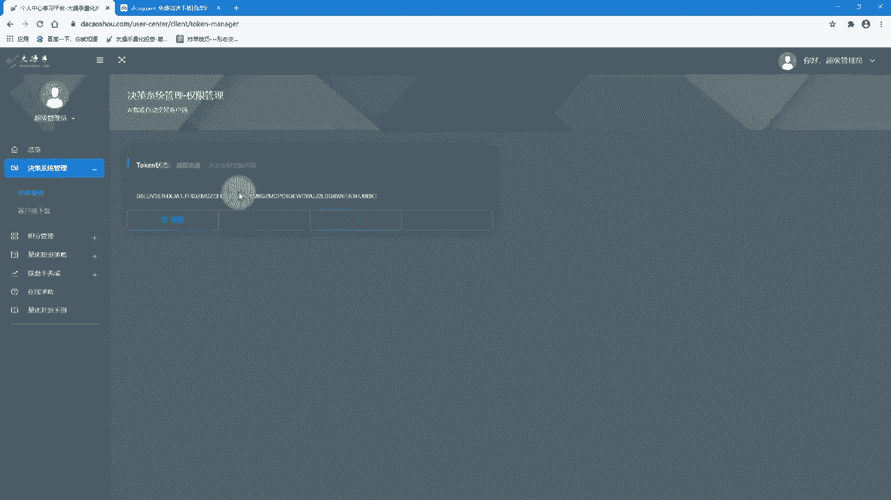

你把这个token复制出来，然后往这边里面一贴啊，就比如说我们刚刚是这个token啊，然后你复制出来往这里面一贴，那就可以了哈，那因为我之前有设置token的，所以我这边就不再呃设置了啊。

好那我现在演示的话是啊，就是在我们整个这个包括环境和依赖，安装完成之后，我们运行去试一下啊，大家可以看到我们这边的话，是里面自带的这个策略呢，是这个啊，事例啊，在strategy底下这个视力啊。

视力回撤啊，这个就对应的这个里面的这个项目啊，对应的这个策略，那我这样的话呢，直接我可以回撤，直接让strategy，我们先尝试一下啊，看一下是不是能够正常的运行，啊刚大家看到了吗，就是我们右键啊。

然后选择这个debug Rush strategy啊，这debug Rush strategy，这个去直接去跑就可以了，嗯我们稍微等一下啊，哦那他现在就是出来了啊，他已经日志也开始在打了。

好我们等待它整个都完整的运行，还有这个运行速度，一般来说假如说你的呃电脑是这个，你把这个项目存在的是在你的那个SSD，就是固态硬盘里面，我们整个整个的这个回撤的，这个速度是会快很多的。

如果你是在机械盘里面的话，可能会慢一点，就会慢一点，我们如果在SSD盘的话，就很快，建议把大家把项目呢，这个保存在你的SSD盘里面去啊，然后直接在嗯就是打开啊，在你的SCD版里面去运行的话，会很快好。

那我们这个是算是完成了啊，完成了之后呢，我们会弹出啊，它会自动把我们对应的这个啊。

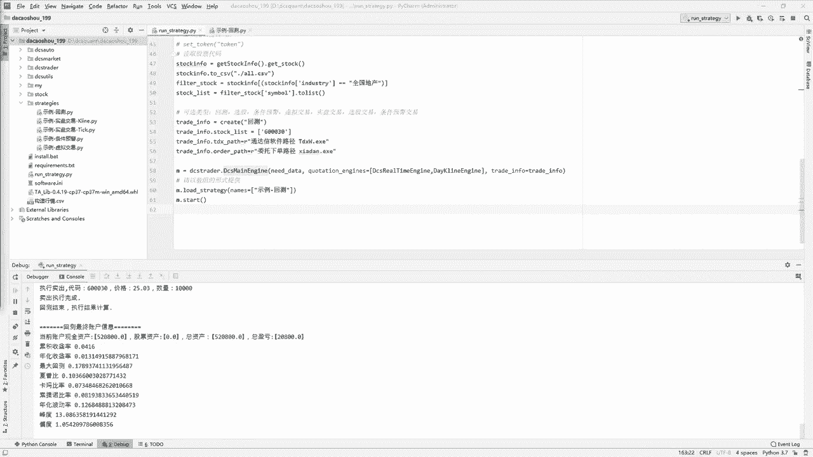

结果弹出出来啊，这这个是我们的结果啊。

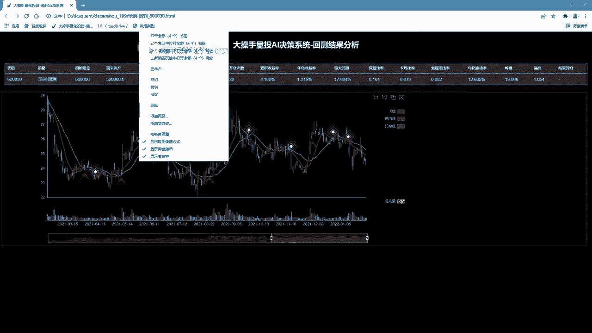

很好这个是我们结果，我们整个结果嗯就是以这种可视化展现出来。

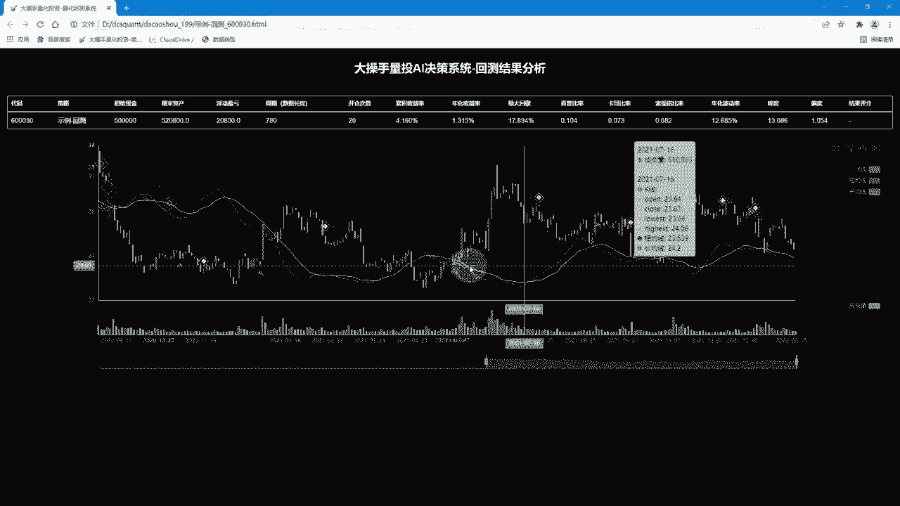

那这个是我们回撤啊，就是完成了，那支持呢我们整个系呃系统的搭建啊，就是开发版的这个系统搭建就是一个完整的哦，就是一个正常的后续的话呢，我们就注重在我们challenge底下，去写示例就可以了啊。

去写示例嗯就行了，好，那今天啊，我们就跟大家演示这个完整的安装过程，如果啊没有安装完成的啊，同学们啊，我小伙伴们，你们自己呢按照我们刚整个录制的视频，这个过程啊，一步步做下来啊，应该是没有问题的啊。

那如果是嗯对我们授渔计划感兴趣的话，现在应该还可以报名嗯，嗯欢迎大家一起加入我们好行。

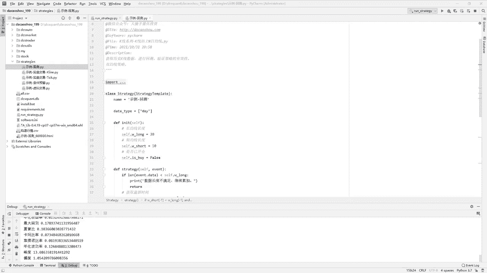

那我们我们课程就先到这里啊。