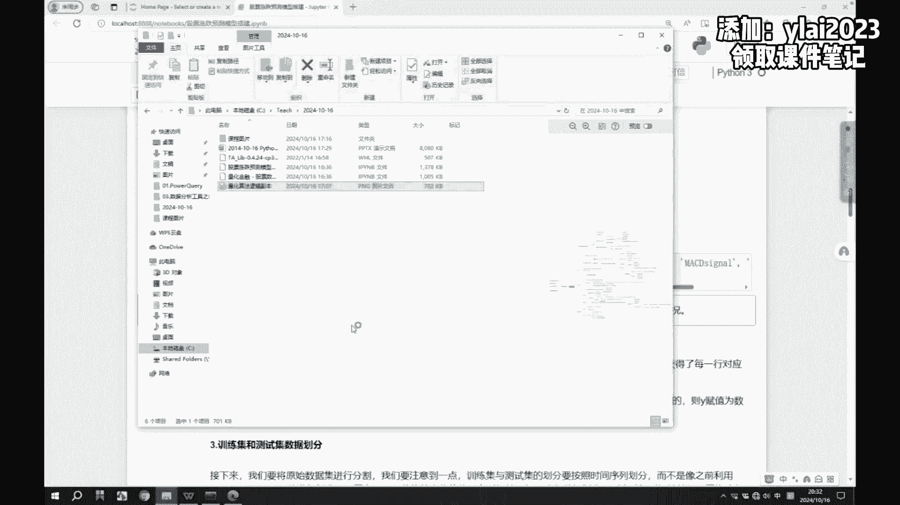
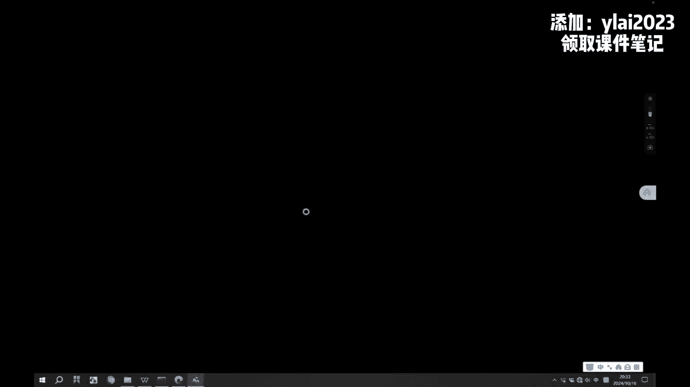
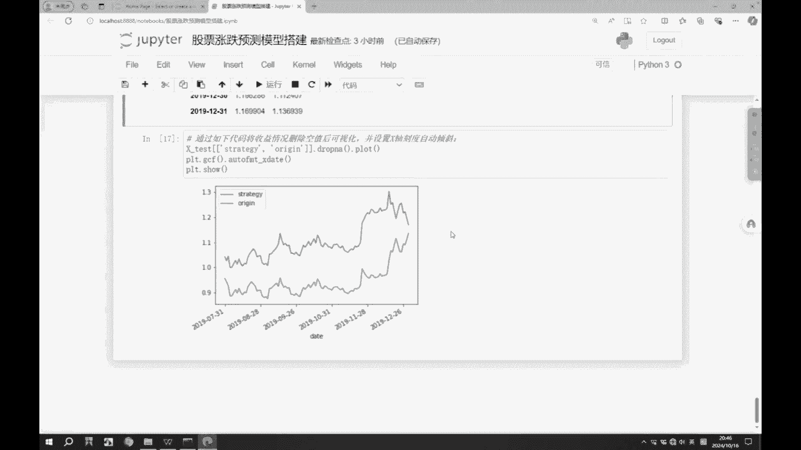

# Python量化分析实战，捕捉股市热点股票买入卖出机会 - P1 - IT行业研究员 - BV1qayAY9EJd

第一步呢我们需要有数据啊，我们需要获取数据，然后有了数据之后做什么呢，那数据我们要进行一个准备啊，说的通俗点叫数据准备，因为这个数据最开始都是一个原始的数据啊，可能不规范，也有可能有脏数据啊。

也有一些不符合我们要求的数据啊，那这会呢就是说白了也叫清洗，然后归统一啊，那当我们的数据都准备好了，下一步做什么呢，它的原始数据里面啊，他可能只有今天的这个开盘价是多少，B盘价是多少啊。

中间波动的这些他可能都没有，那我们需要做什么，需要建立一些指标，填一些指标我们自己要去计算，我们可能关注哪些点，今天早上的开盘价诶，99：30的开盘价是多少啊，然后呢这个下午三点的这个收盘价是多少。

或者说更细致一点，早晨09：30的开盘价是多少，11：30的这个收盘价是多少，下午一点的开盘价是多少呃，之后呢三点的收盘价是多少啊，这个呢是我们需要去建立的一些指标，当然他这个指标呢不止我说的这些啊。

啊会有很多很多的这个指标啊，每每一些每每一波炒股的人啊，他们都会有什么呢，他们都会有自己的一套指标体系，但那肯定会有通用的指标体系啊，当然了，这个行业里面也存在着很多通用的体系，再之后呢。

那这些都有了之后，下一步做什么呢，哎我们去做一个模型啊，去设计一个模型，这个模型用来做什么呢，啊比如说哎我们做量化想去赚钱，想在这个市场中赚钱，那有几种模型，第一种呢就是我们我们要知道我们这个大A啊。

A股它有5000多股啊，有5000多，那股市在上涨的时候，并不是所有的都都上涨，那这会儿就需要做什么呢，但我们要选择一个上涨最多的啊，这东西它叫做智能择股，另外一个我们同样都是买的一只股票。

那大家的收益也可能是不一样的，你是他在你是在它涨停的时候买的，还是在它跌停的时候买的啊，比如说他今天早上跌停了，你买了，然后可能到下午它涨停了，这会儿呢你一次就赚了20%的利润啊。

那这个交易策略在我们这里面叫什么呢，智能择时，智能做事啊，K咱同学说了，这个好像是我自己做指标，然后我去卖我这套指标体系去对吧，然后还有同学说的，这好像是模型训练啊，当然到后期我后期肯定会用到模型啊。

因为你如果纯靠你自己的一些经验去做啊，相对来说还是没有这种模型更成熟，但是啊你个人的经验来说啊，他变化的可以更快，调整的更快啊，那当我们设计好模型之后呢，那下一步我们要设计策略，啊什么时候买入。

什么时候卖出，咱同学说了，综合几个指标不就是自己的吗，对几几个指标是自己的，但是有一个点要注意啊，就是我们大家可能会动态的去调，并且你在实际操作的时候，它可能会有一个差池啊。

但是程序一般来说我设置它涨5%啊，他就给我卖对吧，那程序就会按照我的这个规则去给我执行，但是我们个人来说可能还会有误差啊，有偏差啊啊这个什么时候买入，什么时候卖出，这个针对股票来说啊。

针对所有的股票来说，可以怎么针对单个的股票，这个时间来说也可以啊，哪一个股票出现了什么样的趋势，我该买了对吧，然后呢针对于个股，实际选择啊也是很OK的，那最后呢我们设计好策略之后，接下来要干什么呢。

好模型要去测，啊进行一个测试，说我设计的这样的一个策略，我设计的这样的一个模型，它到底好不好用是吧，那他要去做测试啊，看看我这个收益是吧，是不是能跑赢大盘啊，是不是能跑赢同行，咱同学说了啊。

我喜欢设置条件啊，然后和网络啊，设置好逻辑不看反让他给我们自动来啊，这个是量化里面我们想做的事情，但是会有一个问题是啥呢，就是你用的策略别人也会用啊，那优先调整的人。

可能会割你这个调整慢的人的这个韭菜对吧啊，那跑完模型，最后呢我们去评估呃，去看一下我这个模型到底有没有效果啊，之后呢改进模型有了之后对吧，我要不断的去改进，我的收益还可不可以提升对吧。

那如果我当前的模型设计完了亏了怎么办，对吧啊，当然了，我们今天给大家所讲的是一个纯技术的角度啊，我们要知道这个炒股的时候，在我们国家啊，或者说不止我们国家，它还有其他的很多的这个影响啊，不一定是纯技术。

我们是从数据的角度，把技术的角度去给大家去讲解这个东西啊，因为以后呢你也不一定用它炒股啊，你比如说我用它去炒啊，我原来做的也是炒比特币啊，炒UIDT啊，效果还不错，赚个几10万啊，嗯OK啊。

那接下来呢整体的流程有了啊，那我们就从头到尾往下去看啊，那第一块呢股票数据的获取，股票数据呢，我们知道我们打开百度，肯定是可以找到股票数据的，但是这样的股票数据它不适合我们用程序啊。

或者说我们写代码去去查看对吧，那这会儿呢我们就需要做什么呢，需要去使用程序的这种接口包啊，那这个就叫做to share，这个库呢，可以免费的去调用股票数据的历史行情，然后呢还有官方网站。

当然啊这个它最开始是免费的，现在大家用呢也是免费的啊，当然啊如果你想体验更好，它还有收费的版本啊，啊咱们可以简单的去看一下啊，不咱们这个网这网速不是很快，我这个网怎么可能掉了。

呃这个网暂时咱们可能看不到啊，啊就是这里面呢可以看到这个Python的接口包啊，然后它里面呢就可以看到历史的这些数据啊，然后官方网站是to shell点ORG，我这个网现在有点不稳定啊。

然后呢如果想查看股票的行情数据啊，也可以去看它里面的TRA，定点HTML字段的就更多一些，呃我突然想到一个办法啊，我复制一下啊，完了我切切一下，切到这边来看，大家可以看一下啊，这个图塞尔新版发布啊。

数据更稳定，质量更好啊，那这个pro版本啊，pro版本就是要收费了啊，然后呢它是一个免费开源的财经数据接口包啊，然后呢实现了对股票金融数据的数据采集，清洗加工到数据存储的过程，能够为看啊。

金融分析人员提供快速整洁和多样的，便于分析的数据啊，为他们在数据获取方面极大地减轻了工作量，使他们更加专注于策略和模型的研究与实践上，那这个说白了那就是为我们准备的呗对吧。

然后考虑到Python pandas在金融金融量化分析中的，这个优势to share，返回的绝大部分的格式，都是pandas中的data frame呃，这个data frame给大家简单的说一下。

就是类似于excel的这个表格性数据啊，然后非常便于pandas n配MATTPLAB，进行数据分析和可视化，那之后呢这就有了，那么可以看一下这个左边啊，左边的这有什么前言，致谢，使用对象。

咱点一眼使用对象，使用对象看量化投资分析师，对金融市场进行大数据分析的企业和个人，然后开发以证券为基础的金融类，产品和解决方案的公司，正在学习利用Python进行数据分析的人啊，那这也就非常适合我们哈。

之后呢它这里面可以获取哪些交易数据，历史行情啊，复权数据，每日行情，历史分比，每日分比，当日历史分比等等等啊，然后下边还有投资参考依据，因为呢我们刚才说的是纯数据角度啊，实际上呢它的数据是哪来的啊。

它的数据也是从这些啊，上交所，深交所，然后什么腾讯财经，新浪获取来的，那这个它是用什么技术实现的，是它使用爬虫来获取的啊，获取完了之后呢，爬回来，然后呢它存到数据库中，当我们用的时候诶，再从这取回来啊。

我们就是借用的这个网站中的数据好，OK然后那这个库怎么用啊，非常简单，就一行代码就pip install to share啊，这个就是，安装依赖，然后当我们执行完这行代码啊，它就会不断的去下载啊。

又不断的去下载，那它下载完了之后呢，最后这啊它会提示啊，successfully instal啊，然后选择这一串，那什么意思呢，就是成功的安装了啊，然后呢我们想使用这个库去获取一些数据啊。

去感受一些数据，怎么办呢，第一块呢import to share啊，把这个库导进来，导进来之后呢，我们去获取K线的数据，也就是股票的K线数据啊，Get k data。

get k data里面呢有三个参数啊，第一个参数呢就是你要获取的那个股票的代码，咱们知道股票它有一个六位的编码，对吧啊，比如说五个零一个二，这谁啊，万科的对吧，然后呢你可以写start and。

这就是开始结束的时间，三个参数大家以后也可以去改，成你们自己用的啊，第一个呢是股票代码，然后第二个呢是开始时间，第三个是结束时间，然后呢把我们的数据就存到这个data frame中。

然后使用data frame点hat呢，可以查看我们数据的前五行，那之后呢，我们就可以看到我们从接口中访问的，这个数据啊，date日期open啊，这开盘价close你的闭环价。

hi就是你今天的一个最高价，漏你的最低价volume成交量，然后股票的代码啊，那大家如果以后啊，或者说之后大家自己想体验的时候，你们也可以把这些什么把股票代码换掉，比如说你在抄哪一个股票。

你可以试试这个模型好不好用啊，那这接下来呢做一个操作啊，这个data呢我们给它设置为前面的这个索引，Setting index data，data就变成了这个索引啊，放到了我们最最前排啊。

然后呢他除了获取这个k date以外呢，它还有什么获取这种实时数据啊，那就直接get real time cost，然后我们将我们的股票代码给他之后，你就可以获取到诶这个实时的这个数据啊。

然后这个时间那就是今天啊，然后15点的时候，那这个里面给我们的数据好像比先前多啊，Get real time cos，那这个字段这里面还有一些点点点点点点，是什么意思，就是还有很多它省略了啊。

就是有有的人用的字段会比较多，但我们用不到那么多，怎么办呢啊我们可以选择自己想看的那一部分，或者说我自己关注的那一部分，再或者说我们以后自己设计的模型，模型里面用到的那一部分给他选出来，筛选出来。

然后我们这里面要了code name啊，也就是编码名字，price价格，然后BD，然后sk volume amount time啊，这些数据，如果想要获取多个股票代码的实时数据，可以用如下的这个代码。

也就是说我们给它多个股票代码啊，那之后呢他就可以将我们这个数据获取出来啊，那接下来是一个小重点了，因为我们获取到的这个数据啊，它是我们刚才所见到的这个to share，这个工具包给我们提供的。

它给我们提供的内容啊是固定的，也就是说他给我们返回的这些字段是固定的，那我们如果说我们想自己计算一些，或者说我们自己想设计一些怎么办呢，我们只能基于它既有的那些字段啊去生成。

那这会儿呢我们会把这些变量叫做什么呢，叫做衍生变量啊，比如说我们这里面通过get kv呢啊，去获取一个2015年1月1日到，2019年12月31日的，这个股票的基本数据，把这个数据获取到。

获取到了之后呢，把这个date设置为它的索引，那我们可以看到这个数据啊，之后呢我们去计算一些衍生变量，衍生变量，比如说这个里面啊，大家可以看一下啊，close open就是我的一个收盘价。

还有我的一个开盘价的一个差值啊，那这会儿是怎么做的，用close减去open，然后再除以我们的一个open啊，然后还有这个hello啊，也就是我们最高最低的这种比重啊，用hi减去low，再除以low啊。

然后还有一个啊，Create close，就是上一天的一个收盘价，我想知道昨天收盘价是多少啊，那就是close，然后shift1往上移了一天，再接下来呢，还有那我这个价格到底变化了多少啊。

就是今天的收盘价减去昨天的收盘价啊，用同一标准去比较，再接下来呢，还有我们的这个价格的一个变化的这个比率啊，close减去pre close去除以PCD乘100，然后呢我们就可以得到一个新的数据。

这个呢就是我们自己去计算了一些，比较简单的指标啊，比较简单的衍生变量就在我们字段里面，那就可以直接操作的啊，这些那当这些都有了之后，下一步干什么呢，我们可以计算一些稍微高大上一点的指标啊。

或者说呢在我们专业的炒股工具里面啊，他们常用的一些指标，比如说移动平均，移动平均线指标啊，ma值，那我们可以去计算什么叫5日均线，10日均线，这这是什么意思啊，知道的小伙伴可以在我们的评论区来扣一下。

是吧，什么是5日均线，什么是10日均线呀，知道的小伙伴可以在我们的评论区来扣一下哈，5日均线，10日均线啊，我给大家来说一下吧，5日均线是什么意思呢，就是在今天之前的五天的平均值啊。

那10日均线是什么意思呢，今天之前的十天的平均值啊，大家有同学知道了5日的平均值，10日平均值，那这里面就使用了roll5min啊，就是求平均啊，roll这个10min啊，就根据之后呢。

我们这里面就又新多了两个指标，那咱们来看一下啊，看这个RO05，看这个ma5啊，Ro65，然后呢我们可以看到这个数据之前啊，它是没有数据的啊，只有在我们第五条这啊才开始有数据啊。

那这个rolling10的MA10的啊，那我们看到啊，这个前面是吧，这九个它就没有数据啊，第十个才有数据啊，还有同学问了啊，我们是基于Python数据分析之后怎么来归啊，那主要是嗯还有很多的外部因素啊。

因为我们是从纯技术的角度去讲的啊，OK啊，那接下来呢，我们这里面呢去将这些空值删除掉啊，咱们现在说了，你这数据得准备得清洗啊，你ma5不能为空值啊，咱们可以看到啊，因为这条数据之前它没有五条数据。

所以它是空的对吧，那这个前面也没有五条，它它它的上一条是空的，所以呢我们这里面要删除控制，把这个数据给它清洗干净，清洗出来啊，那这些数据相对来说还是比较简单的啊，那下一步呢我们要计算一些稍微复杂的。

股票的衍生变量啊，那这些复杂的这个，如果要让我们自己一点点去写，肯定非常非常的麻烦啊，后面呢我也会给大家去介绍一些比较复杂的，股票衍生变量的那些公式啊，但是比较麻烦。

那我们这里面给大家介绍了一个新的东西，叫做什么叫TLAB啊，这个库呢就是专门用来做股票衍生变量生成的，这个库啊，当然了，他也是一个老外开发的啊，嗯有一些内容可能和我们国内的不太一样，一会会给大家去说。

但总体来说啊都是一样的啊，这个库呢安装的话和前面那个略微不一样啊，它的安装呢是pip install，然后呢直接把这个包名给他啊，也就是把这文件的名字给他啊，这个文件呢后续我也会我也会提供给大家啊。

然后呢当我们把这个库装好之后呢，我们就可以把这个库导入进来了，导入进来，我这里面给大家去介绍几个，股票中常见的指标啊，比如说RSI，那RSI呢它的一个计算公式啊，相对来说啊，比前面的要复杂很多啊。

那就是N日平均上涨的价格，比上N日平均上涨价格，加上N日平均下跌的价格啊，也就是说这个比如说十天呐，十天平均上涨的价格啊，然后呢这个十天之内啊，它平均上涨的价格，再加上十天之内的这个下跌价格。

算上涨的时候只算上涨啊，它不算下降，不算那个下降啊，然后下跌的呢它只算下跌，不算上涨啊，就比如说这个是十啊，这边有十的，OK那我在加的时候不会有10-10啊，我说我只会算这个正的那个数据啊。

然后呢他就可以把RSI算出来了啊，然后咱们这有有的一部分人，还有一部分同学应该知道啊，他应该知道这个rs i就叫相对强弱指标，能够反映短期内涨势相对于跌势的强弱啊，也就是说RSI的值越大。

则涨势相对越强，RSI值越小则涨势相对于跌势越弱啊，然后帮助我们去判断啊，现在是涨势强还是跌势强，涨势强，咱们去追对吧，跌着强的赶紧跑对吧，在一个上涨的过程中啊，你什么时候进场都不晚。

在一个下跌的这个环境中，你什么时候跑都不晚啊，在一个震荡的环境中，就更需要我们数据分析啊，去帮大家去选择一下，这个时机了啊，那我们刚才说的这个公式这么复杂啊，如果我们想生成RSI这个指标还复杂吗。

不复杂，因为我们使用了TLAB这个库，TLAB呢它可以快速的帮我们搞定这个事情，比如说你直接调用TLAB点RSI，然后呢使用我们的收盘价去计算这个RSI啊，然后呢给他一个时间啊，比如说给了个12。

那就是什么呢，12日的RSI啊，就十二十二工作日子，那有同学说不用12行不行，可以的，就我们每个人建完的模型为什么不一样，效果为什么不一样，就是因为你你你的这个计算周期不一样啊。

我用六天的和12天的和这个18天的，得出来的这个模型效果是不一样的啊，所以每个人都可以将你的这些想法，思维贯穿到这个模型里面去啊，OK那再接下来呢我们还可以生成一个啊，动量指标。

MOMMOM呢叫动量指标啊，它这个英文单词是moment啊，然后呢，动量可以认为是一段时间之内，股价的涨跌速度啊，然后MM等于什么呢，C减C啊，CN呢代表当天的收盘价，CN呢表示N天前的收盘价。

然后呢如果想去计算的话呢，也非常简单，依然是使用这time lab m o m啊，然后d f close依然是我们的一个收盘价啊，五天的啊，也就是说我们使用的是MM5啊啊啊，为什么选五啊。

因为正常来说啊，我们国家这个这个只在工作日啊，或者说只在周一到周五的这种工作日啊，会去开盘啊，一般来说我们就会去选个五，比如我选个八行不行啊，也没有问题啊，但是呢针对于这种具有时间特质的数据啊。

我们我们在这个分析的时候，或者说我们在处理的时候啊，尽量的去遵循一些时间的规律，否则你得到的模型啊，有的时候呢可能就不太好用了，就是因为你违背了一些基本的原则啊。

是那下一步呢是我们通过TLIB库去生成指数，移动平均值EMA，那EMA的计算公式呢，相对来说呢就更复杂了一些啊，大家可以看一下啊，e ma today等于阿尔法乘以price today。

加上啊一减去阿尔法乘以e ma，yesterday啊，就昨天的ea，那你说今天的EMA呢，和昨天的EMA它是有这种很强的关联性的啊，它由昨天的EMA生成啊，然后这里面还有一个阿尔法。

yma day就代表当天的YMA值，然后price day代表今天的收盘价，ema ya得为昨天的EMA值，然后阿尔法为平滑指数，一般取二比N加一，N表示天数N为60，这阿尔法值呢就是2/7啊。

咱同学说了，权重不同，也就是说我们选的这个区间啊，因为大家炒股应该知道啊，可能有的人会看的是什么实时的这个线，秒级的，有的人呢会看5分钟的线，有人看15分钟的，有人看半小时的啊，那有人的人我就看天呐啊。

天的不行，我我看周的，甚至我看月的对吧啊，OK这个呢也是一个趋向类的指标，其构造原理仍然是对这个收盘价进行算术平均，并根据计算的结果来进行分析，用于判断价格走势的这个变动趋势啊。

然后呢它的一个介绍非常非常多啊，大家有兴趣可以去百度，到时候啊百度百科去看一眼啊，我这块就简单告诉大家啊，他大约的一个计算生成啊，以及它的一个作用啊，同学说了，这5分钟30分钟的对吧啊。

那我这个里面选的什么呢，是12日和26日的啊，就写了一个time lab，点EMA啊，然后df close啊，Time period12，Df close，time periode26啊。

也就是12日的这个移动平均线，和26日的移动平均线，比如说我写了个18行不行对吧，没有任何问题啊，就是我们每个人创建的模型啊，训练出来的模型应用于你的实战，它能产生正收益就OK了。

比如说你自己去投资这个东西，它能赚十块钱，但用了你的模型他赚了50，你的模型就是一个合格的模型对吧，就是一个可实施的模型，如果咱这个默认是吧，或者说就是基本策略啊，一个基准值能赚十。

但用了你的模型结果赔了十，那就证明你这模型起到了一个副作用对吧，然后再接下来呢我们通过time lab去生成啊，异同移动平均线MACD值啊，然后这MACD呢这块要单独说一下啊，咱们先来看一下这个。

因为他lab呢是国外的人，这个发明的，其中一些含义和国内的名字略有不同啊，不过基本思路是一致的，前面那些指标都没问题，但在这块MACD这是有区别的，MACD对应的是国内的DF值啊。

m AC d signal对应的是国内的DA值，m AC d host对应的则是国内MACD值的一半，也即DF值减DA值，那什么DFDAMACD又都是什么对吧，DNF呢它是用EMA12减去EMA26。

得到的啊，然后DA呢是DF的9日加权移动均线啊，然后MACD等于二乘以DF减去DA啊，然后咱同学说了哎这些参数啊，这个炒股软件上都有啊，我们这个我们自己做的一个附加值是什么，你自己做做的是一个量化。

一个快速的一个调整啊，然后你可以去训练啊，然后可以去看一下，你采用了你这个模型之后的一个效果啊，你用那些软件它只能看哈，OK啊，那比如说这里面的MACD啊，这MACD里面。

它其实啊它有什么DF值和DA值之后呢，还有我们的MACD柱啊，那当DF和DA均大于零啊，并且向上移动时，一般表示这个行情处于多头行情可以买入啊，或者说多头持仓，当DF和DA均小于零啊，并且向下移动时。

那表示它处于一个空头行情，可以卖出或观望啊，当DF和DA均大于零且向下移动时，一般表示处于下跌行情，可以卖出，开仓或观望，当DF和DA均小于零，但是向上移动时，则表示行情即将上涨，股票即将上涨啊。

可以买入开仓货，多多持仓，那也就是说在我们这个县中啊，哎这个情况下他俩均大于零，但是向下移动啊，那就它它又开，它已经出现了什么下跌的趋势，我们该卖就卖啊，但如果说他俩都已经小于零。

并且还在向下移动暴跌行情啊，赶紧跑对吧，那当我们这个MACD啊，这里面的DA和DF啊均大于零啊，均小于零，并且呈上升的一个趋势，那这会儿呢就代表我们这股市要拉起来了啊。

那在这个行情下就可以放心大胆的买入啊，那如果是在我们这个DA和DDF啊，均大于零的时候，那我们依然可以买入啊，但是啊要注意零点的问题，注意零点的问题，当然了，这个指标说的很复杂，算起来的话呢没那么复杂。

我因为我们使用的是这个什么，他俩的这种库去计算啊，那你调用MACD的时候啊，依然给的是我们的一个DF值啊，DF的一个close，也就是我们的一个收盘价啊，然后呢它有一个快速区间，一个慢速区间。

也就是我们这个计算DF的EMA12和，EMA26啊，然后signal的这个区间啊，也就是我们算DA的这个值啊，选择了一个九，当然这几个数据大家都可以去调啊，你就注意你这个slow啊要大于你这个呃。

fast这个就OK了啊，然后呢我们可以得到DF中的MACD，M a c d signal，还有m AC d haste啊，之后呢在我们的数据里面去删除空值，然后查看一下数据。

这个数据呢啊他就给我们生成出来了，也就说我们从一个基本的数据获取啊，然后到我们这些衍生变量的计算啊，就完成了，就生成好了，那之后呢大家还可以进行一个简单的验证啊，导入这个库啊，然后呢去算一下这个RSI。

看看它到底对不对啊，啊，那我在这里面呢给他去塞入了这样的七条数据，之后呢，我去计算了一下这个6日的RSI啊，那我们发现前六个就是空的，第七个终于有值了啊，OK那这个就是我们去获取什么。

获取数据以及一些指标的这个计算，这个指标大家如果不认识也不用慌，很正常啊，但是呢如果以后你接触到这个行业啊，或者说类似的行业，你就知道了哦，它有这些东西，然后如果我们使用Python去做这个数分啊。

或者说做这个量化啊，那你会发现这些指标在算的时候底层很复杂，但我们的实现就是一行代码非常方便，Ok，那接下来呢我们就去看一下，我们这个模型的搭建啊，因为前面的是我们的数据获取，然后一个基本的信息。

那接下来呢我们就看一下这个模型，咱同学说了KDJ啊，OK啊那我们如果想搭建一个金融的这个模型啊，那首先呢我们需要去把我们要用用到的这些库，都导入进来啊，这个呢嗯你不用过过多的去关注。

这个就代表我们要用哪些资源，然后呢，接下来就是股票数据的处理与衍生变量的生成，这个咱们前面前面已经做过了，这个代码就是做了一个整合啊，可以简单的去看一下，第一块呢是股票基本的数据获取啊。

Get k data，然后再接下来呢设置下索引，将日期作为索引，然后计算一些简单的衍生变量，就是我们自己直接加减乘除，就能得到的这个变量啊，close open high low啊。

break close price change啊，P change，这是价格变动，这个是价格变动的这个百分比啊，之后呢就是略微复杂一点点的这个指标啊，也就是移动平均线相关的这个数据啊。

ma5ma10啊，ma5ma10的话呢，直接使用这个rolling就可以了，再之后四呢是我们刚刚看到的，通过这个TLAB去构造的衍生变量啊，这里面有RSIMOMEMAH2眼M26，还有MACD啊。

那我们可以看到啊，当我们使用这个库去生成这些指标的时候，非常简单，它都是直接调到这样的一个函数的名字，就OK了啊，然后里面传我们对应的一些参数，它就给我们生成好了啊。

后续呢你就可以去查看相应的这个数据啊，查看相应的数据，那下一步我们要说那有这么多的字段，他原来给我们带了些字段，我们自己呢又获取了一些字段啊，自己又计算了一些衍生变量，当然了。

这些变量可能是目前啊是比较通用的啊，那这些所有的字段我们就都会用得上吗，啊不一定啊，这些字段我们不一定都用得上的啊，那我们接下来呢给大家说一个，就是我们要把这些数据里面啊，我认为比较重要的。

或者说呢我要给大家去演示的一些数字段啊，给它提取出来啊，作为我们的一个X啊，这X也就是，自变量啊，那这个自变量里面就比如说什么close啊，volume嘛，Close open ma，5ma10。

hello rsi啊，然后就是我们先前计算的这一堆指标值啊，那那当我们有了这些字段，有了这些原始的数据之后，那我们这数据，我我我们之这个后面到底能不能涨对吧，我们还要设计什么呢。

我们还要设计我们想要的结果，我们还要设计结果啊，那这个结果是什么样的呢，啊那如果想想要简单一些啊，因为我们要知道我们的这个，我们国家这个股票啊，它是T加一的，就是你今天买的，今天是卖不了的。

你只能明天卖对吧，所以呢我们这里面要设计一个什么结果啊，那结果呢今天今天买了，今天卖不了，那我们就做一个预测明天的对吧，预测明日，啊那明日呢无非是吧，结果就是涨跌对吧，这是最基本的啊。

那如果你要是做的更精细一些啊，那我可以预测什么呢，它涨跌多少，啊我们这东西要涨多少，跌多少对吧，可转债是T加零对吧啊，就咱们现在不是拿的A股里的数据吗，其实我更喜欢玩的是那那些炒币的啊。

炒币是24小时哈，只要你愿意是吧，去挑战其他人的那些程序对吧，那你就逃避对吧，24小时啊，你写个程序，要不然他有人在你睡觉的时候偷偷的是吧，把币都买了都卖了呗是吧，去操控市场是吧。

OK啊那我们先说一下我们这里面的啊，我们设计一些自变量啊，也就是我们的X啊，是我们取的这些字段，那接下来呢我们设计的一个结果Y啊，也就是我们的一个目标值，目标值的话在这里面做了一个简单的操作啊。

就是price change价格变动，价格变动啊，那我们设计预预计的是明天的啊，所以取了一个明天的数据，如果它大于零就代表什么呢，就代表明天将上涨，那我们我们价格变动都大于零了，那肯定是上涨。

那如果它小于零，就代表明天下跌，下跌的话呢，我们给它一个一啊，那也就是说我们的这个外值啊，涨跌呢我们是用什么来表示的呢，啊是用正一和一，为什么用正一和一啊，我给大家简单的说一下。

这个方便我们后续去做一个累加啊，做一个累加啊，就比如说正一我乘上你，你这个数据是多少就是多少，如果是一，你今天亏500，但是我已经预测到你亏了也是一，OK那我如果提前预测到你要亏，让你昨天就卖了。

那这样呢你这500就省下了啊，所以呢我这里面涉及的是正一和一啊，很多人在设计这种模型的时候，喜欢用这个一和零啊，但零在我们这里面是不太适应的啊，然后这里面呢就啊强调最核心的一点。

应该是股股价预测下一天的这个股价情况，所以Y应该是下一天的这个股价变化啊，然后呢使用的这个里面的一个while函数啊，去判断判断条件啊，满足条件的赋值，不满足条件的赋值啊。

OK那这个呢是我们今天的一个设计，然后我给大家要赠送的一个内容哈，是我原来实战过的一个啊，量化交易去炒币的一个内容哈，大家先展示一下啊。

那个程序也有啊，但是比较久没更新了啊。

后续呢会大家感兴趣的啊，可以去联系我们的咨询老师啊，然后送给你啊，这里面会有更详细的策略啊，你最小基数是多少，最大是多少，你赚多少啊，然后底仓是多少对吧，什么时候补仓啊。

啊的值这个投屏的效果可能是效果一般哈啊，后续呢大家可以去看这个完整的图啊，什么时候去熔断啊，什么什么时候割肉出场，OK哈这个刚才给大家展示的这个策略呢，就更复杂了啊，我这里面的策略没有那么复杂。

OK现在咱们往后看了哈，那我们前面所有的数据准备好了之后，那数据接下来要做什么呢啊，要进行一个训练和测试啊，我要不断的去训练，还有咱有同学说说我直接挂交易平台，使用方便，直接挂交易平台。

很多平台啊他他不让你去练啊，那如果你要要他的算力，他是要收你的钱的，知道吧，另外呢你用他的这个平台去运用你的模型，说白了啊，他会把你的模型偷走啊，你所有的策略就被他知晓了，如果他提前知晓了你的策略啊。

他就可以有针对的啊去进，对你的这个策略进行一个狙击啊，你可能就被他干掉了啊，咱同学说这些能给吗，可以啊，大家后续联系你咨询老师啊，然后呢我们这里面的数据集进行一个切割啊，呃数据切割呢有两种切割方式。

一种呢是随机切割，另外一种呢就是我固定的去切割，比如说我前80%，前90%作为我们的一个训练数据，剩下的那二十百%分之十，我们可以作为一个预测数据啊，看我这东西准不准啊，那我们这个股票数据什么。

它是一个具有时间序列，或者说时间特性的数据啊，所以呢我们股票数据通常不会使用随机划分啊，那随机划分会破坏时间特性，那我们这里面是怎么做的啊，是用它的长度乘0。9啊，就作为前一段，剩下那0。

1作为后一段啊，也就是说我们做一个基本的切割，90%的数据，前90%的数据作为一个训练集啊，train啊，然后10%作为一个测试集，那X和Y都都一样啊，那接下来呢，我们就把我们的数据放入这个模型里面。

去进行一个训练啊，那我们接下来去搭建模型呢，使用什么样的模型啊，这个模型呢叫做随机森林啊，它是基于决策树的啊，随机森林呢这里面就基于决策树大约是啥样，大家简单说一嘴啊，就比如说啊员工离职预警的一个模型。

那这个决策树是怎么建立的，员工满意度小于五啊，离职是吧，员工满意度呢他不小于五，那接下来呢他还会有一个收入问题，收入小于1万，离职啊，收入不小于1万，哎，不离职，这个呢，它的一个场景。

就大约呢是根据一些条件进行决策，你会归到哪一类，然后呢，我们今天要给大家用的这个模型呢，比它要复杂啊，前面咱们刚才说了，刚那个模型叫做决策树啊，然后呢那我们说的这个是什么呢，随机森林，随机森林是什么呢。

它是好多好多的数，说你这一棵树有可能有偏差，有的时候你做的不够好对吧，那我做一次，我就认为我我做的很棒，那不一定对吧啊，可能我需要很多次的一个结果，那这会儿呢就是原始的数据，把数据进行随机的打散啊。

进行一个数据的一个随机采样啊，做成几个样本，比如说我们做一个十个样本，然后呢我们拿十个样本去训练出十棵树啊，训练十棵树，然后这十棵树进行什么呢，最后进行一个结果的汇总，哎得到它，那咱有同学说了。

这个叫做集成学习对，并且我们今天用的这个集成学习，是一个比较经典的啊啊BING算法对吧，我们可以有放回的取数据1万次，然后呢去构建这个N个随机数，这个决策树之后呢，每个决策树都会有它们的一个结果啊。

然后呢得到一个终极模型啊，最终预测啊说的这个原理好像很复杂，那代码有几行呢啊，那我告诉你代码就就就就两行对吧，没有那么复杂哈，那我们在这里面呢，就是去构建这个随机森林的这个模型啊，去构建。

但这个模型还没有喂给它数据，所以呢它是一个空白的模型，那怎么喂数据呢，一行代码就把数据喂给它了，哎，把我们数据分析的这些数据传递给我们的模型，它就会把我们数据里面的这些特征，搞明白了对吧，那搞明白之后。

我这模型到底好不好用呢，你不知道，那我们接下来要拿着这个模型去预测一下，我们后续的一个数据发展，哎predict把我们S数据给他，他就给我们预测出明天的一个涨跌情况了啊，这个一咱们说他预测的是跌啊。

然后一呢就是他预测的是涨，那之后呢为了便于观察啊，我们可以把这个数据放到一个表格里面，也就一个data data frame中去查看一下啊，那这里面就有了预测值啊，然后实际值百分之就有了预测值一。

实际值一，预测值一，实际一，预测一，然后实际值一预测一，实际一预测一，然后这个实际一啊，那有人说你这预测的也不不那么准呢对吧，我们是一个从纯技术的角度啊，从数纯数据的角度出发的啊，你的一个预测准确率啊。

说白了这个东西它不是涨就是跌，你只要超过50%对吧，你的模型可能就是好用的，人说咱俩玩扑克啊，或者说咱俩玩这个猜大小，我赢的概率是51%，那你赢的概率是多少，你赢的概率就是49%啊，对不对。

咱俩的一个输赢的比率差了2%呢对吧，那可那可不止只是那1%哈，90%训练10%是每天的90%，不是我这个是选了一个一段时间了，咱们这个是选的是这个K线的数据，是以天为基准的啊，当然咱同学说了。

能不能用每天的也能啊，那个你得获取那种秒级数据啊，或者说是分钟级数据啊，或者5分钟这种数据也可以啊，你看你的一个实际的模型搭建情况，我这个里面是选用的是用天去做的啊，那之后呢我们就可以去查看它。

查看一下他预测的概率，这里面要给大家说一下啊，这个预测概率是什么意思，就说我预测涨最终看到的结果，哎我给我告诉你是涨，但实际上我我的内心一定是告诉你是涨吗啊，不一定可能呢，我是60%认为它涨。

40%认为它跌啊，机器学习或者说数据分析，它也是这样的，它给你的结果绝对不是一个非常死板的结果，一个非常固定的结果啊，不是的啊，那这个里面呢也是啊，看比如说0。53啊，0。46啥意思。

我认为你53%会跌，46%会涨，所以呢我们对外展现的时候就是哦，那你这个跌的概率高，认为它就跌了啊，那你这0。490。50，那你这0。50刚好大一点点，那我就认为你是涨，所以你看我们这个预测值一。

预测值一啊，就是因为它后面那个值更大啊，我们现在这个模式因为我们未给他这个数据啊，他只能预测明天的啊，就是后续如果你说我我要给它改成时间段呢，也可以那个根据数据要去调整的啊。

然后接下来呢我们可以去看一下啊，这个模型的一个总体的一个准确度啊，使用一个accuracy score啊，然后呢，我们可以看到我们模型预测的一个准确率呢，是0。54，也就54%啊，然后呢。

有两种手段可以看到他的这个模型准确率啊，之后呢我们还可以看一看我们这个模型啊，或者说我们所建立的这些数据分析，它主要是依据哪些字段，给我们进行一个数据预测的啊，然后这里面就有了这些特征啊，MOM啊。

占比是多少啊，这个收盘价占比是多少，Hello，占比是多少啊，甚至我们可以看到有一些字段，根本就没有什么用啊，没有什么效果，王源是不是可以月入百万啊，投资需谨慎啊，入市需小心啊，这个东西。

因为我们说的是从纯数字的角度来的啊，然后还有还有一些东西没有考虑，比如说你买卖它它会有手续费啊，可能呢我们是啊投了100万，赚了3万对吧，然后你反复的交易手续费收了5万，最终呢。

那我们的100万好像也变成98万了啊，就是你赔的钱不一定是啊，股票直接吃了，对吧啊，那之后呢，我们的我们先前的这个模型，还可以不断的去调优啊，调优的话呢，我们可以使用这个网格搜索。

去传递一些基本的参数值啊，让他给我们去便利，选择一个准确率更高的一组参数啊，那把我们把数据传进去进行一个模型构建，然后呢使用网格搜索去调优，然后他就告诉我们，你这个决策树最大的一个深度是三啊，然后呢。

每每一个节点上面最小的叶子是二十十个，入学仪器就OK了啊，然后呢我们就可以去构建一个新的模型，构建完新的模型之后，下一步就可以做什么了，去设计我们的收益回测曲线，然后呢将它绘制出来啊。

那这个里面是怎么绘制的啊，跟大家说一下，这里面有一个小核心点啊，咱现在不设计了吗，啊，我预测涨就是一，但这个预测下跌呢就是一，那咱们这个里面它计算的一个规则啊，就是如果我预测的下跌是一。

今天真的跌了500对吧，我就用这个一乘以那个-500啊，然后呢我就干什么，我就就相当于我赚了500啊，比如说我现在有1万块钱，然后呢明天我预测它跌2000，OK我今天就把这1万块钱卖了。

明天这1万块钱啊，别人的变成了8000，我这个还是1万，那变相来说就是我赚了2000啊，然后上涨的时候呢，如果我预测它上涨，明天要上涨2000，OK那我这个就是赚2000，那这里面呢我的一个基本策略啊。

就是，用我们预测的上涨和下跌啊，去乘以我的价格变动啊，如果我价格变动了对吧，上500我预测涨500，我的总量加500，我预测它下跌500对吧，然后我预测它真的下跌500，那相当于我也是赚了500啊。

这个这个规则是我们我们设计的一个啊，但是在股票里面还有一个特性是什么呢，它有一个垒成的效果啊，就说我今天投了100万是吧，涨了10%，明天是110万，又涨了10%，它的上涨不是10万，而是11万啊。

就是它需要一个累成的效果，那我们就使用这个价格变动的是百分比啊，加上一也就是加上我们原始的数据，然后做一个累乘，累乘完了之后，我们就可以看到这个原始的数据变动，以及我们自己预测的这个变动啊。

然后我们把它绘制出来啊，咱们可以看到这个数据啊，这黄色的是原始数据啊，也就是默认它的一个波动情况，这个蓝色的呢，就是我们通过数据分析以及建立模型训练，得到的一个收益回测曲线，我们可以看到啊。

这个它从一波动到这儿啊，它最终涨涨了，在这个过程中啊，它有很多下跌的过程啊，最终呢它有一段上涨，但我们这块也有一段预测的不准的啊，咱们前面就一直在盈利，一直在盈利啊，然后在这块应该是达到了一个巅峰对吧。

在这个大盘啊亏2%的时候，我们赚了20%多对吧，OK啊，这个呢就是我们今天要给大家分享的。

