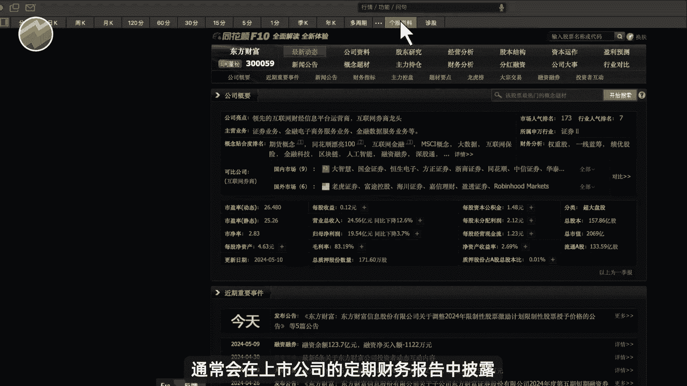
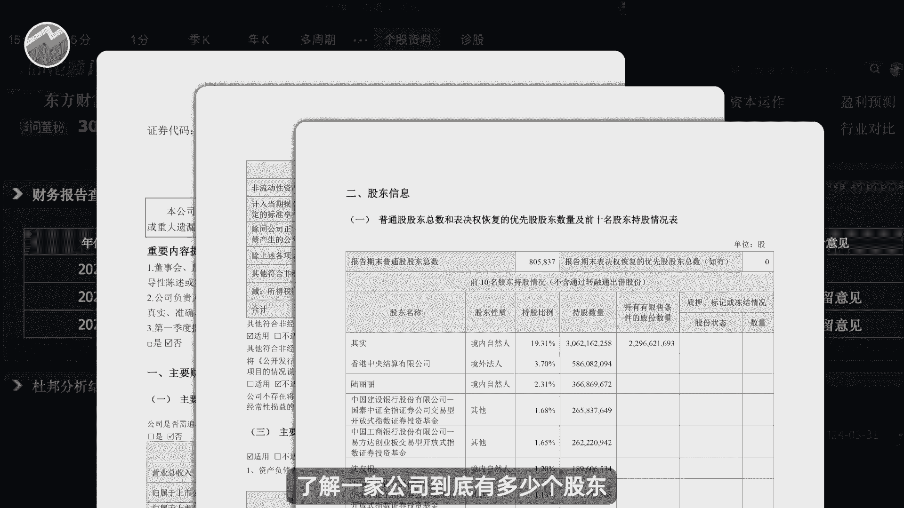
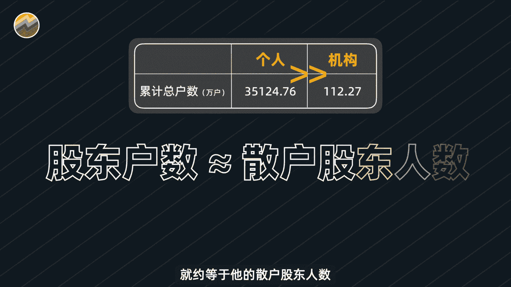
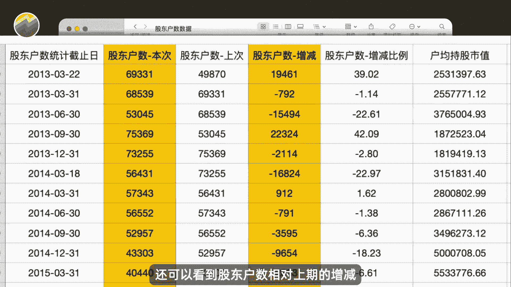
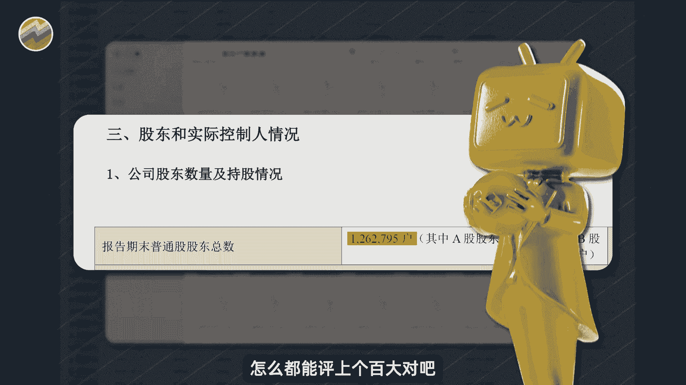
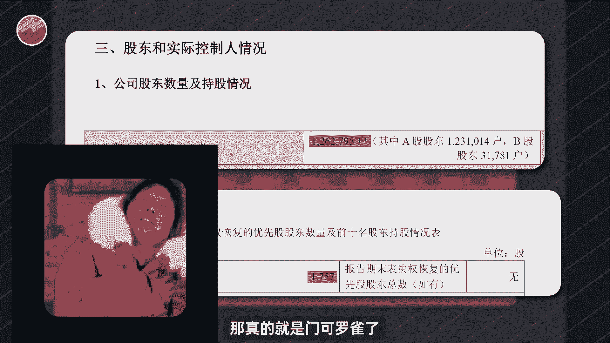
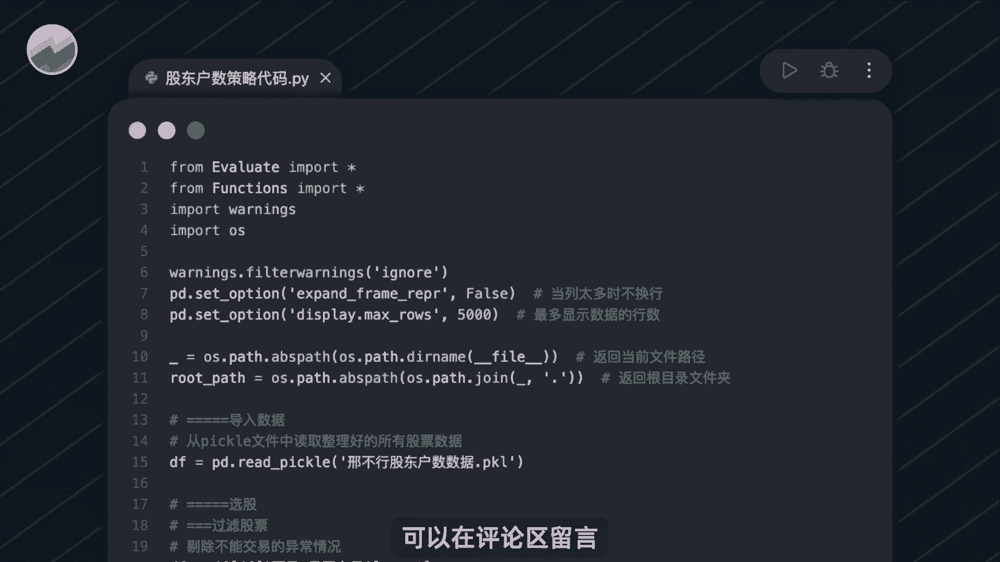
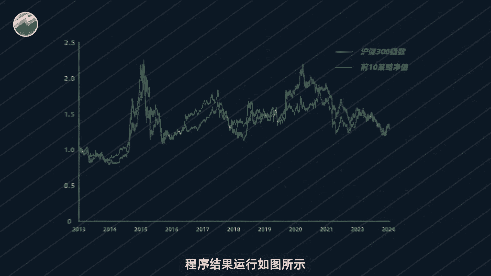

# Python量化散户抱团，这次真的不一样？【量化交易邢不行啊】 - P1 - 量化交易邢不行啊 - BV1af421D748

假如我B站的账号就是一家上市公司，每一个关注我的人呢都是我的股东，那我就有大约16万的股东，看上去人数还挺多的，但是一看其他领域，好家伙，张三这个人有3000多万个股东，那我的股东人数和他对比的话。

那就不值一提了，那相对的他的影响力比我也要大很多很多，但如果换个角度啊，大家在我这边学到的量化知识，肯定是比张他那里要多的，那里都是刑法知识，言归正传啊，真实的股东数据呢。

通常会在上市公司的定期财务报告中披露。

每个季度发布一次，我们可以通过这个字段呢，了解一家公司到底有多少个股东。

然后啊由A股的散户人数远远多于机构的人数，所以我们甚至可以近似的认为，一家公司的股东人数，就约等于他的散户股东人数。

那么也就是说公司的股东越多，说明持有他的散户也就越多，那么散户越多的公司，到底是能够帮我们额外多赚钱呢，还是多亏钱呢，要验证这样的结论，我们就需要A股历史上，让所有公司的所有股东人数的数据。

并借助Python代码来帮助我们进行计算，相应的数据呢我都已经帮他准备好了，你打开其中任意一个文件，不仅可以看到每个报告期的股东人数，还可以看到股东户数，相对上期的增减和户均持股市值等等。

可谓非常的全面，懂行的同学呢一定能够发现这份数据的珍贵。

如果你对这个数据感兴趣的话呢，可以在评论区留言，都是可以直接免费发给你的，有了这个数据之后啊，我们就做了一些简单的统计发现啊，截止2023年年底，股东人数最多的公有126万位股东。

这个公司要是在B站怎么都能评上个百大对吧。

最少的公司只有1757位股东，那真的就是门可罗雀了。

我们又去看了那些股东户数最多的股票，发现他们都是基本面优秀的行业龙头，好像也比较符合大家买好公司的共识，然后呢在很多人眼里呢，他们会认为那些股东户数少的股，公司关注度比较低，没有话题性。

说不定可能还有很严重的财务问题，再说了，机构能够抱团，散户人更多，抱团更能成，所以说啊这波优势在我那散户越多的公司，到底能不能更赚钱呢，我们是做量化交易的，不能凭感觉去做出判断。

还是要用数据说话去构建一个相关的量化策略，看看在历史上买股东多的公司。

到底能不能帮我们赚钱呢，假设我们在每个月的最后一个交易结束之后，将股东户数呢从小到大进行排序，并且啊删除掉那些当时T1，或者退市或者停牌的股票，挑选出此时股东户数最大的十个，然后呢。

我们就在下个月的第一个交易日的开盘，去均仓买入这十只股股票，并且呢会一直持有到下个月的一整月，直到下个月的最后一个交易日收盘，把它全部卖出，并重新去选择下个月股东户数最大的市值股票。

并且呢在下下个月的第一个交易日去买入，如此的循环往复啊，比如说途中，我们在2024年的2月29日这一天，在所有股票当中呢选出了这十只股票，他们啊是此时股东户数最多的，那么我就在下个月的第一个交易日。

也就是3月1日去买入他们，然后呢一直持有到3月29日这一天，卖出之后呢，重新选择符合条件的股票，是这样一个非常简单的量化选股策略啊，假设我一开始投入一笔钱去交易这个策略，那最终是赚呢还是会亏呢。

要验证我们这个想法，就需要借助全部的股东户数，历史数据和Python代码，那么相关的资料我都已经给大家准备好了，你只需要打开这个PY后缀的Python文件，点击运行的就可以看到结果。

如果你需要这个数据和代码的话呢，可以在评论区留言。

都是可以直接发给你的，好，那么我们运行一下那程序来看看结果到底如何，程序结果运行如图所示啊。

代表策略的橙色曲线呢，从一开始的一块钱涨到了1。2，九元，和图中代表沪深300指数的蓝色曲线，表现非常接近啊，年化收益呢只有百2。29%，最大回撤呢却高达50%，也就是说。

我们精挑细选的买股东户数最多的股票，的量化策略还不如直接起有指数，这也意味着，买大量散户抱团的股票是没有办法跑赢大盘的，我是行不行，关注我。

