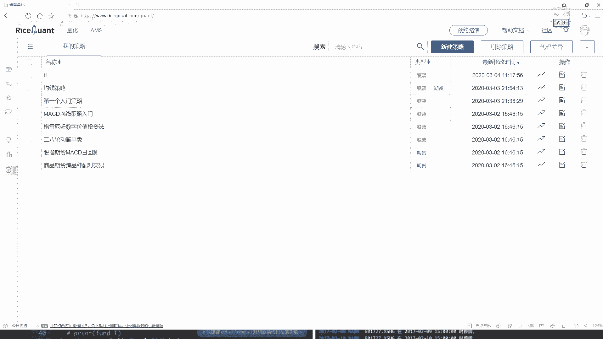
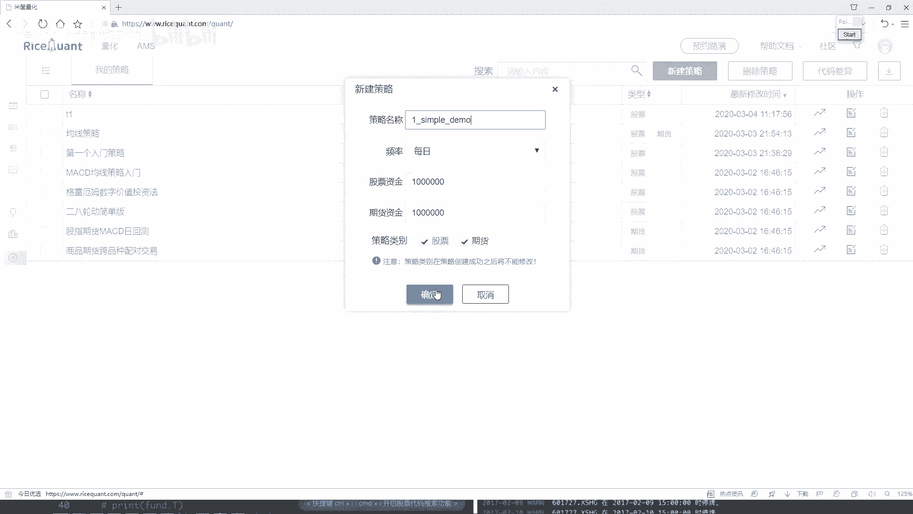
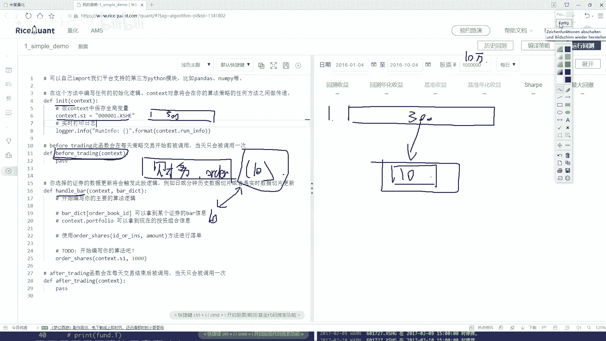
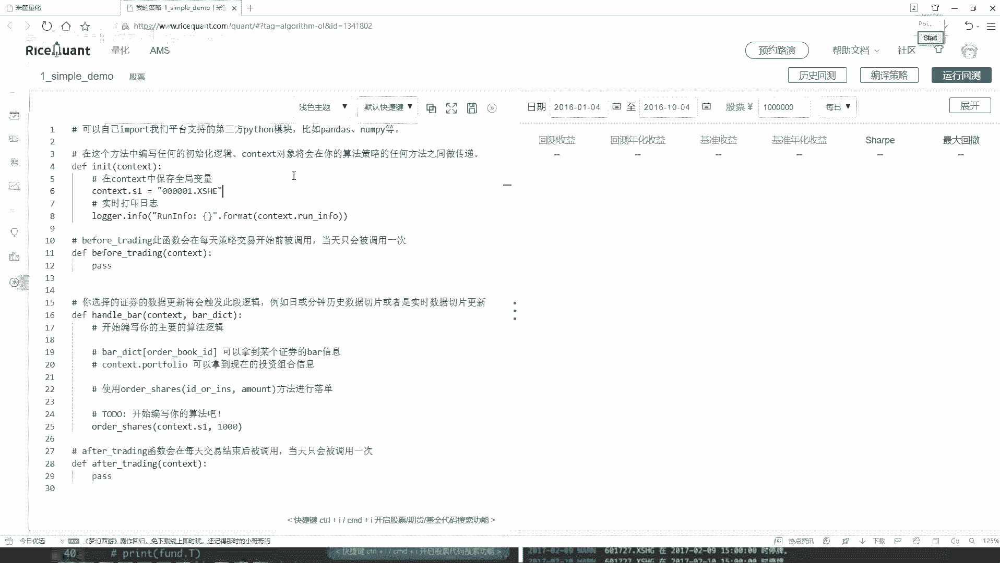

# 草履虫都能学会！2024最新Python金融分析与量化交易实战教程！三小时入门到进阶！比刷剧还爽！（AI人工智能丨数据分析丨数据挖掘丨编程） - P21：1-策略任务分析 - 搞AI算法的南风 - BV1ZXzzY7Eyp

这节课啊咱们就给大家演示一下，怎么样用这个交易平台啊，做一个简单的小策略，并且呢把这些API让大家先都给它熟悉起来，首先啊第一步啊。

你看这一块它有一个新建策略，咱们点一下JC当中啊，你去写一个名字，比如说这是咱们第一个例子啊，它是一个simple，然后它是一个简单的小例子啊，simple demo就可以了。

然后我们对股票玩就行好了，点完确定之后，这块它给你弹出来一个可编译的界面，就是咱们写代码都在这里来去写了，之前是给大家说了，有几个模块，哎我们的初始化模块，然后before trading。

然后还有憨豆bug模块，这些都是需要咱们自己来完成的吧，啊这是咱们一会儿要做的工作，然后这样我先给大家说一下，我们的一个任务的需求，然后呢基于啊我们这个需求咱们来做啊，我说这样咱现在要做这样一个策略啊。

我说现在哎呀有好多股票，比如说这个沪深300当中吧，咱就拿这个举例子，在这个沪深300当中啊，那你说哎这么多股票我可能一个个去研究吗，好像不太可能吧，那我说我这样吧，在这个股票池当中啊。

哎呀这里边300个，那对我来说太多了，我说我这样，我说我能不能啊，在每次哎我想交易的过程当中，比如这是个300个选出来什么，我说每次啊或者说每一天我都看一看，或者每个月我都看一看。

有哪十只股票是表现的更好的，然后呢我买进这十只股票可不可以啊，像是这样一件事啊，就是我的手里哎，始终比如说这是我的一个手里吧，我的手里啊始终就保持哎我就有十张，就就有咱们十个股票吧。

但是这十个股票那可能是每天发生变化的，因为股票可能坚持股票，我看的走势挺好的，我买了，然后这些股票呢我看通过他爹其他指标观察，哎呀他的情况不好，那我就卖掉行可以吧，也就是说啊现在我的手里我的一个任务哎。

就是说始终咱就保证有这么十只股票行吧，那大家来想一想哎，那你说这个任务我该怎么去做呀，那是不是得哎，我一开始我先把这个300个股票池给它获取到，然后呢，接下来哎我说在这300个股票当中。

我说我做一些判断吧，查询一下诶这300个股票当中，比如说啊咱一会儿会用到哪些个特征，有一些财务方面的特征啊，一基本面特征啊，或者是一些哎或者更多的吧，其他方面的特征，咱们可能一会只选择某一个啊。

咱不举那么多太多的例子，那选择一个特征，我看了这个特征啊，比如说我说看一下吧，呃当前每个股票，然后他的一些财务数据，财务数据当中呢，比如说有一个盈利吧，我说这300个股票每一个的盈利我都拿出来。

然后说按照倒序来去排，看看哪些盈利最多的，然后我只买盈利最多的，那前十个可以吧，那你想随着咱这个每天的一个变化啊，这300只股票，它的一个盈利情况是不是也在变化呀，那我每一次哎。

我是不是都需要去把他的盈利数据拿出来，然后对盈利数据做什么做一个排序，看谁排前十个了，排前十个股票我拿到手，然后我就要去买这前十个呀，说要做这样一件事啊，好了，这是咱们基本的一个目标啊。

那你想有了这个基本目标之后，那我们实际做该怎么做呀，在这里啊，这是哎咱们就在这里写吧，我就随便先给大家说一说，第一个就是我们的构造函数，在这个或者初始化函数啊，在初始化函数当中啊，我们要做这样一件事啊。

比如说现在我说呀，咱们你看这里啊，它这个咱们就拿他这个例子来说啊，它默认会给你生成一个，就是简简单的一个小例子，咱们一会儿要去改挺多东西啊，那你看我这里诶，人家选的是某一个股票，那可能我们不是要去做的。

我们要选什么，咱们现在在这个指数当中，把这个沪深300全拿到手吧，这是咱们第一步啊，在这个出构造函数当中，我们要把这个沪深300全拿到手，哎这有300只股票了，然后呢，接下来有这个股票池之后啊。

你看这块有一个before trading，就是在我们做交易之前，在我们做交易之前要干什么呢，那咱们刚才说的哎，你是不是得把这300只股票，他所有的一些财务数据想要拿到手啊，这里哎我说我们就要去干什么。

拿他的一个啊我们的一个财务的一些数据吧，那可能指标太多了哦，这些哎这里就是300个股票，然后这里我要看他的一个财务数据，然后呢我说再做一个排序吧，排序那就是一个order是吧。

然后呢我说再只取这么十个行吧，这是我们的一个任务，这些任务都在哪去做的，都不是我们实际的一个交易吧，所以说啊所有的诶，就是但凡跟实际的一个交易是不挂钩的，就是每天都需要去做的一些查询呀，处理的操作啊。

咱全放到这个比before trading当中，我们来去执行嘶，在这里啊，咱们再来想一想，我现在执行完了这个比before trading之后，我是不是手里有什么了，哎我就知道了。

你看这个函数咱之前讲的时候，是不是说它每天都会执行啊，那我是不是都有每天的什么呀，我们最终可能就要这样一个值，每天的十个数据，或者说每天十个股票，它的一个呃代码是不是就行了，我只需要这个东西吧，好了。

接下来在这个憨豆瓣当中啊，就是我实际哎要去做一些事情了，这里要干什么，咱们来想一想，这块我是不是得先去做一些逻辑的判断啊，比如说现在额咱们初始资金，比如说有10万块钱吧，初始金就10万块钱。

然后我说呢在这个10万块钱当中啊，我第一步我是不是得先看一看我手里哎，有什么东西，我手里有哪些个股票，并且呢我这些股票是不是什么，比如这点，咱们现在这个这个十个股票，都是实时进行更新的吧。

那每一天我都要判断一下当前我手里这个股票，这十个股票啊，比如当前我手里拿到这十个股票吧，跟之前哎不是跟咱们刚才判断的哎，最好那十个是不是一样的吧，如果是一样呢，是一样的，我就接着持有呗，那不是呢。

不是的情况下，我就给它卖掉，然后再买什么，再买新的新的什么新的最好的，这十个当中我还没有的吧，所以说啊在这个HANDBER当中啊，我们要做一些呃业务处理了啊，在这块我们要先去哎。

判断一下当前我们有哪些个股票，然后呢，有的跟财务，刚才咱们计算完那一个好的结果是一样的，我就继续去买，然后不是一样的，我就给它卖掉，是不是就行了啊，这个就是在咱们这个HANDBAR当中。

我们要去做的一件事，现在大家就是从整体上啊，我们概述了一下咱们要干的一件事啊，其实说着挺复杂啊，但是看起来挺简单的，就是沪深300当中啊，我去始终选十个最好的，然后我让我手里有的一直都是这十个最好的。

我看一看，我说我设计这样一个策略啊，比如出去那个起始资金，我给你10万块钱，看你经过了，比如说一年吧咱们能赚多少钱啊，我们要做这样一件事，方法啊。

就是听起来挺简单的吧，行。

