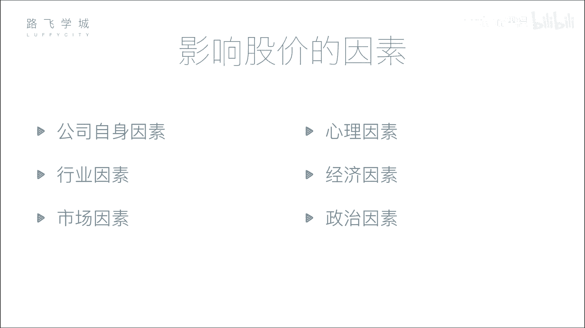

# Python金融量化+股票交易，清华计算机博士讲解，入门到金融实战！ - P4：03 金融量化分析-股票市场构成 - python课程 - BV1CNUHYfEJE

好，那介绍完股票的分类，我们来说一下股票市场的构成。啊，也就是说你这个市场有哪些人啊，首先第一个公司和投资者啊，分别是啊要钱的和出钱的。嗯嗯，公司融资消费者这个投资者进行投资嘛，嗯。

那但是啊我们说这个上市也好，这个就是炒股，不能让你公司和交易投资者直接进行交易。那你有什么这个什么暗箱操作呢，对吧？嗯，所以有一些监管机构啊，就是说最常见的证监会。

这是这个证证券这个行业的一个呃做监管的一个机构。嗯啊比如说你的公司想要上市，你需要把各种材料交给证监会嗯啊啊比如说你这个公司的一些。比如说我你这公司我判断你是不是有欺诈行为。

有洗钱等等各种各样的违法行为，都是证监会来进行监管。对啊，这一权利是特别之大。对他有行政他能决定你这个呃这个这个股现在能不能上市。对另外你上市还能给你。撤下来对啊，判断你这个公司是不是在干正事啊。

是不是不干好事。那第21个证券业的协会，它的作用比较弱一点啊，这是一个存那个比较常用的一个比如说大家可能考一些这个证券业证啊他主办啊，它的交易它的作用弱一点。第三个交易所啊交易所就是提供一个场所。

我们说就那个大市场，对是他来提供的上海深圳那两个一个两个大方子对全全全国的这个股民都在那在那个大房子里交易。对啊，这个要说到就是很久很久以前就是西方传馆是吧？那个时候是争去交易所。对你要去抢窗口排队。

然后没对，就那种没错啊，当然现在的话大家都是互联网了以后连到那个大房子里。对，所以交易所对交易所的功能，就在于他要处理你各种各样的请求啊，就真正去那排队，我就排骨和卖股票的人不多了。没有。

不是也许有的不能这些是吧啊。还有一个就是证券中介机构嗯啊就是我们俗称的可能是一些券商。嗯啊他是来干什么的呢？就是我们说个人股民是不能直接来卖股票的啊，中国不能直接我去交易所买卖股票不行，你要在券商开户。

嗯，比如说这个有各种各样什的，这个我我我来解释一下，来解O那呃首先呢是这样，不是说个人股民不能直接买一股票，而是说成本太高，为什么呢？因为啊。在西方的时候，就是大家一开始都是说排个队去人买票。

但是相当于你之前买股票没有电子化的时候，你买一个股票给你一个凭证，对不对？相当于这些你那那穷人说我买10块钱的股票，我还得弄个凭证，那这个凭证要要核实的对不对？你要确保公司股票就这么多。

你不能多发了或少发了，所以就成本其实中间手续比较麻烦，所以后来就是说人家这个证券交易所就不像相当于小股民去对就是相当于你10块钱，不好意思不服对吧？我们的门槛就是多少钱，对不对？

然后另外一个就是说那那还有一个就是什么你要想买股票，你必须到证券交易所里边来买，我不在外边卖，能理解吧？对那怎么办呢？你你想里边来买，那怎么能去把有钱人过滤出来。

没钱人就不让他进来卖席位一个席位几万美金但那个100多年前美国啊，对吧？那100好几万美金就是非常贵所以穷人。直接就没办法，但穷人影行炒股票怎么办呢？那富人就是这样，我现买了一个席位。

我自己的这个股票交易是是有限有限量的。这个席位就我坐在那派一个人天天在那里炒股，但我不可能每天交给好多股票，对吧？我又想把席位费挣回来，嗯，理解吧？所要干嘛？我又开了一个业务说，哎，我这个有钱人啊。

我再派一个小，天天到那个场外，就交易所外面去找一堆人说哎我现在有这个买卖的资格，你们是想买，你把钱给我，我交我帮你去买，对所以就是那个小股民，对吧？一堆小股民凑起来，这个钱就多了。对然后交给这个有钱人。

让他有那个席位，让他帮着去买卖，能理解吧？okK那现在衍生到现在呃这个情况就是说啊在国内也是啊就是你你只有在证券交易所里有席位，你才能去买卖股票，小股民是没有一个席位好几百万啊，对吧？

你没有钱买这个席位，所以那怎么办呢？那你就通过这个叫重证券中介机构啊，就叫券商。比如说中信证券，我之前的公司中金证券、中金公司。海通证券，然后什么乱七八糟的对他们。就干嘛？

就就就在那个正常交易所都有席位，对对不对？然后他又想把那个席率费挣回来，是不是啊？所以他就干嘛呢？相当于开发的一套软件。比如说我们炒股用的什么这个就是每个证券还有资，每个证券同花顺呀，对不对？

首首创证券不是同花顺嘛，是吧？啊啊用的这个同花顺啊或者一些炒股软件，这个炒股软件，就是这种券商给开发的对吧？它相当于是说哎，你先连这个券商的这个这个服务器，然后你把指令交给他。对。

然后他再帮你转通过他在证券交易所的席位去帮你的指令下达给这个证券交易所帮你买股票。你有啊就这么出杂的东西啊。然后接下来就是这个交易所啊，交易所，中国有我们有两个啊，一个在上海，一个在深圳啊，简单说一下。

每个交易所它都有叫做板块嗯啊，上海来说简单只有一个主板嗯，叫做啊就是主板，深圳的话它是分为三个板块啊，有主板，中小板和创业板啊，所谓中小板和创业板是什么呢？

就是相当于国家对一些小公司或者是一些刚创业的公司的一种鼓励啊，可能你公司的体量包大不够大，不能上成长成长性非常好。但是我为了想让你快发展很来，对国家经济也比较好处我给你开了中小板和创业板，没错。

就是小规模的公司，你可以在这两个板块上市，对中小板可能会呃现在上中小板的这个要少一些。因为它的融在中小板当中那个融资的，反正就是融资的少一些。对。

那现在其实一般的公司会上创业板或主板比较多但上主板比较困难。对，它要求特别严格，就是你。你这个要求你每年盈利5000多万还是多少，对吧？净利润还是啊。

有可能对但创业板就是说连续三年还是两年3000万净利润就可以。那所以你会发现比如说像乐视啊，就上个创业板。对啊，对，就是我这个公司有可能特别需要融钱。但是我又没有那么大的体量去上主板。

那我就可以上个创业板创业板也可以融很多钱，所说像乐视爆红原因嘛，对吧？啊，这个就是啊上面是创业板啊，那对于每一个板块来说，我们说都有一个叫它的所那个我们平常上叫大盘。嗯啊那个大盘是什么呢？

其实就是一个指数嗯，叫这个上海的主板，它的大盘叫做沪指嗯啊，呃也叫做上升值，这个指数是代表什么意思。你会下一个节讲吗？还是我会现在讲啊，现在没错。

指数其实就是反映了你这个板块内基本上所有股票的一些综合的表准。嗯嗯。我的智商不够够，你解释一下，比如说你这个呃这个这个上海这个板块有3000只股票。嗯，好，我把这3000只股票，它有可能有涨就有跌的。

可能两举个简单例子啊，可能2900只股票都在涨100只股票跌了一点。好，那我整个的大盘要表现出这所有股票的一个综合的表现，那我这个大盘给你一个指数，它其实就是一个曲线啊，它才表现肯定是涨的对。

就是所以说大盘简单来说就是表现一个市场的一个是好向好还是向坏对这个所以就是说中国股票人家就是就是比如说它当一个概括性的东西，说哎中国现在这个股票行情怎么样啊。

你总不能说3000只股票里面有1000只涨了，2000只，不能这么讲因为你要去看整体的一个趋势。就是说哎那怎么整体的趋势呢？就是说整个市场盘子可能里边有1万亿人民币对那么一个市场盘子。对那这1万。

里面可能就是说有这个相当于七八千亿对对这个盘子的这个股票都在炸了，那其实就整体都在对，整体向耗，对对吧？那但是我们不会说七八千亿盘子，而是说把这七八千亿盘子的这些不是一只股票来嗯，可能好几百只股票啊。

它就占到七八千亿，对不对？那把这些几百只股票。打一个包综合起来，相当于搞一个平均值啊类对不对？搞一个这种趋势图。对，但这个趋势图这七八千亿涨，它就整体相当于整个大盘就是好的对，七八千亿都在跌。

相当于股票行情就不怎么样。对，就那么一个性。所以它是大盘就是表现的你这个盘子整体的一个走势呀。那上海它的盘子叫做沪指，沪指300。深圳它的三个板块，这个主板叫做深成指啊，中小板就是中小板指。

创业板就是创业板指啊。

好好，那接下来我们说一下什么呢？影响股价的因素。

