# Python金融量化+股票交易，计算机博士讲解！入门到精通！绝对是全B站把python金融分析与量化交易讲的最透彻的教程了！ - P5：5.5.4-亚马逊股价趋势(Av275101736,P5) - 人工智能前沿技术 - BV1pf421R7v4

刚才啊咱们已经做出来了一个基本的模型，那下面呢我们要做的就是，怎么样，让怎么样能让这个模型看起来能够更好一些，做这样一件事儿，还是那些库啊，就是这些库啊，大家都之前都已经安过了。

那这回呢还是把它们导进来啊。

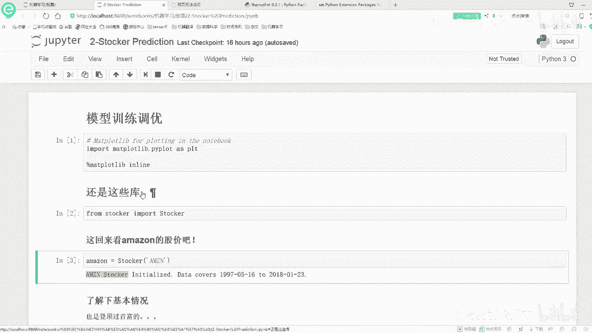

就是啊我们继续来做这个事，然后这回呢我们换个股票吧，换一个亚马逊的股票，看一看是不是也是呈现出来这样一个事啊，然后这个亚马逊的这个股票就是AMZN，然后这个家伙这股票我觉得就更牛逼了，这股票就更牛逼了。

因为他那个老总啊，毕竟也是登顶过全球首富的人嘛，现在首富是谁啊，我不太清楚啊，反正之前有段时间啊，就是亚马逊的老总吧，他们创始人然后登顶过那个首富吧，所以说这个股票啊还是蛮有发展的。

这个股票还还是蛮狠的，再来看一下他这个情况吧，这个情况他是从这个九几年它是呃，我看一下最低价，最低价是97年5月22号，然后现在呢最高价是这个U23啊，这是我1月23号那天执行的。

然后呢他的收盘价是1362。54，这个反正对股票来说啊，我我对这个股票价格的概念不太特别清楚，我也不知道这个1362，在这个行业当中算是个高价呢，应该算个高价吧，觉着备注是一个应应该已经登顶的价格。

这个呢就是它股票整体趋势，这个就不给大家画了。

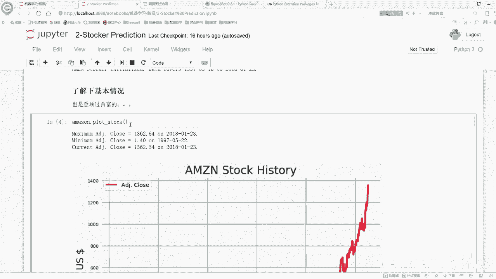

这个东西咱都看过，咱就不看了，然后呢又看了一下他的浮动的一个情况啊。

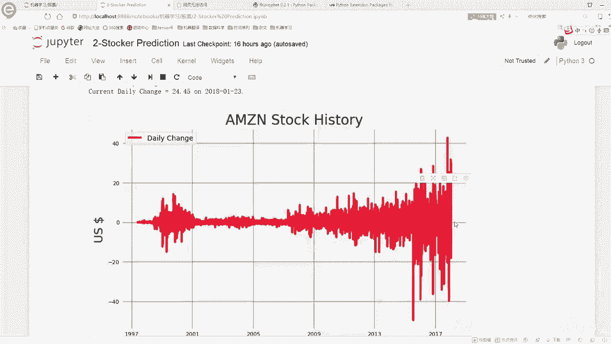

这个浮动情况看起来还是蛮大的，因为在这里你看他有时候上上升下降上升下降。

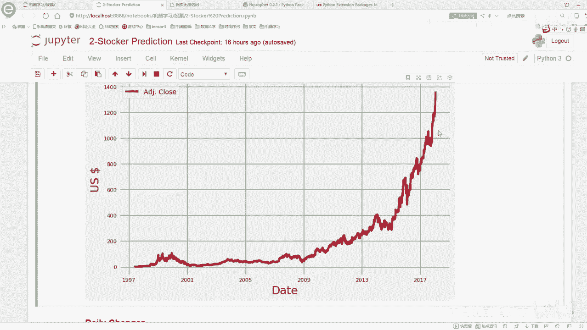

但是总幅度还是进行一个上升的一个趋势的。

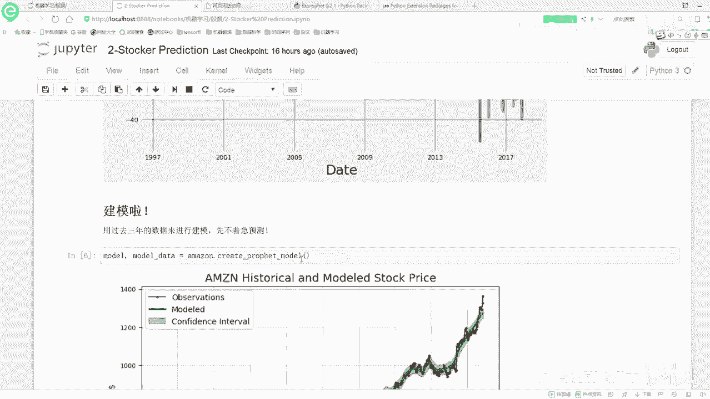

所以呢还是要构造一个基本的模型，基本模型啊，它是长这个样子的，这个样子是没什么问题的，然后呢还是啊这个黑色点是真实的，这个这个绿色点是咱们预测的。

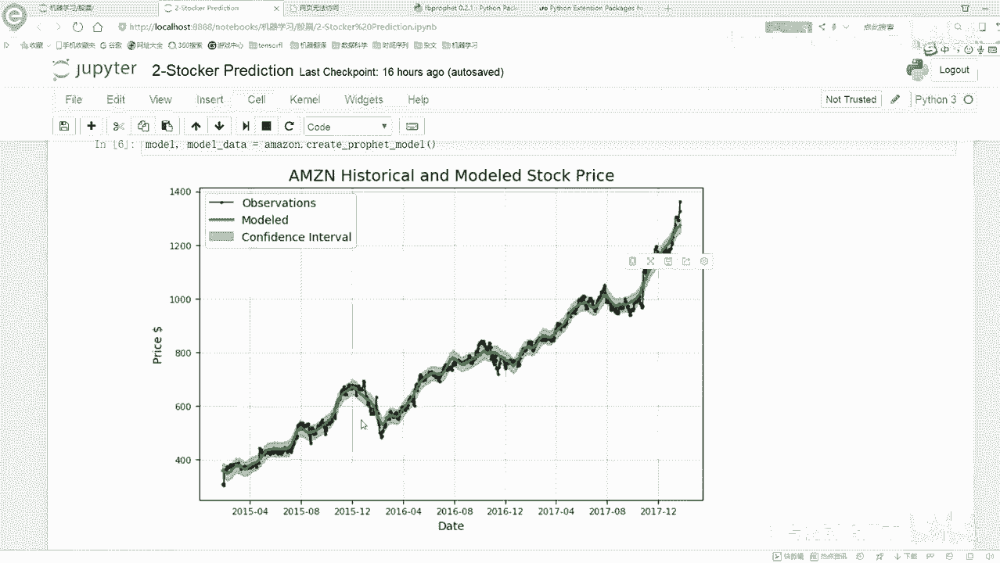

其实大家发没发现这样一个事啊，它真实的模型啊。

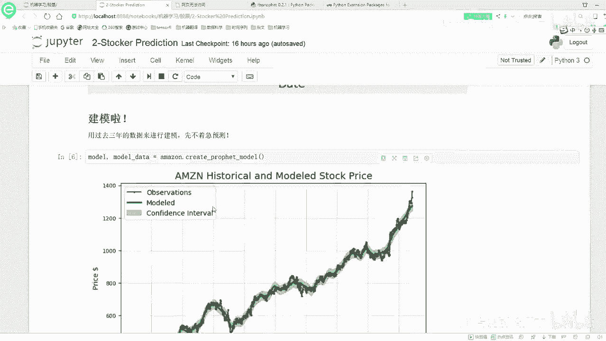

可能来说就是嗯就是那些突变点更多一些，但是咱们预测出来的模型呢，普遍来说啊都是咱们更均衡，更平稳一些，这个呀也是我们暂时希望的一个思路，就是我们希望这个模型啊别太去过拟合。

因为一旦你把所有突变连点都找到了，那可能就完全过拟合了，这个趋势可能就不太对了，我们要去预测出来模型，可能还得就是朝着平稳一些这样的一个方向，更把握一些的，然后这些啊都是一样，这些咱们也不详细去分析了。

我们也不关心这个股价到底怎么样，也不去买股票，这些就不看了，给大家主要来说它都有哪些功能，然后呢我们要去预测，我要去预测未来90天的，在这里啊，就是我先随便的建立一个模型，在这里我们什么参数都不调。

只写一个D等于90，在这里呢当你写了一个D啊，等于90之后。

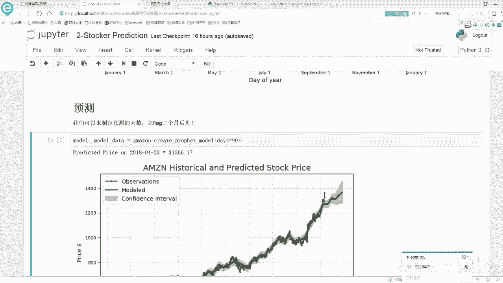

在这里啊，就是当你写了一个death等于90之后啊，然后呢我们得到的结果是什么样，我们得到的结果就是你看这绿色是他预测的，它明显应该是一个上升的，但是呢它这个东西啊，却是一个比较平稳上升的一个模型。

你看这个绿色是他预测出来的结果，然后呢他预测一值啊，在这个4月24号，反正今天今天是今天，反正是三个月之后吧，预测3月之后是1366，我不知道大家到时候看视频的时候是哪天，要是真超过了4月24号。

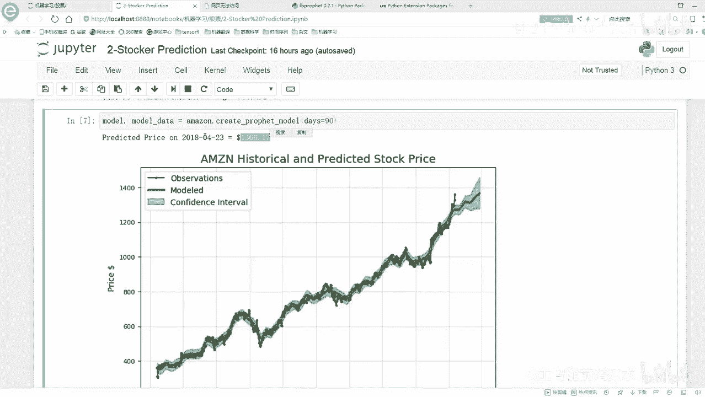

那这个时候就是你这样，你可以把那个CR4号那天数据拿出来看看。

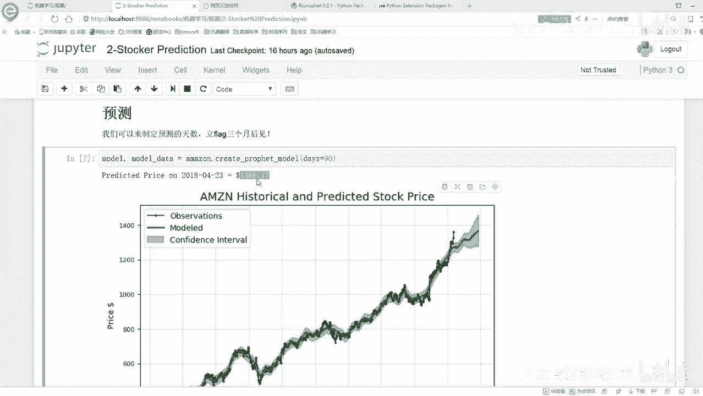

看看是不是这个1366，估计肯定是跟这个数是有一定偏差的，然后现在咱们预测完这个模型之后，这是基础模型，预测完之后发现这样一个事，我们模型怎么样，它是更保守一些的吧，其实呢他这个应该是明显往上穿的。

我估计要穿的更高一些，因为今年这个东西它是这个公司，可能越来越牛逼了吧，反正我我对这个公司也不是特别了解啊，没买商场买过东西啊，因为国内也很难去上这些网站的，然后这里呢就是应该明年网上穿的。

但是它更保守了，所以说我们发现模型更保守了，但是呢它会降低一些离群点，还有这样一个突变点对我结果的一个影响的，在这里呢咱们先提出来，这一点就是我的一个模型的一个评估，嘶模型的评估啊。

咱们这里说你说我要去怎么去评估这个事啊，咱们来想现在要去评估，哎呀这里我现在就是往简单来说啊，咱们这种评估，比如说我预测值是一个值，真实值是一个值，我预测值和真实之间我会有这样的一个误差吧。

就会有这样一个差异，那现在呢比如说我在这里我选我想选一部分啊，就选这个17年吧，17年之前我当训练集，然后一天之后我当测试集，这样呢我就可以看训练集，它这个误差是有多大，测试集它的误差又是有多大。

这些误差呀我们都是可以自己的实际算出来吧，就是真实值和咱们实际值之间误差，说白了就是这样一个绝对值嘛，这个值可以可以看出来，这是第一点，我们要看一个误差，第二点要看什么。

第二点我要看的就是当前这个指标啊，如果说它实际的是一个上升趋势，那我们预测的它是不是一个上升的趋势，如果说它实际它是一个下降的趋势，我玉米预测出来它这个下降的趋势，也就是说在我评估的时候。

第二点要考虑的就是这个趋势，我们预测没预测对。

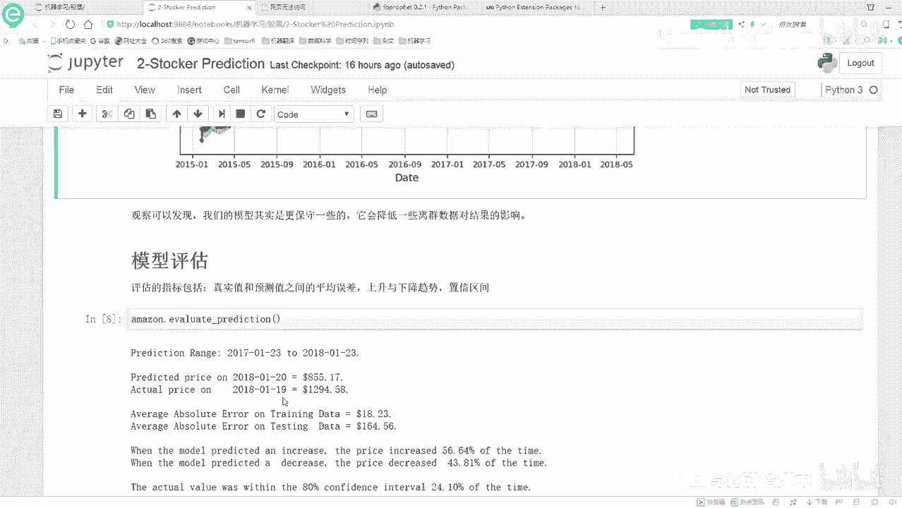

在这里呢有上升趋势，还有下降的趋势，我要看一下上升和下降趋势。

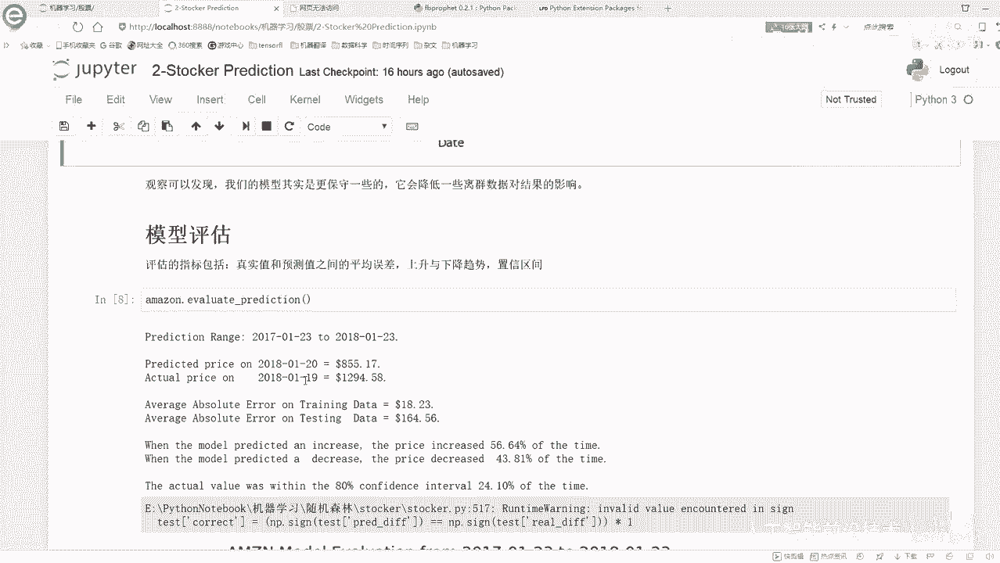

分别都做没做对这个事儿，然后呢在这里啊，就是我们还是来debug。

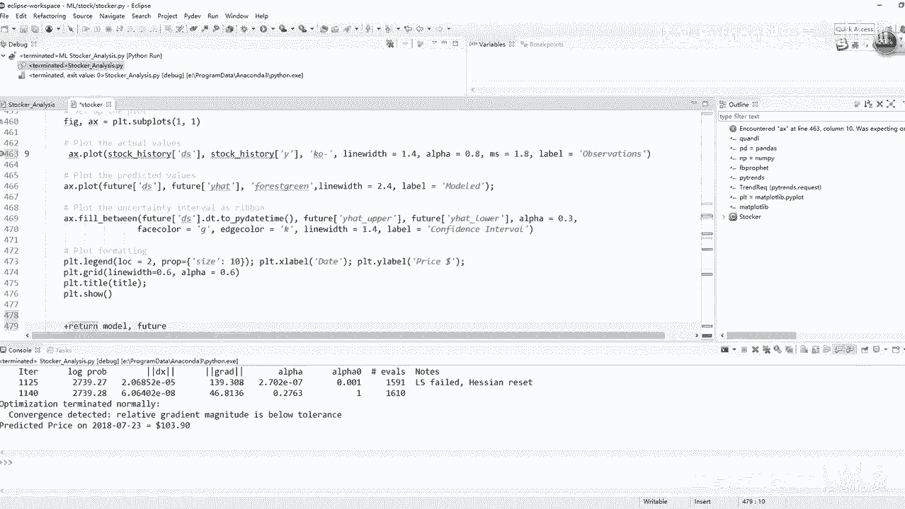

这个咱们也debug完了，然后这里这里呢你看这里我写的比较少。

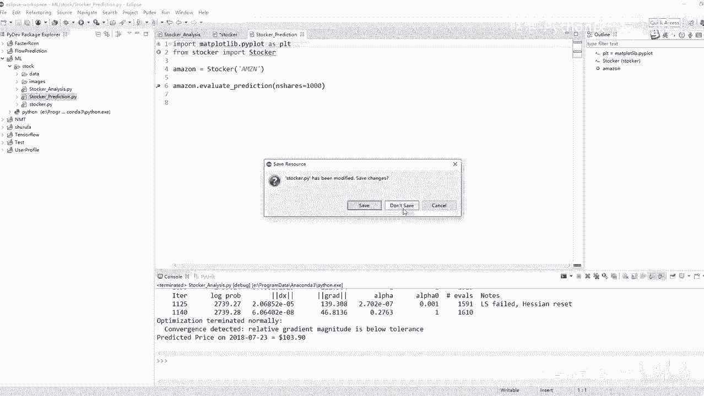

这里我写的比较少，来看一下哦，给我先看一下，这里我先看一下，把这个直接复制过来吧。

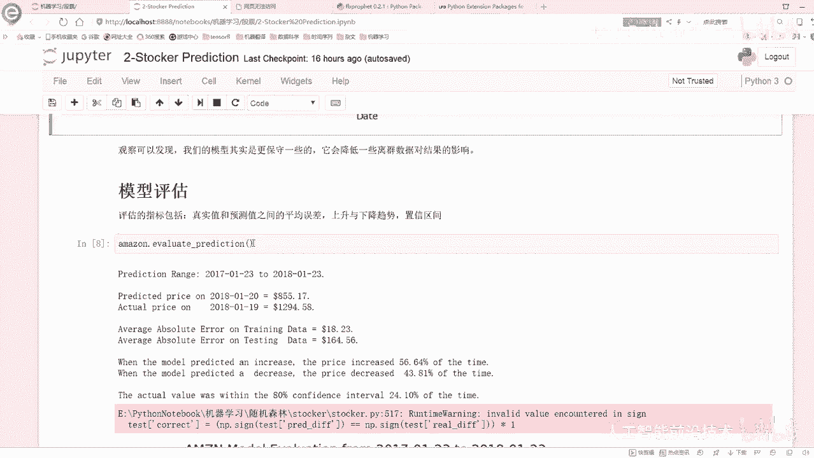

这里我先去构造一个模型嘶。

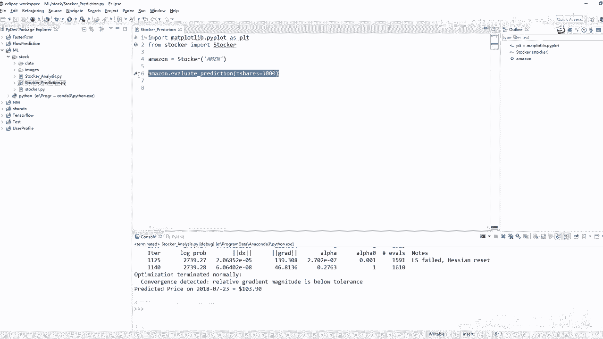

哎我看直接跳，直接跳，这里可以吧，前面的东西用复制过来吗，前面东西不行。

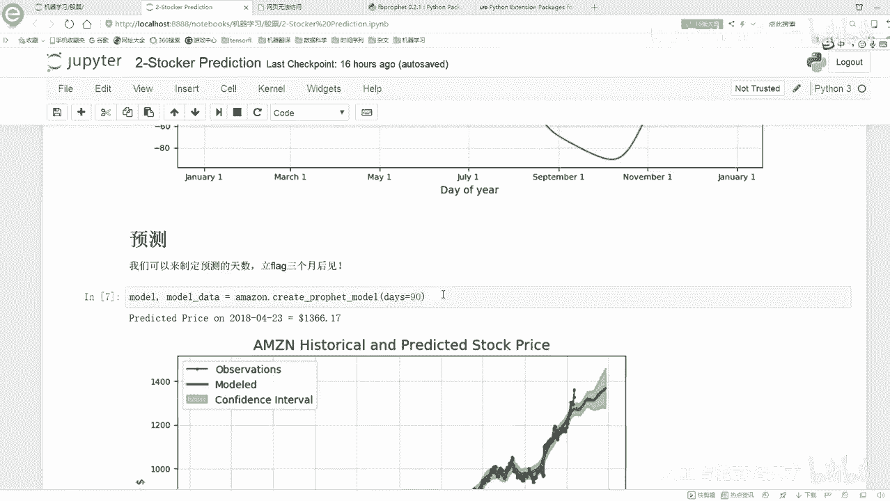

前面东西我还得去把这个东西啊，模型先构造出来，把股票拿到手，然后构建模型，然后去评估，这就没问题了，然后这个第二第二咱们不看了，建模一样的，咱们直接来看评估这块还是第八个，以下这个呃这个ELIPS啊。

已经把我把我完全当成是我的一个，就是呃讲课给大家去演示了一个debug功能了，因为我都是这么觉得，就是你自己看他的代码，其实我之前我姐我带过一些线下班，我在线下班的时候，之前同学去看代码的时候。

他们一般情况下都是从到尾去看，然后看我觉着这东西啊能看出什么，还是觉得比较难理解吧，最好呢就是能debug1遍，你看debug的时候，你看一下这个值多少，那个值多少，本来这个代码其实挺难懂的。

那你就是你看代码，你不知道啥意思，那你一看值，我觉着十有八九你也才能猜出来了吧，因为我去看别人代码的时候也是这样的，别人代码其实很多啊，也不一定我第一遍直接看函数，你直接看函数啊，也不一定能看懂吧。

一般情况下从头到尾debug1遍，自己走一遍，走一遍之后啊，心理啊差不多就有个数了，哎我给大家尬聊这么长时间，他还没有去给我跑完，咱咱咱还得再尬聊尬聊一分钟啊，这东西看起来蛮慢的。

然后我这个CPU是8700K哦，已经8000，但我估计大家的可能没我这个高一小，因为我当时是我这个不是服，我这个还不是专门用来当服务器的，只是放到我这个家里啊，给大家做这样的一个演示的一个功能的。

哎呀又尬聊了又尬聊，这么半天还是没有还是没有跑完，这里呢可能就是这个数据嗯，怎么说呢怎么说呢，怎么说我也不知道怎么说，但就是比较慢，还没有到我这个断点上，那咱再稍微等会吧。

哎我看这块他这块怎么已经预测出来的结果了，之后打印出来预测那天结果。

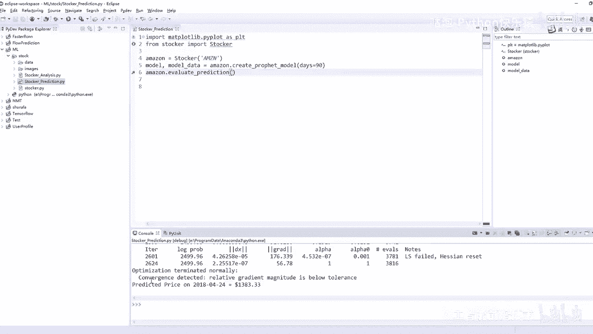

但是没有给我跳到这个评估里边，这么的吧，咱先看咱先看结果吧。

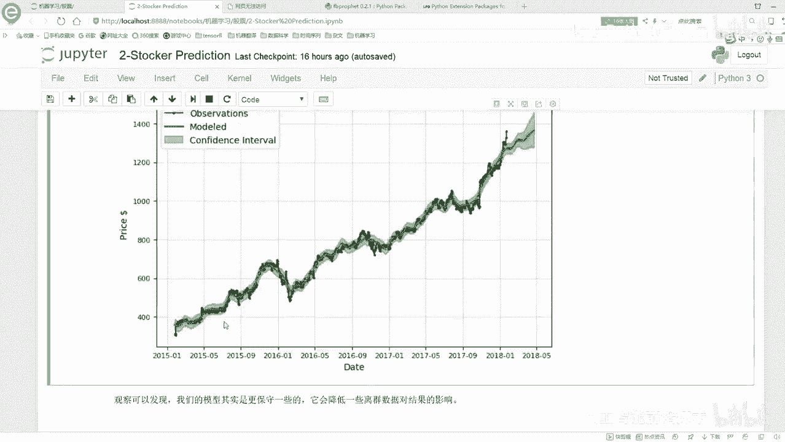

咱先看结果，然后再来说他这个模型哦，哎呀我我二了这块专业垫，这样就是它会给你画出个图，你需要先把这个图给它关上，它会才能继续往下给你运行，我这个图一直没关，我还傻等着呢。

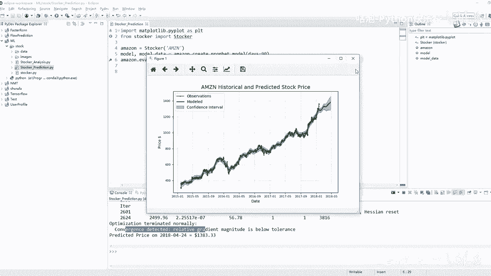

尬聊了半天，然后给关上，这回他就进来了是吧，大家注意一点啊，就是你在list里边，它是就像这块它会跳出来图，挑出来图之后，它会等着等着你把这个图关上，关完之后，他才会给你往下去跳。

我就说这个尬聊这么长时间，怎么还没给我读完，首先一样啊，还是给你找这个起始和终止日期啊，你看17年哎，start起始日期怎么怎么怎么这么往前起始日期啊，它是一个一级，我看一下这块啊。

因为这块我只我只选择了一个一年啊，这块一个我只选了个years等于一年，所以说我现在起始时间是这个，2017年1月24号，终止时间是2018年1月24号，拿这部分时间，当成是我要接下来处理的一个日期。

然后train呢对于我的一个训练数据啊，训练数据我是取的是3年的，就是14年到17年，然后测试就是训练数据，14年到17年这么3年，然后测试数据啊是这个17年到18年，这么一年。

就是3年三年的时间来当成是一个训练，一年时间当成测试，但不要忘一点啊，这个测试集一定是要有真实的一个指标的，所以说测试结只能是从今天开始，往前推这么一年，然后训练集呢就是往前推，那么4年往前推4年。

代表人取3年嘛，这个意思，然后分别啊把我这个训练数据，测试数据按照日期都拿到好吧，拿好之后啊，然后这里我还是去先去建立一个模型，来feat一下我当前的一个训练数据，训练完单元数据之后呢。

然后接下来要预测吧，接下来预测的时候，你在这里指定365，什么意思啊，你要预测出来接下来的365天吧，所以说这块feature我们把这个东西拿到手，它是从17年一直到这个18年的1月23。

所以说这是咱们当前的一个指标，然后呢我去在这里又去project一下，就是实际的去进行一个预测吧，这块这会又得稍微等哎这块蛮快的，实际预测出预测预测完了，然后最终呢我就得到18年结果了。

然后呢把我当前预测完的结果给他word进来，就是把我的结果拿到手，春的结果呢也给他拿到手，这回呢咱们就来看吧，咱们先算这个东西啊，先算一个这个difference啊，这个difference它的意思啊。

就是说呃我按照我前就是按照今天减去，昨天这样的一个这样的一个指标，去进行一个计算，他这个意思，说白了就是我这么一减得到一个正数，说明就是我是一个上升的趋，预测的是上升的趋势，我一减它是个负数。

那不就是预测它是一个下降的趋势吗，这里就是通过这个deer这个函数啊，帮我去看一下，在当前这个当前咱这个幅度啊，它是一个上升还是一个下降的一个幅度的，这块呢，我没有去打印值啊，如果说大家不清楚的情况下。

你可以去打印一下deer之后的结果啊，说白了就是我拿今天跟昨天去比较，然后把每一天和前一天的差异值拿到手，拿到的是这样的一个差异值啊，然后这块SIGN啊，这个函数它的意思就是说嗯大于零的情况下。

它是就是等于一的，小于零的情况下，它就是等于零。

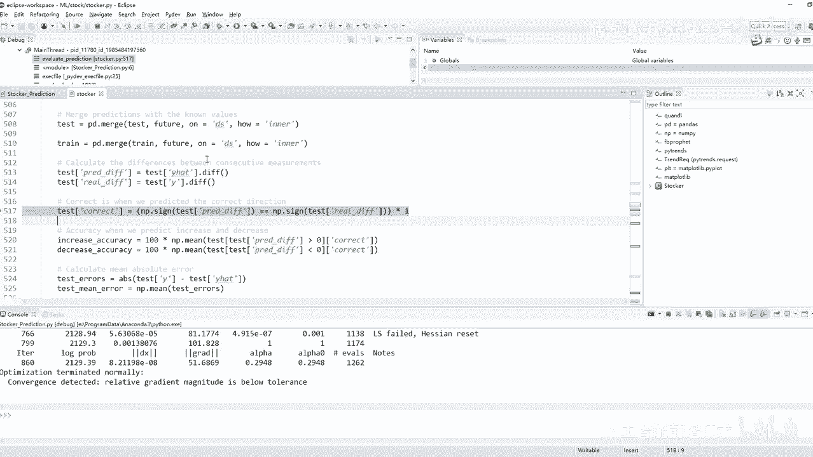

就是等就是等于零的，它是这个意思，给大家来看一下这个函数吧，这个函数大家当大家就是读的时候。

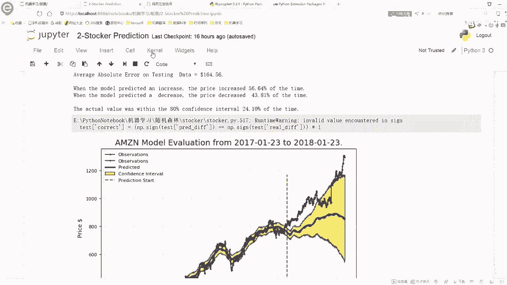

如果说你遇到哪个函数，你不太了解不太了解的时候，怎么办呢。

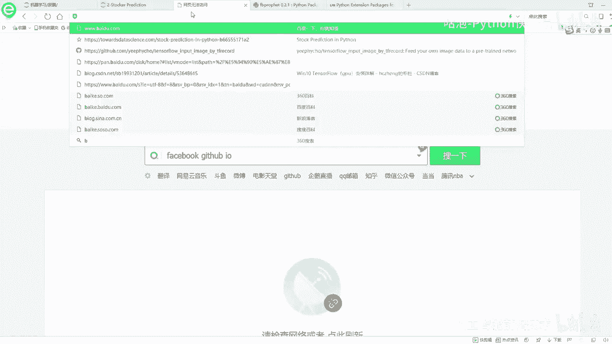

比如这个函数啊，我现在也不会了，我这个函数也不会了，我就百度一下吧是吧，这个南派直接定义他的文档当中，他就会告诉你，如果说当前它小于零的时候，它是等于一的，大于零的时候呢，它是大于零的时候。

它是等于一的，等于零的时候呢，它是等于零的，忘了这个东西啊，不要紧啊，这些这些函数啊我也容易忘，忘了之后怎么办呢，忘了就代表不确定，你看刚才我刚才我刚才我想什么来着，我被误认为它是小于零的时候等于零呢。

那不确定自己查一下，查一下这个函数啊，你就查这个南派的一个官方文档，你在这里啊去查一些函数，我们都可以找一个结果吧，这里啊就是说遇到哪些东西啊。

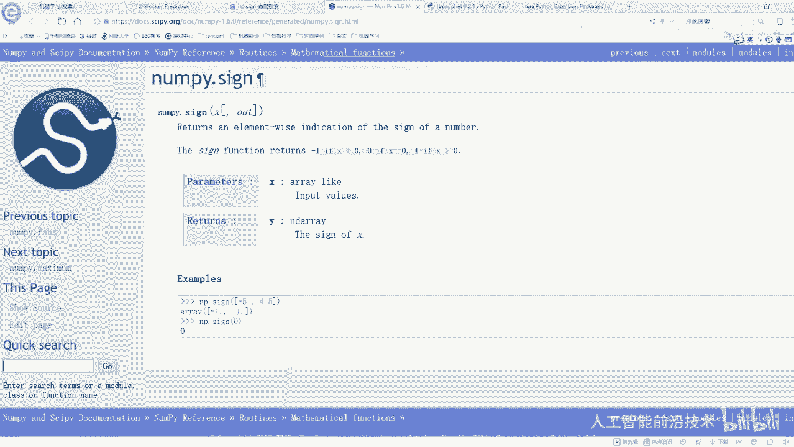

不会了，实际查一下，我也经常查，你说整这么多东西啊，我一天记的东西其实也蛮多的，我能记住吗，大部分情况下都记不住的，记不住怎么办啊，用的时候现查呗，但你也知道这个东西啊，它是怎么一回事。

然后一看呢你就能明白起来，这就是我们得反复去查，因为每天啊你都在忘一些东西的啊，这块我看什么，这块我算了，就是我的一个上升的趋势来说，我预测对了百分之多少，这块预测对了56%吧啊。

这块去又统计了一下上升的趋势，你预测对了多少，这块呢就是在我的一个预测里啊，我看了一下他的一个大于零，然后算了一下他的create值，然后他的一个实际情况，你看这里他是算了他的实际情况吧。

实际情况就是预测的和真实的是不是一样的，如果说他俩是一样的，那你预测对了不是一样，预测错了吧，道理一样的，这里呢就是你这个增幅预测对了多少个，然后这个降幅预测对了百分之多少，你看这56%，这个43%。

这看起来很低是吧，相当于就是50%左右，就是相当于蒙嘛，这个数你蒙大概能蒙对多少，我估计现在来说对于股票，咱现在当前这个模型来说啊，做的其实还不好，还是在蒙，然后test error。

然后算他那个min error值，然后train error算train那个min error值，这些都好算吧，就是一个Y它真实值减y head的值，就是真实值和预测值之间的差异值，然后你可以选。

你可以看这个train的error，还有test error，这两个呢我们都可以去给他指定的，然后呢指定完之后啊，这里我们最终要干什么，最终呢我们要算一个range值吧。

这个range值啊就是我的一个对呃，UPER值和lower值之间的一个，就是中间的一个差异值，最后呢我们再来看最后啊。

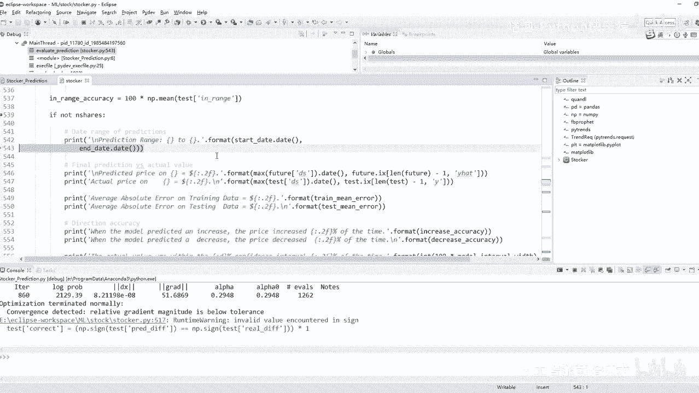

就是我去打印这些指标了，打印这些指标，然后我去画这个图，画这个图比较简单啊，咱直接就是跳到最后了，我去搜一下这个图，这就完事了，那这块呢哎呀这块直接直接干没了，直接干没了，这块没玩下去。

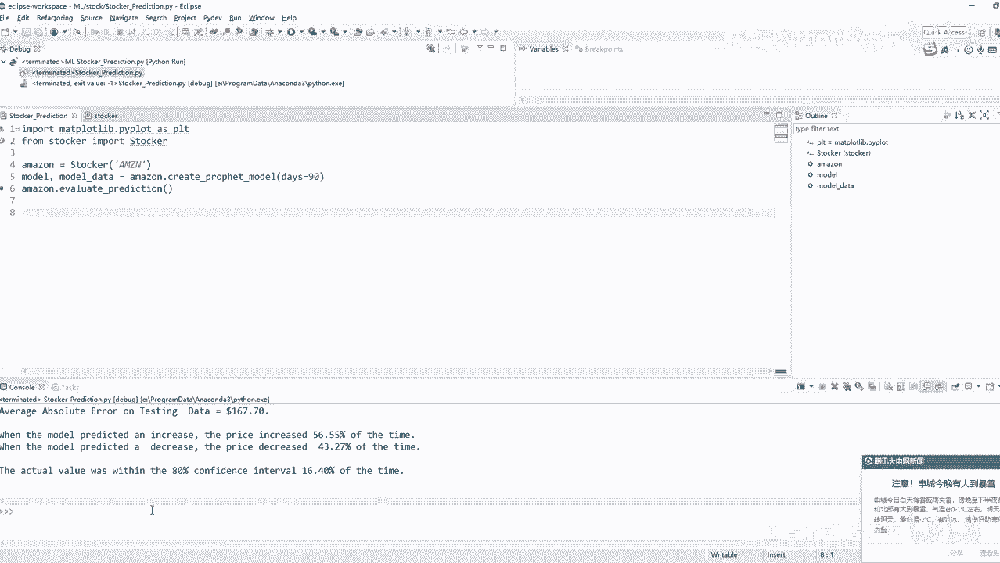

粘代码，这么的吧，咱回来看吧，回来看这个图，你看这块就显示出来结果了，然后再来看一下吧，我预测的是这个从17年1月23，到这个18年1月23预测这么一年啊，然后预测到的1月20号的一个值是800多。

但是这么一天啊，它实际的一个值是1000多的，1200多，所以说就是预测值和认认值之间啊，在咱们当前这个模型上是差异比较大的，咱们来看这里咱平均的一个差异啊。

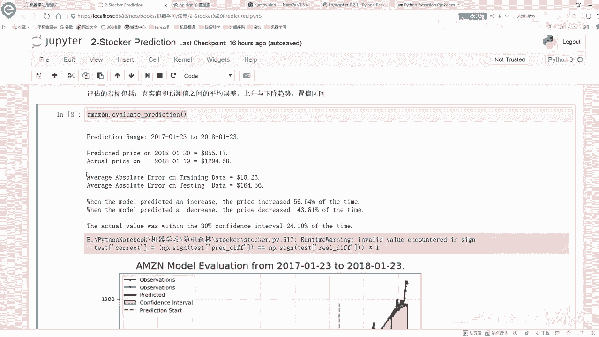

平均的一个差异就是我训练集，它平均的一个差异大概是18块多，然后测试集它平均的差异大概是160多，那看起来这东西啊还是蛮大的是吧，然后呢下面打印刚咱刚刚那个值啊，就是你上升的有多大，有56%预测出来了。

下降的趋势有43。81%预测出来了。

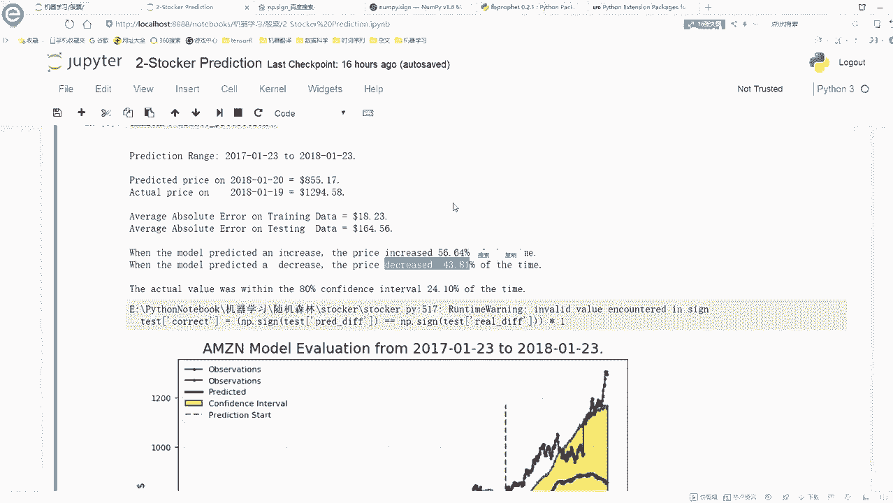

然后呢在我的置定区间上，大概是有20%多的数据，那下面就是我当前这个图，当前这个图啊，红色这条线就是说我从哪开始去预测到，从这个2017年1月份开始，去预测到这条红色线表示这个意思，然后呢再来看吧。

这里有几条线啊，这条蓝色这深蓝色能能看清吧，这深蓝色对于深蓝色的线是我实际的预测值，然后对于这个黑色的是它真实的一个走势，那这里咱们来看现在这个情况啊，来说嗯是一个明显趋势。

什么预测值和真实之间啊差的比较大吧，这差太多了，其实差了好几百了，那这里明显趋势是什么，你看咱这个模型走的，稍微来说是看起来有些平缓是吧，但是上面的实际情况它没那么平缓。

那我们怎么样能够捕捉到这个信息啊，所以说接下来我们的目标就是，现在这个模型不太好，那我该怎么调参，能让这个模型做得更好呢，它能抓到它这个上升的趋势啊，能把这些突变点，能把这些上升下降预测的更准确一些。

这个呢就是我们一会儿要做的一件事。

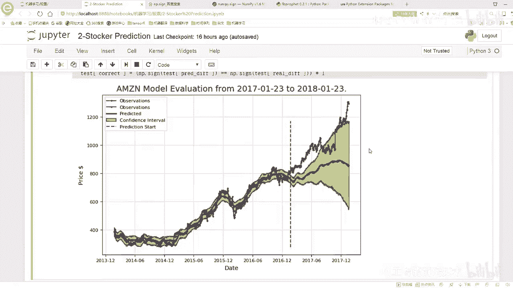

怎么把这个模型啊进行一个调整啊。

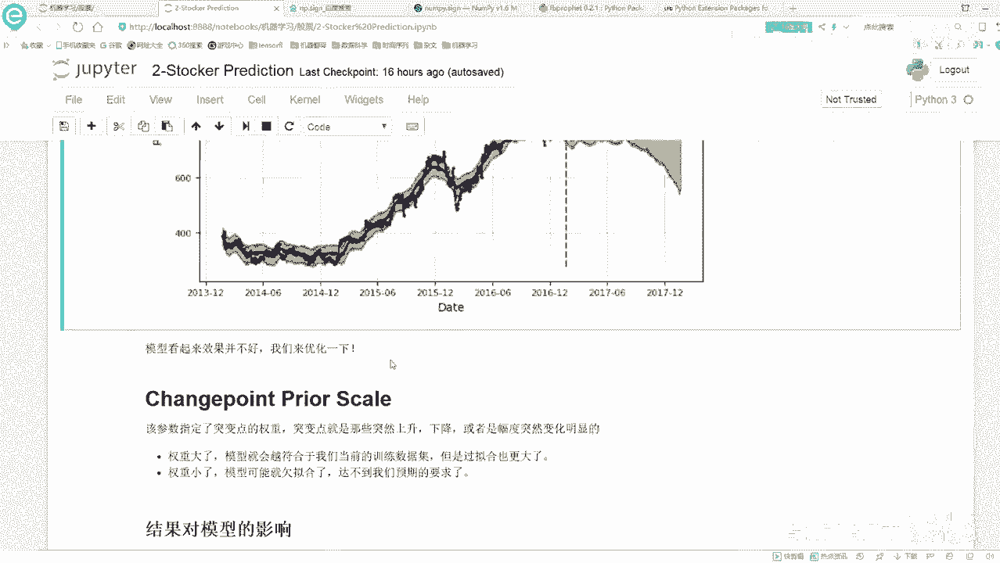