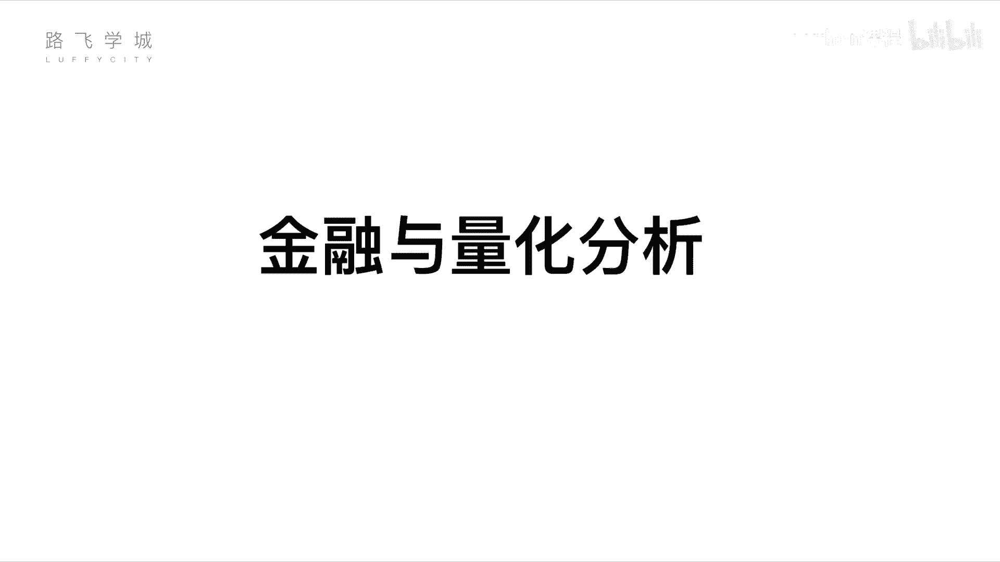
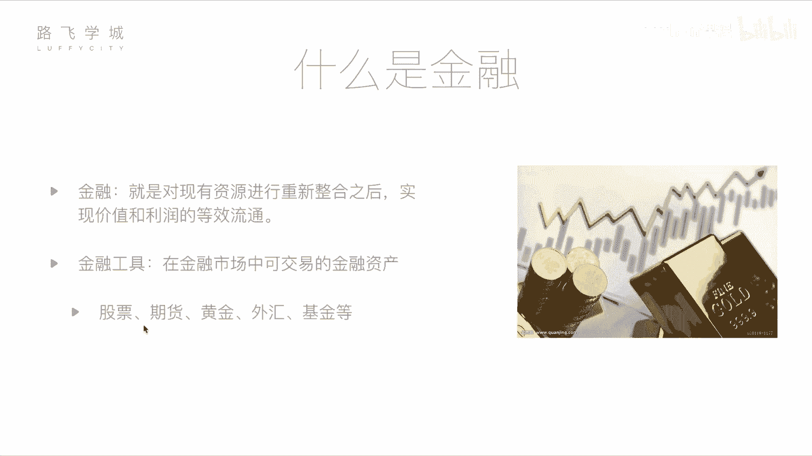

# Python金融量化+股票交易，清华计算机博士讲解，入门到金融实战！ - P2：01 金融量化分析-基本金融知识介绍 - python课程 - BV1CNUHYfEJE

O同志们大家好，我是路飞学生的讲师al里斯这位是我们路飞学生的讲师天宇同学啊，天宇呢是清华大学的计算机系的博士啊，博士博士后他是我的师例，我是安保系的啊。

他是计算机系的那今天呢给大家讲这个金融量化与数据分析啊，就跟金融相当于计算机当计算机跟金融结合起来之后会产生什么样的活化，好不好？那呃先说一下啊。

这个在计算机在金融领域那做呃这个呃就相当于做量化相关的嗯自动化交易相关的。其实用python程序写的比较多，是不是啊？对啊。

那所以呢今天我们所有的课程都是基于pyon相关O现在呢我们就直接开始O那接下来由我给大家讲一下这个金融量化和数据分析相关的课程啊，那我们开设这个模块，主要是。

对于两部分人群吧啊第一部分就是对于那些有一些金融基础啊，或者说正在炒股的一些股民们。那他们可能会想，哎现在这个人工智能啊，包括什么计算机啊、互联网加这些东西都这么发达，大数据等等等等。

那有没有可以是不是可以通过计算机编程的行为来自动化的进种炒股。那我可以告诉大他是有的那这个东西就是我们接下来要讲的，叫做量化投资，怎么炒怎么能。谁跟你说。不要听他胡说啊。啊。

第二部分呢是针对那些有一定编程经验，学过我们python一些基础模基础模块基础知识的一些同学。但是他不懂金融。对，但是他可能想哎，金融这么赚钱，那我不如去炒一条股，嗯，对不对？

那但是他又想把自己的这种相当于不要盲目的去炒股。对你要想把自己的这种呃这个专业技能利用起来，我会编程，但是我不懂金融。对，那如果两个结合起来，是不是就是可以自动化炒股了，对，对吧？好。

那我们接下来讲我们这个模块的第一部分就是金融域量化分析啊。那这一部分主要是介绍一些金融，包括股票这一些基础知识，还有给大家讲解一下什么是量化分析。也就是怎么样通过计算机编程的方式来帮我们筹股。

好，首先。我们来看一下什么是金融。那定义上来说，金融就是对现有资源进行重新整合之后，实现价值和利润的等效流通。这个概念看起来可能非常抽象。嗯但是大家应该都知道，金融这个行业就是花钱，对不对？

就是啊我通过一种某些手段让我不用干活，我可能最后就多了钱，也可能少了钱，对不对？这是大家生活中的一些理解，那其实我们说金融这个行业并非也不完全向大家说的就是一种投机性为啊。

就是说我你不赚你不干不干活也能赚钱，不劳而获，不是那样的啊，其实金融这个行业对于国家，包括对于其实各种个人来说都是个好的，我举个例子，比如说我是一个千万富翁啊，当然我不是啊。

那他是一个你你不是比如说我我我我我我是一为千万富翁啊，我有钱，但是我这个钱不知道该怎么用，对不对？放在银行里存账，放在银行的一P太少了，我想再多点，我想变成亿万户翁对啊，那但你又不想干活。

对那我怎么办啊，我也没有什么钱生钱，对我也没有什么好点。我也没有开公司的什么办法，那我怎么办钱是钱，但是他他是一个特别有想法的人啊，他最近创业了，搞了一个什么搬砖公司，安保公司呃，安保公司保都行啊。

这个创业非常好啊，我觉得他这个点子非常好，他的公司下来一定的大卖。好，那我怎么办呢？我把钱投给他。嗯，他是一个创业公司公司的老板，他肯定需要钱啊，Yes他需要钱，那我的钱没有地方用去，我把钱通过金融。

😊，融给他。嗯，那他比如说过了5年十0年之后，他这个公司上市发展起来了，上市了，有钱了。对他之前就相当于翻了50倍。对，那我们来看我10年前的这一次，我把钱给他的这一次金融行为发生到啥。首先他得到了钱。

他的把公司做大对他公司做大了，那我的话我把钱给他了，我你钱生钱，我自己肯定从他那得到了一些回报啊，我们先不讨论这个金融过程具体是怎么来的，我肯定他给给我回报，那我自己的钱肯定多了。那其实这是一种双赢响。

y相当于这样就刺激了这个整个经济的发展，整个经的让钱去到I要他的地方，对对。好，那其实这就是金融啊，那我们平常来说更讨讨论的更多的是一些金融工具啊，也就是在金融市场中可交易的金融资产。

那金融工具这个名词大家可能不熟悉。但是下面这几组词大家可能会熟悉一点。对啊。股票期货、黄金、外汇和基金这啊，相当于刚才他通过刚才说他通过某种手段把钱融，就是融给我，不能白给我，肯定通过某些手段。

这些手段你就可以理解为些金融工具概念。其实刚才我把钱融给他的这个过程，可以理解是股票啊，我通过买他们公司的股票，股票这个概念是咱们接下来这门课程讲的核心概念，我在这里先跳过。那我简单先说一下后边这几个。

这几个金融工具是什么意思？期货。

这个金融工具来说，它相对于股票首先说结论，它相对于股票风险很大，同时收益很大。就是说你要么赚的那个盆满钵满，要么赔的生物分样。对，那具体来说期货是一个什么呢？期货相当于它这个名词相当于现货这个名词。

现货是什么？比如说就是大件的商品，比如说煤炭啊，煤炭有一个市场波动。今天是10块钱，明天是11块钱，后天是20块钱啊，举个例子。那你今天这个你比如说你20块钱的时候买的买了一个煤买的煤。

然后你是等到10块钱卖出去了，嗯，你就赔钱了，也赔这叫做炒现货。对对，如果你10块钱买进去，20块钱卖出你就赚了。这叫炒现货。那期货是什么呢？期货比如说啊我是一个这个呃发电厂公司的老板啊，我需要煤。嗯。

但是这个煤个煤炭的价格会变走。那我判断接下来半年之后，这个煤炭的价格从10块钱会涨到50块钱。嗯，但是我如果到半年之后，用50块钱的钱价格来买煤的话，我的成本会提高，我的利润会变少。那我不想这样对对。

那我怎么样呢？假如说它是一个卖煤的哎你看煤老板对，从搬砖变成安保变成卖煤的了啊，他是一个卖煤的那他觉得接下来半年煤炭的价格会跌，会从10块钱跌到5块钱。那他怎么办？他想半年之后卖出去。

他如果半年之后5块钱价格卖出去，我就我就按10块钱的还不如回去赚，那这是他的风险，对，对不对？是煤炭会跌的风险。对我来说是煤炭会涨的风险。好，那他的判断跟我的判断不一致啊，我碰到他了。

正好我们俩一拍即合立了一份合同。什么合同呢？就是半年以后，我以现在煤炭10块钱的价格向他买，比如说买5000吨。对，好，那在他在他来看，接下来半年半年之后煤炭价格会跌到5块。对，那10块钱的价格买入。

他每吨价格就能赚5块钱。对他的说是赚的那对我来说，半年之后的价格，我预计会涨涨到20或者涨到50。那涨的话，我以10块钱的价格买入，相当于说我是赚。

那这就是相当于是两个人对未来这个货的价格走向趋势判断不同也导致的。这个产生了一份期货合约。对就是期货合约，也就是。最终到半年之后，如果是相当于不是10块钱涨到15，我我我其实是呃相当于怎么讲，你赔了。

我赔了。对，因为我少挣了5块钱。对，因为我还要按10块钱卖给你，对，对不对？啊对，但是如果说到了半年之后，它真的跌到了5块钱，嗯，那你就赔了。对我就你明明可以从市场上从其他价花5块钱，其他没看场。

花5块钱买煤。但是因为我俩的合约在，你必须10块钱买过了。对，就是这个意思。嗯，O所以其实为了双方规避风险。嗯，对，大概就是这么一个。其实期货的这个具体它的高赔率还原因还有一点复杂。

它涉及到一些保证金之类的东西啊，我们这不展开了，我都展开了，感兴趣的同学可以查阅相关资料。好，黄金这个东西相对于股票来说，它的价格比较稳定啊，就是是一种你需要保值的时候的一种投资的选择。啊，因为什么呢？

我们说这个这要讲到马克思主义经济哲学了。嗯啊，黄金是自古以来的，我们叫货币啊，硬通货。那其实我们现在发行的是人民币啊，美元也好，这个东西在经济上它的这个纸币对吧，不是一般啊，实际上之前的是这个黄金啊。

因为它就是地球上存货就那么多。啊你没法，你想要多要没有对那黄金来说。它的价格的波动啊，就是黄金，你看今天可能我也不太清楚啊，可能200块钱，明天可能250。后天可能300。然后过两天可能跌250。

大家没有这么多啊，只是举个例子，波动不会这么大的，它的波动不是特别大，对，除非出现挖出来一个特别超级大的金矿，对它的价值的波动肯定易对第一金子的这个发掘啊，你你挖出来一个大金矿了，整个市场上金子变多了。

你肯定就下格就要下跌对不对？那如果整个什么市场上钱多了，对那金价就要上涨对，因为你钱多了嘛，钱多了，金子都想买金子嘛，但是金子就那点嘛，谁都想要金子嘛？就简单例子来说，这些钱和这些金子涨价的对。

金子多了，它就贬值，金子就不值钱了，钱多了，金子就值钱。就是这个意思啊，那这个外汇来讲啊，外汇是什么呢？就是我们中国啊人民币和美元不是有汇率嘛？一美元等于现在可能是5点几人民币6点。六点几吧。

我可能是几年前了嗯六点几人民币啊，那这个汇率比如说6。3这个。1亿美元等于6。3人民币，这个汇率是会波动。对那今天的汇率可能跟每天的汇率不一样。啊，那某些这个金融公司或者投资机构，他们就抓住这一点啊。

来什么呢？来通过两种币种之间进行外汇的一个操作来赚钱来。对，那补一个补充一个说汇率为什么会波动呢啊，那你这个东西其实就是美国也在不断的印钱，中国也在不断的印钱，是不是啊？啊。

并且中国的经济也是在不断的发展，那相当于比如说中国经济如果中国政府，比如说5年内不印不印钱，但是中国的经济5年每年增长10%，5年就发展了很多。对，所以那就意味着什么呢？我们的钱会变得更。

因为钱就是5年内没有分发嘛，对吧？但是我的经济变好了，所以创造的更大代价值。对，那就钱又只是那些，所以那就相当于1块钱能买个东西。的购买力大购买力就大了，之前一块钱只能买一个包子。

现在1块钱可能能能买那个价个包子两包购买一分达，但是相当于这个时候中国的货物要运到美国去，那你就要结算的时候要用对这个要要要什么？比如说我我这个东西在中国值这些钱，那到底美国算是多少钱。

这就跟汇币汇汇率了，对对对吧？这个东西大的投资公大的金融公司会玩这个东西，小小小散户玩没有一般个人投资者不会，因为它的波动太小了。对不会去做外汇对吧？啊，你波动这个一分钱你投10万进去。

对吧挣10块钱没什么意义。对，好吧，OK好，那基金啊这个东西是基金公司的一种产物。那举个例子啊，比如说你个人想去买股票，想去买期货，想去买各种各样的这个金融产品，但是你不懂。

但是嗯整个市场上就是他有懂的人啊。比如说我是个基金公司，我这有10个这个呃基基金经理，那他们都懂都懂这些金融东西。他们有一些就是我做了10年了，做了20年的了，我这个什么给公司赚过几百万几千万啊。

我也有懂这些东西，那个人我不懂那我怎么办，我把钱交给你这个基金公司的这个基金经理，你帮我你帮我去投资啊，你帮我去炒。

然后赚钱给我给我点给我点你也我也那这个基金公司他本身会吸纳各种就是投给你这个基金的用户的钱。对那你自己就有比如说每个人投给你10万块钱，来1万块钱。

你就有对那这基金经理用他自己的某种策略他看哎我是最近炒股票，还是炒期货还是炒黄金好，他自己判断他各种各样的都可能都炒一点，然后最后可能里边有赔的，有赚的。那最后可能如果他经验真是那么丰富的话。

他可能会赚一点对吧？那他赚的这一点，哎，自己留下一点，公司留下一点然。其他的钱分给你的某些这个散户散户们。对你的投资者们。好，那这就是个人。就说我个人给基金公司的这个钱就叫做这个基金的金融工具。好啊。

这个就是常用的几个金融工具。对在。所以基金的这个它的投资率其实呃它的回报就是它的这个风险比股票小。当然收益也比股票小。对对。好。

那接下来咱们重点讲一下这个金融这几个金融工具里边最常见的一种叫做股票股票O。