# Python金融量化+股票交易，计算机博士讲解！入门到精通！绝对是全B站把python金融分析与量化交易讲的最透彻的教程了！ - P2：2.2.1-fbprophet股价预测任务概述(Av275101736,P2) - AI人工智能俱乐部 - BV1kGHae6E3G

今天啊咱们来给大家唠的主题叫做股价分析与预测。那先说一下什么叫做一个股价吧。无非啊就是一个股票。今天这个价，明天那个价，然后今天涨了还是跌了这个意思。那你说这个股票像什么，它是不是说它是有日期的。

还有一个数据啊。所以说我们说是股价的分析预测，实际上啊我们就要做一个时间序列的一个预测任务。那这里呢当咱们想要时间序列啊，咱们之前讲过有一个东西啊叫做模型那个模型啊可能稍微难度些大。

用起来呢没有那么方便。这回啊给大家来说这样一个facebook开源的一个时间序列啊，预测的一个神器。在这里呢我们先来看一下吧，就是。😊。

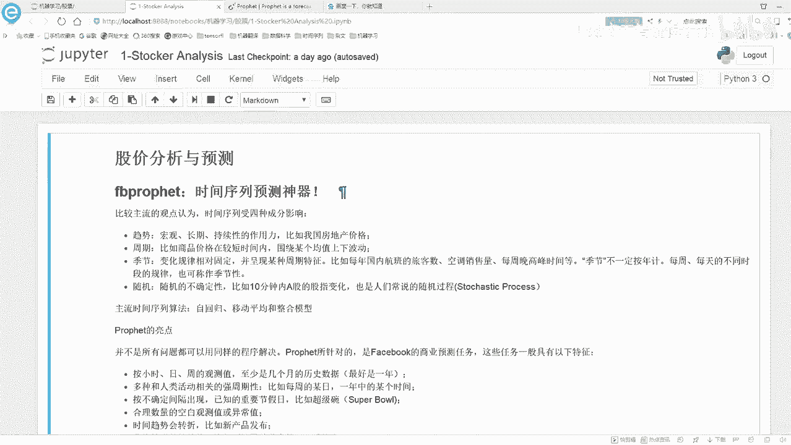

这里啊我打开了facebook啊，它的这个呃它的这个就是时间序列啊，预测这个框架，它的一个官方网站。这么的，我把这个网站给它复制过来，我给它复制到这里。😊。

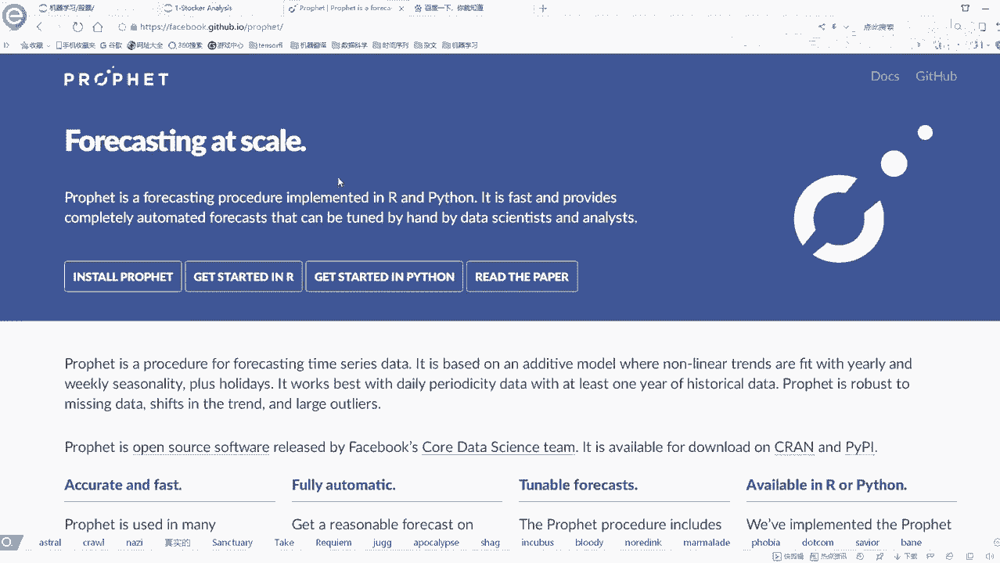

这样呢到时候大家就是可以啊直接的去访问这个东西了。然后这个就是它的一个主页啊。这个主页当中呃，我建议大家先是整体的了解一下吧。我先给大家来介绍一下这个东西吧。这个就是时间序列。呃。

咱们先说时间序列啊都受什么成分影响。首先呢一个序列，你要它是能可分析可预测的，它首先啊就是得有一个趋势吧。有了一个宏观长期还有持续性这些作用。比如说时间序列有好多种东西啊，都可以说是跟时间跟序列相关的。

比如说随着时间的推移，咱的一个房地产价格，还有什么相关，还有跟周期相关。比如说这个时间它就是这个时间序列啊，它呈现出来了一种周期的趋势，围绕着一个周期进行上下的一个波动。😊，还有什么？

还有季节性的因素吧。在春夏秋冬啊，它的一个季节性的因素都会对结果产生影响吧。比如说啊咱们国内的航班的一个旅客、空调销售量，每晚的一个高峰时间等，这些啊都是不一样的所以说呢我们还可以按照一个季节。

把咱们时间序列啊进行一个分析。还有什么还有一些随机性的因素。比如说嗯这个东西就是不太确定了，有一个随机的一个过程。还有什么呢？比如说我们的一个节假日，还有我们的一个一个什么什么突发的一个事件。

这些啊都是可能对我们时间序列造成一个影响的那这里呢我们选择facebook啊，它的一个时间序列预测的框架，主要原因在于这里啊，它是肯定是有一些亮点的吧。没有亮点啊，我们也不用这个东西去做。那最大点什么？

我觉着啊就是最大亮点就是嗯当咱们想构建一个模型的时候，这个模型啊对咱们来说是不是应该封装的更好，咱们使用的更方便。那我才觉得这个都有好用啊。那这个框架它最大一个亮点就是用起来非常方便。😊。

用起来呢也是比较简简单的，我们只需要调节简单的几个参数，把我的模型就可以非常轻松的给它挂出来。这个啊就是我的一个facebook啊，给我们开源的一个框架。😊，然后呢，它呀还有这样的一些特征。

就是接下来我们再进行预测的时候，我可以按小时按天，然后按周甚至按月我都可以进行一个预测。也就是说我们要预测的指标啊，我们都可以自己来设计，然后呢，在这里啊，我们还可以就是去衡量咱们的一个周期性。

比如说按照季节的按照年的这些周期性，我们都可以考虑进去，还可以添加什么，还可以添加一个节假日，对我时间序列的影响的。😊，以及呢还有什么还有一些异常值缺失值啊，它都会帮我们自动啊进行一个处理的。

以及还有什么时间的一个转折趋势。之后啊，会给大家就是介绍一下，在这里啊我们的一个非常重要参数，就是时间的一个转折点。那什么叫时间转折点啊？比如说这个序列哎今天突然升的非常高。那是不是一转折啊。

明天要突然降下来了，这些点呢都是转折点，我让我这个模型啊记住了历史数据当中哪些出现了一些转折点，这些转折点啊，它是不是能更好的去拟合我当前的训练数据啊，这个就是转折点对我数据的一个作用。

但是呢咱们得想这样一个问题。😊，这个转折点啊，对我训练数据来说，哎，我能拟合的更好。但是呢对我的测试数据来说啊，是不是容易过拟合啊？因为转折点啊都是凸上凸下的。

这样呢就是非常它就是非常强烈的去捕捉了原始你数据集当中的这样的一个趋势。那这个趋势一定是在测试集当中呈现的吗？这个还不好说吧，咱们之后啊回来探讨了一下，就是这个转折点啊。

它是我当才这个框架当中啊最主要的一个要调节的参数了。这亮点呢都跟大家简单的概述了一下。然后呢，我们现在用的这个算法主要什么？😊，基本上啊就是这三个的结合。

一个呢就是实间序列啊预测的一个最主要算什么自回归模型吧，要基于自己的前一段时间的数据预测接来数据吧。所以说啊时间序列它是一个自回归的模型，还有什么还有移动平均，还有咱们的一个整合模型吧。

这些啊跟手模型啊都是差不多的。只不过说呢深度就是facebook啊，它这个框架给我们封装的更好。我们用起来呢是更舒服一些的。在这里啊这个就是我的啊不是我的就是这个facebook啊。

它这个时间序列预测框架的一个主页。在在这里啊推荐大家来自己简单的阅读一下。如果说你以后啊想从事啊，不是草熟是吧，想去做一个跟时间序列相关任务，咱们可以想到这样个框架，这个框架从现在来说啊。

我觉得用的还是蛮方便的，就是给我自己的感觉啊，因为我也自己用一段时间，我是觉得这个东西啊用起来确实比其他框架都方便，因为简单，比我来说我不需要太多的功能啊，前期来说越简单还是越好的。😊。

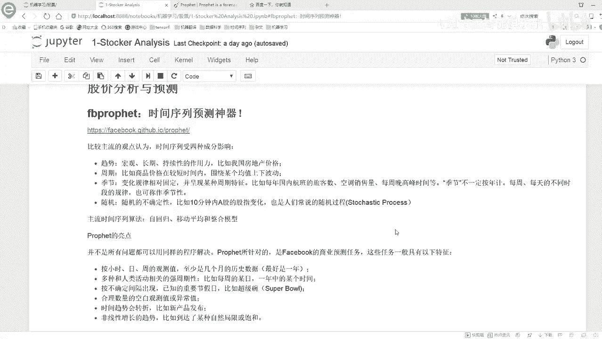

然后呢，它有两个接口啊，一个就是说你可以用R来去做用来R就是去做这个框架。你也可以用pyython做这个框架。也就是它有两个接口，反正我估计大家应该都用pyython吧。

咱们就点啊就是啊get start inpython，咱们点进去这里呢它会有这样的一个教程啊。这个教程哦，这个这个这个这个太儿蓝月啊给我看快看疯了，天天在这砍。😊。

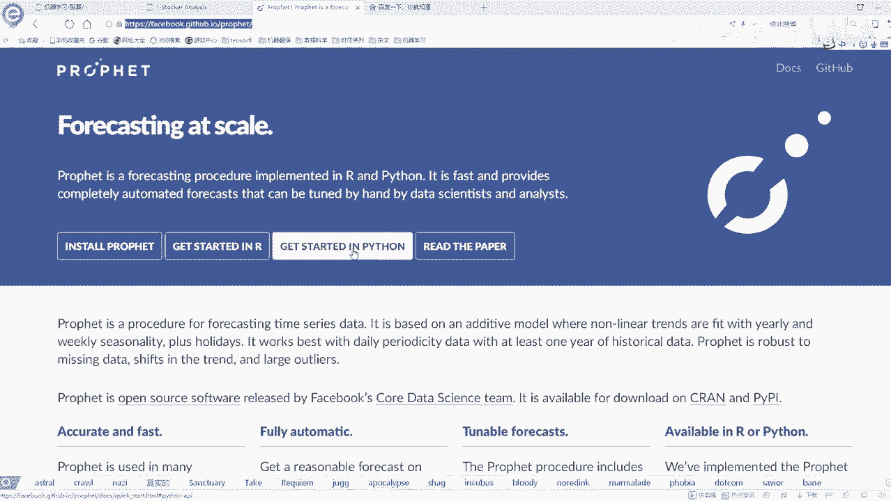

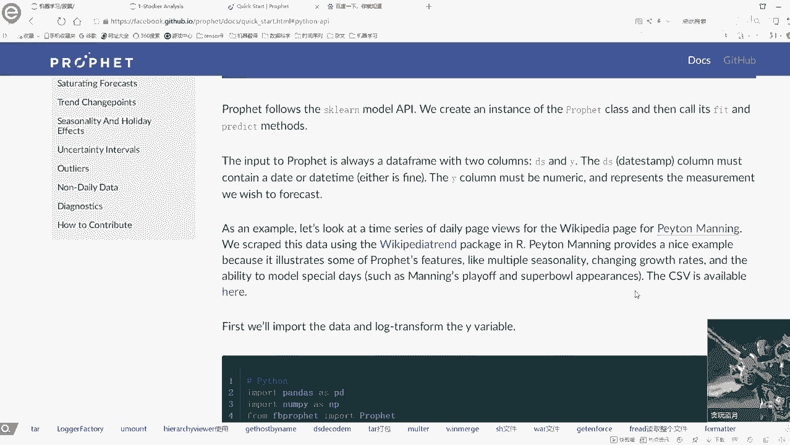

他这个教程当中啊，就是告诉你怎么样用python一步一步去做这个东西。我建议大家啊就是嗯这里面文档其实没有那么多啊，大家只需要花个很短时间就能阅读完。建议大家啊先自己的阅读一下。到时候呢我也会给大家讲。

就是这个框架我该怎么去用一个基本使用流程啊，就是在这里他要跟你说，你要先把数据啊，主要说这种格式，一个什么啊有时间，还有我预测的一个指标啊，这是一个标准形式，1个DS代表着我的一个时间序列。

一个Y代表着我要预测的一个指标，这是我输入数据啊，一个基本的格式。😊。

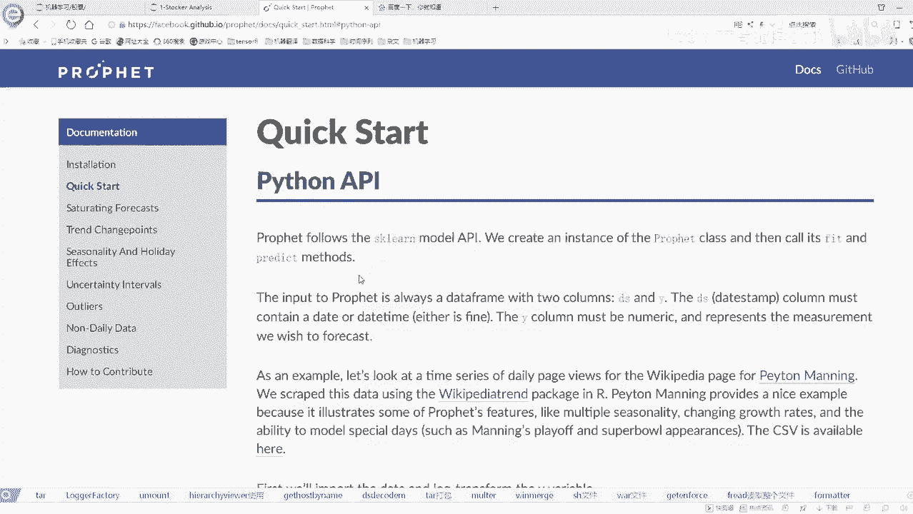

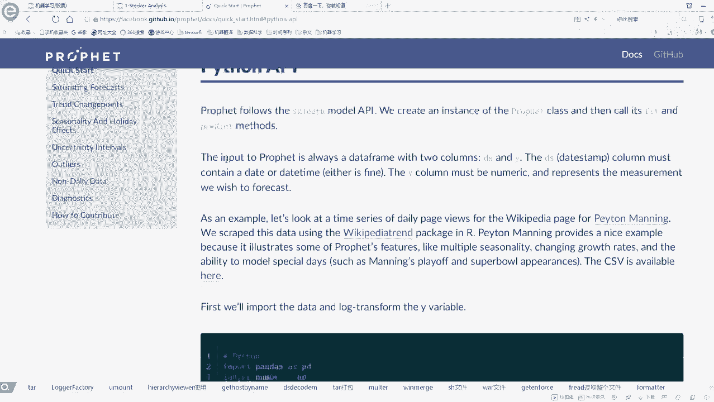

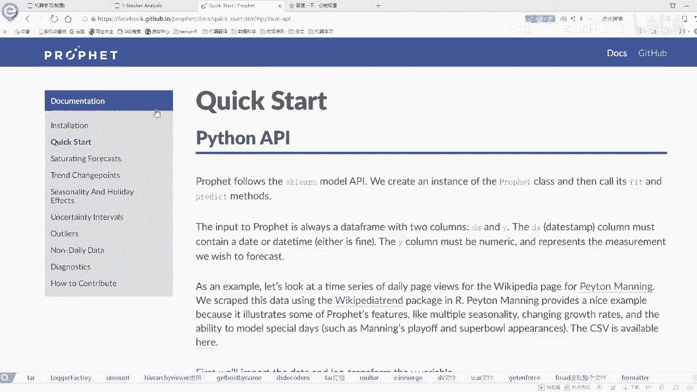

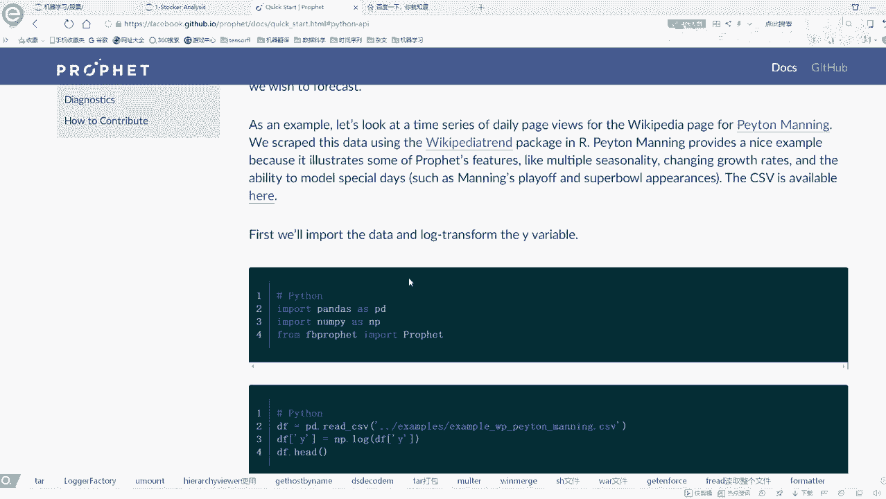

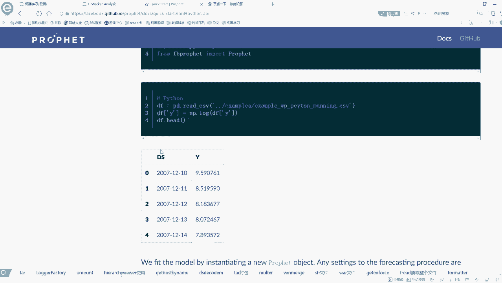

然后呢你看它的构造模型怎么构造啊，跟那个SK learn是差不多的。你看最上面也说了，它是跟SK learn model的 APII是差不多的。然后呢，在这里就是我们构造模型其实很简单。

直接把这个模型啊实例画出来就可以了。然后点fi一下呢，这就是进行一个训练了。然后这块有一个函数叫做make feature，然后它的意思就是说把我要去预测的整个的一个。😊。

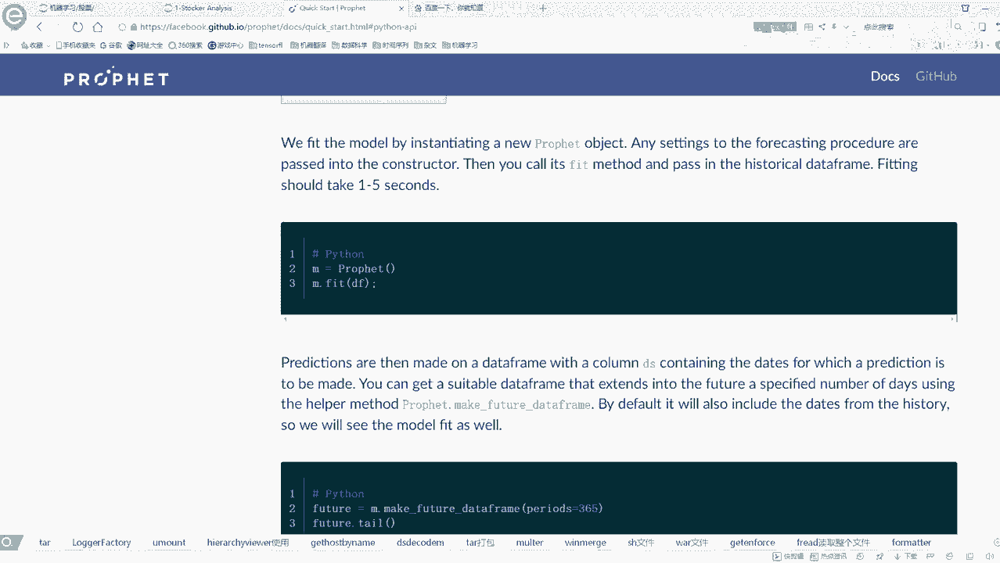

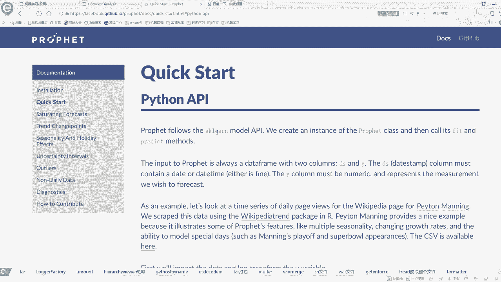

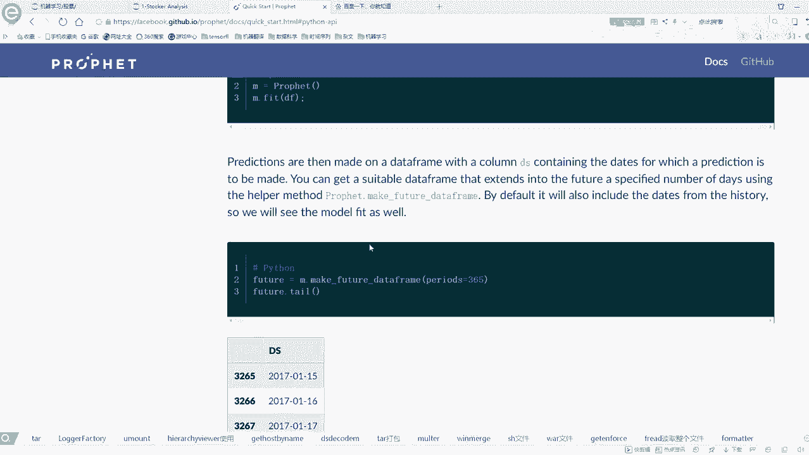

时间片段都给拿到手，这个意思。然后呢，后面我们就可以进行一个实际预测了。预测完之后啊，就可以显示出来它的结果。预测结果它用Y hat来进行表示。然后呢，在它的这据圈间上。

它有Y hat lower和Y hat upper，就是我的一个下限和我的一个上限。这就是我预测完之后的一个结果。那这里啊就是。

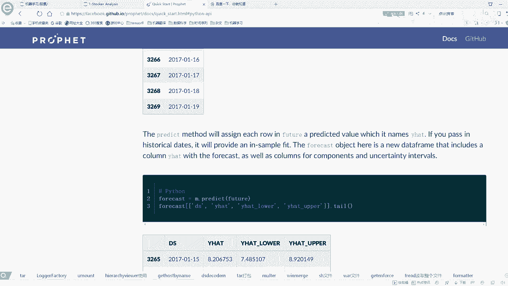

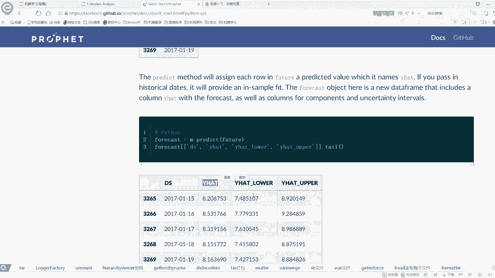

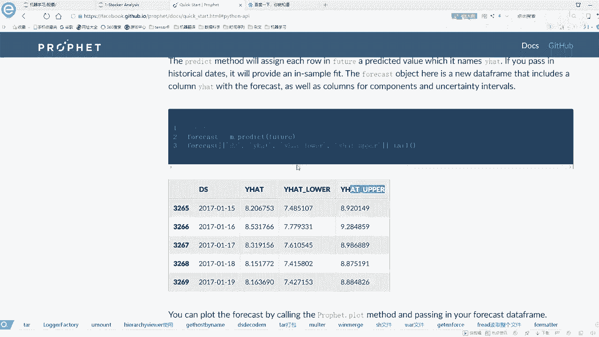

这个实验预测预测实践预测，它这个框架还有一个优点，就是它给我们提供了很多的可视化的功能。我们可以很简单啊，就是可把我当前可视化的一个结果给它展示出来。你看这里就是画了一下我当前预测的一个结果吧。😊。

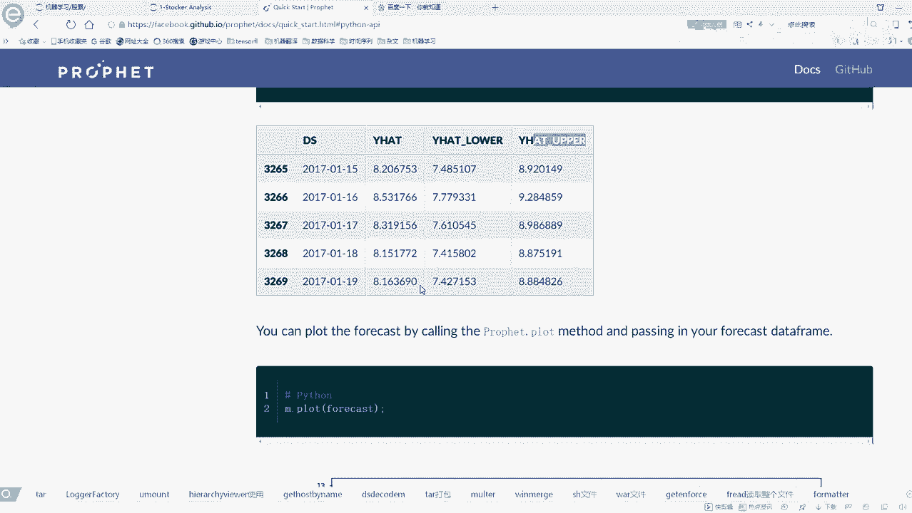

下面呢又画了一下，就是对我结果产生影响的一个因素。我的一个年份的一个年就是这一年它的一个趋势。然后呢，就是你看整体从08年到17年，它整体的一个趋势是什么样子。然后下面呢就是在一年当中啊。

按照不同月份它的一个趋势，按照周它的一个趋势。这个里呢它有thon的API还有R的API这里啊，反正我也不给大家详细介绍了，咱们一会儿还会去给大家举这样的一个例子，大家看看的时候。

就可以围绕着它这个公文档啊，我们自己先从头到尾去看一遍，但是可能有个问题啊，就是哎这块今天点没什么问题是吧？你看这块点有些问题。

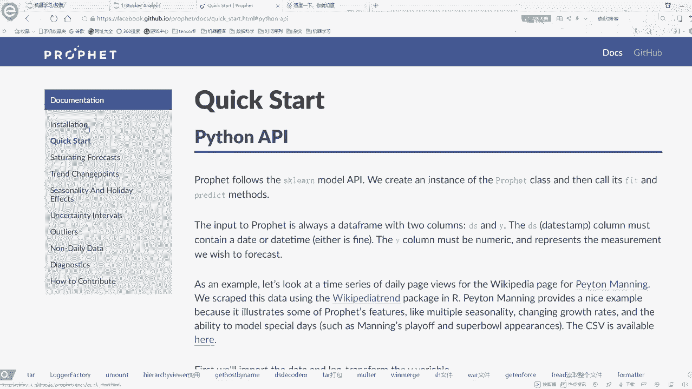

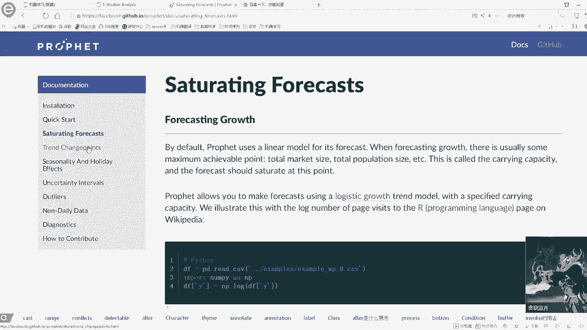

有一些文有一些文档，他点的时候，它会找不到这样的一个就是界面。这里就是说推荐大家啊就是看这些国外文档的时候啊，咱们最好还是能翻墙，咱们就翻墙。因为很多东西啊，国内是没办法访问的。

尤其是国外的这个什么facebook啊，谷歌出品的东西啊，有很多都是没办法进行访问的。咱们最好呢还是能够翻墙去看这些文档啊，先找先找握一下，咱们当前也给大家说的这个实践预测的一个神器啊。

它是做了一件什么事儿。然后啊接下来咱们就来看一下我们的一个任务啊，还有我们的一个数据，它是长什么样子。这里呢咱们也说了，就是我们今天要做的是一个股价的分析，还有预测。

所以说啊我们拿到数据肯定是一个股票的一个数据集。在这里啊就是呃我们需要去给大家在就是大家在运行我们这个demo的时候啊，需要去先安装几个工具啊。第一个工具就是我们要去获取的一个数据集啊。

这个是就是我们要获取股票数据啊，通过这这里还有一点，就是说大家在执行的时候啊，必须得连连上网啊，连上网才能去执行这个东西。然后第一个呢要做的就是。😊，我们要去获取这个数据集啊，先把我的数据拿到手。

所以说呢我们用这个工具啊，这个工具它就是可以帮我们去获取一些数据集，只需要我们把一个要获取的东西啊传给它就好了。所以说呢这里需要PIPstore先让大家装这个东西。第二呢就是我们时间预测的这个框架。

也需要大家先去装一下。那这里啊就是呃你看我这一写啊，就是IP store装这个东西，大家先这么运行啊，就是你在你的这个proate里边，你先去打PIPstore，然后看能不能就是执行这个东西。

然后再再再给大家讲一下，就是这些库啊该怎么安装。然后如果说你这个PIP store没有去安装上怎么办呢？在这里啊咱搜这样一个东西，就是一个。😊。

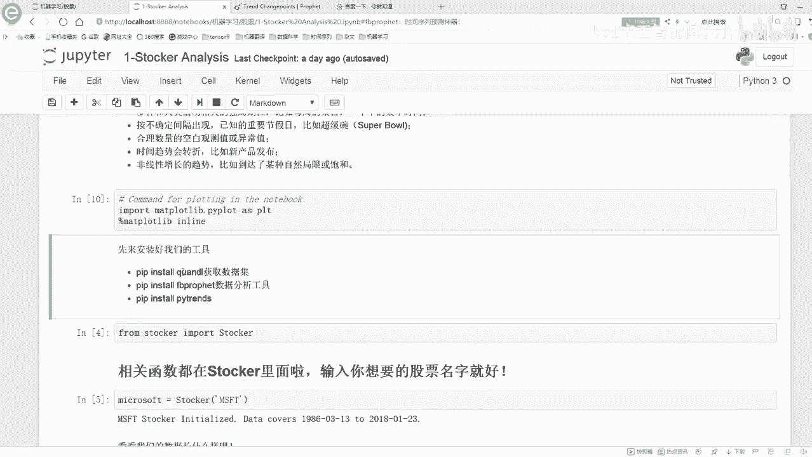

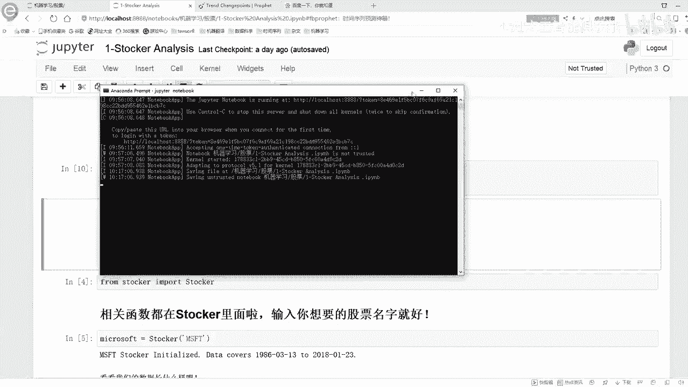

pythonwindows包啊，一般情况下就在这里，我看一下啊，就是呃应该是这个是吧？一般情况下我们都可以找到。然后呢，比如说这个这个东西我看一下这个东西啊，你ctrl加C，然后到时候crl加F。

但是呢你发现没有找到这里啊就是我到时将跟大家说的算方法。然这里我们先下一个点WHR文件，然后去PIPstore这个点WHR文件吧，这是咱以前安包怎么安那这里你说你这个东西啊没有搜到，没有搜到怎么办啊。

也没有搜到也没关系啊。咱在百度啊，今着搜这个东西，然后你打开这个这个东西。😊，这里啊这个网址我也给大家复制过来吧。这个网址我看一下，我给它复制到这里吧。就是你进到这个网站。

这个网站就是我们用源码安装也可以。然后你去 downloadload一下。你点下这个东西啊， downloadload完之后，然后你就去去下载，下载完之后呢，然后你就给它打开，打开完之后啊。

然后给它解压到一个地方，你看这里啊有个什么有一个set up点PY吧，有一个set up up点PY啊，就是你你就是把这个东西啊放哪之后，反正你这个pyth环境变量，你不已经配了吗。

然后你到就是你下载到的一个位置之后，你去执行这样一个命令，就是这个python。😊，Sit up。set up点PY然后呢再打一个instore打这样一个指令啊，它就会也是帮你进行安装啊。

安装好之后都一样的。但是这点就是说你得需要再把那个把那个自动配置，这个我们环境变量也配完了，应该直接就能用了，直接执行这样一个命令，我们就可以去安装这个工具了。反正我给大家推荐的一个基本思路啊。

就是你今天先用PIPstore去装，然后PIPstore如果说你装不了，然后你到这里这个我也给大家复制过来吧，这个就估计之后啊，大家也能去。😊，🎼也能去经常会用到的。然后看这个这个他能搜到吧。

这个东西我直接PIP3给装上了，我装都是没什么问题的，这个也没有是吧？这个就是说我给大家先呃在这块这块咱不写这儿了。我不写这了，这个反正就简单啊，你要去用的时候。

你就是百度你搜一下python windows包，然后你就点开这个界面就可以了。然后呢装这个库的时候，因为这个库我去用那个PIPstore，它没有装上。然后我只能去下载它这个Y。

然后执行这个 set store这样进行一个安装，这样是装法是没有什么问题的。这样呢我们先把这三个工具啊，给它装好，装好之后呢，等一会用的时候啊，再给大家详细的去介绍每个工具啊，咱们都是怎么去用的。😊。

然后这里啊就是画图这个东西啊，这个就不用说了，把画图这个包导进来。然后呢我们就是所有的核心代码都放在这里了。就是在这里我们看有这样的一个函数，这个函数啊就是它会帮我们去做很多的功能。

还有我们实现的一个功能，实现的函数都在这里在这个当中啊，会给大家演示它的一个完整流程都是长什么样子。然后呢我们具体的一个代码细节啊，我会给大家通过这个给大家来进行演示。因为里边它有bug这功能吧。

我们可以实际的进到这个函数当中啊，一步一步的去看它做了一些什么事，这些核心东西啊我都封装到这里了。反正一会儿大家用的时候，这里边大部分都是一些可视化的一个操作，还有咱们这个构建模型的一个操作。

这些呢都放在这个里都放在一个class里边了。以说一会儿啊咱们就是这样演示流程，然后看结果然后在给大家实bug们看一下它的代码是怎么样帮咱们去完成这样一个事的。😊。

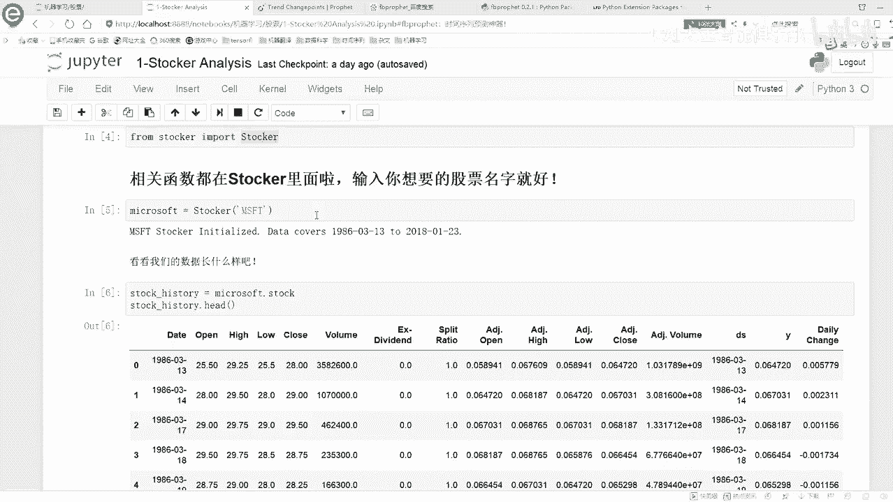