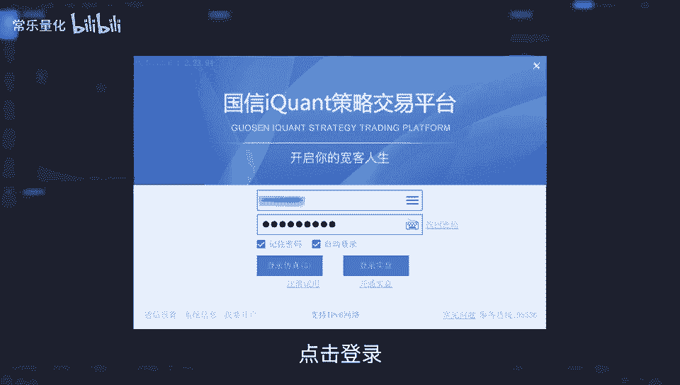
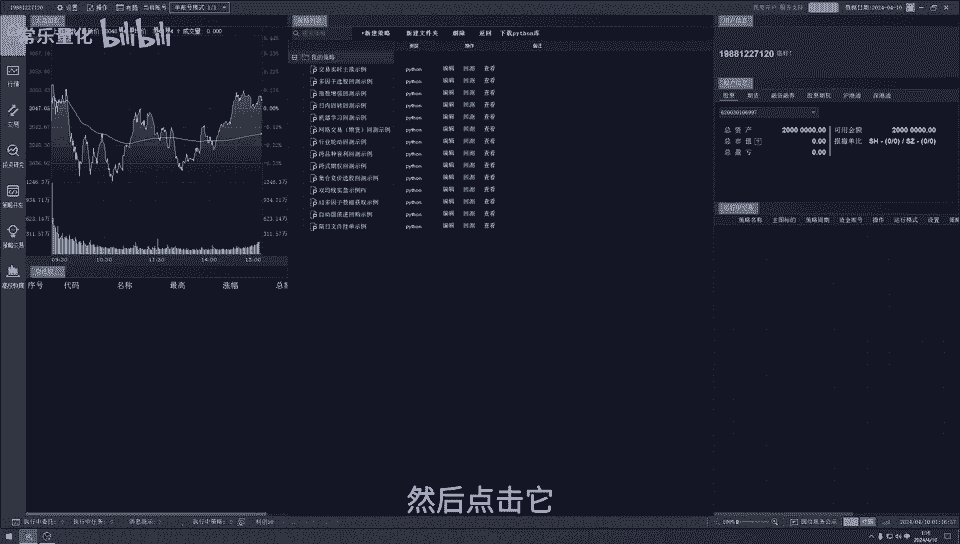
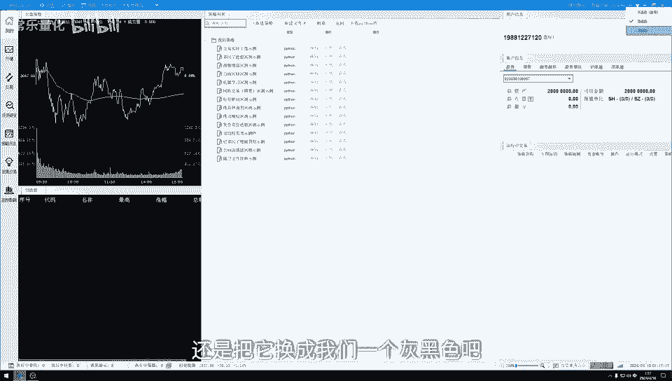
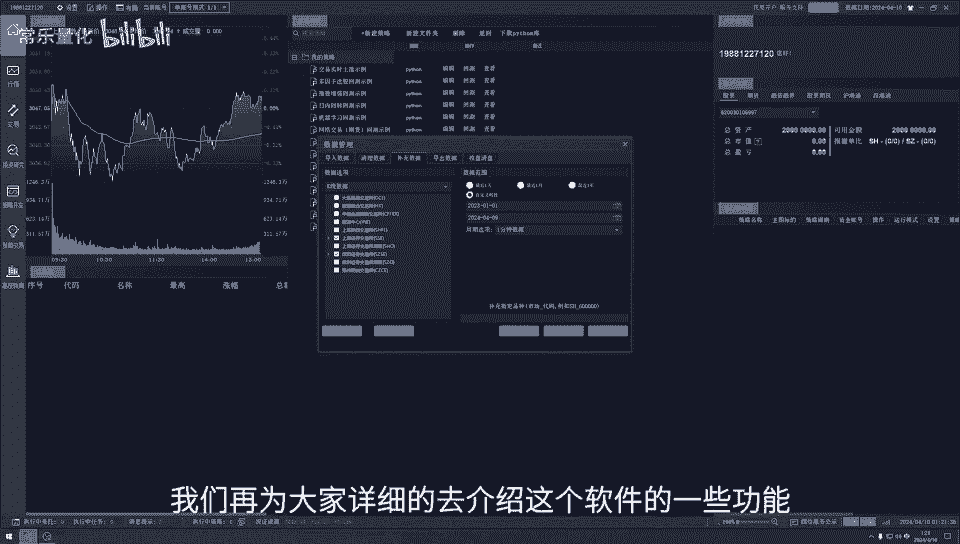

# QMT的python库下载以及历史数据补充。 - P1 - 常乐量化 - BV18H4y1T7tM

大家好，今天我们来聊一聊量化交易，为什么要量化交易呢，股市啊在这最近两年真的是越来越不好操作，不管我们是用基本面分析还是技术分析，那根本就派不上用场，总是感觉无从下手，自己的账户数据呢也不好看。

情绪各方面呢也容易受到影响，弄得慢也不是买也不是，其实啊，市场上有很多方法可以改变我们这一现状，电话交易呢就是其中一种方法，它在欧美国家呢也运用的相对普遍，只是在中国呢相对较少一点。

而更多的话是几乎在运用，那什么是量化交易呢，它其实是利用计算机强大的计算能力，而同时运用各种策略来分析多只股票，加上海量的一个历史数据模型，不断的去筛选优化，然后才得出一个。

我们能够大概率赚钱的一个策略，那这个策略呢我们可以通过一些方法来获得哈，也可以利用自己的一个投资经验，自己来洗一个策略，然后我们再去检测这个率字符可行，最后再进行交易，这样的话就可以有效地降低市场。

对我们投资者朋友情绪波动的一个影响，避免市场在极度狂热或者悲观的情况下，做出一个非理性的投资判断，那说了这么多，我们也知道了什么是量化交易，那我们从哪里去做量化交易呢，怎么操作呢，今天我们就来看看。

国信证券为我们提供的量化交易软件aqua，首先我们来打开软件，点击登录。

然后点击我们的当前账号，然后这里的话呢就会出现三个账户，然后分别是股票账户，然后信用账户，股票期权账户呃，这里的话呢大家可以一个一个的去登录，然后也可以三个同时登录，然后我们都点击它。

然后点击确定就可以了，然后自动登录设置，这里的话呢大家也可以去设置，然后下次我们登录的话，只需要点击它进来就已经可以登录好了，这是关于我们的一个登录的一个问题，然后我们先把登录这个问题给岔开它。

然后大家可以看到这个界面是黑色的啊，如果说有的投资者朋友我觉得黑色看不清楚，或者说不喜欢这样一个黑色界面的话呢，我们也是可以改变它的，我们点击我们的右上角这里一个衣服的图标，然后点击它。

然后我们比如说点击海蓝色版，海蓝色，点击它之后，诶，这样是不是大家看得更加清楚一点呢，嗯大家可能这里的话可以根据自己的一个需求，去自己去进行一个设置，我们现在的话呢，还是把它换成我们一个灰黑色吧。

我们换好之后，然后界面就会是这样的，那在我们正式用这个软件之前呢，我们需要提前把有两个地方给设置好呃，首先第一个设置点的话呢，就是这里我们点击设置，然后交易设置，然后一个模型设置，点击之后。

我们就可以看到这里有一个Python库的一个下载，关于Python库的下载呢，大家都知道我们这个软件是做量化交易的，一个软件的，那后续关于比如说我们那个Python的一个日志啊，还有一些其他的方面啊。

这些都会运用到呃这个数据，然后所以说我们先把这个数据给下载好，然后这里的话呢选择路径，这里大家可以根据自己用电脑的一个习惯，或者是电脑一个存储空间自己去选择，而这里的话我们可以看到。

我这里的话其实是已经下载好的，如果说没有下载好的投资股朋友啊，自己就进去自己下载就可以了，然后关于那个Python库的更新的话，这里大家可以时常也可以进来看一看，如果说有需要更新的话呢。

自己就点击更新一下就可以了，然后这是我们的第一个设置，设置好之后，然后我们点击确定就可以了，这是我们第一个设置，那第二个设置的话呢，是在这里我们点击操作，然后点击数据管理，然后就会出现这样一个界面呃。

大家都知道就是我们的一个这个软件，它是量化交易软件，那我们是做量化的，那我们在做一个很多策略的时候，都需要一个回撤，对不对，去检测我们的一个模型是否可行，那就会运用到我们以前大量的一个数据去检测。

所以说这里我们就需要补充一下数据，然后把数据给重新给下载好，然后我们看一下这里我们点击K线数据，然后这下面有一个，上海证券交易所和深圳证券交易所，这里的话我们需要把它勾选好。

那这里的话如果说有的投资者朋友啊，在做期货或者是期权的话，也可以根据自己的一个需求去勾选它，这是我们第一个需要勾选的一个地方，然后第二个勾选的地方哈，我们可以看到这里点击K线数据啊，这下面有财务数据啊。

除权数据啊，这些这里的话也可以，大家也可以根据自己的一个需求去点击它，点击它之后，然后把这些给勾选好，点击好之后，我们的一个后面这一后面右手边这里，然后是时间范围啊，我们先点击K线数据吧。

时间的一个范围，然后他有一个最近一周，最近一个月，还有全部还有一个自定义的一个时段的，然后周期选项的话呢是一个有这些数据，还有一分钟的一个数据，这里的话呢关于时间这里哈。

然后大家都可以根据自己的一个选择去选择，只是说呃如果说我们选择的时间相对比较多，比较久的话呢，那下载的时间呢相对比较多一点，这个的话大家就根据自己的一个需求去选择，那周期选项，这里的话呢。

我们一般选择的是一分钟的一个数据，点击它，然后最后点击补充就可以了，这里就是我们第二个设置，那今天的话我们就先把这两个设置给设置好，然后下一期视频的话，我们在为大家详细的去介绍，这个软件的一些功能。

比如说我的行情啊，交易啊，投资研究啊，还有一些策略研发啊，策略交易啊这些，我们在下一期的视频里面，再为大家详细的去介绍呃。

