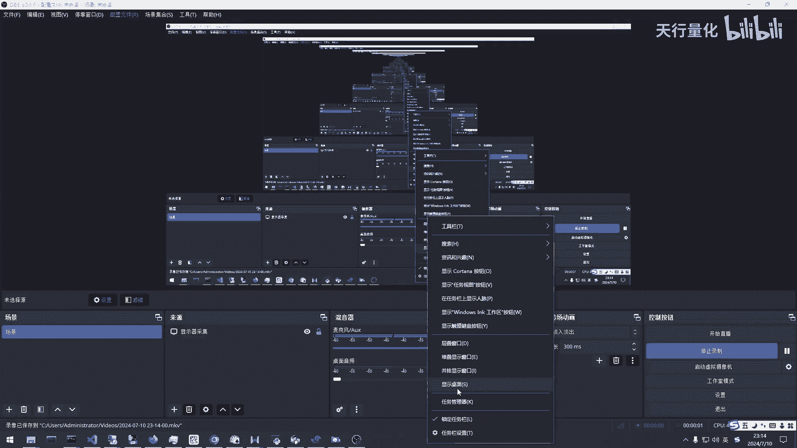
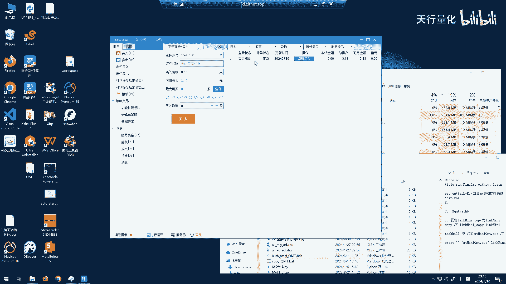
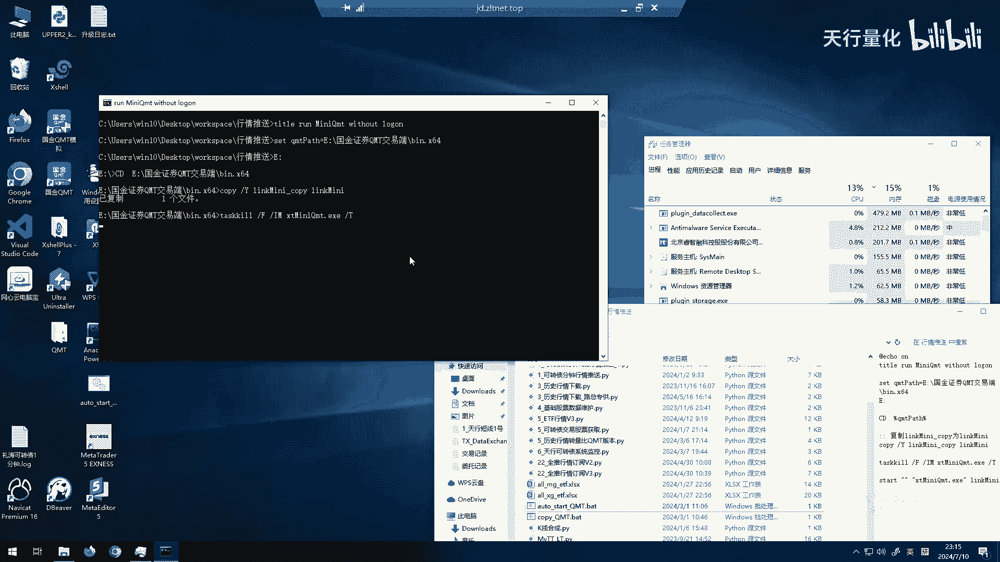
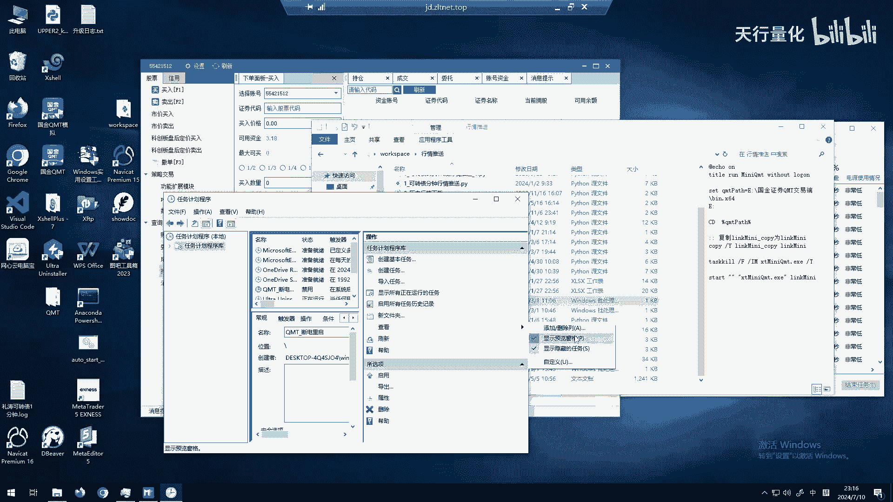
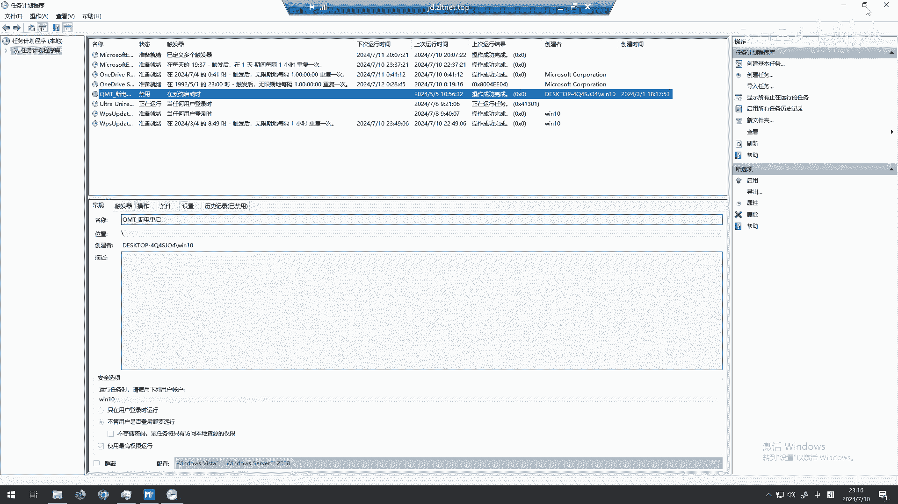
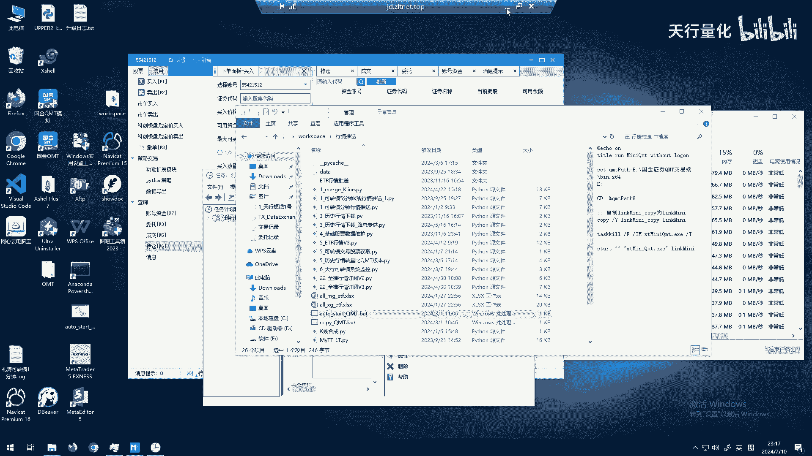
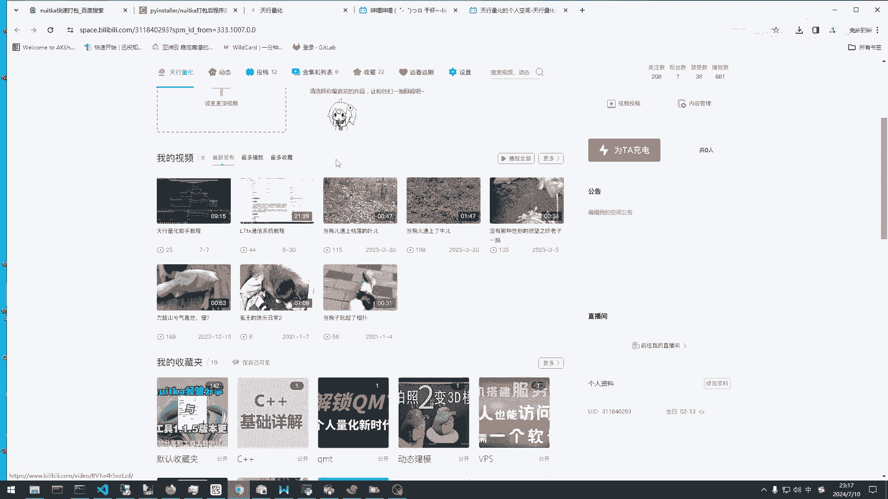
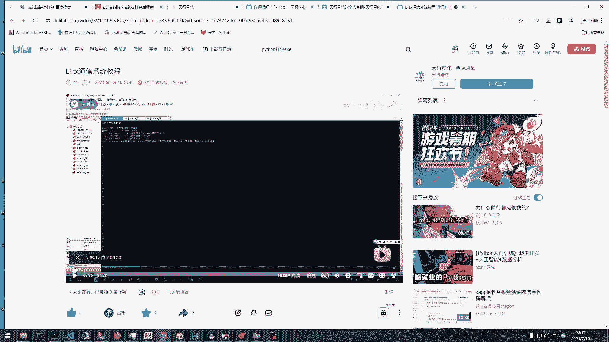
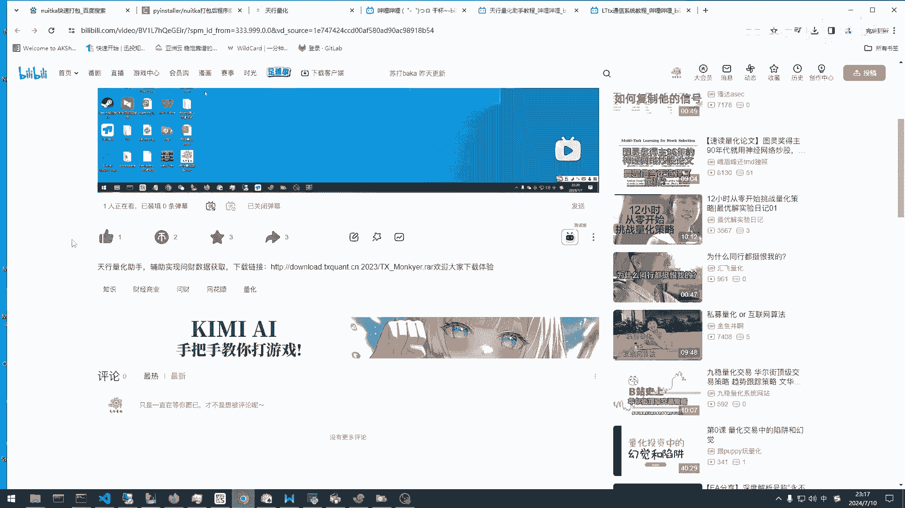
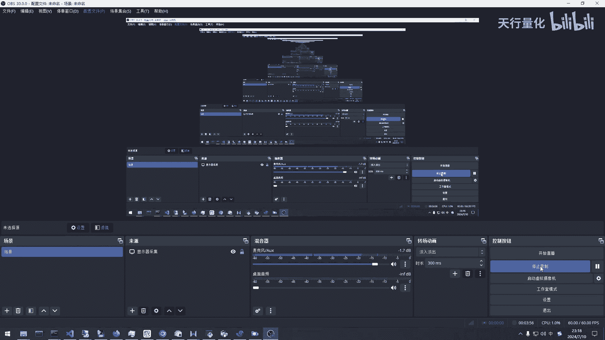

# QMT自动登录 - P1 - 天行量化 - BV1kAaxeUEtR

呃朋友们大家晚上好，今天给大家带来一个QMT的自动启动啊，主要是针对国庆QMT啊，大家都知道国君的QMT呢，他每天都需要，尤其是使用迷你q mt的时候，它每天都需要重启，然后如果说用人工来重启呢。

就会比较麻烦，那么这里给大家推荐一个呃，QMT的自动重启的一个方法，自动输入密码，那么我们先来看一下正常的启动QMT嗯，我看我这里的QMT启动哈，他是需要你去输入密码的啊，我们稍微等一下。

对你看这里这个地方，对我们这边稍微加载有点慢哈，因为我这边是在虚拟机上嗯，是的，虽然我们这里已经选择了自动登录，但是他不会去自动登录的啊，他需要输入密码再登录，这是你看他这里地方的登录的话。

它需要你输入密码，那么这里的话有一个up主，这里呢也给大家准备了一个脚本，就是可以看到这个地方，比如说我这里的这个奥特star q m t r呃，我们这里点击一下的话，它就会直接登录上去了。

对然后这种情况下的话，去使用mini k m p的话也是OK的，对你看这个地方已经登录成功。

对登录成功，然后我们这里关掉的话，然后我们再再点击一下这个它启动还是很快的。

它会自动的去登录，对这个的话，在大家平时用这个国金证券的KMT的话，就可以解决这个频繁登录的问题，那么我你可以把这个脚本，你是设置成那个Q那个windows的计划任务对吧，我们设置成计划任务。

这样的话它每天你电脑每天重启的时候，它就会执行，或者说你用这个Python Python，因为写一个脚本来每天运行一下，这个这个脚本的话，他也是OK的，比如说您看您们看给大家看一下我这个地方的。

看下这个地方我的这个计划任务哈，这个地方QMP断电重启嗯，这个地方是可以看一下，我们看他的属性，它也是每每天系统启动的时候，你的电脑启动的时候，它就会启用了，它就会自动运行，对。

行，然后这个脚本的话，我会给大家简单的看一下他的那个配置方案啊，这种到时候我会发到那个链接上面，到时候大家可以从我的那个评论区里面去找，下载链接哈，然后喜欢的朋友们可以帮忙点点关注对吧。

然后up主这里呢也会给大家分享一些呃，自己做量化过程中的一些小助手，一些开发工具，比如说我的这个通信系统，这个做一个简单介绍，他就是作为分布式，我们在构建自己的。

构建自己的那个量化体系的时候，它会用来呀用来做一个通信。

通信的这么一个功能，还有这里呢有一个对于天行量化助手，这也是up主自己开发的嗯，主要是帮助大家去问财上面拿一些股票了，选股大家有需要的话都可以去这里面下载，OK好本期的视频就到这里，非常感谢大家的。

非常感谢大家的观看啊，有疑问的话，或者说有需要帮忙的。

都可以和up主联系，可以私信up主啊，然后私信或者说关注一下up主都是OK的，好谢谢大家，祝大家，各位股友胜利长虹。

