# QMT量化交易——原生Python金融数据获取方式 ｜ 大模型数据处理流程 - P1 - 交易回战 - BV1vV1hYeE35

大家好，今天来跟大家分享，如何用k mt原生的这个Python的包去获取数据啊，因为之前有朋友也提到过，就是说想去了解一下，如何用KMT它去获取官方的数据啊。

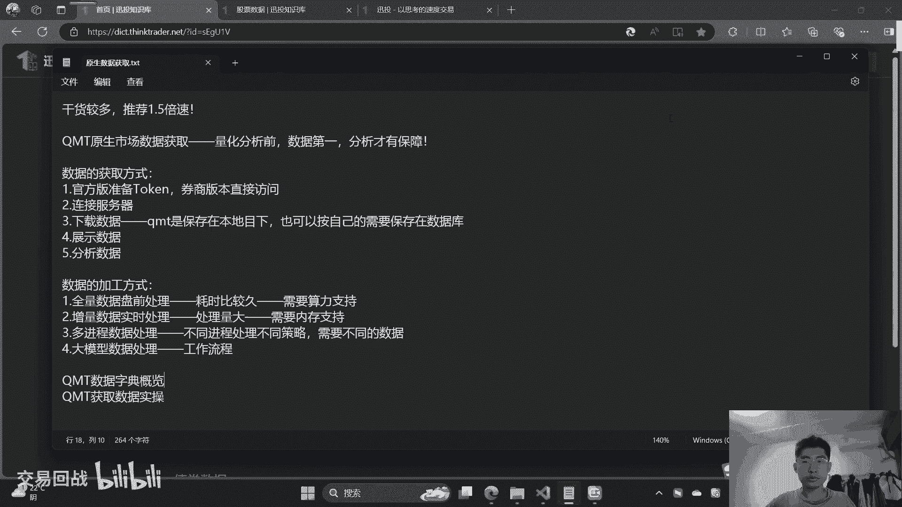

并不是在我们的这个就是k mt的这个操作端，而是用我们的这个是用我们的这个，就是在我们的IDE里面，我们能能够通过纯Python的方式。

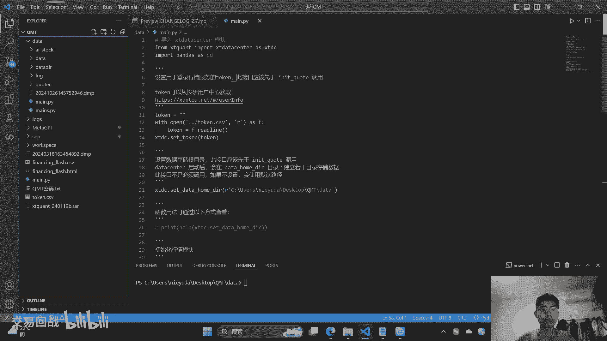

然后去获取数据啊，啊今天就跟大家去讲解一下如何去操作，那么首先的话我们去获取数据的话呃，要对于数据的这个质量，或者说对于数据的一个全貌有一定的了解，那么我们才能会知道我们要去获取。

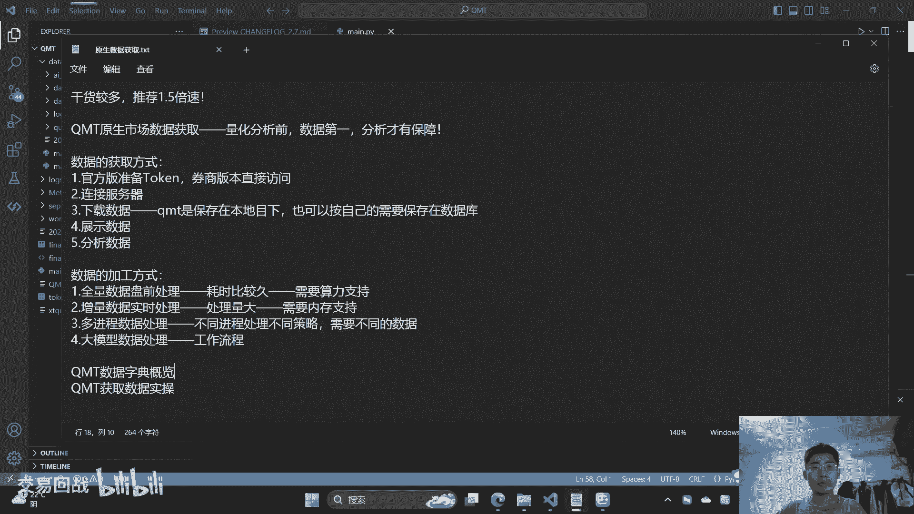

什么样的数据啊，那么大家可以从这个官网上会看到啊，就是说我们之前已经分享过，就是说呃内置的Python是什么样的，就是在我们的大q mt里面啊，还有就是我们的原生Python，就是那两个不同的包对吧。

一个是行情端，一个是交易端啊，另外上一期也跟大家分享过哈，如何用VBA去构建裸K线的一些模型啊，那么今天就想来跟大家去讲的，第四部分的一块内容就是数据字典，那么我们平常在进行数据分析的时候啊。

其实我们要知道，我们的数据其实都是放在数据表里面的啊，我们很多啊朋友嗯在工作的时候，如果说你是说和做一些数据处理的相关的工作，那么你可能大量的工作，就是应该在和数据表打交道，那么你去加工数据表。

那么这张表它有什么哦，关联键，你要给对方提供什么样的这个呃内容，那这些消息就是你可能每天每天生活中，你不需要去做的一些事情啊，而关于数据表的话，就是说我们的这个字典。

因为现在它其实很多一些啊数据服务商啊，他们向你做一些数据的一些售卖，那么他们给你卖数据，其实都是按照数据表的方式去卖的啊，就相当于说啊他们给你多少张表，那么按照表的这个数量进行收费。

那么你就是通过订阅的方式啊，订阅他们的表，那么其实他们的表，在他们的那个服务器里面去做做更新，那么他们更新好了以后，那么你去访问他们的数据表，那所有的这些提供数据服务的这些数据商们。

那么他们一定会提供相应的这个数据字典，这样的话你才能知道他们有什么样的数据，你才能去调用啊，所以数据字典是很重要的啊，那么今天首先大家就来讲大大呃，大家大家来看一下。

就是说讯投的这个数据字典都有哪些内容，以及我们可以使用什么样的一些数呃，首先的话就是前面这一部分的话，就是官方他们说怎么样去通过顺投的这个快mt，然后去啊连接官方的行情啊。

因为这个行情这个VIP用户这个是得需要付费的，而且付费还额还挺贵的，所以我这边并没有去购买啊，然后我只是购买了普通版本的啊，大家可以去根据自己的实际情况，就是实际需要去去看。

那么后面的话主要想的是跟大家去看一下，就是说我们如何通过最普通的啊，我们如何通过普通的这个com t去获取数据啊，嗯像大家可以在这个官网上面去看到啊，他一个是在券商的KMT里面去获取数据啊。

这一部分的话，大家可以直接在那个界面里面去设置啊，跟着这个操作的流程去走就可以了啊，然后这边的话没有什么太大问题嗯，第二个就是你可以在官方里面，根据他们的token啊，官方就是你去他的这个官网里面。

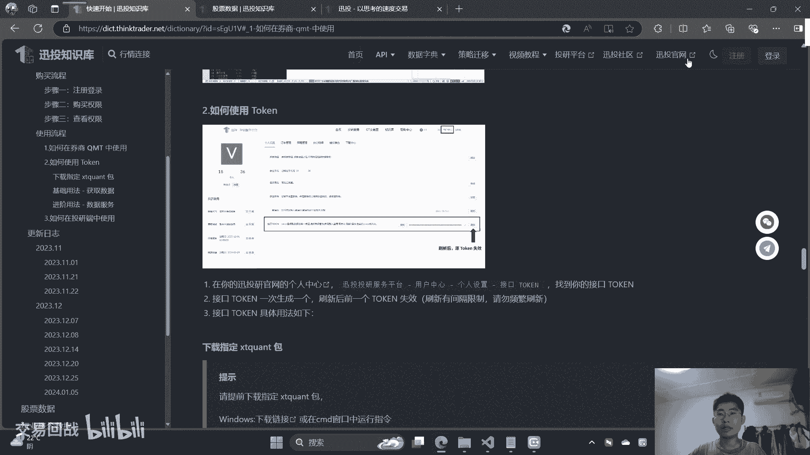

你点官网，然后进去以后可以看到这样的一个token啊，这个token的话你就可以把它复制下来。

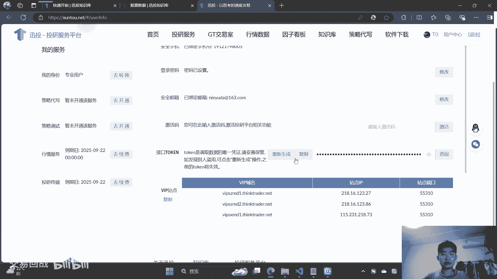

然后后面我们进行访问数据要使用呃，那么这样的话就是说我们的一些前期工作啊，就是首先要知道你是啊与纯Python版本的，然后你要去在官方的网站上面去注册一个账号，然后去获取token啊。

然后后面的话就是说我们怎么样去获取这个，token的数据啊，啊首先的话我们第一部分的话，就是我们要去下载我们的一个安装包啊，因为我们这是用Python去调用的。

那么首先我们就要有一个我们Python的一个环境啊，我们目前的话只能在我们的windows下面去使用啊，但事实上因为它是用命令行去操作的，他其实也可以在这个LINUX的这个，系统下面去下载啊。

但这个东西得还得需要去购买投研版啊，费用也很高，所以说我暂时就没有去买嗯，然后大大家可以在这个自己的这个本地电脑。

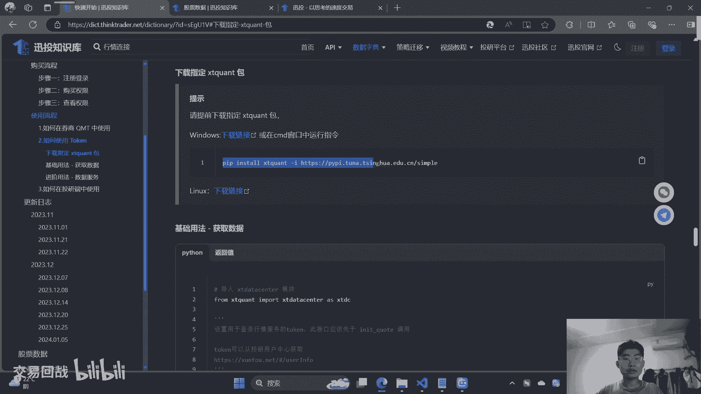

去安装这么一个包对吧，安装好了以后呢，大家可以在比如说我使用这个best scode，这个IDE里面，那么我这边就相当于是安装好这个包以后，那么在命令行输输入以后，安装好以后。

那么我们就可以使用这个包了啊。

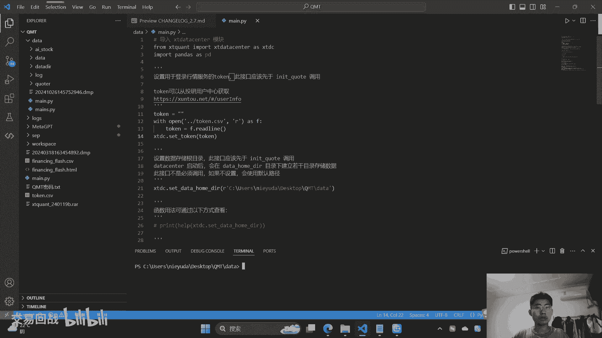

这个包就是我们前面提到的这个一个，专门去下载，就做我们原生Python Python的一个包啊，后面这个杠I就是说指的是用清华的一个圆啊，对于初学的朋友，可能就是已经就是不太清楚，后面这个是什么意思啊。

我给大家提一下，然后把这个安装包安装好了以后，那么我们现在就可以去调用我们的这个xd count，然后去访问我们的数据啊。

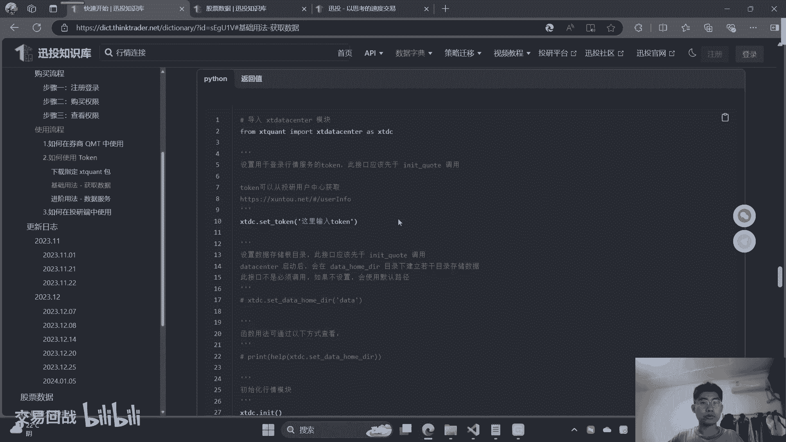

像这个官方也给出了一个很明确的一个示例，那么我们就把这个事例放在自己，这个编辑器里面，然后去做一些处理啊，首先的话他这边写的也很清楚啊，我们首先第一步需要获取我们的token啊。

token的话我是保存在本地啊，这样为了安全的话，他只是做一个加载，那么我们前面这个步骤的话，这个不需要我们前面步骤只需要一个一件事情，就是把我们刚才安装的这个包，导入到这这个地方。

然后第二件事情就是我们要去啊，从官网上面去获取我们的token啊，那么后面的话第三件事情就是说，我们要把我们的这个当前的这个路径，去设定好啊，因为这个路径它官方做的是在本地啊。

但事实上我们可以写一个绝对路径，比如说我们这边有一个这个data，这个data里面，大家可以看到这这个里面，他已经是有一个这么一个数的，它它它的所有顺从，他们就是说用这个包去做数据处处理的时候。

他会把所有的这个数据下载到这个本地环境啊，大家可以去可以先就是把这里面的这些数据啊，你可以啊，比如说我们都把它这个东西都先去删除掉啊，像这个东西都可以去删，都可以去删除掉啊，像这个什么data a了。

这个大家可以去看一下，然后还有这个data这个也可以去删掉，因为我们在使用这个包的时候，还有这个日志，我们在使用这个包的时候，它其实系统会自动的去帮我们，把这些数据都下载好啊。

所以我们真正要传递给他的这个事情啊，这个路径其实就是我们外面的这个就是这个data，直接告告告诉他一个有空目录的一个地方，他就会把所有的这个数据存在这个目录下面啊，不是不是存在数据库里面啊。

请大家要注意这个地方，然后这个是路径，我们设定好了以后，就存在我们这个本地啊这么一个文件夹下面，后面的话，那么我们现在就是要通过这个调用初始行情，这个大家请注意啊，调用这个初始行情之前。

一定得要先把这个token先做好啊，要先先做好这么一步，后面的话我们现在去调用，另我们另外的一个数据类啊，就是从这个里面去导入这个x t data，然后我们比如说可以去实验一下。

我们可以去获取交易日期看一下，就是说我们上证所里面的，就是说呃就是后最近的有十个日期是什么样的，还有就是从我们这里面去看一下，我们的这个沪深A股的板块啊，大概就是呃有有多少有有哪些内容啊。

还还是隔100个这样去看一下，后面我们还可以从这边，比如说我们看一个个股方面的数据，然后我们就从这个里面调用这个get instrument detail，去获取这个平安银行应该是他的这个股票数据。

我们还可以去获取一些啊，这些偏另偏另类的一些数据，比如说就是这种问董秘的这些信息，也是以平安银行为举例啊，像这种另类的数据，我们一般得需要提前去下载啊，所以说我们第一步是先要下载这样的数据。

然后才能去调用啊，大概就是这有这么些步步骤，我们首先得注意的话，就是说我们要去啊导入我们的包，然后去啊安装，就是说去啊输入我们的token，然后设置我们要把数据存在什么地方，然后初始化一下行情。

然后导入我们的这个x chart data，然后就开始就是说我们下载数据，调用数据对，步骤就很简单啊，非常的简单，那么大家可以从这边去看一下啊，好我们这边比如说把这个东西写好以后，我们去调用啊。

访问我们我们就写的这个main函数里面啊，我们去调用它open man，可以看一下他的这个结果是什么，他这个时间会稍微等一下，因为他这边要访问他们的服务器，这个东西里面服务器你不需要自己去设置啊。

他其实都已经都配好的，你只需要稍作等待就就可以了，对OK可以看到啊，它这个里面的显示出来了啊，呃首先是先进行数据库的一些连接，他跟您说过他的服务器是什么样的，就是说我们这个包的版本是什么。

然后还有我们的服务器的这个地址是什么，嗯还有就是我们这边的一个数据啊，还存在什么地方啊，这个data detail，因为刚才我们可以看到，我们把这个里面的内容都删掉了啊，这个大家大家可以去注意到。

它每一次运行这个数数据，它自动会在本地这个data里面建立这几个文件夹，其实其实建立这几个文件夹，就相当于是他自己去构建一个啊，本地的一个数据库一样，他把我们的一些关于数据方面，保存的一些信息啊。

还有他的这个呃实呃实呃实体，还有他的这个目录，把这些把这些东西都是嗯保存下来啊，所以说其实一个数据库的一个架构，其实很也很简单，其实并并没有很复杂，所以大家可以从从这个地方去多思考一下。

然后这边呢就是我们下面的一些数据啊，就前面我们说到的时间，最近的时间还有就是我们的沪深300的，就沪深A股的所有的这个股票数据，还有就是我们这边平安银行的个股的一些信息，然后后面就是我们的一些另类数据。

也是问董秘的一个信息，OK那么这个就是我们如何通过我们的KMT啊，去呃在我们的这个原生的Python环境里面哈，去获取数据啊，啊操作就是这样子的，也请大家去多尝试一下啊，其实不会很复杂啊。

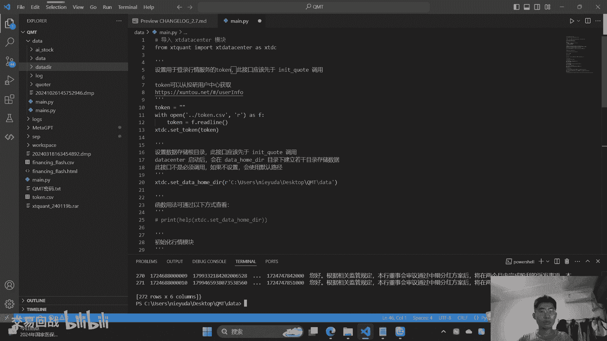

OK那么接下来跟大家去讲的这个内容的话，其实呃就是说后面这一部分吧，就是后面这部分其实想想跟大家去讲一下，就是说我们把这个数据获取到了以后，我们要去做什么事情啊。

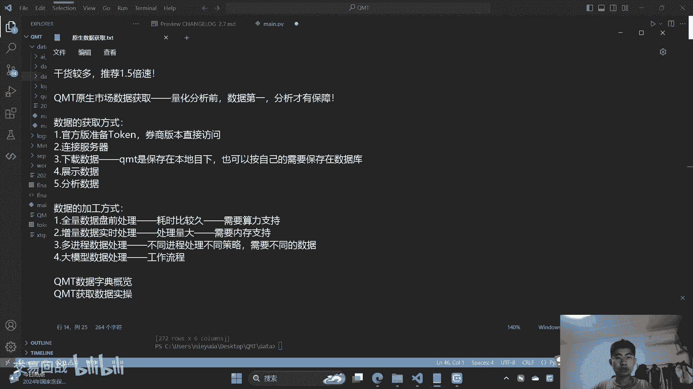

首先大家请看一下，就是说我们这边获取的这些数据，它都是获取的是历史数据啊。

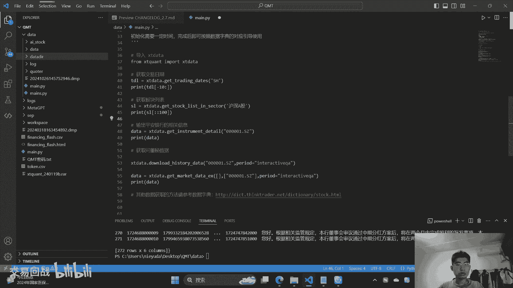

历史数据其实本质上说，我们其实都是应该在，我们嗯实际上在做量化交易之前，需要去做好的啊，需要去做好的，所以像他这些什么样的，就像像这些的股票数据，像这样的股票数据，在这个字典里面。

大家可以可以去看到股票数据，行业数据指数期货期权，还有等等这一些数据啊，嗯这些数据其实包括他他们自己做的一些，特色嗯，特色这些因子数据啊，这些数据其实都是历史数据啊，只不过比如说像这个因子数据。

他可能会基于前面这些数据自己再加呃，加工出来啊，但所有的这些数据，其实是你应该在你盘前就是准备好的啊，所以这个叫历史数据。

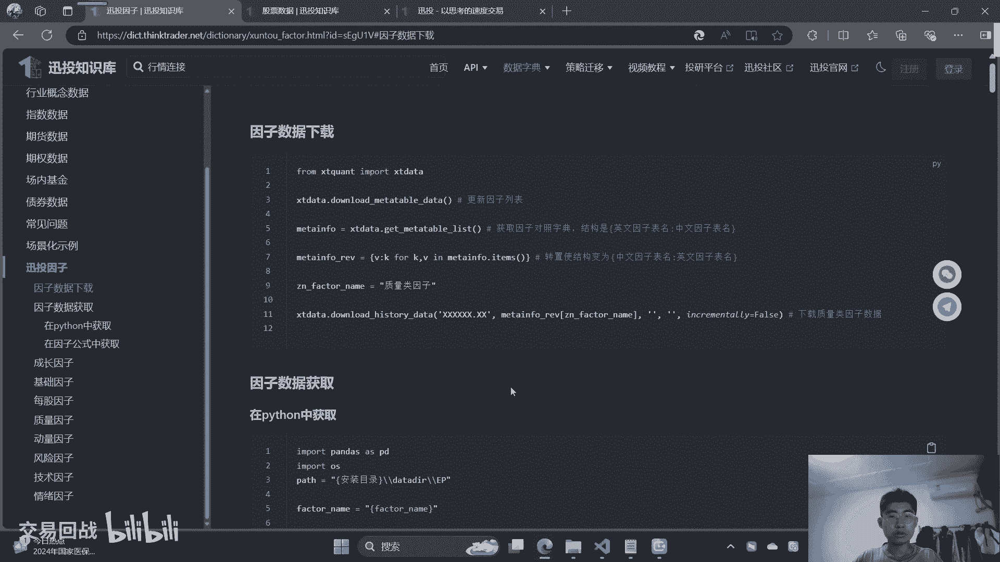

那这一部分的数据它的量很大，所以我们一般来说我们需要在我们盘前，都都要通过这个方式啊，Download hate story data，把我们所需要的所有的数据都都下载好。

然后我们通过我们的一些因子处处理的方式。

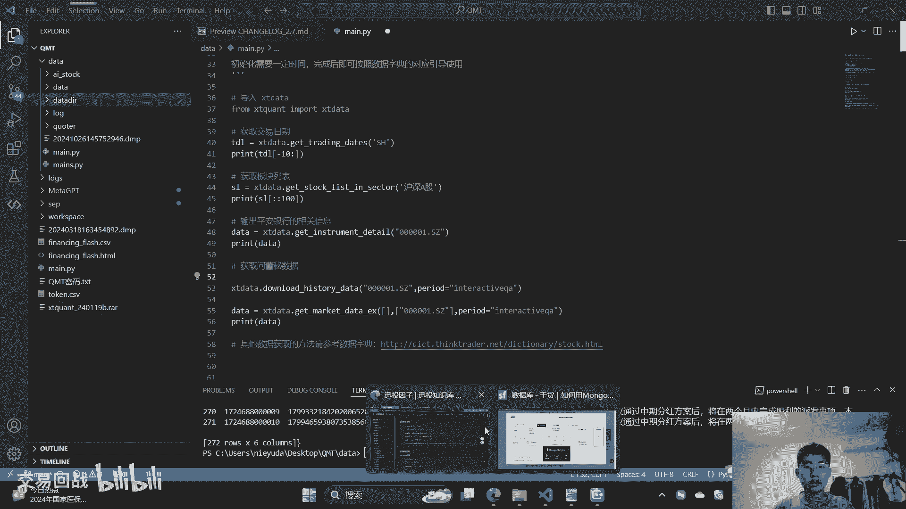

加工好啊，那么第二部分的数据就是我们需要获取我们的，就是说实盘的就是实时的数据，那么就是说我要获取我们一些订阅的，一些行情数据，那这一部分这一部分的内容，主要就是用来触发我们的信号的。

就是我们有历史数据，但是我们不可能说我们在盘中就分析历史数据，我们在盘中只能分析订阅的实时数据，就是最新数据，那么通过最新数据到达我们的一些指标信号上，到达我们因子的一些阈值上面。

然后我们就去做一些啊信号的处理啊，所以说大概就是说整个处理数据的方式，就两类啊，一类是盘前需要处理的数据，一类就是盘中需要做处理的啊，那么盘中做处理的话，其实大家要注意的话，就是说其实盘中做处理。

它得需要呃进行很大量的一个计算，那么盘中做处理，大家就需要使用到这种多进程的一个方式，那么他这个地方其实也有提供，就是说我们这边怎么样进行一些，多进程的处理啊，大家可以去看到。

从这个官网上面可以查到这个进阶用法啊，他这边讲的也很清楚啊，我有多个不同的策略，或者说我们有不同的加工数据的方式，他需要在不同的进程去运行啊，因为我们知道整个Python它目前都是这种呃。

单线程去处理的，我们如果说只用一个Python。

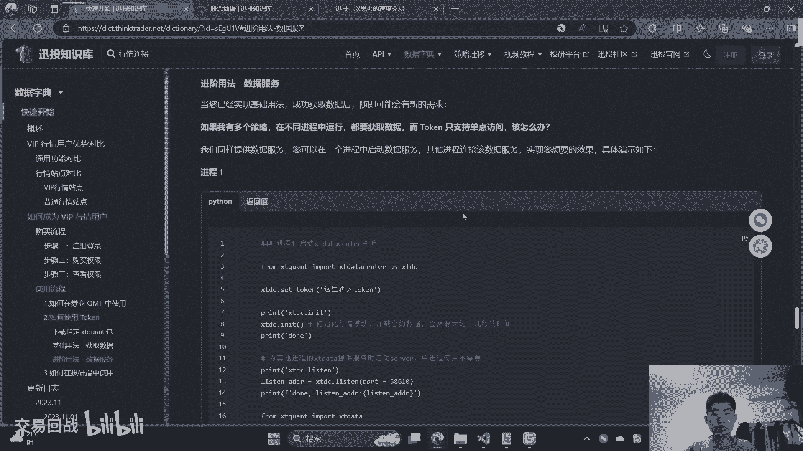

比如说我们只用这一个只用这一个面呃，main函数去写的话，它只能在一个单核里面去走，那么但是说这样速度会很慢，所以我们在实际在真正在做量化的时候，我们都是要多核去操作，我们可能会写不同的main函数。

一个不同的一个main函数可能专门负责处理啊，一种就是说策略，或者说我们这种风控这样子额，那这这个时候呢我们就得需要多。

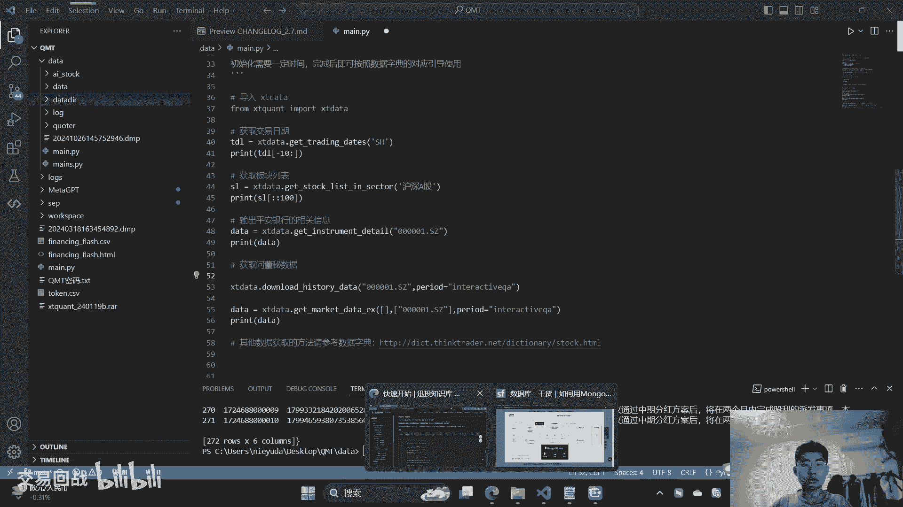

就是说多处理去就多核去做，那么我们他们这个地方就就提到，给你一个参考的方式啊，怎么去多核去做，就比如说一个进程负责启动数据服务，那么其他进程是连接该服务，这样的话，我们就可以避免反复向顺头的。

官方的行情服务器发起一些重复性的请求，就避免这样子，我们的这个数据就会出现，访问不到或者超时的问题啊，这个地方就是说他怎么去多进程去做处理的啊，他这边也有提到过。

我们目前只能说一个数据服务只能有五个介入，如果说你想进行更多的这种现成的处理的话，那其可能你得要去买他们特殊的服务，但其实我们这边的话五个其实就也够，如果你再熟悉一些这种这种并发式的那些啊。

并发的一些操作的话，其实你可以完全就可以用，自己去重新去处处理一下，因为数据它只要在你的这个内存加载过来，你处理数据的方式，你不论你开多少个呃，进程或者是线程都是都是没有问题的啊。

所以这个地方就是说我们如何用多多呃，多核去处理我们的这个数据啊，那么最后的话就想跟大家去呃介绍一个，就是说呃，我们后面额，为什么要去多核去处理这这个事情啊，我自己认为就是说我最近在也是比较忙。

因为我最最近在看就是一些呃，大模型和这个交易方面，就是相关的一些结合的方式，所以今天也想来跟大家去分享一下，就是说我们如何用大模型来去处理。

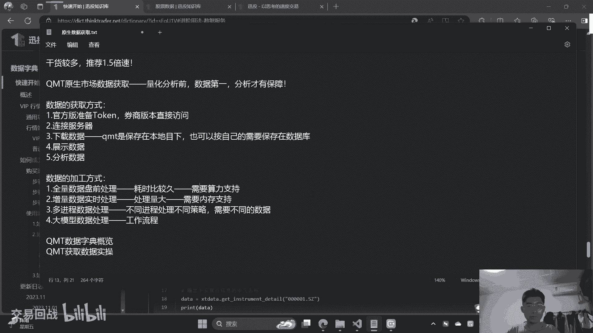

我们的这些数据啊，这边我其实啊，给大家就看到一个是一个一个图啊，这个图就是在这个MONGODB，它是一个数据库啊，但他这个提供的这个方式其实是有参考价值的。

大家不要觉得就只能MONGODB去做做这个事情，我看前面有提到过，它只要是一个数据库能够存放我们的东西，那么我们就能就能够用它来帮助，我们这个大模型，其实就是做进行一些输入和输出啊。

那么我们大模型它这个里面去提到了，他这个地方显显示这个虚线部分，就是说使用我们的这个大圆模呃，模模型，它这个里面会做一些就是数据流的这个呃加工，那么实现部分，就是说我们不需要带模型去做处理的一些地方。

那么大家可以去看到话，就是说我们在用大模型，大语言模型，就比如说用GBT去做处理的时候，首先我们的数据源这一部分，它的这个输入这一部分其实是没有做处理的，直接从外部外部数据就导进来，比如说我们这个实现。

可以当成我们的渗透数据啊，我们的数据源都放好了以后就不动了，那么到这一部分的话，我们再做一个就是说一个embedding的一个过程。

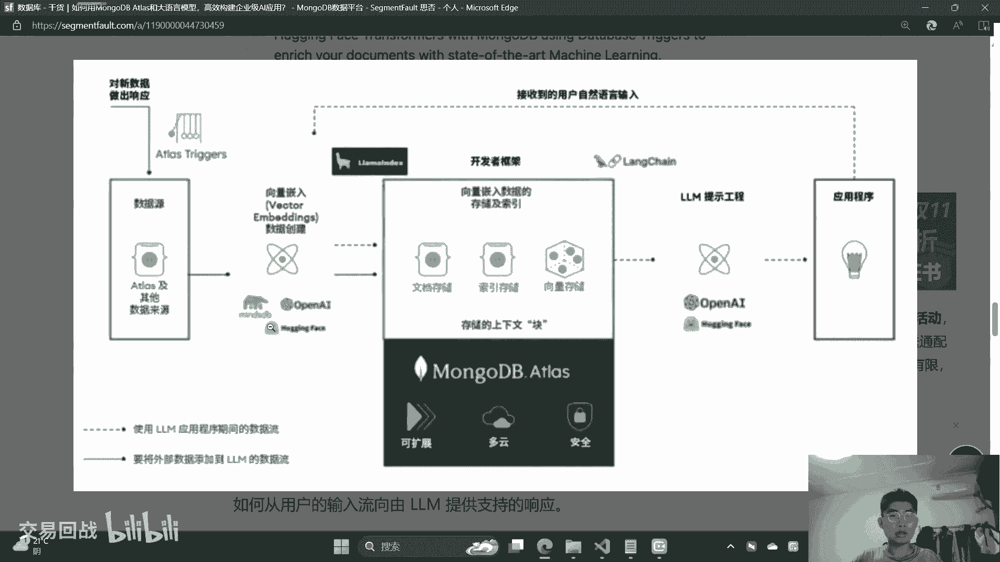

那么就把会把我们所有的这样的一些数据啊，给大家去看一下，就把刚才我们就看到这样的一些数据。

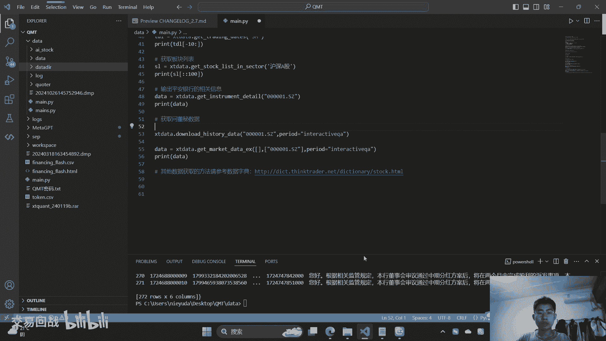

我们会把这样的一些数据啊，尤其是稳稳一些的数据，会通过这种嵌入的方式把它存成一个向量库啊，他们叫向量的一个知识库啊，我们会放在这个里面去做存储，那么存储好了以后，我们就可以供给大模型去访问了啊。

我们其实就相当于是这个地方，它就用来存储我们的这个呃知识库的啊，抢前面这一部这一部分的话，他也可以就是用来去丢位给这个大模型，大模型就是在这么一部分啊，大模型这个里面它说它叫它是叫一个体呃，提示工程。

就是我们在这个里面，可能得需要写好很多的这种提示模板，那么说我们这个东西它是做什么用的，那么我们用户我们的需求是从这个地方去提入，那么我们说任嗯任何的话，或者说我们给他任何一个请求。

那么大模型会通过它预先设置好的这个提示词，去结合你的请求，然后从后面这一部分的这些数据里面，然后去提取一些他需要的一些信息，然后把它们拼装起来，然后给你输出一个你需要的一个答案啊。

这个就是大模型处理整个这个我们的这些啊，数据的一个方式，那么其实我后面的话再探索的话，也是说用我们大模型啊，如何去做交易，比如说我们给他一些很多的市场，行市场的一些数据，那么他其实在做行研相关的工作。

我觉得应该是还挺不错的啊，这个地方请大家去多多思考一下。

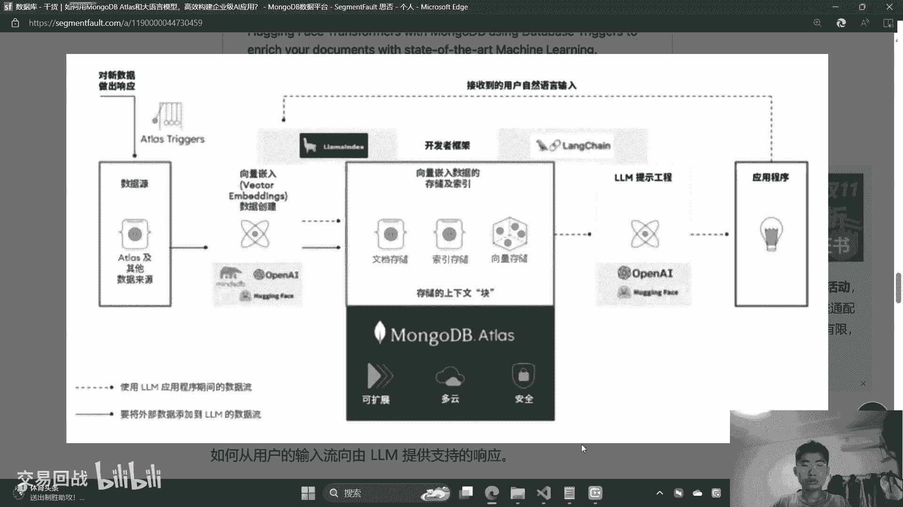

你如果用它来去做一些，类似于这种偏量价的分析啊，就让他分析这样的一些数据，那可能会比较困难，但你让他分析一些，比如说偏偏这个偏偏这种自然语言的，这样的数据，那他可能效果就会比较好嗯好的。

那么现在的话就先，今天就跟大家讲的是这么一些内呃，一些就是说知识啊，其实大家首先就先要去到官网上去看一下啊。

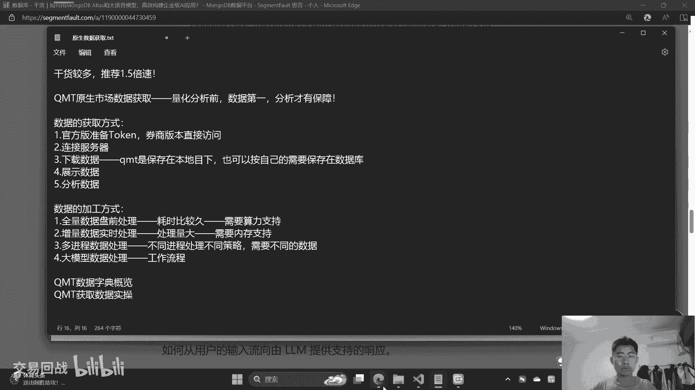

然后去把自己这个token去做好，然后去从这从这个地方，然后去下载数据，就是这个这个地方数据字典使用流程下面，然后把它都做呃，都装好去看一下，然后就没什么太多的问题哦。

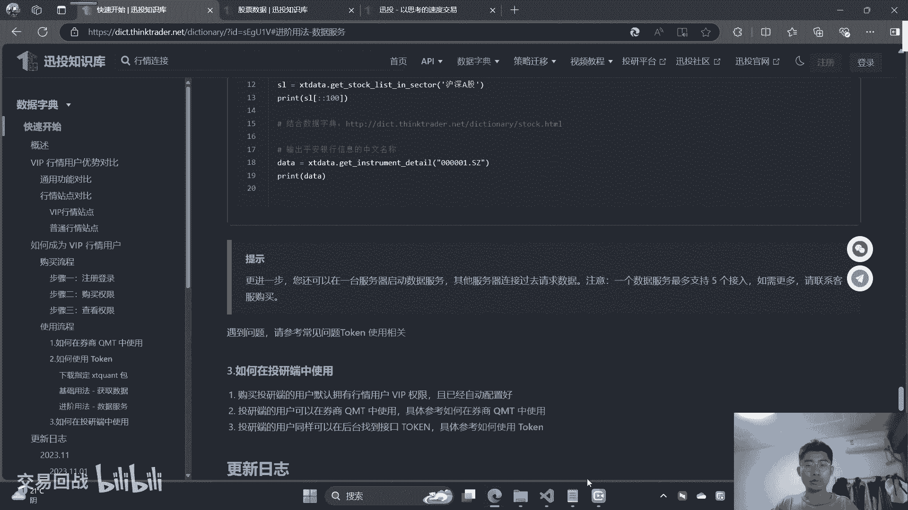

然后从这个地方大家可以去啊访问这个流程，然后去把这些包都导进来，然后去把它去token去写好，目录去写好，然后去访问，然后就可以了，好的，那么今天跟大家的分享就到这里了。

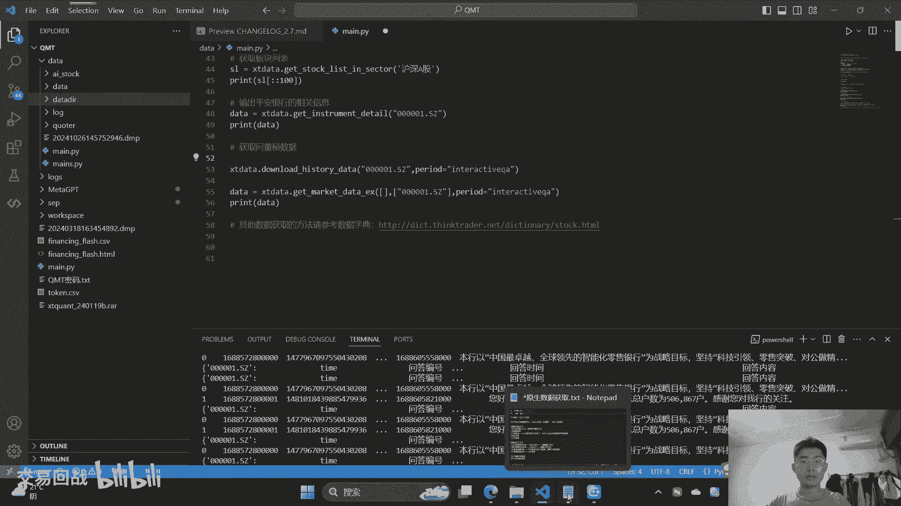

也是希望大家有什么不懂的问题，可以在留言区进行评论，然后我也比较啊方便在后面跟大家去分享，大家想呃想知道的一些内容吧。

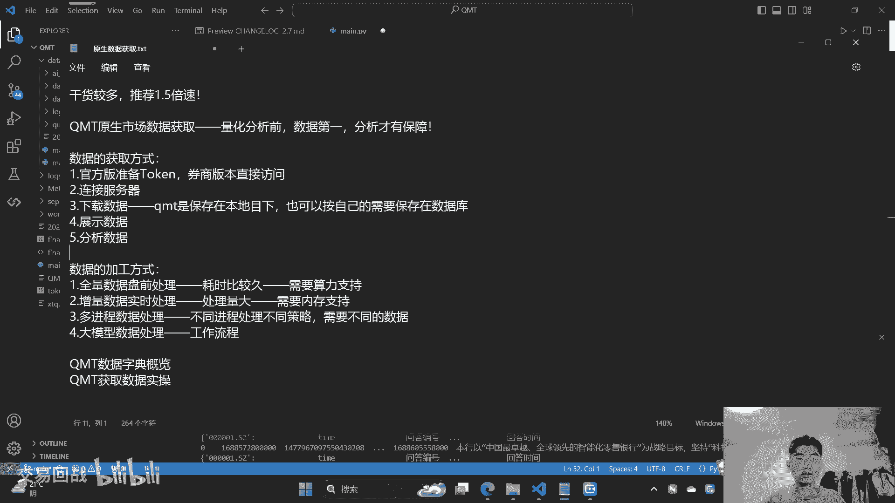

好的今天就到这里啊。

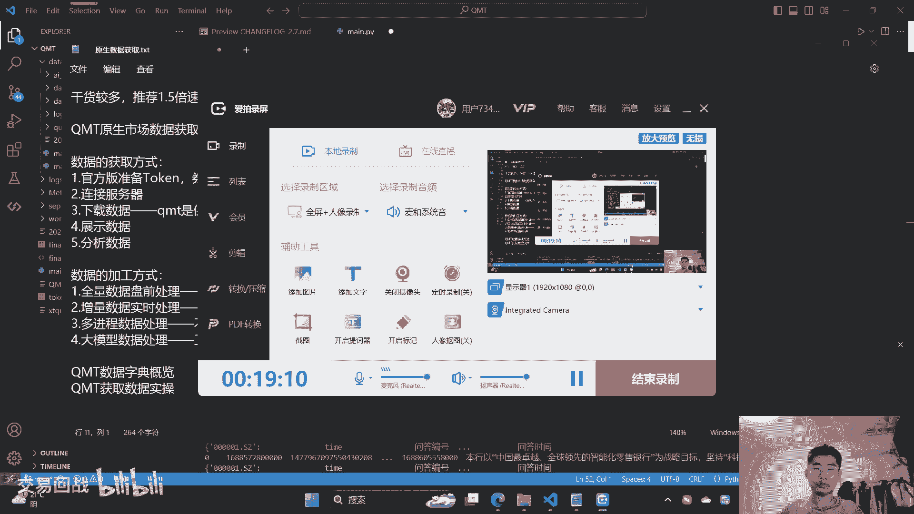