# QMT量化交易——MiniQMT新手入坑请注意！ - P1 - 交易回战 - BV1Db28YtEtX

大家好，然后今天来跟大家去讲解呃mini kMT，也就是这边的XT，也就是我们的呃原生thon kMT的一些入门的知识啊，因为有朋友在问就是说我们怎么样去用我们更加灵活的python框架。

然后去写KMT的策略。那么今天就是跟大家去分享一下我们新手应该如何去使用mini kMT啊，首先第一件事情是想跟大家去讲的是啊mini kMT它并不是很适合新手去使用。首先因为mini kMT啊。

它的这个开通嗯它的开通就已经是啊就是有是有门槛的就举一个例子来说，我们现在minT啊，我们比如说大家可以去看到啊啊，我用我这边自己的一些权限账号去举例啊，min kM的话，它怎么去开通呢？

就是啊我们要在这个官方上面就官网上面，我们其实啊这边。去申请一个就是有权限啊，申请权限的话就相就相当是说啊他要向券商去报备。啊，那么如果你没有去报备这个miniKMT的话。

比如说我以我这边的中信建投这边来举例啊，我的中信建投这边是一个以个人去申请的啊，一个KMT账户。那么大家知道miniKMT啊，怎么去开通。

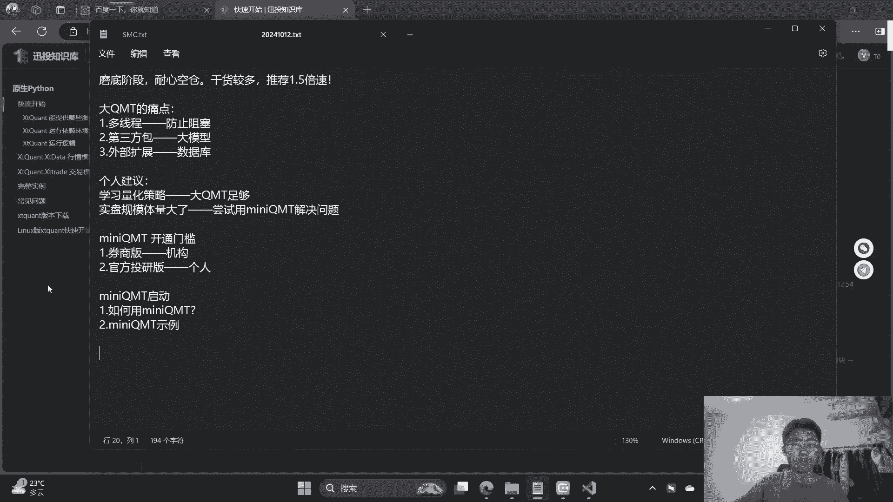

我们这边必须要登录这个极简模式啊，这个极简模式登录上去以后，它是我们开通原生python的一个前提啊。啊大家可以去看到我这边就是把这个东西已经去勾选了，没有勾选的话，这个它这个行情加加交易。

这个是可以选的。一旦进入极嗯极简模式。然后大家就不能去选上面这这么一些按钮了。然后大家可以去看到我这边点登录。对他这边会说啊，请联系券商开通对应的权限啊。哦后这个我有咨询过，就是你没有去申请的话。

他对于你的个人账户是没有办法去使用的啊。所以我们这边中信建投这个证券，它的这个minic kMT就不能去用啊。那如果你是机构户的话，比如说我们这边的国人系统，我这边是机构户。那么他是用机构的这个有牌照。

然后你去申请的话，你可以去申请到他们这边的机构的一个就是miniMT。嗯，大家可以去看到话，如果说我们啊开通的这个机构户的以后。呃，对他去检查。然后我们这边再去勾选这个极简模式啊，就是机构号。

那么我们进去了以后，它这个就可以登录到这个里面去啊，大家就就可以看到这就进入极简模式了啊。然后进入极简极简这个模式以后，我们才是可以去使用这个原生python啊，这个这个前提啊。

嗯如果大家就是说我不是机构怎么办哈。如果不是机构的话，大家也可以去这个官网上，就是fin头他们这个官网。我们这边直接去安装他们这边的就是。

用他们这边的原生原生的这个QMT就是用在他们就是在他们之前我介绍他们这个投研平台，椭研平台里面它有官网的这个就是呃原生的QMT下载。

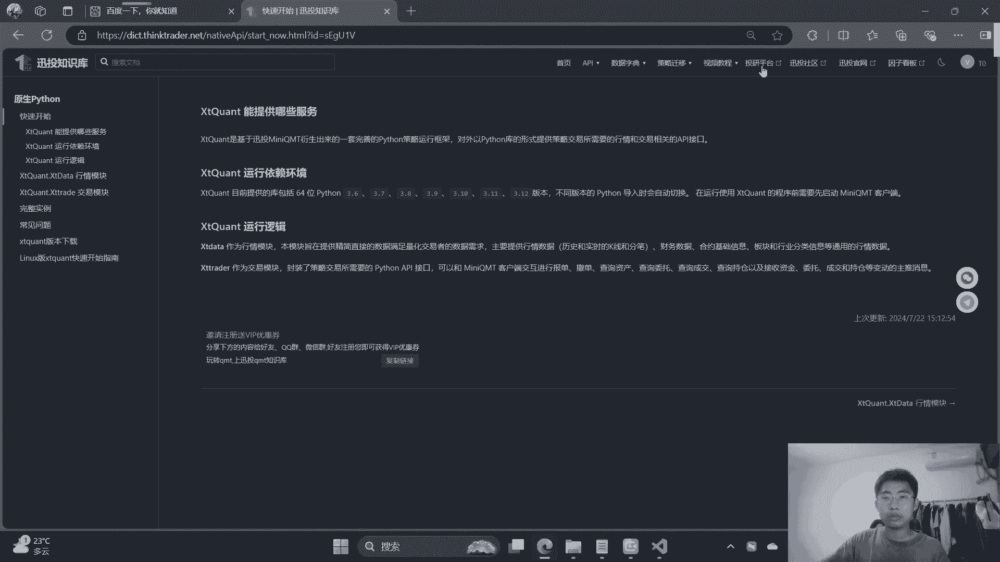

大家可以进去看到，直接连。软件下载就下载，这个应该就没问题啊。然后呢，大家可以去看到的事情是。它这个里面有一个呃权限的开通。那如果你这边去开通了他他这边的一个。基础版行情的话啊。

那么你就可以去进进行做模拟啊。那这样一开通的话，就相当于7乘24小时，你可以做撮合。那么后面我会跟大家去介绍它这个撮合机制是什么啊，但大家这里首先要知道的话，就是如果你是个人。

你是没有办法用券商版去开通min的啊，因为这个是在监管的要求，如果某些券商他可以去给你开通的话，你可以去问，但是大部分的券商是不能去开通的啊。

所以这里建议就是说如果大家想要去尝试原生thonminT就还是要从官网这边去做啊，从官网这边去下载以后，然后去尝试。然后这个minT他怎么去启动呢？它是做什么的呢？

然后首先第一件事情就是说我们要知道我们为什么嗯要去用这个min啊，因为很多人他们好像就是觉得这两者都可以用。但事实上min和他们其实是互为补充的，我们可以从这边官网上很容易就可以去看到。

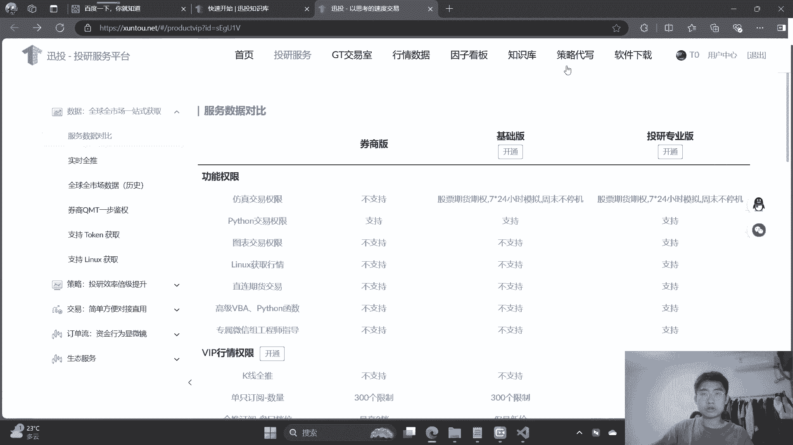

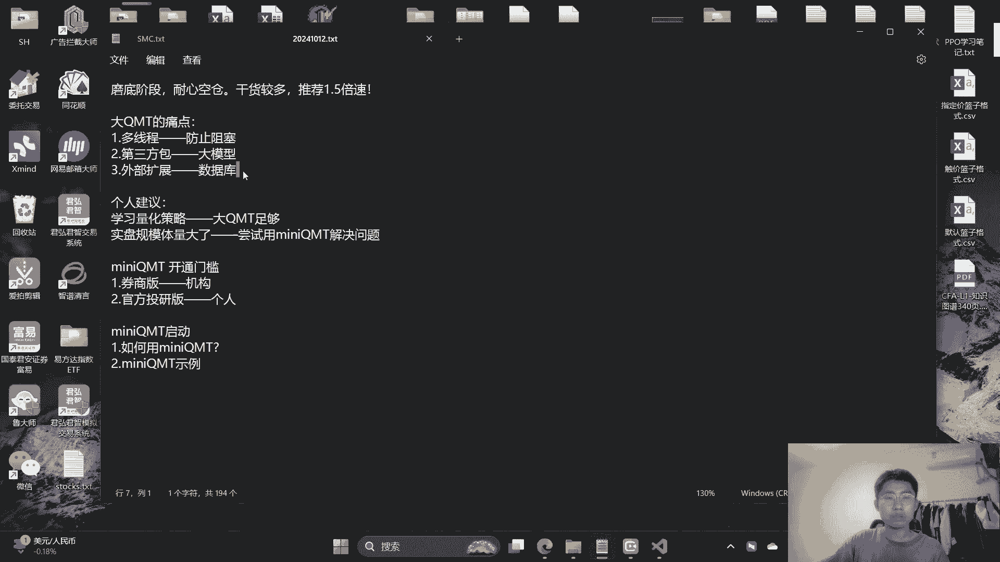

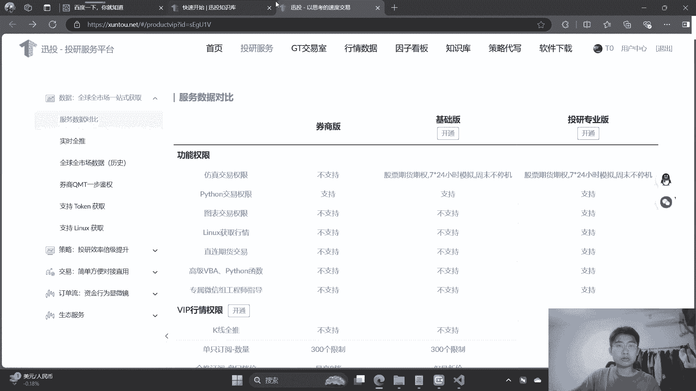

他这边的嗯miniMT它其实是一套通过这个python为基础衍生出来的一个框架。它提供的主要就是python的API接口啊，包括我们在进行客户端就试盘交易的时候，一些最常用的报单撤单啊等等一些功能。

像这样的一些功能的话，其实啊我们一般来说就是相当于是啊平常就是在做交易的时候去使用。但是在投研端的话，其实我们用这个原生这个KMT其实啊用我们大KMT其实做研发也是够的啊。

但是说如果你需要一些更灵活的框架，那么你就必须得要用原生python去做啊，举个例子来说，我们前面提到我们可以用啊我们这边的呃这个个人版的这个KMT然后去去登录去登录我们的原生th。那么我们先打开它。

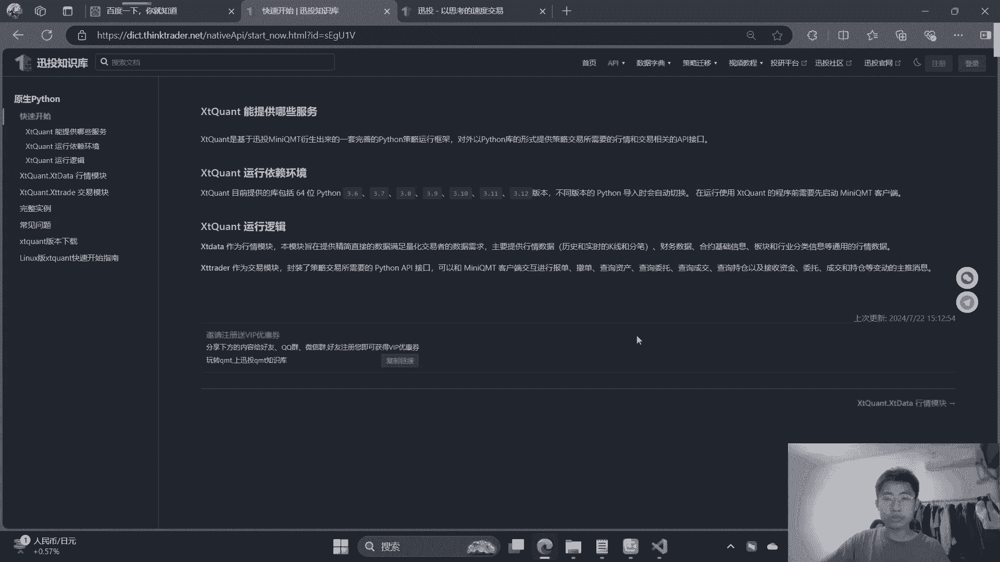

第一步大家请看到，我们先打开它，然后我们去点击我们这边的极速交易，就是独立交易。然后我们点登录。对。好的，这边登录好了以后呢。稍等一下。好，登录好以后，我们还是能看到它和刚才那个券商版的那个是一样的啊。

是一样的啊，这边就是它的一个持仓的一个状况，也能看到我们这边委托的一个情况啊，包括还有成交这些都能看到像这样的账号资金，大家请记住，如果你是在这个官网版去申请的话，你申请了这个账号以后。

你还得要到你的这个个人中心里面去，然后你要点击这个模拟撮合啊，这边你会有你的这个资资金账号你这边要去用你的这个账号去到这边去绑定一下啊，去绑定一下到这边去绑定起来。然后你这边去绑定好了以后呢。

他就会给你把你的这个账户给你导进去，然后进去了以后，大家可以去看到我这边有这边是有委托的。然后首先先来先来说明一下，就是说我们这边的为什么要用这个minMT啊。因为我们在原先使用这个大QMT的时候啊。

就是我们比如说我再举一个例子来说我们再进一个就是我们个人版的这个MT。

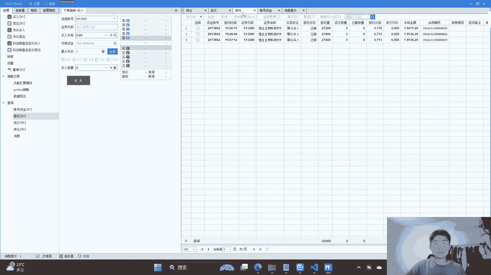

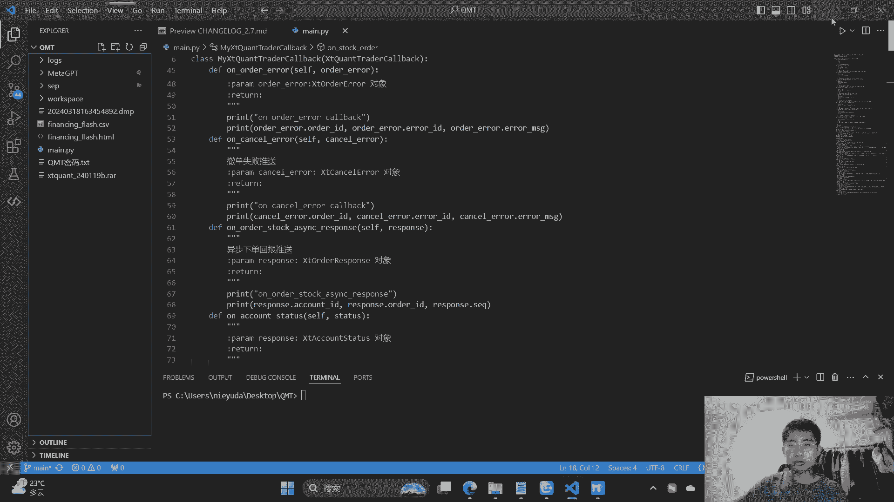

嗯，这个是我们个人版的，个人版的话，我们现在不能不能进那个呃minicM，就把这个勾要去掉，然后我们这边点登录。

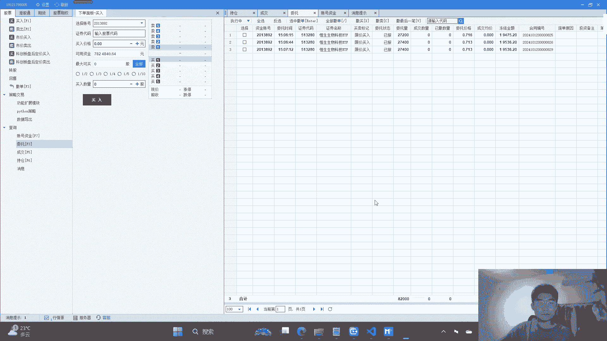

大家也可以很明显的看到这个miniKMT它这个界面这两边其实它有我们原生大KMT这边功能栏是很多的啊，但是我mini kMT这边什么都没有啊，它就是一个交易界面啊，它就是一个交易界面。

那么进入我们大KMT以后，我们这边可以去看到啊，我前面有提到过我们这边的实盘的时候，我们是进入模拟交易啊，这个模拟交易的话，从这边可以看到的是啊我们的一些啊函数。我们的一些函数。在这个里面的话。

它这边啊。

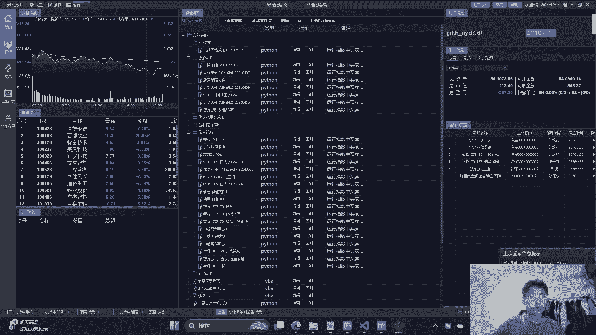

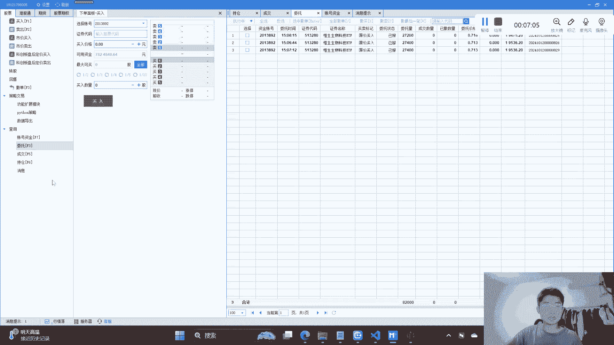

呃，有实盘。那这个实盘的话，其实啊我们如果同时去启动，大家可以去看到。如果我们同时去启动的话，比如说我启动这个趋势策略啊，然后再启动它。嗯，我们想要的结果是什么？我们想要的这个结果是说我可以再跑。

同时就是说同时去跑趋势策略和跑支损策略，它是可以就是这种啊互相去啊互补的，就是比如说我的止损策略，这边是加了一个定时器，可能是我每毫秒去跑。就是说每每100毫秒去跑一次啊，但是呢你会发现的话。

其实他们这两边。他的这个速度是不匹配的。包括这边是不匹配的那就会有一个问题，就是说我这两个策略它其实是。跑在一个县城里面啊，或者说他们之间这个线程是会主色调的。所以呃很多时候我们这边我当时有测试过。

就是呃整个这个QMT大QMT里面，你要想真的是把这个线程区分开了，就是一个线程专注在做一个策略，他想做的事情啊，MT这边是比较困难的啊。所以为了解决。

因为他们策略之间就是说我可以更多的使用单核去处理这样一个线程。包括说可以更多的把这个他们这个服务器的多核的这个功能发挥出来的话，这边就必须得要用到我们这个minMT了啊。

因为我们minMT它是用thon这边去做API接口的。那么从我们这里面可以去看到的话，我们其实呃只要写这么一个程序啊，我们用一个不同的这个python的这个绘画的编号，我们可以作为一个不同的策略。

那其实只要大家会知道呃我们不同的python这个程序，它可以我们用不同的这个进程或者都可以去处理啊。那这样的话其实就很灵活，我们可以把我们嗯不同的核心不同的进程，或者说不同的。

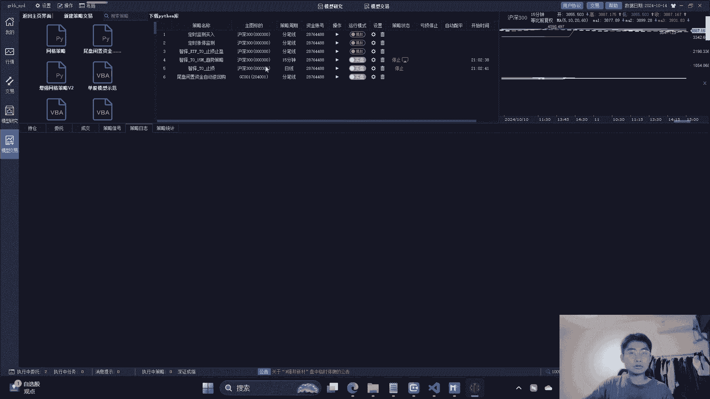

呃不同的策略，它可以并发的去跑，这样就可以形成很高效的互补。他们之间也不会被阻塞掉啊。这个我觉得是一个呃第一第一很重要的原因，就是我们这边用啊用去做它比要好的一个地方。

那么第二件事情就是说我们这边用这个原生的这个实我们在自己的这个ID里面去编写这边我用的是VS code那自己去编写的话，那它其实就会非常的方便啊，我们去做一些扩展啊。

比如说我自己这两天在研发的就是用这个PT啊，它是一个大模型的一个框架。那么我们就可以啊去探索一下怎么样用大模型的框架和我们这里面的原就原生的这个API接口做结合啊。

以至于我们可以实现的功能是什么我们可以实现的功能是我们直接可以用大模型去做交易啊，这个也是我想去探索的一件事情啊。如果说后后面有机会的话，会跟大家去讲一下这边的思路。是什么？总之大家会知道。

就是我们用原生配原生pathon的就个KMT可以实现我们和外部的这些啊很多的这些呃papython的一些智能库的这些做连接啊，这个是大QMT它很难去具备的啊啊OK那么。说到这个地方以后。

就是呃还有就是我们这边说过用大QMT的话，还有就是它的这个外部扩展和数据库啊，这个也是一样的，它就可以外部去打通啊。嗯然后我个人这边建议的话，就是我们这边的大QMT的话。

就是啊其实用来去学策略是足够的啊。我们建议新手就是在大QMP上面先把自己的一个策略型体系框架先学会怎么去做啊，怎么去用写不同的指标，怎么去做不同的策略。我一直在强调的事情就是啊量化交易。

其实最核心的是做交易啊，量化只是一个辅助的工具。如果你是一个交易的一个很厉害的人。那么其实你不用量化，你也可以把交易给做好啊，量化就是让你的这些交易的思路和策略能够更好的被执行啊，O当然当然了。

比如说如果说你量化交易这边，你就和这种大模型做结合。像这种GPT做结合的话，那其实它就是一种很棒的工具了啊。呃，O那么后面的话就是说如果我们。呃，的实盘体量规模大了。

那么那个时候我们可能必须得要用一些多线程去解决一些交易的问题啊。那个时候我们就推荐就是用miniMT，然后我们这边去想办法去使用它，然后这样的话，我们就可以啊形成一个就是比较完善的一个系统。

是跑我们的这个上规模上体量的这个实盘。嗯，这个就是我现在呃关于就是miniMT的一些啊啊为什么要使用它以及就是说我们新手应该怎么去使用它的一个建议啊，然后启动的话前面已经有讲过啊，启动的话已已经有讲过。

就是说在我们的界面先勾选那个就是极速交易。或者是独立交易，然后勾选了以后先启动起来，启动起来以后，我们这边可以从官网上面这边去。

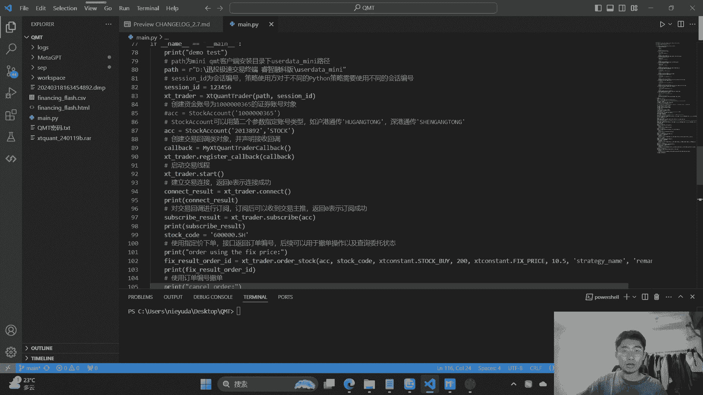

下载一个示例，然后这边可以就看到有个完整示例。我推荐大家可以去看到这边的一个就是简单购买一次这个事例，把这个东西全复制起来。

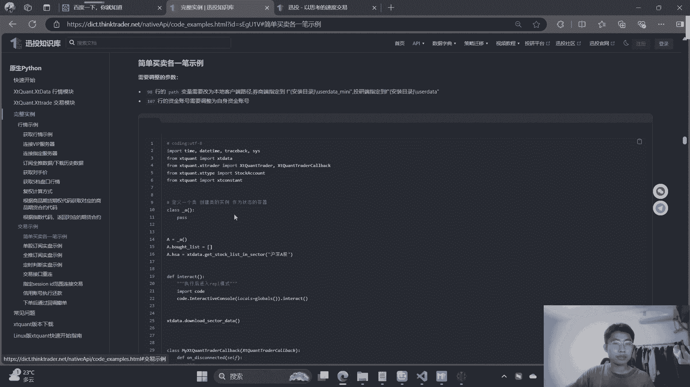

全复制起来以后，打开我们的编辑器啊，我们比如说这样一个面函数。把我们这代码都粘贴到这个里面来。粘贴好了以后，大家可以去看到它下面有注释说怎么去使用这块代码。比如说我们就把他们前面第一行这个是要做替换的。

我们就把这个路径替换成你的这个QMT。比如说我这边是官方的QMT它就要替换成官方QMT这个呃它的里面这个us data这个路径。这个路径的话，比如说我们在官方这个里面啊，我们可以进来这个是官方的。

那么我们进来了以后啊，这边就能看到它这边有一个us datamin啊，这个都会有的。只要你是按照MT都会有这个目这个目录，那么你双击进去了以后，然后你把这个路径复制下来，把上面这个复制下来。

然后回到我们的这个MT然后我们把这个东西粘贴到这个地方啊，这个是路径先选好。后面的话就是把我们这边的这个账号账户号给选好啊，这个选好以后剩下的话就没有什么态多需要去改的了啊。

其实就这两个其他的地方都不需要变。然后这两个修改好了以后，我们可以从这边直接去先看一下我们这边的一个极速交这个界面。

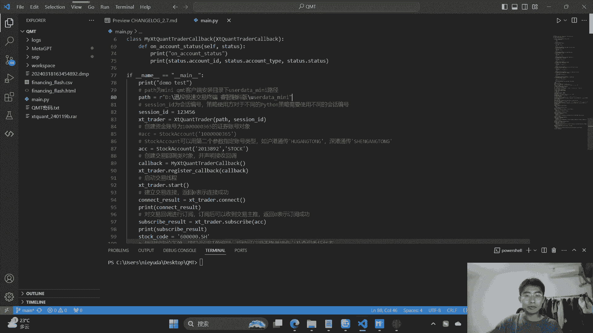

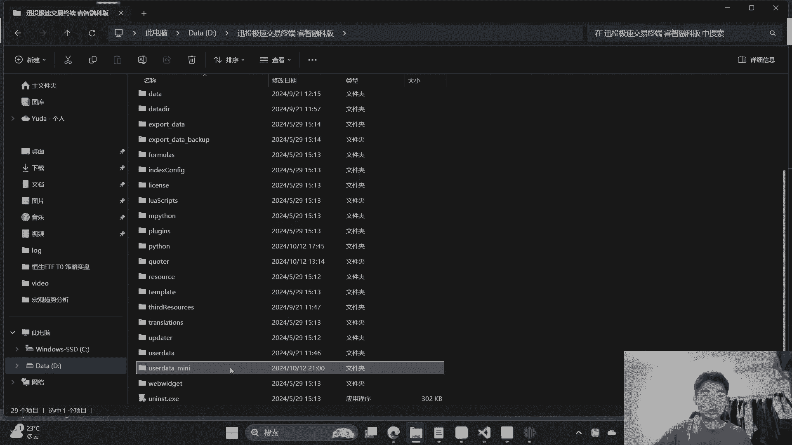

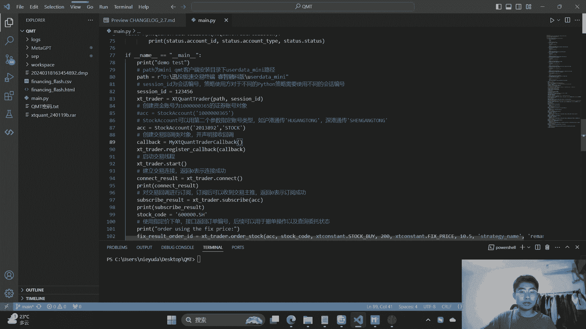

大家可以去看到这边什么都没有，委托，这边什么都没有，对吧？这边只有3笔是我手动的委托。那么从这边去启动的话。

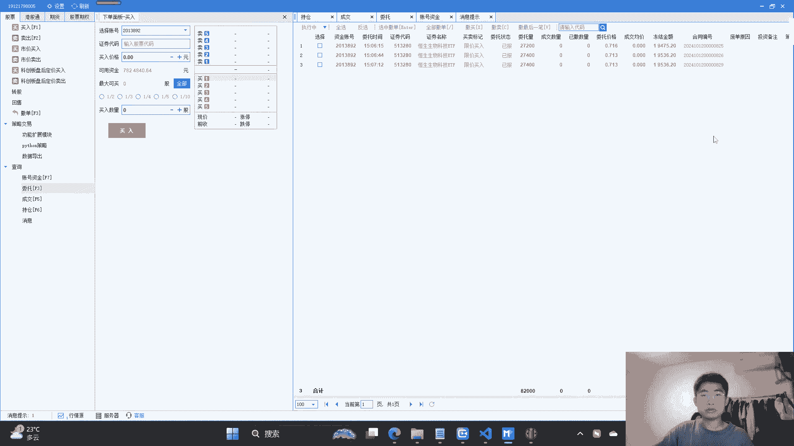

我们要拍s始，然后这边去跑这个内函数。好，密函数的话，点回车，大家可以看到啊这边的这个日志就有反馈啊，就说我们这边他做了一些什么事情，然后建立了会画，然后他有发发起的查询订单等等一系列的啊。

大家可以去看注视。然后大家可以回到这个地方就能看到我们这边的成交啊，刚才这边的成交浦发银行啊，刚才买了这这呃做了这两笔啊，然后。

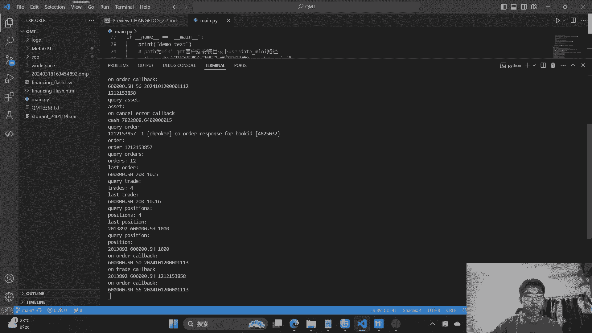

持仓又多了，这个是在刚才9。09对吧？9。09这个时候去去做的啊，剩下去买入。

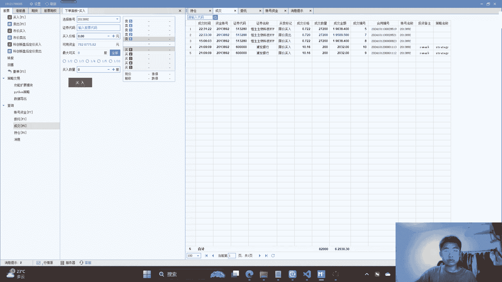

两笔。那这样的话大家就可以实现了我们在这个用我们自己的IDE，然后通过我们的命令行实现了我们的一个下单啊，那这其实和我们之前用在这个M界面上去下单，有本质的区别啊。我们这边可是用直接用代码去下单的对吧？

没有用任何的它的交易界面上的按钮啊，所以说我们这边可以写出一些更加灵活的一些交易交易的一些策略啊，啊，但是它的这个问题，它是不能做回测的啊，它不能做回测。所以这边只是用来去做交易啊啊。

所以我也是推荐大家在这个大KMT里面可以去做一些投研相关的研究。那么研究好了以后，可以在这个我们的迷你KMT里面主要是做实盘交易交易的一个优化。

把你的这个策略用它这些函数然后写成实盘的这个方式然后这样去做实盘跟实盘的交易啊，这样的话也是一个比较不错的一个最佳实践。嗯，好的，那么今天就是跟大家去分享一下我们这个原生这个KMT啊。

怎么去安装怎么怎么去使用。啊，它原生KMT的这个安装其实大家啊可以去呃去留意一下。就是我们其实很多他们这个M这个都是已经给你去安装好的啊，官网上面说的是你的这个原生的这个KMT啊。

它的这个安装方式是让你去这边去下载这个X框的这个版本啊，你可以这边可以去看到，你可以去下载下来啊，下载下来以后，你要把它放在什么地方去解缩呢？你要把它放在你的这个呃你的安装目录里面。

然后你要点到这个里面去进去，后点内库，然后这边去再去看它的这个一个set package的一个包啊，对，进去以后，在这个里面啊，大家可以看到它官方其实啊它都已经给你去安装好了这个X。

所以说很多都已经都做都是现成的。如果他这边没有现现没有安装好，那你就把官网这个东西。

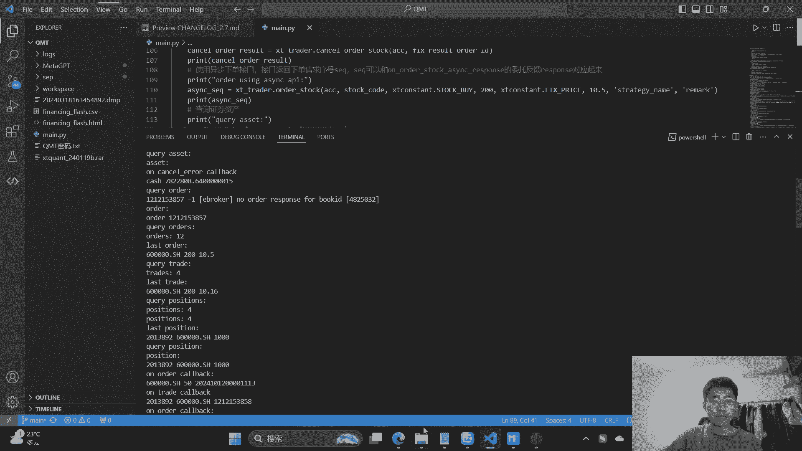

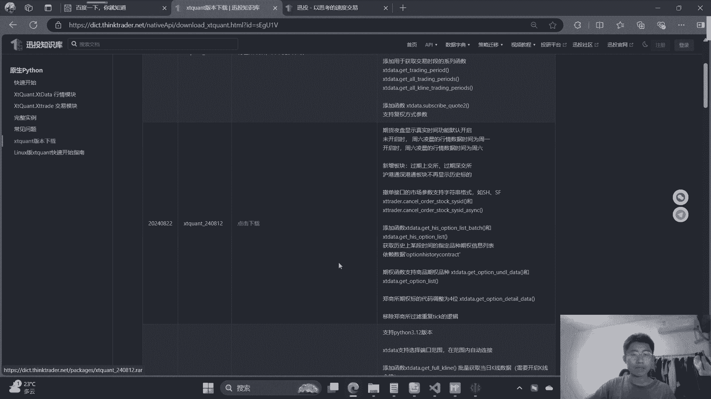

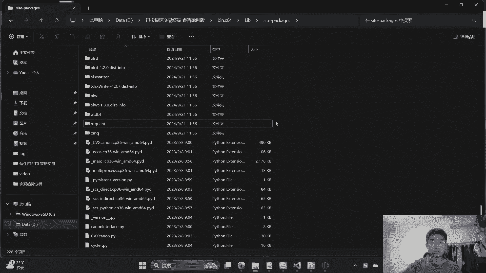

下载好去解压缩到这个地方，然后你就可以去使用了。

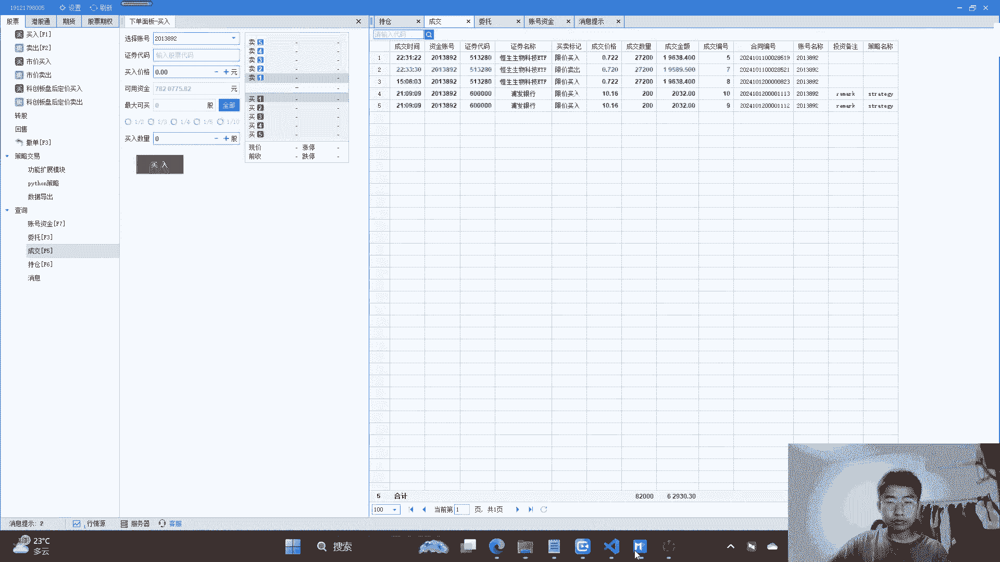

那就是这个就是呃跟大家去分享的他怎么去安装啊。那今天的话其实啊的内容主要就是针对啊minM的一个使用，以及如何开通，以及为什么要用的一些简单的说明。

那么在以后的话有机会的话也会跟大家去介绍一些就是min原M一个实践啊，但是呢后面你还是主要跟大家去介绍这个大KMT去编写策略是比较多的。因为大家首先先要去学会怎么在大MT里面去写的策略。

那么这个minMT其实是对你策略做一个锦上添花的事情。然后切记大家不要本末倒置，以为用了这个minMT，就是要比大MT要厉害啊，其实最核心的还是要做策略，你要学习不同的一些做策略的方式。

以及对于委托种种一些订单的做管理的这个很多一些细节性的问题，你要在大M里面先把这个基本功打扎实了以后，然后才能后面才会更好的去做交易。O那今天的。分享就到这里。

也是啊欢迎大家就是有什么问题在评论区去提问。好的，谢谢大家。

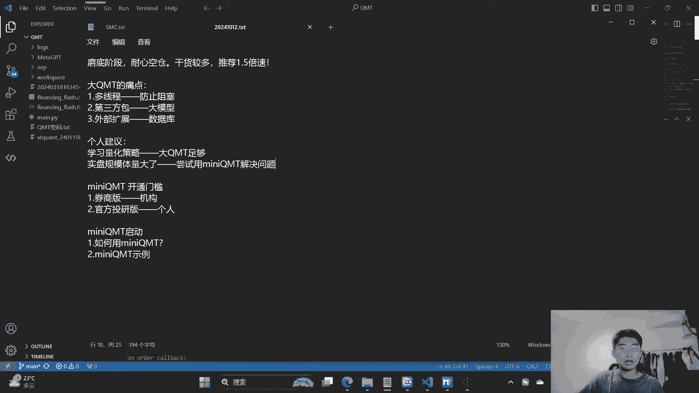

嗯m。