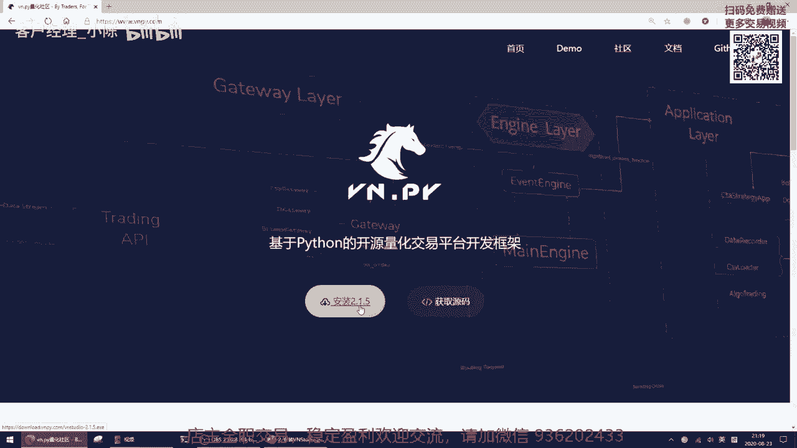
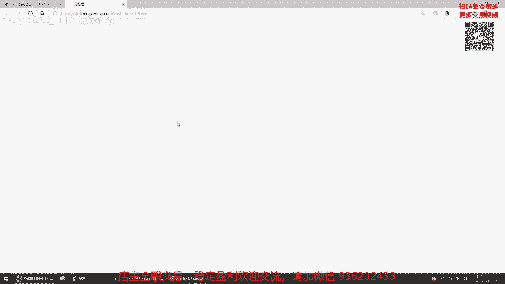
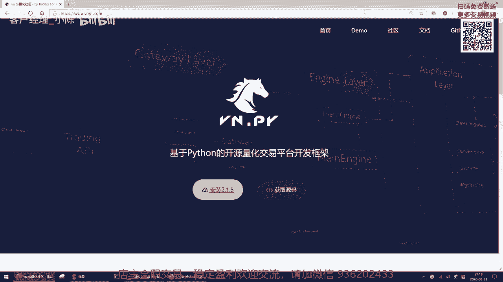
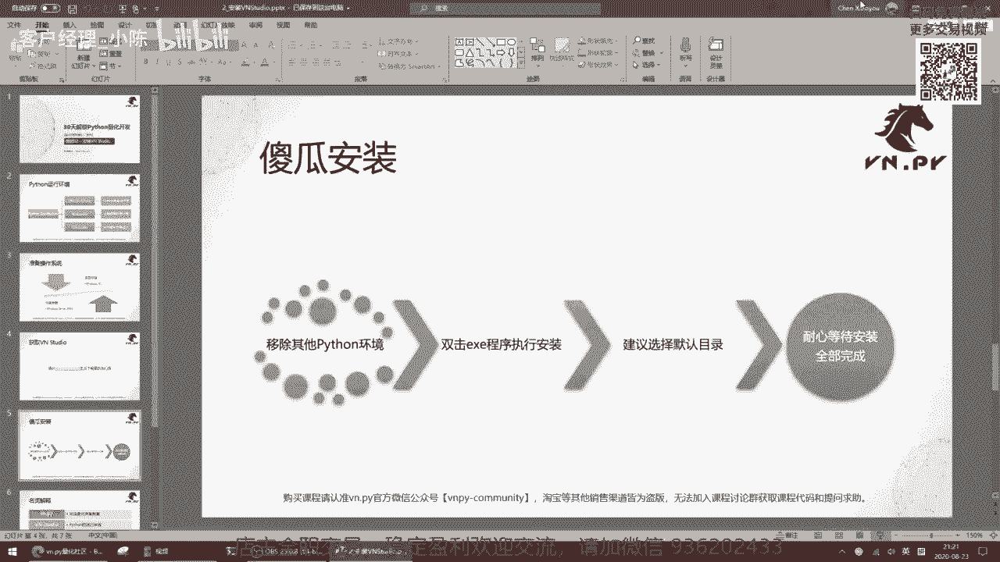
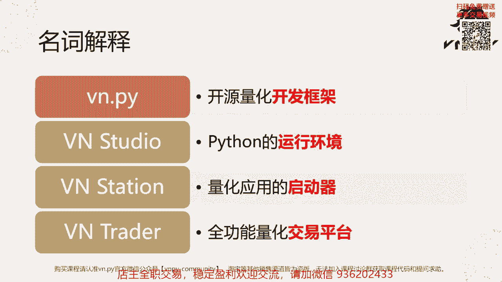

# VNPY30天解锁Python期货量化开发：课时02 – 安装VN Studio - P1 - 客户经理_小陈 - BV1Ses5eVEJw

OK欢迎来到量化交易零基础入门系列，30天解锁Python量化开发课程，那么今天呢是我们的第二节课，在上一节课里面呢，我们已经初步认识了Python这么一门编程语言，在这节课里面啊。

我们就来先把运行Python要用到的，这么一个运行环境，VN studio给安装上，那首先啊我们要来认识一下，什么叫做Python运行函环境呢。

它的英文呢叫做Python distribution或者直译过来啊，可以叫做Python发行版，那啊我们这边举了三个例子，也是可能啊三个这个不同领域比较经典的例子，首先第一个啊。

最为最为常见的Python发行版是叫做official Python啊，Python官方版本它是由Python基金会开发和维护的，那么在这个版本里面呢，它只包含了Python的这个啊解释器。

以及Python的这个内置库啊，只有这两个东西，那如果用它来做，比如说数据运算啊，在做这些啊，做一些分析的时候，可能呢你会缺乏各种各样的工具包，比如说我们上节课里面提到过的囊牌pandas啊。

而你如果要去手动安装机械工具包的话，那确实可以装啊，装肯定是可以装的，但是对于新手来说，很容易掉到各种各样的坑里面，而且这些坑呢啊有可能让你好几周都爬不出来，所以非常的麻烦啊，尤其对于我们新手来说。

我们不想去折腾这些啊，这些安装啊什么的，我就想用对吧，那也就有人很聪明的打包了这么一个啊，叫做针对科学计算的版本，安娜康达啊，这个安纳康达是由一家美国的安娜康德公司。

专门针对科学计算打包的这么一个Python发行版，那它除了official Python里面的这个Python解释器，除了这个Python的官方内置库以外，还加上了这些啊用来做科学计算的很多库。

那最后的这个VN studio啊，和ANACONA比呢更多是一个目的上的区别，它也是一个我们呃由via派官方啊，就我们团队打包的这个Python发行版，那我们更多是针对量化交易方面的应用，去设计的。

所以啊除了这些比如说用来做啊策略研究的，像囊派啊，pandas as啊等等啊，这些库以外，我们还额外打包了，比如说像边点派啊，像很多的底层交易接口，像比如说像贴lip这样，用来做技术指标运算的库啊。

还有比如像fix engine啊，fix引擎这样用来啊对接fix交易服务器的，这样的一些库，所以呢在我们接下来的课程里面，我因为啊我们这个课程是针对量化的这么一个，Python入门课程啊。

所以后面我们都会基于VN studio来讲，那这边呢也是第一步啊，我们要先来准备一个操作系统来运行我们的Python，在这里啊，我把它分成了两块，第一块呢叫桌面环境啊，什么叫桌面环境。

你的桌子上放着的电脑啊，不管是笔记本也好，还是台式机也好，它就是我们的桌面机器，一般在这样的机器上，现在都2020年了，可能最多哈，大家用的都是windows10了，当然了。

如果你还在用老一点的windows8，windows7等等，也理论上也可以运行这个我们的VN studio，但是呢万一啊，因为毕竟这个所有的软件，在操作系统上运行的时候，都有一些操作系统依赖。

万一你的那个版本可能正好太老了，有些工具没有啊，就跑不起来的话，我建议最简单的解决方案还是做一个升级，你把它升到windows10就行了，同时呢后面其他的一些哎，你运行的其他程序啊等等，也可以从中受益。

所以应该来说还是性价比最高的方案吧，另外一种选择呢就是云服务器了哈，这也是得益于现在比如说阿里云，比如腾讯，比如说海外的亚马逊的AWS的普及啊，你随随便便就可以，很方便的在网上注册一个云服务器。

然后远程桌面登上去用它了，那对于云服务器呢，我们统一推荐的都用这个windows server的最新版本啊，就是windows server2019啊，你不要用这个老的那些082012。

2017啊等等啊，这些都别用了，有最新版2019，我们就用最新版，同时呢windows server，2019的内核和windows10是比较接近的，也是我们VA派官方啊，我们自己用的环境。

所以VN studio在这两个操作系统上，有最完善的测试啊，我们也在这里呢，建议大家如果自己要选的话，就选这两个操作系统，那操作系统准备好了，下一步呢我们就可以来装这个VN studio了啊。

我们先去3W点VNPIDOCOM，主页上来下载一下。

那在这儿我已经打开了哈，边界拍com的这个主页，也是我们编得派这个开源项目的官方主页，那打开之后呢，在这里有一个黄色的按钮，叫做安装2。1。5啊，随着我们没有一个新版本的发布，这个按钮的版本号会变啊。

如果呃可能再过一个月2。1。6发布的，它会变成2。1。6等等啊。

反正会不断的变的，但你永远记住这个按钮，点它之后下载的就是最新的版本的VN s studio啊，点一下，然后就开始下啊。

下到桌面上就好，那我这边呢之前已经下过一个了，所以我就这就不浪费时间。

再下了回到我们的PPT啊，然后就直接双击运行VN studio，开始做我们的傻瓜安装了，但是在这啊，在开始装之前，在你双击那个按图标之前，我建议一件事情叫做，如果你电脑上装过其他的Python环境的话。

请把他们都先移除掉啊，只留着vs studio就行了啊，只留着我们等会儿装的vs studio就行了，现在先把老的都卸载掉，之所以要这么做呢，是因为Python它本身啊。

在运行的时候需要有一些环境变量的支持，那同时装多个Python环境的时候，有可能造成A环境和B环境之间的，这个环境变量污染啊，就导致一些很奇怪的行为，比如说这个启动不起来啊，那个一运行就崩溃啊等等。

所以啊当然学到我们大概30多节课的时候，我们会讲到这个Python环境变量的啊，一些管理一些配置的内容，到那个时候你会你你会去掌握，说哎我同时有多个Python环境时候，我怎么样让他们共存。

我怎么样正确的去管理啊，但在现在来说啊，对我觉得对于这个我们初学者来说，太复杂了一点，所以现在我建议大家都把他们给啊，老的其他的这些Python环境都给移除掉，都给卸载掉啊，只装vs studio。

等到后面你学会了之后，再把其他的给装回来就好了啊，然后直接双击ax e程序安装就行，那安装的时候呢，你唯一要选的就是这个安装目录，我们推荐大家还是选默认目录啊，因为我们后面讲课的时候，我们再讲。

比如说你要修改点点拍啊，这个某个目录下的配置啊，或者说你要去找到，并且派内部的啊，某个源代码文件去看一看的时候，我们给大家讲那个目录的时候，都会以这个目默认目录为准啊，所以你如果装到别的地方去了的话。

你记得要把我们的这个默认目录改成，你这自定义自己装过去的那个目录啊，最后呢就耐心等待安装的全部完成了，那在这呢我们就来啊双击运行一下看看。

直接双击运行这个按钮啊，它会啊弹出这个对话框，直接点下一步啊，选择你要装的目录，这默认目录呢是C盘下的van studio目录啊，我这边就不改了，我直接点下一步啊，然后因为我这里啊这个已经啊。

我之前已经装过这个vs studio了，所以他会有这么一个提示，但如果你电脑上有的话呢，我建议还是先把别人studio给删掉啊，再去装，那我这呢因为就只是给大家演示嘛，所以我就我就直接点yes啊。

让它覆盖安装就好了，如果大家的话，我建议是卸载啊，不不把那个啊vs studio目录删掉了之后再来装，然后点了yes之后，这有个许可协议啊，直接点我接受此许可，然后下一步就好了。

这个许可协议是一个Python官方的许可协议啊，然后点下一步，选择一开始菜单的快捷方式，也直接下一步，然后点安装按钮啊，这边呢就会弹出有可能啊会弹出一个。

这里有可能会弹出一个是否要啊，允许啊，的这么一个windows提示啊，注意要选是啊，允许它修改，那这呢就开始安装了，我们可以看到好，下面你点了这个显示详细信息的按钮之后，这里呢会能看到啊。

就现在这个安装程序正在做哪些事情，他正在一步步把内部的这些啊文件解压出来，然后呢执行啊这个把复制到对应的目录，最后呢再把啊整个系统的操呃，这个环境变量对应的给啊，这个这个设置好给绑定起来啊。

最后就完成了安装，那么取决于你电脑速度啊，快的可能5分钟就装好了，慢的呢可能要花个20分钟，甚至老一点的机器可能花个半个小时啊，那么我们这边就不等他了，我们就继续回到PPT讲我们下面的内容。

啊最后呢我们来看一个叫做名词解释吧，啊因为呃这里我们主要列出了四个词啊，Vn depi，Vn studio，VN station和VN trader啊，对于很多刚入门啊。

或者说刚接触van der pad的用户来说，你可很有可能就遇到这四个字很懵啊，都是VN开头的，那他们其实指代的是不同的东西，它们之间肯定都相关的嘛，说白了都是由我们啊via派官方。

我们这个开发出来的程序啊，但是他们首先是不同的程序，也有不同的作用，那第一个词呢就叫做VENDER派，注意VENDER派所有的字母都是小写的啊，中间有一个点字啊，就这个这个开源社区里面很多人喜欢念。

就叫做边NPY啊，这个呃也不能说错吧，但是我们官方可能更喜欢的名字是别人得派哈，那么啊DENTI派是一个开源的啊，针对量化开发，量化开发的这么一个框架啊，说白了它也是一个Python的这么一个包。

或者Python的这么一个库，和non派和pandas和MATTAPOLIB，和这个什么tensorflow or等等都一样，都是一个包，那么只不过比如说南派是针对矩阵，矩阵运算的。

pandas是针对时间序列的啊，TENSORFLOW是针对机器学习的，VUE派，主要针对的就是量化交易这么一个功能啊，所以它只是也是一个包哈，针对这个量化交易的这么一个包，然后呢是VN studio。

这个我们刚刚讲过了，是一个Python的运行环境，这个运行环境是我们针对量化交易打包的啊，有Python的解释器，有Python的官方库，也有这一系列用来做量化交易的这些三方库啊，所以都在这个里面。

也就我们刚刚装的那个东西嘛，然后是van station啊，它是一个量化交易应用的启动器，什么意思呢，你做量化交易的时候，有可能你要启动这个啊，这个这个交易程序，有可能你要启动一个交互式的研究环境。

有可能你想要对你的某个策略源代码做个加密，有可能你纯粹只是想打开via派的官方网站来啊，很快的啊，这个提问或者说呢甚至有的时候哈，我们变得派官方有更新的时候，你希望可以实现一个一键更新。

那van station这个程序就是用来做这些事情啊，所以它是一个启动器，它本身并不提供什么啊，很复杂的功能，它就是用来把别的那些东西给你启动起来的，所以在你装完VN studio之后啊。

桌面上会出现一个啊白底黑色码头的图标，这个图标呢就是啊它的名字叫VN station啊，就是这个启动器双击启动之后呢，他需要你啊这个微信扫码注册一下啊，注册完了之后直接登进去，你就可以看到主界面。

然后如果你用VN station启动器，你要去启动，或者说你要去跑实盘的量化交易的话，那此时呢你就会起到VN trader了，VN trader是另外一个啊，这个这个图形界面的程序啊。

不是这个VN station，它是另外一个，就是你点完启动之后会另外弹出一个窗口来，那么这个VN trader是一个啊，我们全功能的量化交易平台，那更你可以用它比如去接CTP的交易接口。

去做我们期货实盘交易，也可以去接，比如货币也OK的接口，做我们数字货币的实盘交易，也可以借IB这样的接口去做外盘的啊，实盘交易啊，同时它内部也内嵌了，比如说CCTA策略回测啊。

比如说这种啊实时行情额数据的呃，呃录制到数据库啊等等一系列的应用类功能啊，那么这些呢是van trader这么一个量化交易平台，所能提供的功能，所以最后我们总结一下，就是va pie是开发框架啊。

是一个包，van studio是运行环境，是一整个，这个我们刚刚装的这么一个Python的运行环境，win station呢啊是一个启动器，你可以把它理解为就是点完快捷快捷方式之后，弹出来一个小界面啊。

就你要启动什么，点一下按钮，它就能给你对应的启动出来，那就不用我在桌面上放上一堆图标了，如果没有这个启动器的话，其实我们还有另外一个方案，就是每个功能我给你在桌面放一个图标啊，那个肯定就很麻烦嘛。

所以我们就专门做了这么一个启动器，最后呢是这个van trader啊，van trader就是更多我们用来做实盘交易，我们用来做各种量化交易的时候，用到的这么一个交易平台。

所以这四个名词呢啊其实我这么讲完，可能有些人还有点懵啊，也不用担心也没关系，因为在我们接下来课程里面，我们会一点一点的，实际在操作里面接触到这些啊，每个不同的组件，到时候我们还还会提到这些名字的啊。

在学到比如说到20节课，30节课的时候，我相信你对这些词一定非常清楚了啊，不会再出现蒙的情况。

OK那么好这集的内容呢就先到这里啊，然后更多精华内容，还是欢迎扫码关注我们的社区公众号啊。