# VNPY30天解锁Python期货量化开发：课时04 – 编辑器的选择 - P1 - 客户经理_小陈 - BV1yws5eNEXz

OK欢迎来到量化交易零基础入门系列，30天解锁Python量化开发课程，那么今天呢是我们的第四节课，在上一节课里面啊，我们完成了学习Python语言的第一步，打印hello world之后呢。

在这节课里面，我们要来看一看我们对于代码编辑器的选择，那么如果你去啊百度或者你去google上搜诶，我想学Python，我用什么工具来写好呢，那很有可能你得到的这个信息啊，会整体上分为两大派。

编辑器和这个叫IDE，那这两派呢他们都是所谓的代码开发工具，说白了都是可以用来写我们的Python代码的啊，但是也有所区别，主要区别在哪呢，就是IDE可能相对更重一点。

他的英文啊叫做integrated development environment啊，集成开发环境，那么在Python领域比较知名的IDE，最知名的可能是py charm的啊。

这个是jet prince公司推出的啊，另外一个呢是这个叫win ide，那么同时win id也是我们VN点派官方啊，在写1。0版本的时候用的这么一个编辑器，另外一类呢叫做这个就是代码编辑器啊。

或者英文叫code editor，或者你说的这个简短一点，它就叫编辑器，那编辑器对比到IDE来说会更加轻量级一些，轻体现在哪呢，第一个启动快啊，第二个安装的文件小，第三个你要学习的概念少啊。

所以我们python2。0开始啊，不好意思，Van der pi，2。0开始，我们官方用的这么一个开发工具，统一从win ide e上转到了vs code上，主要原因呢，就是确实哈。

这个用起来有很多时候感觉更顺手一些，另外还有个很有名的编辑器呢，就是这个sublime text啊，当然这个是一个收费编辑器，我们在这边就不多说了，那在我们这个课程里面啊。

同时也是我们对于所有哈初学Python的啊，这个这个同学的建议就是，不要去用py charm啊，不要用PYCHARM，PYTHM确实非常非常强大，他这个可能是啊Python ide里面最强大的一个。

它既可以用来写网站啊，就是写这种web应用，比如jungle flask啊等等，也可以用来做一些诶，这个大数据分析方面的应用等等，它有很多功能，但是它有很多的这个要你额外去学的知识。

比如说哎项目怎么配置，比如说这个我就是直接要运行一个文件，但是这个文件也是有一些环境变量，要你先提前给设置好啊，这些都是提高了我们的学习啊成本的，所以对于初学者来说呢，我们建议大家还是从最简单的开始。

最轻量级开始就用vs code啊，你只需要掌握最基本的内容，你就能开始把你的Python程序先给跑起来啊，未来真正你有需要的时候再去学PYCHARM，这个也很快啊，所以在接下来我们的课程里面啊。

用来写一些比较大短比较长的代码的时候，统一我们都会用vs code来做好，所以这边啊我们就先来把它给装上啊，怎么样装vs code呢，还是一样去这个链接这下一下啊，然后全程傻瓜安装就好了。

我们这边啊先来打开它的网站啊，这个其实是微软官网官方的，就vio studio code下载网站啊，点这个按钮download for windows哈，点完之后就会开始哎切到这个页面。

然后会弹出一个框子啊，让你选择下载目录就下载，我这已经下载好了，所以把它取消掉，那注意一下，如果有些同学可能这儿没有弹出来的话，那么有可能是你的这个浏览器启动了呃，弹窗屏蔽功能。

所以此时呢你要自己手动点一下这个按钮，代入download link啊这个链接。

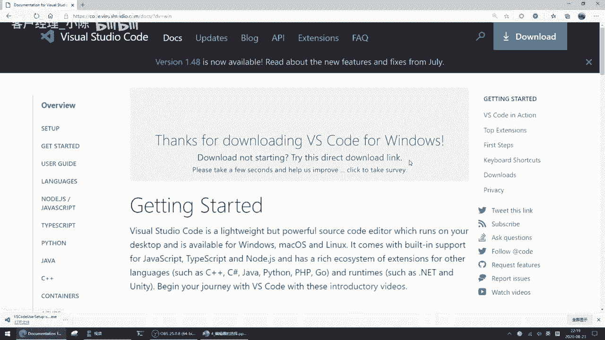

然后来手动下载，反正我这边已经装好了啊，这个装好内容呢。

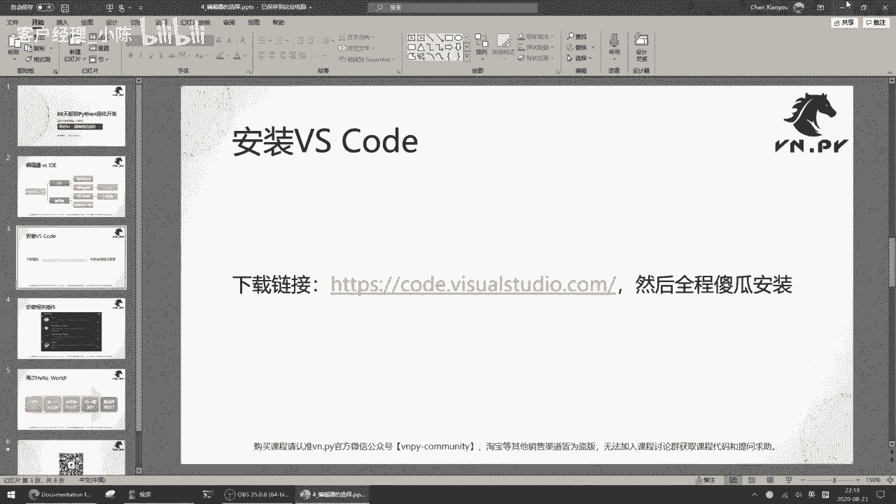

在我们桌面上直接双击它开始安装啊，这个许可协议选一下，我同意，然后呢安装目录就不用改了，也用默认默认目录就好啊，然后啊开始菜单栏给我创建一个啊，然后这边的几个选项啊，那我建议是把它们都给勾选上。

全部勾选上啊，然后点下一步点安装好，非常快就能装好了，这个不像我们之前VN studio啊，因为比较大，它比较小一点，只有200兆，很快就装好了，OK差不多20秒的时间吧，那此时呢他会安装完成了。

桌面上也有这个图标了，对吧啊，这个有个啊运行v video studio code，你直接点完成按钮的话，它就会把你启动运行起来，这样呢我们就看到了video studio的界面啊，很简洁啊。

这边是用来写代码的啊，然后这边呢是啊，你如果打开一些目录啊，或者打开一些文件啊，它会显示在这这边呃，顶部是菜单栏，左侧呢是一些按钮了，我们后面啊讲的过程中一点一点的来接触。

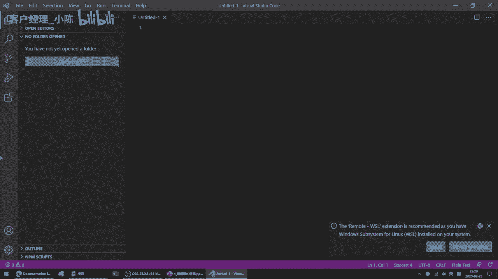

那在这呢我们要先做一件事情，就是安装额外的插件。

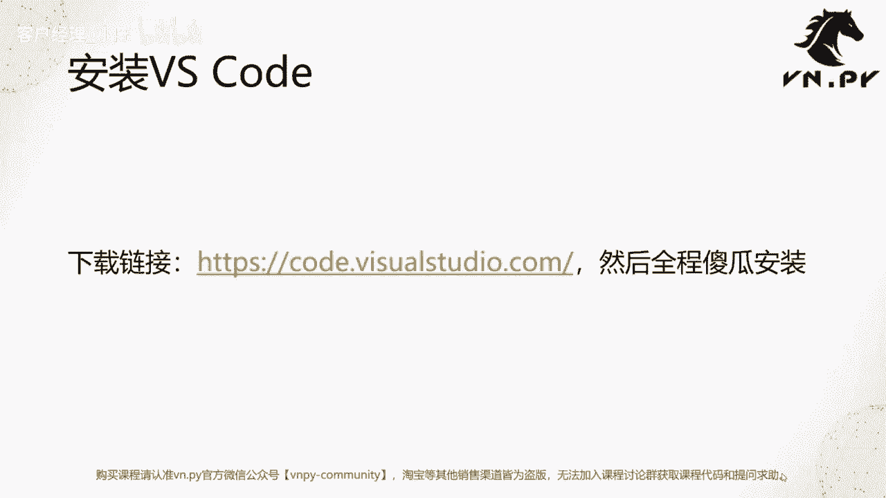

因为确实啊这个编辑器更加轻量级一点，但是呢相对来说哎如果只是编辑器本身，它们的功能可能也弱了一点啊，我们在写代码的时候，还是希望有些代码高亮啊，自动提示啊等等相关的功能，所以我们在这要装几个插件。

就这样列出来这么四个哈。

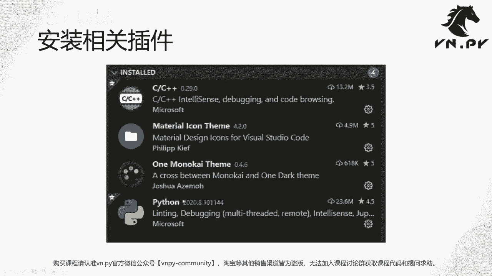

我们一个个装，啊点到这个好，我们的vs go里面找到这个图标啊，长这个样子啊，四这个三个方块啊，然后有个方块在右上角的叫extensions好，然后在这个里面呢啊，其实这个最上面就已经。

把两个我要装的给列出来，一个叫Python，一个叫C加加啊，我直接点这俩安装按钮，先把这两个给装了啊，这个装的还是很快的，瞬间就好了，然后另外一个我要装的是这个这个啊。

叫做这个one monocasim，这是一个配色主题啊，因为啊总会写代码嘛，有的时候啊，我们还是希望对我们的眼睛好一点对吧，那这个诶，啊这个颜色好看一点，我们这个写代码的时候心情也好一些，那这样我就输。

反正就输入就行了，在这个搜索框里面输入，输入出来，第一个我们开始install啊，还有一个东西叫什么名字，唉大家看到装好之后颜色已经变了，看到没，这个颜色已经变成了一个，可能更加哎我眼睛看着舒服的颜色。

在这儿呢你也可以选一下诶，你要选什么颜色，我推荐选这个one mon的改啊，点一下之后，它后面会开始配置，先不管它，我们下面装这个material icon theme，这是一个图标的主题。

啊也是第一个点一下install装就行了，好然后选这个material icon，他会装完之后会自动弹出来，就问你要是其实就是要用哪一个作为你这边诶，这个图标的主题。

那我们可以看到这默认的就这有current啊，就意思就是现在你用的是这个叫什么SETTED啊，就这个也许这发音我也不知道啊，的主题它是VISCO自带的啊，我们觉得不好看。

我把它换成这个叫material icon的这个主题啊，更好看一点好，OK然后这样我把切走再切回来，这个时候呢我们可以看一下，哎，我这现在已经装好的。

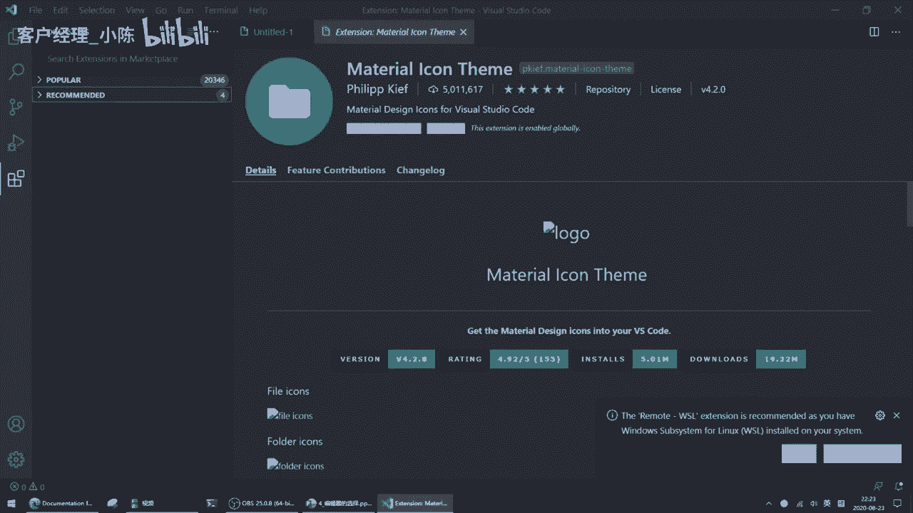

这些应用。

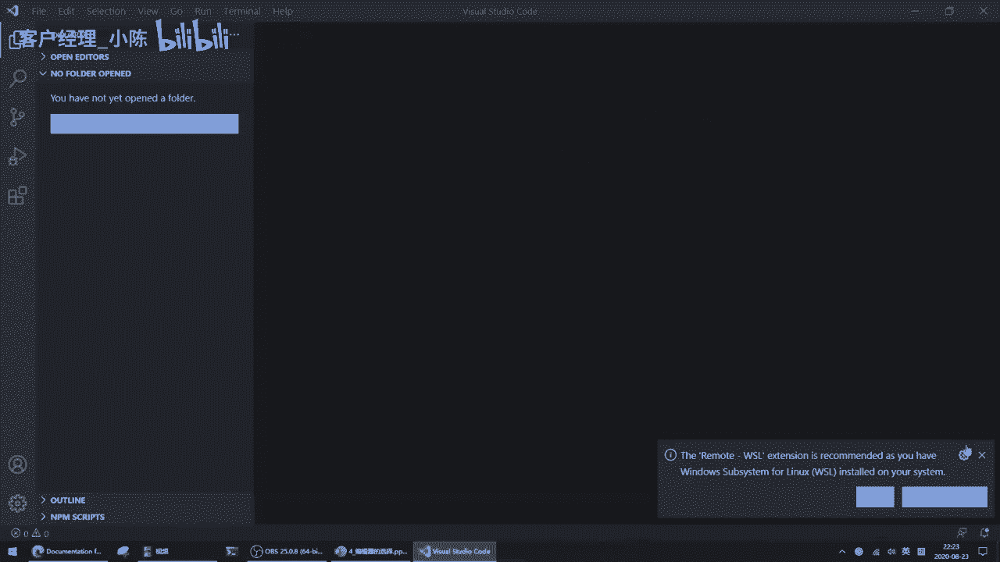

比如说我还是那创建一个啊，就是创创建一个新文件啊，按CTRLN啊，创建一个新文件，我就再次啊做一个那个hello world，Print hello word，然后按CTRLS保存哎。

它会让我保存到什么地方，我就把放到桌面上，run点P，这样保存完了之后，你可以看到诶第一个代码高亮，这个已经有了，它已经变成这种啊，就是不好意思啊，这个这个Python的啊插件。

它装完之后会有一个文档弹出来，其实每一个模块吧，就是装完之后都会有个对应的介绍啊，这个介绍的标签页弹出来呢，这个Python的呢是刚刚弹出来啊，所以没关系，我们先把它给关掉啊，反正我都已经装好了。

这个print hello world，他就这个很漂亮了哈，就这样，然后右上角还有个按钮，你可以点这个按钮，Run python file in terminal，就是运行它哎。

点一下就在底下自动开了一个这个哎，这个这个这个就是terminal，或者说有点像之前我们那个CMD那样东西，你可以看到它已经运行了啊，输出结果就是hello world，非常简单非常方便啊。

这个就是装了Python插件之后啊，可以把我们的这个vs code编辑器瞬间变成一个唉，还是比较好用，比较这个快速的这么一个诶。

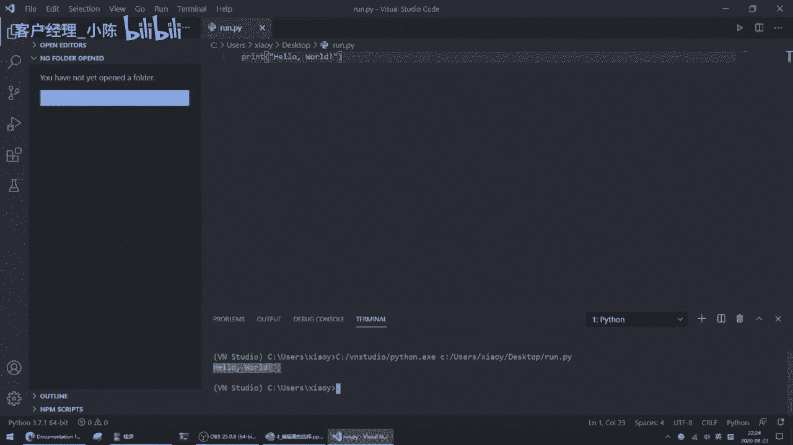

呃这个Python的轻量开发环境。

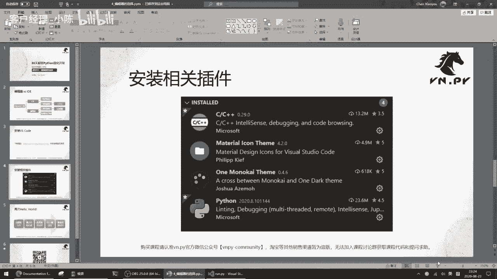

好，然后这边呢这这个步骤，其实我刚刚已经很快的给大家都演示完了，创建一个新文件，输入代码内容，改名保存文件啊，这样保存完了之后。

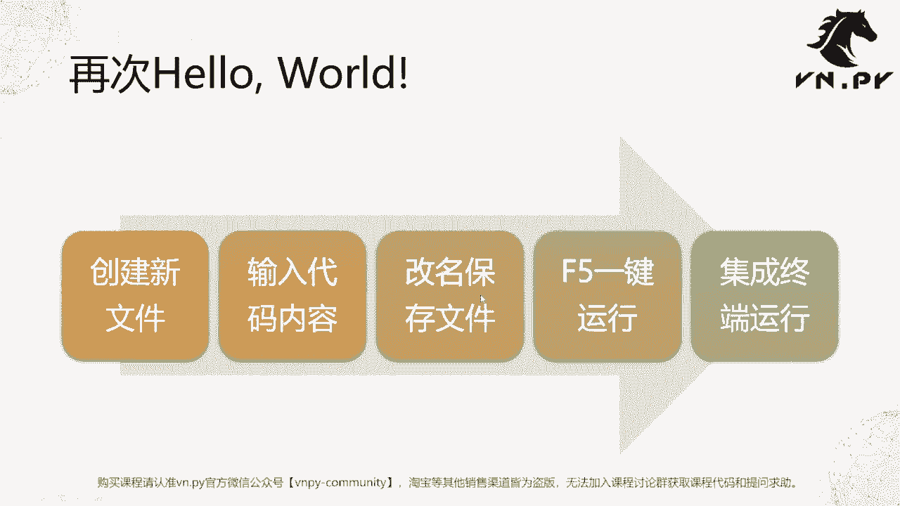

大家可以注意注意到啊，我再演示一下，我创建一个新文件，或者我这次不用CTRL我这个file new file啊，创建一个新文件，然后print helhello，大家注意到现在代码是没有高亮的。

都是灰的，为什么呢，因为现在vs code，不知道你这写的这个代码是什么文件，它有可能是个C加加，也有可能是个Python，还有可能是个纯文档，所以呢你这里要先哎这个file save。

或者你直接CTRLS也行啊，save的时候我把它保存为一个呃，刚刚run点牌已经有了，我改个名字啊，run2点排啊，保存完成一个Python文件之后，哎，这时候vs可的认识噢，你是个Python。

所以呢我就把你按照Python的方式去做代码。

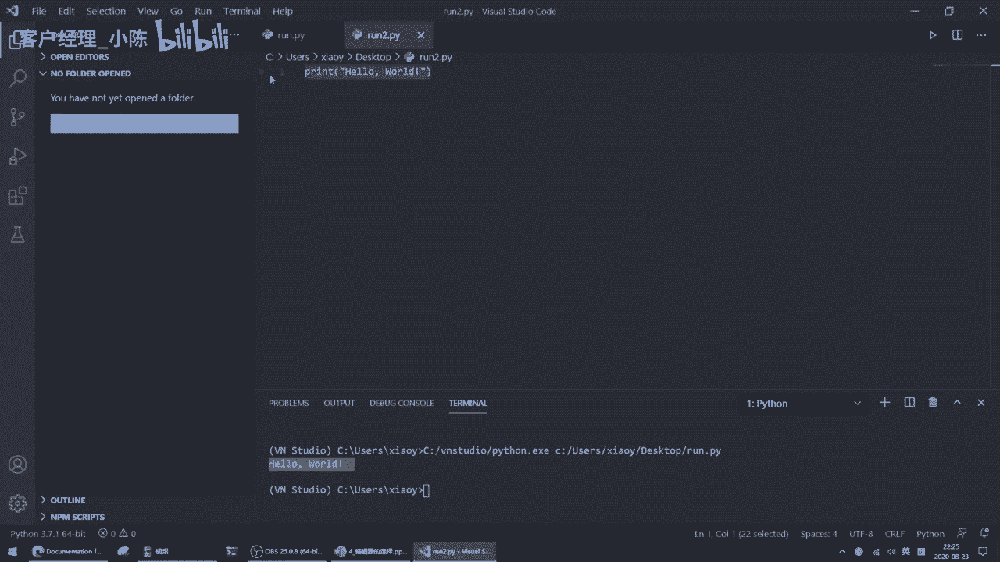

高亮就好了，然后啊我们刚刚那个运行。

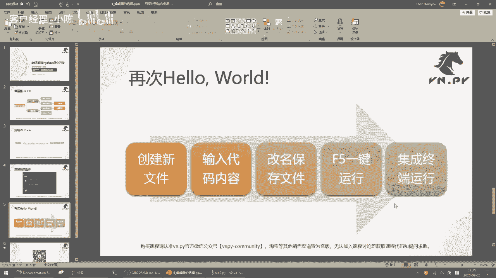

它是在点这个按钮运行，还有个更方便的方式是按F键啊，就键盘上F键按下F它会弹出来，start就是你要怎么样运行这个文件呢，选第一个啊，Python file，我要把它当做一个纯的Python文件来运行。

点它哎，接受启动就运行啊，这边也一样，有些额外的信息啊，诶大家可以看到刚刚运行完，但瞬间又消失啊，又切掉了啊，但没关系，他这个反正正常，结果就已经运行出来了，当然了，如果你习惯点鼠标。

你就还是点鼠标好了，这个也很方便。

所以这样呢我们就已经诶拥有了一个可以，后面啊我们用来写代码，用来就是在这个编辑器内部直接去运行，去调试我们代码的这么一个哎比较方便的，这么一体化的环境啊，所以这样呢我们就已经准备好。

后面的去写一些更复杂的Python代码。

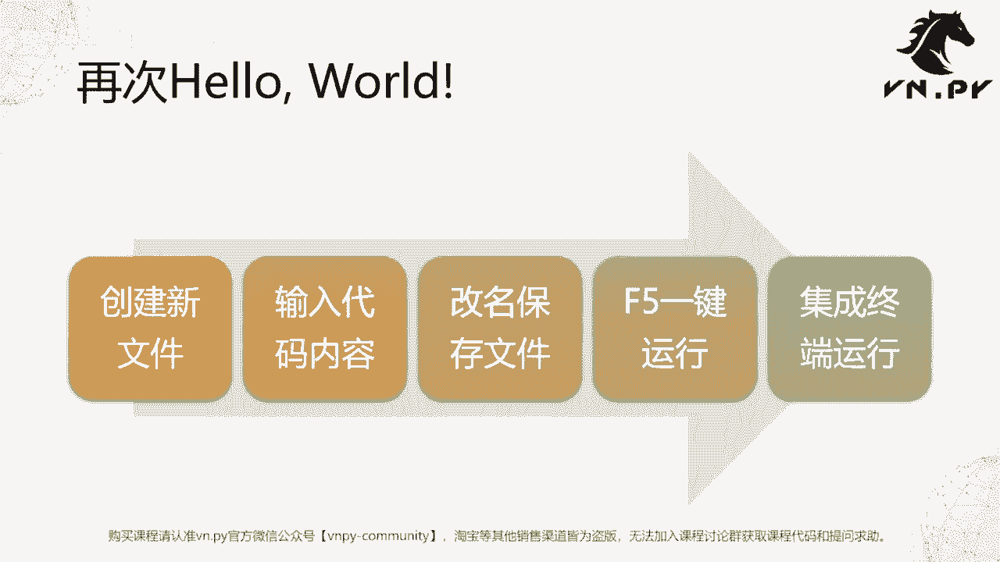

OK那么这节课的内容呢就到这里，更多精华内容，还是请扫码关注我们的社区公众号。