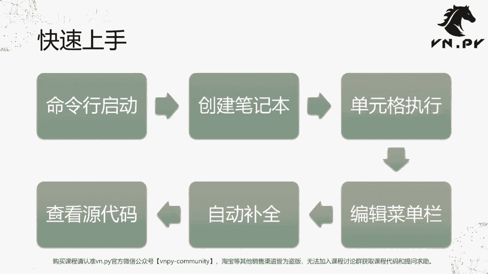
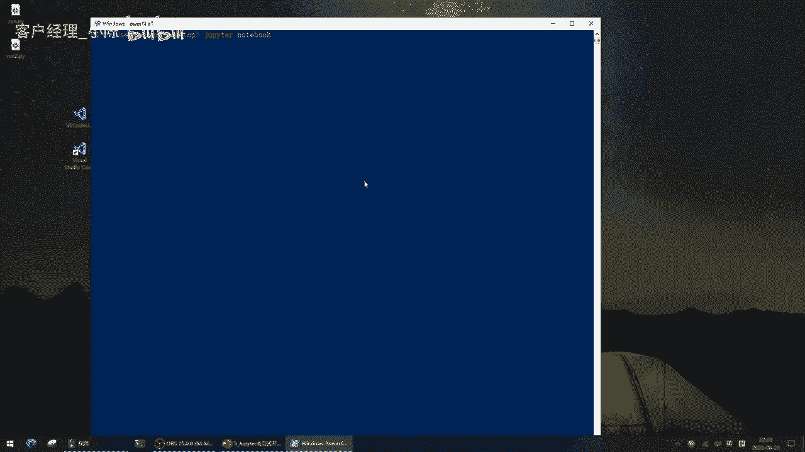
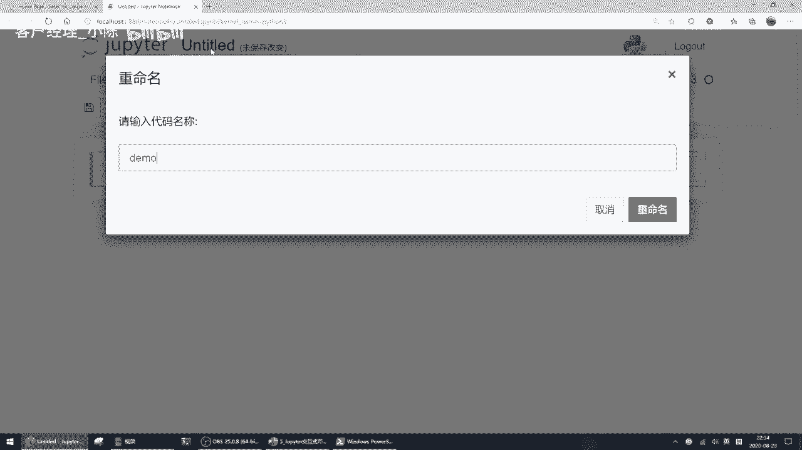
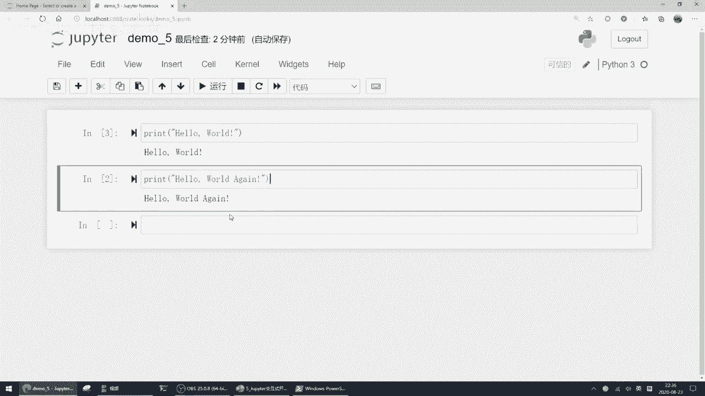
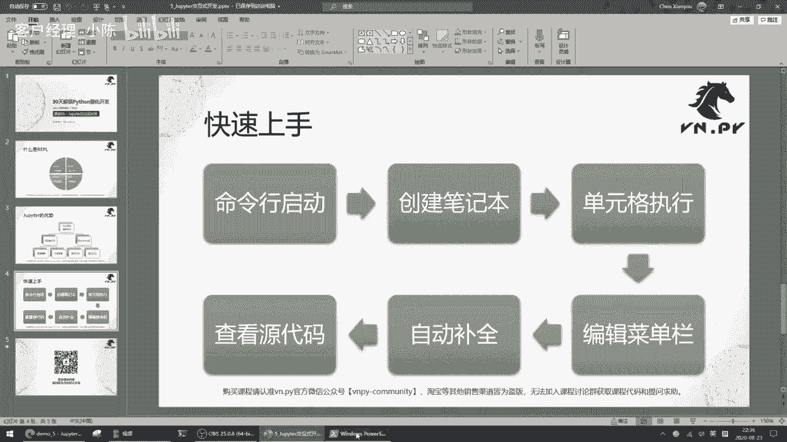

# VNPY30天解锁Python期货量化开发：课时05 – Jupyter交互式开发 - P1 - 客户经理_小陈 - BV1enn9eDEWF

OK欢迎来到量化交易零基础入门系列，30天解锁Python量化开发课程，那么今天呢是我们的第五节课了，在上一节课里面啊，我们已经装好了vs code，这么一个用来写代码的编辑器。

这节课里呢我们就来学一学JUPITER啊，这么一个用来做交互式开发的环境，首先JUPITER我们在之前做hello world啊，那节课的时候已经接触过了，那当时呢我们提到一个词叫做REPL啊。

REPL什么意思呢，就是这张图上的这个叫做四步循环，第一步是R就是所谓的read，read呢就是读取我们用户哈，或者说我们人，我们程序员在这个啊命令终端里面，输入进去的命令啊。

这个命令呢可能是一行Python的代码，可能是其他一些内容，反正先把它给读进去，读完了之后，第二部叫做EVVIL，或者说evaluation，单句执行啊，就是把这一行代码直接去运行一下。

看看它的结果是怎样的，运行完了之后的第三步叫做print，把结果给打印出来，诶立即就把我们要的这个结果给输出出来，最后呢啊叫做loop，进入到下一轮的循环里面，就持续的循环，这里的这个IPL。

就像我们之前那个Python解释器一样，你不按CTRLZ退出的话，它会一直诶你输入一行命令，我给你显示一个结果，我继续等你新的一行命令一直这么循环着啊，我就我就不停的循环下去。

这个呢就叫做REPL的交互式开发环境，那它的好处呢，我们等会儿也来看一下哈，就可以很方便的帮你去完成一，些轻量级的研究任务，唉，输一行代码我立即就看到一个结果，输一行代码立即看到一个结果，很方便。

那这边呢我们先来哎讲一讲，JUPITER这么一个啊，这个这个增强的这么一个交互式开发环境，它的核心优势有哪个，对比起我们在这个啊CMD里面之前，或者POWERSHELL里面运行的原生的。

我们Python这个解释执行啊，它的优势，我这边把它分成了两块，第一块就是所谓的浏览器解显示对吧，我们之前都看过了，这个用浏览器看着就很舒服，不用这个不管是配色也好，还是这个，反正那个黑框框里面只有字。

看着就哎稍微可能有点单调啊，然后啊所以在浏览器里面啊，我们可以做各种快速编辑啊，我们也可以在里面很方便的内嵌一些图表啊，这个等会呢我们也来演示一下，第二块呢叫做IPYTHON内核，Jupiter。

内部运行的是一个叫做IPATHON的内核环境，它呢可以很方便的帮我们记录下，A1步一步运行的Python代码，同时呢还提供了一些额外的叫做magic method的，魔法方法。

帮我们更加方便的去做这些交互式的研究，比如说测量诶这个运行时间是多少，某个函数运行时间是多少啊等等，那这些呢都是JUPITER内置的功能，原生的Python是没有的，啊然后这样我们就同样啊。

就就这个接下来开始实操啊，快速上手，我们啊整体上就这么六步命令行启动，创建一个笔记本单元格执行，然后呢试试用菜单栏做一些编辑，然后呢去做一些自动补全，最后呢查看一下源代码啊。

我们这边就可以很快的来做一遍，还是在桌面上按住shift啊，右键在此处打开power shell窗口，输入JUPITER啊，notebook回车来启动。

好大家可以看到此时自动弹出一个浏览器啊，然后点右上角这个new啊，python3好，打开一个新的笔记本。

好我们也是把它改名吧，demo5啊。

今天第五节课觉得demo5不好了啊，然后在这啊，我们首先要讲一个概念，就是你看我代码现呃，我的这个光标现在在这一格里面，这一格它叫做单元行啊，或者叫单元格，丘比特的运行是以单元格的方式来运行的。

比如说我我还是最简单啊，先来打一个hello world哈，这这这个hello world，我相信大家最近已经打的非常非常熟悉了啊，回车运行哎，大家可以看到我这个运行完了之后。

紧接着光标就跳到了下一个单元格上，然后呢，之前这个单元格运行的结果，直接输出在了它的下方，这里又出现了一个数字啊，一在这个里面什么意思呢，就是这是我们启动这个JUPITER笔记本以来，运行的第一行代码。

它可以给你把顺序给标识出来，我们在这下面哈，再来一个hello world again啊，再再来hello world一次哈，老是hello world，然后运行的时候之前我们有讲过。

你可以点这个按钮运行，还有一种方法呢是也是通过快捷键啊，因为我们写代码的时候，代码手不想离开键盘，按住shift键回车啊，运行hello world again，大家可以看到同样输出的内容。

在这个单元格下面，同时呢哎这里的这个标识符变成了R，就意味着这是你输入的就运行的第二行的代码，所以通过这里好的这个就是哎单元格的顺序，我可以很就这个这个数字，我可以很方便知道自己运行顺序。

那还有一种情况，怎么你你可能会说哎我从上到下，如果按顺序运行，那不就1234566，我干嘛还要这个数字呢，我回到第一个单元格，点一下这个运行按钮，大家可以看到它又运行了一次啊。

然后前一次第一次运行结果被刷掉了，这里啊重新运行一次，又输出一个hello world，同时这里的数字变成了三，所以如果你有很多个单元格，每个单元格里面都有一些代码的时候，哎，你不一定要按照顺序说。

我预先运行第一个再运行第二个，有些时候可能第二个里面你改了一些内容之后，一哎运行完之后又去这个运行，第一个等等都有可能啊，所以这种交互式的运行方法，就可以帮我们很方便的去跟踪诶，我到底做了哪些事情啊。

否则的话我也有可能做着做着，我就忘了我之前下一步是干嘛的。

然后接下来呢是这个编辑菜单栏啊。

这个编辑什么叫菜单栏，也容易理解，就顶部这个每个菜单栏，其实就跟我们在vs code，或者所有的桌面程序里面都一样啊，有各种各样的功能，你可以打创建一个新的笔记本，你可以打开一个已有的笔记本open啊。

你可以说哎我去把这个笔记本复制一份，或者保存下来等等啊，就有各种各样的功能，同时编辑这里也有很方便的啊，编辑这可能甚至于更方便一点，你可以把单元格剪切，比如这个单元格我觉得他放这哎。

我就我觉得这个单元格放这不合适，CTRL哎这个我把它给剪切一下，cut啊，放到下面来哎，再paste啊，你要把它粘贴到上面去，还是粘贴到下面去啊，我就选择粘贴到上面来吧。

大家可以看到之前的前面那个单元格，被我移到这来，就你所以在这个JUPITER里面，它是以每个单元格为一个编辑的对象啊，去做这么一个操作，cut啊，这个剪切这个单元格，复制这个单元格啊，粘贴这个单元格。

以及或者删掉这个单元格啊，那删掉单元格这个操作，尤其比较常用的是一个快捷命令，选到这个单元格上啊，注意选上去的时候光标不在里面，而是没有光标状态，外面这个框子是蓝的，如果你把广光标点进去了，它变成绿的。

说明此时你在你可以写代码啊，如果把这个退出来啊，点一下这个空的地方，它变成蓝的了，那此时按两下D啊，DD就可以很快把这个单元格给删掉，然后啊同时再摁一下，比如说现在还在这个这个单元格上，它也是蓝的。

我摁一下BB啊，摁一下笔，它就在底下插一个哈，或者按一下A它在上面插一查一行，这样你就可以很方便输入新的代码，那还有一个方法呢，就是我们可以很方便的把Python当这个啊计算器用，比如说1+2哎。

这多少直接按住shift回车运行，结果就立即出来了啊，或者说我想做个复杂一点的运算，十的哎不对，十的没意思哈，这个二的十次方是多少，就这么写，二的十次方回车啊，这啊不对，这这运行错了啊。

二的十次方不是这样算的啊，这个应该是from mah import pow，诶，不好意思，哎这样算啊，当然在这呢稍微有一点啊，就是哦我们可能还没讲到啊，这个是我从一个叫max的数据库里面。

加载了一个用来计算次方的函数POW，然后呢我算了一个诶二的十次方出来，那在这啊我们先不管这个就是这个这个加载啊，模块啊，或者说这个调用函数的几件事情，我们先看哎，一个单元格里面不止可以放一行代码。

它可以放多行呢啊，我我甚至可以在这儿，比如说啊POW完了之后，我再来一个哈，Hello world，大家可以看到我如果加了个hello world之后，他就只剩hello world的信息了。

之前POW输出的信息就没了啊，因为如果你在某一个单元格里面运行的代码，没有print的，没有，就这个前面代码没有print的话，它只会输出最后一条print的内容啊，如果我在这儿也加一个print啊。

当然这个内容也稍微有点超啊，但我们先试一下，你看我同时也输入个print print的话，它就两个内容都会打印出来啊，所以反正通过这些方式吧，你可以很方便的去交互式啊的去做一些操作。

比如说做一些数学计算啊，或者说诶如果我现在有个啊，这个时间序列的数据啊，K线的高开低抽，我想要去算一下某个技术指标是多少，我都可以很方便在这个里面用向量化计算，先算，算完之后。

紧接着我就把其中一部分数据给打出来，哎我人先看一下，看完之后我觉得可能还不满足，我再去做一个绘图啊，那这些事情呢都可以很容易的去实现，或者说我们来做一个绘图吧，From armed plot live。

The pie plots，PRT啊，加载一个绘图模块，然后PLT点plt range10，然后打印一个就是从0~10的这么一个诶，45度的直线，回收完了之后诶，大家可以看到一个图就打印出来。

那么这个图有个好处啊，它直接嵌在我们的这个浏览器里面，所以看着很舒服，他直接就在这，而且你每运行一行代码，它对应的那些要输出的结果，那些内容都在下面，所以呢当你做尤其是做一些策略研究。

做数学数据分析的时候啊，你这个内容慢慢越来越多的时候啊，这个JUPITER的文件，它就有点像是一个你研究的整个过程的记录，有点像是我们在呃，我不知道大家就是还还是不是有自己，原来可能哎这个以前做题目啊。

或者不管高中还是大学里面做题目的经历，你经常需要一个笔记本，把各种解题的步骤一行一行写在上面，每一行运算结果再写在那后面呢，你再去要复习或者要去查看的时候就会很方便。

这里JUPITER就起到这么一个功能好，那在这同时，JUPITER这个笔记本也是可以保存的，比如说我现在把它给关了，关完了之后呢，但这个文件还在对吧，但我刚刚给它起名叫demo，我看跑哪去了。

demo5啊，在这叫做demo5点IPYNB这个名字，点一下它好，我们又打开了之前的这个结果，大家可以看就很方便了，就你可以把你整个运行的结果都给保存下来，后面可以重新再给打开它啊。

同时呢我们也可以打开之前我写的hello world，这个Python的源文件啊，直接查查看其中的内容也OK啊，所以在这它还可以哎，直接用来编辑这个我们的啊，Python的这个啊源代码也可以这么做啊。

当然可能没有我们的vs code那么的强大啊，它但你有的时候就想改一两行的时候也很方便，同时呢这还有额外一个叫做智能提示的功能，我给大家也看一下，比如说我创建一个字符串A等于hello word好。

然后A点我输了，点了之后按了一下键盘上的TAAB，这个键tab键位于一数字一的左下方的那个键啊，按tab此时会弹出来这么一个哎，有点像一个下拉框的东西，在这里弹出来。

这些东西呢就是啊当前A在Python里面，它是叫一个字符串对象，这个字符串对象它提供各种各样的功能啊，我们举个随便调一个简单的例子啊，这个比如说我A的内容是hello world，我要把它转成全小写。

就调用a lower啊，把它转成全小写的，回车运行下，你可以看下输出的结果就是hello world，所有的字母都转成了小写啊，这我写错了哈，L和R敲反了没关系啊。

那这个呢也是一个我们这个JUPITER啊，可以实现功能，它可以提供这些各种各样的智能提示，让我们在写代码的时候呢方便很多啊，有些时候我可能不记得哎，这个某一个函数它怎么命名的，有些时候呢他这个名字太长。

比如这这边这个什么is identify，我不想一个个敲了啊，那我就直接tab一下，把它补全一下就好了啊，这个就很方便，OK那么到这呢，我们就基本上把JUBEAT的一些简单用法，都给啊掌握了，那当然了。

这这个呃不管是vs code也好，还是丘比特也好，他们的实际功能都需要强大的多的，所以后面我们会更多在整个课程学习的过程中，去深入的掌握每一个细节啊，学一门编程语言的时候，不只是学它的语法。

也要学怎么去用好这些周边的工具，把你这个程序以最快的速度给写出来，去把它运行起来，去调试它啊，这些都是我们学编程的时候要做的事情，OK所以更多精华内容，还是扫码关注我们的社区公众号好。

我们这节课的内容就到这了。