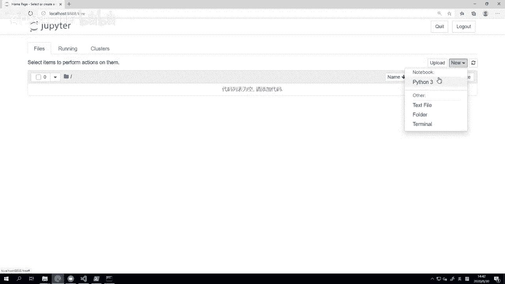
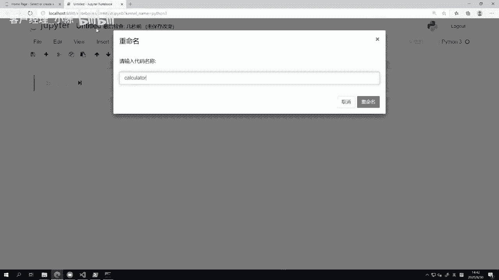

# VNPY30天解锁Python期货量化开发：课时08 – 数学运算 - P1 - 客户经理_小陈 - BV1SzHnepEHx

OK欢迎来到量化交易零基础入门系列，30天解锁Python量化开发课程，那么今天呢是我们的第八节课了，在上一节课里面啊，我们已经认识了Python里面的各种变量的类型，那么在这节课里面呢。

我们要来学一学，如何用Python去做各种各样的数学运算，那么这边还是提一下我们的课程交流QQ群，那啊，大家可以用手机QQ直接扫描这个二维码加群，或者呢也可以啊用PCQQ去搜索这个群号来加群。

那么请注意加群的时候一定要啊，也就一有一个验证信息，那这个验证信息呢，一定要填购买课程的微信昵称，千万不要填微信号啊，这个微信号我们是找不到的，OK那么开始我们今天正式的内容。

那第一步呢我们这个学怎么去做数学计算吗，我们从一个最简单的开始，就是把Python来当计算器啊，在这里我们整体上要完成这么四个步骤，第一步呢叫做四则运算，加减乘除，这个大家都会啊。

第二步是一些特殊的除法，包括整除，包括和求余，第三步呢是求幂运算啊，就所谓的求乘方啊，比如说求一个平方啊，求一个三次方，或者说呢开方哎，这个开个根号，然后最后一步叫做自增运算啊，可以做一些计算。

可以做一些赋值额，这个自增的特点呢，是把两部合并在一个语句里面简化去做，那这边呢我已经哎打开了一个jupiter notebook，我就去呃创建一个全新的这个python3的笔记本啊。

给它起个名字，calculate demo好。

我们就很快的直接开始操作，第一步叫做赋值，变量赋值啊，怎么变量赋值呢，我们写一个A等于一，B等于二啊，我们给他们俩赋俩值，那注意这里的写法啊，A到E这个等于号之间有一个空格，等于号到一之间又有一个空格。

而在这一行的最后是没有空格的，那这个注意一下是Python里面啊，对代码的一个约定的格式习惯，并不是说你写，比如说不要空格好，A等于一，后面再加一堆空格，这个就不能运行了。

但这种写法在Python里面是不推荐的啊，因为它会让你的代码变得更加乱一点，一般呢还是推荐这样啊，就所有的前面的这个变量名，和中间的数学操作符，和最后实际的那个值之间啊，都有一个空格。

这样呢会更加优雅一些，好那呃这个输入完了之后，我按住啊，左手按住键盘上这个shift键，可能是小指和可能是无名指按啊，右手呢，你可以这个无名指或者中指按一下这个回车啊，很快这个单元格我们直接运呃。

就就把它运行起来啊，相当于此时在Python的啊，这个我们现在这个啊解释器内部，或者说我这边开的JUPITER内部啊，它背后A的变量已经被额这个指向了一啊，B的变量已经被指向了二。

那此时呢我们就可以来做一些数学运算啊，四，四则运算，首先第一个我们看一下A加B的结果，回撤啊，这个直接大家就可以看到是三对吧，然后然后呢我这边诶，下面我想看一下减法的结果，降完了之后。

我们可以看到哎变成一了哈，因为呃1-2=-1吗，但是这有个问题，你看我输只输出了这个底下A减B这行的结果，前面A加B这行的结果看不到啊，所以为了方便啊，这是因为呢在JUPITER。

就是就某一个单元格运行的时候，最后这里的输出值，他只会输出最后一行代码的计算结果啊，如果有计算结果的话，有些情况没有计算结果，他甚至有可能直接不输出，所以为了让中间每一步的结果我都能看到。

我在这里加一个print啊，下面也都一样，每一步我就加个print，print a加B，print a减B，这样呢我们可以看到A结果都能看到，这样会比较方便一点，我同时把这个A乘以B哈。

print a除以B啊，这个四个运算的结果都给输出出来一和二啊，就非常简单，加减乘除的结果我们就都可以看到了，那下面呢我们进入到这个整呃，这个特殊除法里面，什么叫特殊除法啊。

就是我们知道除法是一个比较特殊的呃，这个数学运算，那第一个比如说啊我们拿10÷3的话，它是有可能除不尽的啊，我们这边就重新创建两个东西啊，一个叫这个C等于这个十，D等于三，此时呢我们想额输出一下。

比如说C除以D的数值是多少，我们可以看到是角3。33331个啊，这个循环的小数，因为它本身就是除不尽的对吧，这个10÷3的话是没法整除的，但是有些时候我可能我在这个某一个计算上。

我只想知道这个除完的整数部分是多少啊，所以此时呢我可以用这个写法，两个反斜杠的除号啊，就这个这个写法，两个反斜号就叫求整除，选出我们可以看这样计算出来的结果呢，就是三相当于只保留了前面的整数部分。

另外有的时候呢我们想看一下诶，这个计算有没有一个余数，或者说这个余数是多少好，那我们可以用这个求余数，可以用这个叫百分号的运算服务，大家可以看一下，百分号涨的本身就有点像一个除法的符号啊。

所以在Python里面，它就被用来做一个百求余的运算符，它的作用呢我们看运算完了之后，就结果就是一个一什么意思，我们知道10÷3啊，这个前面有三是可以整除的，后面还留了一个数字，一是除不了的。

所以那个数字一就是我们的余数啊，也就这边求余，那这呃我这里呢就把这两行代码都给啊，复制过来，然后把下面的单元给给删一下啊，这个主要是为了保证我这个笔记本，比较简洁一点，因为回头会把啊，这个笔记本的内容。

放到我们的微信群的文件共享里面，这样大家呢啊当然我还是推荐大家手敲一遍啊，但如果有的时候你可能敲着敲着，遇到一些奇怪的问题啊，自己找不到原因的话，也可以下载我们这个原始的啊笔记本，然后去看一看。

直接运行着跑一跑，第四种运算呢叫做求幂运算啊，什么叫求幂，就是求多少次方，这个次方呢我们知道大于一的时候，它是往上加，小于一的时候，它是往下开放啊，我们这边呢就还是简单一点，用前面这个C和D这两个数字。

我就不重新复制了，比如说我要求十的平方啊，那就是这个怎么做，陈邦好，我们运行一下可以看到C啊，两个这个星号或者Python里面就两个乘号嘛，再跟个二啊，就是求十的平方，所以结果是100嘛。

然后我们也可以看一下啊，如果我们print c的零次方啊，这个是多少，这个啊，在数学里面，我们知道任何一个数的零次方它都应该是一啊，这个比较简单，或者呢还有一种方法诶，十可能在这儿不是很合适啊。

我们来个100好，我我就为了方便我就不再去啊，这个创建变量啊，我就直接用数字来代替也可以啊，因为我们这边为了展示嘛，我们求个100的啊，这个开平方啊，把100开平方，我们这这个数值是多少。

我们知道开平方，如果用到这种指数级表示的方法，它数字应该是小于一的啊，而这个开平方正好是0。5次方啊，所以就print100哈，它的这个0。5次方，这个呢就叫做开方运算啊，实际上它运算符都是一个。

只不过一个大于一，就是求乘方，一个小于一，就是求开方啊，这样的结果呢我们看一下哎，10。100的啊，开个平方就是十啊，呃但是但注意，这这里尽管一开始的时候是一个整数，但开放完了之后。

这边变成了一个浮点数啊，这是要注意的一个区别点，然后啊，我们下面要来讲的一个东西叫做自增运算啊，什么叫自增运算啊，算我们来想象一个情景，就是诶这个一开始哈，我在我的这个一个量化交易策略。

比如CCTA策略里面，我可能下了一个单子，我现在就发了一个买单出去，那从这个买单发出去开始，我希望过十秒之后撤单，那么我们知道啊，在这个国内的这个期货行情里面，正常的一秒钟是两个tick。

所以每来一个tick，我就知道哎过去的这个0。5秒，再来一个tick，我就知道过去又过去了，0。5秒就过去一秒了啊，什么时候过去十秒了，那就我收了20个tick，从我下单开始收了20个tick之后。

我就知道过去十秒，那为了啊这个统计这件事情，就是从我开始下单开始过去了多少秒，那我这边呢先创就下单完之后，我紧接着就创建一个变量叫做count啊，就是计数嘛，就是数数用的这个意思啊。

然后每收到一个tick，我就做一件事情，就是count加等于一啊，然后呢好我先运行这个啊，count等于零，然后呢count加等于1print count啊，把它打印出来看运行一次之后。

它的结果是一运行两次之后，结果变成二，运行第三次的时候结果变成三了啊，就你不断的运行，那每运行一次count这个数字就会被加一，那这个加一是在前面count已有的结果上加一。

相当于第一轮运算时候是0+1，第二轮一运算是1+1，第三轮运算是2+1啊，直到加直到加加到count等于20的时候啊，我们就知道，这个时候我们的这个啊倒计时已经完成了嘛，所以此时如果单子还没成交的话。

我就应该把他给撤回来啊，那所以啊，自增运算一般就是用在这样一个场景里面，那在这里呢count实际就这个加等于号啊，就这个符号实际上他做的事是什么啊，把它展开的话就等于是这样。

count等于count加1print count，我们把上面这个加等于号给展开啊，把它转化一下，它本质上的那个操作，就是这么一个操作，首先我把已有的这个count的数字啊，拿它来加一，这个是计算。

计算完了之后，我再把这个count加一的结果重新复制给count啊，所以呢这样我们运行一下就可以让它变成啊，它起到的功能，其实和上面这样这个写法是完全一样的，上面这个写法呢会更加第一个简洁一点。

代码少嘛，加等于号替代，后面这个第二个一般呢在我们Python里面，你看到这种加等于的时候，你就知道哎这是一个自增操作，那么需要注意的是，自增操作不只有加法哈，就这边虽然我用的这个字是叫增啊。

增加的意思，但是呢它其实不只有加法，你也可以，比如说count减等于二诶，这个忘了，Print print count，你可以看之前加到六了嘛，减了一下二，我刚刚又运行一下，现在已经变成二了。

再减一下变成零了，再减变成二了啊，这个是减等于操作，同样他也有这个，比如说乘等于操作全等于二，就你你当然也可以把它重新命名为，比如说这个叫自检，这个叫自成，这个叫啊，然后还是同样，你可能已经想到。

还有这这种叫自除啊，就每出一次都会变小一点，但是呢啊因为考虑到这种命名有点怪怪的啊，所以一般这种操作在啊编程语言里面的名字，他都叫自增啊，虽然它其实是可以做四四则运算的，它并不是只有加法。

它加减乘除都能做，但一般就叫自增了，那我们这样呢就把哎，这个最基本的一些数学方面的运算呢，都已经讲完了，下面我们要来讲的一个东西叫做逻辑运算，什么叫逻辑运算啊，就是数学比较运算，或者说更简单一点。

就是大于小于，就比俩数字谁大谁小，我们在这啊把它啊，这大家看到我这写了一个叫三立关系，但我这边其实是有嗯四个分类的啊，为什么呢，因为最后这俩分类比较接近，所以呃不好意思，不是比较接近，正好相反。

所以我把它展开来，第一类关系叫大于小于啊，这个就是左侧和右侧比，那么他们俩互相之间关系肯定是不等的，左侧比右侧大，就是这个大于号，左侧比右侧小，就是小于号啊，另外一个是大于等于小于等于类似。

只不过额外加上了一个等于条件的判断啊，如果等于它也符合条件，最后这两个一个是等于，一个是不等于这个容易理解啊，比如三肯定不等于二啊，然后左右两边如果都是二的话，那就相等嘛。

所以等于这里呢啊这等于如果是逻辑运算，这个等于而不是赋值的那个等于的话，他应该是两个等号，而不等于的话是一个感叹号跟一个等号啊，这边呢我们也同样看一下这个例子啊，这个逻辑运算我就我就很快的都打一下啊。

print啊，三大于二，print哎，三小于二，print这个三大于等于二，这个三小于等于二啊，print3等于等于二，Print3，那这个不等于二啊，一起运算一下，我们可以看到结果是什么。

第一个三大于二，这肯定是符合的吧，三本身就大于二的，所以是TRU，然后第二行三小于二，结果就是false啊，三不小于二，然后啊第三行三大于等于二，这个是又是一个true了啊，因为它确实呃。

这个当然这个条件和就三大于等于二，比起前面三大于二的话，等于多了一个允许的情景，就是如果左侧和右侧相等的话，这里也会返回true啊，而不是绝对的一定要它比它大才返回true。

而这里呢是小于等于同样不符合啊，然后三等于等于二，那肯定不对，但是三和二不等，然后呢最后一行三和二不等，本身就不等嘛啊，所以返回的也是这么一个true，那这块操作呢就叫做所谓的逻辑运算。

那需要这个注意的一个点啊，就这边可能我给大家展示的是，直接用俩数字去比，这个是你可能会觉得有点莫名其妙，三本身就大于二的话，你这这第二行再写个三小于二，就这没有意义啊，所以更多在我们编程里面用到的场景。

可能是像刚刚那样print count啊，就这个计数嘛，它每一秒都在啊，每来一个梯口就把他呃，比如说自己之前的啊，之前这边啊每来一个tickle就自增一，那什么时候我知道这个自就是这这个自增呢。

这个记录值它就到了20，到了我撤单的条件呢啊，怎么样在代码里面把它表示出来，就是print count大于等于20，如果这个计数大于等于20的时候，我知道OK这个时候已经满足撤单条件。

我应该跑去撤单了啊，更多时候是这样，现在count相当于是这个false吗，那我这边呢哎也一样，就是这个count加等于一啊，多运行几次，其实呃你你运行到最后，那这个count当它大于等于20的时候。

自然这里就会变成true，我就直接这一轮啊给count赋个值啊，这个等于20，这个时候大家注意我这一次运行完它还是false，因为我是先啊这个print就先拿这个两个数比，比完之后再做的复这个赋值操作。

此时我再赋值的话，它就会变成true了，大家可以看到啊，所以如果是你不断的在做自增啊，这个判断撤单撤单等待技术是否满足条件啊，这个呢就是一种在我们去写这个，我们交易策略的时候，非常常用的一种写法啊。

这个叫做技术写法，那核心背后用到的第一个是自增运算，第二个呢就是这里的逻辑比较好，然后啊这也是我们今天最后内容讲一讲，在Python里面计算的优先级，整体上这个优先级和我们啊。

如果你用就是用笔和纸去做数学运算的时候，那个数学公式的计算优先级是啊，基本上类似的，首先优先级最高的肯定就是括号了啊，你把什么括到括号里面，他肯定是最先算的，第二优先级的是求幂啊，就是求多少次方。

第三优先级是乘除，第四优先级是加减，最后优先级最低的是比较啊，那我们呢也稍微看几个例子，计算优先级好，1+2加这个这个乘三，那我们先看一下1+2乘三的结果应该是什么，很容易嘛，七先把二和三乘起来。

然后再去加上一，2×3=6，加一等于七嘛，然后我们加上一个括号诶，1+2乘以个三，注意括号在Python里面啊，他有个这么样的特征，就是它前面额不是括号，就是如果紧跟着数字的话，是不要加空格的。

你不要把它写成这样，不要这样啊，这个这个是不对的，Python里面括号是紧跟着数字的啊，这个前面这个前括号是后面紧跟上数字就行，不用加空格，然后这个后括号同样它也是紧跟着数字就行，不用加空格啊。

这是一个就是不同的点，反正慢慢养成习惯就好了吧，然后在空呃，这当然括号和运算符之间是要有空格的啊，然后再乘以个三，这样的结果应该是什么，这时候就是一和二的相加，先算1+2=3嘛，三再乘三就等于九啊。

所以括号是有最高优先级的，那这个时候呢我们可能诶再额外做一个这样的，好我们做一个额外操作，就是这样，1×2啊，后面是二乘以，比如说就啊四次方吧，那这样的结果应该是什么啊，前面有一可能不太合适啊。

我们用一个3号了，这样结果是48，什么意思，先来看后面这个是一个乘方操作，所以他先算二的四次方等于哎四四呃，这个这个四四十六嘛，二的平方是444啊，再再再乘一下，就正好十六十六，再乘三等于48啊。

所以先算后面乘方的部分，然后再算前面这个叫做这个乘法的部分，然后整体上就这个，这个我就就跟我们的数学计算非常接近啊，所以我这边就不额外去多讲，我们这边需要展示的一个是这样，4+5大于八啊。

这么一个运算符，左侧是一个加法运算，右侧是一个单一的数字八，中间呢是一个，这个我们只是刚刚讲完的逻辑运算，或者叫比较运算，那么在这样一个情形下，我们看结果是什么，但是true什么意思呢。

它先算的是左侧的部分4+5，先把这俩数给加起来，加起来结果是九，然后拿九和八去比比出来，结果九肯定大于八嘛，所以是个TRU，所以在这里啊，加法的运算符是比这个比较运算符的，优先级更高的，反过来啊。

如果你这个做一个特殊的操作啊，五大于八，你先去算一下五和八的这么一个逻辑判断，然后把它跟四加起来的话，如果你真想做这件事情啊，你在这里就要加括号了，就是五大于八，先把它给括起来，然后加四。

但我们知道五大于八，这个计算出来结果是一个布尔值，它是一个true false，你在它加四啊，拿一个布尔值加和一个整数加，我们看会怎么样，哎这也是一个四，为什么呢，因为布尔值本身在数学里面。

是可以表示为数字的，比如说五大于八，我们在这里啊，我们看一下它本身是个false对吧，但是如果把它做一个数学类型的转换，诶上节课我们学过啊，整数类型呢呃在Python里面的名字是什么int啊。

我们把五大于八这么一个布尔值，强行转化成整数会怎么样，我们可以看到转化出来的值是零，当你在数学运算的时候，Python里面有一些叫做所谓的隐性数据类型转化，像在这，因为我要跟一个整数加。

所以后面这个值呢啊，这个一个布尔值加一个整数，是不可能说诶把这个啊整数变成布尔值，然后再跟布尔值加的，因为布尔值本身不能加啊，而我们能做的是把这个布尔值转成整数啊，所以他如果是true就是一啊。

如果我们我们把它反过来，如果变成小于八的话，大家可以看到就是五啊，因为五小五小于八，这这个算下来布尔值是true啊，true的布尔值就是一，所以4+1就变成了五啊，这是一个需要注意的点，我也给注释一下。

布尔值到整数竖的阴，是换啊，这个是需要注意的点哈，但一般情况下呢，我们在自己的编程代码里面，是强强烈不推荐大家去写这样的代码的，而且这样的代码可读性非常差，很容易把自己。

或者把这个后面要看你代码的人给带到坑里去，我们强烈建议大家不要这样做，但是这里确实他是一个Python允许的写法，我们也给大家讲一句，OK那么这样呢我们就基本上已经学完了，用Python哈。

你能去做的各种数学运算，这个时候你把它当一个计算器用，就已经非常的方便了啊，我们这一节课的展示内容是用JUPITER在做的，如果大家这个想要直接在Python的那个，交互式环境啊，就启动打开一个CMD。

然后运行Python啊，进入了那个交互式会环境里面去做，我们今天啊做的这些，所有的数学的计算也都是可以的，甚至于呢因为那个启动快嘛，Cmd，然后输入Python一下子就启动了，你不用启动就比特。

那不可能还要等个五秒的样子，所以有的时候随手有一些啊小的计算啊什么的，其实用它来用Python来做是非常方便的啊。

OK那么这节课的内容呢就先到这里，更多精华内容，还是请扫码关注我们的社区公众号。