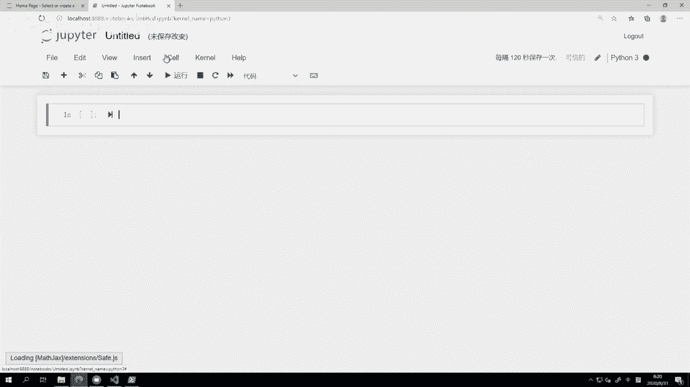
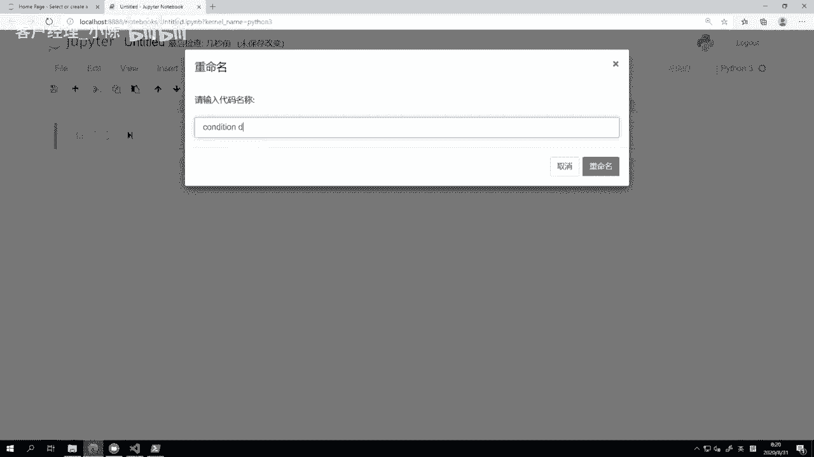
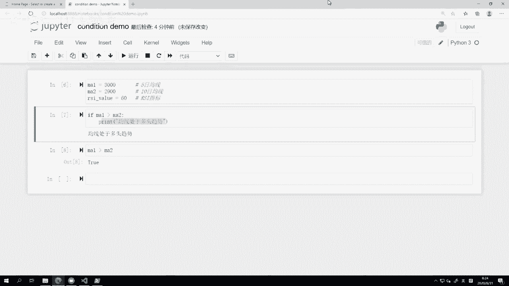
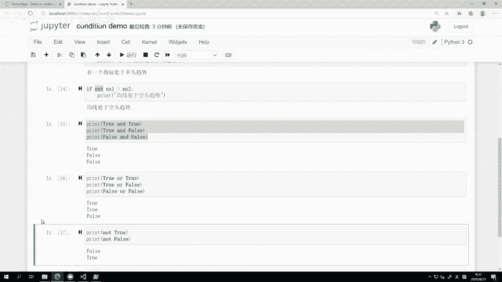
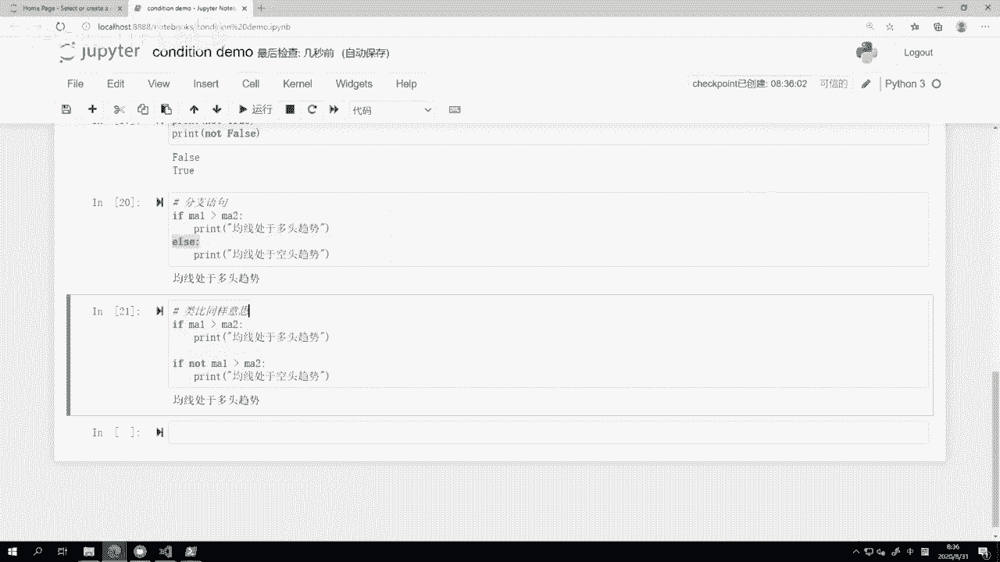
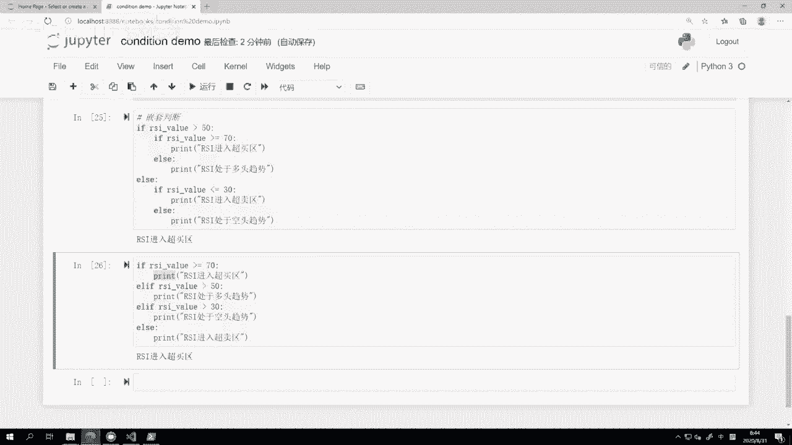

# VNPY30天解锁Python期货量化开发：课时09 – 条件判断 - P1 - 客户经理_小陈 - BV1f8H4eXE7s

OK欢迎来到量化交易零基础入门系列，30天解锁Python量化开发课程，那么今天呢是我们的第九节课了，在上一节课里面，我们已经学会了Python里面的数学运算，那么在这节课里面呢。

我们要来继续来学一学这个条件的判断，那么首先我们来看一下Python，条件判断这一块的基本语句，那它背后的一个运行逻辑啊，本质上很简单，就是如果满足某个条件的时候，我们就去执行一个特定的操作啊。

言下之意就是不满足这个条件，自然就什么都不做了，那么在这一块，为了达到这两点，我们要用到的写法主要是后面这三个内容，第一个叫做if语句哈，就所有的这种条件判断的语句，前面是用英文的if啊。

就是如果来开头的第二个代码缩进啊，这个放着条件的这一行在前面的话，那下面这个执行特定操作的这一行代码，要用四个空格缩进进去，这个等会我们也同样在代码里面来看，最后呢就if语句一定要加上一个冒号结束啊。

这个是Python和其他的编程语言的一个，比较大的区别，那么这边呢已经打开了一个jupiter notebook，还是一样啊，我来创建一个新的笔记本。

那就起名叫做condition demo啊。

条件的意思，我们先来想象一个啊简单的情景，因为考虑到大家都是为了量化啊，可能为了交易来学我们这门课的，所以呢可能多多少少对于比如说双均线，比如说像RSI指标都有一定的概念。

那我们这边啊就来做这么一个定义，首先是一条快速均线ma1啊，它可能在这个比如3000的位置啊，然后是一条慢速均线ma2，它可能是在比如说2900的位置，然后同时呢我们再来一个这个RSI。

还value这个是RSI指标啊，他可能目前比如说我们给它一个值，位于啊60的区间，所以这是一个多头嘛啊，这即便我们给他一个注释啊，就5日均线，啊当然这边5日十日只是我随便写的，并没有什么绝对的意思。

主要是作为一个demo而已，RSI指标好，那么这样的话呢，我们先来看第一个条件判断啊，我们知道当快速均线大于慢速均线的时候，此时肯定是处于一个多头趋势的，我们现在呢就要来做这么一个判断啊。

看看如果哎比较一下MA1MA2的数值，然后打印一下当前到底是处于多头趋势，还是处于一个空头趋势啊，所以很简单，if ma1大于MA2冒号回车啊，大家可以看到这标光标自动就出现在它。

不是出现在第二行的行首，而是出了现在往后缩进了几个位置的地方啊，如果我们往前数一下的话，其实是正好是四个空格，1234啊，然后print啊，如果M11大于MA2，我们就打印一个多头趋势啊。

或者说均线啊处于多头趋势啊，那这样就是一个典型的条件判断语句的写法，if在前面啊，代表这句话是一个这个逻辑判断，然后空格后面呢是一个数学比较的，这么一个逻辑运算啊，其实也就我们上一节课里面提到的。

那些比较运算符，大于小于大于等于啊，这个等于等于还有不等于啊，主要就是这些，那么这里用到的呢就是M1大于M2，说白了就是5日均线大于10日均线，如果满足这个条件，后面啊冒号代表就是接下来是满足条件。

我要做的事情，你要做的事情呢，在这里就在要要写在下一行里面了，然后最少要缩进啊，这个四个代码当然在其他的一些啊，这个编辑器或者IDE里面，它也允许你用键盘上的Q键，左侧的这个叫tab键啊。

在编程里面叫做制表符来做缩进，但是这个缩进方法在Python里面是不推荐的，Python统一推荐使用四个空格缩进啊，所以在这呢我们就养成一个好习惯，都是四个空格额，那不管在JUPITER里面。

还是在vs code里面，他这个四个空格缩进啊，对于if i，后面我们要学学到这个循环语句啊等等，它都是自动的，所以你直接在这回车，它就会有缩进了，你也不用自己去敲那四个空格啊，所以很方便，那在这啊。

print均线处于多头趋势，我们运行一下这个单元格，看看它的效果是怎么样的，我们可以看到，在这里他就直接输出了这么一个结果，叫做均线处于多头趋势啊，如果我们把前面这个单元格的值改下，A o m a2。

不再是2900，我把改成3100，我们看看结果会怎么样啊，这个时候就没有输出了，没有输出就说明上面这个判断是不符合的，同样我们在这啊，结合上上一节课的内容，我们可以直接看一下，M a1，大于MA2。

的这么一个比较运算的结果是什么false，所以他没有输出，反过来我把它变成2900的话啊，这个时候能输出，因为是它这个运算完了，返回的结果是true，所以你就可以明白啊，if后面跟的这个啊。

不管是一个比较还是后面，我们等会儿会看到多个比较结合的啊，这些方式，那本质上这里if判断的都是一个布尔值，如果为true，就执行下面的这个你要去让他，你要他做的这么一个特定操作，如果为false啊。

那就不执行它，进入到后面的语句执行里面去。

OK那么我们继续啊，然后第二块要讲的就是逻辑运算了，逻辑运算这边首先啊如果还记得这个小学时候，我们刚开始学计算机的时候，可能当时有讲到一些二进制，讲到一些二极管，然后讲到有逻辑门这么一个概念。

逻辑门主要有三个，就是与或非啊，转到英文，或者转到编程语言里面，绝大部分编程语言用的都是谁啊，三个英文词and代表的就是与all代表的就是或啊，not代表的就是非啊。

这三个什么意思呢，其实从逻辑上讲也非常简单，我们再回到这边代码里面啊，逻辑运算，那我们前面这里啊刚刚定义了既有MA有RSI，但是我们第一轮只用了23这个数值啊，只有2ma这个数值。

这一轮的判断呢我们把2231起用上，if m a1大于A2，and rsi value大于诶这个50吧，RSI一般是大于50，50是一个分界线嘛，大于50代表它是多头趋势啊。

小于50代表它是一个空头趋势啊，如果这两个条件都满足的话，我才打印一个A指标，均线和RSI都处于多头趋势啊，什么意思，就是当前面MA1大于MA2，这个条件是对的啊，是真的，就确实MA1是大于M2的。

同时RSI指标也是大于50的，就后面这个条件也是true，两个拼起来都为true的时候，我们才执行后面这个运算啊，所以我们可以看看它的效果，回收完了之后，他就输出哎，均线和RSI都处于多头趋势。

因为RSI是大于50的嘛，他是一个60好，下面我们要看的一个呢就是我们把这个ma2啊，再次改成3100，注意每次改完之后，其实我都在键盘上按了一下shift回车的操作，把这个单元格运行一下。

这边数字是会变的，你不要改完之后不运行，那这样啊，这个新的M2的数值，在内存里面是没有生效的啊，所以你如果那样运行下面的单元格，就可能还是输出之前的结果，一定要运行一下，注意我们这边啊。

shift回车哎，这就变成了十，然后在这里我们再看if a，那这个时候如果我在运行上面一个单元格的话，我们可以看一下，他已经不输出结果了，因为此时M1是小于M2的好，我们就看一个例。

第二个逻辑运算叫all，好这两个条件里面好有任何一个满足的话，我们都输出这个叫做有一个指标处于多头趋势，all的意思就是前后用or这个表达呃，这个运算符连起来的这两个条件，有一个为true的话。

那它就为true啊，反过来除非两个都是啊错的，或者两个都是不符合的，两个都是false啊，它才会是一个false，只要有一个为true，它就是true，两个都为true，它也为true啊。

那所以呢我们这样看一下，此时我改过了MA1是小于M2的，所以第一个条件不符合，但第二个条件还是符合的，因为R是R3还是60啊，我们现在可以回车看一下，有一个指标处于多头趋势啊，就这一句啊。

逻辑运算还是可以出来，反过来这边就不行了啊，然后我们再看第三个条件，就是非if not a1大于A2，处于空头曲线什么意思，M1大于MA2快速均线大于慢速均线，所以此时呢是多头趋势，那么反过来。

如果快速均线没有大于慢速均线，那就是要么就是小于，要么就等于嘛，我们知道是实践里面，而且实际的行情里面，这个均线两个值相等的概率非常非常小的，一般过了一根K线之后，他就要么就金叉，要么就死叉了。

所以要么大于，要么小于，几乎没有等于的情况啊，所以我们在这里的逻辑判断里面，就我们就先忽略等于那种可能，所以如果M1大于MR那当然是多头趋势对吧，加一个not了之后就是不是M1大于M2的时候。

那自然就反过来了吧，M1小于MA2，那自然就是一个空头趋势啊，所以我这样回车完了之后运行出来结果，因为MA1是3000，MA2是3100，所以这里的结果自然啊，它是符合这么一个条件的。

所以通过上面这三个例子啊，我们可以来看一下，and的意思是前后都为真的时候，或者前后都为true的时候，这里的这个逻辑运算结果才为TRU，而or的话呢就是前后有一个为true的话啊。

那它就是TRU反过来，最后这个M1大于M2，就是if not的这么一个判断的时候，那他是把后面这个运算，不管它是true还是false，往相反的那个方向转换啊，true转换成false。

false转换成true，就是这么简单啊，那么我们呃刚刚讲的这个实际的例子，我们把它转化成具体的这个呃，或者说简单一点，我们就看它的真实运算服，我们来看一下结果，True and true。

哎我们就直接来print啊，就所有这些逻辑运算符都可以啊，它本质上也是一种数学运算，跟我们上节课里面学的内容其实是啊接近的，只不过他不再是那个数学表达符了，而是一个Python里面的叫关键字啊。

像and or not它都是Python里面的叫关键字，他也不是，我们后面再往后一点会学到一个叫函数啊，它不是函数，它是关键字啊，我们这边就来看一下tru and false。

print false and false好，我们把这三个打印一下，看看结果是怎么样的，true和true两个合起来才会true啊，true和false有一个是false的话，那它都为false。

反过来两个都是false的话，那最后就是false啊，所以and的意思就是你前后条件都符合，我在认为你是对的，你是符合的，反过来只要有一个不符合，那就是不符合啊，然后我们把直接复制下来。

我们替换成all，运行一下，我们看到true or true，那就是true，True or false，那就还是true，只有false or false的时候才是false啊，所以是这么三个结果。

最后呢我们再看一个那个not的啊，not就比较简单，print not啊，false not true吧，第一行not true好，第二行not false，好结果很简单。

就true not完了就是false，false not完了就是true，就是一个啊二元的转化啊，所以这样呢我们就讲完了。

这个逻辑运算的原理其实也很简单，我讲的比较啰嗦，但就脑子里面习惯一下，其实非常非常简单，它就符合我们正常人的一种啊。

这个这个逻辑判断，那么啊有了这个前面的条件判断，基本的语句if之后又有了啊，我们刚刚讲的这么一个分支呃，这这个逻辑运算中，我们来看更进一步的这个判断就叫分支语句啊。

之前我们只讲了if满足这个if条件的时候，我们做一些事情不满足的时候呢，我们就直接不运行了啊，当然在实践里面还有一种选择，就是不满足的时候，我们让他做另外一种事情啊，就有点像是一个二叉路口。

满足条件你就走左边，不满足条件你就走右边，反正你得走一遍，而而不像其他一个可能就是一一条直着的路啊，右边有个店，满足条件，我就去店里面买个吃的吃一下哈，不满待会就继续走啊，用了if else之后。

就他就变成了一个彻底的二叉路，这边呢我们也用一个好，继续用代码例子来看啊，分支语句，刚刚我们看的是这个if m a1大于MA2，我们还是一样啊，if m a1大于MA2，print啊，均线处于多头趋势。

后面我们加一句，Else print，均线处于空头趋势，好回撤，我们可以看到啊，就就因为我之前M11的结构，还是3000和3100的关系，所以此时第一个逻辑判断条件是不符合的啊，当它不符合的时候。

会自动走到else啊，跟一个冒号下面的这一行语句上来，所以呢它打印出来结果就此时处于空头趋势，那么这个表达式有一个什么好处，就是不管他处于哪个条件，我们都会把它给打印出来啊，要么多头。

要么就是空头反过来，我这边把值给改一下啊，同样再把它改回2900，回车一下，好注意，这数字变19了再回车，这时候我们可以看到就处于多头趋势了，所以还是比较容易去理解的啊，他就是你要我判断的那个事情。

满足的话，我帮你去啊，做一条路线的操作，然后如果不满足，我帮你做另外一条路线操作，如果要起到类似的作用，还有一个什么写法，f ma1大于A2，均线处于多头趋势，然后在下面另外写哈。

if not a1大于A2，均线处于空头，确实可以起到完全一样的结果，大家可以想象一下逻辑上的运算，前面符合这个条件，自然就打印这句话，然后如果我们不用else的话。

我就要准确的写出下面这个if not m a1，大于A2，就是所有前面条件不满足的语句，我要正好写个相反的，然后他才会去执行，这而else的话你就不用去管它了，只要前面那个条件不符合，我输个else啊。

我不用管它表达式到底怎么样，我不用去写那个逻辑运算，因为这里还是很简单的例子，我们就两个数比一下，在实践里面你可能要四五个条件啊，甚至条件里面还有嵌套条件去比一个格。

你要全部用not在前面包一个重写一遍，那就太麻烦了，所以用else这个呃一个一个关键词的话，可以大幅的简化我们的代码，好我我这边还是把这个代码给大家留着啊，就是表示一下诶，这个类比同样意思。

那else我们也懂了之后，最后我们来讲这个叫嵌套判断，什么叫嵌套判断呢，就是做了一次if判断之后，在if执行的语句内部再做一次if的判断，好有两种方式，第一种呢叫做if内减。

这个对初学者来说比较容易上手，第二种方式呢叫l if运行效率更高。

什么意思啊，我们这边来看一下，嵌套判断if我们就完全基于RSI指标来讲了，那RSI指标我们知道，正常情况下他以50为分界线对吧，大于50哎，持多头，小于50是空头，然后大于八尺或者大于70。

而这取决于不同的啊，这个软件和书里面讲了，我们就取70吧，70可能更常见一点，大于70进入超买，小于30进入超卖啊，超买的意思就是诶显然涨太快，涨太多了，可能后面要跌回来啊，超卖意思就是现在跌太快。

跌的跌太多了，可能后面就要反弹了啊，我们这边呢就用RSI它的数值来做一个判断，诶看看这个结果怎么写，我们判断一下诶，现在RSI到底处于哪个区间啊，我们一种写法就是刚刚那四个条件。

第一种写法就是if i si哎，首先它如果是处于这个50的上方的话，那if f r s i大于这个，大于等于70啊，只要它大于等于70，我们就可以写RSI进入超买区，反过来else啊。

如果只是在50上方，但是他没有大于等于70啊，这个是就是ISI处于多头趋势，这第一个路径的条件，第二个路径就是他没有大于50的时候啊，那同样我们知道，一般这个就是他不太可能正好等于。

所以我知道这个等号写不写都行啊，我就我就呃这个出于数学上的严谨性嘛，我把它写着啊，然后下面F2就是这边else的话，什么意思，就是RSI如果没有大于50，所以说白了就是它小于等于50的时候啊。

那这个时候如果ISI啊小于30，我就写print，进入超match r else print，接好运行一下，诶，好这个不是RSI，应该是叫rsi value，好，我们把替换一下。

这时候我们可以看到RSI处于多头趋势啊，这个判断就已经出来了，因为他现在是60吧，我们把它给哎复制下来，改一改，在上面添加一个单元格，RSI往上面添加单元格应该按什么，我刚刚选中它，先把它变成蓝色的。

然后按了一下A就往上添加一个单元格，然后现在你看光标当前处于这个单元格上啊，左侧是蓝色的，如果我要删掉它怎么办，键盘按两下D很快的DD好就删掉了，这个都是JUPITER里面常用的一些快捷键。

如果你记不住的话，那可以看这个edit啊，这边有很详细的说明，什么滴滴啊什么啊，这个这个什么呃X啊什么的啊，然后包括这边insert sell above，Insert cell，比到AB啊等等。

这都有看菜单就行，如果忘了的话，我们这边改一下，把它改成比如说八尺rs8尺，那肯定比较强势啊，那这个时候我们可以看到他已经进入超买区了，所以这个写法啊，我们就可以起到一个嵌套判断的功能。

我们可以看一下诶，到底它是这个RSI指标，是处于这个四个象限里面的哪个象限，这种写法是不是，对于如果你是刚学编程的人来说，可能是比较容易上手的，因为这和我们脑子里面思维习惯很像嘛。

但相应的可能你看着到这代码时候，会觉得有那么一点不舒服啊，我们下面看看有没有什么办法能改进它，那if i si value啊，大于等于，其实我们这尽可能把它转化成一个，扁平化的写法。

就是如果RSI指标大于70的话，那他肯定是已经进入超买区了对吧，然后下面哈我们用的是l if r s i value大于50，处于多头趋势，哎这句话什么意思，l if等于什么。

等于else加上if l if呢，就是如果上面这个条件不满足的情况下，就进入else的判断里面对吧，else分支，然后我们在下面这行用l if先进ELS的分支，同时我们再做一次判断，如果进到这条分支了。

RSI的值大于50的话，好我们就输出它处于多头趋势，那所以能进到这条分支，所说明第一个条件它是不符合的，才能进到这个分支，同时又符合第二个条件，才才会去执行这条逻辑的判断。

等于这个l if在这里它起到的作用，结合上了上面的啊，这个2SIY6大于50，加上这句else这两个啊，这个所谓的逻辑条件啊，都符合的话才能进到这条语句啊。

然后第三个就是还有if r s i value啊，这个时候你你你想一个是大于50啊，然后这边剩下一个条件应该什么，大于30，Print，处于空头趋势，最后一个就可以写else，进入超卖。

如果啊能走到第三行，就第三个判断的时候，那此时呢说明RSF6已经也不大于50，就not rs value大于50，所以它是小于等于50的，小于等于50，又大于30的话，那自然就去冲空头趋势去啊。

所以我们就打印这个最后一个情况，前面三个条件都不满足的话，那只剩一种情况小于30%啊，所以呃不好意思，小于30，所以呢就意味着他已经进入了超卖区啊，那么这样的话运行完之后。

可以起到跟上面这个逻辑完全一样的效果，但是从代码的你这么看的话，是不是就觉得清爽很多了，因为他是一个比较扁平化的啊，这么一个代码格式，所以呢这个就是l if if的写法啊。

那么我这里给大家就有人肯定会问啊，说我这我这个一开始写代码的时候，应该写哪个比较好，我给大家的建议是，上来你还是先写这种嵌套的这个东西，毕竟比较符合我们人的脑子的思维模式，然后呢写着写着你会慢慢啊。

如果你不管策略也好，还是其他什么研究模型的代码也好，代码会变得越来越膨胀啊，就代码行数也变多，代码每行的长度也变多，膨胀了一定的水平，觉得哎我看着好难受啊，眼睛都看不清楚的时候，你就可以试一试。

把这边的这些逻辑的嵌套，转化成这种比较偏扁平化的写法了啊，同时呃一转换成这个扁平化的写法时候，其实要稍微难一点，因为刚刚我们这个就是想到什么地方就写，什么地方，想到什么地方就写什么地方。

转化到这里的时候，其实你是把这个里面的啊，这种组合条件判断给展开了，你是把这些if加if嵌套的东西，转化成了一个可以有这种互斥关系的写法啊，所以其实是要有更多的脑子里面啊。

对于这个数学逻辑运算要更多啊思考，才能把下面这个写法写出来了，我建议呢就是你先写上面这个写法，后面哎你某个地方你觉得受不了，我想改进一下时，再写下面这个写法好，下面这个写法同时在执行时候的。

不只是看的书法，执行时候速度上也是有优势的，他会比起上面这个判断嵌套的写法，速度更快一些好，因为这个写法更接近于计算机本身的啊，这么一个逻辑啊，OK那么到这儿呢我们就把今天这个内容啊。

其实还啊讲的还比较啰嗦一点啊。

虽然内容点不是很多，但希望大家可以深入的理解，所以讲的比较细啊。

这个今天我们的内容呢就也讲完了啊，更多精华内容，还是请扫码关注我们的社区公众号啊。