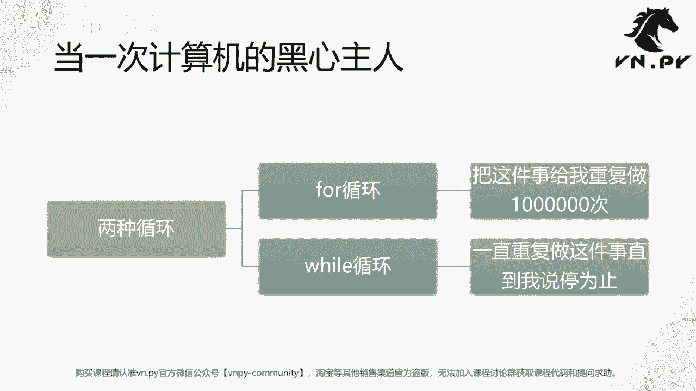
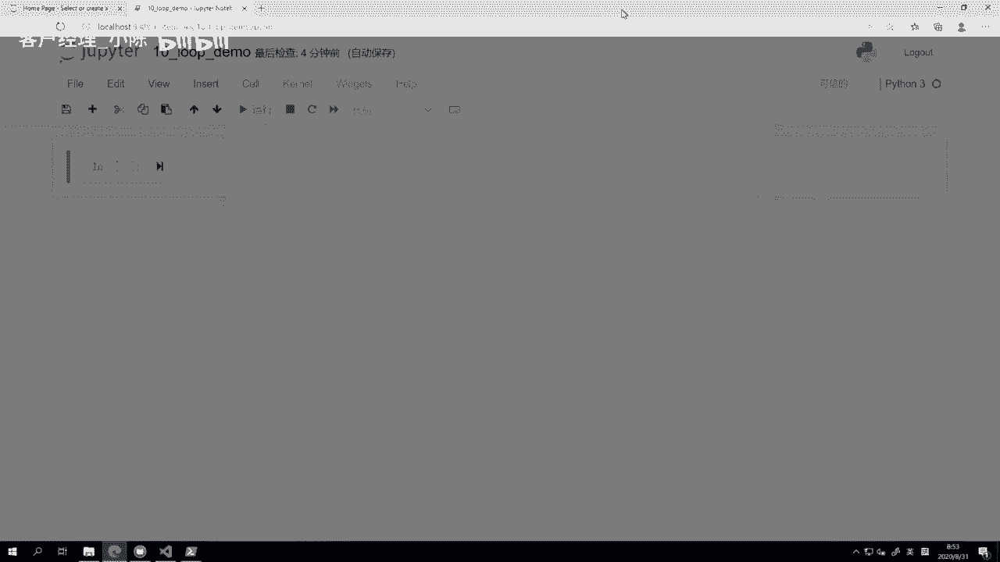
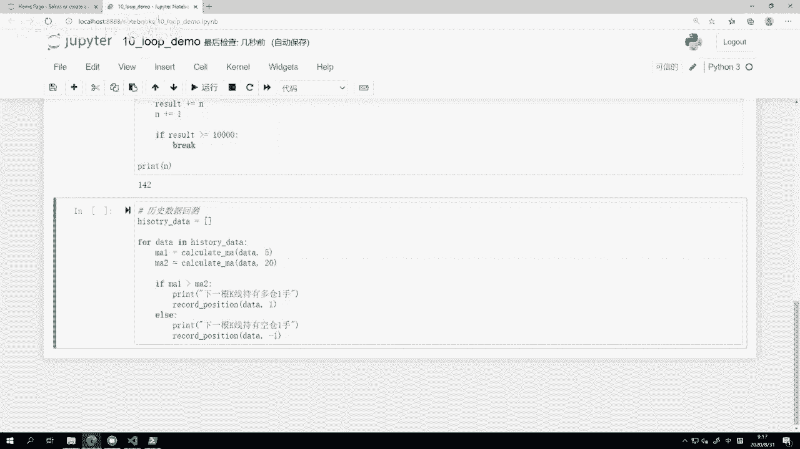

# VNPY30天解锁Python期货量化开发：课时10 – 循环语句 - P1 - 客户经理_小陈 - BV1yNH8eqEhj

OK欢迎来到量化交易零基础入门系列，30天解锁Python量化开发课程，那么今天呢是我们的第十节课啊，在上一节课里面，我们讲完了这个条件判断的概念，这节课里面呢我们要来讲一讲循环语句，什么叫循环语句啊。

在这边我这张PPT起了一个名字，叫当一次计算机的黑心主人啊，我们可以想一下，上一节课里面我们讲这个条件判断的时候，其实我们是在干嘛，我们是在教会计算机哎，去看外面的一件事情啊，它符不符合某个条件。

符合你就帮我做A，不符合就帮我做B啊，这个呢是让计算机一定程度上，替代了我们人的功能对吧，我们之所以最早把计算机发明出来，一定程度上就是因为哎人在计算这件事情上啊，可能速度还是比较慢，效率不是那么高的。

而我们发现计算机可以速度更快的，帮我们把一些结果算出来，所以我们才人类才发明计算机，那计算机一块的应用是之前我们讲过条件判断，另外一块应用就是这边啊，我们让他去重复的去做一些比较枯燥，比较机械的事情。

把我们人的这个生产力，把我们人的时间呢给释放出来，所以在这啊我们先来看一下Python里面的循环，一共有两种，第一种叫做for循环啊，for循环什么意思啊，我这边给一个通俗的解释。

把这件事给我重复的做100万次啊，这个是这个黑心主人，真的挺黑心啊，就让你做100万次，这个啊对于一个人来说，肯定这是非常非常枯燥，非常非常无聊啊，很难接受的啊，但是对于计算机来说呢。

哎因为这就是啊CPU这种芯片的好处了，你只要通上电，哎，你就可以让它根据固定的规则去运行，反而他在这件固定规则运行上还能做的更好啊，同时对他来说，100万也是一个很很小的数字，很快就给你做完啊。

所以这个叫for循环，第二种呢叫做while循环，while循环更黑一点，要我说一直重复做这件事情，直到我说停为止啊，我说停这件事情可能并不是并不一定是我实际，而现实中我说停啊。

可能更多时候是我告诉你停的那个条件是什么，这个对应到我们上节课的内容啊，条件判断如果符合那个条件的时候，你就可以停了啊。

如果不符合，你就一直跑下去吧，所以我们这边啊这个概念讲完了，这节课我们内容就先从两个数学任务开始啊，直接上实例给大家看，哎这个啊这个这个这个循环是怎么回事啊，我们两个数学任务。

第一个数学任务呢叫做简单的数学求和，1~100，第二个呢叫做五加到几，能超过1万，前面这个问题很简单啊，1~100我们知道这个用那个首尾相加，然后乘以数量除二的方法就5050嘛，但如果让你比较机械的。

从1+2加三加到100的话，那大部分人是受不了的啊，而且非常容易算错，那第二个这个算法可能对很多人来说，就就就就就这个没有办法去，你，你也没有一个特别简单的解法啊。

这个当然也有这种等差数列的的这个解法了，但是不像上面那个那么简单，人人都知道哈，所以呢我们看用计算机，它能是不是很快的就能帮我们把结果算出来。

这边我同样已经开好一个啊，这个就变成notebook，给它起一个名字叫做十诶这个loop demo啊，loop就是我们编程里面循环的意思啊，那这边也注意一下。

就我们这边提供这些demo，从第六节课到现在，所有的demo都可以在我们QQ群里面下载的啊，这个大家如果敲，我建议还是敲一遍，敲的过程中啊，这个有什么地方敲错了，运行不起来。

或者诶这个就是怎么样怎么折腾，结果都不对啊，那不妨去QQ群，直接下个正确的这个笔记本来看一看，好我们这边就开始今天的这个啊，数学求和1~100怎么做，首先我们准备一个结果啊。

这个结果呢我给它命个名字叫result，result等于零，然后我们这边做一个循环，For i in range，括号一逗号101pr，好最后我们把results给打印出来啊，不好意思哎。

对result看一下，很快5050，结果就算出来了，那我们更多回来看这个代码什么意思，首先我定义了一个变量，它叫result啊，就是我们要求和的结果，然后我这边写了一个循环。

叫做for i in range，括号1~101，然后result加等于I，这一行代码我们前面已经学过了自增运算哈，这个大家都应该都会哈，就是把这个result的值加上，这边我们循环到这个I的值啊。

就每循环到一个值，从第一个开始一加到这个result数字上，循环到二的时候，把二加到之前已经有一的那个数字上，这时候变成三，循环到三的时候呢，用三加上那个啊，这个三变成六。

然后循环到四的时候就是6+4变成十啊，一点点循环完，直到最后全部循环完了，结果就是我要的结果，第二个要注意的点是这个地方这个range，首先range是Python里面的一个，叫做取范围的函数了啊。

那么函数呢这个概念我们现在还没有讲，我们要到后面一点讲啊，但是在这我们更多把它当做一个固定的概念，来记range，括号一逗号101，什么意思，就是它会生成从第一个数字啊，前面这个数字它是包含在里面。

从第一个数字开始，1~2到3~4到五，一直到101，前面的一个整数结束的这么一个序列啊，相当于一是包含在里面的，但是101是不包含在里面的，所以这样生成的范围，就是我们之前要的这个1~100啊。

是这么一个概念，我们也可以这个就给大家看一下，如果我把它转化成一个list range啊，一到就我这边考虑就生成的少一点啊，因为100个数据看不过来了，我就只生成1~10。

那这个range1到十是生成范围的，它是生成从1~2到3~4到九的数字，然后最外面加了一个list函数，它的作list是Python的，既是一个函数，同样的也是Python啊，这个内置的一种类型哈。

它其呃，这这个或者更多时候可能把它看作一种类型，不把它当做一个函数来看啊，反正anyway我们这边啊运行它一下，看结果是怎么样的，他会打印出这么一个样子，其实就是range，1~10。

这个运这个这个这个运行过程中会经过的数字，我们可以看到这里从一一直到九啊，包含了前面这个数字，就这个起始数是包含在生成范围里的，结束了这个数字是不包含在生成范围里的啊，这个概念一定要记住它好。

所以这样就是一个非常简单的for循环，我们就把这个相当于循环了1~100，这个一共100次，然后把每次的数字呢都加到result上啊，这样就起到一个数学求和作用，非常简单啊，然后你也可以看到这件事。

计算机做是不是比你快多了啊，你手动弄我草稿纸算的话，那有的算，当然你会这种首尾相加法，计算机不会，这是另外一回事啊，但计算机即使不会，他做这种数学运算真的是很快，因为它毕竟内存里面跑的这电流。

你可以认为是接近光速在运行啊，然后第二个我们五加加到几，能超过1万，这边呢我们也一样，首先诶添加一个额，这个弄个结果，result result就是求和的结果啊，然后我们要一个东西，一个数字就是I啊。

或者我们另外给它起个名字吧，NN等于零啊，N就是我们这个从五开始循环的数字啊，这当然N1开始是这个result，一开始是五啊，然后N应该第一个数字是六了啊，我们从六开始嘛往上加。

然后我们这里的写法是while result，小啊这个小于一，啊因为是超过吗，应该小于，所以反过来就小于等于，如果我们要的求和结果还小于1万的时候，我们就啊这个r salt加等于N啊，然后N加等于一。

什么意思，两个自增运算在这里啊，result首先加上了下一个要加的这个N的值，然后N同时自己还要加一，加完五周后要额加完六周后要加七，加完七之后要加八吗啊这样一直加一直加，加到最后我们这边同样最后啊。

这个循环结束之后，我们打印结果print呃，这个N好，我们把这个N的值打印下来，就看它循环到多少，他会啊满足这个条件啊，回车结果出来142什么意思，从5+6加7+8加九，一直加到142。

这个这么多个数字的和，加起来就已经超过1万了啊，反过来如果只加到141的话，他是不会超过1万的啊，你可以哎，我这边也给大家留个课后作业，你可以用上面这个写法，for i in range的写法去算一下。

哎我这边从五加到142，是不是真的大于1万啊，如果五加到141，是不是正好小于1万，这个作业呢交给大家自己来试一下，然后我们更多回来看这个写法，while是一个叫做持续性的循环。

然后它是在当后面这个表达式符合条件的时候，为true的时候就继续啊做了这个循环里面的事情，所以你一想哎，这是不是有点像if if就是前面符合条件啊，我就做里面的这个啊要做的特定任务。

只不过while这里不像if是错一次就结束了，而是会不停的做，不停的做，不停的做，直到什么时候不符合这个条件了，他才给退出来啊，所以在这儿就是while result小于等于啊，这个1万的时候。

那一开始就知道是五嘛，然后下面要加的第一个数字是六嘛，刚开始是五肯定小于等于1万嘛，啊这个这个差的远的，所以我们就把result自增加上一个六，加完之后不就11吗，result第一轮变成11。

N就变成了这个七啊，N加一等于一等于七啊，然后呢进入到下一轮，这时候我们又来看result，新一轮是11，对不对，他还是小于等于1万的啊，所以就继续继续继续，直到最后还满足条件退出。

如果你想要看一下结果是怎么样的，这个循环过程中的内容，我们可以打印一下print result，嗯啊我们把每轮的，但我先打印N嘛，然后打印result就每一轮加的那个数字。

然后把包括加完的和我把全给打印出来，选择回车诶，这个是不是就比较清楚了啊，不好意思啊，这个应该在这，好我把它放在这写的什么区别呢，啊放在这是这一轮加的，就就是这轮加的N加上这轮累。

加上N之后的日子要打印出来，我刚刚放的那个位置是已经自增的，一之后的结果再打印出来啊，所以它应该放在这print我们可以看到啊，第一轮从5+6折11+7折，18+8折，26+90。

周35得得得得得很快啊，这个累加起来越往后就累加越快嘛，一直到140的时候是9860，到141的时候就是1万01了啊，所以这个就是我们的这么一个循环判断的，这个中间的整个过程啊。

就通过这个方式给大家展示出来，那么另外一种情况叫做循环的中断啊，这个简单的循环就是我们前面那个情况，循环的中断是什么呢，如果满足一定条件的话，那这个条件判断怎么做，要用if来做if。

我们上节课已经学过了，所以对我们来说不是问题，然后满足一定条件，我们就去怎么中断，它有两件事，一种叫continue结束本轮操作，还有一个呢叫做break啊，中断整个循环直接给退出啊。

我们这边也来看一下，那还是这边的这个，当然这个单元格内容太多了，我把它刷掉，我先把这个print哎，我给大家注释掉，这行代码，到现在为止我们还没讲过代码注释的概念，在某一行。

在这个内容前面加上一个井号啊，大家可以看到这个字体变了，加井号之后变成这样，然后加一个空格，意思就是把这行代码变成一个文字注释，文字注释的内容，对于Python而言，他知道这个信息是给你人看的。

所以它在运行的时候不会去执行这一行的内容，所以你随便写什么都行，你写中文也可以写什么都行啊，就像这我其实给大家每块内容都加了注释啊，像在这里的内容呢，我也把这个输出给注释掉啊，这样清楚一点啊。

不然打的太多了，就看得眼睛难受，我们就在这来看一下这个啊，这个第一个语句叫做continue语句，continue语句哎，什么意思啊，就是我们在这唉还不偷个懒啊，把代码直接复制粘贴过来。

for i in range1到101，这次我要做一些特殊的事情，我让你还是从1~100求和，但是我只求和其中的偶数，我不要其中奇数偶数，我们知道怎么判断，if判断if i用一个整除复啊，就求余数啊。

求余否，if i这个对二进行求余等于等于零，哎除二之没余数，Nah，我们这个哦不好意思啊，求因为我们要的是的的是这个这个啊，偶数求和啊，所以我们这边要判断是如果它不等于零的话，就它是奇数啊。

如果是奇数的话，那我们就直接continue，就这一轮循环下面这个这句话result我不要了，我不执行它了，我直接进入下一轮循环里面啊，然后反过来只有他这个等于等于零，是偶数的时候。

我们才继续会执行到这一行代码上啊，所以这样我们循环一下，看看结果就只有2550了啊，前面这个是5050，所以1~100的偶数加起来啊，只有250这个数字，然后我们在这儿可以看到。

就是啊这个首先之前的那个球余啊，这个计算方，这这这这个计算符，我们第一次正式在逻辑判断里，那就在我们的代码里面用到它，让大家看看它有什么用，最简单的一个作用就是判断它是奇数还是偶数，一个数字。

如果对二进行求余为零啊，这个那自然就是一个偶数，如果他对二进行一个求余不为零啊，那他自然就是一个奇数啊，甚至于我们这里还有一种更加简单一点，更加清爽一点的写法，If not，直接这么写。

我们最开始的时候讲到变量类型有提到啊，这个true和false这两个值，那true额转化成整数的话是一，false转化成整数的话是零，但如果反过来转化，把整数转化成true false的话啊。

只有零转化过来是false，剩下的123456789十，甚至一负二负三什么的，这些数字只要有个数转化过来都为TRU，所以在这我们可以做一个判断，if i2%啊，对对二，求余嘛，只要有余数。

你是我不管你余数是多少，只要有余数肯定不是偶数，不是偶数，我就直接continue，哎，是不是比上面这行代码又更加清爽一点，省掉后面的的内容了，反正我们在写Python也好。

还是写C加加写所有编程语言的时候，一定要记住这一点，就是你的代码如果有可能，经一定尽可能让它精简啊，越短的代码可维护性越好，当然你不要为了这个让代码精简，去使用一些就非常奇怪的啊。

非常少见的那些呃写法哈，当然在Python里面可能你能这么做的空间不多，在C加加在一些其他汇编list p语言里面，能做的东西比较多一点，他可以用各种括号啊，各种奇怪的宏啊，然后把代码大幅的简化。

当然这件这些事情在Python里面你可能啊做不了，所以一般情况下就是能简单一点，我们就把代码哎这个行这个不管是行数也好，还是每行内容也好，都给缩减一些啊，所以这个就continue的写法。

另外还有个写法啊，我们这边再来举个例子，就是还是前面这个循环，我分别用这个continue和break把他们两个给改进一下哈，Break，应该叫continue中断哈，好那么在这啊，我们就不再用这个啊。

while truwhile这个条件判断，我们把它直接写成while tru啊，就一直运行下去，然后什么时候结束呢，result啊，我们要它那个超过1万嘛，大于等于1万。

当这个result就是不断的求和，当它大于等于1万的时候呢，就结束啊，就break打破这个循环退出来啊，我们可以看到运行完结果也是1C1啊啊，当然注意注意就这边的这个呃N的话。

我最后这个啊是没有进一步加一个一的啊，所以这边结果和刚刚好不一样了，我把这个这个要给移上去，要放在这，然后再去做判断啊，这样的结果是意思啊啊，所以嗯这样的写法对比到前面。

while这边写条件的写法有个什么好处呢，它比较符合我们人直接的一个思维模式，像我之前讲的，我是要叫五加到几能超过1万，但是我在这里写代码的时候，我其实写的是小于等于1万。

while它小于等于1万的时候，我就继续循环，这个稍微我其实还额外多做了一步逻辑转化，从超过1万转化到诶不超过1万的时候，什么情况就小于等于啊，这个多做一步逻辑转化。

反过来你用break的时候就很简单了啊，首先我要去，我就先做这个循环，然后每一轮循环我去检查这个这个条件，符不符合，符合我就break，不符合我就继续break的意思呢，就整个循环我就接受了。

不会继续了啊，就直接退出这个循环了，所以这种写法它其实是诶正向式的思考，更符合我们人很多时候的一个脑子里面的，一个一个一个这种思维方法啊，所以呢这个是break写法的这么一个好处。

那么啊结合上continue和break啊，有的时候你可能符合这个条件，我是这一轮操作我不做了，我下一轮继续，有的时候呢你是哎想要break直接满足某个条件，我把整个循环都给退出掉了，那这些的不同的啊。

方法不同的逻，这个这个这个其实这些中断语句啊，本质上都呃跟我们上一节课条件判断，它是有一个非常强的结合关系，你一定是符合某个条件时候才能去肯定流去break，不不可能好好的。

你比如循环第一轮我就跑去continue，或者循环第一轮跑跑去break，这个没有意义，这也是为什么讲课这个，这个我们这个系列课程过程中，是按照一个比较严格的顺序再给大家讲啊。

因为内容是知识点是一点点串起来的，不像我们可能其他一些比较偏，这种量化实操的课程，那我们更多是围绕着一个策略本身的知识点，发散出来讲，而不是按照顺序讲啊，这个也也是一个比较重要的原因吧。

那接下来呢我们就来看啊，循环我们也学过了啊，上一节课条件我们也学过了，甚至我们这节课里面刚刚那个中断语句里面，我们看到的条件和这个循环的组合起来怎么用，那这边呢我们给大家讲一个最简单的啊。

他们在实践中的应用，就有我们量化交易实践中的应用，就是做策略回测啊，假设你现在已经拿到了一堆的历史历史数据啊，你拿到比如说啊沪深300指数，这个过去啊3年的分中线的均额，分中线的这个K线数据啊。

这个时候呢，你想要写一个最简单的双均线策略啊，这个5日和20日均线，5日这个在20日上方我就做多啊，反过来我就做空或者金叉做多，死叉做空啊，就这么简单，我永远反而拿这个仓位。

那如果你想回测一下这个策略在历史上，数据上的回测结果其实非常简单，用我们现在掌握的知识呢，已经可以完成其中80%的环节了，就是循环这个历史数据啊，计算双均线，判断均线的位置啊，然后呢如果均线金叉了。

你就记录一个买的记录，如果均线死叉了，你就记录一个卖的记录啊，最后把这些结果汇总啊，这个统计出来哎我到底盈亏是多少，那就把这个回撤做完了，那在我们这边啊，因为这节课呢我们还没有讲到后面几个这个啊。

比如说函数的概念，比如说这个啊，怎么样去用Python的内置的功能去读取，CSV文件里面的历史数据，这些内容我们可能要稍微往后面一点讲啊，所以这节课我没法把完整的回测给大家跑前，但我给更多给一个啊。

这个啊for循环的这么一个demo吧，就怎么样啊，你去把这个结果跑出来，历史数据回测，比如说我们先有个history data哈，我们有这么一个历史数据的这么一个啊，我们接下来很快就要讲这叫列表哈。

就是这么一个历史数据的列表，这个是Python里面一个数据容器，就是你可以在里面有一个个数据点啊，一根根K线数据，那么for这个就下面是一个for循环。

For data in his three data，一个for循环，然后呢我们这时候就来计算，比如说啊calculate m1等于calculate ma啊，这个D下，然后一个这个数五啊。

M2等于calcullate a data，这个20好，if m1大大于二，如果M1是大于M2的，那此时啊当前K线时有躲藏，else print嗯，当前明显尺有空仓，一首。

可能我们这边还要做一件额外时间，Record a record position，那整体上就是这么多行代码，我们其实就把回测这件事情给做了啊，当然在这个代码是现在运行不了的。

你因为我们少了calculate ma，这是第一个函数计算均线的第二个这个记录，当前这根K线持仓，就后面我们用来统计盈亏的这个函数，我们也没有实现啊，因为还没讲到函数嘛。

那这呃这两块内容我们要留到后面讲，但整体上这个回测的意思已经出来了啊，就所有的历史回测，不管是多么复杂的策略，不管是什么期货，期权，股票的本质上都是这么一个原理，先把历史数据哦。

包括还有这个我们读数据这块啊，我们也还没讲啊，这这里数据是还是一个空的，反正不管怎么样，第一步就是你用数据库访问的形式也好，还是用文件读取方式也好，反正先把那些数据从硬盘里面读到内存里面来。

放到这么一个history data的列表里，第二步，把这个data列表里面，所有的数据从头到尾循环一遍啊，就跟如果你有机会让你回到历史上那个点，真正去跑交易的话是一样的嘛，一根一根K线过来。

一个一个做判断，一个一个点，你决定这个时候应该买要卖啊，让我先来拿着这个新的历史数据啊，计算一下5日均线，然后计算一下20日均线，然后我就看啊，5日均线大于20日均线，那意味着这个时候是多头情况。

所以这个时候呢我应该持有多头仓位，当前可以现持有多仓一首record position，记录下啊，这个时间点上我应该只有一个多头的仓位，反过来啊，当前K线只有空仓一手，我就记录一个当前这根K线。

我只有个空头仓位啊，就这么简单，跑完之后，那每一根K线点上你应该持有的仓位，其实你都已经知道了啊，当然了，我们这里的这个回测其实犯了一个很，就是我们后面要讲的啊，就是在做数据分析也好，做回测也好。

一个非常致命的错误，就是未来函数啊，因为我们这里MA1，MA2是当前这根K线的高低点，然后我记录的时候是记录当前K线是有多长，一周，这个其实等于这根K线收盘了，你已经看到他的收盘价了。

你再去判断哎我这根K线是要买还是要买，那肯定你判断你总能这个这个就这根K线涨了，我就我就假设我这个开始的点可以先开盘点，我就再买嘛，跌了我就再卖嘛，那你就跟印钞机一样，永远只会赚钱啊。

这个就是个未来函数，所以正更正确的写法呢，应该是下一个K线持有多长一寸啊，就是你在看到这根K线的时候，你只能去对你下一根K线要做什么事情，做一个判断，你不能去再去修改你这根K线要做什么事情。

这个叫做一个时间序列的一致性啊，但呃讲的这个扩展内容有点多啊，但anyway反正就是这么个意思啊，十行代码你就能满足这么一个历史回测的，意思就在这了，当然这俩函数的实现呢，我们得后面来讲。

OK那么哈哈我们这一集的内容呢就到这，更多精华内容，还是请扫码关注我们的社区公众号。