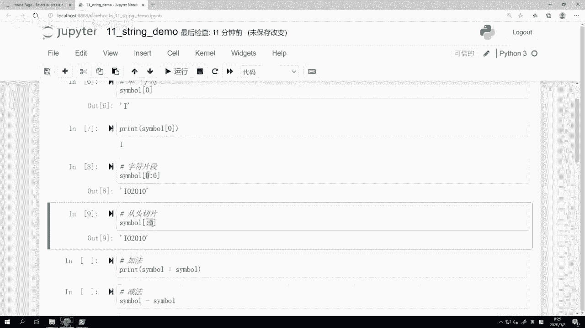
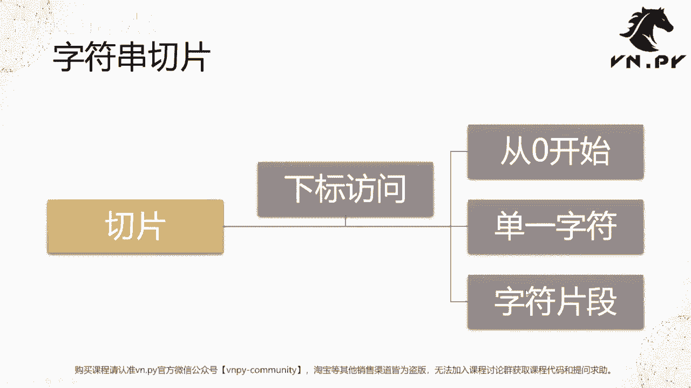
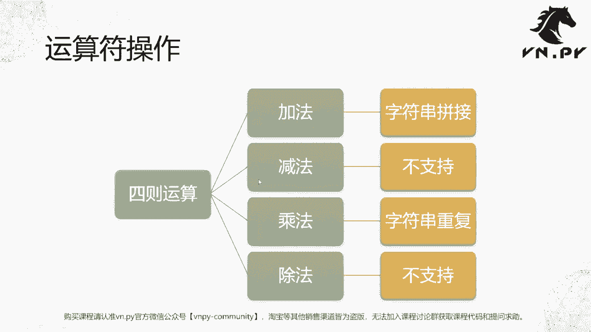
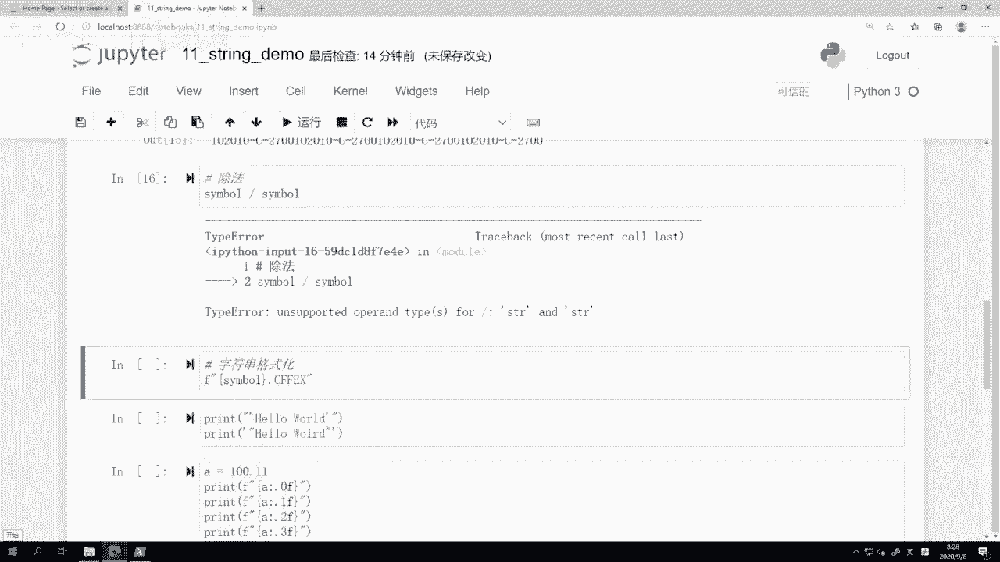
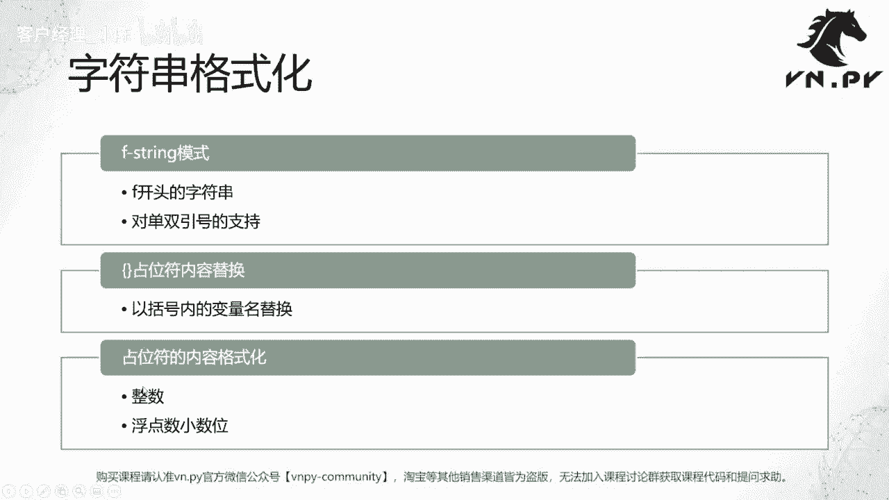
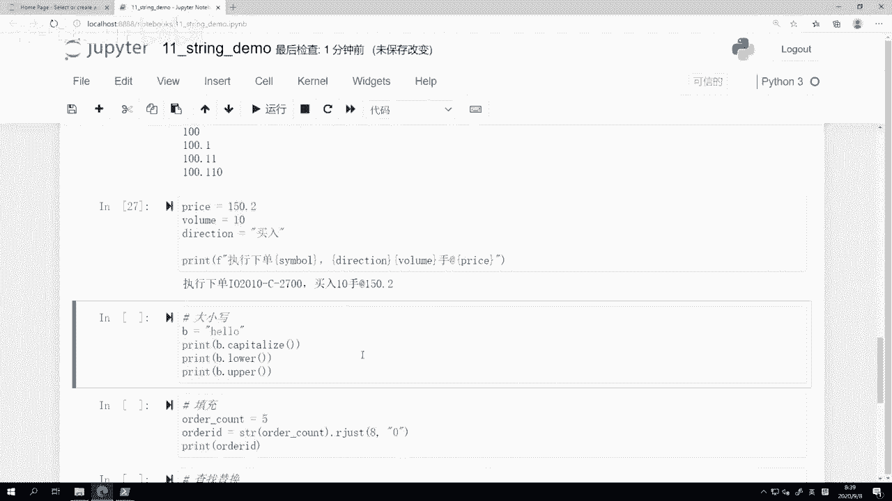
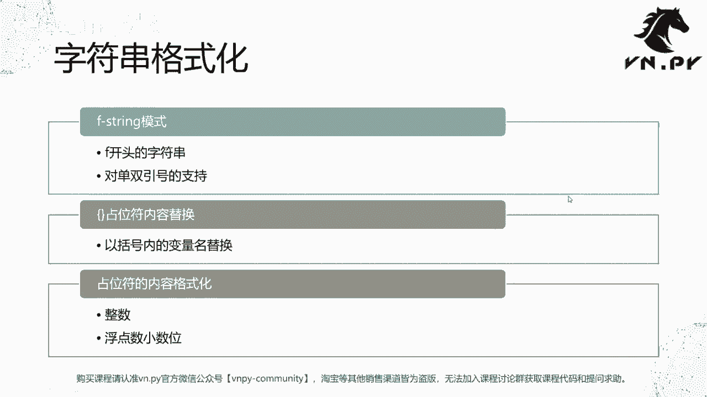
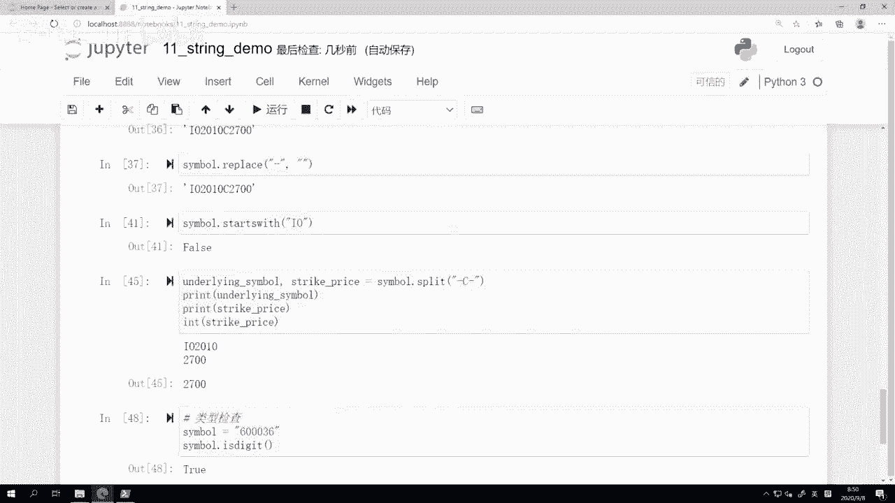
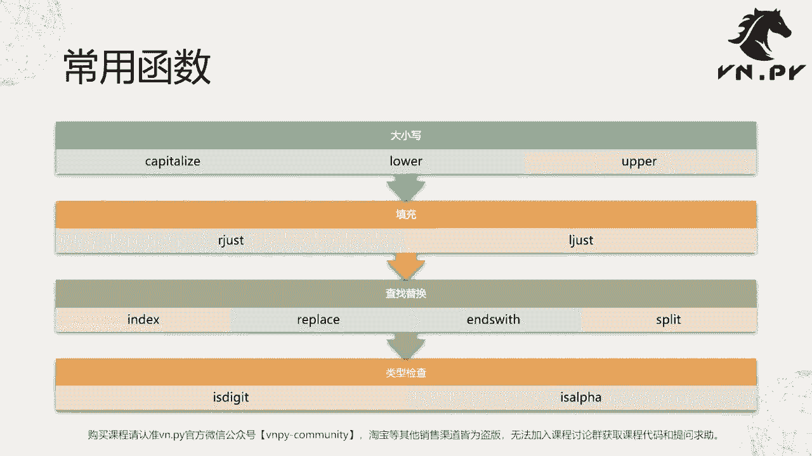

# VNPY30天解锁Python期货量化开发：课时11 – 字符串深入 - P1 - 客户经理_小陈 - BV1c6pTeuERt

基础入门系列30天解锁Python量化开发课程，那么今天呢是我们的第11节课了，在上一节课里面我们讲完了这个循环语句啊，这节课我们要回到这个基本的类型字符串，来深入进去。

看一看更复杂的一些围绕着字符串的处理，那么啊首先第一个我们要讲的内容呢，就叫做字符串的切片啊，什么叫切片呢，我们来回到最早的我们第一个接触的字符串，Hello world，来想一想。

Hello world，它整个字符串啊是由HELLO逗号啊，然后WORLD再加个感叹号，那么这一个个字符组合起来的，那么如果我们把这个字符也差不多，是大概12格的样子吧，我们把它视作一个整体的话。

那有些时候我可能想要去知道哎，前面头五个字符是什么内容，有的时候我想要知道最后一个字符，结尾的那个字符是什么内容，那这个时候我们就按的这个叫做切片的技术啊，那此时呢我们要啊这个切片的时候。

要用的这个访问方式叫做下标访问，这个下标访问也是在Python语言，甚至在所有编程语言都是一里面，都是一个非常重要的啊，这么一个数据访问的方式。

那这样我们就先从代码开始，那这个代码同样啊，大家回头可以直接从我们的这个课程的QQ群，里面来下载啊，然后这节课因为是第11节课，然后就又是讲字符串的，所以就叫string demo。

那么我们来看第一个单元格，在这里我定义了一个字符串，它叫做symbol，symbol就是合约代码的意思，然后后面的内容呢叫做IO2010，然后一个啊这个键盘上是减号，或者你管它叫横杠也行。

然后C是大写的C，然后再一个横杠2700啊，最后跟一个双引号，那么这个啊我先把它运行一下，这个symbol是什么啊，如果做过期权的同学可能会非常熟悉啊，这就是我们中金所估值期权的合约代码啊。

我们现在定义的这么一个字符串symbol，然后下面呢我们来尝试着诶，我想要先看一下，处于第一个位置的这个这个，这个我们的字符串的这个字母，或者说他可能不是字母，也有可能是数字，也有可能是这个符号。

我不知道啊，但是我想访问他一下，我想把它打出来啊，这样呢我们就来试一试symbol哈，一个方括号，然后中间是一个数字，这样访问的就是我们第一个字符了，那这里要注意的点是什么，第一个就是我们的啊。

第一个位置的这个字母，虽然他在第一个位置，我们人说是第一个位置，但是在编程语言里面，这个叫做数下标的这个数字啊，就是这里面零啊，什么一啊，二三是从零开始，所以零对应的是第一个位置的数字。

所以我们看一下第二个，如果我数一的话，他其实给的是第二个位置的数字，就额第二个位置的字符就是O啊，数二的话给的就是第三位置的这个二啊，然后说三的话给的就已经到呃第四个位置了啊。

所以他其实在理解编程语言里面的下标的时候，和我们人脑子在想的时候，你要有这么一个减一的关系啊，因为我们正常数嘛，这是第一个，这是第二个，第三个，第四个，但对编程语言来说，这个是第零个，这是第一个。

这第二个第三个啊，不管是Python还是C加，加绝大部分编程语言里面下标啊，都是从零开始的啊，然后这里呢我之前操作我把还是回到零啊，我这样输入完零之后，大家看到这里有个out啊。

这个操作的意思在JUPITER的那节课里面，我们之前有提过，他其实是获取了我这个对symbol进行切片啊，我就取它第零个位置的这个字母啊，然后返回的结果，所以它是一个这个I。

但是JUPITER为了让我们能更方便的看清楚啊，返回的数据类型，他前面把这个啊，这个字符串类型的引号给加上了，那么如果我们直接用print啊函数来打印它出来，我们可以看到I是长这个样子。

它前面是没有引号的，其实这里返回的字符本身是不带有引号的，只是因为在JUPITER里面，他为了让你人啊，能够更方便的知道这个数据是什么类型的，他给你额外在字符串外面加上了引号啊，这个所以不要搞混啊。

正常字符串是不带引号的，然后刚刚是单一字符，然后下面来看一个叫字符串片段啊，比如说我想要知道啊，那这个是个期权的合约代码嘛，正常我们来把它分解一下，前面IO啊的部分是这个期权产品的名字。

叫index option，估值期权，2010是它的到期啊，这个年月，然后这里的这个杠C杠说明他是一个看涨期权，最后2700说明它行权价是2700啊，那么我们现在可能想要知道第一点啊。

我想知道这个品种它的这个呃，就就这个期权合约，它对应的品种和年月是什么，比如说F20啊，这个幺二啊，F2010等等啊，我可能想要知道投六位，那这应该怎么做呢，用这个字符片段的切片，那还是一个方括号。

但是方括号里面是怎么写的呢，首先这里是一个啊，这个第一个你要切片开始的那个值，然后是跟一个冒号，再跟一个你要结束位置的下标，我们先把它运行一下，可以看到截出来的结果是IO2010啊，回来我们来数一下。

首先第一个切片是零，所以他从第一个位置开始一直截，一直截，截到六的时候是在哪呢，其实是这里的这个减减号，我们可以数一下1234567啊，人数的话，这已经是七了，但是对下标来说，他应该是六。

但是我们在这里注意到我后面这个数字，六位置的减号下面是没有截取出来的啊，就减号是没有的，所以对于Python的这个字符串切片来说，它是含头不含尾，就是零，它是包含在里面的，但是不好意思。

六是包不包含在里面，它只是从零解到六，前面一个数字就是五啊，然后第二种切片方式呢，有的时候啊你可能每次都写个零，你觉得麻烦，哎，我就想从头切到六的位置，怎么切，就用这个symbol直接冒号一个六。

前面的零省略了，同样切出来的结果也是一样的，也是这个2010IO2010啊，这个就是一种啊就简化式的写法，甚至于在我们后面自己写代码的时候，可能更推荐这种写法啊，因为你打的字母越少。

你在代码里面容易犯下的不小心，那种所谓table就打错字，或者说犯下一些bug就会更少啊。

所以这边我们回到PPT啊，这个切片，第一个我们这刚刚掌握了什么叫下标访问啊，这个懂了，第二个我们也懂了，所有的下标访问，在编程语言里面大部分都是从零开始的，零代表的就是第一个位置。

一代表的就是第二个位置，以此类推，然后单一字符切片呢，哎就直接放括号里面一个数字就行了，字符片段切片呢，就是俩数字中间用一个冒号连起来，然后切下来的结果是含头不含尾啊。

下面呢我们来看一看字符串的一个运算符，操作啊，他额这个我们就还是来看这个所谓的四则运算，加减乘除，那么这四则运算，我这边先把结果都给大家说一遍，加法就直接是把两个字符串给拼起来，减法是不支持的啊。

字符串不支持减法，乘法是直接把字符串给啊，批量的重复除法呢也是不支持的啊，其实也容易理解。

我们先来看一个代码啊，加法那我们之前symbol啊，大家还记得啊，就IO2010杠C杠2700，那么我们直接来把这俩数加起来，print啊，我这边用了个print把它们加起来，大家可以看结果是怎么样的。

其实直接就是两个字符串啊，彼此相加了啊，就把它们结合在一起了，黏在一起了，你可以这么认为啊，或者我前面把print给去掉的话，就是它还是一个字符串啊，就就是用前后两个东西组合起来的字符串。

那我这边呢是用两个相同的symbol相加的，如果你有不同的加，你可以试一试，结果都是一样的减法，我们来试一下symbol减symbol啊，直接就会有个报错。

叫type error on spoorted，Operand type，哒哒哒，意思呢，首先这里的这个报错啊，其实在我们之前几节课里面也陆续出现过几次，它叫做Python里面的抛出异常啊。

说白了就是Python解释器啊，就我们的这个运行着的，背后的Python的这个啊，环境觉得你这一句操作是不对的啊，啊这是我们Python不支持的操作，所以他就抛一个异常出来啊。

这里的这个异常就type error，就是这个字符串是不支持减法的啊，就这个意思让我们来看一个乘法，我们这把symbol乘三啊，注意乘后面这个乘的一定是一个整数，你不能成浮点数，你也不能成布尔值。

你也不能再乘一个字符串啊，这样乘完了之后我们可以看到诶，它的结果其实更好，简单一点，就是直接把这个字符串啊重复了三遍，然后呢给拼起来了，有点如果所以乘二的话，其实就跟我们上面这个加法效果是一样的。

就直接给加起来，但你如果乘4×5的话，效果会更好啊，就是有的时候会方便，如果你有字符串要快速重复的话啊，你也可以试一试，用这个symbol乘以symbol啊，看看会触发什么样的报错，最后还有个除法。

我们也运行一下，同样这个也会有个报错，是不支持的，字符串和字符串也不能除啊，同样我们就人脑想一下，它也没有意义嘛，你这个除呃除俩字符串，这个就它没有个直接的意义啊。

那呃这样我们回到PPT下面，我们要讲的一个内容叫做字符串的格式化啊，什么叫做格式化呢，就是我们有的时候啊有一个变量是字符串了啊，或者说我们有一个字符串变量，但是呢，我们希望把这个变量嵌到另外一个字符串。

里面去啊，这样的可能我们希望比如说这个symbol，就是刚刚我们那个期权合约的代码，有的时候呢我们希望把它嵌到一句话里面去啊，比如说我策这个量化策略运行的过程中，我一个啊策略下单了啊。

这个下的是什么合约的单子，什么价格下的什么啊，这个额数量下的，我有可能我希望哎回头打一个日志出来，让我人可以看到，那此时其实这个合约代码你下单的价格，你下单的这个数量啊，都是知道的。

那么如果能用这么一个字符串格式化的方式，把它拼成一句话，诶这个给我们人输出出来，我就觉得比较舒服，人一眼就能看懂嘛，所以呢我们这边可以来试一下啊，就叫做这个f string啊，我们先把这几个内容看了。

f string是一个叫做以F开头的字符串啊，等会我们会看到啊，然后我们要看一下对单双引号的支持，然后f string里面呢，所有我们要替换到这个字符串里的内容，是用这么一个哎大括号啊。

这这个东西叫占位符啊来实现的，内容替换，是以这个大括号里面的变量名来替换的，最后呢对于占位符里面的内容。

我们可以做一些格式化啊，我们可以把它显示成是整数，显示成一个浮点数的小数，会这边呢我们就来看一下啊，还是之前那个symbol呃，就是我们的IO啊，这个2010啊，然后呢我们想把它哎这个symbol啊。

很多时候我们就是它是一个单一合约的代码嘛，但在VIENDER派里面，因为VNAP啊可能接了诸多的交易所，可能不只是四个期货交易所，可能还有上期所啊，呃不是上交所啊，这个深交所还有海外的很多交易所。

那不同的交易所之间的合约代码，有可能重复的啊，可能你叫比如说五个零一个1000001啊，我也叫000001，那如果只是用一个合约代码的话，你可能就分不清楚他到底是哪个交易所的。

所以我们在VN点派里面创造一个概念，叫做v t symbol啊，VT是VN点派的VN trader啊，就我们那个量化交易平台的缩写simple，然后它是怎么构成的呢，它由一个前面是这个合约代码。

然后呢中间是一个点啊，英文的句号啊，后面跟这个我们的交易所后缀，那这边呢因为我知道啊，这个交易所是CFEX，就是中金锁啊，所以呢我试着直接去生成这么一个VT，Symbol，我用了一个F字符串。

大家看到哎，这就是在引号最前面加了一个F，然后在里面呢我用了一个大括号啊，大括号里面是这个symbol，就是我要去把它格式化到，我后面这个v t symbol里面去的，这个字符串信息，然后跟一个点啊。

跟CFX这个后面的内容本身就是字符串啊，这个本身就是字符串，我们运行一下，看看结果什么，就直接把组装起来，IO2010杠C杠，还有700点CFX，还有一个选择是什么。

哎我把exchange直接进行一个复制了，我把exchange也改成就这个交易所啊，也改成一个字符串了，然后我把它诶后面这个字符串交易所的部分，我也用这个格式化的方式来运行。

我们再看一下运行结果也是一样的啊，其实相当于你就可以把这个变量直接诶，给替换到这个下面，你要生成的这个一个字符串的这个画里面去啊，这样就非常方便了，然后另外我们要注意的一个点啊。

就是有些时候我们在字符串里面，希望其实是输出引号的啊，因为我们知道在Python里面，第一节课我们也就讲这个基本的类型啊，这个如果你是一个字符串的话，外面要引号给括起来，但是引号的话。

你单引号双引号Python都支持啊，这这两个都是合法的，都是可以运行的，但是呢如果我希望把引号哎，我本身输出的这个字符串里面就要有引号，怎么办，那么你就要稍微做这么一点替换了。

如果你外面用的是双引号的话，那里面哎你可以放单引号，如果外面你用单引号来表示字符串的话，里面可以放双引号，我们来运行一下，看下结果是什么，哎像这样注意我这里用的是print，我没有直接用那个啊。

就是这个输出啊，我在下面，如果我来用一下JUPITER输出，大家看一下结果是什么，大家可以看到他是这样的啊，就其实最外面是就是在你print的时候，他已经把作为字符串啊，显示的最外面引号给给给省略掉啊。

给隐藏掉了，所以在这里，你看到引号就是包含在字符串里面的引号，这跟我们这个最上面，这里的这个引号不是一个概念啊，这个是JUPITER为了让你看清楚，他额外给你加的这么一个引号啊，然后有的时候你可能会说。

哎我那我今天就比较特殊，我就想用个双引号，然后我双引号里面还想再放个双引号，怎么办，你可以用这个反斜杠转，叫做哎这个转义符，大家可以看到啊，这样运行一下什么意思呢。

Python字符串里面如果带有这个反斜杠的话，它是位于我们这个啊，就是键盘上退格键或者回车键上，额退格键下面或者回车键上面的这个啊，这个按键他是所谓的这个反斜杠啊，那么在这里有他在前面。

后面再跟个这个引号的时候，那么对外面这个字符串来说，它就会把它识别成一个A，就是你就是要双引号啊，反过来我们如果把反斜杠删了会怎么样，我们可以看到它会报错，叫syntax error啊，这个叫语法错误。

就Python不认识这个语法啊，本质上它是把这里视作一个字符串的，这里又视作一个字符串，但中间你这个hello world是没有定义的，所以他就不认识了，所以你这样加上反斜杠之后，哎。

那就可以正确的把这个引号，双引号嵌在双引号里面，反过来，对于单引号嵌在单引号里面也可以这么操作，然后再进一步内容呢，就是我们的这个啊叫做啊，占位符内部内容的格式化了，这块主要是对数字啊来演示的啊。

比如说我们这边定义了一个数字A啊，它是100。11，然后呢我四个不同的显示情况，第一种情况我希望不保留小数啊，一位小数都不要有，我这里大括号在外面，然后里面前面是个A，就本身后面跟了一个冒号啊。

冒号意思就是，后面我要对它做一个格式上的转化，怎么转化呢啊，我们这里写了个点0F，点多少F就是要保留多少位小数，点0FEA都不要保留点EF保留一位，点2F点3F啊，保留对应的位数，当然除了这个点几F啊。

点点0F或者反正就这个点几F吧，它是一个叫做呃浮点数，保留多少位小数的字符串格式方式，同样还有在Python里面还有很多其他格式化方式，比如说你可以把这个数字表示为，一个八进制制的数。

一个二进制的数等等啊，或者一个科学计数法等等，那这些都是叫做字符串格式化的显示方式，因为你可以想象背后这个数字本身这个数据啊，100。11这个数字本身是没有变的变的。

只是我们计算机把它转化成字符串的时候，呈现给我们人看的这个方式啊，我们知道这个小数点位，可能对于一些比较短的小数啊，是比较容易看懂的，但一个特别长的小数的时候，可能你就适合用科学计数法了。

或者一个特别大的数字的时候，你也适合用科学计数法啊，反正针对不同的情景吧，用不同的方法，我们这边也是shift回车运行一下这个单元格，可以看到结果100。1保留一位小数都不保留，就是100啊。

保留这个两位小数，就是这个啊保留一位小数就101，两位小数是以三位小数，大家可以看到最后用一个零占了一个位啊，因为这个只有一一嘛，只有两位小数，他就给我加一个零了，所以下面啊。

我们这里已经把这个字符串格式化的一些诶，技术给讲了，下面呢我们来稍微讲一讲，这个我们一个实用一点的内容，那比如说啊我symbol还是这个最上面的这个，然后我可能诶我现在策略里面下了个单啊。

不管这个具体下单怎么做的，反正我下单的价格啊，可能就是这个price我下个150。2啊，volume我下了十买了十啊，然后direction等于买啊，这个时候我想要去生成一句话。

这句话呢是我回头不管是记到日志里面去的，还是打印在我那个图形界面上，回头给我叫原来看的，哎，我想要生成一句完整的话，那应该怎么去，那symbol就还是之前symbol。

大家记得还是上面那个期权symbol，我这边就不重重打了啊，这个时候我想生成一句话，我可以怎么做呢，Print，首先哎这个symbol先写个这个占位符对吧，然后，前面写个啊，执行下单下单的是什么呢。

再加个字吧，买入，Direction，show at price啊，这样回车大家可以看到，一下子我们把整上面这一段哎，变量一起格式化到的一句话里面去，这个当然这个话也是一个长的字符串。

然后呢我们就把它给打印了出来，或者如果在WA派里面，在你的策略里面，可能是一个在策略里面按cf点red log啊，输出一个日志，这种方式显示出来，是这个信息对我们人来说就非常友好了，我们一眼就看出来诶。

我买了我是这个合约，然后我买了十手啊，成交价格，或者说我下单价格是这个150。2啊，然后用到所有知识，甚至在这啊，比如说我这个price我可能不想要看小说，我就想哎不你你就直接给我保留个整数好了啊。

我后面跟个这个字符串格式化也可以，那这样完了之后就买入十手at150啊，这个反正根据你需求来，你想看小说就看啊，不想看你就可以把它给引呃，做个四舍五入哎都可以。

OK额那这样再回到我们的PPT啊，今天内容其实挺多的。

然后额我们就要来看一看字符串，这个因为在Python里面，其实所有的数据它都是一个对象啊，不管字符串还是整数，那对象概念呢我们现在还没有讲到，可能要到后面啊，大概嗯20多节课的时候才能讲啊。

在这儿我们今天就先来看一下，反正你就把它当做一个一个，一个一个可可操作的东西啊，它有自一些函数，可以让我们实现一些方便的功能，哪些呢啊第一个是大小写相关的capitalize，lower upper啊。

第二个填充相关的RJAJ，查找替换相关的index replace，ends with split类型相关的is digit is阿尔法啊，我知道，如果你是第一次看字符串相关的函数的话。

你肯定是记不住的啊。

这个我我也花了好久才记住，所以我们还是回到这个JUPITER里面，我们所有在这个这个我们课程里面的代码，我们都不要刻意的去记啊，更多用练习，然后自己脑子自个去记住它，这个方式我更推荐一下啊。

所以我们先来看大小写相关的，我这先创建一个字符串叫B啊，就他就是个hello，就这个全小写的英文字母，然后在这儿呢啊我们去做了一个事情，叫做B点capitalize啊，然后括号capitalize。

在英文里面它有个意思叫做首字母大写啊，那么我们先写了个笔，然后调用点的时候，后面跟了这个capitalize，再跟了一个括号，什么意思呢，就是我们被调用了B这个对象的capitalize方法啊。

一定要记着有括号才叫调用那个方法，那这样就会把这个hello，转成一个首字母大写的字符串，下面也一样的，B点，lower会把它转化成一个，全部是小写字母的大幅串，当然这呃这个本身就是小写的，看不出来。

我们给它加一个哎，我们把其中一个字母改成大写的，当然这样就看着比较别扭，最后呢还有一个B点upper，upper的意思就是把都转成大写啊，我们来看一下运行结果，哎我们可以看到挺有意思的。

capitalize是把第一个字母大写，后面字母全部小写，lower是把所有字母小写，upper是把所有字母大写，所以呢这个就叫做也你当然它不是字符串了，它其实呃不是格式化了。

它其实更多是我们字符串的这么一个嗯，怎么说呢，大小写的转化吧，就是它方便我们去做各种操作，然后我们要看的是一个叫填充了，填充这里我们哎稍微呃这个讲一个实践的例子，那不管是CCTP接口啊。

还是这个其他的一些额CDP是期货接口对吧，还有这个比如说恒生股票的接口，这个XTP股票接口，还有外盘啊，比如直达期货的接口等等，那么大部分交易接口在下单的时候，都会要我们去填一个委托号啊。

这个委托号是我用来去跟踪诶，这个是我这次下注的单子，我就给它起个名字啊，这个委托号一般要是个字符串啊，可能不同的系统不一样，比如说我们这边就举个例子，火车下单需要一个八维的字符串，八位的字符串。

那还有个特点，它只能是数字，然后全天不能重复，因为一旦重复的话，你你想你前面下一个单子告诉我哎，这个期货公司，那这个单子啊，我的号可能是0000001，你又下了个单子，他还是000001。

那期货公司就不认了啊，你不能告我两个两个单子都是两个委托哎，都是同一个号，所以呢我会给你拒单啊，所以此时你的号必须是单调递增的啊，这也是为什么要八位这个位数比较多的原因，有的要16位啊等等。

那么在这啊做一个情景假设，就ORACCOUNT等于五，什么意思，今天我已经下了第五单了，这是我今天第五单啊，第一单就是一嘛，下到五了，然后我要生成这个字符呃，这个委托号字符串怎么生成。

我先用一个string函数，把ORACCOUNT转化成一个哎五的这个字符串，然后调一个叫做are just啊，在右侧往右进行填充，填充的时候呢要把它填到多长，填到一个八位长的字符串。

然后其中空的那些字符用什么填，用零来填，因为这个之前要求嘛他有一个八位字符串，其次所有的这个字符串里面，所所有东西都必须是数字啊，它不能有那个不能用英文字母，也不能用奇怪符号，好我们这样就运行一下。

看看结果是什么，大家可以看到他变成了一个字符串啊，首先这order id是个字符串，然后最后一位是五，就是我这个ORACCOUNT前面七位都是零，好大家可以看一下，我把如果把它换成A呢。

他变成前面五位都是零，然后换成比如说减号，这前面我也都是减啊，反正根据你的需求来，一般情况下交易接口都要求按照数字填的啊，所以前面就填数字就好，这是r just啊，你可以理解就把你的这个数字放在最右边。

前面不足五位的地方，而不不足八位的地方拿零去填，如果我们这儿是个500的话，我们看一下他就500是500，前面就只给你填五个了，反正他的目标是给你填成八位啊，就是这样保证你的字这个字符串长度为八。

那么还有一个情况呢是l chest啊，这往左边填，当然这种情况相相对一般比较少，好在在交易里面用LJS的操作很少见啊，我自己是没遇到过，但他Python反而是支持也可以做这种操作。

然后下一个操作呢叫做查找替换啊，我们又使用symbol，Symbol，我们记得里面这个有一个东西叫做这个杠，C杠啊，就这个用来标识它看涨看跌期权的，有的时候我可能希望知道哎，他到底在什么位置啊。

就第一个减号从哪开始的，所以呢我也可以用symbol点index，就查它的下标啊，返回的结果六六是什么，六，就是这个你的这个要取index的字符串的，第一个字符的位置啊，他从六开始的，所以就是六那啊。

然后下面还有个操作叫做replace啊，什么意思，就是替换啊，这个对于嗯如果大家看vienna pd代码，内部的代码也是一个很实用的操作，因为什么我们前面的这个IO2010杠，C杠2700。

这个代码是交易所定义的，是中金所定义的代码，同时对于比如说CCTP这样的期货公司柜台系统，大家都是用这个代码，但是外面有很多行情软件，他不用这个代码，因为对他们来说诶。

他可能这个合约代码里面不允许有特殊字符，不允许有这个减号，比如米框就不可以，所以对于米框来说，它的那个字符串，就如果你有一个哎这个这个呃，CDP接口的合约代码，你要把它去查询米框行情的时候。

你要转成米框那边的合约代码，所以此时你要把这个减号给替换掉，一个替换法，就symbol点rap就把减号得给去掉，好一个替换方法，就是因为我知道这个里面有个杠C杠，我就把它替换成一个C啊。

把简化简化给替换掉，还有一个方法是什么呢啊，直接，把减号替换成一个空的，后面你可以传一个空字符串，也可以起到相同的目的啊，就把整个减号都给踢没了就行了啊，然后还有这个一个操作。

就是叫做ends with，判断一下这个字符串是不是以什么东西结束的，比如说哎我们可以去判断一下ends with0啊，是不是以零结束啊，它返回结果是true啊，就确实是以零为结束结束的。

如果ends with8还就false，那这个用什么结束的，或者有的时候还有另外一个叫做starts with，啊比如说starts with I/O啊。

true如果starts with i f就是false啊，这种操作，有的时候可以让我们在一堆合约的代码里面，去检查它是否是我们要的，比如说你可能从CDP接口查询了诶，现在市场上四个交易所。

所有的这些可交易的期货合约代码，你想从其中筛出我们股指期权的合约代码，你有一个很简单的操作，就是对合所有的合约做便利，然后检查他的symbol是否start with I/O，如果是的话。

就说明诶他是一个估值期权，那这个合约你可以把它放到一个缓存列表里面，不是的话，那就pass继续做后面操作啊，下面还有个操作呢叫做symbol split啊，这个是围绕着某一个啊，这个是字符串。

就这个括号里的小字符串，然后呢把那个大字符串给拆分开啊，拆成不同的内容，举个例子，我们这边哎，因为我知道股指期货的合约长这个样子，所以呢我有的时候啊，我想要这个把它前面的标的物的啊，这个代码取出来。

我也想把后面行星架取出来，像我这样speed完了之后啊，他返回的结果，这里是一个方括号里面叫列表啊，列表那概念我们也还没讲到下节课讲，那么这样呢会把直接拆分好啊，我或者可以这样product啊。

strike price等于好，可能不叫product，叫underlying symbol标的物代码，strike price等于这个，然后呢，Print underlying symbol。

把他们都打印出来，哎，这样我就已经相当于这个，叫做一个字符串的拆分，哎，我就把它拆成了我要的这两个信息部分，这个时候当然对于strike price，你还可以把它转成一个整数对吧。

我还可以做一个int strike price，把它转成一个整数啊，这样方便后面其他操作，最后还有个要讲的就叫做类型检查了啊，有的时候我们想要去判断一下，这个字符串里面信息是否都是某个类型的。

比如是不是都是数字，可以调用symbol点，is digit啊，这里simple把重定义啊，60036应该招商银行代码啊，Is digit，意思就是如果这个和啊字符串里面所有的字都。

所有的字符都是数字的话，就返回true，反过来我在里面塞一个，比如FF哎就变成false了啊，所以这样就可以让你检查诶，这个字符串是否他是某一个我们要的类型，还有一个呢就是与之对应的检查是否全都是哎。

这个纯粹的字符没有数字，比如这个es s啊，这个是外盘啊，这个CME的这个迷你标普500指数的期货，合约代码，那我们对它取一个伊斯阿尔法，就是呃阿尔法或者叫alpha bet。

就是那个嗯那个那个那个字母的意思，英文里面那个字母表的那个字字母的意思啊，这里is阿尔法就是它是否全都是字母啊，我们可以看到es它都是字母，其实不管你大小写，你这个都是字母，但是你一旦塞一个数字进去。

那不好意思就变成false啊，字数字特殊符号什么，都不算字母啊，只有那26个英文字母算啊，所以这个这些呢就是我们啊字符串。

一些比较常用的操作啊，当然了嗯虽然这节课讲的时间比较长，已经半个多小时了，但是我估计这个里面内容消化，可能大家还需要更长一点时间啊，所以呃这个常用函数，第一个这张PPT大家就看着它。

然后自己呢开个tribute来跟着操作，完了如果有什么操作，具体忘了的话，也可以去我们QQ群里面下载。

我们这节课的代码啊，后面可以用来查找，OK那么我们这节课的内容呢就到这里，更多精华内容，还是请扫码关注我们的社区公众号。

