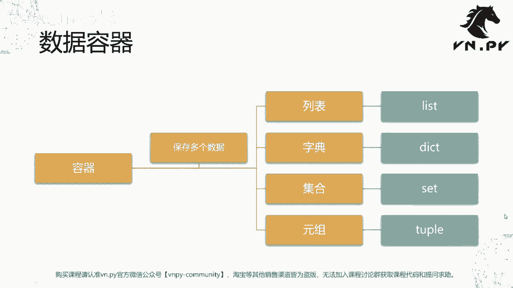
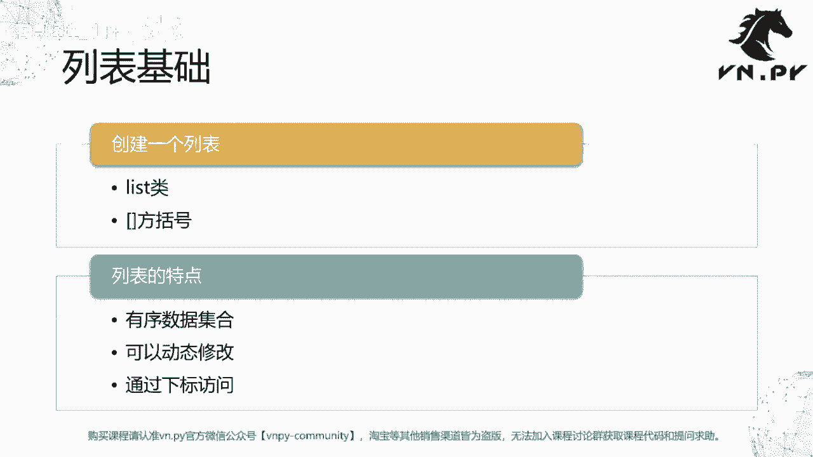
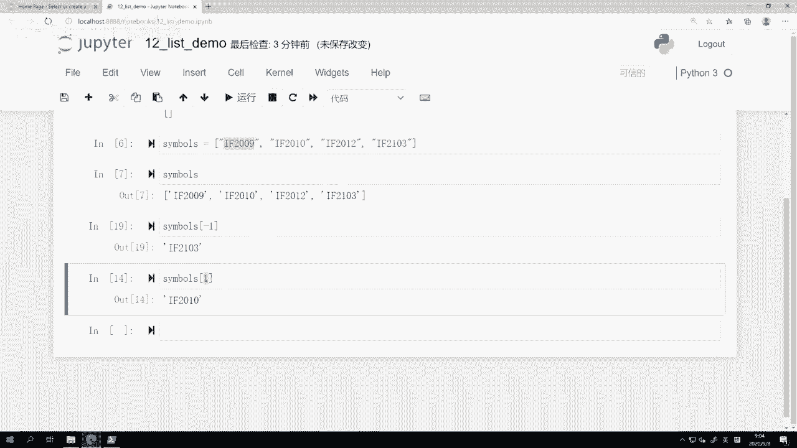
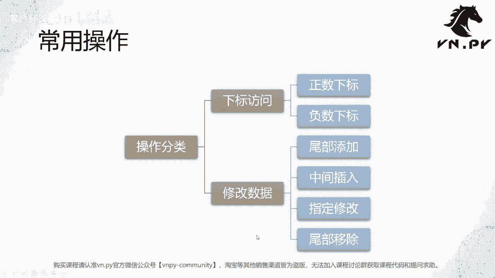
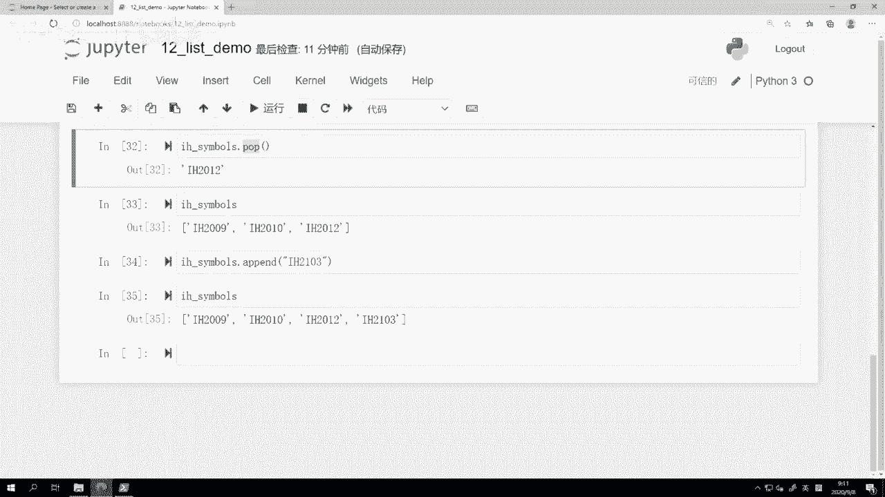
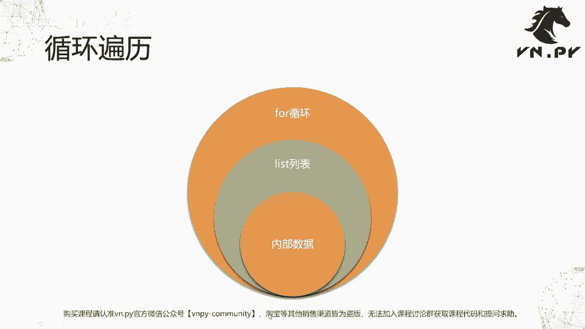
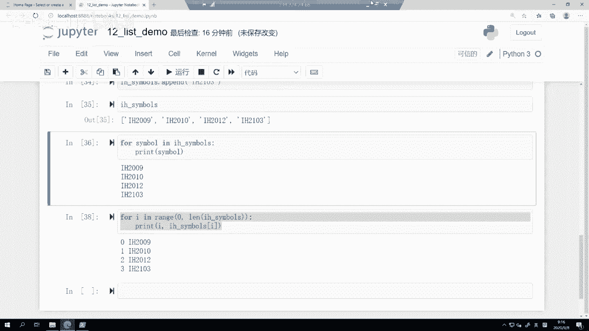

# VNPY30天解锁Python期货量化开发：课时12 - 顺序列表 - P1 - 客户经理_小陈 - BV1d9pueTEDo

OK欢迎来到量化交易零基础入门系列，30天解锁Python量化开发课程，那么今天呢是我们的第12节课了，在上一节课里面，我们讲了这个字符串的一些深入操作，那么在这节课里面呢。

我们要进入到Python的这个数据容器的学习了，接下来大概五节课的内容都是讲啊数据容器的，那么今天呢我们先来看其中最基础的啊，也是最简单容易学的，叫做顺序列表，那么先来看一下所有的数据容器啊。

这个数据容器它的英文一般叫做data structure，数据结构，或者你也可以管它叫data container啊，就是container就是个容器的意思嘛，那么我们前面啊其实已经学过。

比如说啊int string float ball这些基础的啊，还有none啊，基础的Python里面数据类型，那么这些数据类型有个特点，它都是标识的单一数据，比如说你一个float的这个浮点数。

它就是一个浮点数啊，一个int的整数，它就是一个int的整数，但是很多时候我们这个要去写的，这个程序里面啊，它有这不同的数据之间是有关系的啊，比如说一堆合约，每一个合约它最新的这个价格是多少啊。

一某一个合约上，他这个五档的盘口是多少，这个每一个盘口之间是有互相的关系的，所以呢为了去保存这种关系，或者说在程序代码里面，能去表示这个不同数据间的关系，在绝大部分编程语言里面。

都引入了这个叫做数据容器的概念，它主要的作用就是保存多个数据，同时这些数据之间啊一般是有一些关系的，有关系的东西，你才把它放到一个容器里去啊，要是完全没关系的东西，不应该把它放到一个容器里去。

那针对不同的这种关系类型，我们在这儿呢，Python里面主要提供了这么四种基础的数据容器，第一个就列表，英文叫list，第二个叫字典，英文叫dict啊，或者说它全称叫dictionary嘛。

就英文字典的意思，集合set啊，集合是一个数学上的概念，大家可以就回想一下，大家初三或者高中的时候应该学过什么交集，并集差集等等啊，这个叫集合，最后还有一个叫元组tap啊，元组稍微这个啊。

对于我们一般生活里面要少接触的比较少一点，不太容易接触到这个概念，所以我们把它放到最后讲，我们先来讲的是这个列表list。

那么列表啊，我们这个先把内容讲完啊，首先叫做创建一个列表，怎么创建列表呢，分两种方法，第一个是用list类，第二个是用发括号，然后列表的特点主要是这么三点，第一个它是一个有序的数据集合。

第二个它给动态的去修改啊，你可以随时增加一个数据，再删掉一个数据，第三个点跟我们字符串类似的，可以通过下标来访问啊。

那我们这边就回到我们的这个操作里面啊，我又开了一个新的12list demo啊，那么在这呢我们就先来创建一个列表啊，怎么创建，第一种方法，用哎一般列表，我们可能就是比较常用的一个这个标识符。

是LL就是list第一个字的缩写嘛，当然你也可以去加名字啊，比如说demo l啊，或者你直接管它叫LL或者说什么，或者某个有意思的意这个词啊，VTSYMBOS就合约代码的列表啊都可以。

那在这呢我们就先用个SYMBOS吧，就合约哎代码，然后list括号这样就创建一个列表出来了，我们这时候就输一下SYMBOS，他会给我打印出来一个哎长这个样子，用方括号括起来的，那就是一个列表。

或者直接print一下，它也是长这个样子啊，那么这时候我创建的是一个空列表，里面什么都没有，还有一种创建方式呢，是叫做直接用这个方括号创建啊，就直接SYMBOS等于这个。

那这同同样我在这print symples，大家可以看到也是个列表，但这两种方法创建呢它都是空的，啥都没有，如果你想要创建一个列表，哎，我我这边都已经举例子叫SYMBOS对吧，就是这个合约代码。

那我往里面就塞一点合约代码的内容啊，我想塞一些就是F的啊，现在是这个2020年9月2020呃，就是2009哎，这是第一个第二个F2010，然后第三个应该是一个纪元F2012啊。

最后还有下一个纪元F2103哎，这个是应该现在挂牌在外面的四个啊，F沪深300股指期货的合约代码就这样，那么我们可以看到当你创建它的时候，你是在怎么做，首先最外面的是一个方框，然后其中一个一个的是。

我们要塞到这个列表里去的元素啊，每一个元素呢我这里创建的啊，当然就是每个都是字符串啊，咱们每个字符串之间用一个逗号来分隔，理论上你不写逗号，后面跟着的这个空格也是可以的。

但是在良好的Python代码习惯里面，其实是Python Python对于代码的这个格式啊，都有一个呃满正规化的社区，建议叫做啊P1P8啊，这个是一个啊，Python里面就是一般建议大家写代码的啊。

遵循的这么一个规则，逗号后面最好跟一个空格，这样会让代码看起来比较好看一点，比较清楚一点，否则的话容易挤在一起嘛，那这个JUPITER还好，它它这个字符比较大一点。

你如果在vs code里面那看的眼睛真是难受，所以建议大家都养成好习惯啊，逗号后面跟一个空格，最后这个F2103，后面大家注意到这里是没有空格的，如果你硬要跟一个也可以啊，但是啊我这边呢一般情况下。

建议大家是不要跟啊，跟一个不影响这个代码运行，但是会看着比较别扭，所以这样回车一下哎，这时候我们就定义了一个有上述内容的，这么一个列表，还我打印显示一下，我们可以看到就是这么一个这个呃方括号列表。

其中呢有四个元素啊，就这么四个字符串，然后我们就跟之前学字符串那节课的时候，我们下标访问一样的操作，哎，我想要访问一下第一个位置的这个，这个这个合约代码，看看是什么。

就是因为我按照顺序去创建的这个列表嘛，所以我第一个位置的肯定是当前最新啊，就是最最最最当月的这个合约，或者最近月的这个合约啊，我就直接symbols0啊，这样来查，我们就可以看到是F2009。

或者SYMBOS1诶，这是第二个元素啊，二第三个元素，这三最后一个元素如果输个四会怎么样啊，四他要访问第五个元素，但是我们上面这个列表只有四个元素，所以当我这么做的时候，它会有个报错。

叫做index error，List，Index out of range，翻译成这是人话或者是中文的意思，就是你访问的这个下标超限了，它超出了这个SYMBOS列表已有的数据范围，所以我给你一个报错。

告诉你抄出去了啊，这个也也容易理解，那么啊这是一种情景啊，就是通过正数下标访问，有的时候呢我们可能还想要说哎，我能不能直接啊，我就想知道当前最新的一个月份的啊，不不好意思，最远远的那个合约的代码是什么。

我我不要一个个，就是从最最近的月份到第二个月份，到第三个月份到第四个月份，我直接就想知道最新月份的，我知道最新呃，这不是最远月的那个肯定是在最后面啊，我或者这个时候我就想要访问最后一个位置的。

合约代码应该怎么访问，那就用到所谓的负数下标啊，在这呢就是symbols-1啊，我们可以看到直接出来的结果就是2103了，那，给大家一个对比哈，当下标从正下标为正数的时候，他要从零开始。

就第一个正数是从这个啊，就零的话是第一个元素，一的话就正着数啊，它是正数的话就已经到第二个元素，但是当它为负数的时候，下标是从一开始的，为什么，因为零没意义，零也等于零，如果你填了零的话。

那我我给大家看一下零，就他又回到从第一个这个，这个这个元素开始访问了，所以呢只能是负数的话，从要从这个一开始，一就是最后一个位置，二就是倒数第二位置，三就倒数第三个位置，我们可以看一下负，比如说四啊。

就四就变成倒第一个位置，同样如果说五的话啊，他又out of range，因为本质上我还是四个元素啊，从最后一个数一负二负三负四负五没了，然后就报错，就这么简单啊，所以啊这个叫做正负数下标啊。

这么一个关系。

那我们回到PPT啊，然后下面我们要做呃，来学习一下的呢，就所谓的常用操作了啊，这个操作下标访问我们刚刚都讲了，正数下标，负数下标哎，这其实挺容易理解的，正数下标，负数下标这个概念不只对列表适用。

在后面我们学到其他的，比如说元组，比如说我们上节课学的那个字符串啊，他们都是适用的，都是这么一个原因，零啊12345这些都叫正数下标啊，就从正的看，从前往后数，一负二负三负四负五，负数。

从一开始就从后往前数啊，大家可以我们刚刚演示的是这个字符串的例子，大家可以回头去试一试啊，这个啊上节课里面内容，你拿那些symbol啊，然后呢来用就symbol字符串啊，你呢用负数下标来访问。

哎看看是怎么一个结果，然后我们要去讲一下的，就是啊我们刚刚也提到啊，这个list是一种可以允许你动态添加或者修改，数据的这么一个数据结构啊，那我们下面就来看一下，他怎么去做这个动态添加和修改啊。

整体上这么四种常用的操作，尾部添加，中间插入指定修改，还有尾部移除。

那我们之前的SYMBOS是直接诶这样创建的，我现在重新创建一个叫做HSYMBOS啊，H的合约代码，我就把它创建为一个空列表，这时候我们打印一下HCBOS，我们可以看到内容是空的对吧，啥都没有。

那我第一个要做的事情，是往里面去添加一个9月份的合约，H2009，那我用到的一个函数，大家可以看到这个操作，其实跟我们上节课里面讲字符串的那些对象，方法的时候类似的，比如说点UPER啊，点low啊。

点capitalize啊等等，都是这个对象本身啊，后面跟一个点，然后呢跟一个你要用的，或者你要调用的这个函数或者叫对象方法啊，后面呢是你要去传入的那个参数，那我在这啊，就IPAD啊。

这个H2009app end，什么意思，在最后添加哈，它是英文里面是这个意思，在最后添加，那我们这个列表一开始是空的，啥都没有啊，我们这样在最后添加完了之后呢，我再来print edge symbo。

大家可以看到里面就已经有一个元素了啊，已经有一个H2009了，然后我们下面再做一个操作，然后继续i panda，H2012啊，我又我又我又添加一个，那我就直接在运行这个单元格，我们发现H20092。

H22012，它都有按顺序一个个插进来啊，但这个时候我突然发现说诶，我漏了一个10月份的合约，F2010，我给漏了，怎么办啊，这个时候你可以用叫做insert函数，insert呢就在某一个位置插入啊。

我们可以看到这是零位置，这个是一位置啊，我漏了一个20102010应该放在哪，应该放在一这个位置相当于把它往后移一格嘛，所以我就insert1啊，一是下标位置，然后呢2010，然后再来print一下。

看看结果是怎么样，我们可以看到他在第一，这个你要insert下标位置差了一个啊，如果你再运行一次会怎么样呢，啊他又在这插一个啊，就你当然每运行一次，他就啊往后再插一个，当然了。

这种这种啊插入像现在这个情形下，也就有点怪了啊，这个2010完了之后又有一个2010，那这个看着怪怪的，我要修改它一下怎么做呢，这个第二个位置的值我知道错了，他应该是2012对吧。

我把它可以直接这么操作，之前我们叫h symbols这个方块二的时候，我们是在访问其中的数据，而这里我这么写，然后右侧是一个等号的时候，我就是在修改其中的数据，所以在这啊嗯二。

然后呢我们要把它改成H2012啊，这样完了之后，我们再来print一下，我们可以看到哎这个位置的值已经变过来了，还差这个位置最后一个位置的值哎，我们要把它改一下啊，因为他在最后啊，我就除了修改它以外。

我还有个操这个选择是什么呢，叫做pop啊，我把最后这个值给删了，pop就是把最后一个位置的值给移除出来啊，移除的时候他会把这个值给你返回出来，然后呢我们再再打印一下。

我们可以看到诶这个最后这个值已经没了，最后多的这个RH就反正你每pop一次，他就把最后一个值给啊移除掉，如果pop完了的话就空了，最后你对一个空列表pop的话就会报错。

所以这个时候啊我又可以再做一个IPAD操作了，2103哎，我把明年3月份再添加上去，所以这个时候我们再来看一下H嘿，我直接可以按tab键自动补全啊，很方便啊，这样呢就是一个正常的H的SYMBOS的列表。

当然上面那个SYMBOS是RF的啊，所以这样呢我们就这个啊，通过动态修改的方式，去创建了一个H的合约代码列表啊，不像我们之前啊，之前这个方式是我在一开始就通过方括号，把全部给定义好了啊，当然了。

你不管是方括号去初始化的列表，还是用这个list啊，对象初始化的列表，都可以采用同样方式进行修改，没有任何问题啊，他们的这就你创建出来这个列表，对象都是一样的，你都都有IPAD，有insert。

有pop这些啊可操作的函数，然后呢啊啊它们的效果是等价的，只不过第一种创建方式诶，我可能一上来数据我都有了，就直接初始化好了，第二种方式可能更接近实际一点。

比如说我启动我的VN trader交易系统的时候，第一步我是连上CTP的柜台，在连之前，我本地VN吹的系统内可能是没有任何数据的，就我不知道有哪些合约可以交易，我也不知道最新的行情是怎么样。

我是连上去之后哎，我可能调用了一个查询合约的函数，然后CCTP那边把所有哎他现有的，今天能交易的合约给我一个个推过来，推过来的过程中，其实我就开始处理了啊，比如说我把不同合约的每个合约代码。

我添加到一个列表里面去，每个合约我基于它不同的那个代码前缀啊，添加到不同的那个列表里去等等啊，类似的操作，那所以第二种情情况就这种动态的添加，或者有的时候修改啊，有的时候覆盖啊，可能对于我们啊。

这个啊更加接近于一个实实际的情况吧。

然后回到PPT啊，最后一章啊，最后一章呢叫做一个循环遍历啊，循环遍历循环for循环，我们之前已经学过了，然后下面我们当时学的for循环是for，在一个范围内去循环就对吧，循环多少次。

但有的时候啊我们可能额这个循环多少次，当然是确实是一个很常用的情景啊，但有的时候我们可能直接就想循环一个啊，数据结构啊，比如说我们这里循环一个列表，或者当然后面我们也会学到循环字典啊，循环元组啊。

循环集合啊等等，但是啊这里循环这些数据结构，可能是一个更加实用的操作，因为为什么我要循环，我可能就是要对诶某个数据结构里面，每一个数据点都做一个操作，比如说我可能循环一个下单的委托信息列表。

然后把每一条信息，我都发一个对应的单子出去啊，这个是我们做多合约交易的时候，非常常用的一个操作，那所以呢这里就要用到这个for循环，它循环呢是一个list列表，然后在这个过程中。

每遍历的都是一个内部数据啊。

怎么去理解它呢，我们就也回到JUPITER啊，在这儿我们就for这个哎，symbol in i h symbo print simple啊，我就做个很简单，就print一下，那大家可以看到写法上是什么。

For symbol，in hh symbols啊，然后print symbol，其实这句话如果你完全不懂Python编程，你光是这个学过英语，你可能有可能也能看懂。

就直观上它就是有点接近于英语的意思啊，对ith symbol，这对这个列表里面的每一个symbol啊，就每一个信息，每一个字符串，当然你也有可能在里面放的不是字符串，大家回头自己可以试一下。

你可以在里面塞浮点数，可以塞整数，可以塞布尔值，这等等都可以，没问题的啊，他什么样的类型都支持，那嗯反正不管怎么样，这个这里的这个便利操作就是诶，每次我就把列表里面的一个数据给取出来，取出来之后呢。

对它进行一个操作，像这里我们做的就是print啊，那我们这里这个操作的时候，就是从H2009开始诶，每一个循环我就打印一一个合约代码啊，当然我这样最后就把四个都给打印完了，这个这个写法其实比起之前的。

比如说for i in range，100，print呃，呃100太多了，那五吧，01234，这个写法其实可能有的时候更加优雅一点，或者你如果不采用上面这个写法。

你要用比如说类似于C加加语言里面的便利啊，你要怎么写呢，for i in range then啊，edge symbos ln这个函数，这是一个函数啊，这个函数我们也还没讲到，它的作用是取出啊。

或者说去计算某一个数据结构，它的长度，像我们这个数据结构它长度是多少四嘛，有四个元素，所以这里的这个便利循环练完了之后，就就调用这么一个计算完了结果是四啊，结果是四的话。

我们就for i in range，0~4就是0123，含头不含尾，四是不包含在里面的，0123正好对应的是这四个位置不同的下标，所以我可以去print啊，我可以既把i print出来。

也可以把这个h symbols，里面的这个位置的值给print出来，大家可以看到会变成长这个样子，但是要注意这里的这个操作啊，你看看代码是不是就代码量大很多了啊，而且人肉眼乍一看有点绕啊。

怎么怎么怎么难受，for i in一个range在一个范围里面，然后再把一个个值给取出来，这看着其实挺挺难过的啊，所以呢在Python里面我们更推荐上面这个写法，而在C加加里面啊。

就是C加加比较老式的循环，其实要用类似于下面那个这个语法，它是有一个下标，然后每次下标自增一，然后才能去把一个啊，数据结构里面的每个值给迭代一遍啊，当然从啊C加加11开始啊。

就它也有类似于Python的这种写法，就类似于这个啊，这个直接做一个便利循环的这么一个写法，直接就只循环一个数据容器的写法，而这个写法确实对人，对我们啊看的就写代码的人来说非常的友好哈。

这样呢更方便我们去跟踪我们的代码，一些。

好那么啊这节课的内容呢也就讲到这了，其实列表他的很多嗯，应该说它的原理非常简单吧，就我们今天讲的一个是他是一个是有顺序的，第二个呢它可以动态的啊，往里面添加修改删除数据，但更多比较实用的应用场景。

可能要到后面一点啊，我们结合上边点派内部的一些代码案例来看啊，但它基础的用法就是这么简单，OK那么更多精华内容，还是请扫码关注我们的社区公众号，好。

