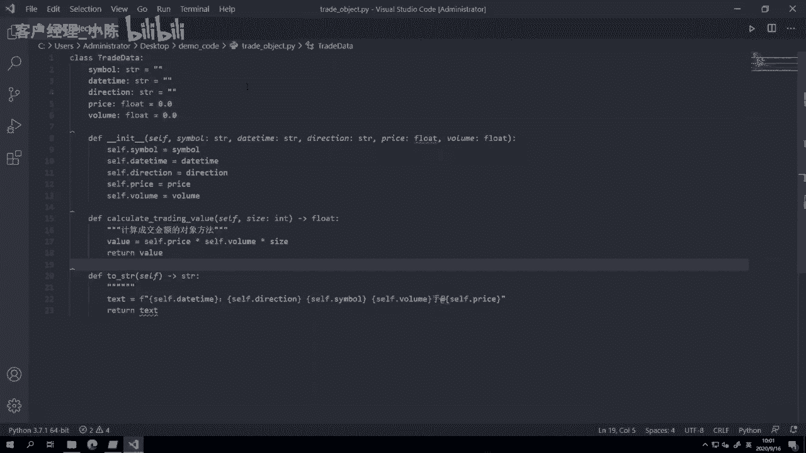
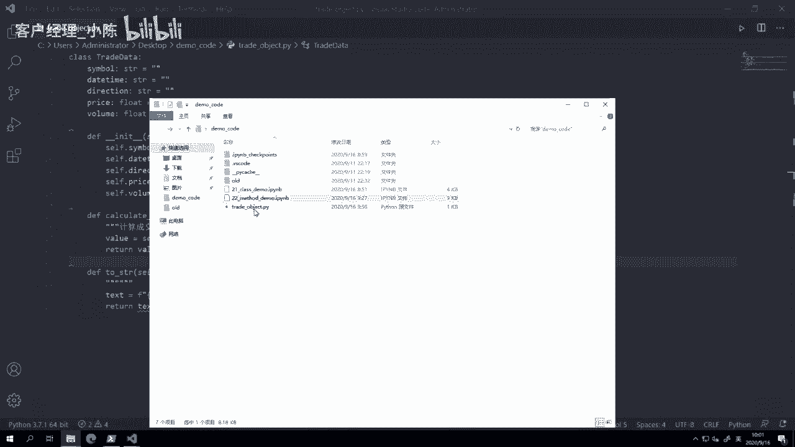
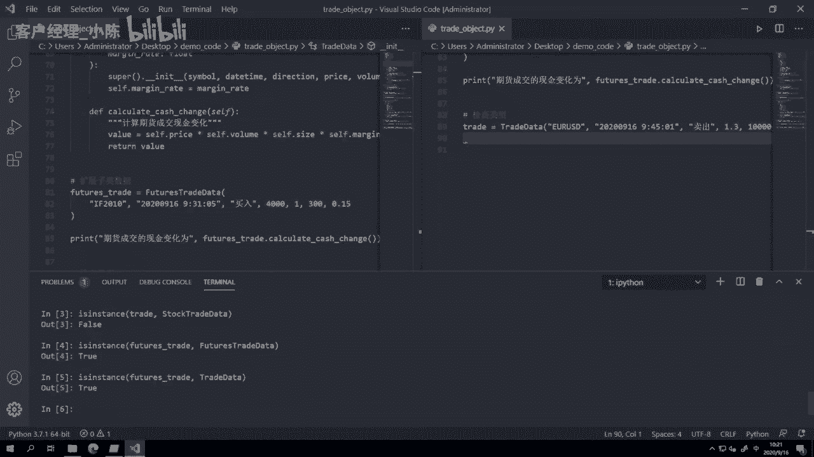
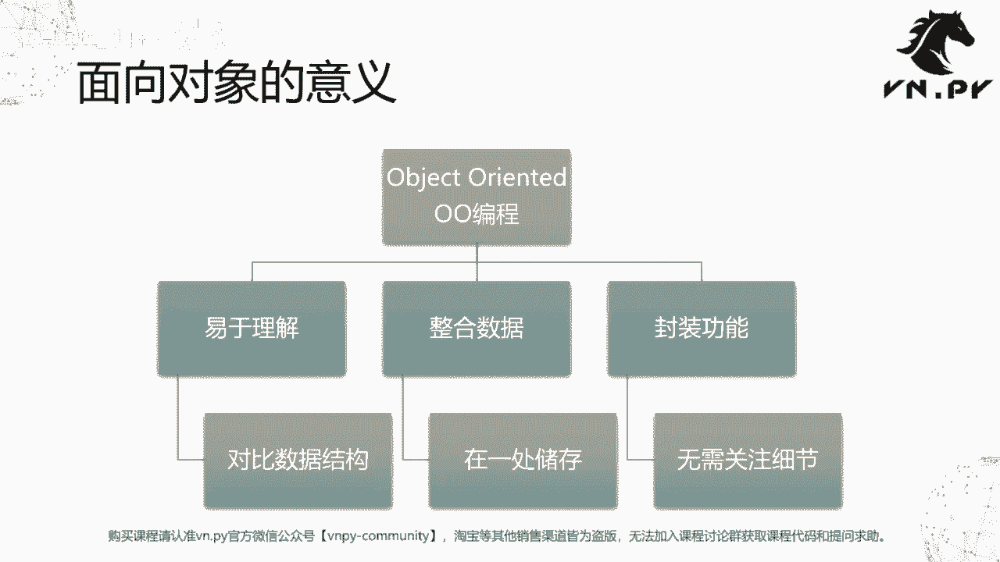

# VNPY30天解锁Python期货量化开发：课时23 - 类的继承 - P1 - 客户经理_小陈 - BV1DM4qejEMa

OK欢迎来到量化交易零基础入门系列，30天解锁Python量化开发课程，那么今天呢是我们的第23节课，在上一节课里面啊，我们讲了类的方法哈，其实说白了就是把含里面包含的逻辑，进一步封装到一个类里面去。

那在这节课里面呢，我们要进一步来讲一讲类的继承，首先我们来看一个情景啊，之前我们在举例的时候一直用的是成交数据啊，追data这么一个例子，那我们知道啊，在现实中市场上是有很多不同类型的合约的，有股票。

有期货，有外汇，有这个数字货币等等，那么每一种合约他们的成交都有相同点，这个相同点，其实我们在之前的这个trade data这个啊，这个类的五个字段里面都描述了，比如说他们都有合约代码，都有成交时间。

都有买卖方向，都有其呃呃，这个成交价格以及都有对应的成交数量，这五个点是所有成交数据的共同，那么但是对于不同的合约的成交，他们也有各自特定的一些属性，比如说对于股票成交来说。

如果你要去计算它的这么一个现金变化的时候，我们知道股票你买了100万的股票，你是需要付出完整的所有的成交金额的，就你买了100万股票，你就要付100万啊，但是对于期货来说有点不同了。

你买了这个面值100万期货的时候，往往你只需要考虑这个面值对应的，保证金是多少，你把保证金交了就行了啊，不需要去完整付出所有的成交金额，因为我们知道期货是带杠杆的，所以大家可以看到在这里尽管都是成交。

但是股票的成交和期货的成交，两者的在功能上已经出现了不同，那么接下来呢我们就会通过就是Python里面，这个对象的或者叫类的继承来展现一下啊，怎么样去比较精巧，比较节省代码的实现这块逻辑啊。

整体上我们要做这么四步，调用父类函数，扩展子类函数，扩展子类数据以及父子类型关系啊，我们先来这个打开。

我们今天要用的这个写代码的工具vs code啊，之前的这个大部分歌里面嘛，我们的例子都是在JUPITER里面讲的啊，但是在最开始我们在演示的时候也讲过了，不管在JUPITER里面执行。

还是在vs code里面执行，同样的代码，都能起到同样的功能啊，只不过运行方法上有点区别，JUPITER里面的可能你就是shift回车，一个个单元格跑下去就行了。

vs code里面可能你要把代码都放到一个啊，你的这个Python脚本里面，把它整个编辑好之后，再shift回车去运行。

那在这呢，我们啊就先创建一个全新的这个trade object。

点pi啊这么一个啊，我们一个一个一个新的Python文件，然后呢，我们把上节课最后那个trade data给复制过来，那么啊代码复制过来之后，我们紧接着就可以看到有一系列提示对吧，这样告诉我们太长了啊。

然后这有一些红色呃，不好意思，这是告诉我们后面有空格，所以我们先把空格给删了，啊然后这里呢又在提示我们说，哎你这个行太长了啊，那我们可以说把这个行给缩短一点，注意啊。

缩短的时候我们原来逗号后面有个空格的啊，这个空格要给删掉，否则的话，等会儿flag8还会提示你，每行最后又有空格了啊，这个也是不好的，那这样我们第一个红色提示就解决了啊，第二个这里啊，这还有个黄色提示。

因为我们最后少了，也就一般情况下Python呃，这个源代码文件最后一行最好是一个空行，不要是有内容的啊，那么这样我们空个行，这还有个提示也是太长了，但是呢我们要注意到这是一个字符串。

字符串有一个什么问题，就是这个我们不太好像刚刚那样直接回车换行，那他会报错的，所以我们要怎么做呢，首先外面加一个括号，然后把我们要换行的那个地方啊，比如说我们从这开始换行，那这里是一个字符串。

换号下来好，然后因为有了括号，这个也把它下移哈，把它换横过来，下面再接一个字符串，这种写法的话，大家可以看到其实是俩字符串对吧，两行都是字符串，但因为这两个字符串我用括号给括起来了。

然后中间又没有跟豆泡，所以Python解释器在运行的时候，会自动帮我把它给拼成一个字符串啊，这个就是对长字符串，你如果要换行的一个写法啊，我们这样处理完之后呢，大家可以看到已经没有那种波浪提示符了。

OK现在看着挺整洁的啊，就心里挺舒服的，然后再下一步我们这里还有个size对吧，这个老在计算的时候要用到这个成交金额，那我索性把它给放进来啊，在这个size一般就是整数啊，然后在初始化的时候呢。

我也把它给加上去，这样我们在后面计算的时候，就不用再去额外的传了，好这边我少漏了一个逗号，把它删掉啊，所以在这边我这个啊，所需要的size参数就可以给删掉啊，我们就要这样啊，这样整理完之后。

这个类会变得更加清爽一点，更加适合，然后我们要做的事情是去诶，这个继承trade data这么一个类啊，那这边呢因为代码已经比较长了，然后为了让大家看清楚一点，我这个这个嗯好，我把字放的也比较大。

这样来回滚呢，大家可能看的不舒服不舒服，此时呢我就把它哎点一下，右键叫做split right，在右侧再打开一个区域啊，同样完全同样的文件，那我可以把把这段滚到下面来，然后呢这段还看着上面内容。

这段滚到下面来写，这样就会方便一点，class stock trade data啊，然后呃，这什么意思，Class stop trade data，我又建了一个新的类。

这个类呢叫stock trade data，但是紧接着我加了一个括号，括号里面包含了trade data这个类啊，就上面的这个trade data，我把它给继承过来了，然后在这个类里面。

我去额外实现一个函数，叫做calculate额，这个cash change啊，计算现金变化，怎么计算现金变化呢，我们知道对股票的现金变化的话，它其实就是成交金额嘛，啊股票成交现金变化。

所以啊我们就把这个啊我现在第一步啊，我先把这个的公给直接复制过来，然后我们在下面可以看一下啊，试试看能不能用啊，Stock trade，啊他又要我传一堆啊，这个参数进去啊，我就一个个传。

啊这个时候我就写了个股票了，20200916，这个09：30：05啊，开盘就做一手，然后direction还是买入，啊大家注意后面也有太长了，对不对，所以此时呢哎我可以这样画哈。

我可如果你你的一些就只这个只要换一行，就能把所有参数都放进去的话，你也可以选择，就不要写成左侧这种模式啊，你左侧这种模式的话，因为有的时候打的话，你回车比较多嘛。

然后看起来的话竖着看也不一定有横着看舒服，所以一行能包下的情况下，你也可以索性一行写买入，然后price呢就这个这个招商银行，我不知道现在多少钱啊，我随便写一个40块钱吧，然后买100股啊。

这个size是一，因为股票我们知道他都是一啊，这样我就创建一个stock trade的对象，然后我们就用stock tra点啊，比如说我这个to string哈，我就把它打印一下，print好。

我先这样试着运行一下，这个时候按住CTRLJ啊，会弹出底下这个terminal，大家可以看到我这里terminal里面现在是空的，其实已经有内容在里面了，因为这里是power share哈。

所以它会一上来显示不出来，你随便打几个字，它就出来了啊，比如说我先打cs clear string screen，把它清空一下，然后输入拍呃，当然了，这这里现在启动的这个位于我。

我我C盘的这个用户目录下啊，就user administrator，此时我要先切到我当前这个目录下，怎么切呢，CD啊，Cd desktop，因为我我进一步我位于administrator。

下载这个desktop，就桌面这个目录嘛，先CD desktop，在CD demo code啊，就进到我当前的这个目录，然后我进行Python trade object点P啊。

我们可以看到他能正确的打印结果啊，这个大大的出来，所以呃当然这这看着有点不舒服，大家看到600361百首啊，什么原因呢，应该是在这啊，我漏了一个空格，刚刚换行时把它给删了啊，重新把空格加上啊。

这又有个提示，漏了最后一行，我再来一次，是不是就舒服一点啊，600361百十万次，40哎，这个就看的很舒服了，所以这里我们实现了第一个要演示的内容，叫做调用父类参数，什么叫调用父类参数，我们可以看到啊。

当我创建stock trade data这个对象的时候，我并没有去实现开呃，这个to string这么一个函数，我没有去额外实现它，这是没有的，我只实现calculate catch change。

但是因为我继承了trade data，就是我的父类，所以呢父类所有的方法我在这里都可以直接用，同时父类的这个构造函数in it也同样的啊，我在这里可以直接用，就我在初始化它的时候，也需要把这些都传进去。

如果不传就会对应的报错啊，那么第二步呢，我们要来看一下这个叫做啊扩展此类函数，什么意思，刚刚这个calculate cash change这个函数啊，或者呃就是子类的方法哈。

那我们不讲的正规点扩展子类方法，那么calculate catch change，这么一个方法是我在stock trade data类下面定义的，上面trade data类是没有的。

那此时呢我创建stop trade之后，我也可以去做这么一个操作啊，print stop trade点calculate开始change，所以我还可以去调用子类上定义的一个，新的方法。

去把还有我要的结果给打印出来，我们再运行一下，可以看到除了第一行的啊，这个输出之后，第二行这个内容也出来了啊，我等一下前面加一个吧，股票成交的啊，现金变化为好，这样这个4000啊，4000等于多少。

40×100，再乘了个一啊，因为其实合约选出的是一嘛，所以乘不乘你看不出来了啊，那这样扩展子类的方法，就以你继承一个父类之后，只需要在子类里面实现新的子类的方法就好了。

然后呢我们可能诶到这儿我们又想要去实现啊，一个新的这个期货的数据X就我不在future strdata，它而是一个呃，不好意思，不在是stock tradata，而是一个future strdata。

那此时我们知道future stratea有个额外的问题，它还多了一个啊这个保证金的概念，保证金是有一个保证金率的，叫做margin rate啊，我们先把它设为0。0。

然后呢在我们的构造函数INIT函数里面，啊这个盈利的函数好，我们先按CTRLJ把底下那个给缩掉啊，不然不好写好，然后这个构造函数我们也一样复制粘贴一下，不然一个个打太慢了啊，这样完了之后。

我额后面最后要加一个margin rate的参数啊，把它定义为这，这这个一般是一个啊float类型，因为它都是10%啊，20%这种啊，所以他肯定是就转成数字的话是这个小数啊，所以是flow类型。

而在这里我们要首先前面的这一堆，从symbol到size的六个参数是父类里面就有的，所以我可以直接调用父类的构造函数，我调用父类的这个构造函数，把他们都给传进去，然后我再把这个父类里面没有的。

margin rate的这么一个额外的数据字段给保存下来，我这边做了两步，第一步大家可以看到我用了一个叫做super的函数，这个函数也是Python内的一个比较特殊的函数。

它的作用是在当前futures trade data的这个INIT里面，去调用它的父类就trade data的INIT函数啊，当它调用trade data隐匿函数的时候呢。

他又把这个啊我们的这个啊这个这个trait，因为我们知道它引内函数要用的字段，主要是这么五个啊，Symbol，Symbol deter，代direction，Price volume size。

把这五个参数传到那边去啊，然后额外多增加的这个margin rate参数，我再给缓存下来啊，缓存在这里，这样呢我们就有一个新的啊这么一个实现了，然后calculate cash change的时候。

我们知道啊，这个对于期货的现金变化就不太一样了啊，他不是期货成交现金变化，它就不是这么一个金额了，还要额外乘上这个self点margin rate，这样呢我们就又传上就就定义好了。

我们这个要用的futures trade data这么一个类，我们也同样来看看它的效果啊，这个然后直接就，扩展子类数据，future trade啊，他可能是比如说呃我们还用F2010啊，这个时间改一下。

一分钟后还是买啊，然后成交价格可能4000啊，成交数量我买了一手，但合约整数比较大，是300啊，然后这个时候呢我们来打印一下，看看它的结果是什么，期货成交单，这样好，我们来看一下结果是怎样的。

嗯啊这一个括号不小心被我删了，补回来，诶注意像刚刚我打的这个符号，这是中文括号，大家可以看到第一个它比较宽，第二个它更圆一点，然后这个是英文括号啊，所有的编程语言里面都只能用英文的字符啊。

不管是这个就是字本身，还是这个这个这个这个比如括号啊，这些加号啊，减号啊，呃之类的运算符啊，打了中文它就会报错啊，而且中文切换键从win10开始，你可以用shift切换，所以非常容易摁错啊。

所以刚刚我就是相当于来回摁了两下啊，这样我再来运行它，大家可以看到这里，我们计算期货成交的现金变化啊，哦不好意思哦，我这打错了，然后保证金率呢我就传个0。15啊，就15%啊，然后我们这边打打一下。

可以看到期货成交的现金变化，我们这边可以正确的把它给打印出来了，那这里的这个数值呃，就是用前面的price乘以volume，乘以size，之后还额外乘以了我们的margin，因为我们知道啊。

四这个4000×300的话是120万吧，但实际上我这只花了18万，为什么18，因为120万再乘以0。15就是18，所以这样呢，我们也实现了一个子类，数据扩展的这么一个演示。

那这几个这个新的类型都定义好之后啊，你可能有的时候会哎有点说呃，那那我定义了这么多个类型，它互相之间有没有关系，或者说我某一个类能不能当做父类去用，或者某个子类能不能当做呃。

呃某个父类能不能当做子类去用啊，就这个互相替换的这么一个关系，那在这里呢，我们就需要用到一个叫做is instance函数啊，is instance怎么做呢，我们先创建一个啊。

我们就创建一个原始的trade date啊，这个这个就是一个标准类型的啊，就不带合约类型的，我就随便创建一个啊，比如说还是写一个股票啊，或者我们写个不同的吧，我们写一个这个额外汇的好了。

U r u sb，然后呢就一啊五六这个9。45分，外汇啊，一般我们成交金额会比较大一点，比如说我成交来个1万啊，因为额汇率的波动，其实相比起股票和期货来说要小很多，所以一般他的交易金额比较大。

甚至于很多时候要带杠杆啊，然后最后这个size size就是一啊，那么这个是可能用来，表示我们一个外汇的成交数据，我们这个时候要用到一个特殊的函数，叫做is instance，is instance啊。

你输入完之后vs code很方便啊，它会直接弹出这个函数提示啊，你要输入用的输入的第一个参数是O，就是这个对象本身，第二个参数T就是它type这个tab是一堆的啊，类型类型是什么呢。

就是它是属于哪上面的哪一个啊，举个例子，比如说我可以数trade trade data，这个就是用来看啊，说这个trade是不是一个trade data类型，那啊当然了，在这一行行输可能有点不方便啊。

所以我们索性诶这个进到我，我又打开了这个下面的这个啊，这个咆哮啊，然后我输入IPYTHON啊，在这里我直接运行IPATHON交互式模式，然后from trade object import型。

把所有这个里面，我们定义过的东西都给加载进来，大家注意到我这边进过做了一个加载之后，紧接着这堆内容全给打出来了，为什么呢，他们都是写在这个模块哦，不好意思。

这个trade object点pie文件里面的，所以此时只要你去执行这个文件，当你在Python面写from某个文，Python文件加载一些内容的时候，他都会把整个文件里的内容运行一遍。

所以此时啊这一堆内容也被打印出来，怎么样让他们不打印呢，也有方法，我们后面来讲，就要涉及到那个main的命名空间的问题，在这我们先来看啊。

我们刚刚把那个什么future street stock trade，都给加载进来，我们先来看is instance这个trade，我们先看看他是不是trade data的一些啊，这是true是的。

然后呢我们来看看他是不是，比如说stock trade data类型false，我们可以看到父类创建出来的对象，是父类的这个类的类型，但是它不是子类的类的队形。

所以这个trade不是stock trade的，你也可以把它换成future strated的，同样是false，但是我们反过来，首先我们看啊futures trade啊。

他是不是这个future trait，这肯定是true对吧，用它创建的，但是呢我们也可以看一下它是不是父类的，那个呢同样也是true，所以用子类创建出来的一个对象，可以认为他也是父类的对象啊。

这一点是体现出一个继承的关系，就儿子可能会有一些父亲的遗传特征啊，但是父亲是不是一定有儿子的遗传特征，这不一定啊，所以同样啊这边也可以啊，is in这，诶这这个不好意思啊，这边刚刚按到一个东西。

把它给退出去，我们看一下这个future street，是不是这个怎么又玩到这个，是不是这个stock trade data的类型啊，运行之后是false，就你每个子类也是一个自己独立的类型。

你你你这个期货的成交和股票的成交，肯定没关系啊，期货成交创建出来的对象，肯定不会是属于股票这个成交类的啊，然后呢我们再，这个，那么额到这呢，其实就是已经反映出了这么几个类型关系吧。

就是父类创建出来的对象，它的类型永远只有父类啊，然后子类创建出来的这么一个对象，它的类型既是那个子类，同时也是对应的父类，那么这样呢，就存在一个一级一级往下继承的关系啊。

这种继承关系后面在我们写代码的时候，会有很多方面的应用。

那么额所以到这儿呢，我们已经把面向对象的一些嗯，比较核心的概念都已经讲完了啊，接下来后面再讲的时候就属于深入的概念，或者说Python自己特呃，就是独有的怎么面向对象的一些功能啊。

所以我们在这里先把面向对象这个概念，这个概念在所有的是呃，应该说是90%的编程语言，里面都是有的啊，而这个概念的意义呃，我们这边把它总结一下，首先面向对象英文叫做object oriented。

或者经常会被缩写为OO编程啊，哼这个名字怪怪的OO编程啊，就object oriental或者面向对象编程，随便你怎么讲都行啊，然后它的好处是什么，可以让我们容易更易于理解啊，这个对比就是对比数据结构。

那么其实到现在你已经可以去回答之前，我们啊这个这个讲到啊，刚讲到这个用对象去储存数据的时候，我们讲它和一个字典的用法没什么区别，为什么还要对象啊，因为你在用对象的时候，你还可以把这个方法给绑定上去。

你还可以去继承，所以对人来说，就是这变得就有点像是我们人比较容易去理解，现实里面的东西，他提供了一种很好的抽象啊，第二步就叫做整合数据，整合数据，那像啊这个我们成交对应的代码时间方向额，数量以及金额。

那这些字段，其实他都你可以说他们互相之间没关系，但是你也可以说他们都有一个非常明显的关系，就他都是属于一个成交的啊一个属性，所以把它们整合在一处储存，无疑是一个比较自然的方案，最后一块呢就是封装功能了。

那封装功能这块我们也从从之前就讲到第一步，你的计算写在外面，你直接访问这个对象的数据去计算，到第二步你去写一个函数去计算，再到啊，进一步我们把那些函数计算所要用到那些呃，参数，或者说要用到一些属性。

都给封装到我们的这个啊对象里面之后，这样呢在用户用的时候就可以更加方便，无需去关注太多的内部实现的细节啊，你只要知知道怎么调那个函数就好了，你没有必要去啊。

管它这个函数内部是怎么实现的，OK那么以上呢就是我们这节课的内容，更多精华内容还是请关注我们的社区公众号。

