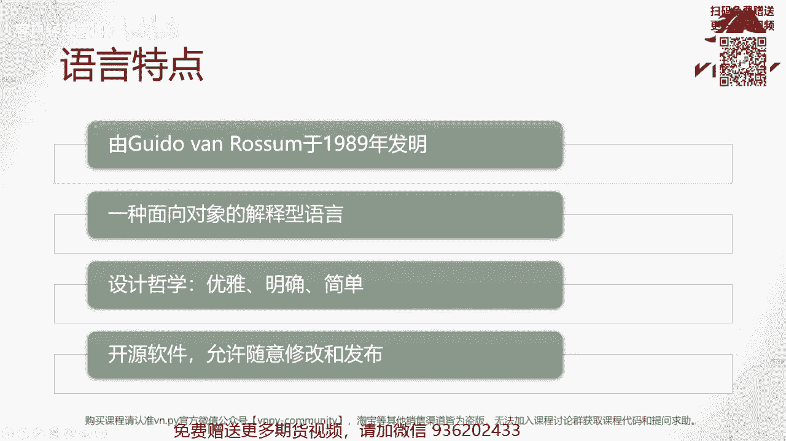
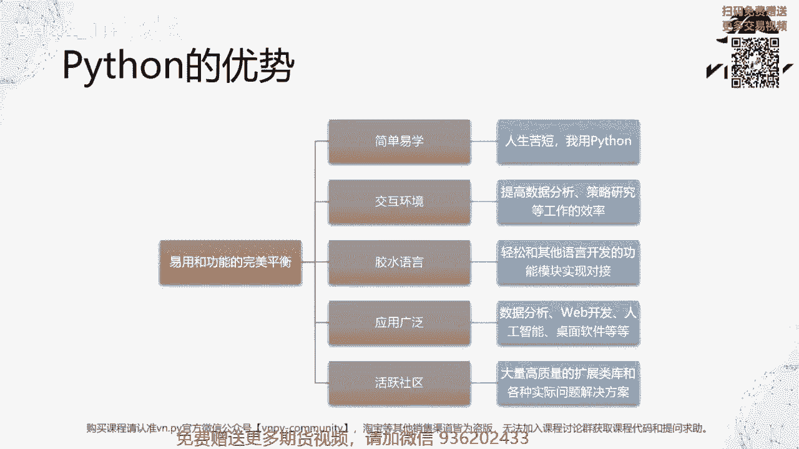
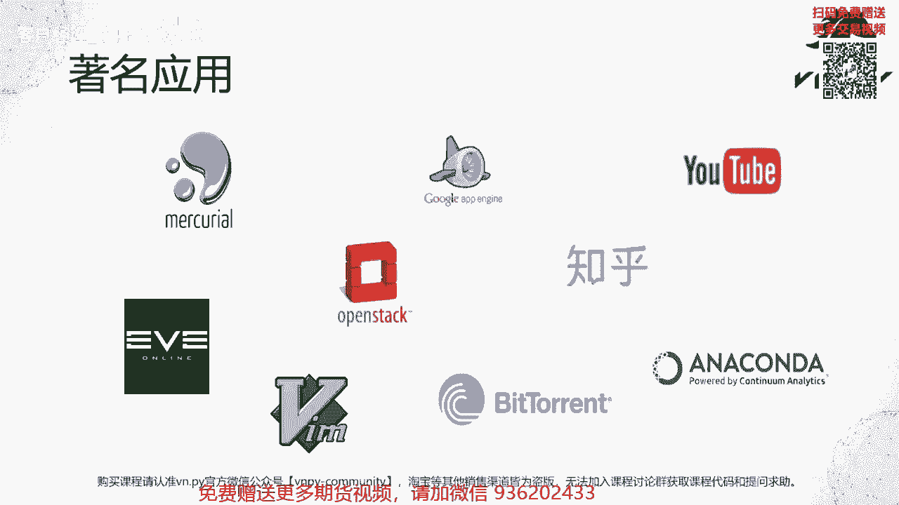
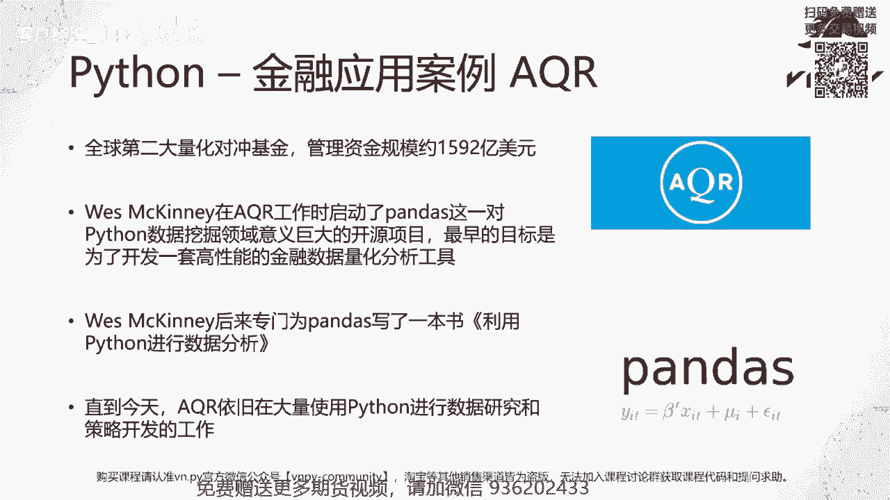
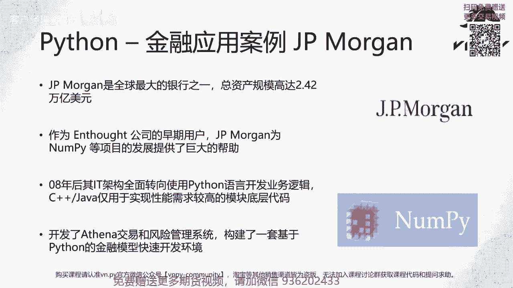

# VNPY30天解锁Python期货量化开发：课时01 – 认识Python语言 - P1 - 客户经理_小陈 - BV1bvs5ekEAz

OK欢迎来到我们全新的量化交易，零基础入门系列，30天解锁Python量化开发课程，那么今天呢是我们的第一节课，在这一节课里面啊，首先我们要来认识一下Python这么一门编程语言，那不管到现在为止啊。

你有没有真正尝试过编程，在工作生活里面呢，可能多多少少听说过这些名词啊，比如说C加加，比如说java，比如说MATLAB，那这些名词有一个共同点，就是它们都是一种编程语言，那在这么多的编程工具里面啊。

这个Python它有哪些特点呢，我们这里把它总结了四个点，首先它是由一位叫做grado van rosm的，荷兰程序员在1989年发明的，那么至今呢已经有差不多31年的历史了，第二个特点呢。

叫做它是一种面向对象的解释型语言，这句话里面有两个比较关键的名词啊，一个叫做面向对象，object oriented啊，还有一个叫解释型语言，Interpreting language。

这两个词你现在肯定有一点啊，这个丈二和尚摸不着头脑，哎，不知道什么东西，没关系，再过差不多十来节课哈，相信你对这两个名词的概念，会有一个非常深入的了解。

第三个特点呢叫做他这个Python的设计哲学是优雅，明确和简单，说白了Python的设计更多是为了满足我们这些人，我们这些程序员的需求，而不像其他的，比如CC加这样的语言。

可能更多呢是针对CPU的需求来设计的啊，所以它能运行的很快，那Python呢更多针对我们人的需求来设计，可以让我们写程序写的很舒服，写的很快，最后呢Python是一种开源软件啊。

所以啊首先所有的源代码都提供在网上，你可以根据自己的需求，任意的去查看，任意的去修改和发布啊，而不用担心诶，它有点像一个黑盒子，比如MATLAB就是一个黑盒子，你看不到里面它到底是怎么实现的。

那对于我们做量化交易啊。

或者说你想做量化研究，数据分析的一些用户来说，Python的核心优势在哪呢，我们把它总结成一句话，叫做易用和功能的完美平衡啊，平衡在哪，有这么五个点，首先第一点叫做简单易学啊。

Python社区有句非常这个有名的话叫做人生苦短，我用Python啊，英文是life is short use Python，那几乎呢如果你有条件脱产啊，就不用上学，不用上班，三天的时间。

每天可能8~10个小时，就能够让你快速的上手，Python开始写出自己的应用代码啊，如果工作确实有点忙，每天只能抽出一到两个小时的话，那基本上两周啊，最多三周的时间你也能够去上手了。

所以真的是非常容易学，而且不管你之前有没有过唉，编程等等方面的经验，只要你愿意学，都能学会，第二点呢叫做交互式环境啊，不止像其他的一些编程语言，你可能要写一大段代码，然后呢做编译，然后呢再去运行它。

看结果，Python支持这种，有点像哎你打一句命令我就给你看一行，结果打一句命令就给你看银行结果，这样的交互式环境，所以对于我们做数据分析，做策略研究的时候，第三个特点呢叫做胶水语言。

可以轻松的和其他语言开发的功能模块，实现对接啊，比如说像VN点派这样的量化交易框架，我们就可以很方便的把Python写的啊，上面我们写的这个策略和底层，基于C加加开发的交易接口给对接起来。

实现一个完整的量化交易的功能，第四块呢叫做应用广泛，那不管是做数据分析还是做web开发啊，就写一个网站或者写一个这种实时的聊天应用，人工智能，机器学习啊，这个大数据研究啊，或者说做一个桌面软件。

简单的可能就一个小闹钟啊，桌面上一个小闹钟软件复杂一点呢，你想做一个像excel这样的分析图表，或者说你想做一个很复杂的啊，这样期权波动率交易的这么一个监控界面，那Python都能满足你的需求。

最后一个优势呢叫做活跃社区啊，Python在所有的编程语言里面，他的这么一个啊用户社区可能是最活跃的啊，所以也就意味着当你遇到问题的时候，你可以在这个社区里面找到很多高质量的这种，扩展类库。

或者说直接就是前人已经解决过这些，问题的解决方案啊，你直接拿来用就好了，所以可以大帮助我们，大大的提高我们的工作效率。

那啊这里呢我们列出了一些Python，比较著名的应用啊，那首先我们从左上角开始，这里第一个应用呢叫做monkey o，它是一个基于Python开发的代码管理工具，什么是代码管理工具呢，我讲另外一个名字。

可能你更熟一点，它叫GITHUB啊，GITHUB背后用的是get it这么一个管理工具，而MERCURREAL呢是和它并列的，这就世界上啊用户量最大的这么两大啊，这个代码管理工具。

然后这边是google app engine啊，谷歌云应用引擎，那这个app engine上开发的呃，就用来开发A这个app的，这个第一的编程语言也是Python，然后右边的这个是YOUTUBE。

那国内现在可能访问不了，但是YOUTUBE它是一个完完全全用Python，开发的这么一个网络应用，同时呢可能也是世界上目前哈，同时在线用户量最大的这么一个Python应用，然后到第二排。

这里第一个啊是EV e online，对于现在的啊这个人来说可能有点陌生啊，但你如果放到10年前，他是第一个可以支持数万这个游戏玩家，同时在线的这么一个啊这个星球大战的游戏，那而且这个同时在线。

是通过一台服务器就能实现啊，所以在当时呢是一个非常了不起的成就，同样它背后的这个游戏服务器也是用Python实现的，然后是open stack，这个是由美国宇航局就NASA推出的一个。

针对云计算的基础框架，那现在我们可以看到到处都有各种各样的云，京东云，腾讯云，阿里云啊等等等等，那这些云计算框架里面，多多少少都借鉴了open stack啊，这么一个框架的这个这个啊背后的一些技术吧。

那OPENSTACK它也是完全用Python开发的这么一套工具，然后是我们的知乎啊，知乎是这个国内可能也是最知名的，这么一个在线问答平呃，问答的这么一个嗯，怎么说呢，就只要有社区吧，那在这个社区上。

那知乎背后的主要开发语言就是Python啊，然后到最下面一排VM，VM是一个啊这个最老的程序员的编辑器，那VM的所有插件开发也同样是用Python来实现的，然后到BTT啊，这个是著名的BT协议啊。

就BT这个是用来下东西的嘛，就是用来下载的这么一个工具，那么BT生态里面的第一个图形客户端啊，bittern客户端就是用Python来开发的，最后右下角的是这个anaconda啊，那如果你接触过啊。

用Python做数据分析，用Python做一些哎这个量化研究的话，那我相信anaconda可能是你啊，这个知道最有名的这么一个，针对科学计算的Python发行版，所以你可以看到啊。

就是这个尽管是一门编程语言，那在几乎每一个比较知名的编程语言，的应用领域，Python都有它很成功的应用案例。

那接下来呢我们看两个可能跟我们更相关的啊，接下来学这个课，主要可能更多关心的还是在金融行业的应用，那第一个我们来看Python，在AQR这么一家，全球第二大的量化对冲基金的应用案例啊。

EQ2的资金管理规模呢，大概是1592亿美元啊，这个数字可能是啊45年前的了，现在我相信规模只会更大，那么在AQR有一位员工啊，曾经的前员工嘛叫west maini，他在AQI工作的时候。

当时哎因为是一位量化研究员或者量化分析师，要去做这个很多的金融数据，量化分析的工作，但是呢他当时手上没有一个特别好的，趁手的这么一个工具，所以呢他就选择自己啊从零开始一点点点摸索。

开发出了pandas这么一个啊，Python在数据挖掘领域意义重大的开源项目，可能在今天啊，所有你看到Python在比如说人工智能，机器学习，大数据分析等等这些领域的各种应用，它背后那个底层的啊。

最下面的那么一个工具都是pandas啊，所以可以说pandas as开启了Python在这个数据分析，这么一个巨大的应用场景里面的啊，这么一个未来，然后vs meeny呢后来也为pandas写了一本书。

叫做利用Python进行数据分析，这个中文名大家可以直接拿着它去京东，或者去淘宝上搜一下，这本书可以直接买到啊，如果你后续考虑在这个数据分析方面，有所建树的话，那我强烈的也推荐你可以买来先看一下啊。

然后最后直到今天吧，AQ2依旧在大量的使用Python，进行数据研究和策略开发的工作，并不是说诶10年前可能做出来之后，现在慢慢淘汰了，不是这样的，直到今天，几乎他们大部分的这个数据研究和策略。

开发的工作都还是在用Python来完成。

那AQR呢是一个啊，如果在金融机构里面讲，它叫做买方机构啊，因为是个基金嘛，那另外一个类型的机构就叫做卖方机构了啊，在这儿我们用的例子就是JPMORGAN，JPMORGAN呢是全球最大的银行之一啊。

总资产管理规模高达2。42万亿美元啊，当然规模上可能略少于我们，现在中国的这个宇宙行啊，就我们的工行，那JPMORGAN本身是一家叫做n dot公司，的早期用户。

那啊同时呢他们为囊牌等等的这些围绕着Python，科学计算方面的这些开源项目，提供了巨大的帮助，那JPMORGAN呢也是在08年后，把他的整个it架构啊，因为我们知道0607年爆发的次贷危机吗。

当时在整个次贷危机里面，华尔街头好像倒了两个啊，剩下有一个理论上，在这个自带衍生品上本身是没亏钱的啊，但是当然后来这个整个美国股市暴跌，整个美国金融市场流动性干枯，对他也造成了致命的影响。

那这家公司呢就是高盛，高盛为什么能这么聪明的躲开所有啊，次贷的这个亏损，主要原因就是，因为他们内部有一套叫做s e c language的啊，自己高深内部开发的编程语言，那么这个编程语言用一句一。

111句话来形容它的特点，就是它是一个面向对象的解释型语言啊，回到我们第一张PPT里面讲Python的特点的时候，你是不是发现和Python高度类似，那确实这门语言最大的一个帮助。

就是使得高盛哪怕只是前台最普通的销售，压根就不是it，也不是这个QUT啊，就是个销售，他也能去写一些简单的啊这个编程代码，然后呢，很快的针对他们当时各个所谓的training desk。

就交易台上持有的这些次贷衍生品，进行这么一个啊定价，进行这么一个风险分析啊，然后如果需要对冲的就赶紧进行对冲，需要卖掉就赶紧卖掉，使得高盛在次贷上几乎就没那么赔钱啊，所以也正因为这么一个事实吧。

在08年后，华尔街的各家投行，从美林到JP摩根等等，都开始把自己的核心的it架构，全面转向由Python来开发了啊，当然了，C加加java之类的语言也还在用，但是仅仅用它们来实现性能需求比较高的模块。

的一些底层代码，那这样有个什么好处呢，就像我们之前说的，你不再只是啊一家机构里面最为顶，那这最聪明的这些i it，最聪明的这些QUT会写这个会会嗯，能编程，能写一些这个程序啊，就算是前台最普通的。

可能主观的这种人工的交易员，或者说一些甚至于主要负责打电话的销售，他们只要经过很短时间的学习，也都可以用Python去写一些小程序，来满足自己在交易业务里面的需求，同时呢。

JPMORGAN也是开发了一套基于ASINA的啊，叫做ASINA哈，雅典娜的这么一个交易和风险管理系统，构建了一套基于Python的啊，金融模型的快速开发环境，所以使得他们整个公司的可能。

金融系统完成了一个比较大的迭代。

OK那么我们这节课的内容呢就先到这里了，然后更多精华内容呢，请扫码关注我们的社区公众号啊。