# VNPY30天解锁Python期货量化开发：课时03 – Hello, World! - P1 - 客户经理_小陈 - BV19RHGegEdY

OK欢迎来到量化交易零基础入门系列，30天解锁Python量化开发课程，那么今天呢是我们的第三节课啊，在上一节课里面，我们已经把我们的VN studio Python运行环境给装好了，在这节课里面。

我们就跟学习所有的编程语言一样，来做这么一个hello world，这节课的PPT就这么一章啊，因为更多是实操，那首先什么叫hello world啊，就是在这个啊一个不管是交互式环境里面。

还是这个就是可能DOS的那种黑框框啊，一般我们就管它叫CMD命令行里面输出，hello world这么一个词啊，什么叫输出呢，就是把内容给打印出来，在这儿啊，我们这节课里面啊，我们要尝试三种方式。

其实对应的也是Python啊，我们去运行Python代码的这么三种不同的方式，第一种方式最基本最简单啊，就是交互式CMD命令行啊，在这儿呢我们先运行Python的来启动交互式，这个叫做REPL环境啊。

这个环境啊，他的这个这个概念我们后面会讲啊，然后我们来执行命令，打印内容怎么做呢，我们这边就直接开始实际的操作。

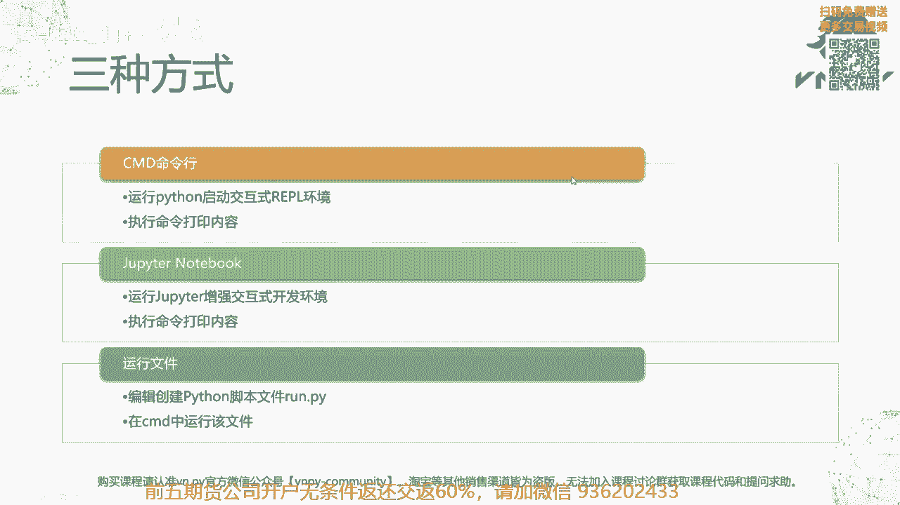

首先把我的这个啊PPT额最小化，然后大家可以看到啊，就因为我这边V上节课VN studio已经装好了，桌面上有这么一个图标，VN station啊，大家可以看到他们两个图标其实啊是很像啊。

其实就是一个图标啊，只不过就名字不一样，这个VN station我们后面啊就会用到它，那这节课呢我们先不用它，我们先来打开一个啊CMD，你可以说哎在开始里面输入CMD来运行。

或者呢我们在这儿跟推荐一个大家的方法，在你要运行这个CMD的文件夹，在这个里面呢按住shift键，键盘上左下角的shift键，然后按你鼠标的右键找到这个，在此处打开power shell窗口啊。

注意一定要按住shift键，否则我直接按的话是不会有这个选项呢，看到没，一定要按住shift键之后再点啊，在此处打开power shell窗口，那么这个power shell是个什么东西啊。

如果那我这边先开个power shell。

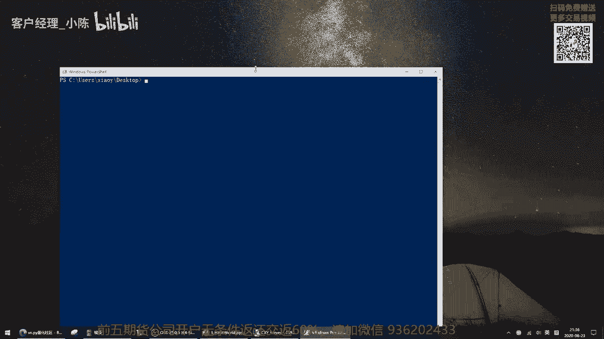

然后呢旁边再给大家开一个CMD。

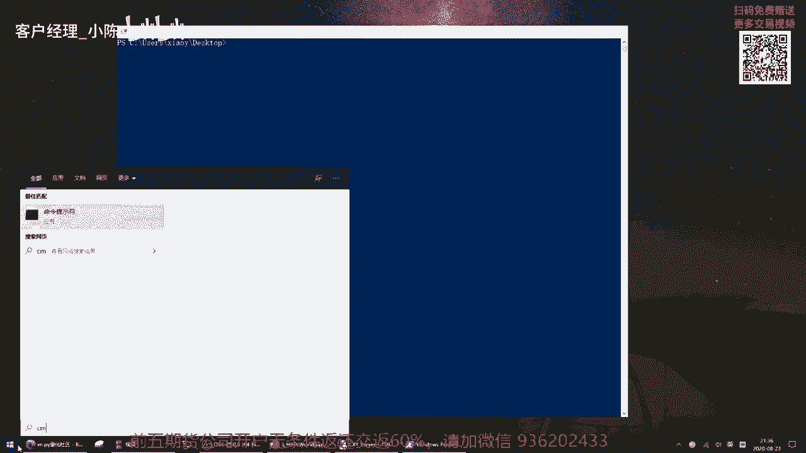

大家可以看一下啊，你可能会觉得说哎一个是蓝框框，一个是黑框框啊，确实这个是可是他们最直直观的区别之一，但实际上他们背后都是一个叫做Python呃，不不好意思，windows的命令提示符。

运行环境就是你用来输命令，那windows给你执行了之后输出结果这么一个环境啊，那么啊CMD是比较可能比较老版本的啊，从windows十九八这个这个2000时代就有的啊，当时叫DOS提示符。

然后power shell呢可能更多是一个新版本的，可能从win7之后啊才有的，它会更加强大，更加方便一点，但对我们来说，其实嗯他们俩几乎没什么区别啊，所以你随便用哪个都行。

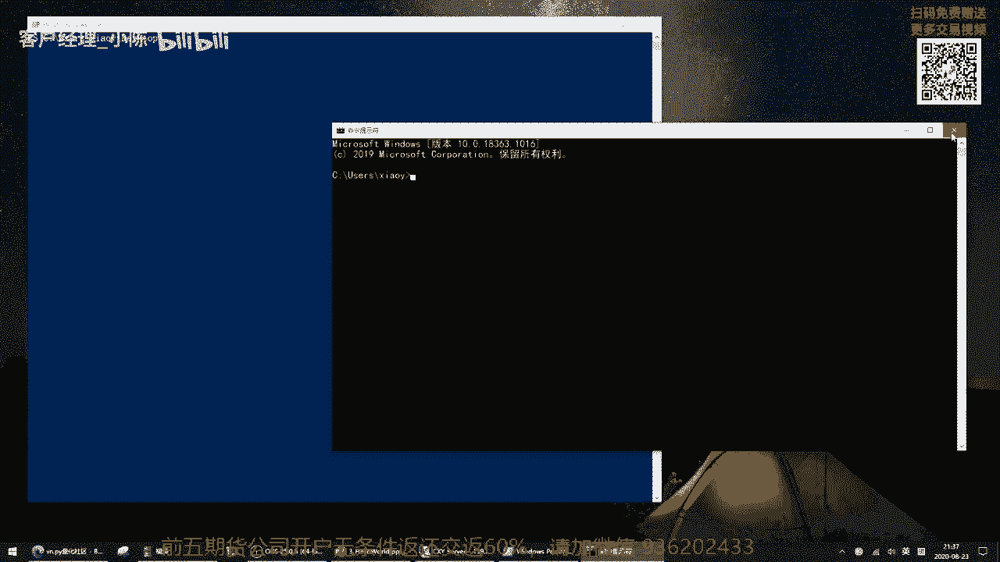

那在这呢，因为我的右键菜单上的是在此处打开power shell啊，所以我就用它了，你如果用老版本的windows的话，他可能在此处打开CMD，那你用它也行，没关系啊，所以在这儿啊。

我们先来输入第一个命令Python啊，就注意啊，一首先要是小写的Python啊，然后在运行之前，一定要确保上节课里面VN studio你已经装好了，没装好，你只要运行是运行不了的，会报错啊。

只要运行Python，然后会出现啊，这出现python3。7。1888啊，然后这么一堆啊，就是我现在已启动这个Python的信息，那在这我们可以看到有三个大于号，然后这儿呢还有个光标在跳啊。

跳的就光标的啊，这个光标形状变了啊，是这么一个有类似方块的形状，此时就已经进入到Python的，叫做交互式开发的环境里面。

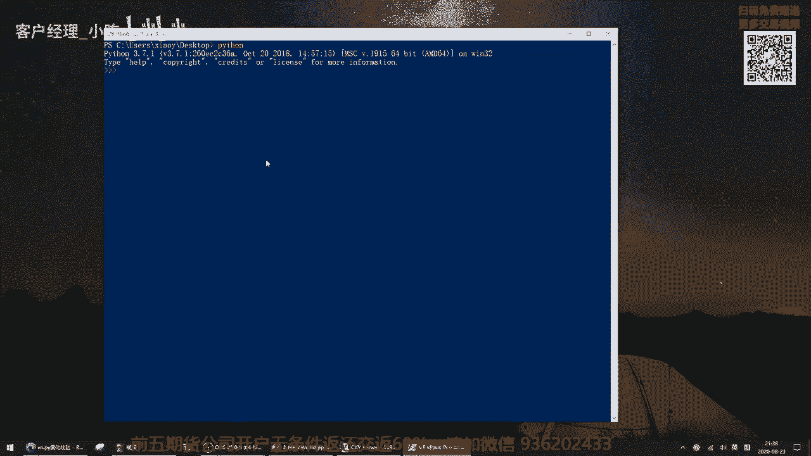

或者说呢就我们这张PPT上写的，这个叫做REPL的环境啊。

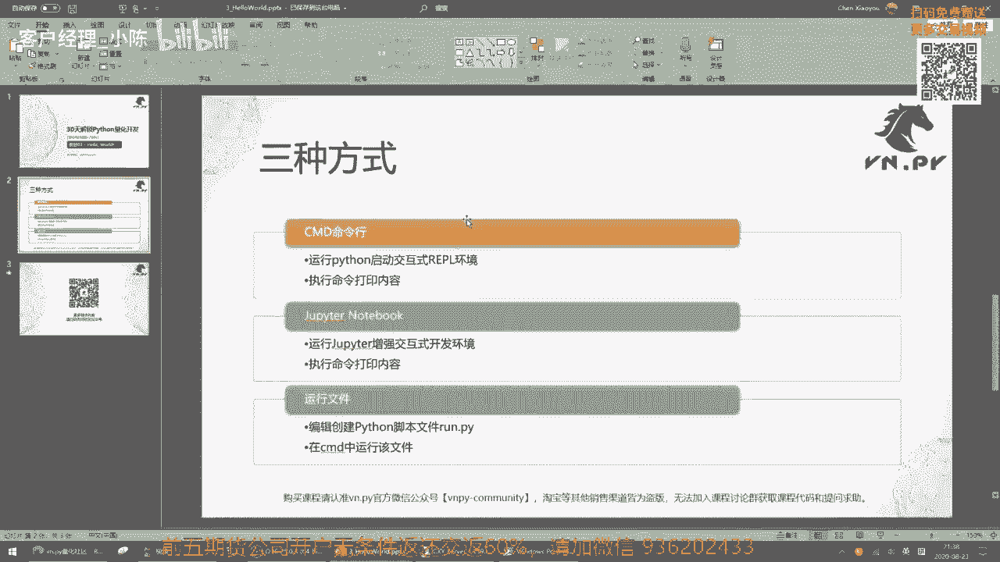

此时呢我们先不讲那么复杂内容，我们就直接来把hello world给做出来，怎么样，hello world呢，print啊，就打印的英文，然后一个括号啊，外面一个括号，后面再来一个括号。

我们先打第一个括号，然后呢上引号，hello啊，这个我们字把大小写打漂亮一点哈，Hello，这个空格word感叹号啊，再跟个双引号括号结束啊，所以你就要输入这么一个内容，print是一个词。

然后呢是一个括号，里面呢是前后用双引号括起来的，呃，是前后用双引号，不是说CI啊，就是包住了的这么一个hello world这么一个词啊，然后此时你来运行回车啊，运行它，我们可以看到这里输出了一行话。

叫做hello world啊，那么就这么简单，我们就Python里面啊，如果你要做hello world，就这么简单，一行代码就可以搞定了，如果你可能看过其他一些编程语言，比如C加加啊。

这个c#也可能尤其是java这种，你要输出个hello world真还挺不容易的，你要写一个啊源代码文件，然后要加载一堆的库，然后可能还要创建一个类，然后再去啊输出这个结果。

那在Python里面非常简单，直接启动交互式环境之后，一句print搞定，那在这样呢，我们就已经把第一种方法给给运行好了。

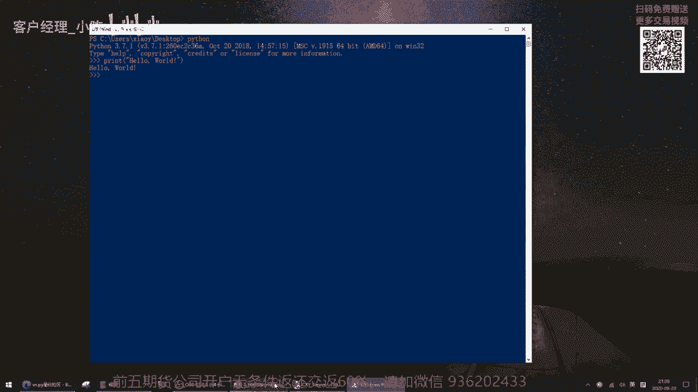

然后我们回到PPT来看第二种方法，第二种方法叫做jupiter notebook，JUPITER呢是啊，一个叫做这个增强的交互式开发环境，那怎么个增强法，马上我们就看到了，它第一个运行在网页里面。

第二个呢看起来还是挺舒服的，比至少比这个这个这个光命令行里面，输入速度快的呃，看着好呃，感觉好多了啊。

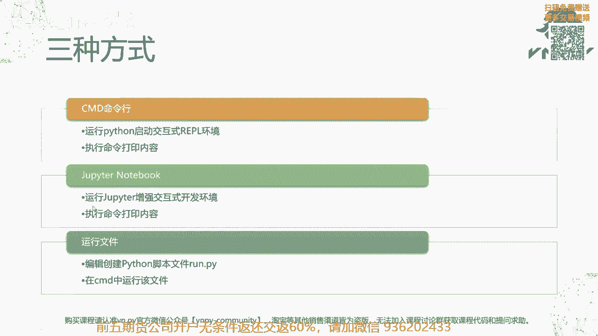

然后还是一样，我们执行命令来打印内容，怎么做呢，先退出来啊，然后还是回到这个框框里面，先按住CTRL再按Z啊，就是左下角哈，就一只手就可以按住CTRL，按住Z这个键啊。

就这个或者啊退出我们的Python，你可以进入Python啊，这是命令行进入PYON，然后按CTRLZ回车退出Python，此时呢我们又回到我们power shell的运行环境了。

那么在这儿我要输入一句命令来启动，Jupiter notebook，jupiter notebook啊，就这么一句命令回车，此时呢他会去运行我们安装好的VN studio里面的。

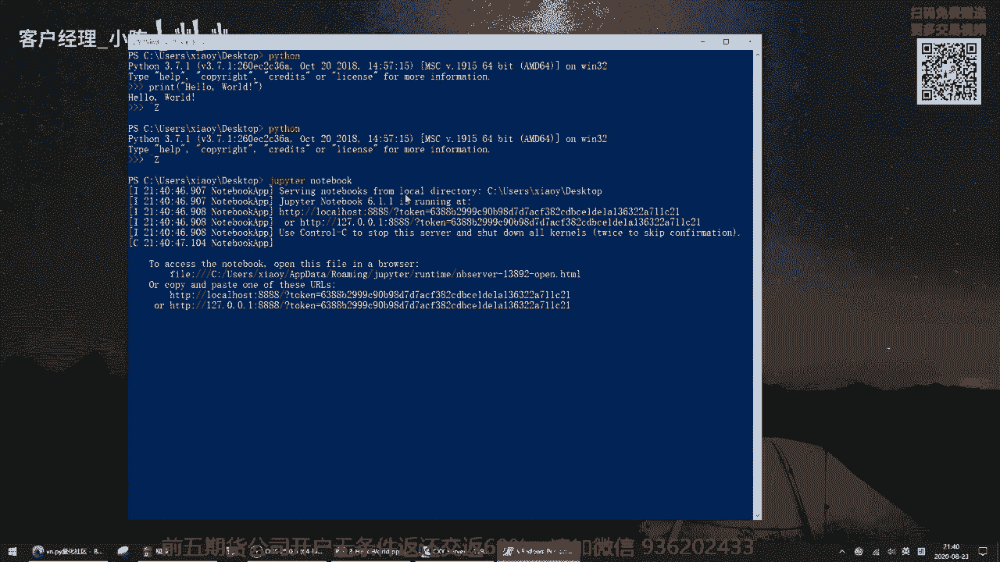

JUPITER服务器啊，然后我这里啊，因为我这台机器上面装的浏览器比较多一点，他问我要用什么浏览器来打开这个这个文件，那在这呢我就用我自己机器啊，microsoft edge啊，edge浏览器就可以了。

如果你的机器，比如你有chrome，你有FIREFOX也都OK，你都可以用它们来开啊，但是这个IE呢不是说不能用，但是跑的时候他那个渲染的效果会有点怪怪的，所以我并不推荐大家用IE啊。

所以你你有chrome，那我估计大部分人有chrome吗，或者你有five fox也行，或者你像我一样装了个edge，那我这就用这个edge来开哈，点确定打开，打开了之后呢，哎它就是这么一个一个页面啊。

在这个页面上，因为我在桌面上运行的嘛，它显示我桌面上一堆啊内容，那在这儿呢我点右边的这个new按钮啊，然后python3啊，创建一个以python3为运行，解释器的这么一个笔记本啊。

此时呢我在这啊有个untitled，这个是这个笔记本的名字，所以你随便输一个，我们就说这个demo1吧，咱们一起个这个名字，然后在这个单元这个叫单元格啊。

在这个里面我们还是一样输入print hello world，啊A刷个字word啊，然后我们在运行之前大家可以看到，首先它是彩色的，看着还挺舒服的哈，彩色的好看很多。

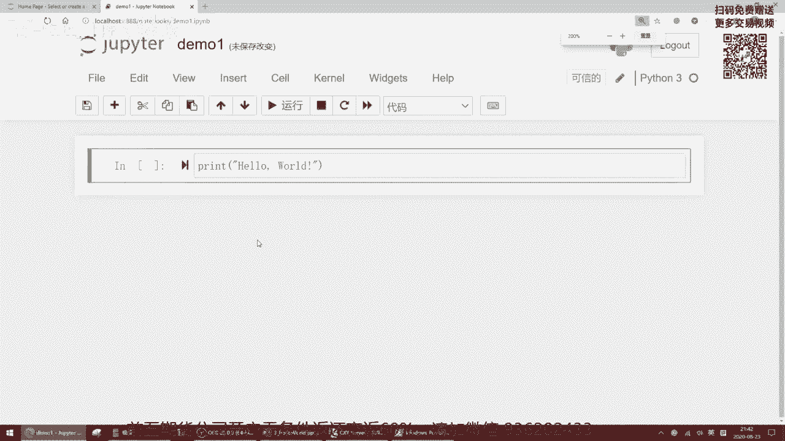

不像刚刚这个就是就是一个纯的蓝色底色啊。

白紫这个看上去稍微有点太过冷淡了，那在这呢啊，而且他呢稍微还有一点，就是说呃这个代码的高亮，什么叫代码高亮，就比如说print，这是一个Python里面的函数啊，一个Python的自带函数。

所以在这儿它是绿的，然后像括号啊，或者说其他一些加减乘除之类的符号，它因为是一种特殊符号，所以默认呢它是会黑色的，然后这个字符串啊，因为我用引号括起来了，它又是一个红色的，这样就让你可以比较一目了然的。

看出你的代码内容是什么，此时我们按住shift啊，按回车，或者你直接点这个按钮，我们先点按钮吧，点这个运行诶，在这也一样输出结果，hello world好，大家可以看到这一步我们同样完成的。

下面当然又弹出一个新框框，但这个我们先不管它，我们在后面讲这个啊这个JUPITER入门的时候，我们再去啊，再去给大家细讲啊，那这样JUPITER模式的hello world我也运行好了。

OK那啊先把这个啊浏览器给关掉啊。

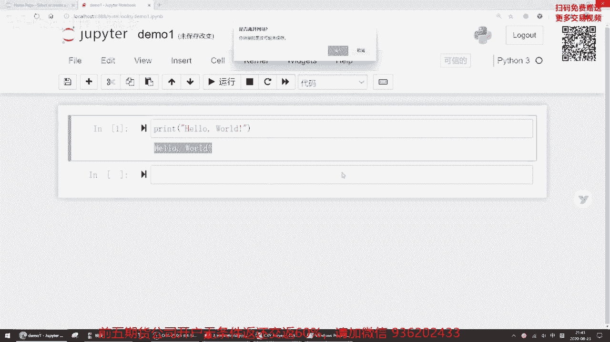

不管它就直接离开就好了，然后呢在这哈我们也再次按CTRL啊，这这时候就不是按CTRLZ了，是按CTRLC啊，啊不好意思，CTRLC呃，对它会慢一点啊，但是大家看他按了完了之后稍微卡了一会儿。

然后再也冒出一个interrupted shutting down，哒哒哒一堆信息，那在这呢核心就是我刚刚通过CTRLC这个命令，把我们的啊这个Python呃，JUPITER给退出来了，当然了。

你如果在标准Python里面，你也可以试试CTRLC，它会激活一个叫做keyboard，interrupt的这么一个异常啊，但是这个时候呢是嗯他不会退出去啊，所以你在Python里面要用CTRLZ退啊。

你在运行JUPITER的时候，你直接按住CTRLC就可以退出来，OK然后在这儿呢，因为上面内容有点多啊，看着不舒服，我输入一个这个这是DOS的命令啊，cl s clear screen啊。

就把我这个屏幕清空一下，这也是一个非常常用的命令，co s啊，随时清空一下，这样呢就比较干净，没什么乱七八糟的内容。

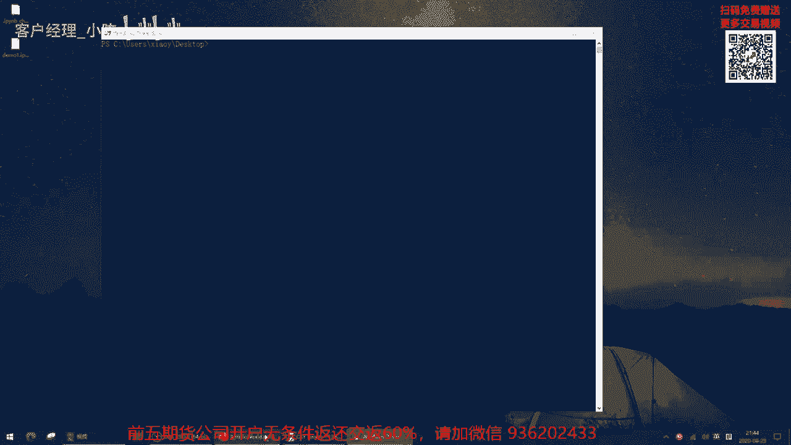

然后回到我们的PPT啊，第三步怎么做叫做运行文件啊，我们编辑创建一个Python脚本文件run点派，然后在CMD里面呢我们来运行该文件啊。

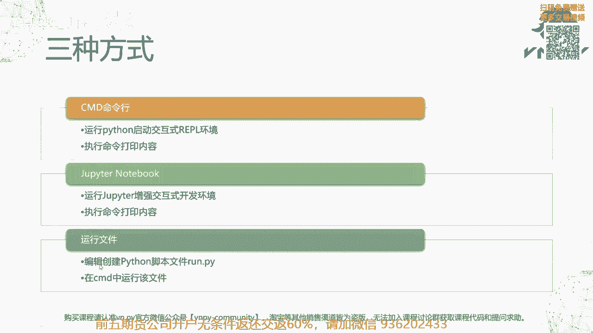

怎么做，也同样，我很快的给大家做一下，新建一个啊这个文本文档啊，给它起名RN点PY啊，或者这样吧，我们先先先那个新建文本文档。

双击打开它啊，就我就直接用文本编辑器打开它，print hello word啊，还是刚刚刚我们输入进去过的代码，对吧啊，我就我就就直接这样，然后看呃这个关了它保存一下保存啊。

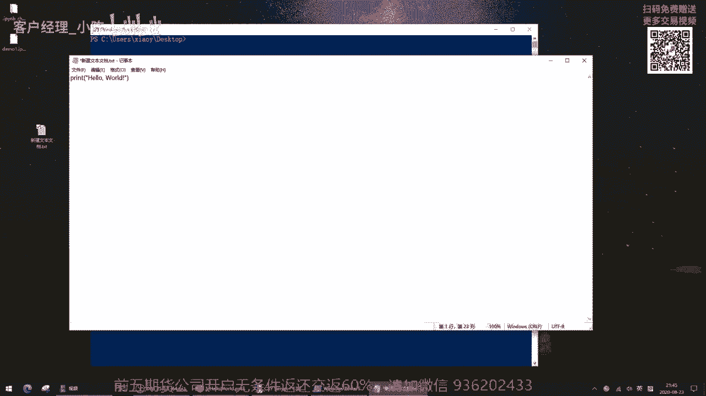

然后保存好了之后，我们在这改名，把它改成叫做run点PY，注意这个文件类型的后缀名一定要改啊，它会提示你改变文件扩展名，可能会导致导致文件不可用，确实要更改吗，有些这个呃。

一般windows系统装完之后，默认的时候这个文件的后缀名是不显示的啊，那如果不显示的话，你把它改成run点派，没用啊，因为它的后缀真实后缀名没有显示，一定要在改的时候，有我刚刚那个提示才算改成功了。

反过来啊，如果这个啊不显示后缀名怎么办呢，双击打开，随便开个文件夹啊。

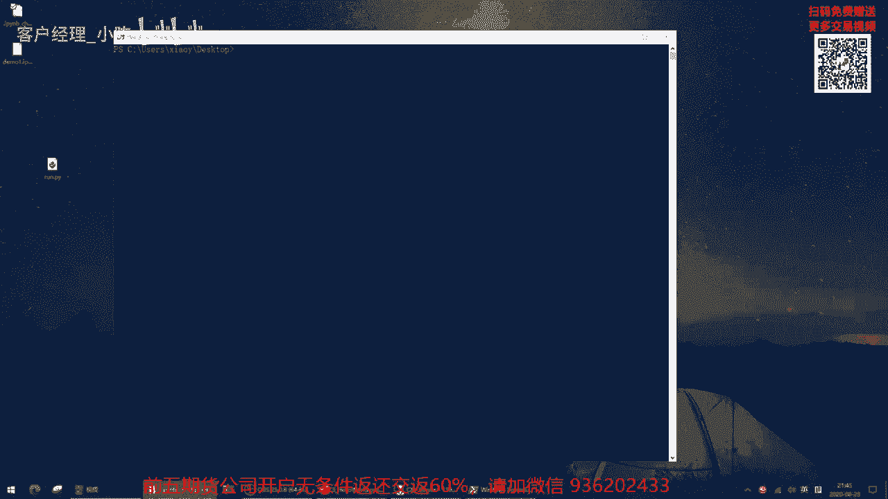

我这边就随便打开这个临时文件夹，然后找到这个查看啊，这个就最上面查看这个标签，然后这儿呢有个文件扩展名啊，你把它给勾上，勾上之后大家看到我刚勾勾和取消勾的时候，这个桌面上图标都要跳，你把它勾上之后。

这个后缀名就出来了啊。

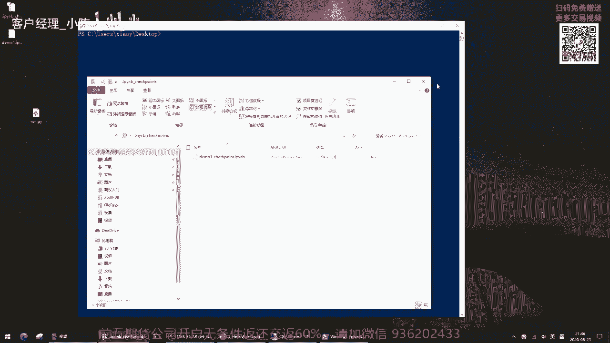

然后再关掉它回来再改名就行了啊，那当然我这儿已经改好了，然后我这个时候用，解释器直接来运行这个文件啊，输入Python run点PY回车，哎我们看到也同样输出了hello world这么两个词。

那但是在这啊大家再复习下Python之前，我只输Python回车的时候，他是进到这么一个交互式运行环境里面啊，我要输一句代码，运行一行，数据代码运行一行，但是当我运行Python叉叉叉点派的时候。

他就直接用这个解释器去批量的执行了这个run，点拍里面的内容啊，所以呢他直接输入出了这么一行，这个这个hello world之后就退出了解释器啊，所以呢这种模式更适合用来运行比较多啊，工作的时候。

所以呢工作多的时候嘛，我们就把那么多代码都写到这个Python文件里面，然后一行Python run点派直接把它批量的执行下来，而不要说哎我启动个Python啊，在这一行一行打什么的。

那就那就太太累了啊。

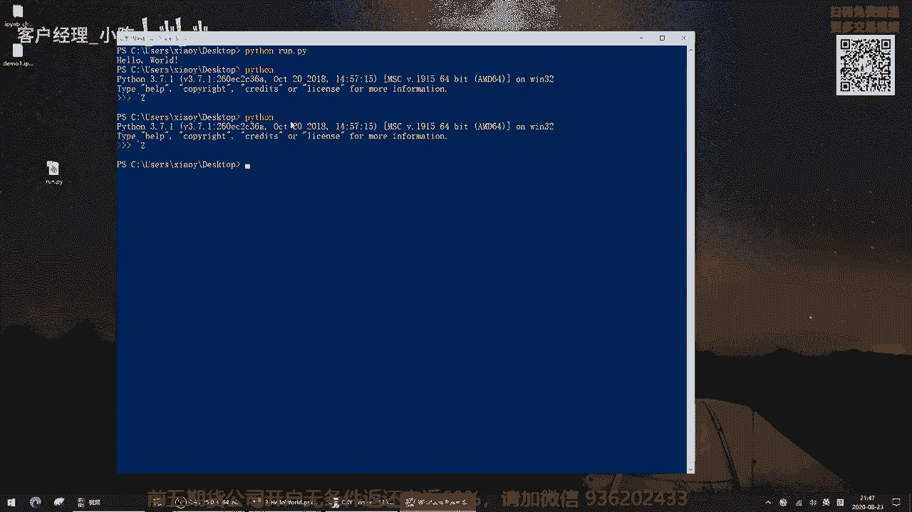

所以在这儿呢我们今天这节课吧，因为也是我们第一次真正敲个代码运行下的课，我们一共介绍了三种方式来输出hello world，或者来打印hello world这么一个信息。

对应的也是我们接下来在课程中反复接触到的，主要的三种运行Python程序的方式，第一种方式呢叫CMD命令行啊，其实我们是在power shell这个窗口里面运行的，当然你如果有CMD也行啊。

然后第二种方式呢是通过jupiter notebook，丘比特笔记本啊，这是一个在网页浏览器里面运行的，交互式的开发环境，最后呢我们还有一种方法叫做运行文件啊，就是创建一个Python脚本文件。

run点pi，然后呢我们去运行它啊，这种方式呢，后面我们会更多用它来写一些比较啊，内容比较长的程序的时候，我们会用这种方式来运行。

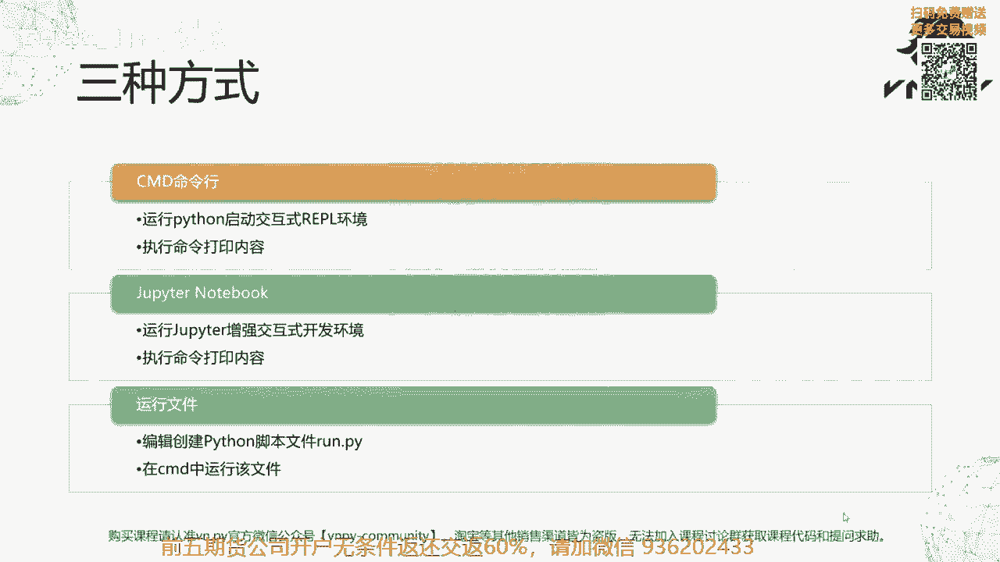

OK那么这节课的内容呢就写到这里了，更多精华内容，还是请扫码关注我们的社区公众号啊。