# VNPY30天解锁Python期货量化开发：课时06 – Github代码仓库 - P1 - 客户经理_小陈 - BV1h1HPe5ERo

OK欢迎来到量化交易零基础入门系列，30天解锁Python量化开发课程，那么今天呢是我们的第六节课，在上一节课里面啊，我们主要讲解了JUPITER，这个啊交互式的Python环境用法。

那么在这节课里面呢，我们就来学一学GITHUB代码仓库哈，如何用它来管理我们的代码，那么首先这个是啊，我们的课程交流QQ群已经给大家准备好了啊，可以直接用手机QQ来扫描这个二维码加群。

或者呢你在这个电脑的QQ上搜搜这个群号啊，也可以加进来，那么加群的时候啊，是需要验证的，大家注意验证信息，请一定输入你购买课程的这个微信昵称啊，不是微信号啊，一定要是微信昵称。

否则的话是啊我们这边找不到，就没有办法把你加进来，然后第二个课程中的代码内容，我们都会通过这个群的群文件来分享，到时候呢会根据课时放到对应的那个目录里面，方便大家去找啊，最后第三块。

因为是这个面向比较入门的这个编程课程，那肯定挺多，初学者在学习过程中会有各种各样的问题，那不管你有哪方面哈，Python学习过程中的问题都可以通过这个群来提问，每天呢我们也会有专人来解答啊，最后提一句。

就底部的这个小字啊，可能挺多人也已经注意到了，就是我们的这个课程是通过编点派官方微信，公众号VIP i community发售的，如果你在淘宝或者其他的一些渠道上，购买到的话，那都是盗版。

所以啊这些如果你买的是盗版的话，肯定是没有办法加到我们的课程讨论群里面，来获得课程的代码和提问求助的，所以我建议你如果真的是唉盗版的受害者的话，那请一定找卖家退款啊，回来买我们的正版。

这样才能得到后续所有的服务，OK那么我们就开始今天正式的内容啊，第一步来认识一下GITHUB，首先GITHUB是什么，它是一个网站啊，它是全球第一的代码托管网站，其他的呢还有GITHLAB。

还有马云kitty等等啊，关于这个叫做代码托管是什么意思啊，等会儿我们后面的实操内容，里面会有比较详细的展示啊，现在也听不懂呢，这个词也没关系啊，我估计挺多人第一次接触这个词。

第二个GITHUB这个网站使用的叫做代码管理工具啊，是一个叫做get it的版本管理工具，与之类似的，还有比如说SVN，还有我们一开始介绍Python的时候提到的mercury，AL等等啊。

那每一种这种管理工具都有自己的优点，或者说自己的特色，那git呢可能综合上它这个适用面是最广的，也使得它是这个全世界现在用户量最大的，管版本管理工具啊，考虑到我们绝大部分用户的需求。

所以这也是为什么我们选GITHUB来讲解的原因，第三点呢，GITHUB同时也是啊全世界这个开源项目的啊，这个一个聚集地吧，那么作为一个网站啊，它比起git工具本身，它还额外扩展了许多。

比如说版本的管理啊，比如说这个啊开发过程中各种哎新的需求，或者说啊遇到一些这个用户的提问等等，这一般叫做issue哈，这个issue的跟踪，还有的时候呢确实发生了bug，那有人会提交bug的报告。

然后作为作者或者维护者会去修复这个bug，同时把那个修复的代码和bug关联起来啊，那么这一类功能都是GITHUB网站所提供的啊，最后还有一个说法叫做，GITHUB是全世界最大的同性交友网啊。

这个我把它给画了个线杠掉啊，这个叫乌啊，确实在马龙里面的男性成员比例是较高的啊，但请相信这个男性成员在GITHUB上，干的都是正儿八经的事情，大家都是在啊写代码，或者说做一些创造性的工作哈。

不会不是为了这个同性交友去的好，那接下来就进入到我们的实操环节啊，所以这边呢我们啊，第一步要准备一下我们的GITHUB账户啊，大家需要先去3W点GITHUB点com注册一下，然后呢创建一个新的项目。

这个项目注意带上一个叫read me的文件，第三步呢下载客户端啊，Github desktop，最后呢来同步我们项目就clone project啊，那接下来我们就手把手的来做一下。

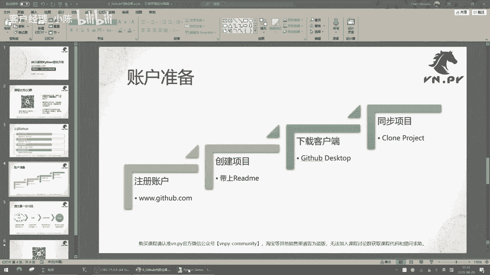

这边呢我准备了一个啊全新的服务器啊，这是一个阿里云的服务器。

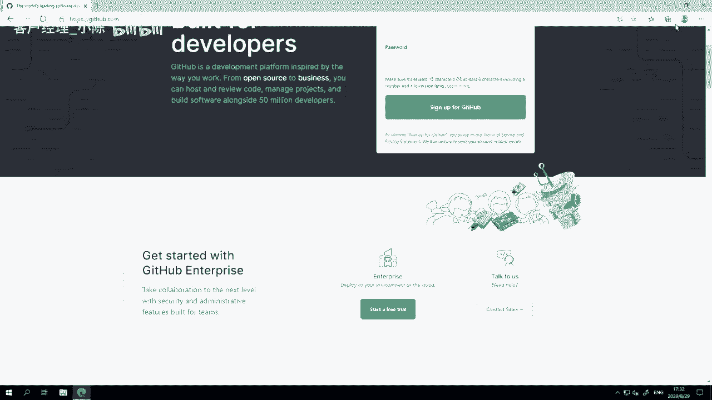

那么啊同时我估计也挺多人会问啊，如果你要买阿里云推荐什么配置的，这边呢我推荐的是首先最少两核心CPU，两核心内存呢最少四个G，然后这个操作系统选windows server，64位，2019中文版啊。

选这个，然后这个网络呢或者说网络流量啊，你选择按需付费就行了，你不要选那个固定单宽的，我们这种学习的时候，其实流量很小啊，按需付会便宜很多，那个固定太带宽的太贵了，那这边我已经把啊我们之前课上讲的。

比如说vs code VN d studio，还有这个浏览器啊，这个edge都已经装好了，如果不会装的同学，可能啊再回到之前课程里面去学一下怎么装，那我这边呢已经通过edge打开了啊。

这个GITHUB的网站，那要注意一下，这个GITHUB是啊一个美国的网站，所以有些时候他是有可能被强的，但是最近呢说实话访问还是很很很流畅啊，所以不需要翻墙就能直接访问了，如果你确实遇到强的情况呢。

呃这个可能还要自己解决一下，然后第一步注册吧，反正挺简单的，username email password啊，你用户名邮箱密码输一下，然后点这个绿色按钮注册就行，他会发一个邮件到你的邮箱里面。

你需要点一下确认啊。

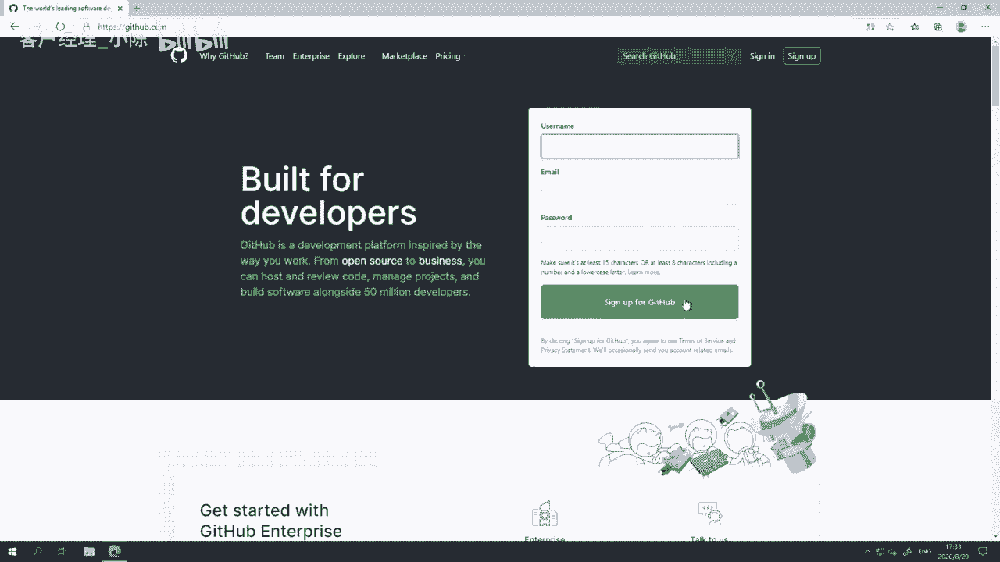

反正跟其他一些网站注册方法没什么区别啊，我这边就不多说了。

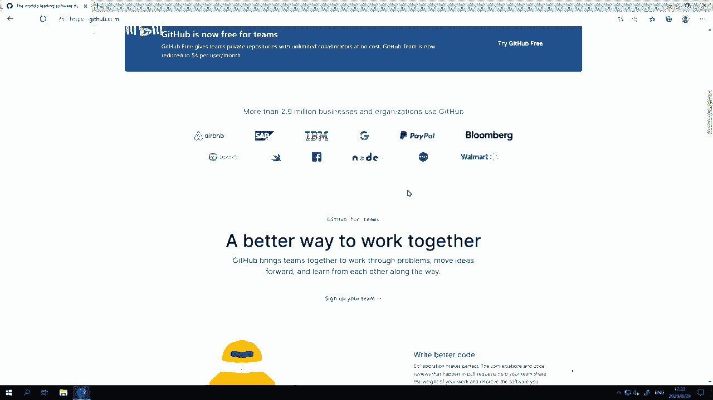

那啊然后呢我们把这个页面翻到最底下哈，最底下最下面有一个叫做啊这个github desktop，大家看到这，或者你直接在页面上CTRLF搜索这个desk top啊，就会直接跳转到这。

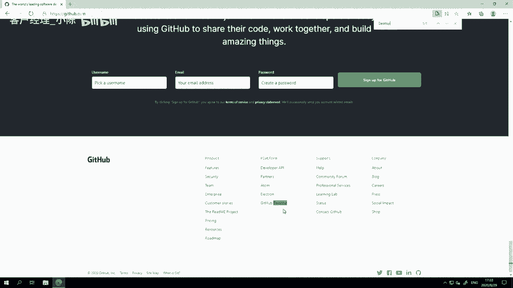

先点它一下，我们来安装一下这个GITHUB的啊，这个桌面客户端，这个叫download for windows，好六四位好，点这个按钮让他先装上，好然后大家可以看到这下载还要稍微花点时间。

要个几分钟的样子。

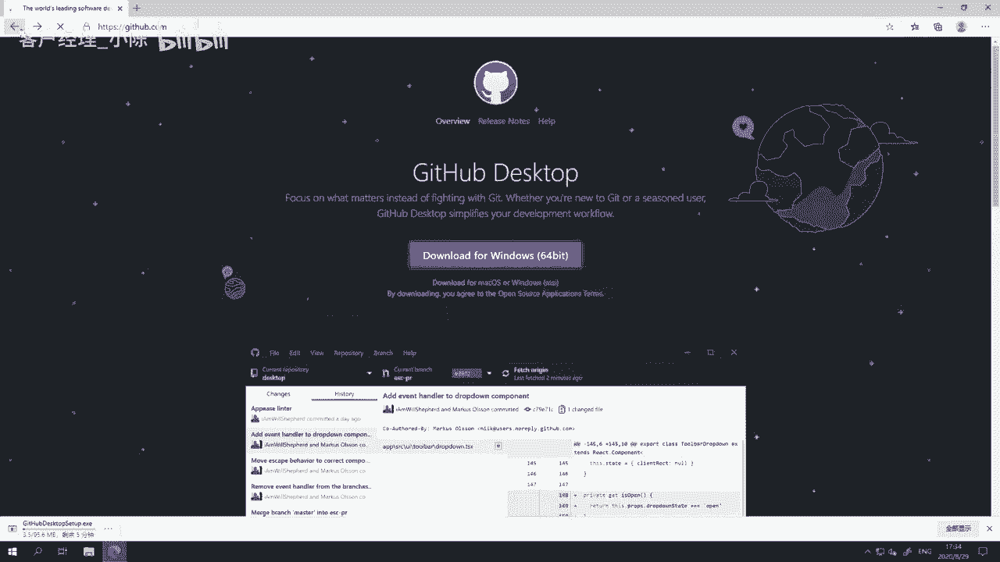

那这边呢我先登录进，我的是这个账号啊，这是我就是VPY的账号，同时底下让他先下着，我这边先登进来之后诶，他给我发了一个啊，因为这也是一台全新的机器啊，就第一次我在上面登录。

所以他需要我这边啊去做一个验证啊，我这边稍微稍等一下，我需要对去打开我的邮箱做一个验证，如果大家的话，第一次使用可能也会有同样的啊，这个问题它主要是为了保证一个安全性，好这样就验证好了。

已经登录了这个一个啊GITHUB的呃，我的用户主页吧，如果大家登进来的话，因为你如果是一个全新的账号，左侧可能是没有任何内容的，大家可以看到这边有很多啊，编得派相关项目的代码，编PY编。

Master vn station，VN similar等等，还有我们的社区网站VP i community啊，反正都在这，然后啊，这个中间这块会显，是和我这个账号最近相关的一些啊，这个行为。

比如说有人给别人PI点那个star哈，这边我也都可以看到，然后呢右侧有一些GITHUB给我推荐的，可能唉他觉得我会感兴趣的一些项目啊，那这些我们先不管，我们先来创建一个全新的项目，在这啊点new。

然后我们来创建一个啊，这个这个这个仓库的名字啊，我们这边就起个最简单的名字叫做啊demo好啊，我这也是我们为了学习用的嘛，就是给给它起个名字叫demo，然后这个描述啊也就就随便写，你写不写都行吧。

他是optional，但我这边就写一个demo好了，然后选择仓库的类型，你可以选择是公开的，就大家都可以看到你的啊，这个仓库你也可以选择是私有的，私有的就只有你能看到，一般情况下呢。

我建议大家个人的项目可以选择私有的啊，防止万一你不小心把一些哎个人的信息啊，放在这个代码或者文件夹里面呢，这万一给传到网上，被别人看到比较危险啊，所以一上来你可以先选private。

等到后面确实这个项目，你想把它开源出来的时候，想要公开出的时候，你再把它选成public就好啊，然后在下面这里有个选项叫做ADD a read me file，好添加一个read me文件哈。

我们把它给添加上，然后下面呢还有两个文件，一个叫get it ignore，就是你有没有一些文件，不希望这个get it去帮你推送到网上去了，就更新到网站上，就比如你个人的一些账号密码信息。

你肯定不需要码啊，如果你需要的话呢，也可以把它勾上，然后这个可以选一个模板哈，比如说我们就选一个Python的模板好了，因为我们这个课程等会啊讲的都是Python的代码嘛。

然后最后有个choose the license啊，就选择你这个代码是根据什么授权的啊，那么注意在这儿的话，大家可以看到一堆这种授权，这些都是所谓的开源授权协议，大家有需要的话就选，没需要的话。

你可以选择这个none啊，就不需要开源协议，因为私有代码嘛，我又不打算给别人用，或者你也可以选择the unlicense，就是啊这个没有授权的，这也可以哈，我这边就选N好，并不需要这个。

然后点create report to啊，创建这个仓库，那么这时候这个仓库就已经创建好了，然后啊注意到我这边GITHUB的这个客户端还没下好，我看看能不能在本地电脑上下一下，这样会更快一点。

啊稍等我这个本地因为有翻墙啊，这个所以下的会更快一点，然后还有一分钟的样子，OK那我这边啊就不下了，我直接把我本地下好的啊，这个安装文件给复制到我的阿里云服务器上，好这边已经复制过来，那我就来执行安装。

对好像开了两个，把一个关掉啊，他这个安装完全应该是一个傻瓜的后台安装，就直接就在后面装了，也不需要你去调什么配置，大家可以看到这边有个很小很很小，隐秘的进度条啊，很快就装完了啊，这样已经装好了。

然后这个时候呢它就弹出这个叫，welcome to github desktop啊，欢迎来到这个GITHUB的啊，桌面客户端第一步呢我们就来登录啊，sign to get up dot com啊。

我们就直接登录一下，他会打开这个网页啊，告诉你一个网站能试图打开这个应用程序，允许它，嘿然后它会自动连到这个GITHUB的网站上去授权啊，然后这个时候呢它会弹出这个信息，叫我配置一下git啊。

正常就选择这些name啊，email就好，然后点continue啊，这个这个是随便啊，就有八个它自动帮你采集报上去啊，这个也没关系，我就把它勾上，点finish好。

那在这我们就看到了GITHUB客户端的这个界面啊，就长这个样子，其实挺朴素的，然后呢在右侧我们搜一下啊，demo就我刚刚创建那个demo项目，因为大家可以看到我的项目挺多的啊。

因为因为毕竟啊这个用了挺多年啊，比较方便的一个方法还是自己搜一下，但如果你你第一次用的话，可能就一个项目，你搜不搜都无所谓，然后找到这个demo，选择clone VN py demo啊。

把它从远端服务器上，把整个这个代码目录给复制到。

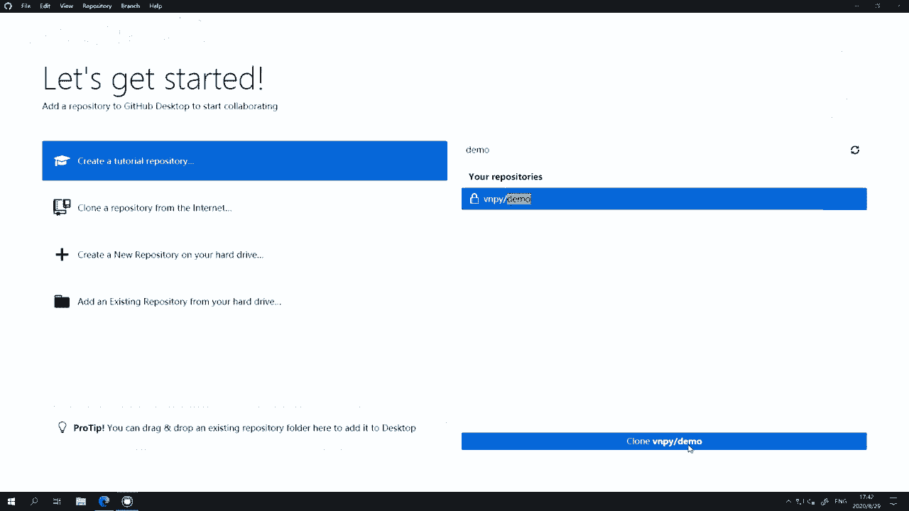

或者叫克隆到本地来啊，点这个克隆，然后它会弹出这个页面啊，首先你要从什么地方克隆，然后呢你要把克隆的代码给放哪去，一般情况下，我们比较推荐大家在用的时候，把它唉放到C盘的一个叫GITHUB的目录啊。

下的这个对应的项目目录里面，我们一般推荐大家啊这样放，当然它默认的这个目录啊，在你users啊，administrator documents目录里面，那也可以，其实就在用户的文档目录里面。

但我这边推荐大家放到C盘，这样后面去找他的时候方便些啊。

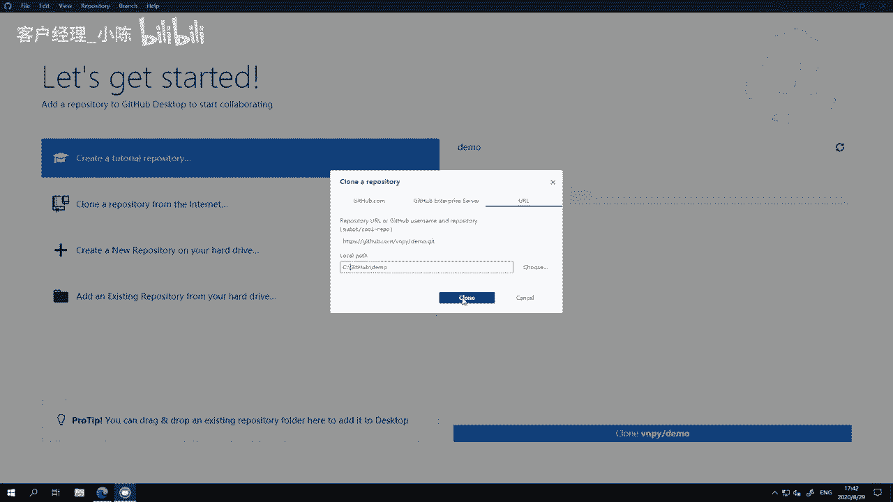

点这个克隆按钮，它就开始克隆了，其实所谓的克隆，也就是把远程那个服务器上的仓库里面的呃，就所谓的仓库啊，我们刚刚新建这个叫demo的项目，或者说这个demo项目，项目下存放着我们代码的地方。

就是所谓的仓库啊，那么复制下来的意思就是把那个仓库里面，所有的文件给复制过来。

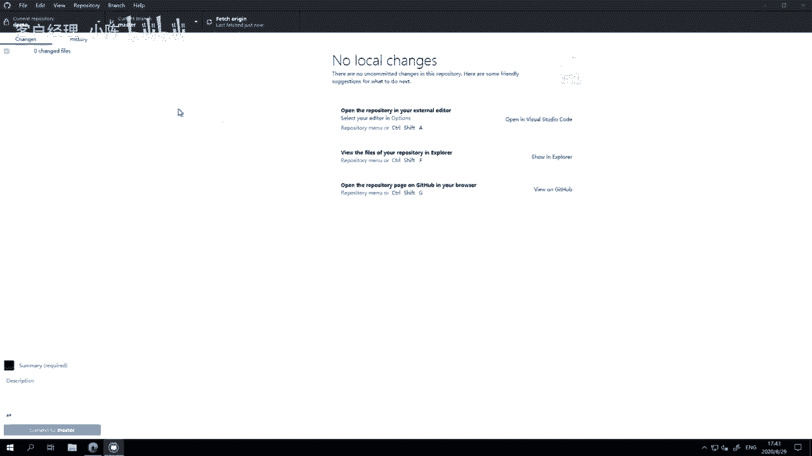

那么我们现在唉大家看到current repository啊。

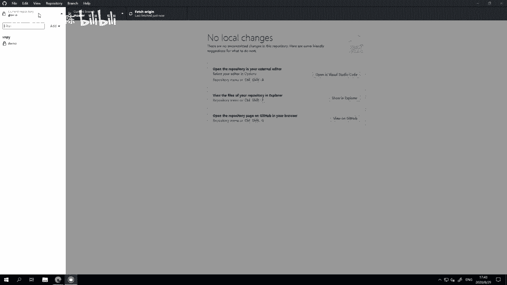

就这样你可以点一下哈，已经是demo了，然后呢我们可以看到啊，这里什么修改记录都没有，因为我全新创建了一个嘛，我们点右边这个按钮叫open in video studio code。

我们在vs code里面打开这个啊，这个这个目录。

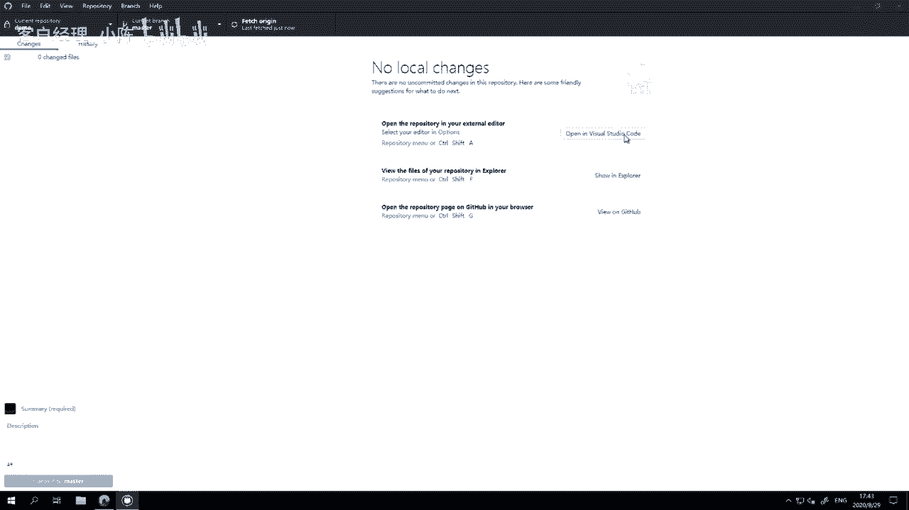

好打开之后啊，我们在右侧可以看到有get it，ignore和read me这两个文件啊，然后看可以看一下里面的内容，这个内容呢我们先不多去讲它啊。

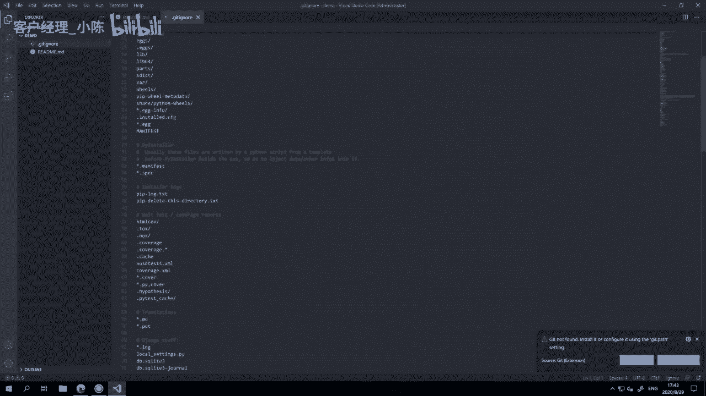

因为这个就涉及到一些git的细节使用方法，我们先不管它啊，我们先创建一个hello world点派，hello world派啊。

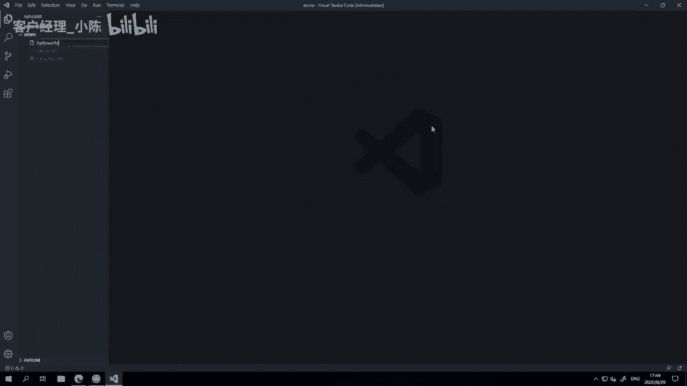

右键new fire，Hello world，点派，这个之前都讲过了，然后这字有点小，我把它放大一点，让它大家看的舒服一些，哎这些自动弹出来的，不管它把它给关掉，Print hello world。

好这个hello world点派，或者之前我们可能给它起名叫run点派，demo点pad的这个文件我就不去重复的运行它了，它的作用相信大家现在应该都已经很熟了。

就是在CMD里面打印出hello world啊。

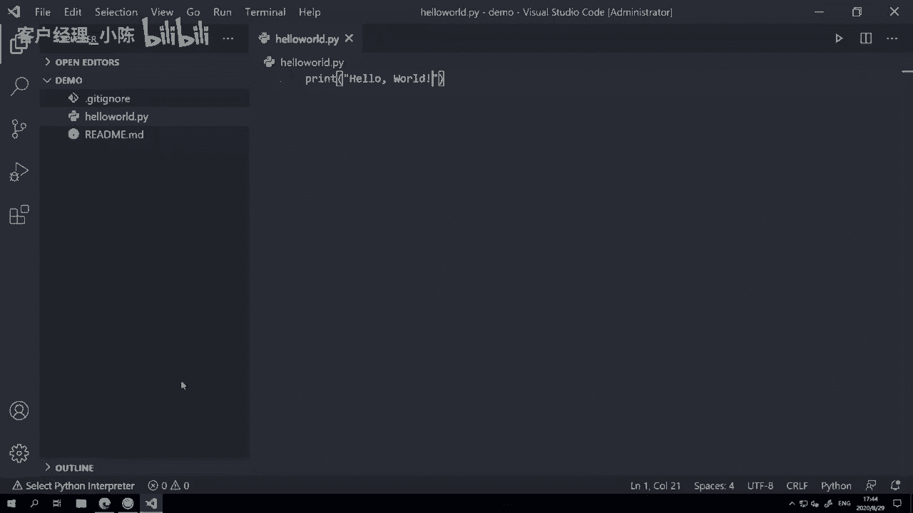

大家可以看到左侧出现了第一次的一个记录啊，这个记录在什么里面，changes就是这一次发生了什么修改啊，因为我们新建了一个文件叫hello world点派，同时呢在里面我们新加了这么一行代码。

那这个记录在这就已经有了啊，然后我们现在可以写一个啊，就是就就把这个记录叫做一次提交啊，我们把它添加到我们代码库里面啊，一般呢我们比如说第一次提交的时候，我们都会用ADD就添加新文件或添加新功能。

我们在前面用一个方括号啊，里面写个ADD，然后一个空格啊，这个创，然后后面就就就就接的是一个描述啊，就是你到底是你在干嘛啊，我这边就很简单啊，就就说一下创建hello word点派文件。

这个就很朴素的一个，就是描述你到底干了啥就行，如果有细节的内容，比如说你具体你做了哪些更细的事情，你可以在下面description里面啊，描述比较大段的文字内容啊，这边呢很简单，因为我就做了一件事嘛。

所以直接一个标题就够了，然后点这个commit to master啊，把他这一次的代码修改提交到我们的这个啊，那本地的仓库里面，然后右侧这个上面有一个这个按钮亮起来了。

它变成一个叫push origin，就是把你本地的代码推送到远端的服务器上去，点一下它，诶这个时候呢就会进行一个推送啊，他在把我本地的这个啊，已经提交过的代码修改。

记录给推到GITHUB的服务器上去来看啊，这边在啊推啊，要稍微过一会儿诶，这样就好了啊，变成一个叫feature origin的这个按钮就好了，这时候说明已经退完了。

那这时候我们回到GITHUB的网站上，摁一下这个刷新按钮，我们可以看到这里已经多了一个hello world点派啊，然后可以看到这里有一个修改记录，叫ADD创建hello dio p文件啊。

点进去的话呢，哦直接点进去啊，就可以看到我们这个这个这个文件里面，代码当然非常简单啊，这这只有一行，那我现在这个第一次啊，的代码提交或者代码修改我已经做好了，那这时候呢我们来看一看。

就是叫叫做一个记录更改的功能，怎怎么更改呢。

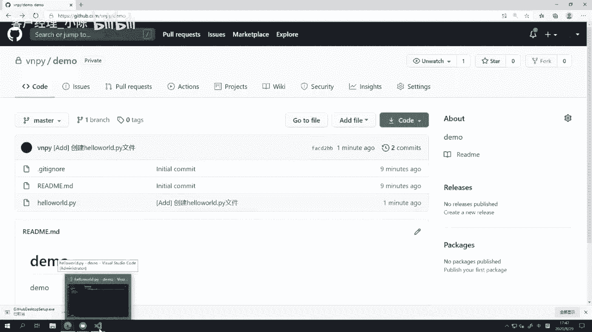

我们回到这个啊，我本地电脑上源代码里面，我就要这个多加一句话，hello world啊，hello world again啊，再次hello world啊，就多加这一个词，大家看到啊，就多加了一个空格。

一个again这个词，然后还修改完了之后，记得先保存啊，我随手就按了一个CTRLS保存，你不保存的话，git这边是不会识别到你的修改的，一定要保存一下，CTRLS保存一下，或者点file啊。

save保存一下才行。

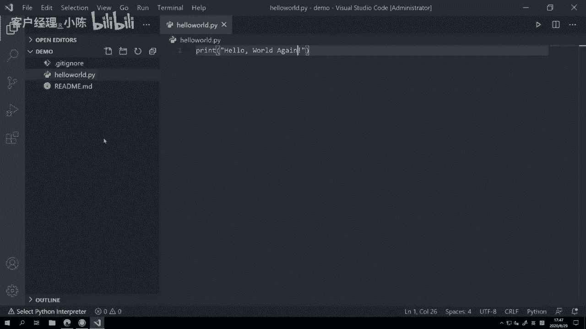

然后回到我们get it里面，大家可以看到这就有一个有趣的记录啊，啊还是这个hello world点派，然后呢这里有一行红的，有一行绿的，红的意思是这一行代码被删了，绿的意思是添加了新的这一行代码。

然后其中这个有一个比较深绿色，高亮的部分是你新添加的代码，相比较于之前的修改它的内容啊，就在这，然后大家可以看到诶，这个就是我们的修改记录了，我们再一次把它做一个这个commit提交啊，还一样。

不过这次呢因为我不是创建一个新的文件，我是修改一个文件，我给它起名叫mod啊，就是modification，英文里面的修改的意思，mod诶，这个修改代码啊，代码还有这个文字输出内容，反正描述一下就好。

这个描述你随便写，包括前面这个mod ADD等等啊，这个都不是说嗯强制的，你或者直接输入输这个修改文字内容也OK啊，当然出于一个比较好的，这种叫做代码仓库的管理习惯，我们推荐大家都养成好习惯诶。

添加新东西就是ADD，修改老的东西就叫mod啊，还有删掉某个文件的话，就是DEL啊，或者修复某个bug就叫fix啊，整体来说一般就是这四个前缀符啊，我们这边就是mt。

然后呢点commit to master啊，做一次提交，做一次推送，哎大家可以看到还是挺快的，因为我修改内容少，如果修改的代码多，它就会稍微要花点时间诶，这边推完之后，我再在网站页面上刷一下。

然后我们去看哈喽，我的点拍大家可以看到这里，首先已经变成hello world again啊，已经变成这个这个内容了，然后啊这个上面右侧有个按钮叫history，修改历史。

点它你可以看到这个单一这个文件，完整的一个历史，每一次你在呃GITHUB客户端里面点这个commit to master，就这个叫一次代码提交，每一次提交诶，你做了什么，这里都会有完整的记录。

所以即使比如说你写了啊这个一个月，两个月甚至一年一年5年的代码之后，回到其中历史上的某一天，只要你用了git，在那天做了什么修改，在这个整个GITHUB网站上面，你都可以详细的去看到。

这样呢就可以让我们去非常好的啊，尤其是我们后面再写一些比较大型项目的时候，就可以非常好的去做这个跟踪了，那这边呢我们就来回顾一下，我们今天这个学的啊，刚刚那个实操的内容就是提交第一份代码，第一步。

我们从远程服务器做了一个pull的操作啊，从服务器拉取最新的代码记录，这一步呢，其实大部分人可能就没没有太直观的感觉，因为我刚刚把那个就刚登录进去，他问我是不是要克隆一个目录到本地。

我选那个demo之后点了一下，确定那个操作就叫pro，他就把远端的代码修改给拉到本地来，或者有一些情况，可能你有多个电脑啊，你可能在公司里面电脑做了一些修改，也给提交到了服务器上，然后呢你回家之后。

你希望先把服务器上最新的代码给拉到本地来，此时点一下这个按钮叫fetch origin，意思呢就是把服务端的这个代，服务器上的那个代码给和本地给拉一份过来啊，这个大家可以看到，因为我两边是完全一样的。

它没有什么，如果你fetch完了之后，它确实有新的内容，它会变成一个pro啊，就是问你要不要把远端的这个，记录给拉到本地来，你点一下它就会把远端的记录同步过来，第二步呢就是edit哈，就在本地进行修改。

或比如说创建一个文件，我们刚刚第一步做的创建hello world，点派啊，第二步我们在里面修改了一行代码的内容，加了个again，这句话这些都叫edit，就是修改啊，你要用编辑器去改这个内容。

第三步叫commit，把我们修改的这些代码内容，提交到我们本地的一个git记录里面，这个git本地记录，它其实可以理解为一种特殊的数据库，他把你这次诶改了什么内容，我都给你记下来。

所以呢后面即使万一某一天，你把这个文件给删了，我回到那个点，我还能看到这个文件里面之前的内容，这样呢就避免了诶，万一我在管理代码过程中不小心做了一些修改，把我整个代码给破坏了的情况。

反正只要他就跟一个时光机一样，你可以随便回到时间里面，任何一个点去看曾经的记录，最后一步叫做push，把本地的记录推送到服务器上去保存啊，一般我们认为呢，就本地电脑还是不那么的安全啊。

最早最早就是git刚被发明出来的时候，大家都是把代码存在本地的啊，就是每次有什么修改之后，本地做一次那个commit提交就行了，那这样的话相当于本地有那个完整的记录，但是万一你本地的电脑坏了，硬盘坏了。

CPU坏了，突然一咖啡撒电脑上都有可能对吧，坏了之后是记录就没了，所以更安全的方法是，把它推到一个远端的服务器上去，比如这种GITHUB这样的免费的代码托管服务器啊，推上去之后。

那啊啊这个即使你的电脑坏了，你也可以去找一台新电脑，下一个github desktop登录上去，把远端的记录再给拉回来，你又可以继续去啊你的工作，所以呢这个就是一个非常方便的，用来管理我们代码的工具。

在后面啊，接下来的整个课程里面，我们在学的过程中，我们会陆续的啊一开始光是学简单语句，可能还感觉不到，后面开始写一些复合代码的时候，会越来越多的去用get it啊，就用把代码推到GITHUB上。

所以呢建议大家养成这么一个啊。

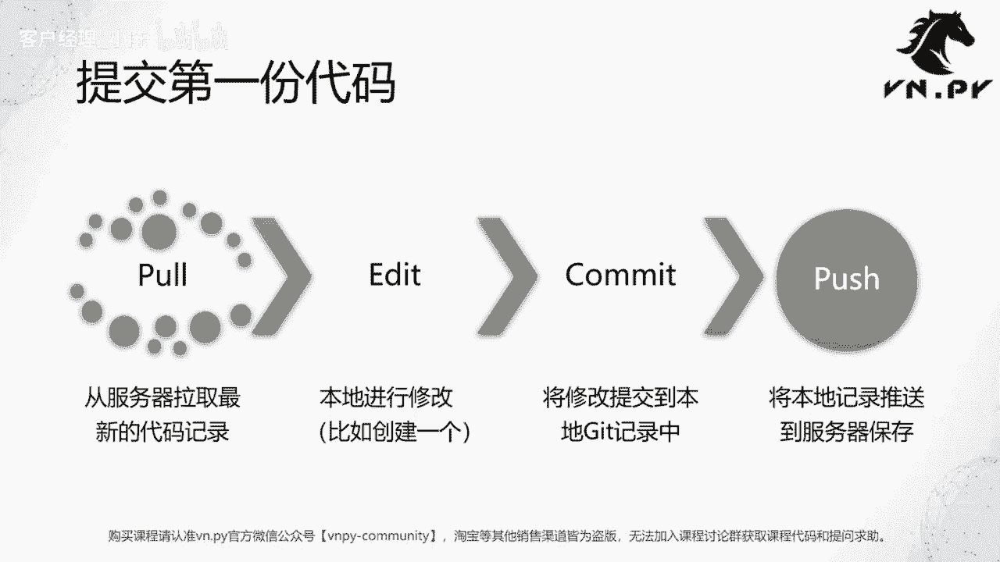

比较好的使用习惯，OK啊，那么我们这节的内容就到这了，更多精华内容，还是请扫码关注我们的社区公众号啊。

