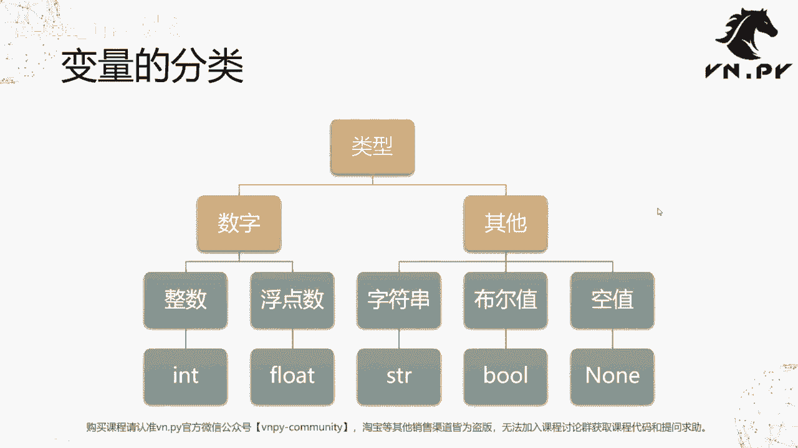
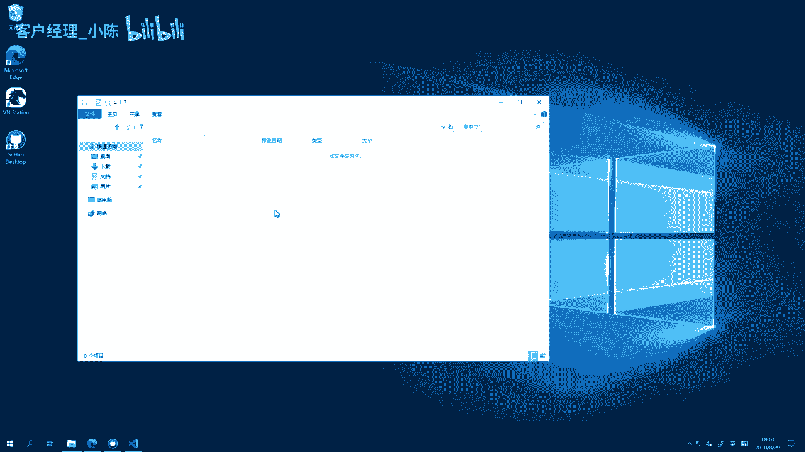
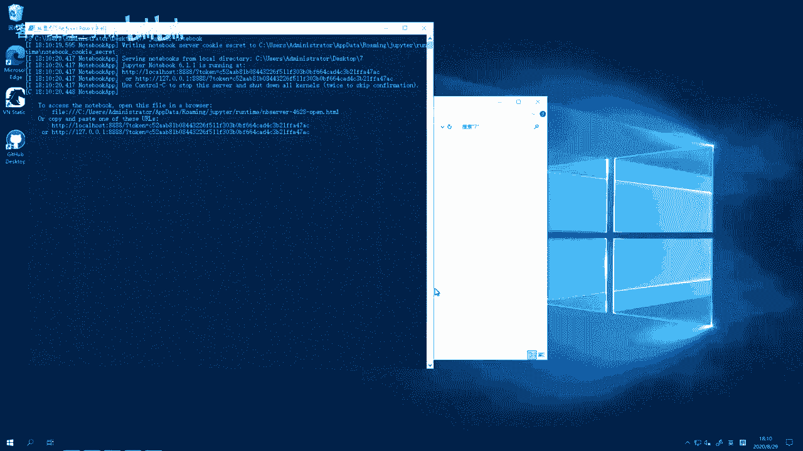
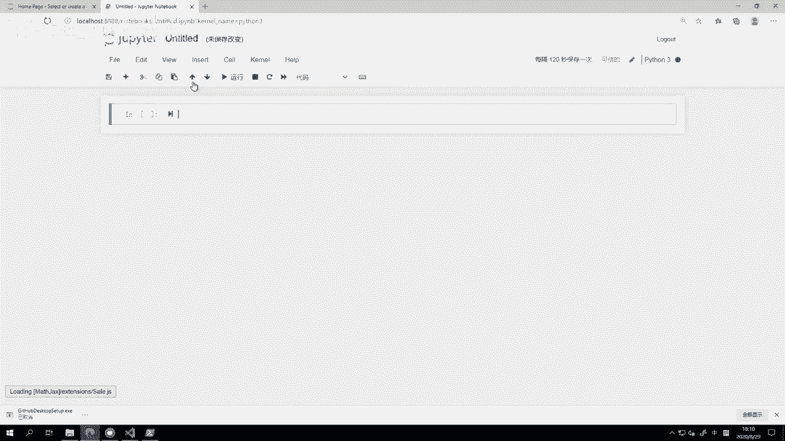
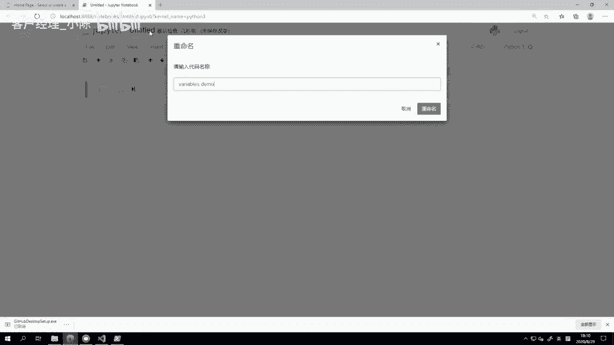
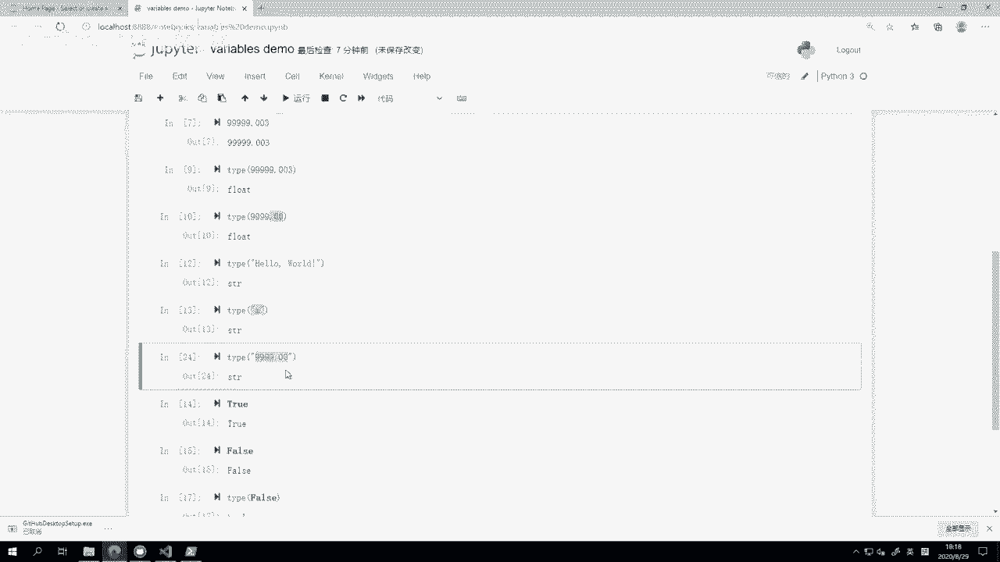
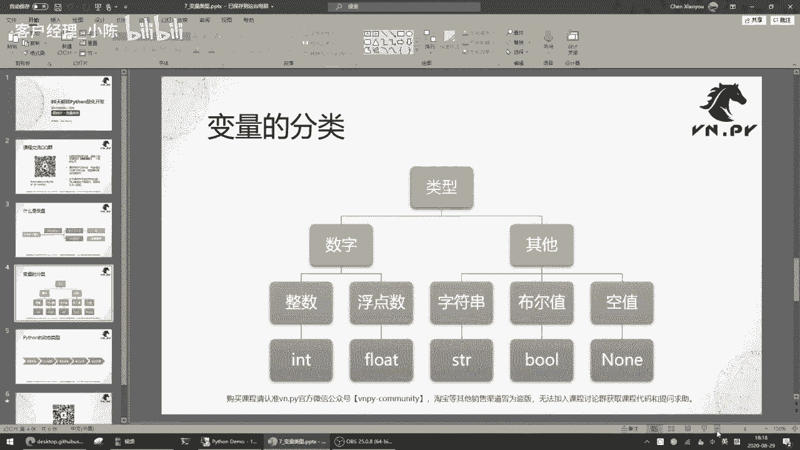
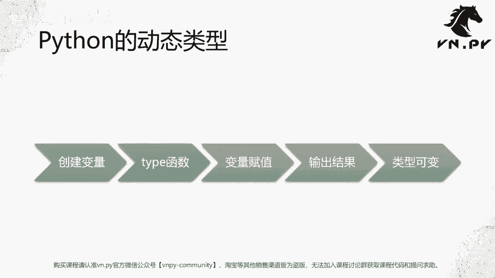

# VNPY30天解锁Python期货量化开发：课时07 – 变量类型 - P1 - 客户经理_小陈 - BV1eyH6eDErk

OK欢迎来到量化交易零基础入门系列，30天解锁Python量化开发课程，那么今天呢是我们的第七节课，在上一节课里面啊，我们学会了怎么样用GITHUB来管理我们的代码历史，那在这节课里面呢。

我们要回到Python编程本身，来学一学Python里面的变量类型，那这边还要再提一次我们的课程交流QQ群啊，在我们整个课程中，所有的代码内容都会通过QQ群文件分享啊，同时大家遇到的任何问题呢。

也可以通过QQ群来提问哈，我们每天都会有专人负责解答啊，这个大家可以用啊，手机QQ直接来扫描这个二维码，或者呢用啊电脑端的QQ来找这搜这个群号啊，都可以加进来，那加的时候注意一定要啊。

这个在验证信息里面填入你的微信昵称，不要填你的微信号啊，这个再强调一遍，OK那么好，接下来我们就开始来看一看啊，第一个问题叫什么是变量变量呢，是这个啊，因为编程语言算是一种舶来物嘛。

这最早是这个欧美才有的，后来传到我们国内，那变量这个词在这里哈，它稍微借鉴了一点英文的意思，因为里面变量这个词叫做variables啊，或者翻译成中文的话，就是一个可变的量啊，或者可变的数量。

但数量这个词本身的描述可能不一定准确啊，因为它容易让我们去把这个东西和数字绑定上，但其实很多时候它可能不只是一种数字，它也可以是啊一句话或者几个文字啊，或者甚至于只是一种表示状态啊。

真或者假的这种啊一种状态，那么在这儿我们举了几个例子啊，就两个例子，第一个叫做Y等于X加三，这个只要学过初中数学的，应该都能懂一元一次方程对吧，这个啊其中这个啊X是啊，当然可能这这个内容就要到高中了。

就涉及到函数X是自变量，Y呢是应变的啊，X自己发生变化的时候会引起Y的变化，那么举个例子，如果这个Y是五的话，那么求一下X是多少啊，这个稍微用点高中，而不是初中的这个这个解解方程的知识，就就能解出来。

五代进去啊，三移过来X等于二嘛啊，第二个叫做唉这个例子可能更像字符串啊，就是X叉叉，您好啊，这里叉叉可以是指代某一个人的名字，或者他的一个称谓，比如说哎我们这边取了个名字，小明您好啊。

哈小明最常用的名字嘛，那所以这个时候啊在这个例子里面，叉叉就是这个小名，所以大家可以看到第一个变量可以是数字，第二个变量有的时候呢也可以是一种字符串啊，当然它还有更多不同的形式。

说白了它是一个代表福或者呢一种嗯，有点类似于我们的这个啊函数里面的，所谓的这些哎这个这个未知数的概念啊，他的意思就是我们用一个特殊的字母，或者特殊的一个名字去指的，替代那个背后的数据本身，那么在这啊。

我们可以看一下Python里面的变量分类啊，整体上主要分为这么五种啊，首先我们把它类型上我们分成两大类，一类叫数字，一类是其他数字以外的啊，都叫其他数字呢可以分为整数啊，就是这个所谓的int类型。

对应的英文是integer哈，这是int类型，这个叫做整数，还有一个呢就是浮点数float类型，什么叫浮点数啊，就是所有带小数点的都叫浮点数啊，注意这里数字不管你是正的还是负的啊。

他们都是比如只要正的或者负的，这个不带小数点的，都叫整数，正的负的带小数点的都叫浮点数啊，这个是它们之间的一个区别，浮点数的英文是float啊。

注意这里int float都是他们在Python语言里面的，这个啊类型的名字，等会我们来在代码里面看啊，我们先把这个概念讲完，而其他里面一共有三种啊，第一种叫字符串string啊。

它的string就是英文里面这个呃，一句话或者一堆字的意思啊，他的这个缩写就STR啊，意思呢就是这种文字组成的这种字符串，然后第二个是这个布尔值啊，布尔值这个这个名字有点怪怪的，你感觉不像中文。

确实他是从布尔啊，布尔是英文里面的这个呃，这个这个布尔值的这么一个啊类型名字哈，他的意思呢就是要么为真，要么为甲，或者呢一个是零，一个是一啊，这个他这种类型叫做布尔值。

一定程度上它也是我们所有计算机最底层的啊，CPU层面它的这个这个这个运作的基础吧，就是所谓的这个二进制啊，要么是零，要么是一没有这个十进制的那么多数字，要么是零，要么是一，就两个状态，最后一个啊。

这个数据类型叫做none啊，空值空值的意思呢就是什么都没有，只要不是前面的这四个，也不是其他的什么类型，就是这个数据压根就是个空的，它就叫空值啊，N，那么这个时候我们就回到这个这个来。

稍微看一下代码啊，这里我创建一个新的目录七，稍微大家可以跟着我一起操作啊，复习一下在之前我们学JP的时候的内容，怎么打开JUPAT，在当前目录按住shift键。

点鼠标右键在此处打开power shell窗口，然后呢输入jupiter notebook来启动，好这边他会问我要用哪个传件来打开这个文件，那我这选的是edge，同时呢我把这个始终用词运用。

打开HTML文件给勾上。

点确定啊，那么这就可以打开了，然后我们先来创建第一个我们的Python笔记本啊，创建一个python3的笔记本，名字呢我就简单一点啊。

就给它起名叫variables，variable demo啊。

学习一下变量好在这我们先开始看数字啊，第一个就是这个所谓的浮额，这个这个整数，比如说一是一个整数，比如说一这个100也是一个整数，还有比如说这个什么9999999啊，一堆数字也是一个整数。

那么怎么看这个数字是不是整数呢，我们可以用到Python里面的一个函数啊，当然在现在这节课，我们还没有讲到函数这个概念，但不妨大家可以先试着去用一用它，你输入这个type括号。

然后把你想要去知道它这个类型的，那个数据给输进去，不管你输什么，输字符串也好，输入这个数字也好啊，随便你输入什么，他都可以给你把对应的，它的数据类型给显示出来，我这就来个type1回车啊。

大家可以看到是一个叫做int的类型啊，然后同时如果我在Python里面用int括号啊，创建一个新的就是全新的空的整数出来，大家可以看看是怎么样的结果，它会返回一个值叫做零啊，就是我创建一个空的整数。

空的整数呢在Python里面就是一个零好，那么第二步我们来看一下所谓的这个啊，这个这个浮点数，那比如说啊还是跟上面类似的1。123，这就是一个浮点数了，然后呢或者说哎这个大一点的，哪怕99999。00。

只要它后面有这个小数点，它都是浮点数啊，我们可以来看一下float，99999。003，哎这哎不好意思啊，这个输错了不是float啊，应该输入个type好看它类型吧。

大家可以看到这是一个float类型啊，首先只要有小数点，它就是一个这个浮点数，那有人可能会问啊，如果是一个这个99999。00这种的，就是它后面啊带了一个小数点跟两个零，如果从数学上看。

它就是一个就999的整数，但是在编程语言里面，这里其实不管是Python还是其他的编程编，我运行一下，大家可以看到这个数据类型，它还是浮点数类型啊，所以这这个编程语言里面在看某个数字。

它是整数还是浮点数的时候，其实并不看说诶你小数点后是不是正好为零啊，你为零就是整数没这个概念，只要有小数点就是浮点数，只要没有小数点，它就是一个整数啊，就是所谓的int类型和float类型。

这是两个数字相关的类型，第三个啊，我们刚刚讲到的类型是什么字符串啊，比如我输入之前最早给大家举例子的时候，Print hello，这里的hello world就是一个字符串啊。

我们同样对它取一个STR呃，这个取一个type来看一下，用TYP函数，然后中间呢这个函数里面，我这次传进去的不再是啊，就括号里面的内容，一般我们管它叫做传到函数里面的参数，或者叫做传进去的内容。

我们可以看到这里我传进去的内容，不再是前面啊，tab的时候传进去的是数字，而是变成我这边传了一个诶字符串进去，那这样我试一下结果是什么，shift回车运行，大家可以看到诶这是个string类型好。

那么string类型一个这个hello world，我们可以看到有这么多个字，它是一个string类型，如果只有一个字呢，啊我们可以看一下，它还是一个string类型，在Python里面只要是字符串。

不管你是一个字两个字啊，甚至这个几10万个字，它都是一个类型，就叫string类型好，然后第二呃那个另外一个就是非数字的类型，叫做布尔值类型，布尔值类型一个这两个一个叫true啊，一个叫false啊。

我们只是分别对它们取个book，可以看一下type true啊，等于不好，type false也等于BO啊，就这两个就布尔值只有啊，false和true这两个类型什么意思呢，它分别代表的是一个叫真。

一个叫假啊，这是一个逻辑学上的概念，真就是诶这件事是符合的啊，就叫真假呢，就叫这件事不符合，或者说他是不对的啊，就是这个判断条件不成立啊，他就是一个假，所以布尔值一共就大，要么是真，要么是假。

不像数字啊，数字是有无限格的，字符串也是有无限格的，但布尔值永远只有两个，一个叫真，一个叫假好，最后一个类型更少一点，布尔值还有两个类型，还还有两个额，布尔值类型还有两个值。

那空值类型只有一个值叫做none啊，就是这个大家注意啊，布尔值的秋false，还有我们这边NN首字母都是大写的啊，你不要输小写啊啊你这个none我们先来看一下，就none这个类型回车哎。

你看到什么输出都没有，不像之前我哪怕是一个TRU，我shift回车，他还输出一个TRUNA，我要是个none的话，他压根什么都不输出，我要按shift回车，大家看到这下面没有out的啊。

因为他是一个空的类型，不会有输出的，我们这时候来个type看看A它是什么类型，可以看到他的名字叫non type啊，他自己本身就是一个空值类型，然后呢哎我们试一试啊，输小写会怎么样，小写会有个报错。

叫做name none is not defined，就是在Python里面啊，这个布尔值的真假就true false，以及这个啊空值的NN，它们都是首字母大写的啊，这点不要搞错。

因为不同的编程语言不是不一样，你从比如说像C加加那种哈，它都是用小写来表示的，像vb这种语言，它大小写不分的啊，这些和Python都不一样，Python是首先分大小写。

其次这个true false now3个数值类型，首字母都是大写的，然后要注意他们外面也没有字符串啊，也没有这个引号啊，你不要加个引号上去啊，没有引号的，所有字符串的东西都要加引号啊。

这边呢我们也再看一个例子，比如说我是一个type字符串啊，用引号把它括起来，9999。00，我是个数字，但是呢我在外面加了一个引号，把它变成字符串，我看它的类型是什么啊。

大家可以看到这个类型还是一个字符串，所有放在引号里面的内容，不管你是数字也好，还是这个也字母也好，还是甚至中文也好，甚至你搞个什么希腊文，阿拉伯文也好，它们都是字符串啊。

那整体上这个就是五种Python里面基础的数据类型。

或者呢你也可以把它叫做变量的分类啊，因为这些值都是一种变量，那下面啊也是我们今天最后内容，我们来看一看Python，之前不知道大家还记不记得，就Python是一种动态语言。

我们来看一看Python所谓的这个动态语言啊，是什么意思啊，他的意思呢是叫做Python语言里面的这些变量，它都是所谓动态类型的啊，怎么个意思呢，我们回到代码里面来看一下啊，再往下，比如我创建个A啊。

之前这些都是数据本身啊，这个这些一一百999什么都是数据本身，这次我第一次用一个啊，这个字母来代表一个数据，就有点像是我们那个Y等于X加三，里面X代表的其实是一个哎，你可以输进去的值X等于一的话啊。

13Y就等于四，X等于二的话，23和Y就等于五啊，所以这里这个A的效果类似于哈，我们之前公式里面X，那在这我A先把它指派一个类型叫做一啊，我就直接输入个A等于一啊，什么意思呢，就创建一个叫A的变量。

然后这个变量值多少，它是一个整数的一啊，如果你A等于1。0，它就是个浮点数1。0，或者你是一个字符串啊，哈哈他就是一个字符串哈哈的内容，我们这边先把A绑定到一个一上面，然后我们用之前的操作type a。

我们来看A这个数据它的类型是什么，或者A这个变量它的类型是什么啊，我们可以看到它是int类型，就是这个整数类型，然后在其他的一些编程语言里面，比如C加加里面，A如果你在最初把它定义为了一个整数。

那下面一步你是没法做的啊，就是你看我们Python这边可以做一件这样的事情，A等于哈哈，我再把A重新定义成一个字符串，它类型呢是哈哈，然后type a我们再看看A的类型，A的类型又变成了一个字符串。

所以呢在Python语言里面，某一个变量的类型是允许改变的，它可以一开始是一个啊，这个整数可以一开始是个浮点数，后面呢又变成一个字符串，又变成一个布尔值，又变成一个none啊，都可以。

那么在Python语言里面，这些类型是允许你在啊就是代码运行的过程中，其实只要你对于某一个变量赋一个新的值，所谓的赋值就是通过这个等号啊，把一个新的数值给绑定到这个变量上，这个数值可以是一个数字本身。

也可以是一个字符串或者是布尔值，或者是none空值啊，只要你这么绑完了，那这个变量就变成了对应的这个值的类型，所以在这我们可以看到诶，这个我们先是创建一个变量A，然后呢我们看了一下这个A等于一嘛。

tape函数它是一个int，然后我们又对他复制了一个字符串哈哈，然后这个时候又看了一下输出结果类型啊，它不再是这个整数类型，反而变成字符串，所以呢在Python里面这种类型是可变的。

现在啊可能只是一个最简单的demo，就是给你看到这个啊，就是他的这个类型可变，这么一个一个一个这个现实的情况，但你在这儿可能很难去理解诶，他这个动态类型或者说类型可变，对我写代码，对我后面去做。

比如说量化策略研究有什么额外的帮助，或者对比C级加的话有什么额外的优势啊，其实主要的优势就在于更加的灵活，比如说你用了一个地方的名字，你在别的地方还可以把它诶，再用复制成新的类型的数据，而不用呢啊。

有的时候可能受限于语言本身的限制，诶一开始定义为整形的这么一个变量，你没有办法整数类型的变量，没有办法再往上去放一个字符串啊，Python里面都不存在这种问题，所以写代码的时候会非常快，非常灵活。

OK那么哈以上呢就是我们这一节课的内容了，更多精华内容，还是请扫码关注我们的社区公众号。