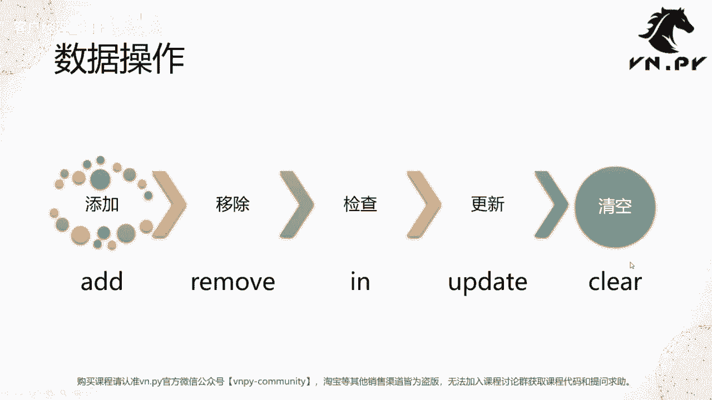
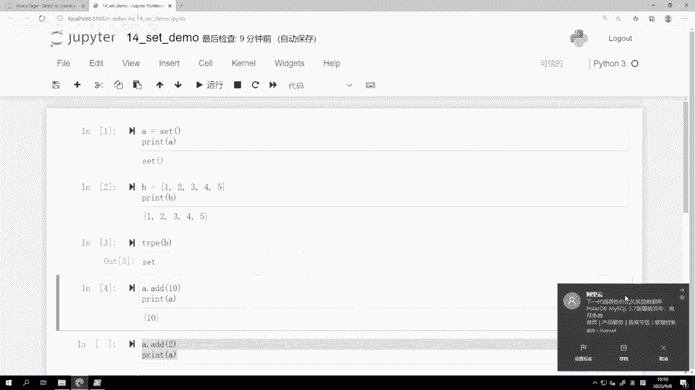
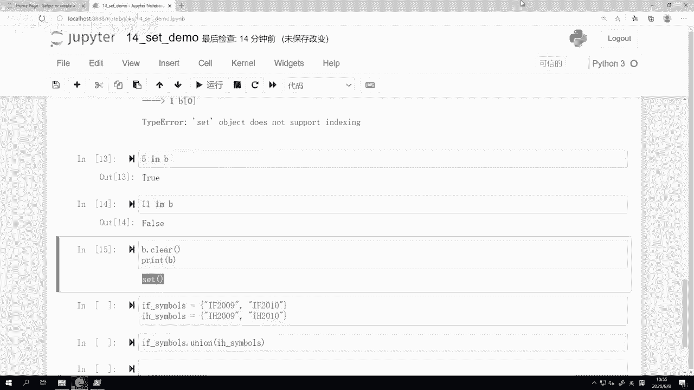
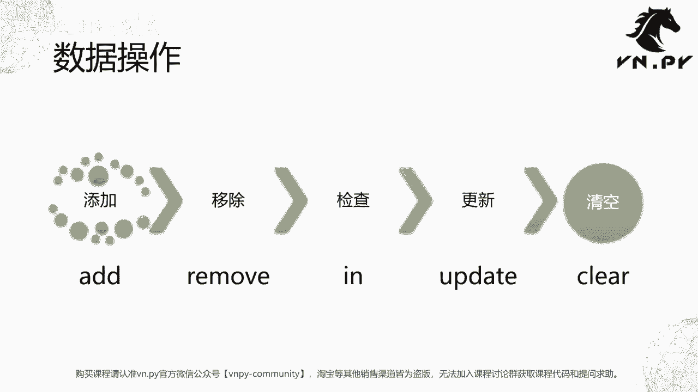
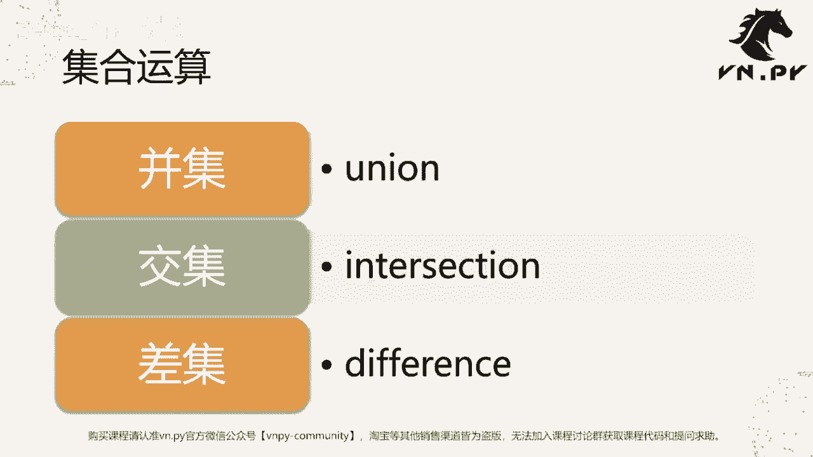
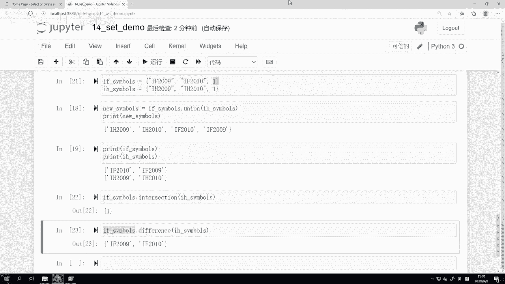

# VNPY30天解锁Python期货量化开发：课时14 - 无序集合 - P1 - 客户经理_小陈 - BV1R7HUe3E7M

OK欢迎来到量化交易零基础入门系列，30天解锁Python量化开发课程，那么今天呢是我们的第14节课了，在上一节课里面啊，我们花了差不多40分钟的时间来学习的，这个强大的字典啊，那么这一集里面呢。

我们要来相对学习一个比较轻量级的数据容器，叫做无序的集合，那么集合的特点啊，我们这边啊，首先呢集合是来源于数学里面的一个概念，它在英文上叫做set啊，那么两个点，第一集合是一个无序的数据容器。

它不像我们之前的列表啊，在你插入数据的时候是按照一个顺序插进去的，所以后面访问数据的时候，也会按照这个数顺序去访问集合，不同集合里面数据是没有顺序的，第二个点叫做集合里面的数据是不能重复的。

比如说列表里面我们之前有看过同样一个数字，一，我可以在列表里面插入多份，但是对于集合来说，一在这个就同样的内容，不管是这个12345啊，还是一些浮点数，还是一些字符串。

同样东西在这个集合里面都只能存在一份啊，所以集合呢在实践里面，经常被用来做一个去重的处理。

所以在这呢我们就还是打开我们的JUPITER啊，来看一看我们今天的这个第一步，创建一个集合，那集合的创建同样有两种方法，第一种方法就直接用集合的这个类名，加一个括号的创建，就是这个啊方法我们可以这样创。

建完了之后打印一下，我们可以看到A是一个空的几何，然后第二种创建方法，这个有一点像我们创建字典的方法，但是不要弄混了，创建字典的时候啊，这个也是外面是一个大括号，但是里面的每个元素。

这里是比如说有IF2009冒号，就每一个元素前面有一个通过冒号，分隔了键和值的概念的，而在创建集合的时候，每一个逗号前面的内容就是一个数据啊，就是一个就单一的数据，它没有这个冒号分隔的情况。

所以此时呢用大括号创建出来的，这个B就是一个集合，反过来你如果加上这个键值啊，加通过冒号来分割键值，把它都给加上的话，它就变成了一个字典啊，这是一个同一个括号，用来创建两种不同数据结构的区别。

这边我们打一下这个A这个B啊，我们可以看到结果是这样，12345啊，那么就是显示的外面是个大括号，但这样你可能看不清楚，所以我们再运行一下type，比我们看下B这个啊，数据对象的这个类型是什么好。

我们可以看到它是一个集合，set好。

那么创建做好了之后，下一步我们要做的就是围绕这个集合啊去做，因为数据容器嘛，对它的里边的数据做一些数据操作，整体上的顺序呢跟之前也都一样，还是从这个增啊，可能有点类似于数据库的操作，叫增删改查啊。

那当然我们这边更多的，第一步添加一个数据进去，第二步啊，添加用的是函数，这个函数方法叫ADD移除，用的是remove检查，这个不是用函数方法，这个用的是我们Python里面那个关键字in啊。

跟那个就是判断某一个键，在不在一个字典里面的那个关键字是一样的啊，然后这个更新就是update，最后呢还有一个函数叫做一把头，把这个集合，如果你用完了，这个里面数据都不要了的话。

你可以用clear1把头把它给清空掉啊。

我们这边呢也同样来看一下代码里面的例子，刚刚我们创建A集合是个空的对吧，我们这边呢就按照这个一个一个顺序啊，然后来重新添加一下，这里呢我们添加的时候啊，我们先按照就还是添加整数，这个比较简单。

但是呢我们不按照啊，这个从1~5，这样就是12345，从小到大来添加，我们乱序添加，我们先来加个十啊，添加完了之后，我们看一下结果是什么，A同样显示变成了和B类似的，但其中只有一个元素。

就是我们的这个十这个数字，然后第二步我们再来做一个添加啊。

那么此时呢我们就添加一个二进去，我们可以让他看到，这个时候添加进去的，这个就变成了这个十和二这么一个顺序啊，然后第三步我们还可以再添加一个，比如说啊添加一个五进去啊，又变成十二五。

所以每次你要往里面加一个元素的时候，就都按照这个一个一个一个的方式，往里面添加就好啊，然后第二个我们要尝试的方法就是remove，删掉其中的某个元素，也很简单，比如说现在十这个数字我不需要了。

就直接掉A点，remove把它给删掉，然后呢我们print下A，我们可以看到里面还剩二和五啊，这个，额之前十的数值都没了，那如果此时哎我把它给移上去啊，因为刚刚分成两行，十，已经不在集合里面了。

我再次去remove的话会怎么样，他会报一个key error kerror，对上节课呃的内容，我不知道同学们还有没有印象，我们当时试着在字典里面去访问一个不存在的，key或者不存在的键的时候。

也触发了这个key erroll啊，说白了就是你要访问那个内容，在数据集合里面是不存在的啊，那么对于这个字典和集合，他都会报KEERO啊，字典报我们能理解吗，因为它有key和value集合。

为什么也会报呢，因为集合在C语言层面，它的实现同样也是一个哈希表，和我们那个字典是高度接近的，只不过集合为了啊就集合被设计出来，它背后都是哈希表，但是它在功能上更多是为了，针对我们数学里面的。

这个叫做集合运算的概念啊，所以他的这些函数设计，和那个字典是不一样的啊，所以在这边呢它有比如说ADD有remove这些函数，而这些字典是没有的啊，然后下面一个操作就是一个叫做update的操作啊。

那么B的集合我们可以看，回头回过来看一下12345啊，从1~5这堆数字，然后呢我们希望像字典一样往里面去添加啊，额外去添加一堆新的数据进去，我们要添加的就是一个，6789十的这么一个集合，注意这个集合。

我们没有把它直接绑定到某个变量上，而是直接在这个啊，就把它作为参数传到这个update函数里面去了，更新完了之后呢，我们来打印一下现在新的B的值是多少，好，我们可以看到变成123456789十了啊。

这就所有的数据都有，然后对于集合来说，我们同样也可以对它做一个循环的操作，就是for循环，For i in b print i，其实效果你可以想象有点类似于啊，那个我们在遍历字典的时候，只便利它的键啊。

for i如果呃是一个字典的话，可能是for i in c点kiss啊，然后平台I那么其实效果跟这里是类似的，就一个个打印123456789十啊，然后第四下面一个操作呢，我们来试着说诶。

可能你在这儿觉得他怎么感觉跟列表很像啊，只不过不重复嘛，我们试着来像列表一样，通过下标的方式来访问某个数据啊，就返回第一个位置的数据好了，方括号里面一个零，此时会触发一个跑错。

就是叫type error，Set object does not support indexing，什么意思，集合这个数据结构是不支持切片访问的，它不支持下标啊，通过这个下标。

比如012345来访问啊，你只能通过for循环的方式来这个便利其中数据，或者呢还有一个选择，你可以通过in这个语法来判断某个东西，在集合里面是否存在，比如说我可以判断win比哎true。

那如果我在下面加一个11in b false，这个就就主要其实他用的一个场景，就是这样判断一个东西，在某个集合里面是否存在啊，这个在的话我做什么操作，不在的话我做什么操作啊。

所以啊这个呢是就是集合的一个，可能你塞完数据之后，主要用它的时候的用法，就是判断他在不在里面啊，当然用完了之后，最后你还可以操作，就是clear好，把它给一把都清空掉，然后打印下B啊。

我们这样可以看到be clear完了之后，就彻底变成一个空的集合，空的集合的显示呢又变成一个set括号了，而不是通过那个大括号的方式直接显示，那个方式直接显示的话，它其实是字典的意思啊。

所以这是一个啊要注意的区别吧，就是有的时候集合你乍一看的话，挺容易跟字典搞混了哈哈，因为他都是用大括号来去这个初始化的嘛，但是这里要注意一下啊，当它为空的时候，显示的直接就是一个set啊。

跟一个括号这样的数据结构，那么这样呢。

我们就把集合内部的五个主要的数据操作，都给讲完了，如果你只是为了把集合当做一个去重的工具哈，就说白了你可能啊举个例子啊，每次收到一个委托回报，我就把这个委托回报的委托号，给添加到一个委托号的集合里面去。

这样我知道我这个单子呃，这个这个策略之前下过哪些委托嘛，每一个委托都有一个不重复的委托号啊，所以这样我就可以很方便的，后面去做一些撤单啊，做一些跟踪操作，那么这么一个情况，我们知道同样一个委托。

我下单的时候会收到一次推送，撤单的时候会收到一次推送，有部分成交的时候收到一次推送，全部成交时又收到一次推送啊，如果是用列表来缓存数据的话，那往里面每次推送我都往里面添加一个委托号，会导致什么情况。

就同样一个委托号，它会存在多份啊，所以这样我在撤单的时候就会重复撤单，那重复撤单的话，柜台是有可能把我们给踢掉，或者把我们给啊，这个这个标识为异常草，异常交易啊，后面把我们给禁掉的。

所以这种操作是很危险的啊，那么在这个时候，我们就需要一个叫做去重处理的概念，我是希望把每一个委托的委托号都给记录下来，但是对于每个每个委托哈，我只希望记录一份，所以此时呢用集合来做这个缓存操作。

就比较合适了。

那么下面我们要讲的呢，就是这个围绕着集合的运算啊，这个可能更多就回到数学上的概念了，数学上的集合呢有三个并集，交集和差集，并集叫union，交集叫intersection。

差几呢叫difference啊，在这儿呢我们也来看一下，其实都非常容易理解，首先我们定义了两个机构和一个叫FSYMBOS，一个叫HSYMBOS啊，分别对应的是F的合约代码和H的合约代码。

然后我们调用这个union来求一个并集，什么叫并集，把两个集合加起来啊，就叫并集返回，结果大家可以看到哎，直接是一个新的几何，那我们可以这样啊，叫new symbols，等于他们俩加起来。

然后print new symbo，然后在这我们可以看到new cmos这个集合，就这个union函数运算完还返回了一个新的集合啊，就这个new cmos集合，那这个操作你可能会说。

他怎么看着和之前的这个update操作有点像呢，这里两个是不一样的啊，你我们这里union完了之后，我们再print这个IFCMOS，再print edge cmos，我们可以看到这两个集合本身。

还是它原来的样子，而这个union是把它们两个相加的结果，给返回了出来，产生了一个新的集合，反过来，如果你用这个I'VESYMBOS点update h symbols，那如果这样操作完了之后。

他会把这个i h symbols，里面的数据给添加到FSYMBOS，这个数据集合里去，而不会生成一个新的结果出来，所以这样的话呢在我们现在这个角度，它就相当于做错了啊。

因为我们这边是在做一个集合的计算操作，然后，下面呢我们来看一下这个叫做交集的操作，交集的操作呢啊，就是求如果一个元素既存在于第一个集合里面，又存在于第二个集合里面，那它它就是啊。

就返回一个这样的一个新的几何交集啊，但是在这儿我们可以啊，其实可以看到啊，就是这边因为f h j r simple，这两个集合里面没有重复的元素，所以我们可以试一下英特尔啊。

section这个h symbols啊，我们这样运行完之后呢，他直接返回一个空集合，因为两个里面都没有这个共同存在数据，我这边试着加一下哦，我加个一啊，然后呢再来运行一下，我们可以看到它返回了。

就是这个一好，最后还有一个操作，就是求他们两个之间的差值啊，就是这个差几，什么意思，就是看某一个这个i f symbol，里面的这个元素，如果它不位于i h symbol里面的话，就返回啊。

这个有点不一样了，前面的之前求和啊，求呃，求求求并集和求这个交集，都是两个集合里面的元素拿来比，而这边呢不一样了，我是看IF里面的元素在不在IH里面，如果不在的话，就把它给返回出来一个新集合啊。

而不是看H里面元素在不在F里面啊，如果也不在的话，再把加点，不是这样的，这个有一个先后顺序了，I前面这个里面的元素不在，后面这个参数集合里面的，我才把它返回出来，反过来是不返回的，这个叫差几的概念好。

所以这三个是嗯，就是集合在数学上的一个运算概念，啊那么当然这块的概念呢，可能现在我们这这么乍一讲啊，感觉不到有什么用，所以后面也是一样啊，我们这个课程反而是分段讲的，先把一些基础概念教给大家。

可能有一定的啊，这个这个概念就有一定的基础的准备了哈，我们回过去去看一看VN点派内部的代码，看这些啊，不同的编程的方法或者Python的语言特性，还在实现一个具体的。

van der派内部的交易功能的时候啊，他是怎么样起到作用的啊。

OK那么这节课的内容呢就先到这里啊，更多精华内容，还是请扫码关注我们的社区公众号。