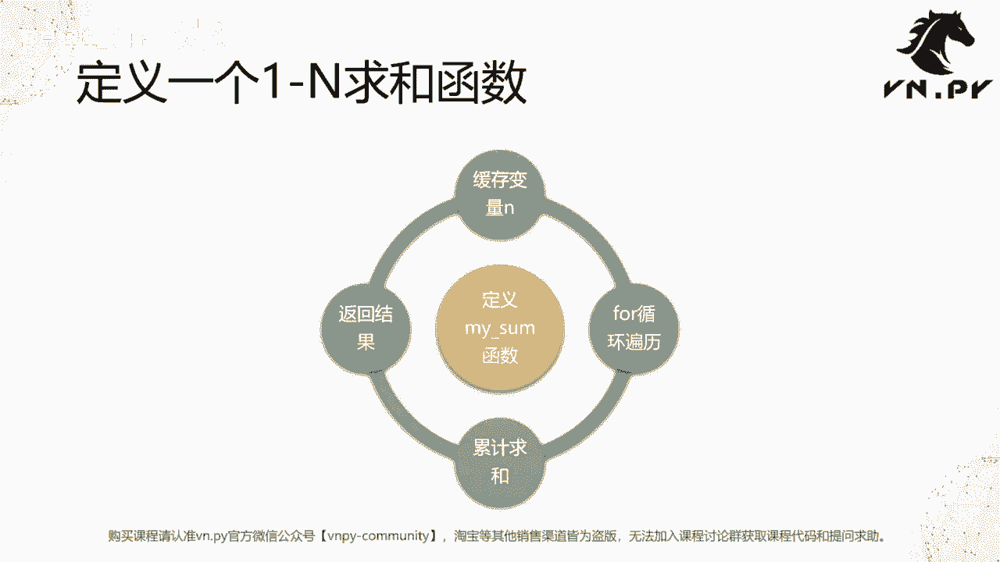
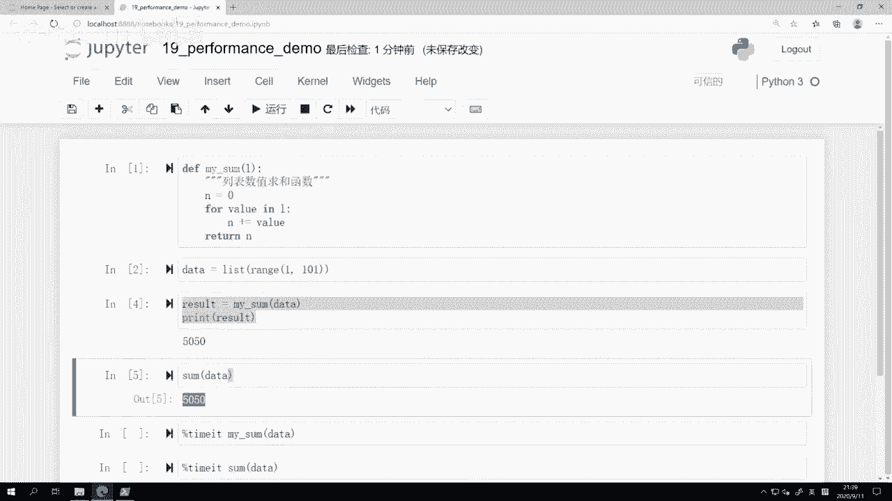
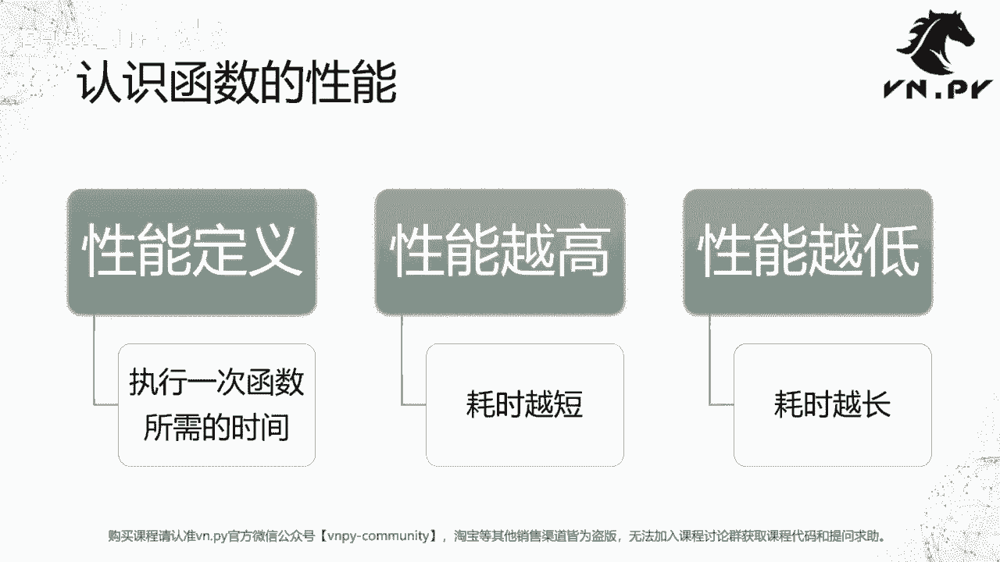
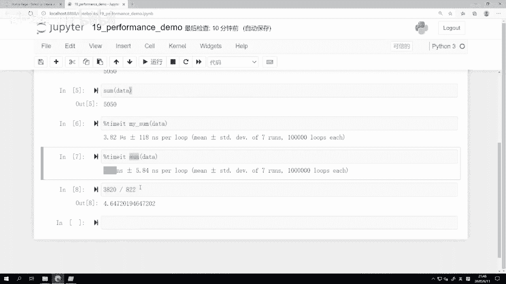
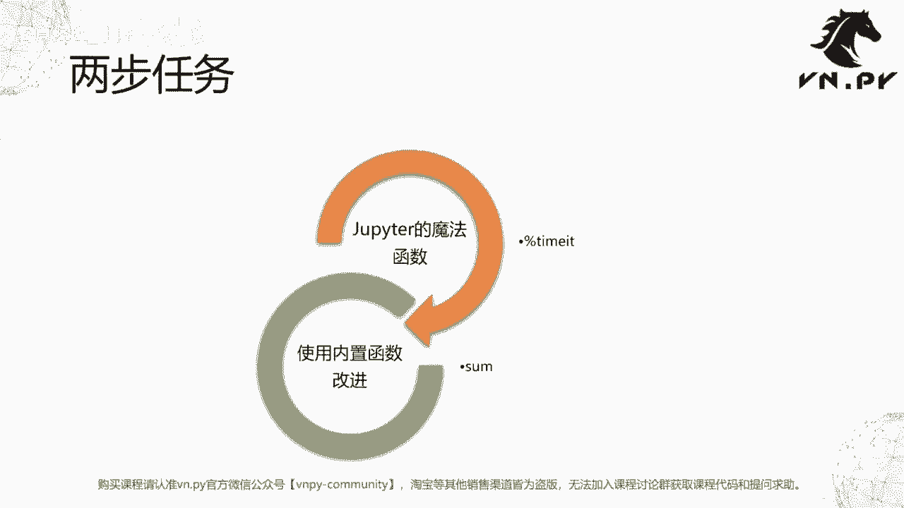

# VNPY30天解锁Python期货量化开发：课时19 - 函数性能测试 - P1 - 客户经理_小陈 - BV1BU411S7to

OK欢迎来到量化交易零基础入门系列，30天解锁Python量化开发课程，那么今天呢是我们的第19节课了，在上一节课里面啊，我们已经掌握了这个，怎么样在Python里面自己去定义一个函数啊。

以及怎么样去支持多个参数以及多个返回值，那么在这节课里面呢，我们要来讲一讲函数的性能问题，那在这里啊我们来试着定义一个起到的作用呢，叫做一到N的求和函数啊，或者说是对一个列表的求和函数，那么在这里呢。

我们接下来要做的事情，叫做定义一个my sum函数，那么在这个my sum函数呢里面呢，它传入的参数是一个列表啊，然后我们在计算的过程中呢，首先要创建一个缓存变量N对吧，它用来缓存每一步我们求和的值。

然后我们用一个for循环，去便利那个传进来数字列表啊，然后我们把每一个这个for循环，数字列表里面的值都加到N上面去，最终循环完了啊，这样求和就求完了嘛，我们就把结果给返回回来，那么这个操作。

其实在我们刚开始讲for循环的时候，当时举的一个例子，就怎么样把这个数额1~100的数字求和啊，这个原理是高度类似的，只不过呢我们进一步把它封装成一个函数，让它用起来呢更加方便一些。

那我们这里呢就啊，这个同样打开了一个新的JUPITER啊，叫做performance，demo performance就是英文里面性能的意思啊，一般我们讲到这个，比如说某个啊程序的性能函数的性能的时候。

它一般都是叫所谓的performance啊，你可能想要在网上搜一下，比如说这个C加加语言和Python语言的性能区别，那如果你用啊这个英文去搜的话，比如你用ban直接搜索引擎去搜的话。

那就C级加Python performance，comparison啊，这个性能比较等等啊，所以performance这个词是一个很常用的啊，专有名词，那啊在这呢。

我们先来定义的一个叫做my sum的函数啊，有跟上节课的my abs类似的，my sum函数里面唯一接受的一个参数是一个L，这个L呢我们知道是在Python语言里面啊，经常对于某些这个常用的数据结构。

我们可以举它第一个字作为缩写，那这里L就是list啊，列表的意思，然后我们创建啊这个注释啊，叫列表数值求和函数，反正养成一个好习惯吧，所以你写的函数我推荐大家，尤其一开始在写的时候都给它加一个注释。

这样呢你养成一个好习惯，就说诶我回头再来看，你也知道你写这个函数是干嘛的，防止回头就给忘了啊，那在这我们定义的这个函数是N呃，首先定义了一个用来缓存的临时变量N，然后呢我们就开始跑for循环了。

for value in l啊，就是L这个列表里面每个值跑一遍，我们把它的值累加到N上面去，最后呢我们把N这个结果给返回出来啊，那这个呢其实我们之前啊做的那个啊，for循环的例子。

到这里就直接print n就好了，print n啊，就是我们那个原始的for循环的例子，当然在这啊，因为我们已经开始接触函数了，所以我们要return这个N啊，那就shift回车运行这个单元。

和我们先把这个函数定义好，然后呢我们来生成一下数据啊，这个数据我们还是和之前的例子一样，从1~101的这么一个range，把它转化成一个列表，所以含头不含尾，那数字就是从1~100的。

这么完整的100个数字就在这个data里面啊，我这儿呢就不打印它了，因为大家应该也都很熟了，那么下一步我们要做的事情，就是调用my sum函数，然后呢传入这个data啊，我们看看它返回值是多少。

返回值是5050，我们知道这个返回值就是1~100求和结果啊，或者呢我们也可以把它返回到这个啊，这个比如说一个result上啊，然后print result也可以啊，这个返回结果就是5050。

那么这么一个求和操作，跟我们是在前面一节课讲到的Python内置函数，sum函数的求和操作功能是以类似的哈，就直接some data，如果我直接这么做的话呢，大家可以看到结果也会出来5050啊。

那么相当于我们又一次定义了一个啊，属于我们自己的这个这个Python内置功能的函数啊，都这个本身就内置求和，但是呢我们自己用原始的Python的语法。

来把它给实现了出来，那么啊实现了这么一个函数，但是下一个问题呢可能就是这值不值得啊，那么这里我们就要开始讲性能的概念了，首先我们要来认识一下什么是函数的性能，性能的定义呢叫做执行一次函数所需的时间。

所以性能越高的函数，那么它的耗时应该越短，反过来性能越低的函数，它的耗时应该越长啊，这个能理解吧，就是力量大的人嘛做事就比较轻松啊，另一个呃扛个米上楼他就很轻松，反过来力量力气比较小的人啊，小朋友。

那你让他扛米，他可能根本扛不动，还容易受伤啊，就是这么的，这么一个啊这个相反的概念啊，这个性能越高，耗时就越短，性能越低，耗时就越长，其实回到我们就是真正，如果你再用任何一个编程语言做一些啊啊。

比如说是量化策略，实盘回测时候，你当然希望花的时间越少嘛，最好点一下，结果就出来了啊，这样可以节省我们人生的时间嘛，所以这种情况下才是所谓的性能高，诶，你写的代码好，跑的很快就叫性能高。

反观你点一下可能要出去倒杯水，喝个茶，再啊下楼转一圈回来才结果才能出来啊，这个虽然啊偶尔一次还行，但是每天每一次跑回测都要这样的话，那肯定是谁都受不了，所以这种情况就叫做性能低，因为他花的时间太长了啊。

所以在这我们就记住在编程语言里面的性能啊，绝大部分时候指的就是叫做执行，所需要花的时间，所以函数的性能就是执行一次函数，所需要花的时间。

那么接下来呢我们要做两步啊，这个首先我们已经定义了一个my sum函数，就我自己写的my sum函数，然后呢我想测一下它性能怎么样，我们这里呢要用到JUPITER的魔法函数啊。

叫做这个百分号time it啊，这个是我们第一次用，然后第二个呢，我们再来试试和Python内置的这么一个sum函数，做一个对比。

看看呢他是不是会更好一点，还是更差一些，啊说起来麻烦啊，但其实在这的操作非常简单，就这俩单元格，每个单元格里面前面是一个百分号time it，注意JUPITER，或者你也可以说是i Python。

里面内置了许多的这种叫做魔法函数的，这种特殊函数，那么这类特殊函数呢都是前面有个百分号，跟着这个函数名来啊注释的，但是在用它的时候，你要注意这个前面百分号time it，后面你在啊做，你真正要去测。

比如说我们这要测my sum函数的速度的时候，是没有括号的啊，它有点像是就前面这个东西，整个变成了一个，类似于Python里面的关键字的写法啊，用这种方式呢来去调用这个呃，JUPITER里面的魔法方法。

之所以这么设计，也是为了防止我们把它跟啊，Python里面原有的一些函数给搞混，所以专门这么设计，那么我们就来看百分号time it就是为了计时了，计时我们要记什么时呢，就是后面这个操作的时间。

my sum括号data，我们就由JUPITER来自动帮我执行啊，我这边就直接shift回车来运行它，大家可以看到这里变成了一个新号，说明后面正在运行程序哈，这个现在结果运行出来了。

那么这个结果是怎么样的呢，好我们来看看一共跑了10万次啊，这个函数JUPITER就在就我点了一下，他就帮我跑了10万次，然后这10万次运行结果里面最好的七次啊，平均的时就是函数运行的时间是3。82。

然后呢，这这个字母这个这个是希腊字里面的mu啊，或者说转换成英文，这个mu s就是所谓的微妙的意思啊，这七次运行的平均时间是3。82微秒，然后这个七次运行时间的标准差是118，NSS是纳秒啊。

就是这个NSS的意思啊，我们可以看到速度，说实话我觉得还是挺快的，这这个3。82微秒，我们知道一秒有1000个毫秒，然后每一个毫秒又有1000个微秒啊，所以一秒里面有十的六次方，就100万个微秒。

100万个微秒里面我要做一次求和，才要花3。82个五秒，你想想是不是非常快啊，这个速度真的是从人的角度看已经很快了啊，但是对于计算机来说，可能他还不够快，我们就下面来看再看一下。

我还是用百分号TIM来运行啊，然后我就运行内置的求和函数sum data啊，完全一样的效果，我因为返回值都一样的，我前面已经看过了，看一下它要花多久，那这里结果已经出来了，尽管我们可以看到。

刚刚啊感觉上可能运行的时间更长一点，但是在这儿他帮我跑了多少次，比上面多一个零，上面10万次只跑了100万次，然后最好的七组里面，平均时间是822纳秒，然后标准差是5。84纳秒，那么这个速度比起这里3。

82微秒，我们知道一微秒等于又等于啊1000纳秒啊，就是一秒等于十的九次方呃，纳秒就是10亿纳秒，那么在这里的话，相当于一秒里面这个10亿纳秒里面，你只要画其中的822纳秒，就能把结果算出来。

而这里的计算的这个耗时呢啊，其实我们可以比一下，就大概3。82微秒嘛，那除以800的话，那大概是四倍多，1。5倍不到的样子，所以可以我们就简单啊，就这么一个除法吧，除以822。

所以我们可以说Python内置的这么一个sum，求和函数的性能，比起我们这个my sum函数，是要高到4。65倍的啊，或者你直接就叫4。6倍也行，所以你可以看到在这里啊，第一个。

我们学会了怎么样去测量一个函数的性能，这一点非常非常重要，在我们呃写的很多的编程程序里面，比如说跑策略回测，比如说实盘里面，尤其是这个如果你做期权交易的话，那期权交易里面有个运算量非常大的部分。

就是调用期权的定价模型，去计算所谓的隐含波动率，计算这个啊期权的希大值，那么这里性能是非常非常重要的，而为了提高性能，你一定要在测量每个函数的基础上啊，正确测量之后，确实他有问题，你再去提高它性能。

如果这个东西本身就很快，你怎么怎么改都不能带来额外提升的，所以所有程序优化的前提，第一步就是先做好测量，找到所谓的热点函数啊，就确实比较慢的地方再去优化，那在这啊，因为我们只有一个函数，就my su。

我们可以看出来它的速度啊，这个在我们人看来已经很快了，3。82微秒，但是对于计算机来说，它还可以做的更好，如果我直接用啊Python内置的这个函数的话，只有820安纳秒啊，所以他速度提高了4。6倍。

那我肯定应该用内置函数，这个也告诉我们一个点啊，就是为什么它更快呢，因为my sum函数，我们这里写的这个my sum函数，是我用Python写的代码，但是对于sum函数来说，它是啊。

这个Python解释器内置的，就是这个Python官方团队在开发时候，用C语言写的这么一个函数代码，所以自然它的速度会更快，因为这个是C级别的代码，这个是啊Python级别的代码，那么额这个快的程度呢。

就差不多4。6倍的样子啊，所以这也提醒我们另外一件事情，就是如果你要去实现一个功能的时候，最好优先使用Python内置的一些函数，以及它内置的一些，如果已有的已已经有内置功能的，就用内置功能。

不要想着自己去写一个函数，然后来实现，你是可以写出功能一样的函数，但是非常大的概率99。99%，它的速度都应该是比Python内内置原生的，这个要慢的，那我们这节课里面要展示的是一。

用这个my sum函数和sum函数来对比，大家也给大家留一个作业回去试一试，用我们上节课里面的那个好，我们的这个这个这个my abs函数，和内置的abs函数来做一个对比。

看看他们的性能要差到多少。

OK那么我们这节课的内容呢就到这里，更多精华内容，还是请扫码关注我们的社区公众号。