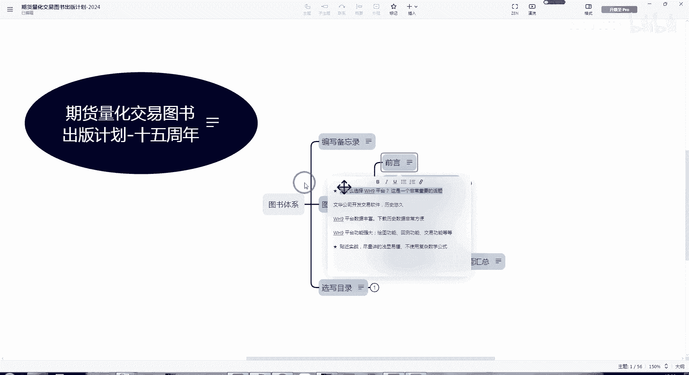
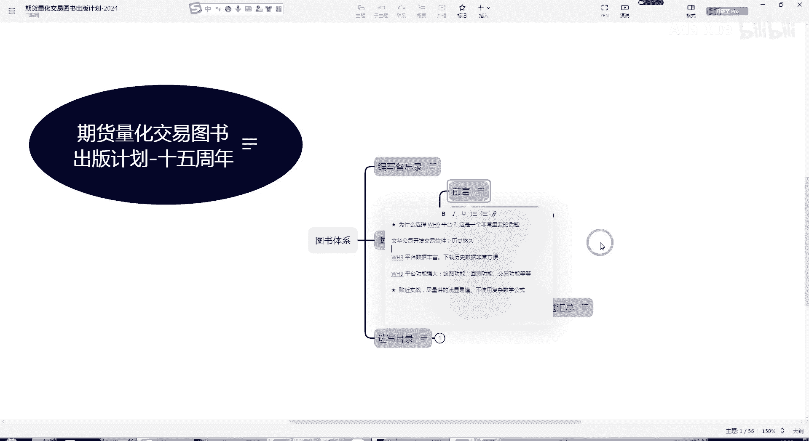

# WH9 和 Python 做对比 - P1 - Ada-Xue - BV1RdqoYHEbk

之所以这么说呢，是因为在大多数情况下，我们现在看到的这书普遍来说都是用的Python，通用的编程语言来做，通用Python编程语言也是很好的，但是有个问题就是相对来说要更复杂一些。

在用Python来开发模型的话呢，相对来说要复杂一些，要麻烦一些，那么我们如果能够用比较成熟的平台。

效率会比较高，说到W这是我们平台，它本来就是为交易设计的。

里面很多的基础的交易功能已经准备好了。

