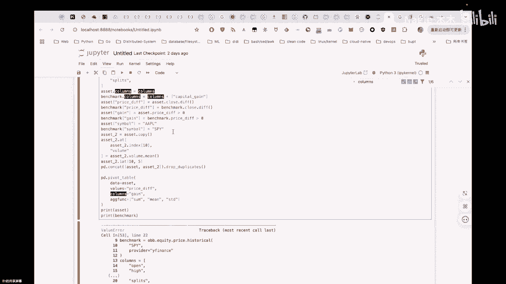
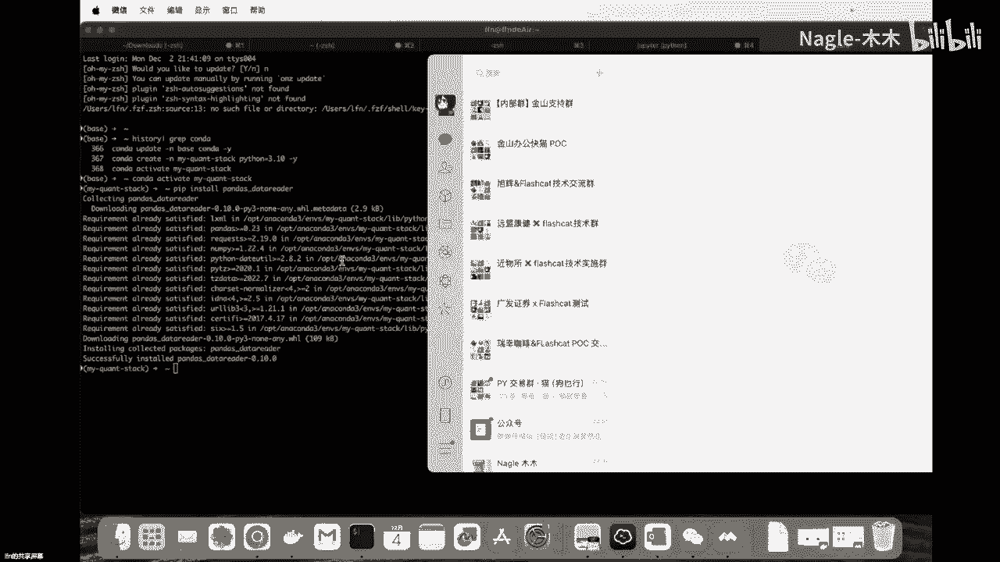
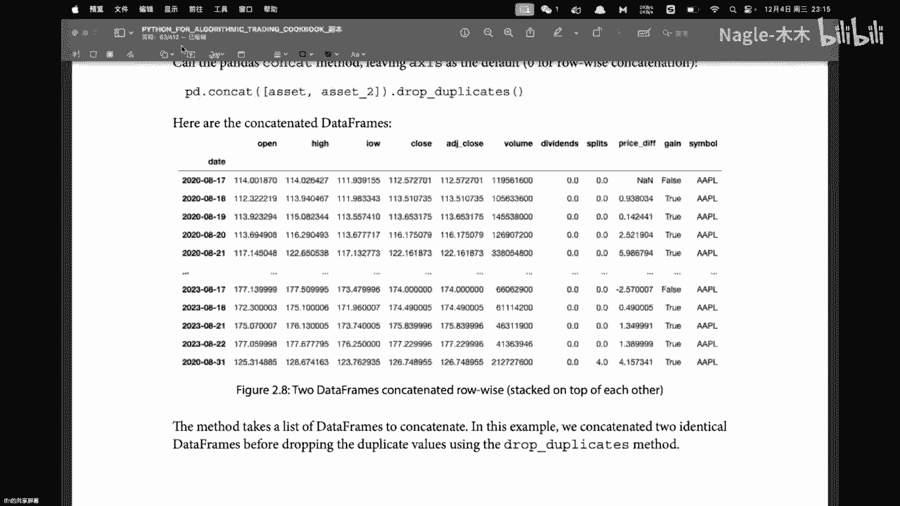
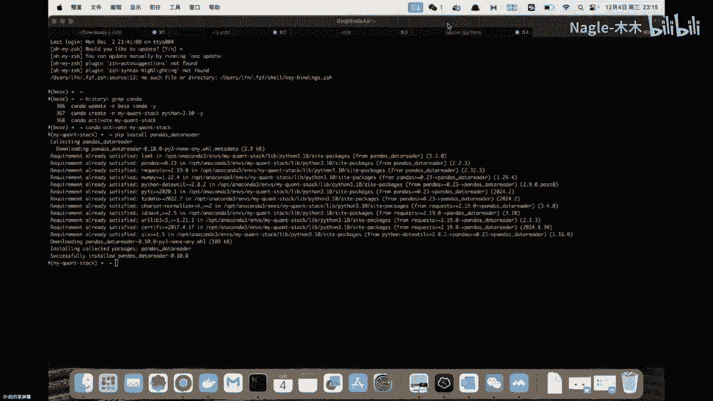
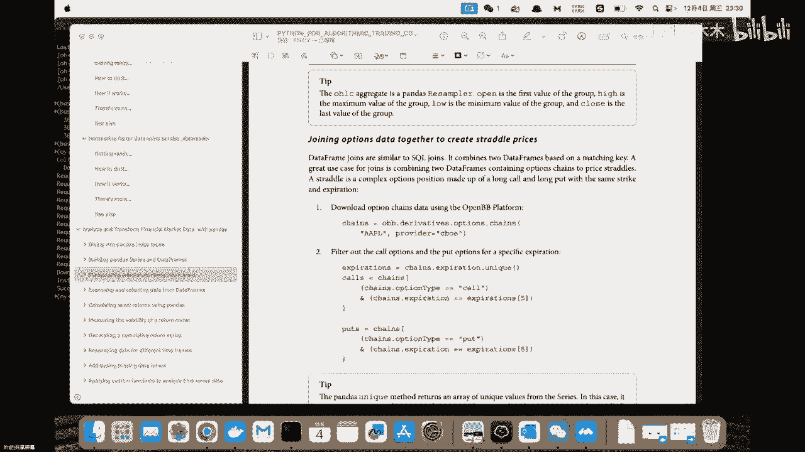
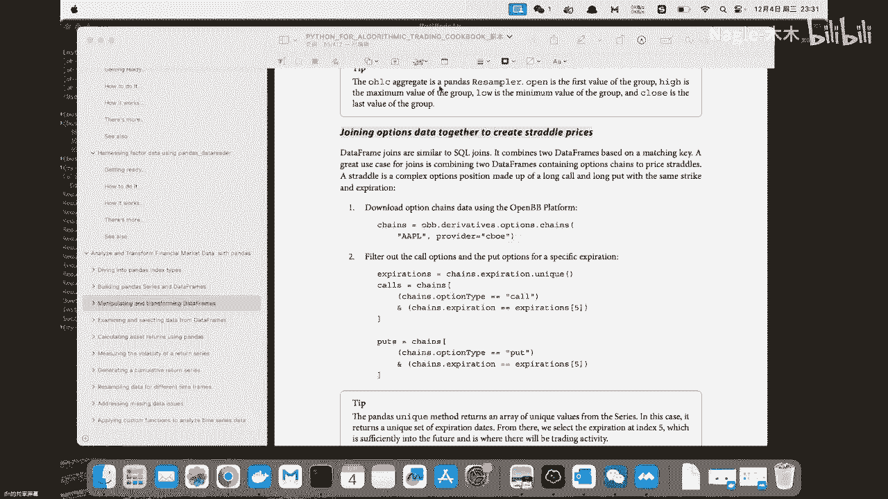

# [read] python for trading 20241204 - P1 - Nagle-木木 - BV19oqpYXEq7

哈喽哈喽哈喽哈喽，你们来的挺早啊，看书积极点，晚上好，晚上好，要725，要发言吗，想想说话吗，愿意说话可以说了啊，嗯直接看呗。

直接看书吧，好行，就这个地方，我觉得他这个他这个代码是不是有问题啊，你看啊，就是他这个地方首先它有个assets对吧，asset有个资产，然后呢它其实有六个有六列嗯。

然后就是他这边呃定义了一个columns，然后有七列，然后你在这个地方赋值的时候，其实就会报错对会报错对，所以说他他这个代码有问题啊，他的代码不是是是应该是数据源，那地方出了问题，应该数据。

你你这地方从WIFLIX那边能下载数据对吧，呃你说从从哪儿，你你也provide这个是吧，对对对，这个可以啊，我不行我不行，所以我直接换掉了，我直接换成了COBE，然后我我从COB下载的数据更奇怪。

他是直接只有五列，所以它不同的prior会会有不同的数据源，所以这是我们在实际过程当中，我们会碰到的一些问题，我们要去handle的那个可能就是呃，他出书的时候，他肯定有六列。

然后他那个这会儿数学变成五列了应对，所以变变化蛮大的，嗯嗯行，所以那实际上实际上来说，就是把这里面你你你可以看一下那个，看一下那个，比如说现在你直接啊加一个block，然后你加一个新的block。

然后你说看一下那个benchmark的嗯，Shape，你看一下benchmark和asset这个ship，你直接print一下它的ship，就你不用那个了，嗯嗯你不用重新那个去FEH这个数据了。

因为上面的已经这个对象会直接存在，你直接直接加那个对，直接加一个blog，然后那个对对对，这个意思哎，对它3年文都是连起来的，asset点shape，你bring it out啊。

DIVIDENT的都有了吗，dividend的都有的，你你有DIVIDENT吗，没有DIVIDENT有open high note close，123456，我看是我没有是哪个没有，是最后一个。

应该是往前往上走，这个这个LDS对你把split把它去掉，你就可以执行了，但是如果我把它去掉，它执行这个的意义又何在呢，又有什么意义，它是重命名，就是如果你看那个呃里面的那个呃，书里面描述的话。

他是说把这个命名把它让它一致化，这个现在有什么不一样吗，open high NO close呀，一样的呀，不一样吗，就是open high NO close volume device，如果我把它去掉。

这个跟之前有什么区别呢，跟现在大一没区别，就是我我是这么理解的，我是这么理解，就是他实际上从数据上来说他是没区别的，嗯但是如果你的provider不是y finance，你的provider是COBE。

或者你的provider是呃其他的这些地方，那有可能他们的命名规则是不一样的，所以我们在这个地方，我们是说一致把所有的columns都会命名成，我现在在这个list里面定义的这一系列的东西哦。

那我明白你的意思就是相当于一个接口嘛，就是你从所有的对象，你不管你怎么去怎么去怎么去操作，我这边的接口是这样子的，你就符合我这个接口来做嗯，我相当于这么高级，嗯对没问题嗯。

但他这个可能还有个问题是说嗯就假设啊，假设你从别的地方获取的，他也是六列，也是六列，然后这个结构是对得上的，但是有可能是说哎他那个比如说他的第一列，就是这个不是open，或者说第四列不是close。

那这样的话你重命名它这个数据也有问题啊，配不上这个，我也不知道，这我也不知道，我总感觉这地方确实是有点那个有点奇怪哈，嗯对对不对，应该是我我我他不应该这么聪明，说他能够知道第一列是什么，第二列是什么。

他也不可不可能聪明到说，我我就是要找到那个那个那个price。

我就把它重命名成price a，我把我把那个我把那个day，我就我就把它重命成那个呃month，他应该不会这么聪明，所以他肯定是你看一下，我们看一下这这一块这个细节，嗯嗯OK反正就是嗯我看一下这一节嗯。

就我刚才反正就看了这一节嘛，然后这一节里头嗯，我不知道木木老师看到哪儿了，应该是这是我是看到那个我是看到那个呃。

我用那个join options data together to create shade shadow prices嗯，应该还是MANIP呃，Manipulating。

这这一部分应该我们看的是同一个小结嗯，用肉眼判断是什么，那个是什么含义吧，判断什么数字是什么含义吧，是什么意思，我没听懂，用肉眼判断什么数字是什么含义吧，175，我没太理解你说的这话是什么意思啊。

其实这个地方哎，其实这个地方我们现在其实他数据有点问题，我们也不需要自己去嗯，跟着操作，其实我们可以一起过一下，他到底干了个啥事情对吧，嗯嗯首先他拿到数据源对吧，他拿了两个，他拿了两个数据源。

他这个这个应该是apple吧，苹果吧是吧，对apple嗯，这个SPA是个啥，s spy是那个标普500哦，哦哦那我知道了500个股票基金吗，类似于他可能是用单只股票和这个呃，那个就是标普的什么指数啊。

所以叫benchmark嗯啊那没问题，然后这个地方假设我们现在列是对得上的，他这个地方做了重命名，然后这个地方它呃加了一列对吧对，也加了一个capital ga，这这这这个这个part我是没怎么理解你。

你加这个，你加这个没有什么价值，还是说我嗯我我我我是这么理解的，我就是从从这个从这个代码level的，这种嗯级别的理解，我我是这么理解，就是我现在只需要到这些数据，你这个里面可能有100列。

但是我只需要我现在定义的这个list里面的，这些列，以及benchmark这个column，我只需要capital gain的这个这个这个列对，可能我是这么理解，这有问题，这个理解有问题。

你如果他列很多，他直接哦，你的意思是用列名去那个去匹配是吧，多的就不要了是吧，他不是按所有的多的我就不要了，他不是按序号去拿的是吧，对对对，就比如我的pom。

就是一般来说就那就可能有一个name convention，就是说所有的所有的平台都会有一个命名规范，都叫open，都叫hi，都叫low，然后呢所有人都这么叫，然后那么他这个里面呢。

但是有的人有的数据源可能丰富一点，他可能是哦，不对不对不对不对，你这样说也不对，为什么就是它这个地方有个赋值，然后如果是说他之前原本的这个data frame，它的列的数量和你这个对不上。

它其实复制会失败，所以他也不是说从里头挑了你系列，这个这个理解是有问题的，反正这个地方有点奇怪，但是下面这个操作我是能看懂的，他就是说相当于是我们是一个二维表格，然后他新加了一列。

然后加完这一列这个操作之后呢，其实这一列下面的数据都是空的，当前是什么没有的，然后他要去赋值，对不对，嗯嗯你看columns是右边先加嘛，对column右边新加码，就是所以你这地方如果六列。

你再执行这个的话，应该也是失败，如果你你试一下，你看一下我们可以在这个地方测试一下，就是嗯假设我们现在没有这一列对吧，不要这一列嗯，然后呢啊我就是这个地方，你把那个asset的那个你报错的那个地方。

你把它注掉，额，这这个地方现在我把这一这我把这一行去掉，应该就不报错了，要到这个地方嗯，重新来一下吧，可能后面有很多变化，我重新来一下，你可以把那个嗯哎我加到哪去了啊，加这了，他自己给我加这了嗯。

oh他还是会报错，他还是会报错诶，为什么我已经嗯，那你想想那个columns在在在之前，就是他会报的错，应该和你的是一样的，就是和前面的报错是一样的，我有办法，我给他，我给他换个变量，那这样的话。

它就是其他的变量就不会用之前那个了，我们把那个嫌疑给它排除掉，这个我也用个二吧，给他换掉，让我们来看一下他这个加到底加了个啥，这还是不行，他还是说这个匹配不上对，miss match吗。

你看一下应该是benchmark那个地方吧，因为benchmark那方没有capital game对，那也就是说其实你这样去加一列，其实是加不上的，对加不上的，那他这个书讲了个啥，嗯，没事儿。

我们看对吧，肯定输，不能说百分之百符合我们的需求，嗯先看往下走吧，第一步其实是rename，这个我们可以回头再再学习一下，其实它也不是加列，它只是rename，这第一步整个第一这么说，嗯我们第二步。

第二步才是真正的去加一列，那这个应该是这个应该是没问题的，就是没问题，假设是说我把刚才这个东西都不要了，二三得点开下，把他拷贝过来吧，嗯背的应该是没问题的，对，你可以讲嗯你好哎，我是三是吧。

嗯这样的话你就可以执行成功了嗯，嗯你看见没对，他这边就是新加了一列，这样才是真正的去怎么样去加一列的办法，所以这个是可以看懂的，也对这个也是一样的，然后下面这边这个其实也是一样的，它有一个gain。

这也是新增的一列，其实它也不需要啊，再赋值之前去去先定义这个列，它直接在这个地方就好了，相当于既定义的列名，然后那个值又给他那个赋值了，然后这也是一样的，然后这个也是一样的，所以这边都可以过。

其实都是一样的，就新增一列对吧，他他这个新增一列就是用已经有的列，然后去呃做一个计算，然后或者是说你直接给它赋个字符串的值，对没错，就是这样的，它就相当于把整列就操作了，然后这个就是拷贝了一个。

然后这个地方就是我看我就有点没看懂了，Set a single value based on the aggregation values，他说set single value就是设置一个单独的值。

基于一堆值的这种聚合值嗯，那他这个到底是咋聚合的呢，看一下就是volume点min，你看到那个asset to点volume点min了吗，这是聚合值，就是说我把这个所有的volume把它加起来。

然后做一下平均嗯，但是他这个是哦啊这个这个地方我能理解啊，就是我们有一列是volume，然后他把所有的这个volume，就这一列求了一个平均值，这是一个单独的一个叫它叫SCALA还是叫什么。

反正这是一个非向量的值对吧，就一个呃简单的一个值对，然后它赋值给这个，是赋值给其中的一个元素了吗，对复制给其中一个元素，所以他说我把我这个数据进行aggregate，然后aggregate之后。

然后我给到一个呃一个一个specific的一个值，对这个at是什么什么操作呀，就是我在这个地方at嘛啊，他这个是索引吗，它是索引是吧，相当于二二维的索引是吧，对对对，在在在volume这一列嘛。

在volume这一列index是ten，然后那么这一行是当我我给你两个两个两个，第一个是标volume这一列对，然后index在十，所以这样的话你就把它交叉起来了哦，那他的意思其实就是说呃。

比如说我某一行某某一个点，这个就是横坐标，那就是这个，然后纵坐标就是在这一列上，然后把这个值给替换掉，相当于是说对1725的那个也也提到了对，确实你说的没错，我们的理解是一致的，还要给它替换掉对吧对。

然后这个又是I艾特是个什么，不知道这我自己去实验了一下，我搞得乱七八糟的，我不知道这玩意怎么回事，The result is。

你看scala value return the mean value between index5，哦哦那我大概知道了啊，你说说他这个就是说呃你看他的这个值，它的这个结果。

它这个结果就是代表的是呃哦index5到十之间，对5~5到十之间的一个平均值，我我试了10~10，我试了十十，Ten ten，然后呢我发现ten ten，他给我的那个值就有点奇怪哦，一一艾特，你好。

看一下他这个艾特到底是个什么，靠这个是达斯艾特，我找一下他这个嗯啊艾特，Access a single value from a rocper by integral position。

嗯诶那他这个是asset点，And ten，它不是five to ten，它是ten five and ten，好吧啊，没理解这个这个回头我研究一下吧，感觉不是很懂他这个东西到底干了什么对。

然后这两个就是这个也好，说他把两个拼起来了，然后照顾了一下这种重复的，然后他拼的时候，他这个拼的时候其实有两个方向是吧，嗯他这个拼的时候是不是有什么两个方向，它其实是一样的，你是说直接你是直接有判的吗。

你看他有两种，它只有它有两种，一种是control wise，然后一种是column wise，我在想那是在行上去贴还是在列上去加，对对嗯，你说的对嗯没错，他这个应该是有两种嗯。

然后他这个DP就是哦integer at哦，Nice，没事没事，你接着说嗯，然后就是嗯嗯对，就是我的意思是说他这个job6job duplication，他是认为什么样的情况下才是这种重复的。

它是比如说诶我某一行完全一样是吧，嗯我我怀疑是哈希比如说我这我一个肉，我一个肉里面的数据是一致的对吧，那我实际上可以这给这个肉做哈，希然后我我对比哈希值一致。

我就肯定可以把丢就就认为是duplicate，我自己实验的结果就是这两个就是嗯，这两个就是asset one和asset two对吧，as one和S2本来是完全相等的对吧。

然后我现在去呃呃CONQU他他们俩之后，然后我再去job duplicate，我发现他们，然后我比了我取名叫asset three，然后我print他们三个的shape都是100。

比如说asset one是100，asset two是100，100×100，100×100，然后ests or three虽然是慷慨的，但是他最后的结果也是100×100。

但是他这个结果就看起来挺奇怪的，你看他这个额这两个应该是一样的，除了是说这个地方改过一个值之外对吧，嗯然后呢，但是我们看这个侄女啊，他呃首先他把他那个贴在一起之后，你看他这值不一样啊。

你看这什么8月17的，然后这个open114177，这是一样的吗，还是说哦这个是已经驱虫过的是吧，嗯对那我那我理解一下，就是2020年和2023年吗，啊噢噢噢对对对对对，那那那我看错了。

我以为这个是像你对我看都是8月17啊，那我看错了哦，没问题，怪他对，那相当于是说，如果是说他们两个唉都是完全一样的，他这样coy一下，然后再job一下，其实就等于他自己，那就没啥用。

1+11加零等于一嘛，嗯对然后这个就完事了，这个完事了，然后这个啊这个就是pilot，他像excel一样去搞，然后power的一个table data，就是它这个参数。

相当于指定你要去那个操作的对象是哪个DF，对吧嗯，然后这个values是指定你要操作的，你要操作的列哦不对，columns是指定你要操作的列，然后对他会求出A哎，那它这个values是保留是吧。

是这意思吗，values是保留，values没有保留啊，你看他操作出来这个结果啊，他操作操作出来的结果是由a gain，然后，那这个结尾就看不太懂了，你看他有SAM，这是三个函数聚合出来的。

然后这个SAM应该是包括了诶，我我这个我这个鼠标我看一下能123456，我们可能时间也来不及了，还剩30多秒，我们退出，退出去之后，然后我们等会儿重新进，好不好，好的好的好的好的，如果被迫中断之后。

我们就重新重新进吧，嗯嗯好的好嗯，你接着说嗯嗯嗯我我哦这我我我批注一下，就是这个地方，相当于他每一个每一个种聚合函数产生的结果，就是这一块对吧，然后呢他这个地方有两行两行，然后就是我现在不太理解的是。

他这个values和这个columns，在这个函数它的参数里头是什么作用，先给我看这个诶互动批注放哪去了，诶我刚才为什么可以批注，现在不能批注了，难不成要件了，等会啊，好好哎，我我直接用。

我直接用我这个吧，用这个画笔，画笔用不了这个这个也用columns，有true和false为依，据，此讨论volumes，然后用aggregation function计算哎，1725。

你应该你玩过这个东西是吧，你玩过这个东西，你那个一下你你你要不你你来讲讲，你你猜的你好吧，你猜的也行，pivot table嗯，我们看看啊，Columns gain。

我们说我们要把game进行一个啊pivot，然后呢aggregate function就是那个然后基于true和false，然后我们把它分成两个part，你想想啊，我们现在有有有一个这个这个asset。

这个这个这个呃，这个表格吧，我们说它是表格，然后呢我们基于true和false把它进行拆分，就分成了两个表，一个是true表。

一个是false表，对吧，诶噢噢噢我找到我找到这个东西了。

就是稍等一下子，品质画笔对，就是我们现在有三个函数嘛对吧，这三个聚合函数嘛，然后他这样产生的结果是说，每个聚合函数它都会产生一趴的这种结果，对吧啊对，然后他现在就是相当于是说。

他最后的结果是说产生了两行，然后两列对吧，对然后我我不太理解，是说他这边Y6S选定的是price def，Price df，它的这个值呢就是要么是false，要么是true。

相当于这个这个值不是它聚合的东西，下面return这个东西才是它聚合的，这个东西才是它聚合的出来的，对没错嗯，那其实是说他这几个嗯聚合的函数，每一个聚合函数，它作用的那个对象都是这个gain这这一列。

gain这一列对吧，对不不不不，gain是一个布尔值，你如果往往前看的话，gain是布尔值，它作用的是values press b啊，那他就是比如说我SAM。

我作用的是麦PREPRICE地府这一列对吧对，然后那它的columns，columns就是gain，因为gain是一个布尔值，它有true和false嗯，这样我们拉到前面，我看哦。

哦这边看一下这个诶啊我要把这个去掉，画笔去掉嗯清空，然后坐标对，对我们现在是A啊，他这个地方有，我们直接看他这个他有一个game对吧对，有个gain，你看一下gain，gain是一个布尔值。

对他这个有有game gain是对，game是一个布尔值，所以它基于game把它分成两个part gain是布尔值，force表，那你的意思是哦哦哦哎你的意思是说，假设就是他先把这种触的触的触的。

然后这一列的TRU的都拿出来，然后基于true的这一列，它就是基于true的这些行对吧，他先筛选出来，然后再基于price def去应用这个函数对吧，对应用some，然后average。

然后mean之类的这种哦，那我就理解了啊，这就这么玩的吗，sta standard deviation啊啊懂了懂了懂了懂了，然后你再看往下走，下面我下面我就没执行了，下面我们就嗯CONCADE嘛。

CONCADE也是一样的嘛，就是把它组合起来嘛，对这个也是简单的，然后group by symbol嗯，点close，点这个o h l save，这是什么哪个这个嗯这个我查过了。

他是它的结果就是嗯这个样子的，它的结果就是会open high NO close，就是这四个噢噢噢噢噢噢缩写啊，就是那个四个字母的缩写哇，好吧对对对对，懂了懂了，它产生的结果就是这个。

但是这个地方我还其实有个好奇的地方，他GROUBASYMBO我可以理解嗯，就是说他其实把所有的那个，比如说他有好多行嘛，然后就是把simple一样的放在一起，比如说就同一只股票的放在一起。

但是它放在一起之后，这个用close又是什么意思，这个地方为什么要引用close，他是这是个字段吗，对吧，我不知道他在前面都用了close，就是他这个很神奇，你看就是他这个结果啊，我没有我没有批注是吧。

我批注一下，就是嗯他这个他这个结果就是你看group出来，他是根据这个symbol group的嘛对吧，所以他现在出来两行，这个没问题，然后tag group有一个额，这个就是会产生撕裂对吧对。

然后呃我在想着呀，就是他比如说这个苹果这支股票，它可能是有好多行，那他这个open这个值到底是哪一天呢，还是说他根据什么去聚合的呢，你你你你再说一遍，你再说一遍，嗯我举个例子啊。

因为他是group by symbo嘛对吧，然后假设我们现在就是这张表里头有三行，苹果的，然后有三行那个标普的，然后就是他日期不一样对吧，然后他现在group group完了之后，可能就没有日期了。

然后就是这时他就得到了，比如说对于呃苹果这支股票，他的open他就能得到一个单独的值，但是这个单独的值它是怎么样去聚合出来的呢，就是它是平均的吗，还是怎么写哦，它它它是clothes吗。

Close close，在这呢close是其中的一列，所以这个其实就看着也挺奇怪的，嗯对呵呵，对这个这个这个先放过on的clothes，Columns，嗯嗯嗯所以这个也挺奇怪的，我所以我们要验证一下。

我们要实际在cod里验证一下，对对这个我们我们得自己再研究一下，其实看他这个看不懂的嗯，嗯together to create strider，然后这个地方又干了个啥啊，他先是有个chains对吧。

对他这个镜子是一个那种多维的那种，对这个provider就是CEOCBOE，你看到没有，他provider就不一样了，OK然后是说呃他拿到一个油腻，可他通过就是chains点expiration。

点unique，这个这个还得这个其实也得打印出来，去看一下它到底是个什么值的话嗯，你这边这边有是吧，但是过期时间就是这是option嘛，对他有nick，我的意思是说，你这边你这边代码已经写过了是吧。

这个我没写没写啊啊啊行，那我们那我就看吧，我说如果你写过，你可以共享一下，看他执行出来是个啥东西，嗯我在另外一台电脑上操作的，所以这个这个对你你接着说，你接着说嗯对然后X拍action就过期时间。

然后这个是call的过期时间，这个是put的过去时，put的过期时间对吧，然后其实他这个具体他的那个ship是怎么样的，其实我也不清楚，然后看看他后面要做什么事情啊。

然后呃他给他给call set了一个index，然后给put也set in index，这个index就我理解是一个相当于多了一个标签嘛，对不对，类似于这种吧，但实际上体现的那个数据结构上。

就是嗯比如说表格，比如说二维表格，它就是多了一列嗯，应该是说他给cos加了一列叫strike，然后这个strike具体是个啥意思，我也不太清楚嗯这个你有了解吗，他在金融我不知道这是个啥意思，我也不知道。

因为这一段我也没没没去跑，嗯对然后就是他说joins the call和the put call put，用这种left join嗯，COSTRIKE一直cause strike式啊。

这是啊他用COSTRIKE去left join postrike，how就是那个left drive，然后这个呃left sufix，然后right surface，这个我看他这个意思是说。

因为他们两个有一个同名的lex price列，然后呢他为了区分就是会加一个这样的后缀，然后相当于是会会有两列，就是在这个地方，就是会看到是说有一个它那个叫last trade price call。

那是trade price put，就这个东西，然后这个是他的street of price，然后我看一下，那这个是price，然后他打出来的这个是什么噢，噢对这个地方还有一列，就最后的这一列。

最后的这一列是他计算出来的嗯，所以实际上实际上来讲的话，嗯我看一下有一个strike列哦，对strike列这个是他加的一个index，STRUGT加是一个index，但这个index是从什么地方来的呢。

你看他是有值的，这个值就是那个对我不知道呃，嗯我觉得我我嗯嗯全是零，怀疑他是对的，书上打出来全是零，怀疑他是对的，我不知道这个可能跟某一个空，这可能是涉及到某一个具体的概念，就这个strike。

他可能是在这个上下文里面是有意义的，STRIKE嗯，就是他这个帅哥应该是有意义的，你明天你明天来吗，明天不知道我们那个有可能会来，然后不知道有没有取消啊，哈哈没关系没关系呃。

明天反正我我我我研究一下这个东西，我要研究一下，反正我会下，线下的时候我会把它执行一遍，然后把这整个，然后明天我上线之前上线的时候，我再给你们解释一下，对嗯对，这个其实其实我们光看他这个东西嗯。

我感觉啊，前提是我们得知道它这个chain这个东西，它的ship是怎么样的，他的shift是怎么样的，然后我其实然后我们再搞清楚它的set，set index到底是不是给他加了一列。

或者说给他应该是加了一个标签，应该是这个意思，然后我们可能才能搞懂后面这些group相关的事情，对把这个基础夯实一下，然后才能理解，我感觉就是我们现在看到这个地方，现在到这个地方为止。

然后这个这个表它是怎么出来的，其实我们不能忽略，我们还是得一步一步研究清楚才行，你这个嗯对过的对对对嗯，这是那个pandas，怎么去把这个把这个把这个数据，把它transform出来了。

从原始数据怎么变成了这样的一个数据，它中间涉及的是一个什么样的一个operation，确实是对这个地方不能超过，你看他是个and符号吗，中间是一个and符号嘛，所以是一个语啊雨的操作嘛。

啊你说这个东西是吧对啊说啊执行价格对啊，他就是到期的价格，就是嗯OK这个这个我我回头我也自己跑一下嗯，跑一下这个要跑一下，不跑一下，搞不出搞不出来的，搞不清楚，因为不知道它形状。

所以不知道他是怎么操作转化的，没错嗯没错，这要看一下的，嗯嗯嗯后面还有吧，后面这个strike哦，还还可以啊，还可以apply custom function是吧，对对对。

这些说实在的就是他group buy什么的，然后这些东西其实都好理解，我觉得关键是说我们把前面这个地方理解了，就是下面的，其实我也我也大致看了，就是我感觉如果前面这块我们搞清楚了，下面它这个地方哎。

就是说比如说嗯那个他根据多列去group by，然后呢再去加那个就是每一列，然后用的函数不一样，然后包括是说你再到下面，然后比如说某系列，你可以用拉姆的函数，指定自己对这一列做什么操作。

其实这些就都好理解了，这个不是问题啊，最重要的问题是就是我们现在搞清楚，他这个group by这块的东西对，就把刚才把刚才这张表我们能搞清楚，下面他说的这些其实都好理解的对，要把它衔接起来，没错了。

你说的对嗯对我我大概就看到这个地方了，行行，那咱们研究一下，把这个代码先执行一遍，看看这个这个上，因为因为实际上就是我，我现在的数据长什么样子，我不知道对吧，然后然后这个时候呢。

我在我我基于一个虚有的东西，我再去做operation，但实际上我基本上就是很糊涂的，我这个我觉得我理解清楚嗯，哎这个哎哎这个怎么搞出来的，哪里搞出来的哦，在开始满方格选之前是吧，对对对对对对。

就是就是就是在就是这个地方吗，就是呃诶我靠，我先把这个清空一下，就是嗯哦哦我我说错了，我说错了，我说错了，我是说嗯哎呦靠，稍等一下，我是说这张表，这张表的他怎么得到的，我们一定要搞清楚，嗯对对对。

这个后面的都好说，嗯嗯嗯嗯行嗯好，完事了，今天OK行，那咱们把这个东西线下执行一下，然后如果全是OKOKOK对，他主要是是这个意思，就是这个这个列到底怎么得出来的，嗯嗯嗯嗯对，我们可能信息量不是很大。

但是就是这个他是怎么算出来，A为为什么是为什么是零，是谁加谁等于零，主要是这个点可以看一下，而且关键是说这个strike我前面都没看到，他怎么赋值的，它怎么就有值了，这是行权价格。

我刚去查了一下他的行权价格，所以他是从那个他是从那个嗯啊，就是它是一个它是一个递增的一个序列，就是啊我现在我现在的价格，比如说我我我现在我现在嗯，我现在也apple的价格是呃100。

然后你预测说在下个月它会涨到105，有的人预测下个月它会涨到110，有的人说下个月那一天它会涨到115，120，125，130，135，以此类推，你会看到它是一个递增的一个序列，看到没有哦。

OK然后你再去扩它，再去put它，然后就会形成call价格和put的价格，所以这中间很复杂的嗯，嗯所以我也看的有点迷糊，说实在的嗯嗯好的，然后我跟你讲吧，嗯我给你解释一下好吧。

明天我看我我我我这这地方我没执行，所以我我我我都没看到这个地方，嗯嗯好的好的，明天我我我那个我我执行完之后，我给你们讲一下啊，OK好了行。

那咱们今天就算在定在哪一个地方，我看一下，就是刚刚你就是定在这个地方好了。

就像咱们看到的那个嗯。

join option data对吧，Join option data，明天就从这地方开始看起好不好，OK没问题嗯，把把把那个copy一下，send到我们那个chat里面来，我记一下，OK嗯。

看一下发到这这个三放到放到这个，Ok ok thank you，好好拜拜拜拜拜哼哼。

