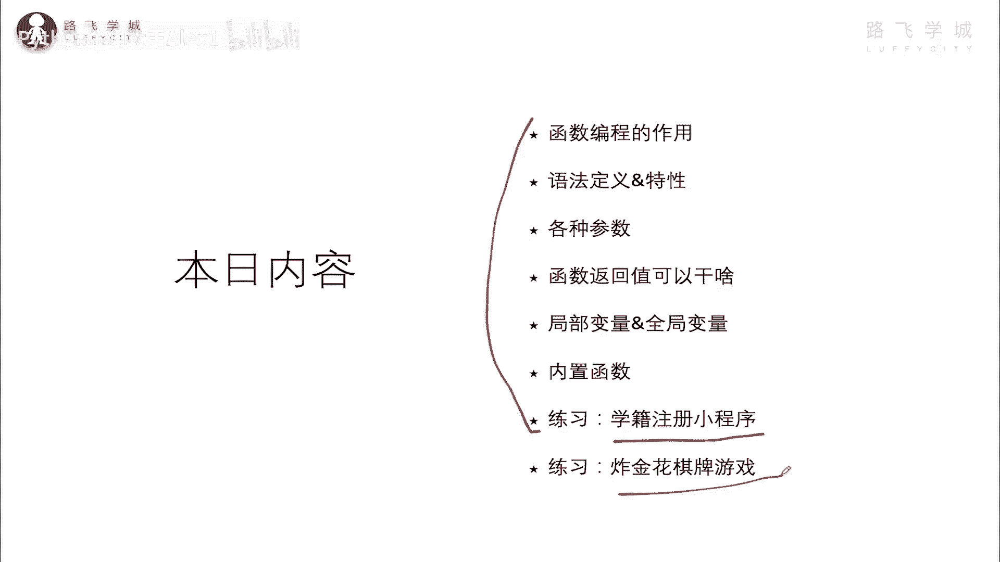
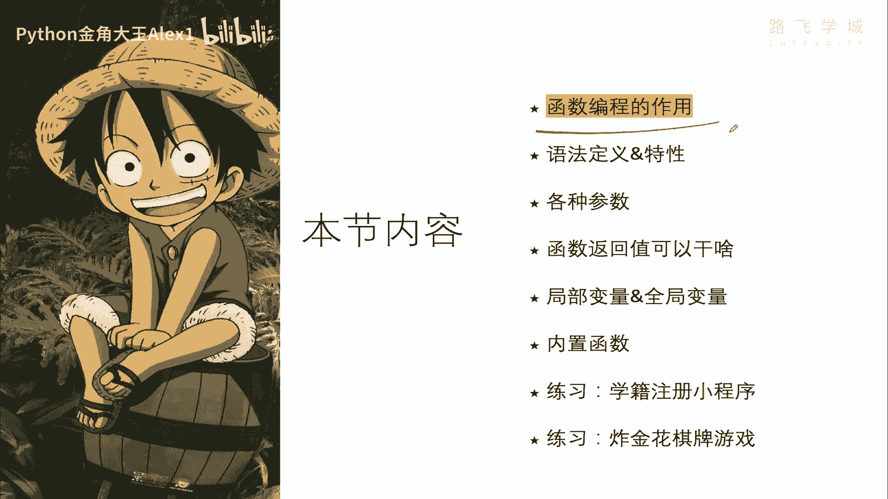
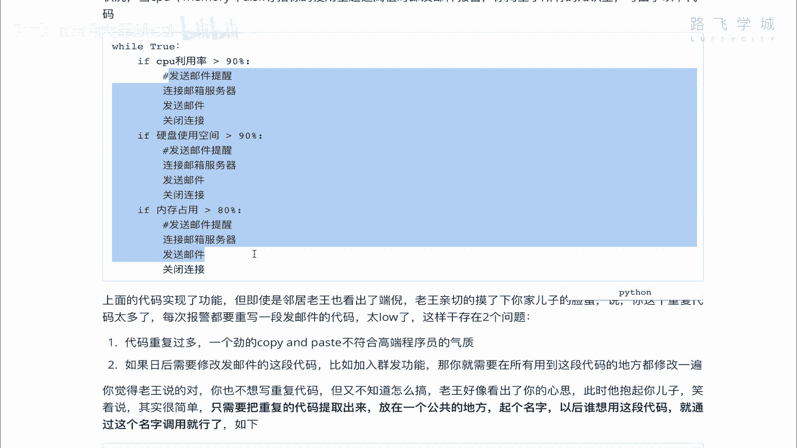
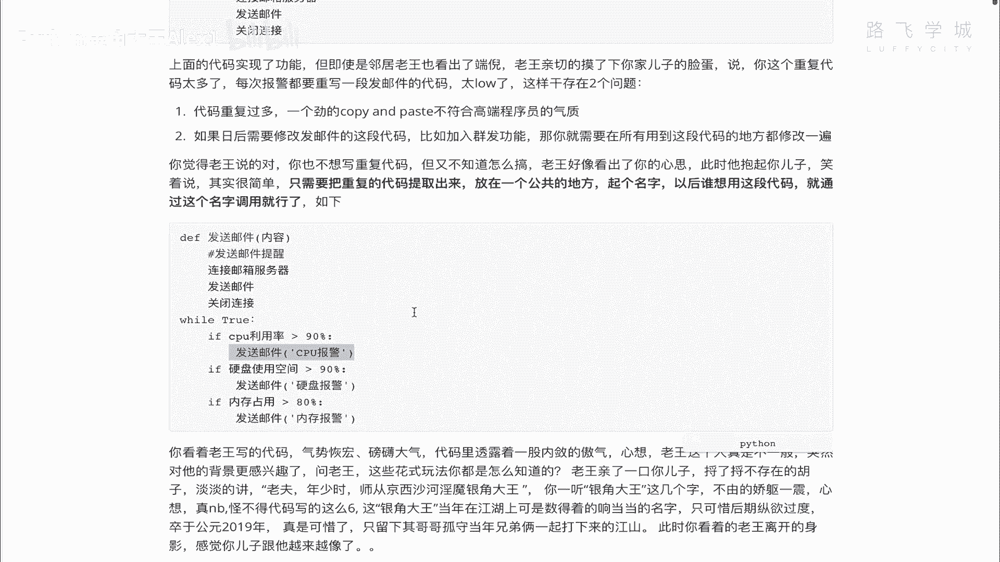

# 【2024年Python】8小时学会Excel数据分析、挖掘、清洗、可视化从入门到项目实战（完整版）学会可做项目 - P56：01 函数编程的作用 - Python金角大王Alex1 - BV1gE421V7HF

OK同学们，恭喜大家进入咱们第五篇，函数编程这部分的内容，那今天的内容学完之后，你就有能力写一些稍微复杂的一一些代码了啊，那也同样代表着，同时代表着你这个纯小白，身份生涯的一个结束啊。

从此进入了一个编程高手之路的狂奔旅程啊，狂奔旅程啊，OK接下来就跟我一块开启今天激动人心的内容，今天大部分的时间，我们都会在讲函数的各种用法，讲完之后会有两个实战的练习题，一个是学籍注册小程序。

一个是炸金花打牌的一个游戏，那打牌游戏是吧，你看经常玩什么斗地主啊，麻将啊，学完这个之后，哎你也可以自己搞一个好吧。

咱们先进入第一节啊，就是要讲编程的啊，函数编程的一个作用，为什么叫函数编程，函数编程是干嘛的啊。

咱们来聊一聊，我这边呢通过一个小需求啊，跟大家聊这个函把函数调出来是干嘛的，你呢想象一下你是一家公司的it运维人员啊，小白不知道运维人员是干嘛的，大家用的抖音微信是吧，你背后都是有服务器的啊。

服务器的它供应着全国数10亿人口同时使用，是不是啊，那这个服务器的规模非常的大，有数10万台啊，就是光腾讯就得就得有几10万台服务器，那这些服务器需要对吧，就像一堆几10万台电脑，你想象一下放在这运行。

那你是不是肯定就这个出故障，那个有问题，所以呢就有一堆专业的这个啊技术人员，负责维护他，确保他7×24小时稳定的运行，这些人就叫运维人员，OK吧，运维人员这个工资也很高啊，那他呢你的老板啊。

你是这么一个角色，然后你的老板呢需要让你写一个监控程序，监控这个什么呢，确保你们公司的啊网站服务器啊，7×24小时，全年无休的监控到对吧，你要维护这个系统，你要知道他如果出了故障。

你总不可能说你就是比如说呃，这个每每隔几分钟跑到这个服务器去看一看，哎这个服器有没有问题啊，你那是想写一个脚本，可以自动的监控我的一些硬件指标啊，系统指标，比如说CPU使用或者内存使用硬啊。

硬盘使用是不是OK对吧，所以呢你让你监控这个指标，几个指标就是CPU啊，内存啊，硬盘啊，诶是是有没有超过阀值，如果超过阀值了，就触发一个报警，这个报警就可以通过邮件的形式发到啊，发到管理员。

比如说发到这个，发到你自己的邮箱，反正就是通知到相关责任人，他就去处理就行了，明白吗，对吧，哎这是这么一个需求，那你想怎么去做它啊，你想怎么去做啊，注意了啊，你这个你比如说你的内存如果满了之后。

你会导致程序有可能崩溃，所以这个监控是很重要的好吗，Ok，那你想了想，首先第一个是24小时，全年无休，所以肯定是有一个循环死循环是吧啊，然后呢就你可能每隔一分钟啊就去检测一次，每隔一分钟检测一次。

出了问题发邮件诶，你绞尽脑汁写出来一个这样的代码，看到没有，有一个死循环，然后呢如果这是伪代码啊，如果CPU就是就是伪代码，就是伪造的代码啊，这个不是真实代码，但是是把这个业务逻辑写出来了好吧。

如果CPU利用率超过90%啊，你就开始发邮件发邮件，你假如说你可能用的是QQ邮箱或者是163，那你得连上人家邮箱服务器，所以连邮箱服务器发送邮件，关闭链接，是不是有三部大象装进冰箱，有三部对吧。

那当硬盘超过了90也是这样的对吧，连服务器发邮件关闭链接，内存也是一样的，对不对，哎你看你这样写，就把这个功能实现了，对不对，但你虽然把功能实现了，但有没有问题，你自己想一想，想象一下。

这里面每一句都是，比如说连邮箱服务器是一句代码，这也是一句，这也是一句代码，那三句代码你会发现这三这些，这这几段的这个代码都是一样的，对不对，发CCPU出问题，发的邮件啊。

和发的代码和这个代码代码全都是一样的，没错吧，A作为小白的你你就看出来是这个问题，所以呢唉你们家的老王啊，邻居老王也看出来了这个问题，他那亲切的摸了一下你家儿子的脸蛋，就说你这个重复的代码太多了。

虽然你实现了功能是不是，但这样写太low了，每次报警都要重复写一段，重复写一段是这样存在的问题，第一个是吧，说了重复代码多一个劲儿的copy paste，不符合高端程序员的气质气质是吧。

另外一点就是如果日后你需要比如说修改啊，把这个需求修改了，假如说我我我这个现在是发邮件发给一个人，那这个需求变成了我发邮件发给十个人对吧，现在发一个人发给十个人，那你这个发给多少人。

是在这里写的这个代码，那你要改的话，就是这里要改，这里要改，这里要改，三个地方都要改，对不对，你现在只有三个指标与监控，如果有30个指标呢，30个指标写30遍代码同时要改的话，改30个地方。

这个实在是太low了，实在是太low了，对不对，所以呢你觉得老王说的对呀对吧，你也不想写重复代码，但是你是小白，你不知道怎么搞啊，老王看出了你的心思啊，抱着你的儿子说，其实很简单。

只需要把重复的代码提取出来，注意啊，这句话只需要把重复的代码提取出来，放在一个公共的地方啊，做成一个公共的这个代码就是就是一个功能，然后呢给它就是供别人调用就行了，起一个名字是吧。

哎这个就像公共厕所一样，谁想用都想用都可以用对吧，那把代码提取出来，放公共地方起个名字以后，谁想用这段代码，直接通过这个名字调用就可以了，于是他帮你改了一下，你这个代码。

你看我呢把发邮件这个功能给它提取出来，放到了一个公共的地方，然后呢给它起了个名字，就叫发送邮件啊，里面还有括号参数，就是内容啊，想发给谁就发给谁，想发什么就发什么，那我我我加了一个关键字，这个DEF啊。

就是它的什么呢，定义这种公共啊功能的那么一个语法啊，DEF1会讲，反正就是放在一个统一的地方了，然后呢CPU满了，我就调用啊这个发送邮件这个功能看到没有，哎，里边把这个CPU报警传进去。

这个硬盘满了就调用，内存满了就调用，同志们，就这样，其实我同样也实现了你上面的这个功能，明白吗，但是区别在于我没有重复代码，我只写了一遍，后面只需要调用就可以了，对不对，所以同志们啊。

这个下面这个文字不不给大家念了，同志们，这个东西就是什么呢，就是我们接下来要学的函数，这个东西就是一个函数，把把重复的代码提取出来，放在一个公共地方起个名字吧，诶这个公共的这个功能，这就是一个函数。

也是以后调用的时候，通过函数名就可以调用了，明白这意思吧，OK好那你们理解了，通过这个小故事，你理解的一个重要需求，就是说函数非常重要的一个特点，就是说减少重复代码，减少重复代码，明白吗。

你以后写复杂的程序，对不对，成千上万行代码啊，那你这个这个这个这个你会了这个东西以后，你就让你的代码越来越少对吧，越少越好，越精简越好，OK好了，讲完这个啊，这个这个小弟子，我们接下来下一小节。

