# 【2024年Python】8小时学会Excel数据分析、挖掘、清洗、可视化从入门到项目实战（完整版）学会可做项目 - P88：06 div网页布局 - Python金角大王Alex1 - BV1gE421V7HF

OK同学们，那这一小节呢咱们来学网页布局，在上节讲这个div的时候。

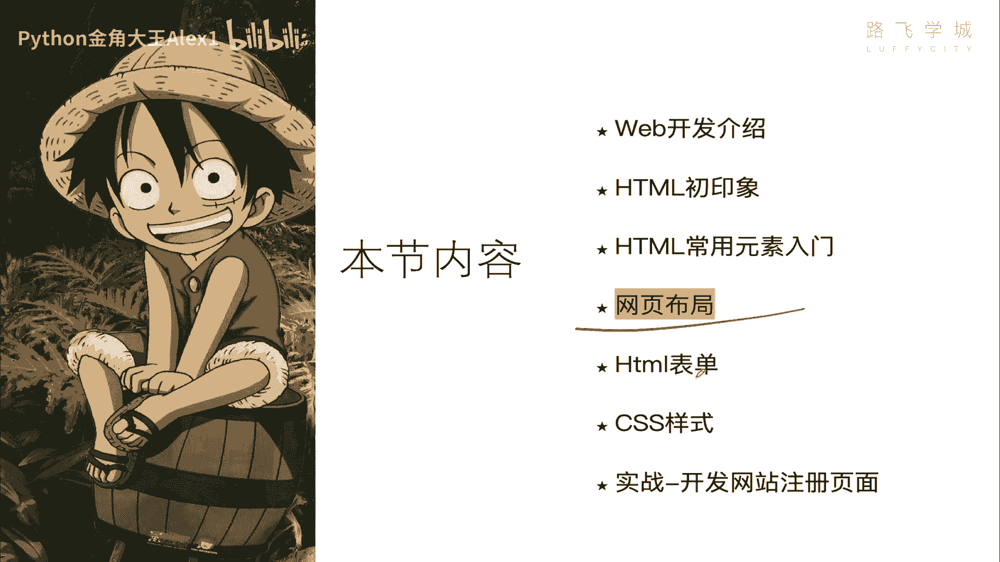

就说哎div是用来做网页布局的对吧，大家来看一下，我们想做一个这样的一个页面，当然不是跟人家一样做这么好看啊，就看一下它这个结构我们能不能大概拼出来，下面这个不说了啊。

咱们就从这个地方开始，看到没有，这个地方开始，然后呢大家来看一下它这个结构啊，上面这一一行小字我们也不说了，我们就认为它只有比如说就这里看到没有啊，这里是不是有一块，这里是不是有一块，这里还有一块。

对不对，然后下面还有好几块，对不对，唉那你看这些都是通过div来拼出来的，那我们要做一个这样的情况怎么办呢，很简单，再搞个div，这里div这里div，这也是这也是这也是这也是就可以了。

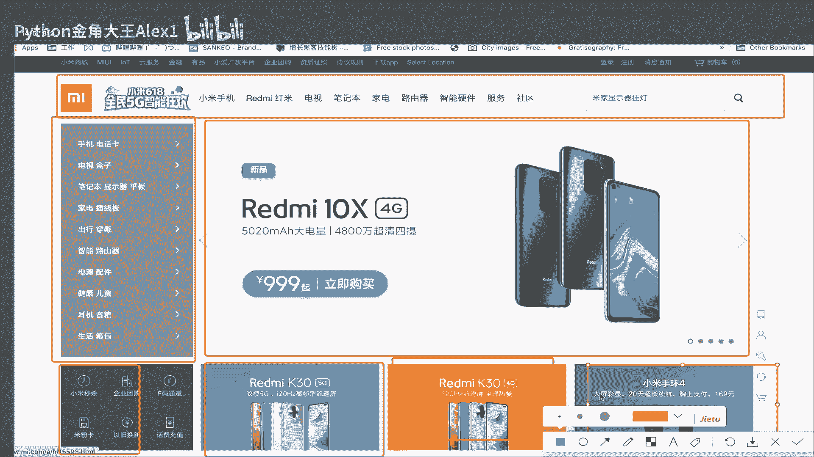

OK吗，那我们就用它来做一下，做出来的效果可能长这样好吧，长这样啊，有点稠，OK我们自己来写一个现场叫div布局啊，Div，布局布局啊，小米是吧，小米PUMK，那个叫小米，官网。

所以其实做网站其实很简单啊，我们是不是首先先上面写一个div，是他是这个什么呀，就是表头是不是div就是表头呃，这个我们这样我们可以给我们这个表头呢，起一个名字啊，起个名字。

这个名字就是就就像嗯就像我们给人起，你你这里有可能有上千个标签对吧，那你每个标签你怎么定位到它对吧，怎么定位到这个标签，所以就像人的身份证一样对吧，你这个没咱们班级里。

每一个班级里是每一个人是有名字对吧，或者是对，那就给我们像这个东西叫名字就行了啊，给这个标签起个名字，咱们用这个属性叫ID，那用这个属性叫ID，我们起的名字就叫啊，这个什么呀，叫menu吧是吧。

这是表头，然后我们在这个里面随便写一点东西，它里面可能有可能有好几个呢，就是这个什么呀，表头是吧，呃这个叫首页，gay吧咱们就叫P啊，首页，首页，然后当然你可能还会有这个什么其他的叫呃，电视对吧。

小米电视好就不多写了啊，所以这是什么的menu呢，这是这是这个，看到没有这块儿，然后接下来接下来再就是左边这块好吗，再就是右边这块啊，左边这块，好咱们给他设置一个高度啊，高度就在样式表里写了。

一会在样式表里写啊，这个叫id等于一个什么啊啊side bar啊，SA的棒行吧，就是左边的那个一个菜单栏，这边有手机，叫什么UL，咱们可以写一个，手机，然后电视啊，小家电是吧，然后这个这个IOT设备。

就是什么物联网的手表啊，什么这种东西啊，那接下来再来写一个右边的，是不是写一个右边的，他的id叫做叫content panel吧，come on tt box是吧，就是填内容的啊。

这边就是什么一些这个大广告是吧，可以放在这儿是吧，OK看到没有，就像右边这些东西，当然下面还可以有，下面还有一个最下面可以，咱们下面当然可以有这种四个，当然我们也可以直接这样就搞一个photo。

就是就是尾部嘛对吧，一般网站网站有尾部，所以我们在这下面啊可以搞一个div，就是这是什么呀，H3photo对吧，那好我们在这里叫hot好吗，你看现在我们一共有搞了几个DIY，四个div，对不对啊。

上面的嗯按钮就是那个菜单栏左边的侧边栏，右边的这个天幕就是这个大的广告区是吧。

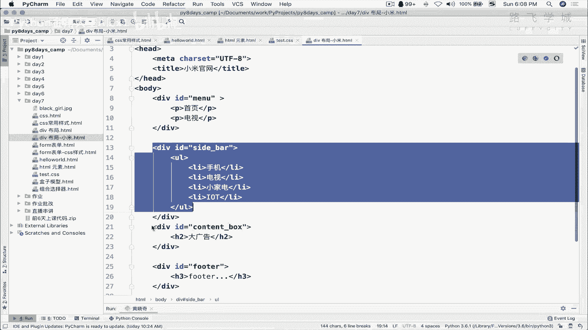

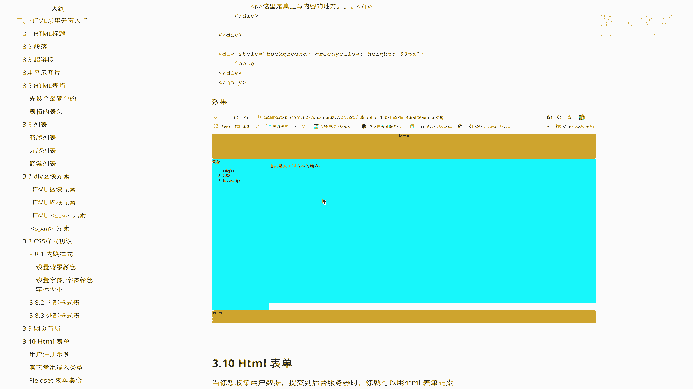

就是这个右边大的广告区，再是下面的一个啊，这个photo好吗，那接下来我们给大家写样式啊，给写样式区分上样式你就看出来了，style啊，tab等于cs，然后呢我们这样看着啊，我们这样怎么办呢。

我们就直接把这个颜色都给它区分一下好吧，把颜色都给区分一下，我们在嗯怎么区分颜色的，咱们是不是写那个内联样式的时候啊，sorry内部样式表的时候，可以说直接是div，就这样是不是你觉得div这样的话。

你看啊，当咱们先给他background color的话，你比如说定一个yellow的话，就会出现一个什么问题呢，它这里面所有的div都会给它定义这个样式，看着啊啊都会给它，都会给它出现这个样式。

大家看你看这就都出现这个样子了，这样的话嗯嗯就就不太好弄，我想给它区分开。

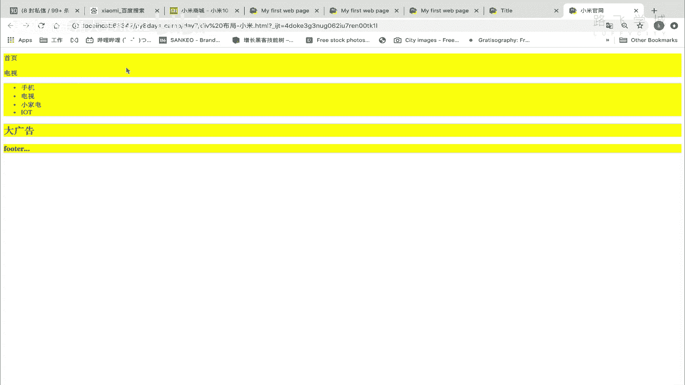

比如说这个是一个颜色，这是一个颜色，这个颜色明白吗，你明白这意思吧，好了怎么办呢。

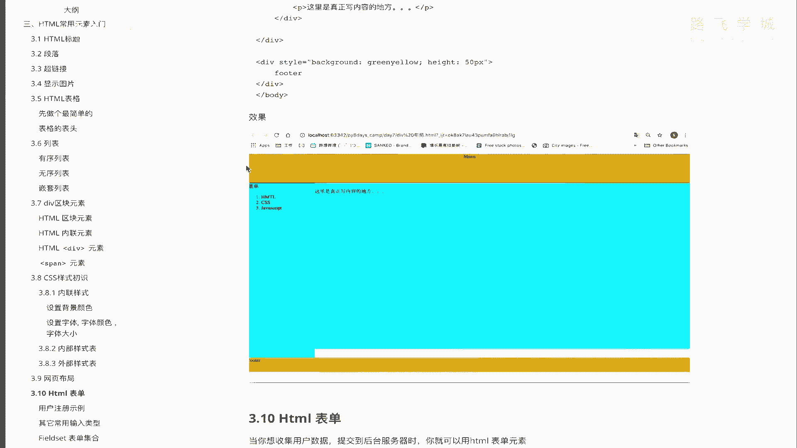

那你就没有办法，你就没办法，直接是用div，div是所有的，你可以干嘛呢，用他的名字，你直接在这里写他的名字menu，看到没有，你直接这么写menu是不行的，你要干嘛呢，前面加一个井号，前面加一个井号。

注意了，就是取身份证啊，这是前边儿啊，加井号啊，就是用id来选择这个元素，这个标签明白这意思吧，这是注释啊，相当于我通过id名来选择到的，就是找到的这个标签明白吗，所以只有他会改颜色，看着看到没有。

能理解意思吗，那下面的是不是也是一样的了对吧，我下面是绿的黄的，我下面这个啊，我可以给他定一个高度啊，叫hat等于一个150PX，看到没有，然后我下面这个叫什么呢，side bar对吧。

他的background color等于一个orange，然后他的heat等一个500px less，等一个啊，等于一个什么呀，等一个啊，也是150PX吧，200吧，200PX好吧。

这个时候我们来看一下，看到没有，是不是有点有点那个意思了是吧，那接下来把这个大广告也给它加上这个样式啊，大广告这个别150了，太太宽了啊，80吧，那接下来就是广告叫content box，是不是啊。

对吧，我起的名字叫content box嘛，给他也加上他的cat这个800PX，然后他的态，它的这个啊vs也等一个等一个1000吧。

ex然后background color等于一个green yellow，OK那同志们看着，哎我靠，这里出现了一个问题，同志们确认问题，我想要的是把它把这个左边这个东西给它，移到什么呀。

移到啊移到右边去，对不对，但他现在很显然就直接往下怼了是吧，是不是直接往下怼了，那直接往下怼的话，我这个VX要等于1000，写错了，写成1000，你看他是直接往下怼的，我其实其实想让他摆到这个上面。

那个怎么办呢，OK我们让下面这个绿色的这块移到这里，怎么办呢，那应该怎么办呢，唉就用到我们没学的一个还没学的，CSS样式里面的一个什么呀啊专门的属性啊，就是叫什么float float属性。

float属性是浮动的意思，浮动浮动的意思就是说正常你是从上往下排。

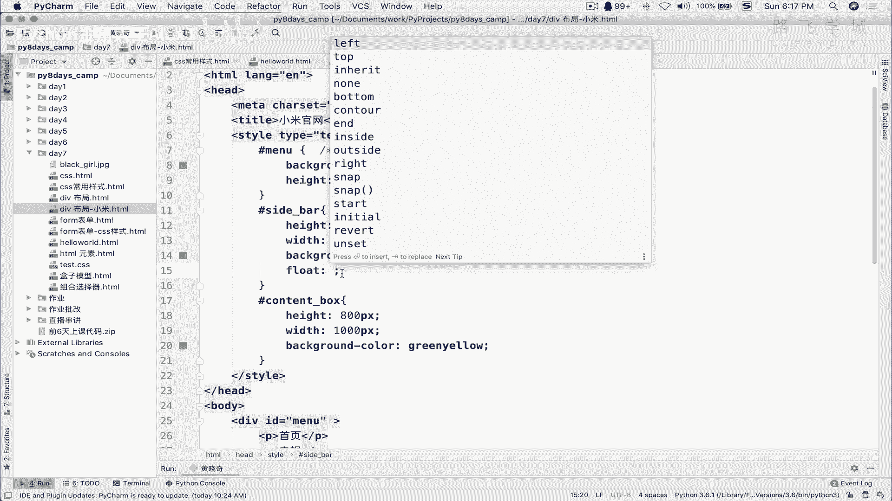

但是现在呢你要让它浮起来啊，就相当于你你看就像下面这个东西，它是往下排，但是你要让它浮到上面来，看到没有浮到上面来，那怎么办呢，哎你把这个改成浮动等一个left，就就是说白了从这个地方往往就是left。

But sorry，浮动等一个left就是什么呢，靠着这个左边这个边框看到没有，往就是就是往往左怼，就是从左往右怼啊，从左往右排的意思吧，那这个是floor等于left。

然后你content box也要写成floor等一个left，所以这两个都是从左往右排。

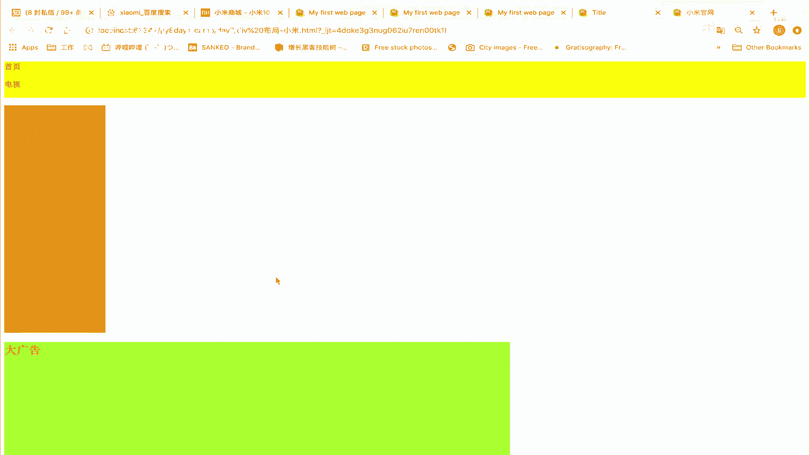

大家看是不是直接就上来了，对不对，是不是直接就上来了，没问题吧对吧，这个就直接上来了，那这个时候出现了一个小问题对吧，左边就是这俩是伏，就是呃从左往右排列，但是这个photo我们是不是正常。

还是让它让它往最下面的，对不对，photo还让他往这个最下面的，但是注意了，你这个一改这个float等一个left，它就会导致就正常的话，就会导致下面这个就再往下的div，也会按照这个就是就是扶着来。

就是从左往右排，就之前你是从上往下，你只要其中一个改了，就是你其中一个div改了，它，后面的div也会，直接就是相当于继承之前的那种啊，规则就全都是从左往右排了，所以你要想让让他再从上往下。

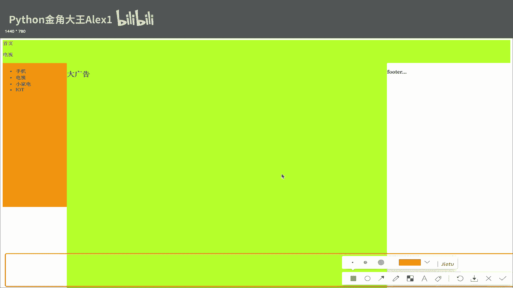

这个foot还是在下面怎么办呢，你还是要再去也改一下它的样式，改一下怎么弄呢，直接在这里加上foot啊，等一个sorry hot，先给它加一个background color，等一个black。

然后呃hat等一个100TX，注意到这个时候啊，这个时候你要干嘛呢，等一个叫clear boss啊。

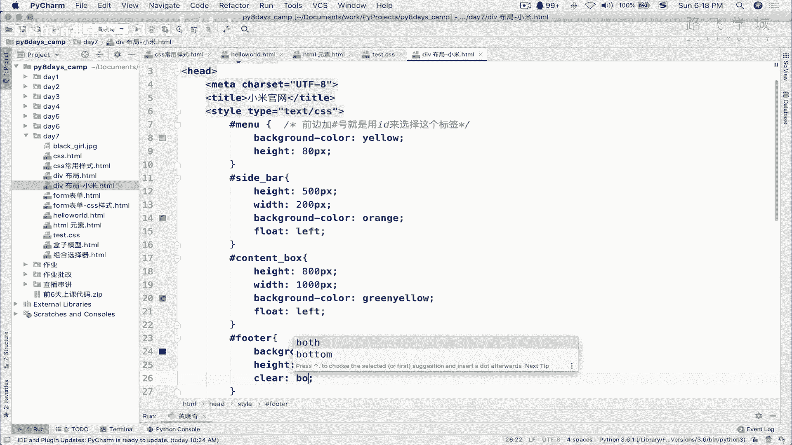

注意了，你加上一个这样的一个属性，相当于这样的属性，我们先看效果，大家看是不是就会它浮到下面来了，对不对，那clear这个属性。

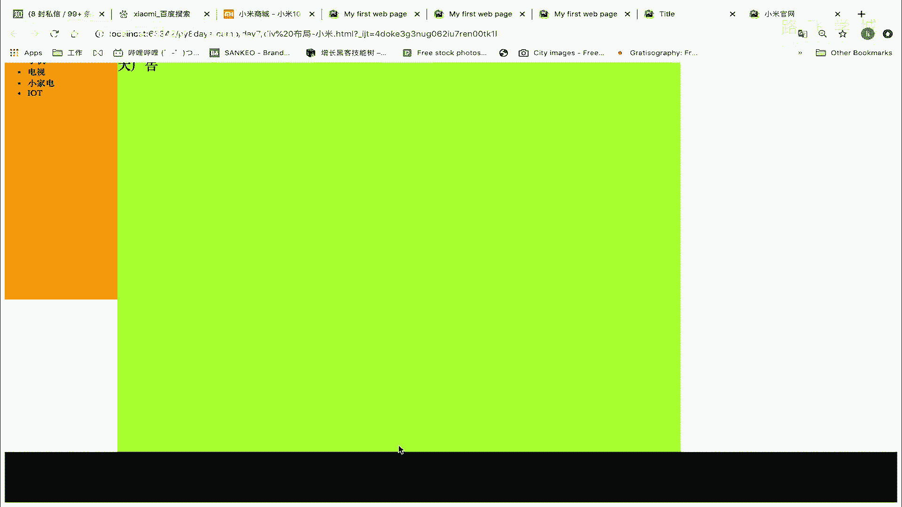

其实就是告诉你的那个浏览器说，OK我这个不按上面的之前的，原来的这个这个这个排列的样排列的，这个格式之前是什么，从左往右排，对不对不，我这个呢不管按他这个来，所以我就进行一个clear clear属性。

就清除掉之前的那些div的那些排列规则，我就重重新按我自己的啊，重现我自己的啊啊，是吧，就是不在RI这个，浮动排列啊，稍等呃，Shit，我这个打字浪费多长时间，不动排列好吗，OK这个就是这个什么呀。

嗯这么一个一个怎么去从左往右排。

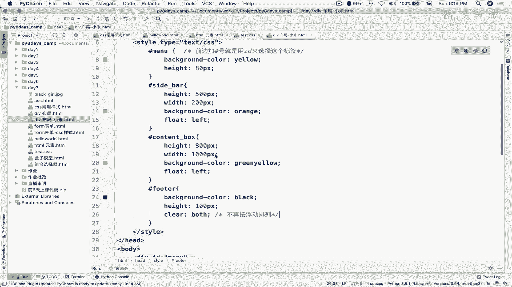

看到没有啊，先这边有一个就是就是float left，这里有一个flow left，这里有一个boss就可以实现这种效果。

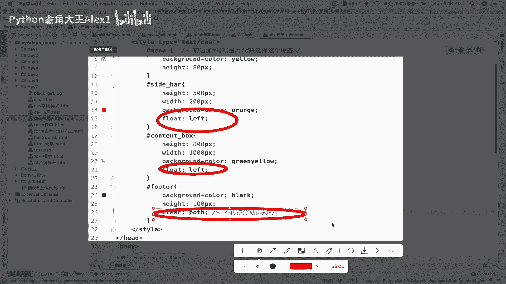

明白这意思吗，好那你这个东西你可以自己去铺满啊。

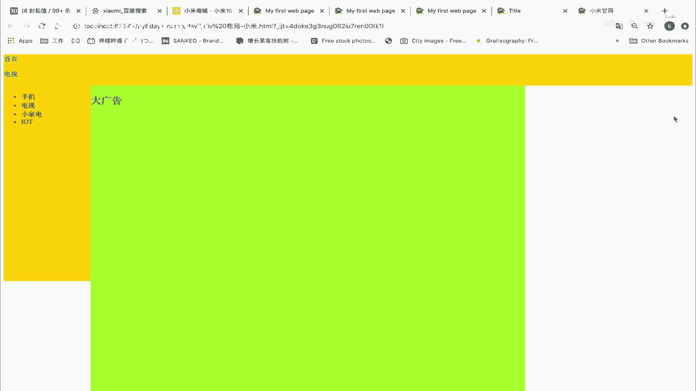

铺满的话，你因为你说我不知道这个浏览器的大，这个宽度有多少。

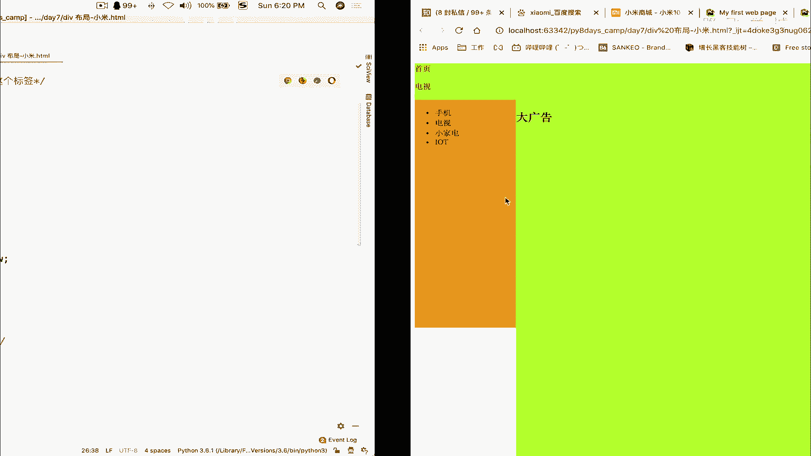

没问题，你可以改成一个百分之百，注意了。

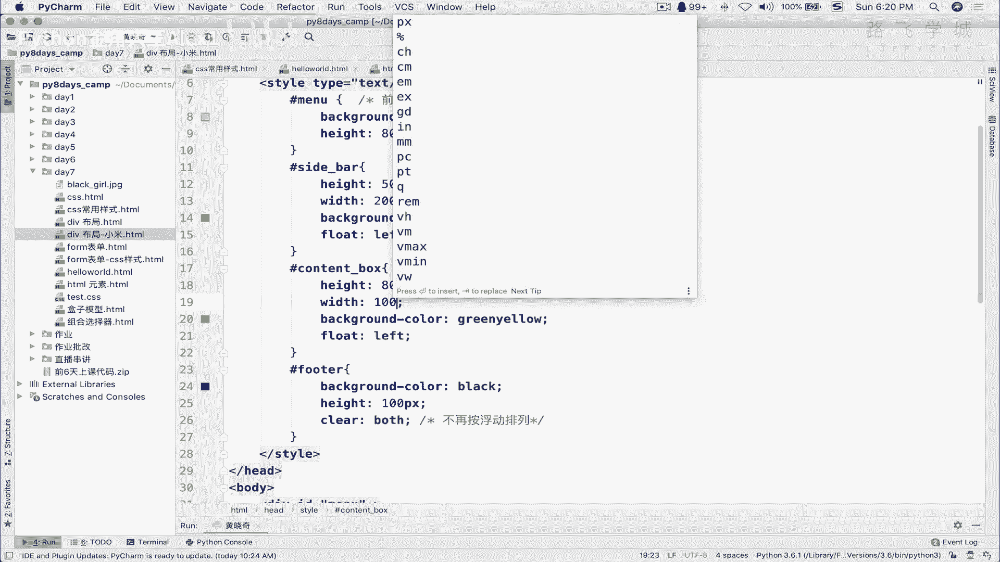

你改成百分之百之后，大家来看一下啊，它就会自动占满浏览器。

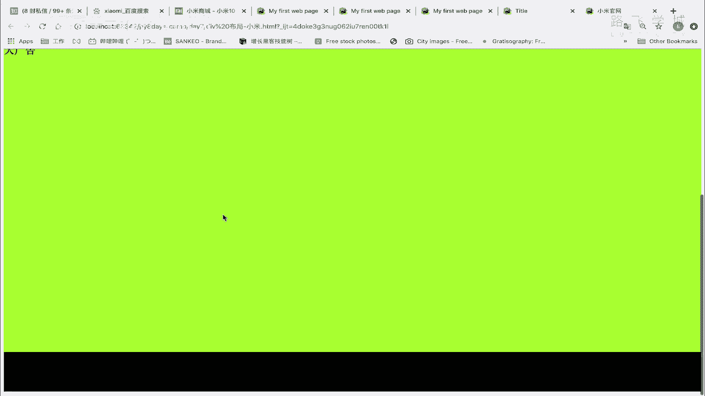

注意了，这又是一个问题，你看它怎么又挤下来了呢，哎没错，因为你写的是百分之百，百分之百的话就会把整个浏览器都占满，注意了，但是他俩这个这个可是在一行的，是不是啊，在一行的，你这个占了百分之百。

他就会挤下来，因为他从左往右排，挤到占满了之后，它就会自动下来，所以怎么办呢，那你把这个也改，这个就不能是百分之百，这个可能是90%，这个10%加起来百分之百才行。

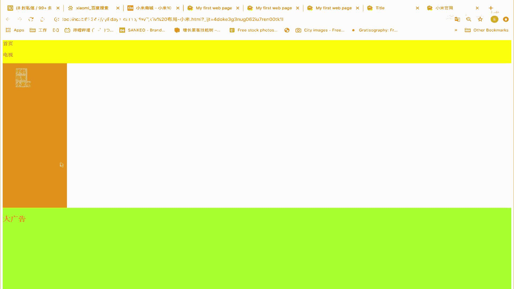

能理解意思吗啊所以你这个的话你就不要百分，比如说10%可以吗，这个是也不能是百分之百，这个就90%。

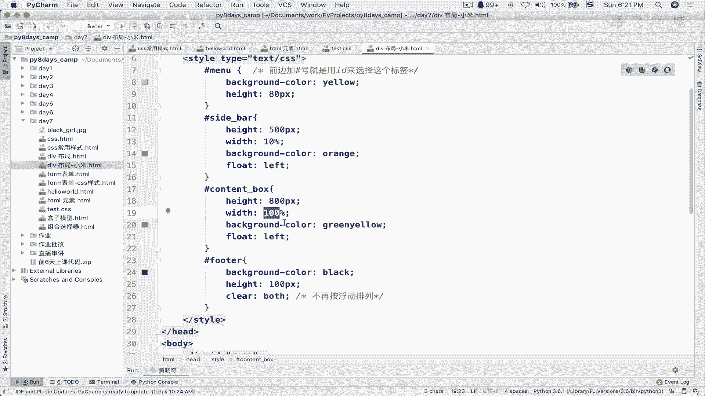

他俩加起来是百分之百，看到没有，这个就拼起来了，好吗啊，一点都不能抄啊，你这91%他就会记下来，可以理解这个意思吗，哎你这样改成百分百，其实还有一个好处啊。

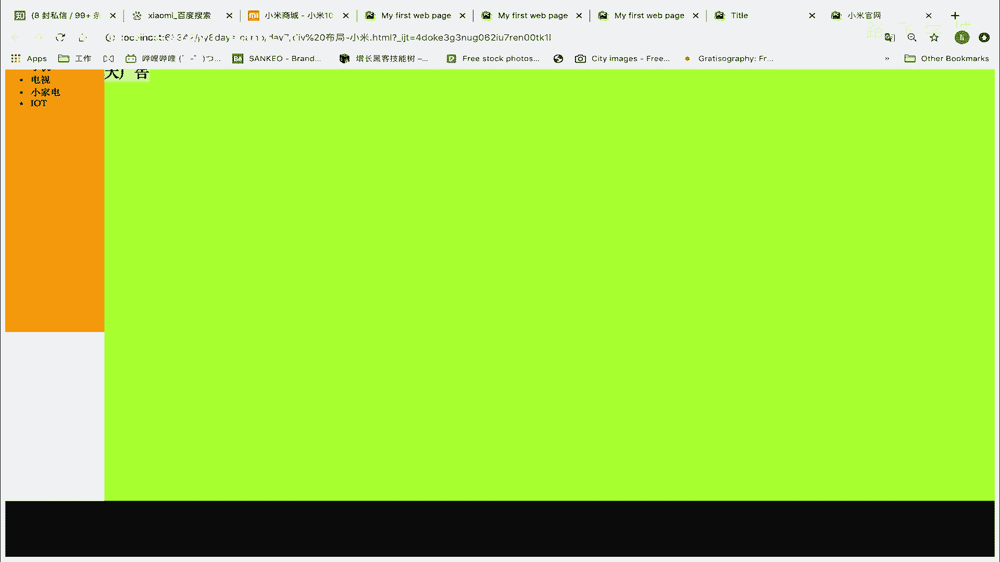

你要是写死了，就是比如说1000像素，它就会你即便的浏览器大小它都会它都会。

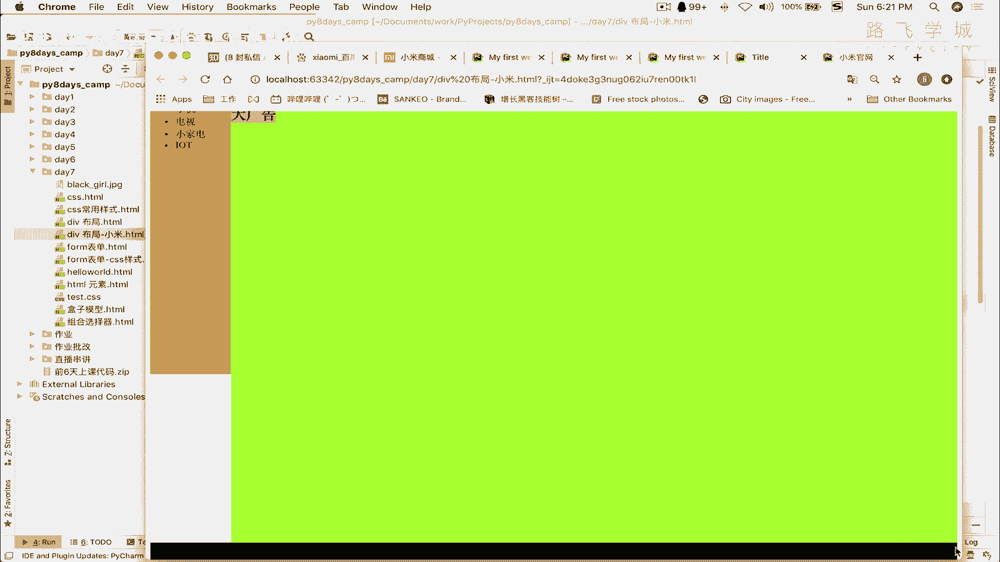

它都会一直以前，但是像这种百分百的话。

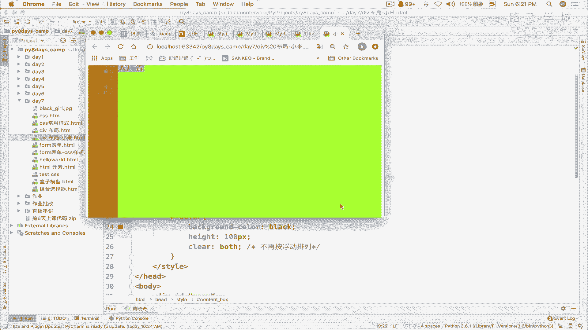

它会跟着浏览器自动变化，看到没有看到没，对不对，好这个就是啊这个东西，所以通过这个我们就简单的理解了网页的布局，虽然我这个非常丑，没错吧，但是啊但是你你你能大概理解这个意思。

就是说像知乎啊什么的，他其实都是这么实现的，明白吧，知乎他们都是这么实现的啊，好那当然你还可以给它好看一点，比如说你这边右边还可以给它加侧边栏对吧，你看人家这种啊，你看人家这种对吧，往下拖的时候。

这种你看它就顶在这了，不动了，这种都是通过样式可以实现的啊，通过样式只不过啊那是属于高级的内容啊。

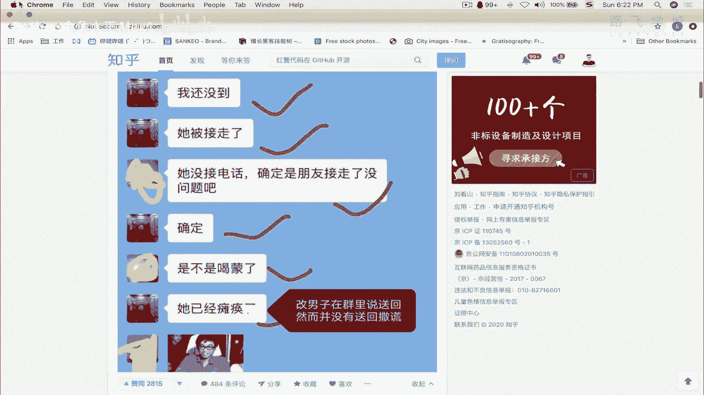

咱们是为了学爬虫才了解这个价格，就不了解不学那个了啊。

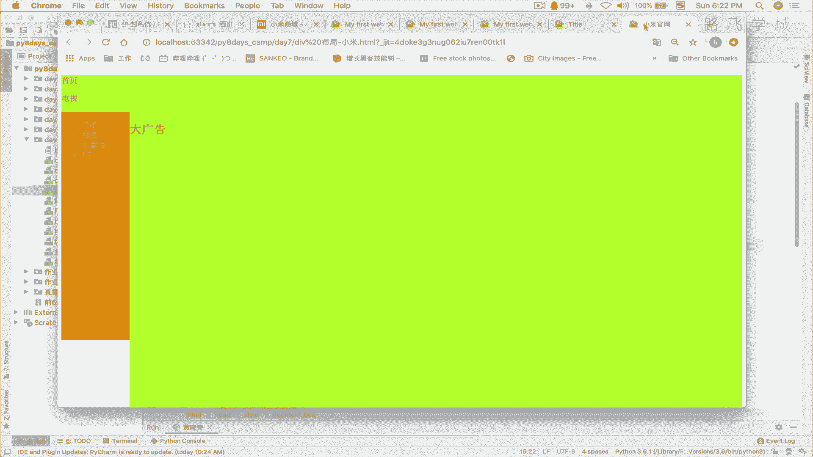

OK好到此为止，你把这个网页布局学一学写一写。

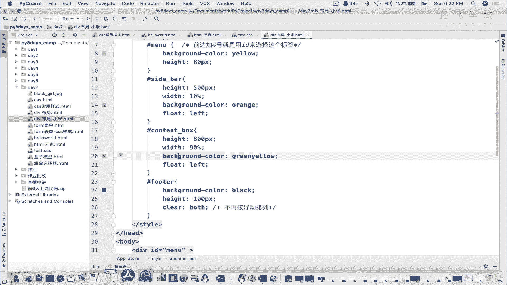

然后呢，我再给你出个小作业题对吧，你看我这里只是啊只是这么这么两个两个div吗，你在这里再加一个行不行啊。

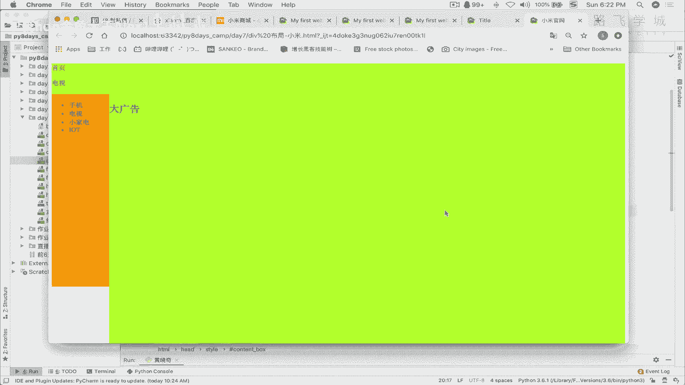

你在这里就像人家知乎一样对吧，你右边还有一些东西可不可以啊啊。

你试试看看能不能做出来。