# 人生苦短，我学量化！比刷剧还爽的python金融分析与量化交易实战课程！——时间序列分析／机器学习算法／股票交易／回归算法／聚类算法 - P46：46.因子打分与排序P47(P46) - 请不要关注我- - BV1Bz421y7Tu

接下来咱们就要去便利啊，我们现在做出来两个data frame啊，因为一个是越高的，一个是越低的，所以说咱们得分别去呃便利这个TFRAME，然后呢对其中的因子做排名做打分吧。

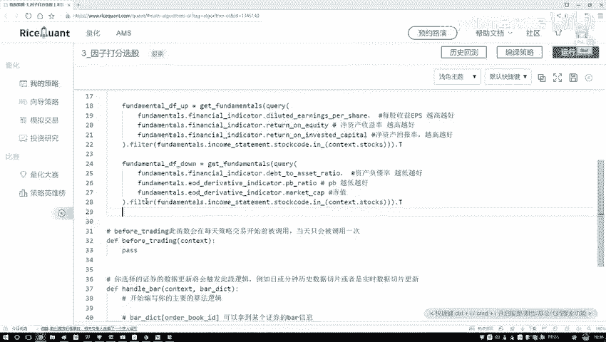

来再来完成这样一个操作，首先呢咱们来写一下吧。

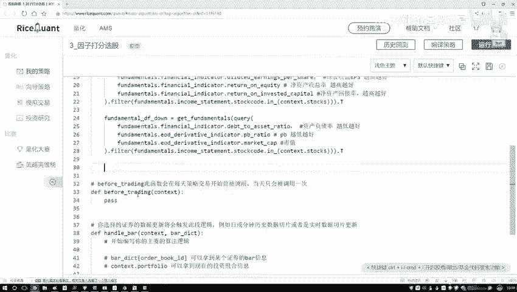

就是我做一个便利而便利啊，我就要拿到其中的每个因子是吧好了，在这个因子在我们的data frame当中，先从这个up来吧，先从越高越好，越来我们要遍地是什么这个data frame啊。

它的结构多少是一个300×1个三的吧，哎我们是遍历数据还是变异因子啊，是要遍历这些因子吧，所以说现在我要拿到每一个音则名字，在这里呢因子名字就是当前啊，我拿到这个第一回来说他这个列名。

我把这个列名转换成一个列子的，哎，这样我就可以去遍历其中的每一列了吧，就是每一个因子，然后呢我拿到了当前的一个因子数据，我要对当前结果做一个排序吧，好了，在当前的data frame当中。

我说啊我现在要去做一个排序啊，在这里咱们做这个排序，做排序过程当中它是一个sort values value拿进来，那现在好了，这个data frame你要排序啊，你是不是得说你要按照哪个列。

做这样一个排序啊，那现在我们有三个列，那就是按照当前的我这个fighter，做这样一个排序，指定好你的一个by参数就行了，然后排序完之后，这一块我就不给他返回值了，直接在这块咱写了一个in place。

等一个true就行，in place是这个意思啊，就是呃如果说你不写这个in place等于true，相对没有这个参数，你只执行这样一个语句，那它就是一个打印的操作，它在原始数据当中啊。

就是不会把你的一个排序结果保留下来，除非你做一个赋值，哎你说这个FDAMAL，再等一个FDAMAL，然后做一个赋值才行，如果说你不想做这个赋值，你直接指定一个in place的一个true，哎。

这也行啊，这是咱们现在做的一个排序，排序完之后，我们还得做一个打分，这个打分啊，咱这个简单起见我就不分组了，直接按照排名顺序啊，就是第一名一分，第二名二啊，就是第一名300分，第二名299。

因为咱一共300个股票嘛，所以说在指定我们当前的一个评分，那就是在我这个房地分当中，对于我们当前这个因子，对待这个因子它是什么，那其实也不重要了，我它是我直接把它改成什么，改成它的一个平分值就行了。

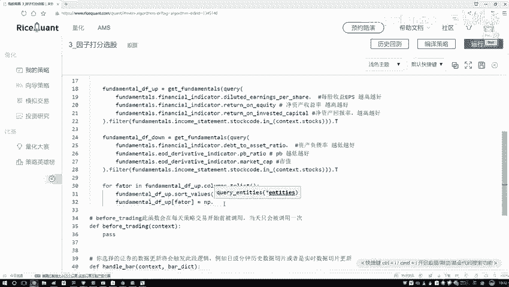

评分值诶这块这样吧，给大家先看一下呃，咱们这个南派这个函数，然后它这个用法在这里啊，就是给大家看一下，import一下这个安排一个NP，在这里我给大家打印一下。

南派当中有一个叫less space方法啊，这个大家写一下less space当中啊，PSE在space当中有三个参数哦，先把这三个参数给大家写出来，然后呢我们来去看一看啊。

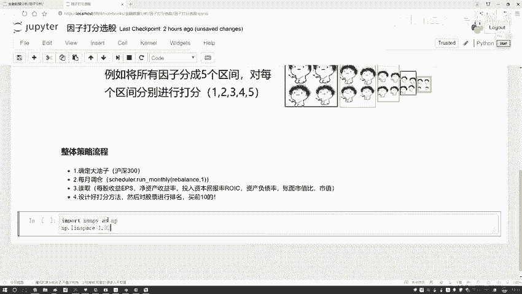

就是当前咱得到的一个结果，比如说我传进来一个一三百三百，我们来看一下当什么从1~300选了多少个数。

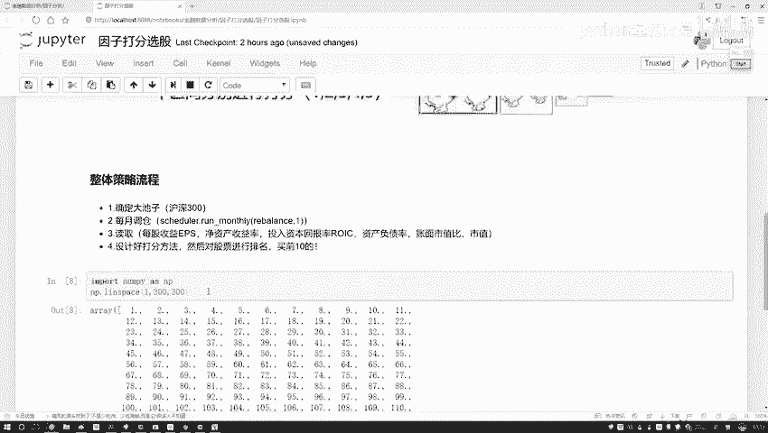

哎就是取值范围是从1~300。

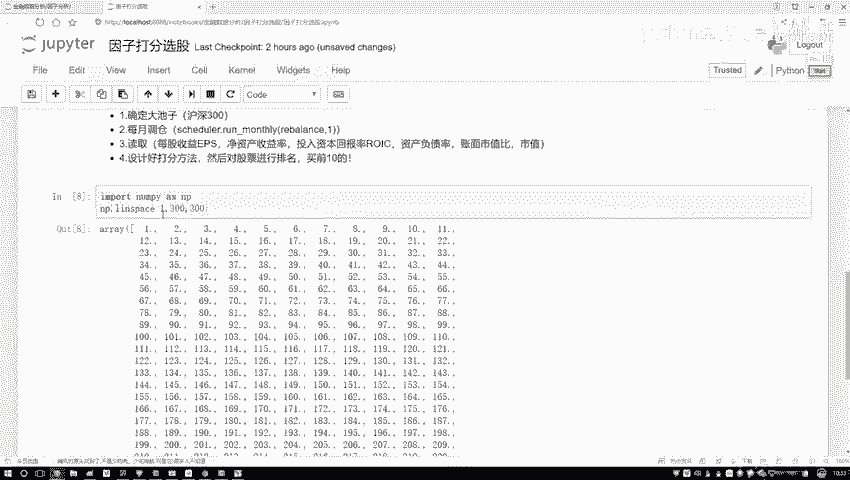

然后选了300个数嘛，那所以说得到结果就123456789，一直到这个300。

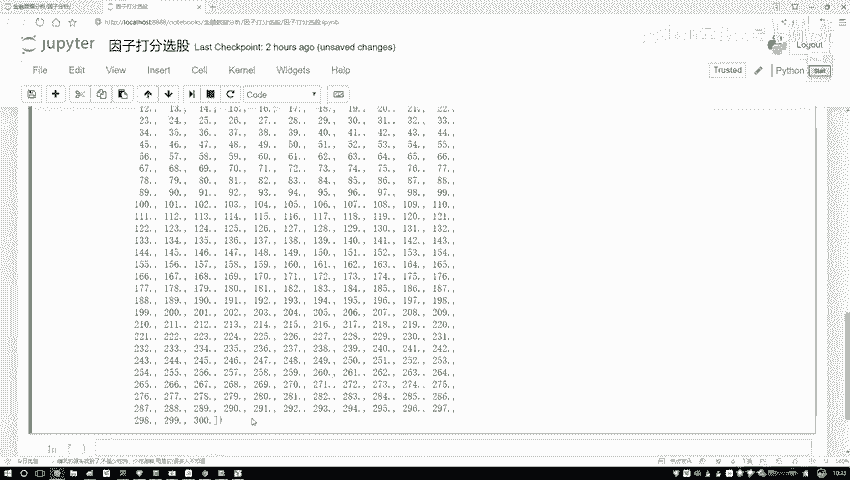

那我们一会儿要干什么，通过这个npless space当中啊，我们去做一个打分啊。

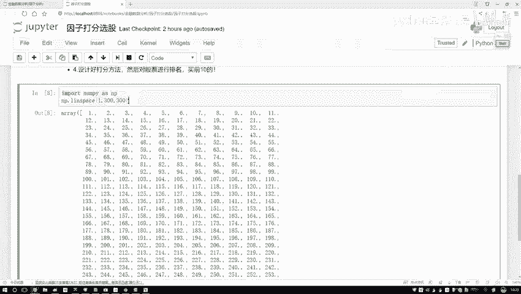

就是排序完之后，那我们按照如果说它是一个越大越好的。

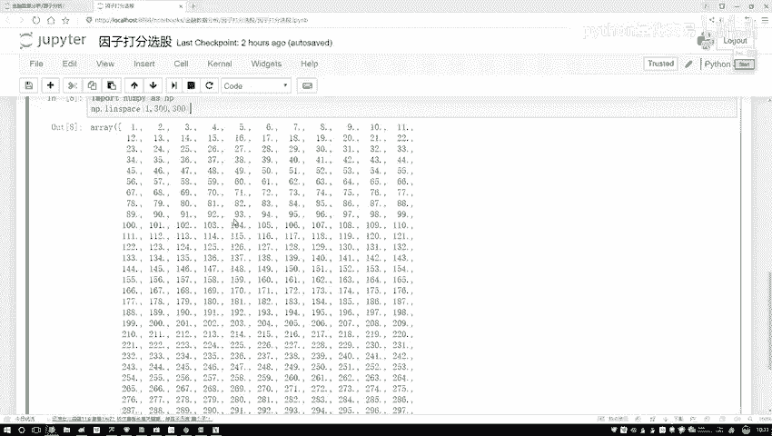

越大值，我给他一个300分，如果越小越好的，我越小的值给他300分。

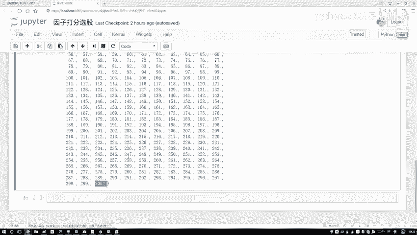

那怎么样描述的越大越小呢，还有这个越小越好呢，你把这个顺序稍微换一换，在这里，哎这是一个一三百是吧，那好了，下一个300~1是不是这样。

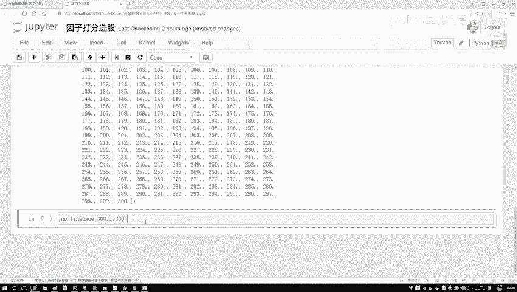

我们可以自己去控制，在当前我们的打印的一个结果。

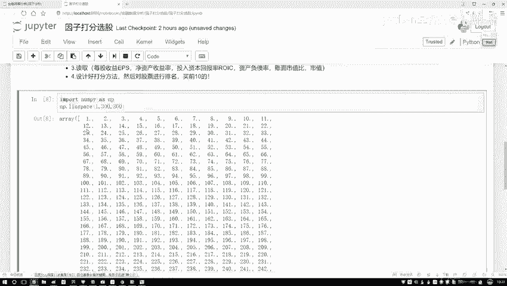

还是从1~300的，还是从一个300~1的space当中，咱直接的就可以去做吧。

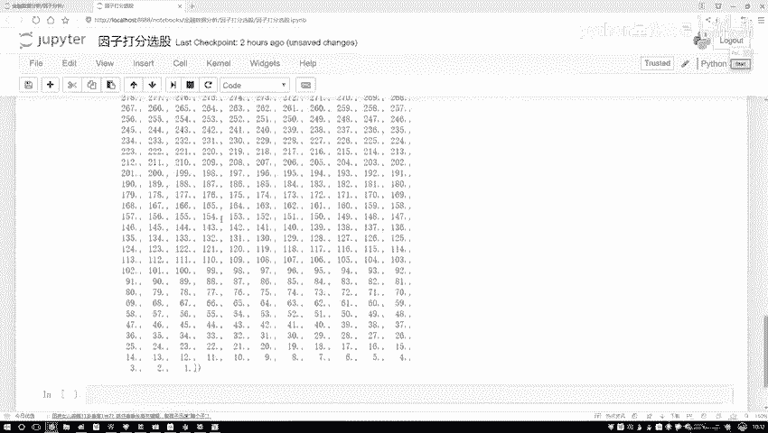

非常方便，还说咱就能帮助我们完成这样一个事儿，然后行了，回来我们写一下吧，在这里咱们现在要得到这个得分了，那就是NP啊。

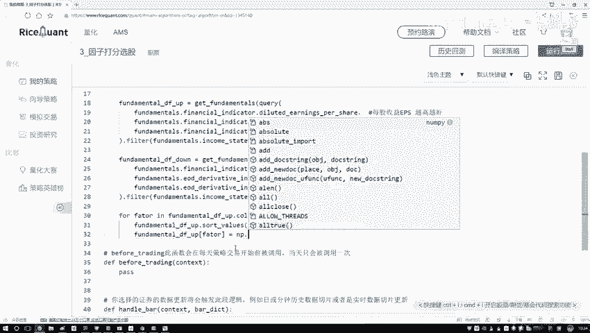

NV当中在这个less sweet当中，S p a c e，我看之前工具包，之前工具包还没导入，在这块我们得自己写一下。

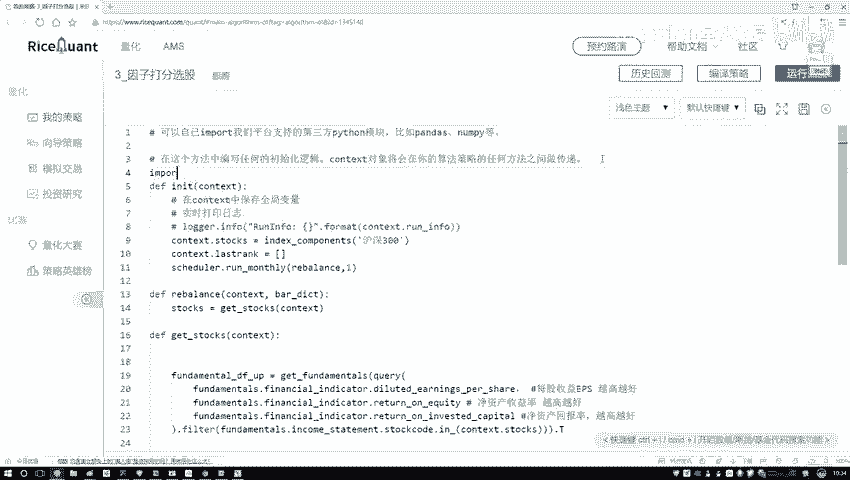

import一下这个NPC一个NP，我再把这个pandas也导进来吧，import一下我们的一个pandas，然后as一个pd啊。

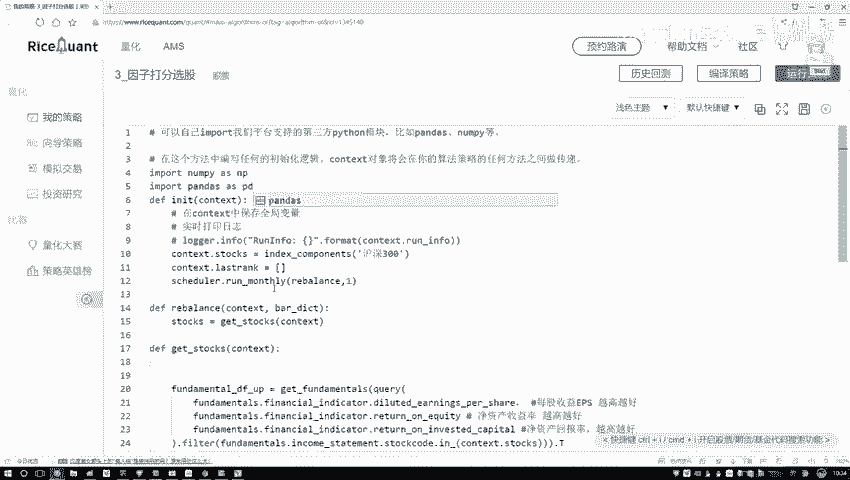

就行了，这是我们要用到两个工具包，在这里咱们先是南派点NB当中呃，第一个就是一个我们现在是希望它是一个，我看周长是越高越好的吧，那也就是从一到上咱们的一个我300，然后这一块我不写300了。

我就写咱们一共有多少股票呃，一共就是有这么多个股票，然后其中我们取的是一个啊，这个一共有300个数，相当于就是排名一会儿我是从小到大个去排啊，这是因子最小的，因此中间的因此最大的。

然后我们得分就是这样是一，然后中间可能是150，然后这块是个300啊，这是咱们的一个排名，直接做这样的一个南派点less space，相当于我给他设计了一个打分好了，那咱们现在做完了这个打分操之后。

接下来打完分之后，哎我看一下这里这块怎么又写这个300了呢，把这个参数改一改，咱不用300，用一共的个数，这样是比较靠谱的行了，现在我们得到了一个越高越好的这一块，我写一下，就是呃对越高越好进行打分。

然后呢接下来我复制一下，咱还有什么。

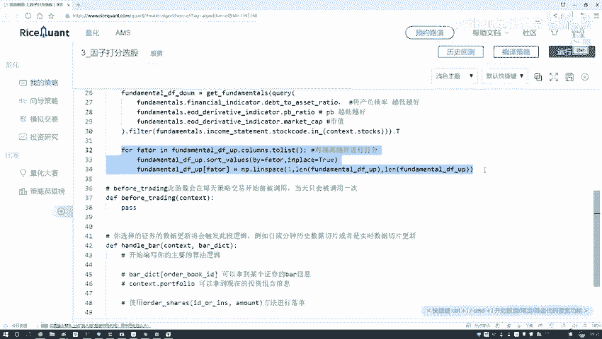

是不是还有一个越低越好啊，把它也拿过来，还是一个for循环，在这里我说改一改啊，这是越低越好，这个打分越低越好的时候，我们把这个data frame稍微改一改，这里咱们要去便利。

是当这个data fm了，然后他的一个SVALUE啊，这个东西都没有去变的啊，在这块所有的参数来对我们来说都一样的，然后这里我们改一改，之前是从这个要300是吧，那现在既然越低越好了。

那越低的那肯定多少越低的应该是一个300，我把这个参数去掉，然后把这个E放到这个中间，相当于从这个300~1，咱要这么去打分，哎这就完事了吧，这里我们写了两个顺序，就是要是越低越好，还是一个月越高越好。

哎咱们把这两个得分分别算出来了，那现在也相当于我们还是一个啊，一个表300×3的，然后两个表嘛都是300×3的，那接下来一会儿我要去做这个汇总总分，所以说呢我们得把这两个表怎么样，先合并一下吧。

然后去算我的一个总分，属于完事了，来来去合并。