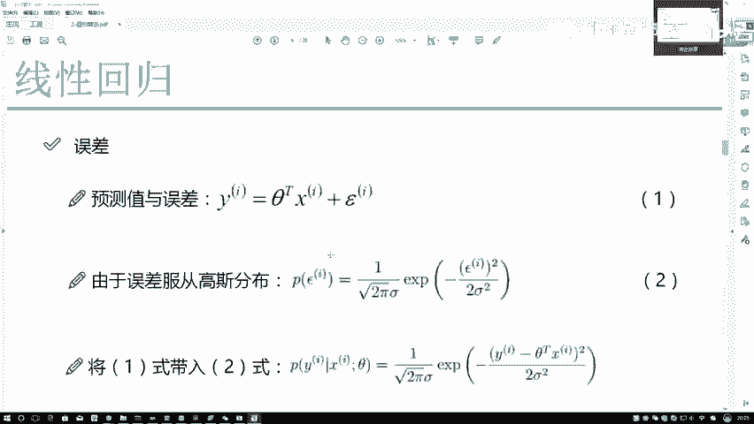
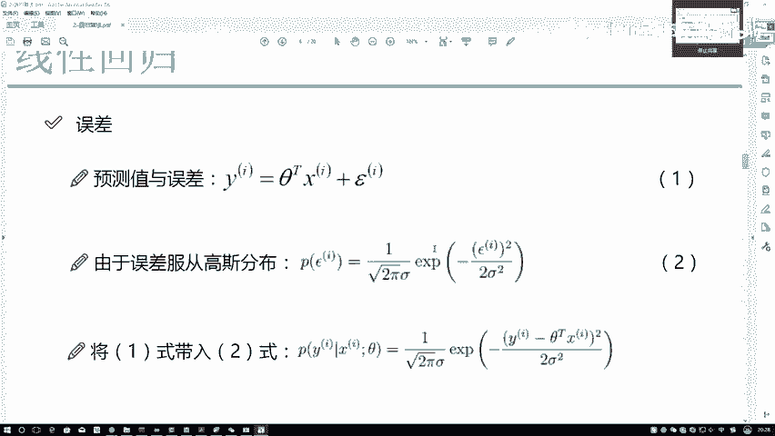
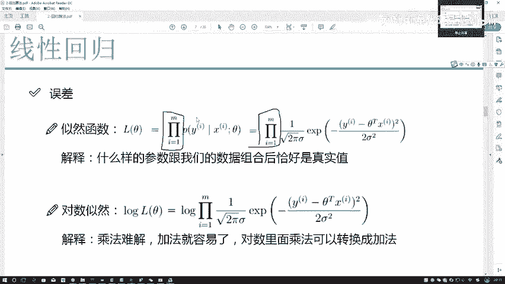
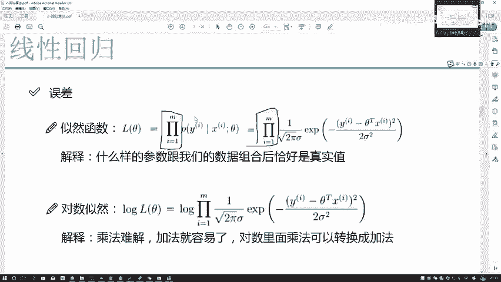
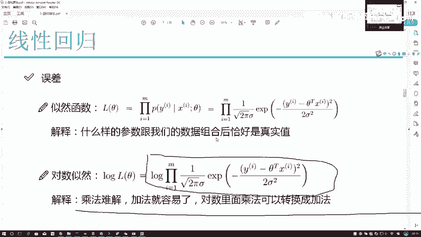
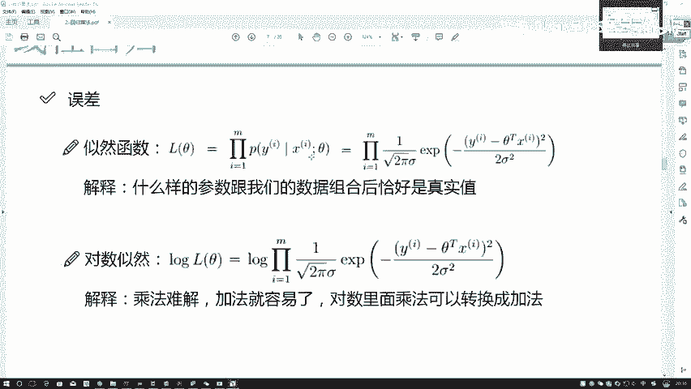
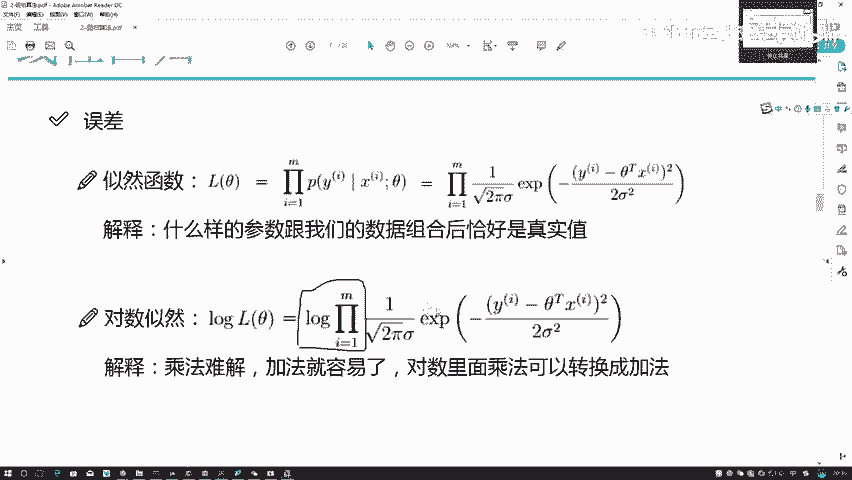
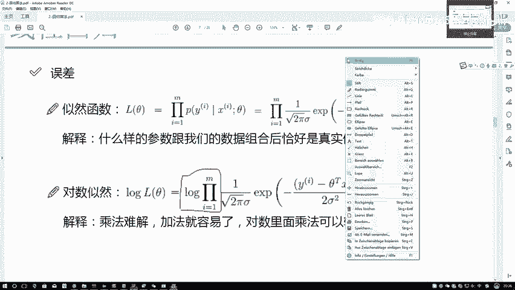
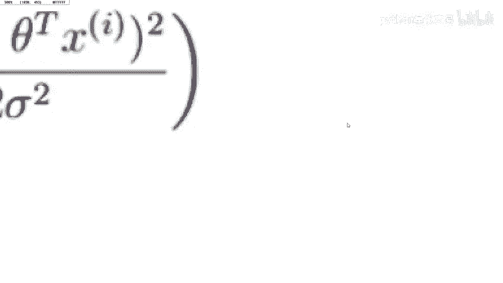

# 人生苦短，我学量化！比刷剧还爽的python金融分析与量化交易实战课程！——时间序列分析／机器学习算法／股票交易／回归算法／聚类算法 - P53：53.似然函数的作用P54(P53) - 请不要关注我- - BV1Bz421y7Tu

然后接下来我们再来看下一点字典当中啊，我们这点难度当中可能难度有点大了，我给大家得来观察一下，现在我们要求的东西是什么误差项，哎咱们也知道了，X是我的数据，我们也知道Y呢是我的标签，我们手里也有了。

那现在差了一点什么，现在是不是差了一点，当前我的一个参数应该是什么吧，我的C该怎样进行求解，这是我们现在要落到的一个重点，那既然刚才解释了我们的一个误差项，是服从于这样的一个高斯分布。

我可以把这样一个高斯分布的表达式，先列出来吧，这有个高速高速分布啊，他表示我估计大家可能还记住啊，就是根号下2PAC1%，然后这个EXP表示这是那个100，约等于2。7亿，那个数二倍的解码方。

前面是负的，然后这一块就少了一点，正常情况应该少什么，应该是你的一个误差项减去什么，减去一个均值吧，但是呢咱刚才是不是说均值是等于零的，所以啊在这里我做了一个简化，就是我没有写这个缪。

它的均值均值是零嘛，那零就是任何数减零都还得这个数嘛，我就不写了，这是个平方向，那现在呢我把当前的高斯分布给列出来了，那有这个高度分布之后，我们来看它是关于谁的，它是关于误差项的吧。

那你说我最终结果我希望找的东西是谁啊，误差是多少，我关心吗，我要求出来一个具体误差，是3万还是2万还是8万吗，这不是我要求的吧，我要求的是一个C吧，所以说我在这个世界当中，我要转换一下。

把跟误差项相关的值东西，或者把跟误差项相关的式子，一旦我们能转换成跟C相关的这件事，是不是就可以往咱们求解上去靠了，再来看一下吧，这个东西怎么一转，在这里我可以写一下，我说Y减去一部系统等于什么。

等于一个CTX，那现在我们就可以做这样一个转换了，我干什么，我把啊不是在这块应该这样，应该是这个Y减去CX等于一个一部系列吧，这样才能把这个一系列，用Y和CT做一个代替吧，那此时我们来看。

如果说我做了这样一个代替，就把它移到左边，做这样一个之后，是不是这一项还有这些东西就都没有了，都用Y和C来进，就是来直接进行一个替换了吧，咱们得到这样一个结果，这个结果当中。

我先给大家先来进行一个通俗解释，可能大家来看这个式子，哎呀觉着里面涉及公式有点多，为大家一个解释一下什么意思啊，大家先来看是不是这回事啊，现在通俗说一下，我们现在要找的是一个C，要找这个C他要干什么呢。

我希望这个C跟我的这个X组合完之后，还是不要找希特和S的一个组合呀，不是单找希特吧，希特和X的组合完之后，我希望他跟真实值应该怎么样，越接近越好吧，所以说我现在能得到这样一件事。

我说斯特和S组合完之后成为真实值，成为Y的可能性应该怎么样，越大越好吧，再来捋一捋，我看大家是不是这一件事啊，斯特和X组合完之后，能成为Y的可能性应该越大越好吧，这个是我们现在要解释的一点。

那这点当中我们还涉及到一个事儿，这叫什么呢，我通过这个自然函数来给大家解释一下，咱当前指定的这个方程啊，他到底是做了一件什么事，我先说一下，给大家举个例子吧，比如说现在现在比如前一社保去澳门了。

澳门当中估计大家也听过，澳门当中里面有一些赌场吧，在这些个赌场当中啊，比如说我现在我去想试一试，我在试的过程当中，我估计大家都跟我一个心理，肯定不敢自己先玩，现在怎么样，看看别人能不能赢，是不是。

假如说这边来了五个老哥，五个老哥一个去玩，我看第一个老哥赢了A，可这是我觉得赌场当中啊，能不能赢是受一组参数来控制的，然后呢第一个实验样本，第一个老哥去了，他赢了啊，这是我现在我观察到的一个现象。

然后呢第二老哥也去了一下，赢了参数是怎么样，你说多少的参数它是不会去变的吧，在参数不变的前提下，我观察到第二样本它是不是也赢了，第三个样本，第四个到第五个老哥他却都赢了，那此时我认为我可能认为什么。

此时呢我可能认为，接下来现在呢有一组参数，控制这个赌场最终的一个输赢，所有样本我观测到这个结果都赢了，那我会认为接下来我再去玩的时候，也会有100%的可能性能赢，那这件事说明什么。

我为什么会有100%的可能性说我能赢，因为我认为这个参数，它是根据我的数据来决定的，或者说我的参数是跟数据相关的，我的数据能验证这组参数，所以我觉得前面五个数据都赢了，我再去也100%会赢。

说白了虽然函数描述这样一个事儿，什么样的参数跟我们的数据组合完之后，恰好是真实值，这里我提到一点什么，我们的数据吧，参数最好参数肯定是不变的，我们的数据也是不变的，这就是我们要找的一个结果吧。

在这里我希望大家强调一点是吗，来看看这个符号，这个符号描述什么意思啊，它是一个累乘吧，为什么会有一个累乘，I从一开始到M什么意思啊，你说现在我在赌场当中，我去观察，我说前面一个老哥赢了。

你说你说我敢说我下一次我就可能赢吗，我可能觉得他是个侥幸吧，前面有俩人，我可能觉得侥幸，前面有1万个人都赢了，我再赢不了，那就不可能了吧，所以说I从一开始到M，我们是希望通过大量的数据去找到。

最合适的一个参数。

相当于我们要做这样一个估计，希望用的数据越多，是不是结果应该越准确一些啊。

这个就是我的一个三角函数当中，为什么会有一个累乘诶，他为什么是乘法，不是加法，再来想一想，我们之前是不是提到过啊，之前还没提过地点，在数学当中有一点我们刚才说了一件事，叫什么独立同分布。

一旦独立同分布的时候，有一个前提叫什么，我的一个联合概率密度等于边缘概率密度，是什么乘积吧，不知道大家还能不能回想起这样一个事儿，这个事儿为什么成立，是在独立同分布的一个前提下，咱刚才是不是恰好说了。

我这个数据是不是满足于独立同分布的，所以说当前我们用累乘是一点毛病没有的，所以呢请大家解释第一点，它为什么是一个里程，第二点第二点来说呀，我们接下来就要进行一个估计了，估计过程，当中我们来想一想。

我问大家一个事，你说如果说咱现在要做的就是什么样的，X跟C组合完之后，能成为Y的可能性要越大越好，那这里这件事该怎么解啊，来看这个东西，这是什么，这是个乘法啊，M如果说我说我都不往大了，说等于1000。

那此时这个式子它是什么，它是一个1000项的乘积吧，那大家可以想一想，这1000项的一个成绩，对于一个乘法问题来说怎么样，是不是非常难解的一个东西啊，你见过1000项的东西乘在一起让你去解吗，没见过吧。

那什么问题可能是好解一点啊，加法吧，乘法不好解决的东西，我们可以转成加法，那这件事咱们该怎样进行转换呢，我们来看一下，谢谢大家列出来这样一个式子吧，比如说在对数当中。

我写上这样一个A乘上一个B它等于什么呀，哎比如说log a b这里面是个乘法是吧，比如在这里，你看咱们都是乘法吗，那如果说咱们现在默认都是底相同的，他等于什么对数的乘法，底加相乘等于ram相加吧。

所以说我现在得到了一个前提，什么通过一个对数，可以把一个乘法问题转换成一个加法问题吧，这样咱这问题是不是就好解了，像我刚才说的这1000项乘一起，那简直是扯淡一样，不可能去算吧。

但是呢一旦我转了一个加法，这件事他是不是就好解决了，但是当你在做这个转换的前提的时候，我们要想一个问题，你转换完了之后，但求解的结果是不是变了，之前我求这个系数三函数刚才解释过了。

此时一旦你加上了一个对数之后，凭什么能加对数，加上对数之后，你的求解的结果是不是要发生一些变化呀，比如现在是十，你这会变成什么了，这块变成了一个log10了吧，那结果是变了，那变了还成立吗，在这里啊。

我需要大家有个前提，就是什么，我们现在要求的是什么呀，我求的真是这个LC的，我的三函数值等于多少吗，我这要求这个log lc的等于多少吗，我不关心我关心的是什么呀，比如说现在呃，现在比如说先这样吧。

我就画一个值吧，假设说刚才我说了这样，我说什么样的X跟C组合之后，使得的结果能越大越好，那这块我说我这个X轴我是一个C，这个是我的一个结果吧，那在这个基础当中，你是不是要找到它这个哪个C。

比如这块有一个C，它值它能够使得结果达到最后最大的，但此时我们要求的是不是一个极值，而是一个极值点吧，哎注意点，我们到底要求极值，还要求极值点，这个L底等于什么，我关心吗，我根本不关心啊。

我只要知道吉他了，我的回归方程C1哎，这里随它，它不是一个值啊，它表示的是比如说一组好像一组向量了，C 1c2，一直到这个SN，他表示这组结果吧，我把这组结果求出来就可以了，所以我要找的它是一个极值点。

当我求极值点的时候，如果说我改变了当前这个方程，比如前面加上一个对数，虽然它会改变我的一个极值，但是它不会改变我的极值点，这样说没毛病吧，那此时当前我依旧是个求极值的任务，他俩是不是等价的。

那就是等价的吧，所以我们能做这样一个对错，自然因为极值点它没有变极值，对我来说我不关心，这样我们就给它转换成了什么，把一个乘法任务转换成了一个加法任务吧，由加法任务咱这件事就好解释了，我们来看一下。

对于当前我的一个对自然结果之后。

我们该怎样进行一个求解，首先第一步要干什么。

来看一眼，再回头看一眼，这是一个什么，这是个里程吧。

累成会变成什么，在对数前面就是在累成前面加了一个对数。

等于变成了一个累加的一个对数吧，你看这里。

