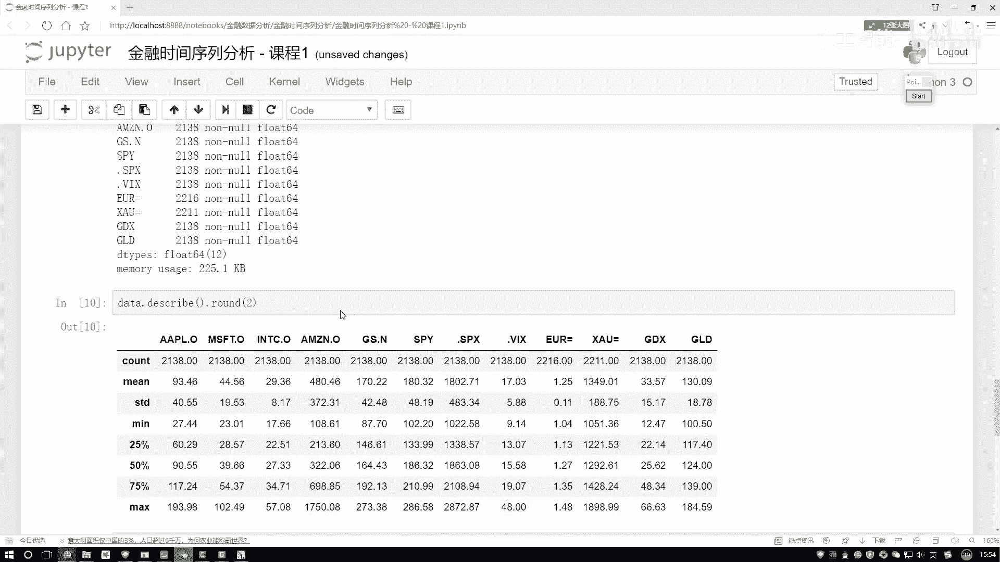

# 【整整198集】这太完整了！python金融分析与量化交易实战课程，全程干货无废话，入门到精通一步到位，(数据挖掘分析／大数据／金融／股票／) - P2：1-金融时间序列数据统计分析 - 人工智能- - BV13K11YiEbb

呀哈可能这个时间的格式唉。

他就是用一些杠来表示的，跟我们哎就是接下来要处理的一个时间数据，格式可能还不是特别一样啊，这里唉给大家说一下，有一个比较方法，比较简单的方法，在这块可以怎么样直接的加上一个参数，去处理什么。

处理一下我们的一个日期数据，把它呢指定成一个数值啊，就可以了，这样咱们现在读建一个数据，我把这个再稍微放大一点，这样咱们现在在读进来这个数据啊，它就是一个标准的一个时间格式，我执行一下，咱们来看一看啊。

好了，第一步我们读数据，那你看现在我们展示出来的一个结果怎么样，是不是按照咱之前那个要求来展示出来了啊，1月1日这块他都是乱值啊，因为我们数据当中啊，1月1日当中确实都是，你看都是空值吧。

只有个别几个指标有值，然后下面呢在这个1月4号五号六号，咱们结果全出来了吧，并且我们来观察一下，你看这个data，它是不是当做是我们的一个索引的呀，好了这里给大家啊，完成了我们前两步以时间为索引。

并且呢我们把这个格式转成了标准的格式，只用一个名字吧，叫做一个data啊，指定完data之后，然后为了让大家看舒服点，在这块还是点HIIT一下啊，这是我们的一个数据，有数据之后呢，我们来看第三个问题。

数据啊，咱可以很轻松的我就给它做出来，那下面当我想去做一个展示的时候，那你看他说了，绘制一下呃，就是绘制展示各个指标的一个走势情况，哎各个指标都有哪哪些指标，这是一个指标，就是一股价。

这个股价这个股价这个股价还有四个公司，股价后面呢还有各种指标，我们希望在图当中都给它描述出来，该怎么办呢，我先给大家说，用最简单的方法啊，pandas当中有一个内置的点plot at一下float。

就是要画图了，然后呢你可以去指定当前咱这个图，它的一个大小，我也指定的稍微大一点，指定完它的大小之后，然后咱先来看一看吧，画完之后它的一个结果哦，你看这里把这个结果呃画出来了。

但是这个结果跟我们要求好像有点不太一样，你看我们刚才要求啊，就是要展示各个指标走势情况啊，其实这里也是各个走势，但是我能不能把各个走势给它分出来呢，也可以吧，在这块你可以再加上一个参数。

如果说你想把它画到一个图里，那你什么参数都不用加了，如果说你想把它呀按照一个子图的形式做展示，你可以加上一个suppose啊，给它指定成一个数值，我们来观察一下，指定完之后。

你看这回我们这个指标第一个走势，第二个第三个，第四个啊，第五走势全部展示出来了吧，当然啊就是具体哎用哪种方法，看大家自己的喜好，同一图当中你要做对比也行，你按照一条线一条线去画，这也没问题啊。

这个是我们现在把当前结果唉，做了一个基本的展示好啦，看一下我们当前的一份数据，给大家先做了基本的一个演示操作，导入数据啊，对我们来说没有什么太大的难点啊，画图啊，你用MAD plot。

用saber还是用pandas当中内置的这些都行啊，没有一些限制要求，喜欢用哪个咱用哪个就得了，然后这块就是我把数据当中啊，一些指标给大家列出来了，你看有这个苹果的股价，微软的股价啊。

还有几个就是怎么说，都是几个排在最前面的股价最高的一个公司啊，下面还有一些他实际的一些啊走势，一些汇率的，还有黄金的啊，各项指标大家感兴趣，简单参考就行好，我们说第二个，第二个呢我们要做一个统计分析了。

做统计分析啊，其实最直接的我们可以先做什么，拿到数据之后，你可以先看一下数据的一些基本信息吧，比如说数据当中啊有多少样本啊，这里有2216个啊，一一十六条也相当于2000多个样本。

然后我们的索引是从这个呃，10年的1月1号到这个18年的6月29，可能不是每一天数据都有啊，这是咱们当前拿到的指标，然后客观指标都是flow，Flow，64类型的都有是吧，然后这块可能有些指标当中啊。

有一些缺失值，你看呃最多的是2138个，然后最少的呃呃不是最多的，可能是2200多个，最少的是2100多个啊，这个是咱们大部分数据当中都存在，那么几十个缺失值，好了，我们再来看在这个任务当中。

我们来看一下吧，他又要我们做什么，我说第一步啊，我要在数据当中啊啊各项指标的一个统计结果，那各项指标都有什么统计结果啊，你可以去统计诶，当前啊他那个就是不为零的一个样本，有多少个它的均值。

它的一个标准差，它的中位数最大值最小值是不是都能统计啊，这个方法鼠比较简单啊，咱之前给大家说过，直接对我们的data frame啊，进行一个什么点describe就可以了吧。

在这样点describe过程当中，我们还可以设置，而不是设置参数，可以对它加一些限制，你看这里，如果我直接点describe完之后，你看这里啊，它这块小数点后都有多少位，那个123456哇。

这个位数点太多了，你说实际当中，我们可能不关注分以下的结果了吧，那怎么办呢，你看这里有要求了，小数点后，我说只保留两位数不就行了，在这一块，如果说你想对小数点诶做一些操作，咱该怎么办。

你加一个round啊，指定一个小数点后几位，我看这个要求是几，这里要求它是一个呃，这里后两位即可是吧，所以这块咱指定一个二就行了，你看我指定完二之后再来执行一下，现在这个九怎么样。

是不是看着比刚才清晰一点了，因为小数点后嘛，咱这个结果没有那么多了，是不是啊，这个是当前打印出来了啊，我们各个维度的一个统计指标值，你看有它的一个个数啊，有它的一个均值，有这个标准差，然后最小值。

然后最大值，然后这个四分啊，1/4，然后1/2，3/4的这些结果咱是不是全有啦，这个是我们做了一个基本的统计的操作，然后呢我看这块它接第二个要求啊，第二个要求就是用聚合的方法，将多种的统计指标汇总。

那给大家看看吧，都有哪些种统计的方法，最常见的，或者说大家最能想到的就是对数据点min一下，点灭完之后你可以打印出来哎，当前各个维度它的一个什么什么，就是当前这个维度，然后各个指标的一个结果吧。

不光点min，然后点STD，然后点那个最大max min是不是都可以啊，那怎么样把这些指标我展示到一起啊，你看这一块给大家列了，哎有一个函数是吧，其实呃你方法有挺多的，那既然这块我列出来了。

咱用当前的诶，这个聚合的方法去做一个指标的汇总，那来直接指定一下吧，对于我们的data，你要执行什么操作啊，把各个你统计的指标给我汇总起来，那汇总的过程当中啊，你就要去在这里写进来了。

你希望有哪些个指标，你是不是得告诉我呀，咱写一些常见的吧，那最小值啊是个最常见的，然后呢最大值也是比较常见的吧，最小值啊，然后最大值，然后还有什么，还有这个南派当中的，我可以计算各种各样的指标啊。

一个均值，然后再来一个南派点一个标准差，然后我看看还有什么，还有一个呃中位数是吧，把这几个指标咱先展示出来，然后我执行一下，执行完之后呢，你看这里是不是列，都是我刚才选出来的各种各样指标吧。

然后呢这一块你看统计出来了最小值，最大值，均值s std啊，还有一个中位数，是不是咱结果全都有了啊，我们可以用当前这个聚合函数，把你想要统计哪些个指标你全放到一起，是不是也行啊，你可以不用啊。

参照这个describe当中，可能有些指标你不要，你只想选择其中一部分，是不是也行啊，自己来写，自己来列啊，想选什么咱就选什么，是不是就可以了好了，这个就是我们的一个基本的统计的操作啊，还是比较简单的。

在panda当中啊，基本上很多操作吧。

