# 【2024年Python】8小时学会Excel数据分析、挖掘、清洗、可视化从入门到项目实战（完整版）学会可做项目 - P100：06 数据分析S03D 03自动化办公（下） - Python金角大王Alex1 - BV1gE421V7HF

一个两个三个是四个呀，对不对，好，那么这个事儿，比如说这个零，然后一然后二的事怎么办，是不是可以用循环的方式来解决呀，所以我们现在拿到的每一个pr，就是相当于拿到011和二了啊，这三个东西好。

所以我们把它每一个里面的rs呢，都给他搞出来啊，这边我们做一个啊输出print，对吧，一个列表就是一个print，这是第二个列表，然后这是第三个列表，然后每一个列表。

我说可以再进一步的对它进行怎么样迭代啊，对吧，我每一个pr点rs都是一个列表，所以说这个列表我依然可以像上面这样，继续迭代它，那怎么迭代呢，For run in paradirs，是吧。

然后现在啊你拿到了所有的run以后，看这边我是不是可以拿到里面的文字了，是不是好回来，那我们在这边啊，我直接想拿文字，拿什么，拿run他的text属性，看看这东西就拿出来了对吧，一个个都拿出来了。

那我们看啊，为什么这块一个段落由多个解组成。

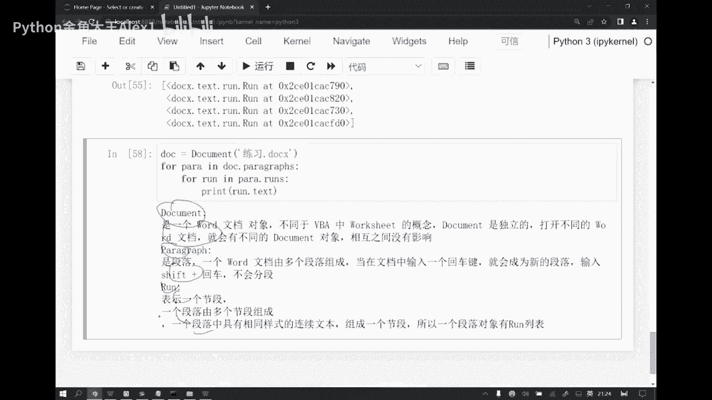

为什么它是一个单独的run呢，为什么把把这个文件打开就知道了，这个文件我们给它展开打开方式，Word。

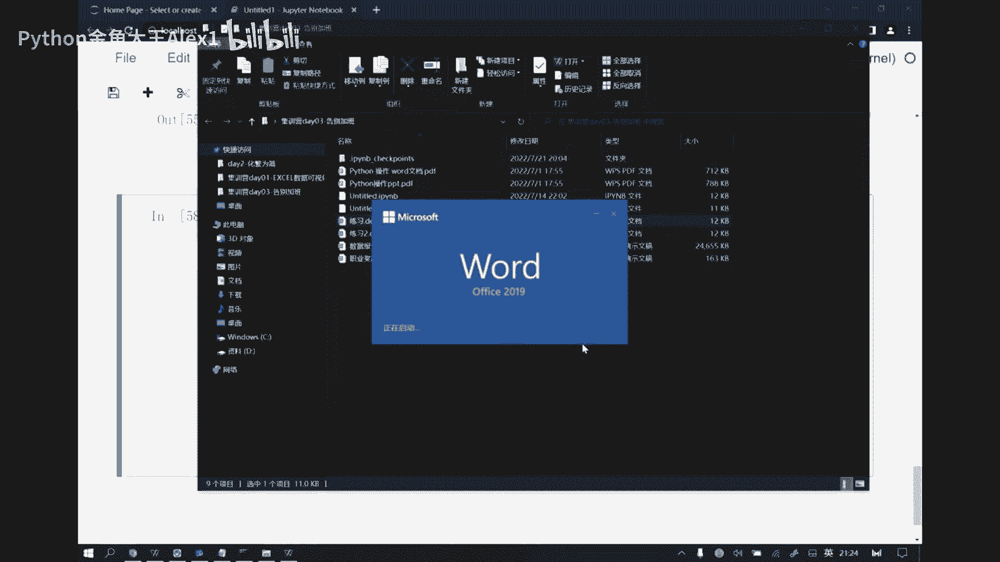

因为它是个红色的，是不是啊，哎好啊，然后那么下下面啊，我们再去干嘛呢啊，我们可以把这个文字给他换一下啊，给他换一下，怎么换呢，比如说我现在这个run点text，我我们比如说他如果是我就这样吧。

我把这个document这个东西啊，我给他做一个修改，我让它不叫document，我把它改成叫一个啊叫dancer的文档，把这个事解决掉，那怎么办啊，就是你拿到了这么多个run，我要怎么样呢。

我说要可以对你这个run进行一个判断的，我判断你的文字是什么，比如说我判断你的文字里面是不是包含什么，或者你的文字是不是以什么结尾，或者你的文字是不是以什么开头，这种需求我是都可以搞啊。

我现在只是不知道函数而已，比如我想知道一个文字是不是以什么开头的，那我就怎么样，我搜一下Python中字符串如何判断以什么什么开头，对不对，或者比如说我想知道这里边，它这个是不是包含某个子字符串。

那我就搜一下Python当中如何判断一个字符串，包含一个子串对吧，你就可以把这种需求都定位出来，那现在我们想知道，我想把这个document这个东西，给你做一个文本的变化怎么办，我也要做一个判断。

因为别的我不能变，只能变这个对不对，所以我要做个判断，怎么判断我判断这个run点text它是不是等于，如果是怎么样，把这个run点text给你做一个重新赋值，我们叫dancer的文档。

好其他的位置怎么办，不动哎，其他的不动，看我只做什么，我只做这个if判断这个if判断条件什么是，如果我某一个run的文档，它刚好等于了document，我就把这个run的文档文文文字给你换成这个。

如果它不是呢，他如果不是呢，我说什么都不做呀，这个代码是不执行啊，对不对，好，现在来运行，OK那么此时你的word文档改完了吗，同学们改完了吗，没有改完啊，为什么没有改完，我刚才说了。

我们在代码当中操作这个doc，它在哪儿啊，它是不是在你的内存当中，内存条当中，你的doc x文件在哪啊，存在你的硬盘当中，硬盘当中好了，你现在改的是谁，你现在改的是这个run的文字，这个run是谁。

run是这个para para，这个pr是谁，PARR是这个doc的doc是谁，doc是这个东西，这个东西存在哪，存在内存条当中，所以你现在能不能，你现在这个练习这个这个文件存在哪。

存在这这个文件存在这了，所以你现在只是改的是他这个东西改了吗，没改是不是，那怎么办，你要把操作好的这个东西再重新写回去，我可以写一个不叫练习的doc x，我先写个叫结果的点doc x是一样的，明白吧。

OK好，怎么搞，这边我操作完以后把这个doc点save，我们叫结果点DOCX，我又怎么样，我又把这个doc对象重新写回到硬盘里面去了，写回去了啊，就是save保存吗，OK再运行好了。

我们看看结果DOCX这个文件出来了吗。

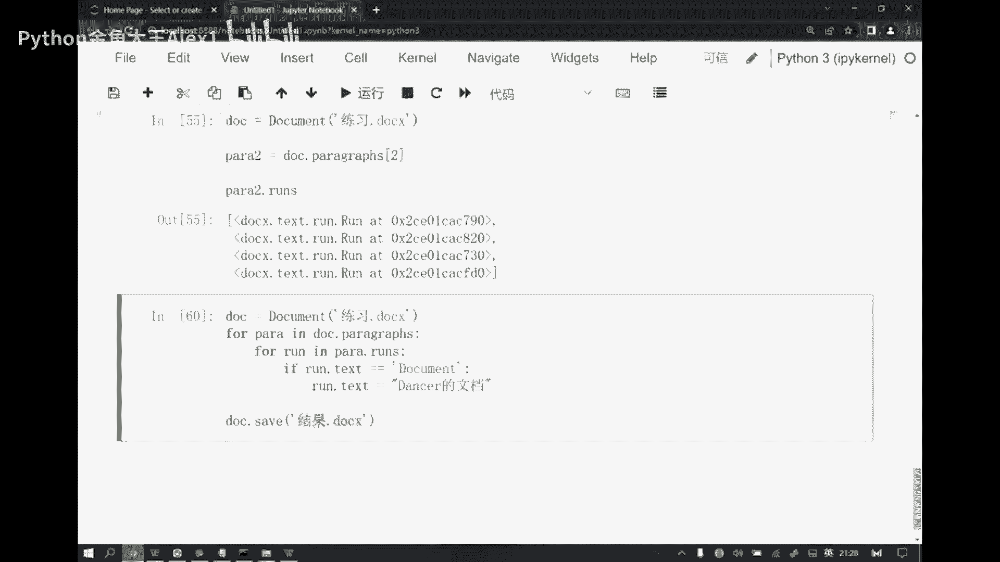

说在这儿呢对吧，这就是我们刚才生成的好，我们把它打开。

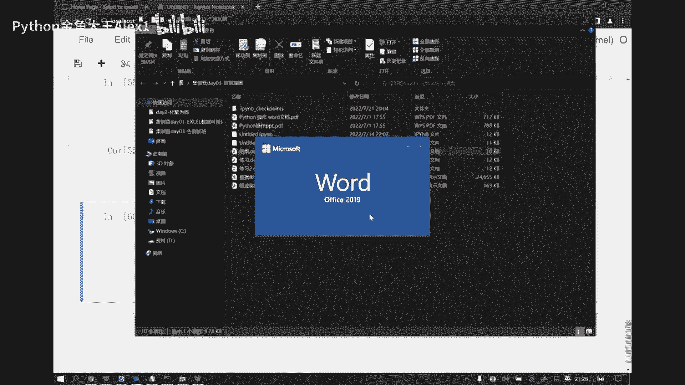

我们做了什么，同学们，我们说要把第一个document给它改，改成那个dancer的文档啊，哎失败了好失败了，那我们来看一看啊，插在哪，把这些关掉啊，这是DOC，好我我又运行一次啊，其实什么都没做啊。

运行一次看看是不是内存卡了。

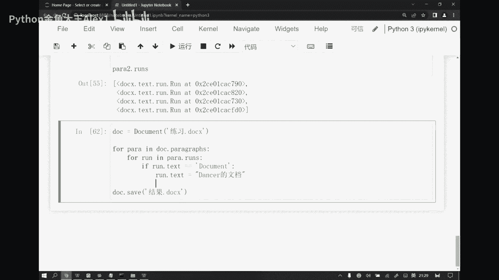

应该应该应该是没问题啊，把它打开。

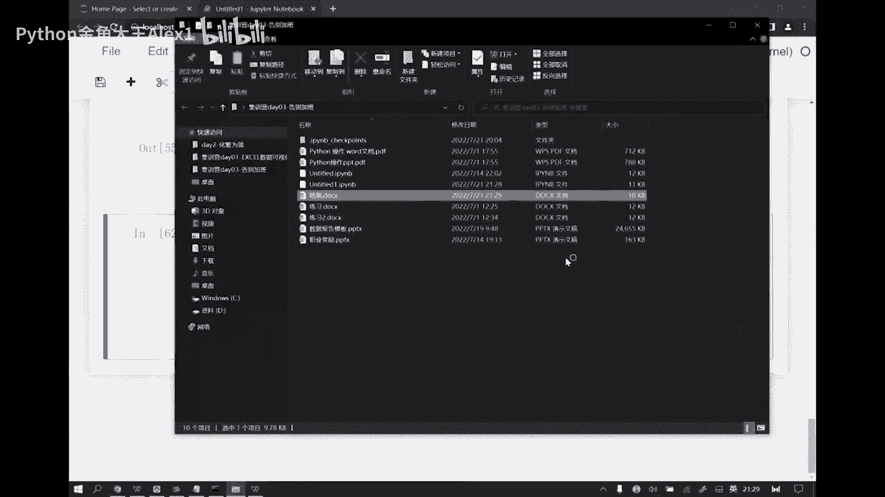

诶奇怪了，document头书写错了呀，DOOCEO们，我把这个文字拿过来啊，M e n t，应该是我这个判断有问题啊，我这样改一下啊，我判断它，是不是在我这个run点TXT当中啊。

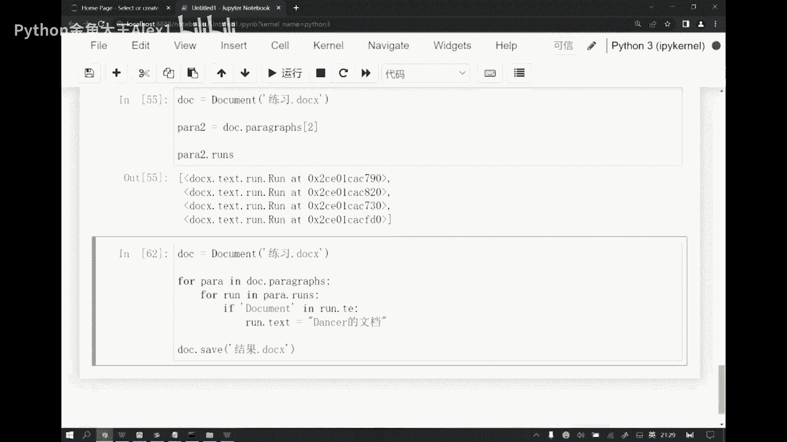

如果在我就改好，现在回来啊，我再把这个打开。

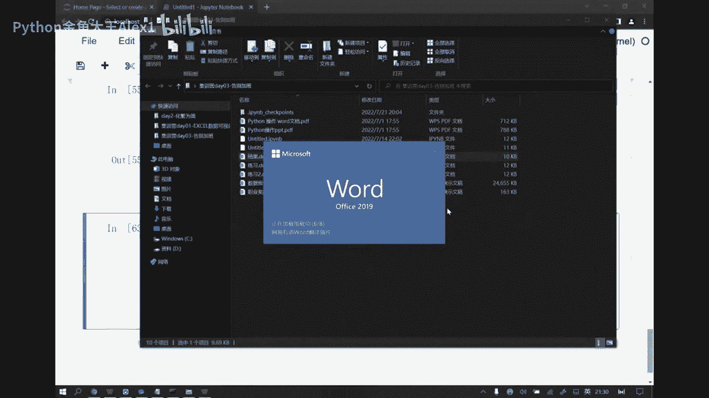

好了改过来了对吧，看看单词的文档，dancer的文档是不是都给改了啊，他不是赋值了，就是它是它是什么，它是因为就是我word文档的那个结构啊，它有时候可能会多一些什么空格啊，或者什么之类的东西。

它会影响你的判断，因为我们刚才判断太决绝了，我们判断直接相等，如果他后边给你多了什么space啊，或者是换行啊，回车呀之类的，它是它它就是不能相等了，能理解吧啊就不能相等了啊，所以说这块我们我们这么搞。

我怕我只判断什么，判断我那个他在不在那个字符串当中，这样我就解决了那个有一些其他看不见的，那种符号的问题，OK啊，所以所以说本质上啊，本质上是这个判断逻辑的问题啊，所以我们这个做了修改就可以了。

这个什么意思啊，这个什么意思，就相当于，比如我判断一个A他在不在ABC当中，它在我就处，比如我我判断AB在不在ABC当中判断就处，比如说我这种情况它是true，但是你你这两个东西它就不相等。

输出false啊，为什么，因为这多了空格，明白吧，空格它也是一个字符啊，所以说这个AB跟这个AB是不相等的，因为这个里面包含空格，这边没有包含，所以这种情况我怎么办，我用in的方式就解决了。

to就true了对吧，OK啊好了啊，OK啊，那如果你把这个word文档这件事，如果你搞定了啊，你搞定了，那么接下来PPT的事你也搞定了。

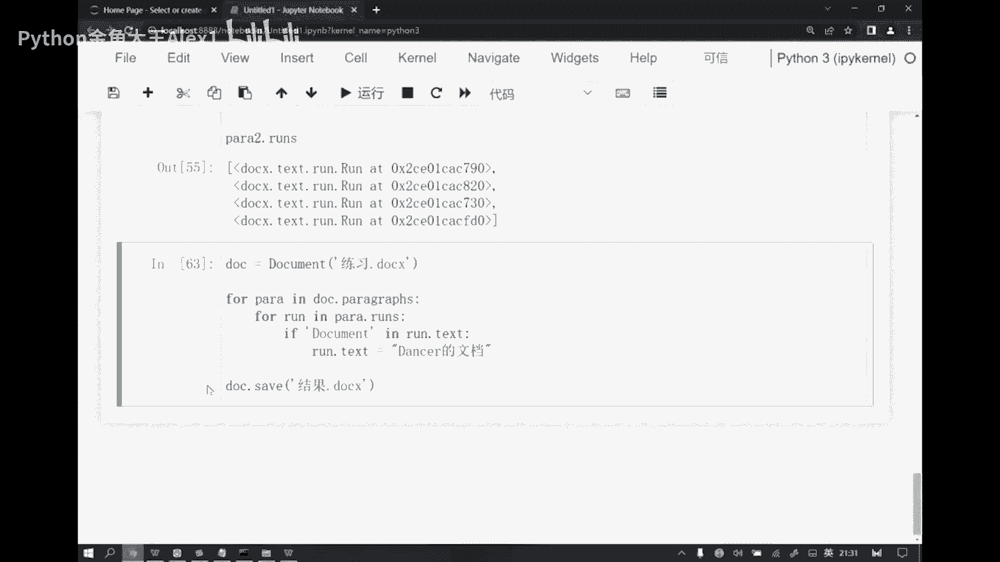

同学们啊，你也搞定了，我们来看看啊PPT的操作如何搞。

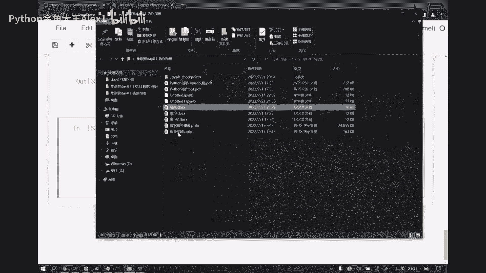

对还有个小细节啊，我们刚才看一下。

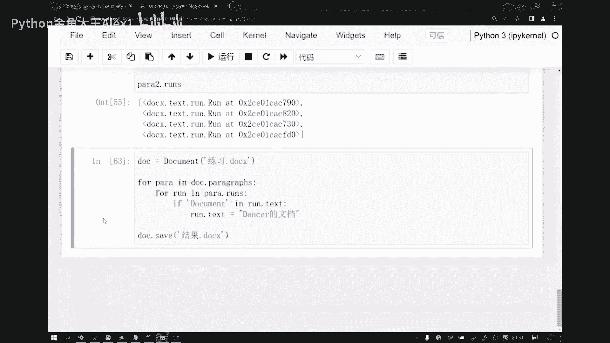

你看你用run改的时候，你发现发现没有，你这个word文档，它原来的结构就是原来的那个格式啊。

它是不会变啊，看看你看这块说还是那个加粗的。

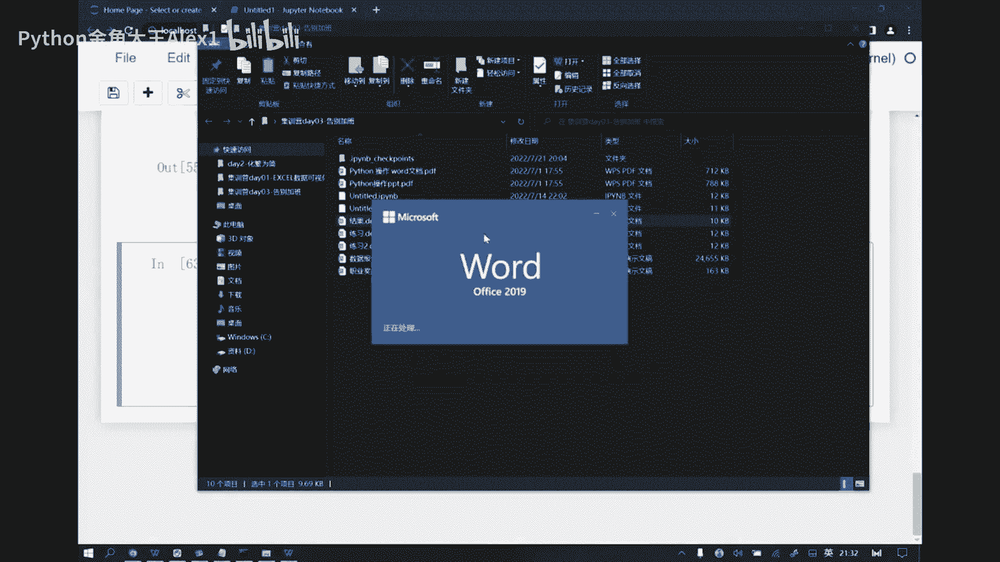

这块说还是那个正文的那个样子啊，对不对，所以这样操作才才可以保证，你原来那个word文档的模板，不会被你因为文字的赋值而导致结构的变化，对吧，如果你直接用那个TIT去去写的话，这个这个东西结构就没了。

就你这个加粗的啊，这就没了啊，就全被覆盖掉了，所以说你要你要真的想去做这种，写入的操作的话，一定要像我这种方式去告啊，就是对run操作，而不是对那个pr操作，就是你不要直接对它操作text。

而是怎么样的读到run在操作它的text啊，就这个逻辑OK好了，你如果word文档能搞定的话，那么PPT呀就能搞定了，为什么啊，为什么这么说，因为PPT的处理逻辑跟word文，处理逻辑还是一样的。

你还是要找规律，PPT它你可以认为是一个word的容器，为什么这么讲呢，看看啊，因为我们正常你看到的一个PPT就大概这样，这样子吧对吧，这样子的好了，你这个PPT里面有什么，有一个两个三个四个。

这是每每一个配置页，对不对，实际上的每一个我我整个PPT文档呢，就是有N个这种配置页，然后呢每一个配置页呢就是这个配置啊，我说的是这个这句话啊，配置每一个配置呢进来。

它其实可以看成是一个叫presentation，就这玩意类似于document，就只是我我换了个名字啊，因为他是另另一伙团队开发的，就不是DOCX那个团队开发的了，他们都是独立的三方啊。

它呢叫presentation好了，这个presentation里边呢又会有很多的模块对吧，我们操作PPT有各种模块，插入图片的，还有插入什么动画的等等对吧，每个模块我们叫一个shape。

叫一个shape s h a p e好了，shape里边包含文本的，shape里面如果包含文本的，它就是document shift里面如果不包含文本的，那它就是包含图片的这种或者是动画的这种。

所以如果你你shape你你发现它是包含文本的，OK那文本的它如果是一个document，就是它是一个word文档的话，那么接下来它的操作逻辑就又回到哪啊，又回到了document的这种操作形式，明白吧。

所以他只是对我document的外边又套了一个什么壳，这个壳呢是shape，这个壳呢再往外又套了一个壳，这个壳叫什么呢，这个壳是我们叫叫slide，Slide，就是你那个PPT的每个页。

然后slide再往后再往外呢又套了一个壳，这叫presentation，它是什么东西，它是一个PPT的一个完整文档，所以相当于是我把document放到了一个盒子里，盒子外面又套了个盒子。

盒子外面又套了个盒子，这个盒子就是PPT了，明白吧，OK结构你就搞清楚了，有了这个结构基础，那么接下来的事情就好办了，接下来就是研究规则了，它是到底是如何帮我们界定的。

你看首先一个PPT文档是一个presentation啊，presentation excel啊，一会儿我再给你跟你说那个事儿啊，一个presentation的诶，好。

我这边少了一个哈word操作那个这表格啊，忘了忘了回来啊回来，sorry啊，咱不没事啊，不违和不违和，比如说现在我我再换另一个啊，D o c，啊C1等于document，我现在读谁呢。

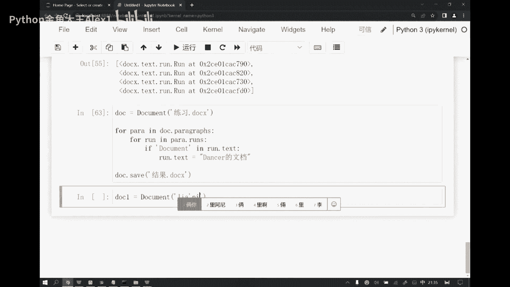

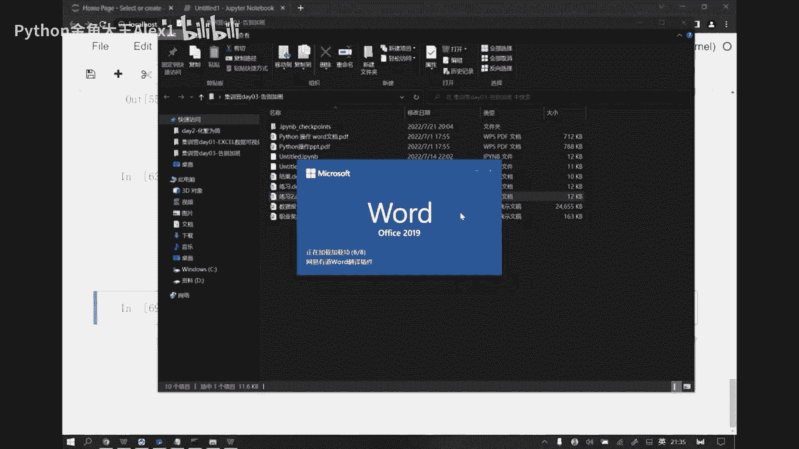

首页展开啊，展开看到了吧，是有这么一个表格啊，这是一个三行四列的一个表格，好了，我我现在想去读它里面的表格怎么读呢，读段落就是读paragraphs，读表格就读tables，tables啊，好了。

我现在其实整个读的过程完全一样，这是一个小细节，你注意注意这句话啊，仔细听你在用Python操作各种文档的时候，一定要把它怎么样关掉，一定要关掉啊，为什么，因为你你把它打开，相当于什么。

相当于你的计算机在操作这个硬盘的这个数据，然后如果你用Python在操作它的话，相当于你又你又操作了这个硬盘数据，现在同时有两个人在操作它，那这个数据就危险了，明白吧，同一时间两个人在在弄它就危险了。

所以一般来讲呢我会全线锁死这个人，操作的时候直接锁死别人不能动啊，所以会有个permission权限，所以你你比如说你在以前以后写代码的时候，你可能会碰到这种问题。

给你报了一个什么permission的什么错误，就是权限问题，你不能同时操作这个这块数据，OK啊，所以一定要关掉啊，你看所以我为什么每次都要关掉它好了，关掉以后。

然后回来这个就是DOC2里面不是有表格吗，好我DOC1，然后直接我读tables，但是它里面只有一个表格，所以我尽管读的是tables，它返回的依然是列表，但是这个列表里面怎么样。

只有一个元素是没有逗号了对吧，只有一个元素，如果你里面你这个doc里面有多个表格啊，那么它就会给你返回多个元素了啊，好现在呢我们既然只有一个表格，那我就从这个列表里边，它有中括号嘛对吧，你看到中括号。

这就是列表了，从列表里面把这个表格啊给你拿出来好，存到table这个变量里面去，今天读个零啊，读个零好了，拿到这个表格以后，表格是什么样，表格说要操作行或者操作列呀对吧，你要么可以操作行。

要么可以操作列，但是其实从哪边入手都一样的啊，只不过只不过你数据访问的顺序会有区别，好比如说我们现在想访问他的行，怎么访问table点肉丝，Rose，这是一个什么，这玩意儿大家可能可能看着有点奇怪了。

但是它其实也是一个可迭代的东西，我们直接来一个for，放一个肉，然后in table点肉丝，然后我们去输出你的肉，看到了吗，几个肉，一个两个，三个数，三行啊，好每一行你想啊三行四列吗，不是对不对。

三行四列，是这样一个表格啊，这是第一行，就是这个，然后这个是第二行，然后这个呢是第三行对吧，然后每一行有多少个是有四个cl啊，对不对，所以当我们拿到每一个肉的时候，这个肉又可以怎么样。

又可以进一步的迭代它里面的sales，OK所以现在我们就可以怎么样，我们可以对这个肉做一个sales的访问，那么sales又可以进行迭代sell，然后in sales好，当我们拿到shell了以后。

sell里面有什么，里边有文字了，文字怎么描述，用paragraph来描述，用段落来描述对吧，所以当你拿到了cell以后，啊然后PARR那就是什么，就是文字了吗，para点text看看说吧。

内容都拿出来了，同样是乔峰，郭靖，张无忌对吧，就都拿出来了，同样的你，你从那个columns就是从列的方向是不一样的，道理完全一致的啊，这个大家可以回去自己试一下，OK啊但是我给大家提个醒。

我们说我们昨天讲我们说excel是个什么工具啊，啊同学们，excel是个什么工具啊，是个统计工具，对不对，真正的价值是用excel去做统计的好，那好了，你在网上你可能会可能去找很多。

说Python如何操作excel，Python如何操作excel，我跟你说，你这么搜答案，你永远学不会用Python操作excel的那种统计的事，因为你excel本质就是做统计的Python。

你搜到答案都是永远是这种Python操作excel，帮你把数据读出来了，然后如果想去做统计，你必须要用Python去对接，你要去Python去什么，去去导入excel的那种函数，什么，some if啊。

Count if count a，We look up，你要导入函数，这相当于什么，相当于是，你要把在excel里面的那些操作方法都给它，再通过代码的方式再让它自动化完成一次，我跟你说。

你这么搞反而效率低了，所以说我要告诉你的是，你用你用Python操作操作表格的话，不要啊，不要用Python去操作表格啊，应该用什么，应该用pandas去操作表格。

pandas它才是帮你做表格处理的工具，表处理的工具做什么，做统计分析，做聚合，做分组，做做透视表，然后做等等等，等级联合并这种操作是pandas干的事。

不是Python什么那个操作那个XLSX那种那种库，那种库干嘛的那种库，说说难听点，他只能帮你去做文件的读取，或者帮你做写入，它不能帮你做运算，即便是能它也非常的不友好，你趁早把这个念念念头打消。

O你你只能把Python操作word，excel当成什么，当成这种像word一样，这种读文字或者是写文字这种操作，而你如果涉及到所有统计运算的，一定要怎么样，一定用pandas去解决这个玩意儿。

才是帮你做统计的，OK啊你要想了解这个玩意儿啊，咱们录播课的第四天，就全是给你讲南派pandas的那个东西，还有包括可视化啊，那个是干嘛的，帮你专门解决excel统计工作的。

所以我们今天的课为啥没有带那个excel的操作，就是这个道理，因为Python它根本就不擅长解决这个问题啊，并不是说Python语，我说的是指的是语法，就是Python给你的那些三方库不适合。

但是Python给你的扩展包，这个扩展包是pandas，他是专门干这个事的，就是他为了解决这个事儿，给你单独搞了一个酷啊，同学们，所以说这个才是Python做数据分析，真正的牛叉的地方，就是可以这么讲。

Python能立能立得住，多亏有pandas，没有这个玩意儿啊，还真不行，知道吧，然后静待花开，问了一句，可以用Python从excel中提取包含数字的字符串吗，可以啊，没有问题啊，但是你这个事儿啊。

就是你还是那句话，你的excel操作啊，同学们一定要去看我，我给大家放那个录播视频，pandas的视频，知道吧，这些问题用pandas解决都非常非常的容易。

你要是用那个你网上搜的那些Python操作excel库，根本就解决不了这个问题啊，就是解决起来的话，也不是咱们这些小白选手能搞得定的事啊，但是pandas绝对是你啊，最容易解解释的一个东西啊。

你就关看那个录播就够了好吧，看那个录播第四题，那个录播第四天我给你发了20节视频啊，放了20节视频啊，你基本上听完我今天这个这个直播课，你你去你你都不用再去过什么语法，你去看那个就就能看懂了，OK好。

我喝口水啊，好了啊，然后我们再回来回来啊，回到这个啊，咱们这个啊什么我们我们这个PPT操作上啊，PPT操作上好，你你PPT操作的话，那我们说就是套了两层壳嘛，其实你你只要走到了这个shape这一层以后。

下边就是什么，就是word文档的操作逻辑，所以实际上那外边这层是啥呀，其实就是两个循环的问题对吧，然后就是什么就是这些变量名的问题，其它的逻辑完全一致好，我给大家演示一下。

比如说我们现在有这样一个word文档。

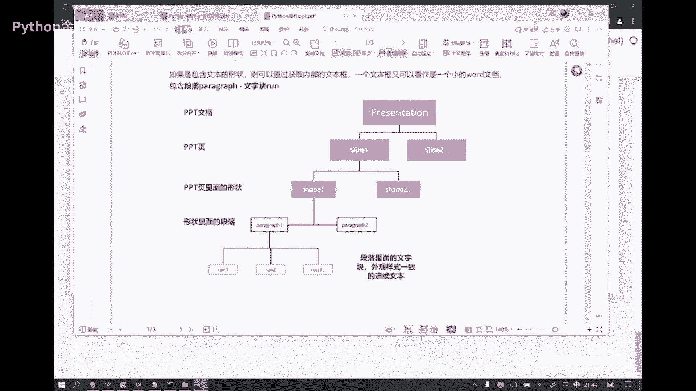

这个吧。

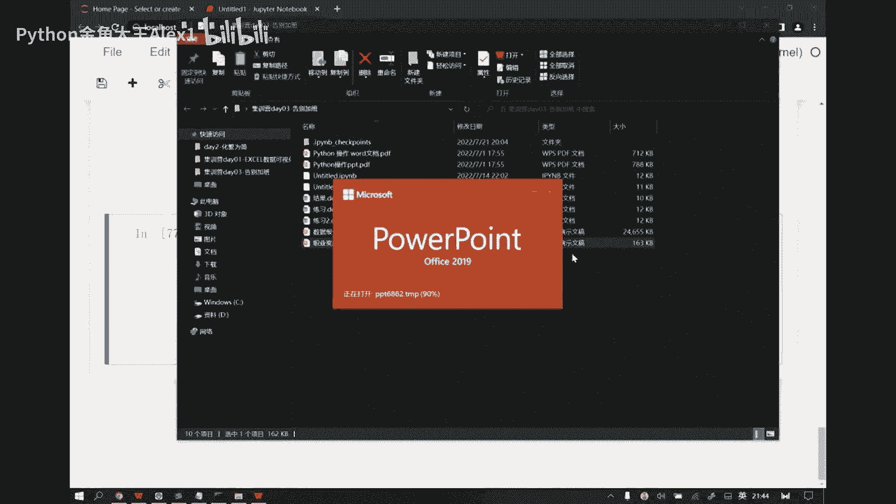

啊你这个那个RITA那个你用正则表达式就行啊，正则表达式这个我可以线下给你写一下，我当场写的话，我还得查一些符号啥的。

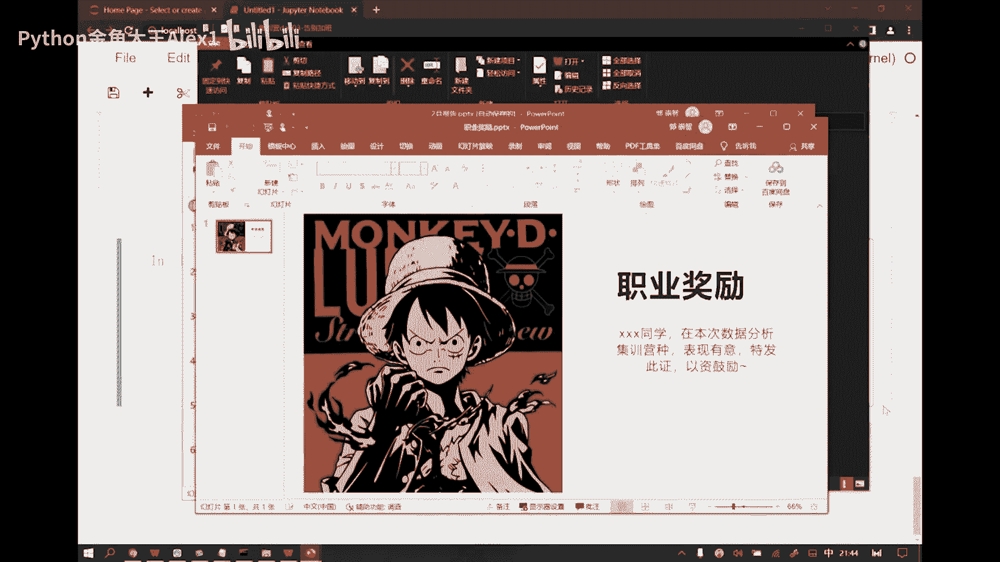

就就会出丑，知道吧，喝下黑下给你弄一下啊，正则表达式就直接判断数字嘛对吧。

这个很这个很容易啊，然后看这个啊。

看这个，比如说我们现在有这样的一个文档摆在你面前，格式已经给你设置好了啊，格式设置好了，你现在要做什么呢，你现在要做的就是把一些什么，比如说目录啊，然后一些结论，哪一些文字啊给它替换掉啊。

或者图像给它替换掉，像这种东西，你用代码写的话，你想出图出图的话用什么，用pandas就是录播课的，咱们那个集训营录播课第四天啊，后边的可视化都可以帮你出图是吧，直接导出就OK了啊。

然后我们这边演示文字，比如说我现在想对这里边的这些标题文字，给它做修改怎么办，逻辑跟word没啥区别好了，首先看啊，我整个整个PPT文件说要加载成一个present的，他这么一个对象了。

然后它里边会有很多个什么很多个year，这叫slide，Slide，Slide，Slide，拿到slide以后，里面又会会有N个sheep，Sheep，Sheep，拿到每一个sheep以后。

就是拿到了word文档，word文档操作段落，操作段落以后操作run，操作run以后操作什么text就把它解决了，对不对，整个的这个流程其实就是啊，其实就是我们刚才看到的这个对吧。

就是这么一步一步一步一步往下猜嘛，猜到这一层他就可以操作你的文字了，对不对，把这个文字一改哎，再写到你的本地磁盘就完事了啊，所以说只是这个名字你可能还记不住啊，记住没关系啊，这玩意儿你造着代码。

造葫芦画瓢就出来了，好然后我们来看一下我们操作是谁，我们操作的这个文档叫2月报告，点PPTX，然后我们操作的是这个slide year，这是第二页，第二页的索引应该就是一，对不对啊，找到一。

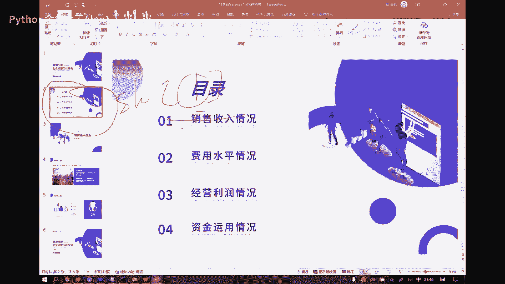

然后找里面的shape好了，看怎么操作啊，还是把这个关掉，不保存啊。

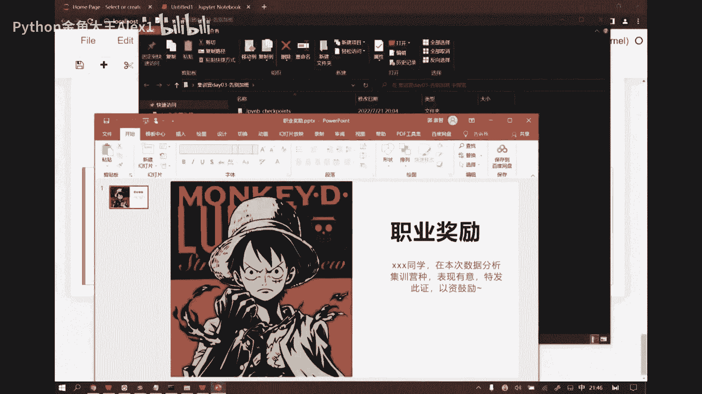

然后呢我们现在要干嘛，我们得你得首先还是你要有这个库，叫Python gm PPT x这个库啊，刚才那个叫DOCX那个操作word文档的操作，PPT的话就叫PPTX好了，把它装上，装完以后呢。

我们导入怎么导from PPT x import prison好了，这个玩意儿干嘛的，是把我们的本地的PPT文档，加载到我的内存条当中的这个东西啊。

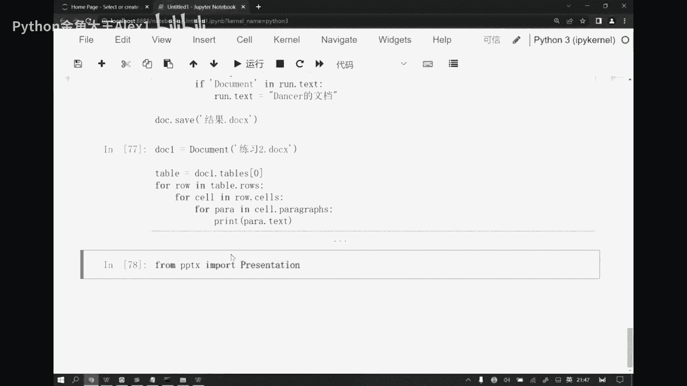

好那我们把它保存为PPT presentation，我们加载的是这个叫。

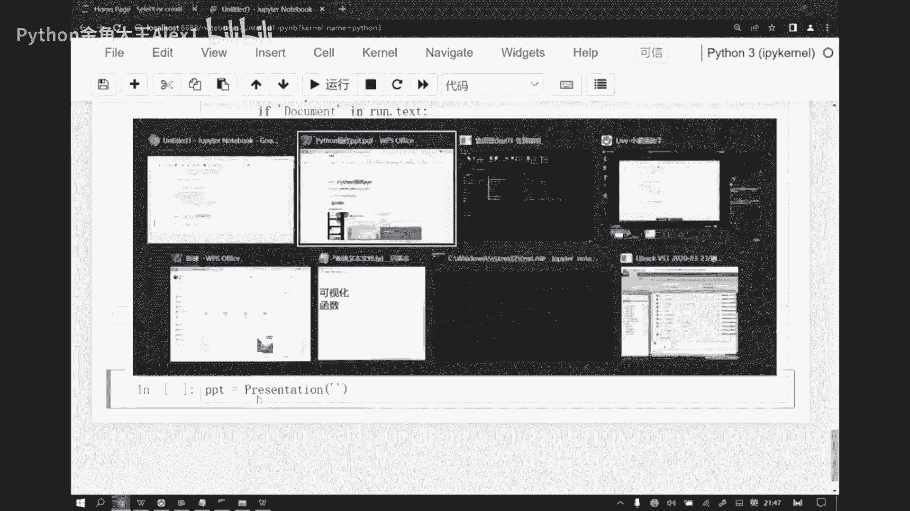

数据报告模板，点PPTX好，现在我们来看一下PPT加载成功了吗，是不是又给了你一个地址，这个地址怎么样，它记录了一个老大的内存的一个一个位置了，这个里面放了什么，放了你这个数据报告模模板里面的所有内容。

所以我们只要一层一层的往下扒，就能把里面的信息都拿出来，OK这些数据呢都放到这个PPT这个变量里了，PPT操作谁，我要操作的是我这个PPT里边的没有，第二页，第二页我想找到里边的这个第二页。

怎么找找它里面的slide哎，找它里面的slide好，所以我现在要对它进行一个slides操作，Slides，复数形式就是它所有的slide都给它读出来，看看这个这个玩意儿啊，我们做一个迭代slide。

然后in slides这边我们做一个输出slide，一个两个三个四个五六是吧，一共六页啊，六个页，然后我们现在要操作哪个操作，第二页怎么操作，第二页呢，那我们就直接把这个把这个先给它注释掉啊，不要它。

我们直接拿到PPP点slides，它的这个一这个就是我们那个配置二，对不对，拿到配置二好了，拿到配件以后干嘛呢，进一步的操作，现在我们到这了到这了，再找里面的什么shape里面的shape好了。

我们要操作是包含文本的shape啊，这里面要注意包含文本的shape呢，我们得做判断啊，好我们先对这个配置做一个编辑，它里面有很多的shape，然后in我们这个配置二点shape4哎。

多个shape里面把shape找出来，然后我们先看sap啊是吧，这么老多sap啊，对不对，这么老的sap啊，然后你看sap就有各种各样的类型，看有什么connector，还有shift对吧。

就说明我PPT它是一个比较复杂的结构，我现在要操作文字怎么操作呢，我们做一个判断，if这个shape点has text frame，什么意思啊，我要知道你这个shape它有没有一个文本框。

有文本框里面才能放文本对吧，如果没有文本框，那么它是图片，所以我如果直接对这种没有文本的数据去操作，它的文本就会报错，因为它会就会迷惑嘛对吧，比如你碰到一个机器人说哎你给我十块钱，他没有。

他没有过这种这种指令，它响应不了就报错了，所以你要先做个什么，你先做一个预判，你先说你好，机器人，你有你知道什么是钱吗，他说不知道，OK那你走吧，对吧啊，就这个意思啊，所以你要先做个判断好，然后干嘛呢。

我知道了这个shape有text frame，我才能怎么样，我才能去点读取你的文本框，文本框里面才有，Paragraphs，知道吧，for这个PARO，然后in什么意思啊，我我拿到了一个一个框。

判断你有没有文本框，有文本框以后，我就对你文本框里边的内容做提取，文本框就是什么，就是DOCX了，就是个word文档了，word文档我去读取里面的段落，段落怎么样，我们给它做一个迭代。

拿到段落以后干嘛呢，再去对里边的段落里边的run呢，是不是power点in power点rs对吧，一层层往下读啊，每一个段落里面有若干个run好，我对所有的rs在做迭代，拿到run以后干嘛。

run里面是不是有什么有有文字，有font color size等等这些信息啊对吧，我先干嘛，我先拿文字啊，run点text给它做一个输出，Print，看看我的文字是都提出来了，然后现在干嘛。

我要把这些收入情况，各种情况，各种情况各种强给他做一个修改，怎么修改，假设我想把这些情况全都变成，信息行吧，我想把情况全都变成信息，怎么办啊，怎么办，那我先还是先做判断。

我拿到一个一个run的文本的时候呢，我判断这个run它的文字是不是以案子with，以谁谁结尾的，比如说我们是不是以情况结尾的，如果它是以情况结尾的，那么我们就让这个run text。

我给他做一个replace，我做一个替换好，做替换replace函数，咱们昨天excel时也讲过呀，功能是一样的啊，怎么用演示一下，比如说我现在是就就这个啊销售收入情况，我要把你去replace什么的。

我要把你这个情况给你改成信息看了吧，就变成什么了，变成收入信息了，我那你说我这个操作数得到了一个返回值啊，这个值怎么样，我说要写到我的那个PPT里面去啊，对不对，好，怎么写进去。

是不是写到这个run里面去，run点text给它做重新赋值，这里边怎么样，我要把这个情况替换成信息啊，但前提是我得知道你是以情况结尾的，如果你是以情况结尾的，我就把你的情况替换成信息好了，到这一步为止。

你操作是谁，你操作的是run的文字，run是谁的，run是pr pr谁的，pr是shift，shift是谁的，shift是我们这个配置二的配置二是谁的配置，二是我这个PPT的对吧。

他们是这样一个从属关系好了，你PPT是谁，PPTT是我们把这个本地磁盘的，本地磁盘的这个文件啊，这个PPTS文件给它加载到一个什么，一个内存的对象，对不对，我们现在本次修改的是什么，是这个对象。

它的内容它有块空间，它这里面的信息，完全存放了这个本地文件的信息，所以现在我们只是在把这个PPT文件，把这个内存改了，我现在要干嘛，我现在要把这个内存的数据再写回到本地磁盘，是不是，所以要干嘛。

我要把这个PPT给它做一个save，这个我们就叫结论点PPTX，OK好，我们做这样一个操作以后，代码运行完了好了，我们来看看结论点PPTX出现了吗。

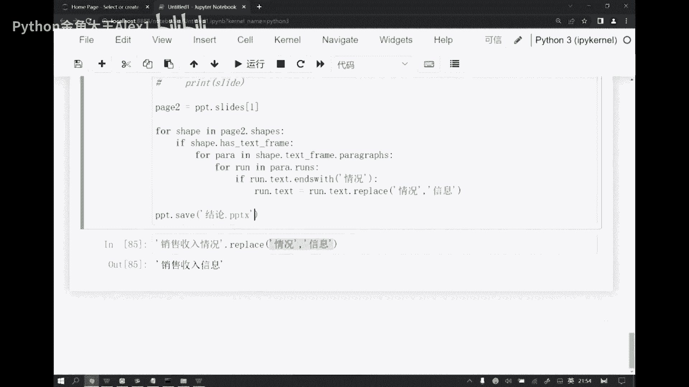

把这个展开结论在这儿呢对吧，右键我们打开方式，Power point。

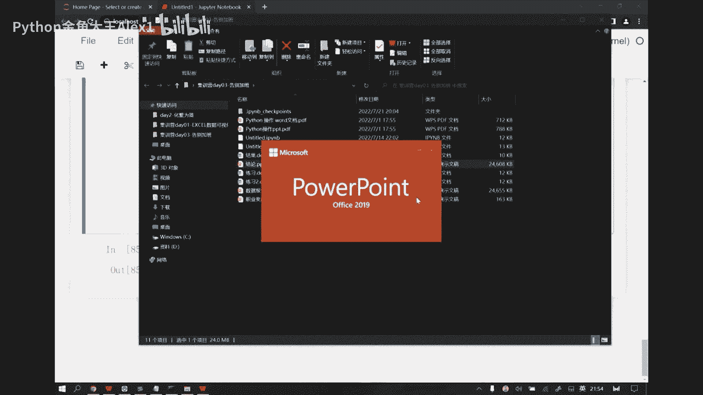

看看是不是全都变成信息了对吧，哎这就完成了啊。

OK好，那同学们啊，现在跟上了吗，同学们来还在听课呢，给我扣个一，下车，好非常棒啊，那我现在又要布置作业了啊，不要布置作业了啊，用今天的内容，你可以干一件什么事，你可以干一件这个事啊，什么事呢。

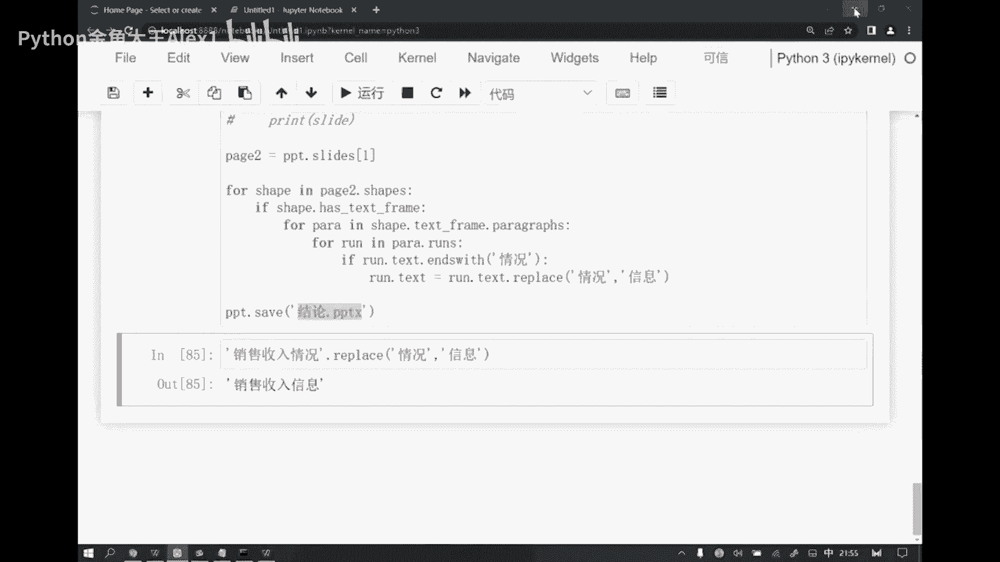

现在啊我们不是有两个文件吗，把这个关掉啊。

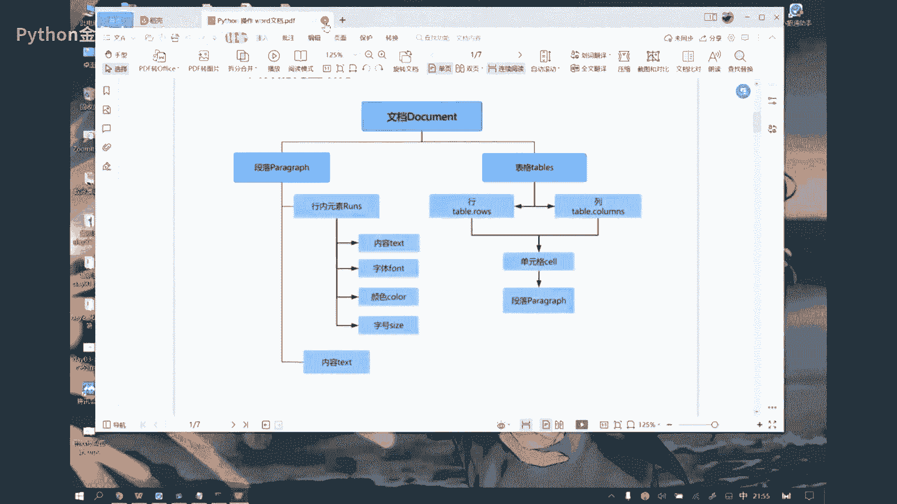

是有一个这个DOCR文件，这个文件里边有什么，它有我们这个一个表格。

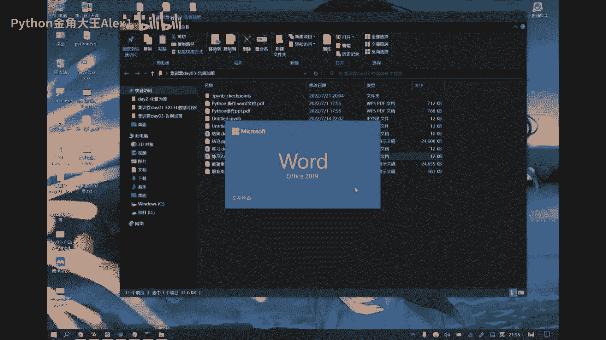

他有个表格啊，有这么多人物，这些表格呢假设就是我们同学们啊，咱们参加集训的同学们啊，各位大侠，我现在干嘛呢，我现在要给各位大侠们发一个奖状，这个奖状呢我是用PPT点PT设计好的啊。

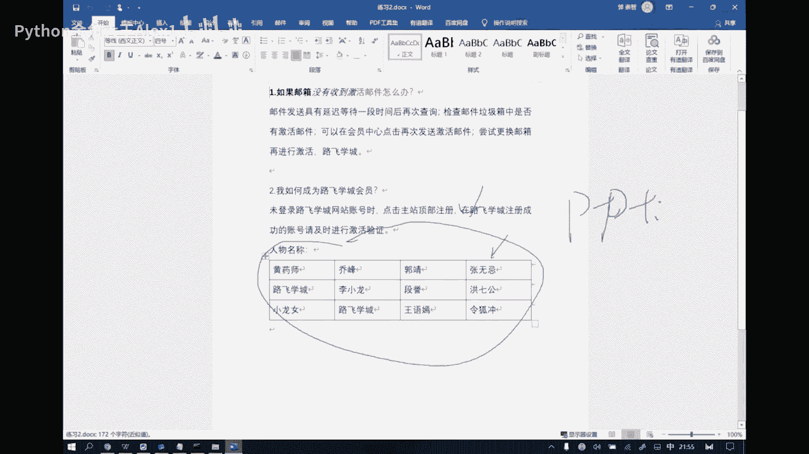

是这样一个奖状，是这个职业奖励，这样一个奖状啊，大家的奖状都一样的啊，都一样的，那么你要做的是什么呢，你要给每一个同学单独颁发一个奖状，所以这个名字你得改，你要把这个某某某换成对应的人物对吧。

然后呢你为了方便管理你的文件，你这个地方上面这个位置啊，你就不能叫职业奖励了，你应该叫谁谁谁的奖励对吧，比如说黄药师同学，在本次数据分析营中表现优异，特发此证以资鼓励，然后这边的题目应该叫黄药师的奖励。

能理解吧，能理解吧，你要批量的啊，你要用用一段代码啊，一段代码把这个所有同学唉，把所有同学的奖状都给我生成，完完事儿啊，不同的学员啊，他有不同的文件名，然后打开以后里边的文字，这个名字是不一样的啊。

解决这个问题，大家听清楚了吗，听明白了吗，这个作业啊OK啊，如果你听明白了啊，听明白了，给我扣个二，如果没听明白，我课下啊，我还是给你发个作业，说明好吧，明天我我等着大家交作业啊，OK啊好啊。

咱们啊咱们三天的集训营干货大概就这么多，当然了，我们这是直播的课内容啊，然后其实你们你们第四天的录播课呀，那个量非常大啊，可能我只是直播，我们到这就就完事了，但是你你后边还有第四天的录播课。

录播课是给你讲的什么呢，就可以给你讲excel的统计，如何用代码的方式去帮你去做excel，统计的这种操作啊，不是网上那种那种让你很很蹩脚的那种方式啊，就是用我们数分专用的那个pandas那套体系。

包括南派pandas，还有那个可视化的那种东西啊，都是啊，是我是我录好的一套课，放上去的OK啊，所以如果你对这个数excel统计操作，你你希望通过代码的方式去解决呢。

啊你想去做这种可复用的这种操作的话呢，你你把那个第四天的课好好看看，一共是20节啊，一共是20节的录播课，OK啊，把那个卡包括可视化啊，包可视化，然后还有那个南派pandas好。

然后你不用去去刻意的去学Python，语法基础不用，如果今天这些东西你能理解了，你就把咱们课上的涉及到这些概念，如果你不理不清楚的，你去做一些扩展就OK了，好吧嗯好啊。

然后呢咱们集训营集训营到今天就就这个直播，就到到死了，到此为止了啊，然后咱们同学们啊，这个怎么讲呢，虽然三天时间不长啊，但是还是得跟大家这个正式的道个别吧是吧，咱们同学们啊可能有很多各种各样的情况啊。

有的是学习的，有的是在职的啊，不容易啊，能跟这三天这个这种强度的集训营的课，大家能跟下来啊，尤其是在座各位还在跟还在听啊，不容易啊，这个这个人生嘛对吧，总是啊有各种各样的不如意吧。

但是每一个努力坚持的人啊，我觉得最终结果都不会差，所以说最终呢就祝同学们啊，未来有一个好的发展，好吧啊，感谢大家最近的啊，这几天的一些啊算容忍吧哈容忍啊，我因为我昨天还还跟某个同学发了点小脾气啊。

然后感谢大家的包容吧，啊因为本身我是干干培训行业的，所以说呃有一些比较顽皮的学生，我也是长时间被他们啊，被他们接受，他们的挫折，所有的时候也是有时候可能会敏感一点啊，所以说感谢大家包容啊。

然后啊然后这个接下来啊，接下来呢咱们咱们有没有想想，去做一些这个数据分析呃，比如说职业上的一些规划的，或者说想去做转行的同学，如果有这样的需求的同学，大家可以留下来听我给你讲一讲啊。

如果没有这方面诉求的同学，可以早点回去睡觉了，好不好，OK啊啊我们休息休息2分钟啊，我上个厕所啊，如果回来，如果还有人的话，就聊一聊，如果没人的话，咱们就就完事，OK啊，休息2分钟，我可以回，广州海口。

下路线3321，诶回来了啊，还有人啊行，还有人在，那咱就聊一聊吧，你们有什么就是说说你的情况吧，好吧，咱们就先聊聊聊聊情况，看你们什么情况，然后我们规划一下，当然我这里有一些小课啊，可以供你们选择啊。

然后如果不想报课，也可以可以聊聊职业规划的事，我先看看大家都是什么情况好吧，大家可以把自己的学历，然后呃学历，然后包括你现在做什么，然后你是想转行，还是想想做一些呃，这个职职业化的一些技能提升。

还是说只是想单纯的提升一些效率的这种需求，可以简短的几个字给我描述一下，我看看大家的一些诉求都什么样子，OK嗯然后大家先先润色的啊，先想想啊，大数据渗透不行啊，就是大数据这个东西。

你先现在零基础就别接触了，大数据太卷了啊，大数据它门槛太高，你要是15年的时候搞大数据可以，现在我现在就是虽然我们说大，虽然我们经常是说大数据，说数据这种东西，但它都其实都属于数据基建的那种那种东西。

然后我先我先把这个说完，然后我再给那个那个校校夜同学，我给你讲那个接单的事啊，就是就是它是这样一个逻辑，我不知道大家对互联网了解多少，就是互联网它现在是什么，就是就是现在大家都知道。

就是就是行业内的人都会聊增量市场和存量，就是就是过去10年的话，我们一直是存量市场，存量市场竞争的是什么，竞争的是这个产品研发，就是我衣食住行方方面面，我就是给你各种铺产品，然后各种抢市场，抢流量对吧。

所以大那种大厂那种，他们都是玩那种就是资本运作对吧，就是我说白了就是我烧钱啊烧钱，然后把用户抢来，然后把那个行业内的，就是我垂直行业领域内的老二老三给你干掉，然后杀掉你以后，我再回来再收割。

他是挣这个钱，所以他一定背后有有超大的这种企业，就是这种这种这个投投行，他们去给你投资的啊，然后但是但是中国，中国互联网发展已经多少年了，从从11年开始算，到现在已经是11年11个年头了对吧。

所以这些年基本就是移动互联网的时代，移动互联网时代说的再具体点，就是产品开发的时代，产品开发，包括我移动端啊，前端后端肯定都配齐嘛，然后包括UI设计，然后呃然后到你发展到15年，16年以后。

你看为什么15年你能玩大数据，因为移动端你你现在回忆早些年，就是10年到15年这段时间的产品是什么，都是那种什么游戏，都是那种小的单机对吧，然后产品都是那种啊，特别规模特别小的那种那种小的产品。

然后所以它它对于数据量的一个承载呢，其实并不大啊，并不大，但是为什么到15年的时候，就开始有大数据技术了，因为用户量越来越多了，就是中国的移动互联网用户已经越来越多，越来越多。

然后呢每天上网堆积的数据也越来越多，这些数据呢它它一个是存储效率，一个是数据对齐，数据孤岛的打通，然后包括我数据上层的一些应用，比如说我淘宝的千人千面抖音的推荐算法，然后这个还有等等等等吧。

就是我用户流失，然后用户付费率分析，然后用户价值分群等等这些东西，它其实本质都是基于数据去做这种，做这种上层的业务分析的，那那我在分析之前呢，我一定是先有这种数据的基建。

所以呢我基建的话就一定是大数据这种技术啊，还有数据传输技术啊，包括我的一些啊这个5G网络的建设等等，这些其实都是想都是帮你解决这类问题的，一些基建操作，然后虽然说这些年技术上有很多的变革。

比如说java出了好多框架，然后又又搞什么go，又出什么什么高性能，然后什么渗透什么什么云计算，还有VR这种技术，其实本质上没脱离一个什么赛道呢，就是我这边啊，大家嗯大家想听我说这个东西吗。

啊就是说你得得先知道背景，然后你才知道这个这行你能不能录明白吧，所以所以我是本着这个态度给你讲这些事情啊，所以你别嫌别嫌我墨迹啊，别嫌我墨迹，我尽可能我我把我想说的说出来，咱们今天不怕晚行不行。

大家既然想聊这个事，不怕晚啊，我我相信我，我跟你聊的这个视角跟别人肯定不一样，因为我是搞数据挖掘，搞数据分析的人，我跟普通的程序员不太一样，我我程序员那条路我走了7年，走了7年，然后后来后来这5年。

我一直在走数据挖掘的这个这个这个路啊，所以我我对我对这个事情看的比较比较透彻，OK啊，然后我在这儿我加一个幻灯片。

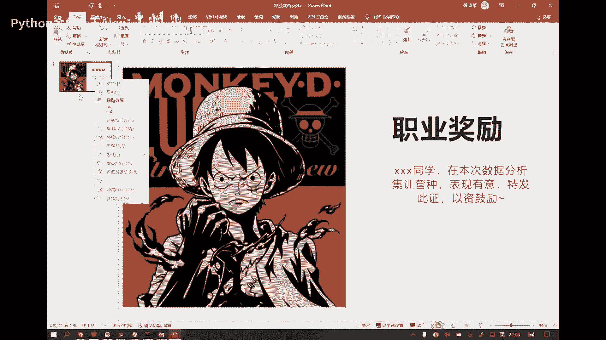

我我去说啊，所以你让我说爽了啊，你别催我，你催我我就我就没法聊了，这个事儿啊，就是你你看我们常正常人啊，咱们正常人说it岗，其实无外乎大家都会认为哎搞java的是IT对吧，我们搞Python it唉。

然后我们去搞这个C加加是IT，然后搞P2P是IT好了，其实本质上这些东西它是T，但是我们可以把它换一个，换一个词叫什么，从业务的角度讲，这叫产品研发，产品研发除了产品研发之外呢，还有一些支撑产品研发的。

比如说测试云计算，大数据，当然还有人工智能，Ai，还有什么，还有数据分析啊，当然还有另另外一条线什么，比如说这种做辅助性的，做UI啊，做运维呃，呃做运维啊，就那种业务运维啊，还有就是做产品经理对吧。

这也是一条线，本质上其实这些他们都是it岗位，明白吧，都是it岗位，他们的工资水平是一样的，甚至说你像这种产品经理，甚至有的已经能拿到四十五十K的offer，一个好的UI三十五四十五的offer。

有的是，然后那大数据也是，然后AI就更夸张了啊，AI你要说两两到3年内能年薪过百万的，一定是搞算法工程师的这帮人对吧，所以你现在来看的话，其实是很小的一部分，还有游戏对吧，游戏也算是一个开发。

一般C加加什么的对吧，还有什么VR，然后还有什么虚幻四引擎这种啊，还有做什么SHADER这种做，做那个后后期的特效渲染的这种，都属于你的T杠，这是跟技术相关的这一圈，还有跟技术不关不相关的那一圈呢对吧。

这都是it类的，所以所以你要你现在入行，现在入行的话，我极力不极力不推荐，甚至说我是极力反对大家去干这一条线的，就是这这个范围内的东西，为什么啊，这就是我刚才给你讲那个趋势的问题。

因为过去10年是增量市场，增量市场玩什么，就是在去抢占市场，抢抢衣食住行方方面面，大面抢完了抢细分市场，细分市场抢完了没得抢了，资本也不不负不负能了，不烧钱了，打不过了对吧，17年一八年，16年一五年。

这几年干嘛，就在各种各种的什么什么企业并购对吧，什么优步被并购了，滴滴跟饿了么跟什么美团，就就是都是这种东西，你看都是这种东西，为什么烧钱烧不起了，这种大的方向已经已经有，有那么一两家已经站得住了。

其他人没得玩了，没得玩怎么办，好，开始搞下沉市场往下搞，对不对，所以那几年你会听到什么什么资本下沉，然后不是前端啊，前端也不行，前端是本质是一样的，前端也是做产品研发嘛，就HTML嘛。

IOS安卓都是一样的对吧，这都是这都属于这一类啊，都是这一类，所以说为什么先你会听到大厂裁员，裁的什么裁的就是这种边缘部门，我举个例子你就明白了啊，我明白说啥意思，比如说现在抖音他是在短视频这个赛道上。

绝对绝对是老大，对不对，能跟他pk的可能这个快手，还有比如说那个腾讯的微视对吧，就这么几家好了，那么你现在别人家还能不能玩这东西，比如说你你现在说哎，我现在我也搞一个这个跟抖音类似的，短视频平台行不行。

你你放心，不会不会有可能了，就包括腾讯这么这么大的企业，他搞卫视，你以为他真的是在跟抖音pk吗，他不是他在玩什么，他在玩玩存量市场的逻辑，就是增量市场是抢市场，绝对的抢市场就是要把老二打死的。

这是我的我的唯一目的啊，就是这个这个市场只有我在，你不能在，所以我就拼命烧钱拉用户对吧，因为互联网的用户他一旦习惯了某一个平台，他就不会去另一个平台付费了，就这个道理，但现在你V视频。

这个腾讯为什么要搞微视，因为他现在玩存量存，玩的什么抖音，现在日活如果是五个亿还是几个亿了，然后微信是八个亿，那么好，你想你每天可能十几个小时的上网时间，中国就这么十十来亿的一个上网人口，好了。

你你其实量就这么大，池子就这么大，现在你你不论你玩什么策略，你的用户不可能增长了，那怎么办，我只能去维护用户的留存，对诶等等，是等等吧，那个字我也认不出来，现在玩的留存留存就是我我去抢。

就是你比如说你一天十个小时上网时间，你本来是五个小时在抖音，五个小时在微信现在干嘛，现在我拼命的让你在我的微信上留的时间更长，因为如果你不在我这留，那么你跑哪去了，你就跑抖音那去了。

你你一旦在抖音上长时间停留，OK那么你的付费可能性在那就会高于在我这儿，明白吗啊，或者说你你的你的，我的产品价值就可能就不如你，所以呢我我为我这个腾讯去搞，我去搞卫视，为什么我就是为了玩留存。

我知道我打不过你啊，我知道我肯定打不过你，就包括你那个卫视的那个产品总监，他自己是肯定是最惨的一个老板，天天骂他对吧，但是当然了，老板他也自己知道，他肯定抢不过他，他本质是还是维维护我这个用户留存啊。

所以说为什么你不能干这种产品研发了，因为你看现在我我衣食住行方方面面，产品都已经有绝对的老大在那站住了，你现在在拼命的烧钱，你的市场也抢不过来，所以呢这种情况注定你会有很多的部门的业务，它是不盈利的。

他是不可能盈利的对吧，比如说你现在腾讯你就再牛逼，你现在你去给我搞一个啊，你去给我搞搞这种微视，你也不可能抢占到我的短视频平台的，这种这种红利，对不对，你只是在维护你的留存而已。

所以说那你像还有一些不如为师，这种团队的部门怎么办，这部分怎么办，我只能裁掉，因为它不盈利，他就是负资产，明白吧，所以说呢在这样一个背景下，自然就会有很多大厂程序员被裁，但你看天美团队，他不可能被裁。

为什么，因为他是绝对盈利的，就搞王者荣耀的对吧，但是如果有一些你没听过的产品，他们那么多人在耗费的人，在那开发，在那儿去研发，再做做产品设计，然后再推广市场，它不盈利对吧，所以怎么办。

今天就裁掉了这些人，裁掉了以后，这只是一个很小的一个一个方方面，更更夸张的什么，这帮人你觉得他能找不到工作吗，他一个堂堂的大厂背景，他出去我是一个干java干了6年的人，我在大厂被裁了好了。

我现在他真的失业了吗，同学们，他没失业，他会怎么样，他会往下挤，往下挤，中端下端对吧，这种市场就是说白了你本来比如说我现在学java，我现在本来我能如果市场行情好的话，我学个java，我能拿个15K。

但是现在大厂那么多人闲下来，去拼命的挤占挤压你这种市场，而且我小产品，我小公司研发产品的能力更不如大厂，所以我小小公司的需求也会再缩缩小，所以这样的话你你源头上人多了，然后这个企业需求量又变少了。

你说卷不卷，那一定是卷的，对不对，但是现在什么不卷，我跟你讲啊，互联网就是就是所以说你现在听到大厂裁员，一定都是这种部门，不可能是那种核心部门的，而且这种边缘部门他不一定说不盈利，我给你举个例子。

就360老大啊，周周弘毅，大家知道是吧，他们盈利的，他们是他们是百人团队，一年能做个几千万，其实这种在这种东西，你在传统企业已经很好了，100来个人，一年几千万，对不对，很好了，但是周鸿祎开会怎么讲。

给他老大一顿一顿骂，他说你知道我们360团队，100人团队服务多少人吗，服务的是十几亿人口，你先给我干个100人团队，你你一年给我做1000来个用户对吧，一两千个用户，他们单价很高啊。

一个一个的客单价都是4万5万那种，他们他们这种教育啊，就做安全圈的，所以他就就指着他比他慢，你知道吧，所以说就是在在这种大厂，他不是说看你盈不盈利，他是看你LI够不够高，你如果这个东西不够高的话。

它是它是完全可以把你砍掉的，明白吧，所以说你你说现在对于咱们这边这种，咱们刚入行的人来讲，或者说咱年龄大一点的讲，你这种行业你还能进吗，同学们，我弟弟妹妹，我现在从来不让她学这种这种技能了，因为太卷了。

不也不是说你找不到工作，门槛变高了，你的需求量变小了，技术门槛高了，薪资待遇也掉下来了，所以你现在能入行，能能是能，但是一定要付出更多的代价，你要担负更多的成本，你要担负更高的风险，明白吗，嗯你看啊。

有人说我这么讲太空了，我给你，我给你拿现实的例子让你看啊。

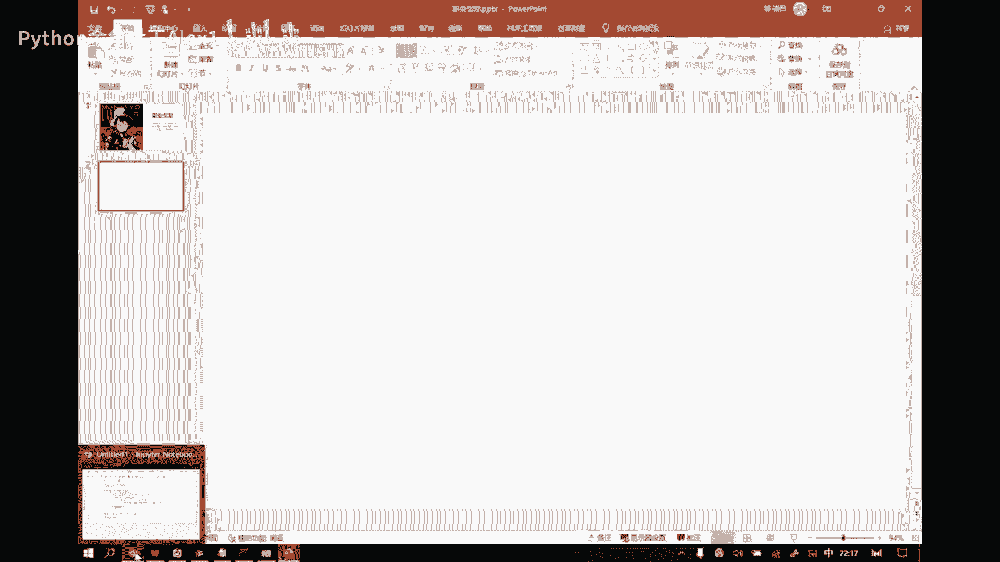

你就知道我讲的是不是空的了，比如说你去你去招聘，最能说明问题的一定是什么。

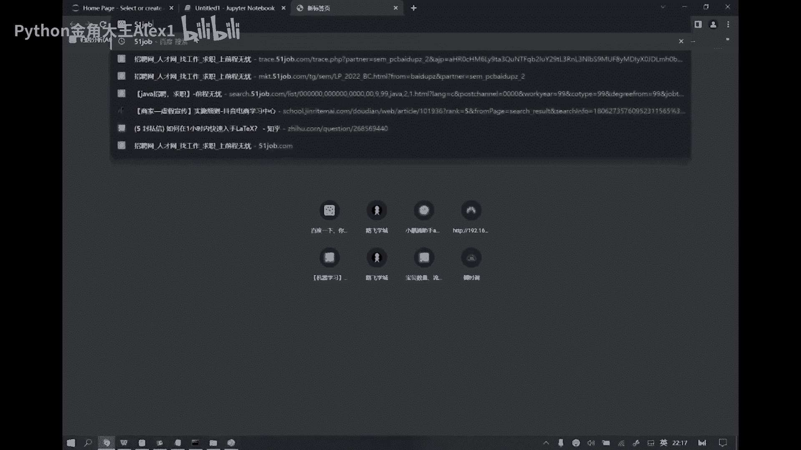

最能说明问题就是招聘网站，你看量就知道了，知道吧，而且有人会跟你讲说，哎你你看这个这个量老大了，怎么怎么着的，我告诉你啊，这种话，你你得你要，你要拿一个数据分析的视角去看这个问题的话。

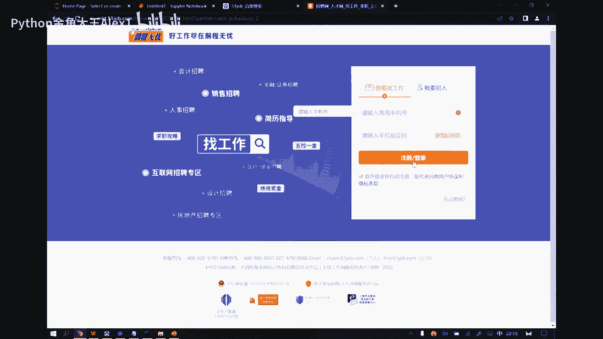

它就不一样了，诶我怎么进不去了，看着啊，比如说吧，比如说java，你随便问说java稳呢对吧，20年的一个语言对吧，学它没问题啊，而且在下沉市场需求量很大，对不对，一听诶这个这个不错对吧。

然后入行薪资还挺高的对吧，一听哎我曾经哪个同学好像学过好了，你如果这么思考问题的话，那你真的就是对自己不负责任，我来给大家看一个血淋淋的现实是什么，看啊，我现在搜的是java关键字，对不对好了。

java全国啊，全国有多少岗，1200页，1200页啊，1200页是什么概念，就是一页有50个岗位，就大概是6万，对不对，全国有6万个岗岗位在招聘好了，大家觉得这个需求量大吗，十这个坦白讲。

这个需求量不小啊，血量不小，你随便换一个语言，比如你换个PHP，多少页能看清吧，只有96页，所以为什么P2P你绝对不能学了，就这个道理，然后做大数据，看看多少个652个啊，比PHE能稍微强点。

你再看我们现在就绝对是冷门的，比如IOS多少100多页，全国啊全国，然后安卓，894页比IOS能强点对吧，这是符合现状的，但是你别你别这个别被这个数字所误导了，同学们啊，为什么，就是因为这个行业它很大。

它很大，它的里边的水平参差不齐，你现在说的是一个总体指标，我们讲了你你一个总体指标，它是有很多分布形态的对吧，真正适合你的分布形态是什么，你有5年以上月薪2万的那种岗是你的吗，同学们，那不可能是你的。

对不对，那种硕士研究生的岗，那是你的吗，那肯定不是你的，对不对，所以你要有条，你要有有针对性的去塞，你塞什么，你塞一到3年的，甚至说在校应届生的，你招大专的本科的，你筛0。8到这个区间的，对不对。

你把特别低的过滤掉，把特别高的也过滤掉，你你这样去搜的话，我跟你说这个数字就很夸张了，就很吓人了，同学们，比如说java，比如java啊，你搜我就我现在我薪资我我不限制好吧，我全要我现在就干嘛。

我就要一到3年的，加上应届毕业生的，然后呢学历啊，我学历上我稍微砍一下，我大专加本科，这是咱们大众水平吧对吧，你要是硕士研究生，这咱不算啊，那你优秀啊，你能打这种啊，这肯定好，你看变多少了，全国同学们。

全国114×50，这是多少个多少个，几千个岗位，只有几千个岗位，这还不算，那什么不算薪资范畴对吧，还有一些低的呢。

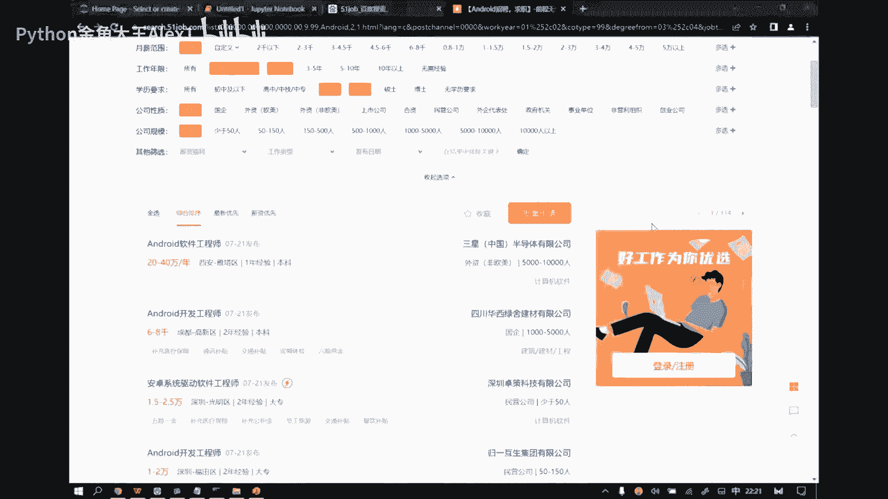

这种你看哎这是这什么，哦这是安卓啊，说错了是java啊，Java，然后我们选一到3年加in the应届，这才是咱们新手转行的范围，对不对，你不可能说你新手上来给我去找三到5年的吧，那你这不疯了吗。

对不对，然后你再搜高中大专本科，其实这种就基本不不需要了啊，然后确定好你现在搜多少439页啊，好这是什么，这是你你做这种语言啊，你就是这种原因，你的市场就是你有这么大的一个一个市场，供你去遨游。

供你去拼，供你去找啊，你再看其他的就更更夸张了啊，就更更少了，就不看了，因为java是最多的了，然后你再看啊，现在你看你干什么，数据分析什么概念，咱们先看总体，我先不要这个什么，我先不要范围啊。

总体多少，两千两千，什么概念，10万+100000加互联网啊，互联网它的概念是10万加以上，我不显示，所以它不是10万加，它可能是30万，可能40万，也可能是50万，OK所以这个时候你再在这个范围之内。

你在找什么呢，你再找我们加条件，一到3年在线应届应届生，然后我们再去搜这种学历低的大专本科，OK确定他多大的尺子，多大的尺子，就我这个这样一个条件下，我还有多少1422页，java多少是417页。

差多少，差1000×50，这是差了5万个岗，这是什么，这只是你新手的岗位，知道吧，大专本科一到3年，新手的岗位就这么多，看出差异了吗，如果你在薪资上再限定一下，比如说我我就是要找这个高的啊。

88万就是8000以上的，OK啊，8000以上的多少，858还是什么，还是你java的两倍，而且这只是从你从数量上看，你要从这个技能的一个诉求上看，比如说这哥们儿啊，数据分析工程师，你看他需要什么技能。

看看你干嘛，oracle my circle数据库，对不对，Title space，这是什么Python建模工具，然后这种bi taber power bi，这都是一类东西，是不是。

然后完成数据抽取处理，建模报告，监控报表任务，看到了吧，统计学，运筹学，管理学，计算机类数据分析等相关专业，看到了他对你的专业也这个范围也也变得很大，对技能的要求变得很小，就数据库是个啥呀，知道吧。

搞IT的人，你你别说搞IT，你搞产品经理的人，你都得写数据库，这玩意儿就是最大公约数，你干什么岗都得会蛇口，所以说基本上看到了吗，你学一个Python，学一个pandas啊，学一个my circle。

学了一个TABLER，然后你随便去写几个数据报告，这种岗位你就可以去拿对吧，这叫门门槛低，这才叫适合你新手的，你要说你现在去搞java啊，你先不说别的，你你随便立扣上边那种数据结构算法题。

你你不刷个200道出来啊，你想去面试都不大可能知道吗，所以说所以这个才是你新手能够去挑战的岗位，OK听懂我的意思了吗，好吧，所以说大数据别碰，知道吧，大数据别别碰，但你可以怎么样。

你可以从数分这块往下沉，因为数数据分析它有中级有有初级，高级，初级就非常简单了，初级就是比如咱们刚大学毕业，咱们现在也没有什么搞找工作的方向，OK你现在又想进互联网干个，先干个初级分析师的活儿。

会个power bi，会个excel，然后稍微懂点Python这种活，就能拿一线城市10K到15K随便拿这种岗位，知道吧，然后你要说我我现在是我有一定的编程经验，或者说我之前做过运营。

或者做过什么其他的这种业务，业务方的一些工作，我我是我属于职场老油条了，我有那么两三年的经验了，OK你直接去拿什么，你去挑战中高级的这种分析师，因为分析师他是一个比较特殊的行业，就是你又要懂技术。

它有技术门槛啊，但是呢你又要懂业务，所以行行就是形形色色的行业，他都要招数据分析师，所以它量才这么大，它不是说只有互联网公司招，所有所有跟互联网沾边的公司，数据量大的公司他都招。

所以呢那你你之前所有的这种业务经验，你直接去去做中高级数据工程师就没有问题，中高级的话，一线城是15~20K入行薪资知道吗，入行薪资OK，所以说，所以说其实如果说大家有转行的这种想法的话。

我劝你真的别去考虑那种以前的那种，传统的那种开发岗，真的你真卷，不过知道吧，难度太高了啊，不适合你新手，尤其是咱们年龄稍微大一点的，你更不要搞啊，当然你哪怕说我就做个运维测试都行。

你你也别去搞那种什么那种所谓的开发岗，就他们他们总是拿那种你不懂行，你总会觉得开发好像很高端，但是你开发他其实就是打你的认知差，你你因为你不懂什么，你不知道整个IT的这种行业的这种岗位结构。

你你只是知道啊，java p2P这种叫开发，其他的一概都不是IP岗，不是那样的，同学们知道吗，这就是认知差的一个就是信息差的一个问题，你干这行你就知道了，好多程序员后来怎么样转产品经理了。

为啥他不知道开发，难道是开发赚的不多吗，就是因为开发跟产品经理他差异不大呢，还有好多程序员为什么要转数分呢，因为他知道真正站站在业务的视角上，对我的长远发展才是最有好处的，因为你做你做纯开发的话。

它的替代性太强了，你先干了5年，你的那点5年经验，跟那种一两年的同学也没差多少，你一个5年你要3万，人家一两年的要1万5，你说咋咋咋搞，对不对，你要么你就降薪，你拿2万5个人抢，要么你就怎么样。

要么你就是换一家对吧，所以说真的啊，真的你现在如果想转行的话，我劝你还是不要去搞那种纯开发的东西，OK啊，所以说就是你你如果有这方面的经验啊，不建议因为它它技术门槛很低，所以说你有很多业务经验。

比如说不论说你将来是做运维的或者做测试的，或者说你哪怕你做的是销售，或者你做的是这种财务，然后你做的是人事，只要你你你对公司的那种业务背景，那种业务线，你你是比较清晰的，那么你其实就天生具备一个。

就或者说你已经是具备一个做数据分析师，他需要在业务能力上培养的一些，就是软软软价值了啊，那你你现在只需要把技能门槛给他搭起来，你就可以去拿这种offer了啊啊OK啊，这是啊。

然后刚才有同学问那个问那个什么，问那个，大数据啊，不是啊，做兼职接单就是数分数分接单吧，它如果你说我只是做这种业务报表，这种没有啊，没有它树根接单又有两有两种情况，一种就是你做爬虫接单。

就是因为爬爬虫它属于数据采集嘛，它是你它也是你数据分析师的一个基本职能，从采集到清洗到分析到可视化，然后到到挖掘对吧，这是你整条整条链的整条链的，所以说你可以去就是你你可以从你，你一般就是你去做采集。

主要是靠这个接单，但是你采集之后一般会给你，你你要去帮他做整理，所以你要做整理的话，那你就不就是必然，你要知道这种像这种pandas啊，这种像这power bi啊，这种这种可视化爱好。

就用数据处理的技能，所以说所以说但是它它但是你说我，我只是帮你做可视化，或者说只是做数据处理，这种单很少，所以它一定是基于采集去接单，这是一个低端的接单，这种单一般就是钱比较少啊。

就几百块钱这种小单就是闹着玩的，你闲着没事接点行，那另外一种是大单，大单什么，就是你搞挖掘那些，就你帮一个，比如说你帮一个本科生，或者帮一个硕士研究生写一个论文，你知道吗，写一个这种这种机器学习的论文。

一个就大几万啊，一个月大几万啊，就那种是大单那种大单，就是你得去学什么学挖掘技术啊，不是挖掘机技术啊，是挖掘技术，数据挖掘技术就是其实就是算法啊，就学算法，但是他们那种论文其实那个含金量很低的。

就基本上你你搞几个模板以后，然后你基本上如果你长时间干干这活儿的话，就是几套模板，然后你你帮他调，帮他帮他写答辩那些东西就能搞定啊，我上我上那个我上学那会儿啊，就是读研那会帮人写过一个啊。

帮一个本科生写那个那个时候赚了2万块钱，就是帮他写那个就是那个写那个书，就是那个论文的，写那个论文的，但那会儿报价还比较高啊，现在不过现在的话应该最便宜的大几千，我这些年我已经不接那玩意儿了。

因为因为精力不够，OK啊，所以说啊就是数分的话，他这个他这个行业，它对于你就是为什么说他它是我们经常讲的，叫万金油，就是因为为什么，因为你你比如说我我做开发的话，比如我本来是一个传统行业。

我现在突然跳开发，这是一个什么，这是一个从一个坑跳到另一个坑，就是完全完全跨赛道了，明白吧，完全跨赛道了，但你做数分的话，它有什么，因为你原来公司的那种行业背景，你是有基础的，你有沉淀的。

所以它是它是一个什么，它是一个晋升的一个过程，你只是在这个这个区间差个什么，差一个技术门槛，你把这个补过来，然后你你这些经验他都是可以去撑着你的，因为你你做分析的话，肯定不是说我们想讲的简单那种。

我只是做个excel报表，然后我只是做一个数据清洗这么简单的事，它本质是要做什么，要驱动的，要驱动业务的，你你要具备那种我怎么去把数据，把业务颗粒度是吧，把它流程化规范化，把数据标准化。

然后甚至说我用算法去解解释解释我业务问题，然后帮我公司节省成本，提提高利润或者做大这种空间啊，盈利空间的，你是要驱动这些东西的，所以这个才是你你真正高段位的数分，他搞的事情。

所以这种东西不是说我一个程序员，我我我直接我学两个框架就能干啊，或者说我我一个传统的一个一个一个转行的人，我完全的一个业务小白，我就我就能搞的事情对吧，所以说你你如你传统行业的那些经验。

是可以被吸纳过来直接使用的，所以它它的这个它这个风险，就他这个跨行风险是要比你做纯粹开发的，这种转行是要低很多的啊，而且他现在量大对吧，关键量大就是你有足够大的这个试错，试错的市场对吧。

就是你你光是一个中专啊本科，然后这个一到3年，甚至没有经验的这样的一个市场，而且都是8K以上的这种量对吧，它足够你去去玩对吧，如果你去在里面去摸爬滚打去试错，不像别的别的那种行业。

它一个是技能技能门槛高，然后场那个池子又没那么大，所以说小白在里面肯定是比较就是比较难的啊，就是比较就是比较心力交瘁的，尤其是像像你做这种，你要是那种那种东西，你要是线下去学。

能保证每天的学习时间是全天干还还好一些，你要是线上的话，就更不能不能考虑那种那种岗位了，因为那种岗位的话，你要支付的学习成本太高了太高了，OK啊难度也太高了啊，然后然后啊所以还是还还是回来啊。

回来就是如果大家有这种想法的话啊，我们这边是有有两有两套课程啊，大家可以看一看，不贵啊不贵啊，这个两套课程都是都是那个，以及就是都是可以为你的结果负责的啊，一个一个是我们专门给初级数据分析师。

去做的一套小课，这个小课啊很便宜啊，还有一个呢是我们对那个中高级的数据分析师，做了一套大课啊，那个稍微高一点点，但是它性价比极高啊，所以你看一看啊，我给你，我给你大致说一下什么课。

然后你要要是有就是你要是想看详细大纲的话，可以找你那个咨询老师要啊，我先给大家看这个小课，这是一个大杠杆啊，这大就是这个课啊，我我这么跟你讲，就是就是现在呢，咱们咱们市面上也有很多的那种培训机构。

他们也是会出这种这种商业分析的课啊，商业分析的课就是它里面主要讲什么呢。

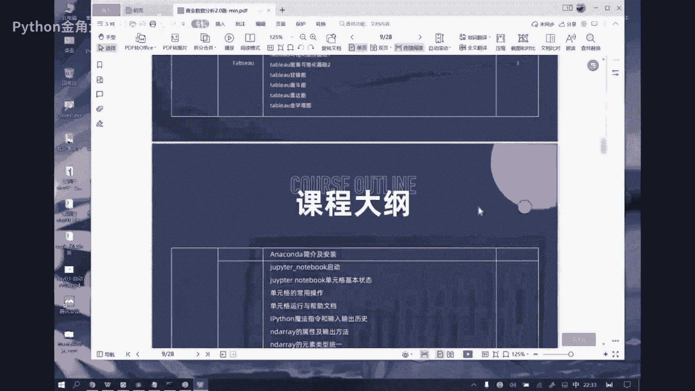

就是我们刚才看到那那个那些就是岗位职责吧，咱们来随便看几个，你看他们都都要什么，比如说这个啊，这是佛山8~8000到1。2万的，需要什么，需要你去Python pandas sk ln。

然后这个啊这个这个就这个啊，x g boost这种都是SKN里边的那些算法，机器学习对吧，然后呃还有需求分析特征模型部署，然后这个等等吧，然后SQL没提是吧，然后再换一个啊，再加几个。

就是就是你看几个就大概都一样的，比如这个1。5到到2万这个啊，然后circle对吧，Etl，然后也是这些这些算法，然后Python对吧，这种就是什么这种他就属于这种高级分析师啊，就属于高级分析师。

然后他一般会懂，就是需要你懂机器学习了，然后有一些初级的啊，初级的，比如说这个稍微低一点，这是助理对吧，数据分析师助理，广州6~6到1万，他需要什么，就是一个circle，看了吧，就是一个circle。

然后还有什么数据处理，数据处理经验，一年一年左右是吧，他说一年以上，然后数据模型，然后思考分析逻辑分析对吧，你看就没有，就相当于没有需求嘛，就相当于你就会写个SQL这种岗位你就能干了，对不对啊。

OK所以这种属于初级分析师的岗，你懂建懂算法，懂建模的话，属于中高级的数据分析师岗，那种岗位一般薪资高点啊，就是带15K到20K啊，就一线佛山都会少一点，但其实他这个给的也不高。

因为昨天还有个佛山的小伙子，就是咱们那个小课的学员，他拿了个10K的offer啊。

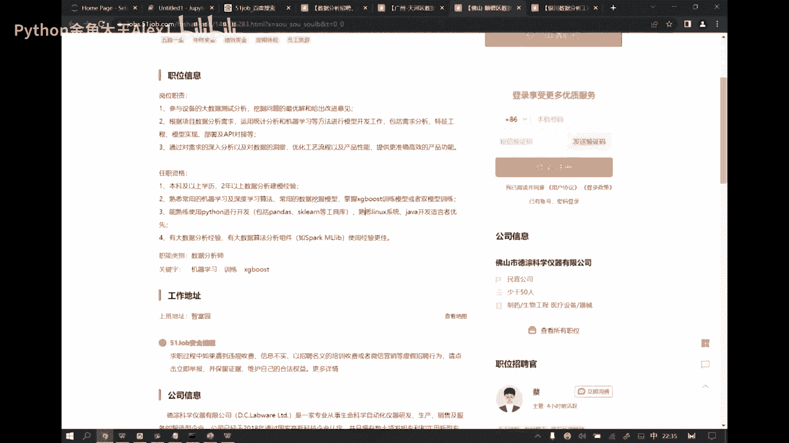

所以给你看看这个大纲啊，他其实是完全碾压这种市面上需求的，首先首先你光学excel是不行啊，因为你光excel你培养不起来，你那套分析逻辑，就是它这个是最最核心的，因为你光跟人讲说。

我会用excel干这干，那，然后本质上你其实解决不了他们，企业的真实问题啊，他们会怎么讲，就是比如说你现在为什么要去推动这个业务，你背景是什么啊，那么你你的你是怎么评估它的可行性的。

然后你的数据是怎么去进行量化的啊，就这些问题，所以那你如果没有一些这种统计思维，还有你这种这个就是数据分析师的，这样一些思考方式的话，其实你光会工具是没有一点意义没有啊，就你不可能拿这种offer。

肯定拿不到，所以首先我们以，我们首先就是会给你讲各种分析师的职能，哎你要了解这个行业，然后你知道怎么拆解指标，你知道各行各业的指标体系怎么构建的，他们是出于什么样的思考，然后我们在业务层面上如何落地。

如何推进对吧，然后还有各种各样的方法论，这种方法论你怎么去延展到给它落地，到你的具体的业务层面上去，能够让他真的变得可执行，它是有可行性的，然后并且是可监督的，然后可可以去过程的去管控的对吧。

这是这是相当于你的内功心法，你得先把这个练出来，然后你光有这个也不行，还得有什么，你还得有这种统计学的这种这种逻辑在里边，你像今天咱们在群里边有不有一个同学问，就是他怎么去搞异常指那个事儿嘛对吧。

你像那里边我异常离群离群检测，这就属于基本的业务处理逻辑，还包括我我我怎么去对吧，我怎么去，就是统计学里边各种分布形态，然后我怎么去做啊，这个假设检验怎么去区间估计等等这些问题，知道吧，怎么去做检验。

你看有T检验F检验，KS检验线性相关检验啊，我们在统计学里面就给你讲到贝叶斯了对吧，就做文本分析的概率模型的啊，然后还有各种分布对吧，各种各种这个啊，就是啊这个统计量什么时候用对吧。

就是相当于相当于你有你有了统计学的，因为这种东西大家都可能都学过，但是都很薄弱，当年不重视这玩意儿，但谁让你你放到现在工作里边，这玩意儿太重要了啊，你不懂这个，你说你搞数据分析师，你真搞不明白。

知道吧啊你只有有了这个，你说话才有底气，因为你你知道你背后是有强大的理论体系，在支撑着你的对吧，所以可以给你搞这个这叫什么，你的基本的思思想层面的建设，有了这些玩意儿之后，你才能去怎么样才能去搞工具。

有人，所以说我特别讨厌那种说教你七天excel入行，分析师对吧，这这种这种东西都就是都扯淡的，而且这种东西它只是就excel，它只是什么，它只是你去玩高高级工具的基础，它是帮你解决这类问题的。

然后顺道培养你什么，培养你这种这种编程的这种思维啊，你得把这种思维干起来，然后你才能到后边才能更高级的一些，英文能搞出来，你看后边就什么power bi power bi，这里边啊给你讲的很细了。

然后再往下TABER看到吧，就这种工具其实一个足够了，给你讲俩对吧，给你讲俩，因为它们都是可扩展的，就它们都类似，然后再往下什么，就是你做报表统计那些东西，你真正说到到这种量级很大的时候。

你你说还是excel power bi不行了，已经很有局限了，要用这些玩意儿，但是你一旦碰到这种高需求，某一刻有一个点这活你能干，别人干不了，他的工资可能就是7000，你就是1万2对吧。

但事实上你平时干的活可能都一样，就那么一刻，这一个月就这一次欧了欧欧了，你能hold住，这又是什么，就是技术核心的价价值，为什么那帮老程序员那么贵，一个月56万的薪资，为什么他们平时也不干活。

也不写代码啊，就是你碰到这种临时需求的时候，整个团队你就能hold住，你就值钱，这就是技术给你带来的红利，明白吗是吧，你看从从统计运算，从这个然后到后边的这个啊，各种这个业务的处理。

他不只是说给你讲方法，他会给你讲很多，就是这些东西都会会在你的那个，就是它是围绕着我数据分析点事去给你展开，说的，都是有有的业务的背景去依托的，比如说我们怎么去做空值，怎么做异常值，不是说这个数据是空。

我就空，你要知道我怎么认定为空值，我怎么认定异常的，什么情况下我我要用什么样的方式来认定异常，然后我这些方法都是来帮你解决，还有我的几点呀，合并啊，什么时候分组，什么时候透视啊对吧，然后还有一些案例啊。

案例去辅助你，让你去帮你把这些知识点啊，都给你都给你渗透进来，让你真的知道我我我是，你把你的重心放到业务的处理上，这个你才是真正值钱的点啊，然后还有包括很重要的，像这种时间序列处理。

企业里面大多数的问题，其实都是时间序列处理对吧，然后还有什么呢，还有可视化也是给你讲两个MATLAB，还有还有这个CBD，就基本上这两套可视化下来，你你你所有的这种Python系的可视化。

这种代码版的你都hold住了，因为逻辑都一样啊，就跟power bi和那个TYLER一样，你会那俩工具，基本上所有其他的你见过的，没见过的，或者或者是小众的，大众的就都没有问题，因为它都差不多大差不差。

然后干嘛后边就是Python了，这是你的技术壁垒了，然后Python整个下来，然后包括这个高级的一些Python知识，然后还有什么数据库对吧，面试就靠这玩意儿，知道吧，这玩意儿你写的六啊，两周啊。

你跟着课两周下来，你保证能达到一个什么，就是一个你去面试，就是难不住你的这个程度就搞SQL，基本上你circle搞定了，然后业务逻辑梳理的没有问题啊，哪哪个这种二线城市拿个10K。

一线城市拿个十234K，其实都没有什么问题啊，而且啊这这些都是什么，这些都是我们的给你的一些基础课，知道吧，这都是基础课，我跟你说真正核心是什么，你光你光去学这种语法，学这种基础就是你给你讲的再好啊。

我跟你说，你还是缺什么，你还是缺逻辑，怎么怎么能保证你的你真正能干活，怎么能保证这个靠这个，这是什么，咱们的咱们的直播可不是说，给你随便给你讲讲知识点，给你讲项目，知道吗。

每一个每一次直播都是一个独立的分析项目，你只有在这样的项目的磨不停地不停地模拟，你才能真的把你这个数据能力培养起来，就是你不要觉得说哎我就学几个技能，我就能干数据分析师了，我跟你说。

这核心就是你的你的思维，这个东西很难掰过来的，明白吧，它必须是长时间有人跟你不停的交流，跟你纠正，给你赋能，你才能把你这个分析思维给你真的给你掰出来，你在跟人聊的时候一听诶，你是个数据分析师的视角。

而不是一个普通的一个小学生的视角对吧，这个这个里边其实学问很大的，看到了吧，各行各业的财务的，互联网直播的，医院的，淘宝的新新零售的，然后内容付费的虚拟货币的，京东的房产的c RM自动化办公对吧。

这些基本上你你能够，你能够所涉猎的这种东西它都有了，然后这些东西你都吃透了以后，基本上就是你你就是到了什么，到了一个这个哈就是怎么讲，我们叫融会贯通吧，就讲讲的夸张也融会贯通了，就是你你大道至简嘛对吧。

最终到最后其实都是通的，所以你真的你才能把你的体系给你建立起来，然后这是一个什么，咱们这是一个什么课，咱们这是一个就业课，同学们知道吧，我们是要给你做结果交付的，我们是要我们是要让你去就业的。

是一个转行的课程，OK这个课程多少钱，同学们啊，多少钱，这是项目的介绍啊，多少钱，很便宜啊很便宜啊，这个课啊咱们在直播，咱们正常官网价是699969，就有咱们直播间就能走团购价，你直接说智哥直播间来的。

知道吧，这首歌词不间来的啊，今天多少钱，同学们，这个能接受吗，同学们能接受吗，这个有点高，是不是不要这个啊，不要这个要多少钱，要这个这个是给你给你带证的啊，379就给你带证的。

给你带一个数据分析师的证的高级数据分析师，市面上考考试多少钱，1200块钱，考证给你包过的，不过我们给你负责，到底肯定让你过，一般一两次就过了啊，如果你不想考证，还能给你打折，不想考证。

这个课只要3299OK啊，200多个录播课时，加上16岁的直播，还有什么，一年内同学们一年内免费复训，什么叫一年内免费复训，这一年内所有的直播课，你想什么时候参加都可以没有限制，知道吗。

相当于你你你花3299，你可以在路飞白嫖一年直播加录播，录播是两年的，有效期，两年之内你随便看，基本上一年你看完你不会再看了啊，你要真想看的话，我我我也可以给给你再找点儿那个本地视频。

明白吗啊你不能不能只看直播，只直播，因为不讲基础明白吗，咱们的直播只讲项目，就只讲项目，所以像Python那种那种东西，你要不学的话，你根本就跟不上，知不知道啊，所以而且这个里边啊。

这边基本上就是收的是你直播的钱，对录播基本上不收你钱了，这个就是3299，明白吗，这个但这个对标什么是一个初级分析师的岗啊，这个是咱们可以给你做1V1的就业服务的，1V1就业服务服务是我亲自给你做。

明白吗，找志哥给你做就业服务，OK我干我干这个是非常擅长的事，好吧啊，录播的话不是就是你你可以，你可以当成是白嫖啊，但是这个这个3299这个价啊，这个价就是直播间的团购价，说白了就是个团购价啊。

你在你去官网，甚至你去抖音直播间，也是这个4999的底价哦，就alex Mac也是4999的底价，OK我们划线价是6999啊，所以说这个在直播间啊，就在直播间就是走团购，因为没有没有销售成本在里边。

也没有那个就是抖音的直播的那种那种成本，没有那个成本啊，都给你都砍掉了，就是就到位了，就就已经到底了，因为你想一个，你不可能说给你找那种一两万的那种小课，老师给你讲课，知道吧。

那位老师都是很就是这个直播课里边是我啊，我和谁，我和另外一个德国，德国就是前微软的一个数据分析，它是数前微软的数据分析的那种，to b的那个培训部门的一个小姐姐，知道吧，是一个俄国德国留学回来的海归啊。

她她和我一块儿给你讲，这个课都是直播的，明白吗，所以说这个他们这帮这帮人薪资都不低的，知道吧，我的薪资肯定是不低的，这个大家应该都知道，因为总监嘛，然后那那个小姐妹她也不低的钱，微软大厂出来的，明白吧。

3299就是给你做16次直播，而且我们是16岁，是滚动播，你相当于你一年你不是说说只听16次，你一年可以无限听下去，知道吗，因为就是16次是一个就是一个一个周期，你第一次听不懂跟第二次。

第二次听跟第三次可以无限听下去，这个是小课啊，他他是一个初级分析师的岗啊，就是你你去做的就是一个初级分析师，因为这里面不讲算法啊，就不讲算法，OK啊这是一个啊，然后这个大纲就大概这样子。

里边各种各种项目介绍都是原图啊，不是给你搞的那种小破网图啊，来来骗你，不是那个啊，就是咱们正儿八经是给你直播，只讲项目这么一个课啊，这个是小课三，就直播间3299，如果想想去了解的话啊。

可以找你那个咨询师要这个大纲，这是一个啊，还有一个这个很便宜啊，就是说是一个小成本敲敲杠杆的一个小课，还有个大课，大课，什么大课是那个高级中高级的数据分析师的课，那个课跟这个课有什么区别。

最大的区别是那个是可以给你签一线城市，15k，二线城市12K的保险协议，就是你你没有达到这个就业标准，差多少，我给你补多少，明白吗，这是啊，这是这是一个最大的保障，另外那个课他是一个纯录播课。

它但它是一个1V1的，纯粹的一个1V1的实时答疑的课啊，1V1的一个实时答疑，这帮答疑程序员都是大厂的兼职，给你答疑的导师，他们都在大厂上班的，正儿八经程序员分析师，知道吧，都是那种高段位的数据分析师。

他们去给你1V1答疑，所以他们会跟你分享很多，这种行业的一些冷知识啊，黑化啊，你跟他们跟着他们跑，一个是你可以解决我，就是他的效率很高，但是我们小课其实也很高啊，小课是群大姨，我跟我跟那个潘老师。

我们两个给你们答啊，肯定都cover住，虽然说我们不叫群，不叫1V1，但基本上答疑都是1V1的对吧，哪有不是1V1的，我对着一帮人打一，不是那样的啊，但是我们这个就是他是给你单独配一个，专属的服务老师。

所以这个成本其实都在这个大厂程序员的，他们那帮人很吊的，你知道吧，一个月也都是年薪大几10万的，就最次也是大几10万的主，所以他们去给你们给你们亲自答疑，然后这个答疑周期是那个是六个月啊。

是六个月的一个一个那个答疑周期，然后他是给你保险协议那个课怎么样呢，怎么样呢。

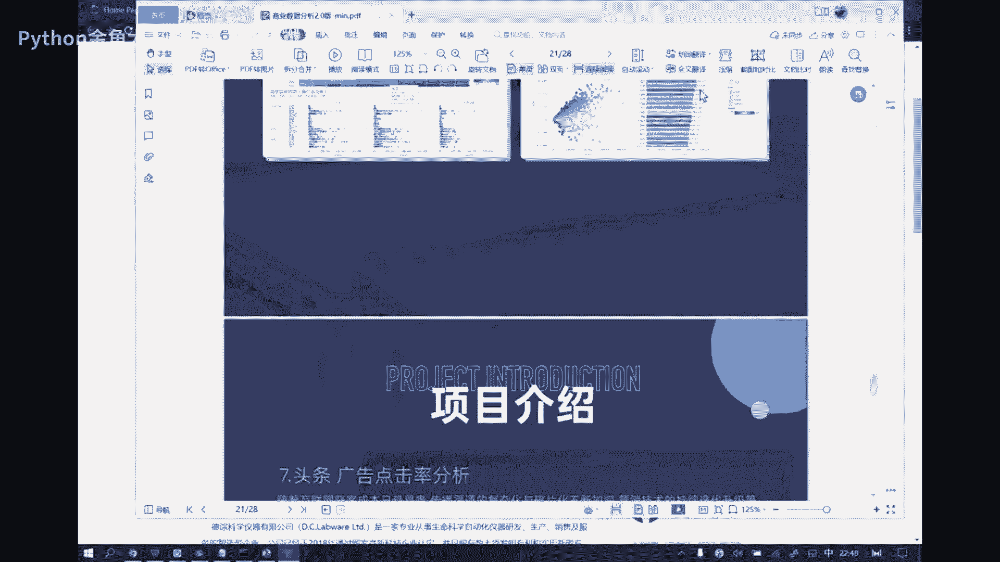

他给你讲算法，所以你一旦玩算法了，你就这种高级岗位你看到了吧，X g boost sk l linux，然后这种这种spark my m lab这种岗位你就能干了，明白吧，就是你可以直接降维打击那种。

什么初初级分析师，就是你小课所有对应的那种初级分析师岗，你全是降维打击啊，就这种岗你就就玩着面就肯定能拿到，你要不嫌薪资低的话，10K11K12K随便玩着面，知道吧，因为你的技能。

你的技能已经已经干到了高级的啊，中高级这种岗位你已经能玩SKN了，能玩这个数据挖掘了，所以那个课大那个课你学习周期长，那课你学习周期是六个月啊，六个月我给你看一下这个这个大纲啊。

当然这个这个大纲也大是吧，这个大纲我们光光这个介绍这个呃，就光光介绍课程啊。

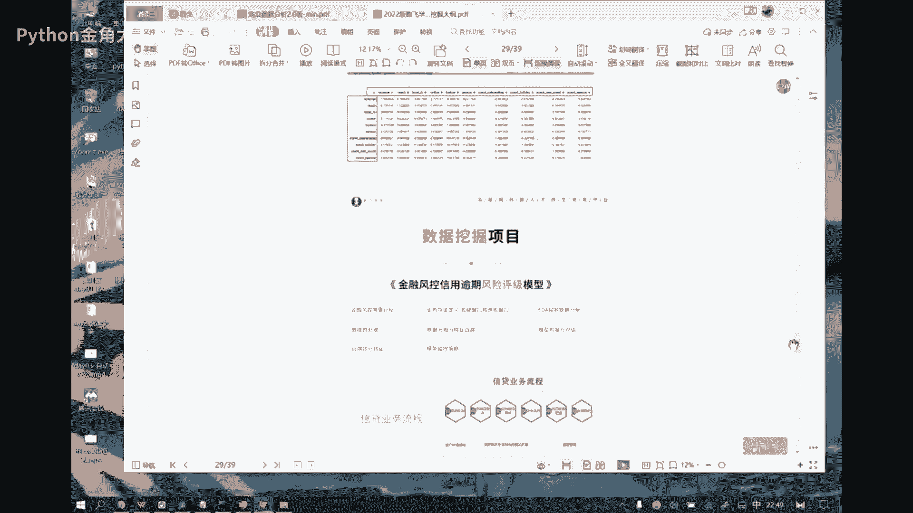

就干了一个PPT，然后呢还还不算这个什么。

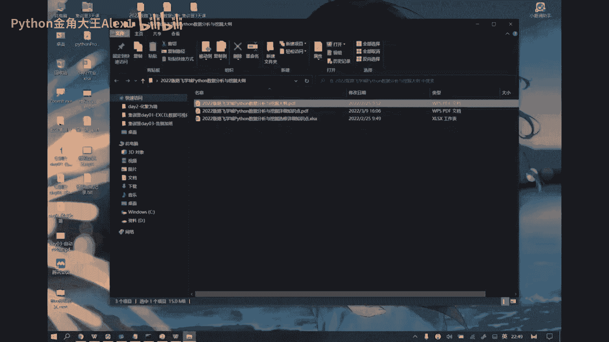

不算这个知识点，知识点得单拿出来一个一个表去写，所以他这个课更大大在哪儿啊，大在哪，首先它对于那个就是商业分析，就是那个那个初级分析师的那个课，它是完全给你覆盖到的。

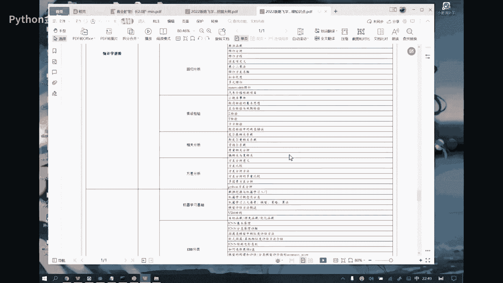

然后他这边多什么，他多AI就是多算法，明白吧。

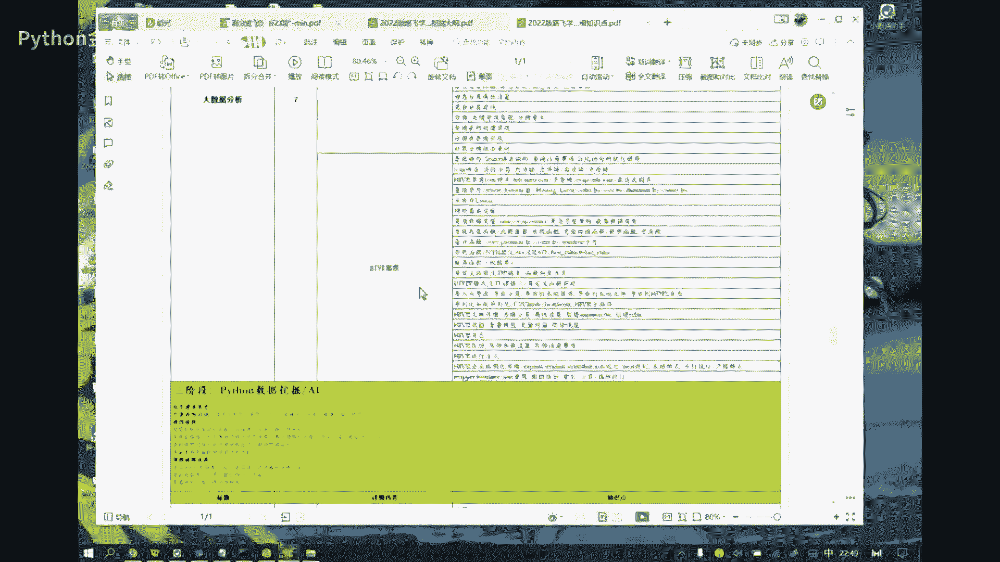

不只是多算法，还多什么多大数据啊，多大数据技能，多算法技能，还有什么，还有这种这个机器学习啊，还有什么还有建模的很多项目啊，还有数据挖掘的这种各种各样的项目，然后它这里边啊是面试啊，是这个给你做。

也是给你做就业指导的啊，这个这个就业指导，其实小课应该是正常是没有的，但是咱们直播间团购价我是给你附赠的啊，然后这个大课啊他说给你做这种就业指导，并且可以可以给你做就业的这个追踪的啊，可以陪跑你。

然后关键是这玩意它它是保心的，明白我们有这个底气给你保新，就说明什么，就是你不用去把你所有的顾虑给你打消了，你不用去考虑说我我入行成不成功的问题，不用考虑这个，因为啊因为这个这个岗位，首先它的量很。

所以我们才敢这么玩，明白吧，才敢这么搞，不然的话这就是自寻死路啊，不敢这么搞的，然后课程肯定是啊绝对自信的啊，因为因为这个不论是这个这个初级分析师，还是这个中高级数据分析师课啊，都是我去设计的。

所以说我因为我一直在这，我从18年开始就做数据分析的就业，我一直一直都是做后期大后期啊，所以说我我对这个整个的就业的环境，然后包括就业怎么去怎么去面聊，怎么去表达技术，然后应该学什么啊。

然后包括企业的一些诉求，包括整个市场的变化，我都是一直在关注啊，所以说这块你基本上跟着我，我们这个课学的话，你可以省很多事啊，你可以效率很高啊，你哪怕说早入职一个月对吧，你你也你也把学费赚回来了。

对不对，你要是自学或者跟别人家，你可能比如你你晚了两天或者晚了一个月，或者说你你耽误了太多功夫，可能就你自己算一下这个成本就划不来了对吧，当然啊，这个就是还是大家得有，对有这种转行诉求的人来说啊。

你要跟别人讲没有意义对吧，跟别人讲，别人会觉得我在给他讲鸡汤啊，这就没意思了啊，所以说咱们如果说有有这个对T想转行的，然后比较比较蒙蒙圈的，或者说咱们刚毕业不知道干什么的啊。

那么我劝你刚毕业的话一定要慎重，千万别乱选行业啊，因为你前两三年如果不选对的话，后边你就折腾吧啊，就基本上咱们在座的应该也有老大哥啊，这都是应该深有感触的啊，如果说咱们这个年龄大一点的转行。

就最好不要去找那种很卷的那种岗了啊，就是找这种量又大，入行门槛又低，然后你你之前的工作经历，对你来讲是一个正向的一个扶持对吧，做这种啊这种是比较好的，OK啊啊然后然后这两个大纲啊，两个大纲这个大课啊。

大课的话，这个价格啊在直播间是98809880，它的它的成本主要是一个是保新，一个是保险，这个风担这个风险我们替你承担了O啊，转行风险，我们提承担了一个是大厂程序员的1V1答疑，这个成本很高的。

这些都是真都是这个真枪实弹，你真得给人大厂成员钱，他给他给他们给少了，他不干的，明白吧啊然后这个课程也很多，然后还有啊，除了这些东西之外，这个大课里面还有什么呢，它它值就只在这儿，就是他给你。

不只是给你这个就是我就业这套东西，我还给你很多职后的东西之后有什么东西，比如说我的web框架啊，比如说我的数据结构，比如说我的爬虫逆向啊，逆向爬虫app爬虫app脱壳。

然后还有包括我的那种那个团队管理工具对吧，就不给你附赠了很多之后的东西，就基本上你你Python整个这套生态，不用再去学别的了啊，这种东西你都你就学就完了，还有人给你答疑，OK啊。

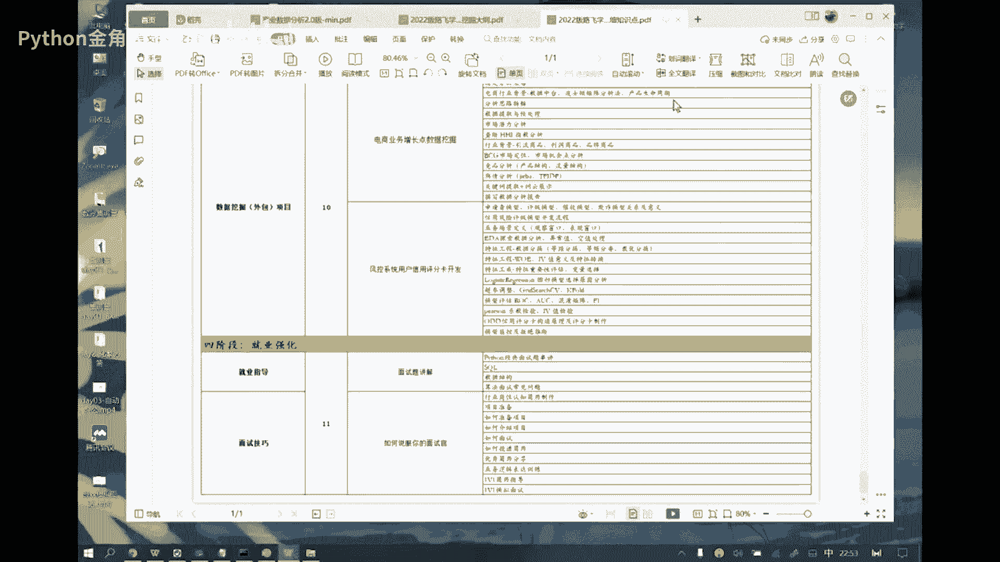

所以说你看看这个东西吧啊它都有这这个啊，这就是我们附赠给你的啊。

就是都是在你整个整个教课程体系里的，它不只是一个，就是我我只是给你针对的这个数据挖掘，但是你就业只学这个专业课就够了，然后你你之后提升的这东西，你看web对吧，web web3套那个三套件是吧。

Cs s cs，然后HTML，然后外部框架jungle flask，然后量化交易，然后算法数据结构团队协作工具GITHUB，然后get啊，然后还有还有那个还有这个还有这个爬虫，不只是外部爬虫啊。

还有什么scrappy框架，还有这各种什么各种看XB站啊，然后这个西瓜视频，然后那个还有那个反编译啊，然后就是JS逆向什么假涉及到java的东西，还有那个hook，然后脱壳等等这些东西都有啊。

小红书对吧，基本都在里面啊，就都给你了，明白吧，所以这是你就是你直后课，就是你入职以后，然后你可以再去做做进阶提升的，OK啊，然后这些东西就就是都是大课里面直接涵盖的，就不用再去做二次什么交费了啊。

就没有那些东西了，就全来了，好吧啊啊就是就是直播间啊，就是直播间小课，就是数据分析师3299大课这个啊，数据挖掘工程师是9880这两个课啊，大家可以可以按需去取吧。

啊然后如果你说我我没有怎么转行数学的话，然后你就想做自动化办公的话，那你就可以考考虑这个啊，因为这个课其实跟他们那种市面上那种嗯，某些企业他们做的那种，就是带你写两个报告的课，其实价格是一样的。

他们那边也是2999，然后2799的大概的价值，而咱们这个肯定是要比他多很多的，因为咱们这是个就业课，它不是也就是说带你写点做点bi工具的东西，这些东西都是覆盖掉的啊。

所以这就业课肯定不是说你你学个变I工具，那种课能比的东西啊，所以他们那种价大都是在3000块钱，咱们这边其实就3299，所以说你要是真想去只搞bi工具，想去做点自动化办公的话。

这个这个课其实也是可以的啊，啊不是说非得多让你那200块钱，这只是差的很大，明白吧，差的很大，内容差差很多的，OK啊，就是说如果只是想做个自动化办公，做一些我我现在工作有这这方面的诉求的话。

可以考虑这个好吧，OK啊然后呃大家这个呃就是转行吧，我还是还是觉得嗯，身为一个身为一个行业的老大哥吧，啊就就就算是厚点两批老大哥吧，啊可能有的大哥比我大啊，然后嗯一定要慎重，真的慎重，因为现在互联网。

你你入行可不像说5年前10年前那样，随便搞点什么技术，也不需要你玩的多溜对吧，然后需求也很旺盛，你随便进，现在不是现在进互联网，一定是得选一些对新手友好一点的，然后再去入啊，不然的话这个你担的风险高啊。

然后成本也高，OK啊好啊行吧，那我们今天就先到这儿，然后大家如果如果想想去更深入了解课程的话，可以去找拉你进群的那个咨询老师好吧，那就这样啊，然后这个第四天的那个录播课，大家有问题的话。

可以在群里边载我，OK咱们这个营，咱们这个营到到这个这周这周末结束啊，然后下周我们就要开新颖了啊，咱们就算是在这儿啊，就算是跟大家道别了啊，当然有缘的话，咱们后边还会再见是吧，还能成为师生的话啊。

OK啊行，那就这样好吧，同学们，那咱们在座的同学们。

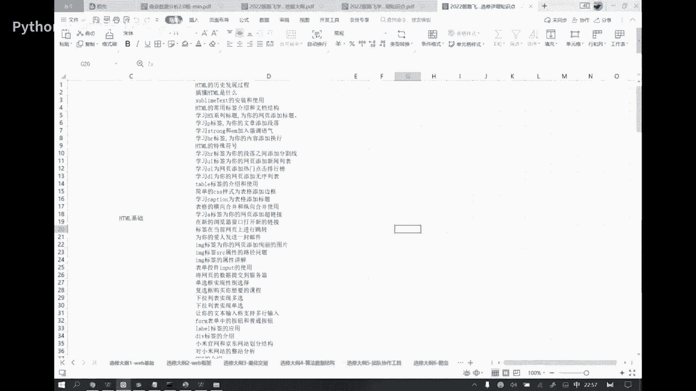