# Simulating Geometric Brownian Motion in Python Stochastic Calculus for Quants - P1 - tiandiao123 - BV1Lt42137hj

对YouTube很好，欢迎回到ASX投资组合频道，我叫乔纳森，所以今天，我们实际上只是要模拟几何布朗尼运动。

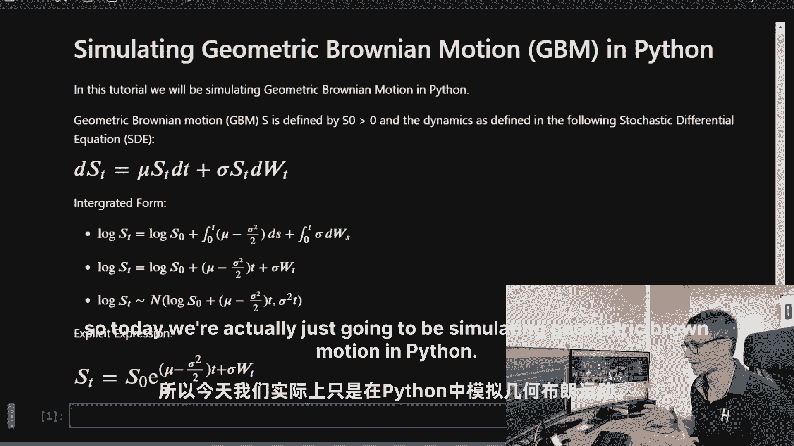

在Python中，我们不会讨论如何推导出这些动力学，但我们将在下面的教程中这样做，我们将从微积分到积分，以及理解随机过程，所以如果你想了解更多，请订阅频道，按通知铃，所以当视频通过时，你可以看到它。

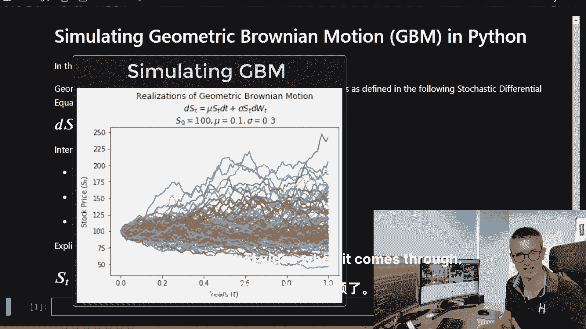

所以让我们进入模拟，所以我将在这里浏览木星笔记本，所以这里我们有，嗯，几何布朗运动，我们有一个大于零的初始股票价格，由这个随机微分方程定义的动力学，所以在这里我们有几个转弯，我们得到了这个μ。

它是漂移系数，我们有一个恒定的波动系数，作为一个百分点，也就是西格玛，然后我们有一个漂移项，然后实际的随机积分分量，也就是这个ito积分，它有布朗运动的成分，所以在这里以综合的形式。

你可以看到股票价格的日志遵循这个正态分布，嗯，关于这个漂移，最初的股票价格，它有一个由西格玛平方定义的方差，随着时间的推移，所以以明确的形式。

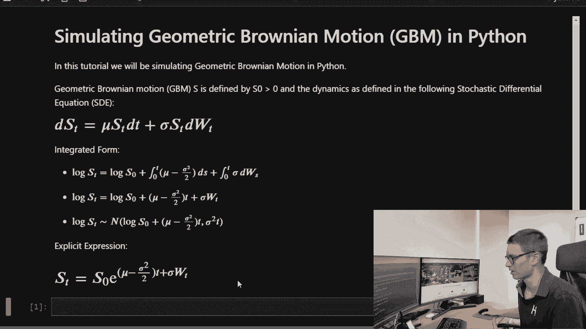

以明确的形式，初始股票价格是这两个项的幂，所以让我们开始吧，实际上，导入我们的依赖项。

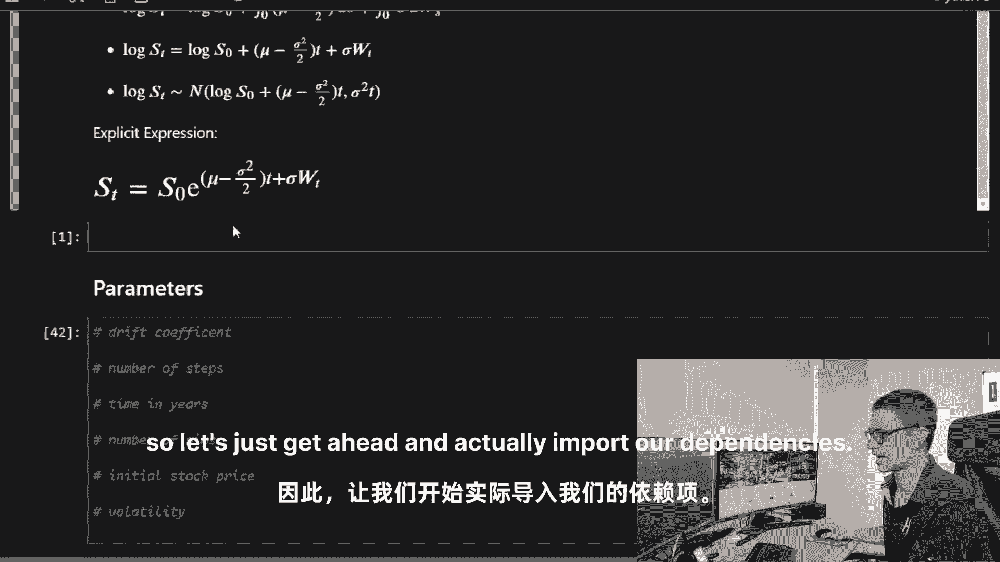

因此，我们需要导入Numpy，麻木为NP，我们将导入matplotlib。

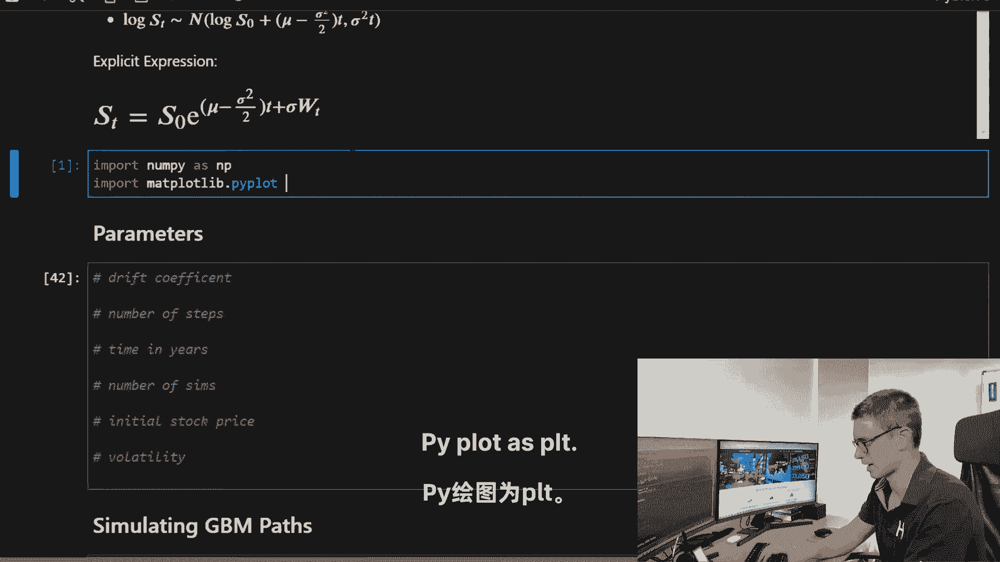

现在我们有了，让我们定义我们的参数。

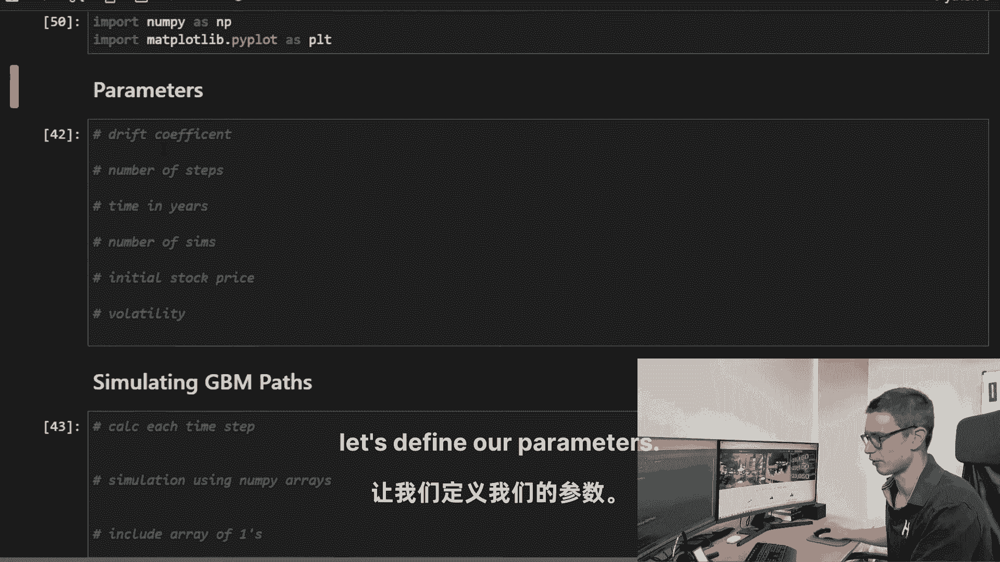

所以我们的μ是零点，在一年的时间范围内增加1%或10%，我们现在将时间步数定义为n，我们就说一千那应该是一百，会给我们详细的分段模拟，所以我们可以在图表上看到，让我们去时间在这么大的T年。

那将是一次模拟，我们就叫它M吧，我们会给出100个初始股价，我们可以称之为100和波动性，我们将其定义为西格玛，我们称之为百分之三十，所以运行它。

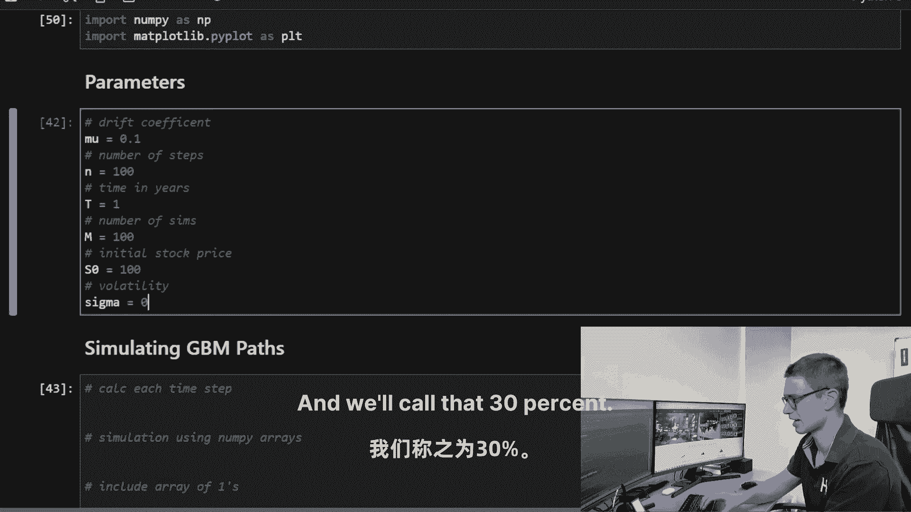

现在模拟。

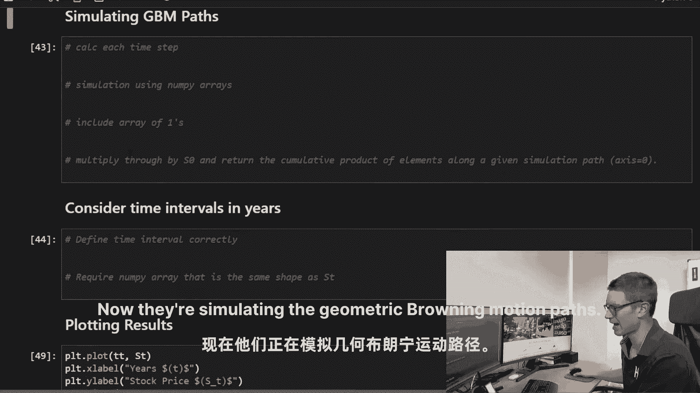

几何布朗尼和运动路径所以首先，我们需要计算实际的时间步长，嗯，因为我们要为所有这些路径返回一个向量，所有这些时间步数，所以让我们计算它不被n整除，现在真的很简单，让我们使用Numpy数组进行模拟。

我们要一步到位，而不是遍历路径，所以我们现在就把它叫做ST，我们现在要去麻木指数，在这个函数中，我们要做这些组件，所以μ减去sigma等于2除以2的幂，那将是DT的时间，现在我们有了那个组件。

我们需要用Numpy数组进行sigma乘以，让我们在这里放一些空格，所以你真的可以清楚地看到这一点，乘以Numpy数组，那将是随机点法线，所以我们将从正态分布中随机抽样，那将是NP，关于那个DT。

所以我们将从运动中的布朗尼随机抽样，现在每一步的时间变化的平方根，它的大小将是模拟的数量，通过我们现在要采取的时间步数，因为我们想要的形式，我们要把这一切，我们要取这个随机法线的转置。

所以一旦我们有了这个时间步骤，我们要进行转置，嗯，我们实际上得到了每个时间步长的模拟，所以一旦你这么做了，我们需要做的是包括一个初始点，一的初始数组，你马上就会明白为什么，所以我们将使用v堆栈。

所以它只是麻木的V堆栈，你所需要做的就是打电话给笨蛋，你想要的尺寸和我们的模拟数字是一样的，所以一百元，我们只是把它和ST A模拟数字数组结合起来，所以一旦我们把这堆东西放在一起。

我们所需要做的就是把它乘以我们的初始值，你会注意到这里是每日，或者时间步长随漂移的变化，然后方差和随机分量，嗯，所以这是时间步长的实现，我们需要做的是随着时间的推移积累这些，所以我们将使用累积乘积，嗯。

沿着每个模拟路径，轴心是1，因此，我们需要做的是将它乘以st，我们将使用这个函数，我们需要定义轴，它将计算出累积乘积，这将是一个轴，它横跨每一个模拟路径，所以一旦我们完成了，我们就可以点击进入。

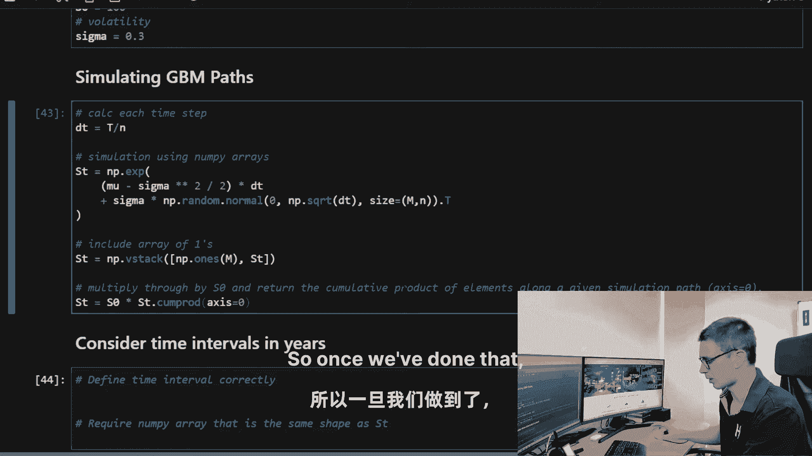

是啊，是啊，我们现在可以看到这些堆栈中的一个。

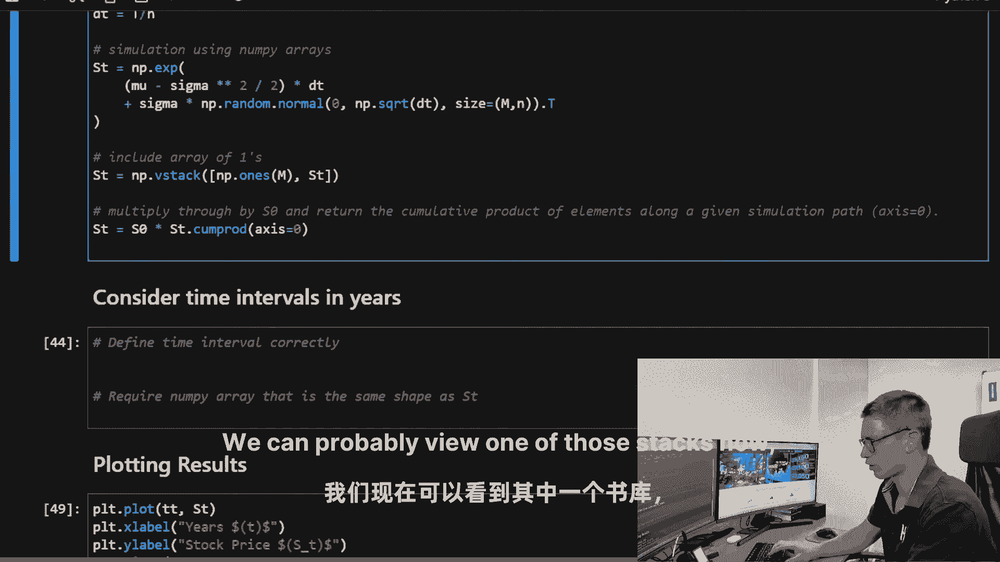

所以让我们返回数组，你可以看到这里是时间的模拟路径。

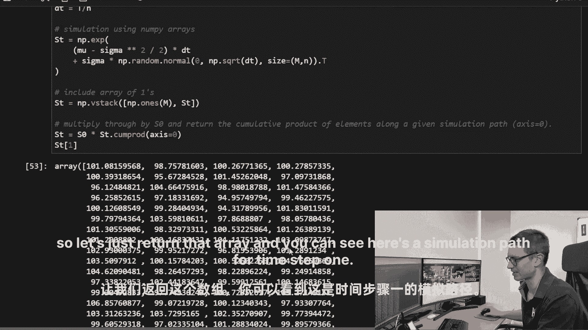

第一步，现在让我们考虑以年为单位的时间间隔，所以我们需要做的是在空间中使用Numpy。

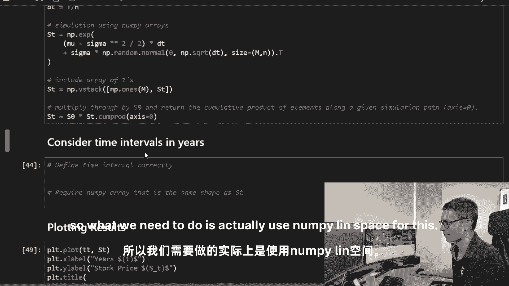

所以我们只出去一年，但我们需要均匀间隔的时间步长，我们将得到n加1，嗯空间，所以这将得到一个数组，让我们把它叫做t或时间，然后现在我们需要一个与st形状相同的numpy数组，我们将利用这一点。

所以我们可以绘制函数，所以我们要做的就是，所以我们正在创建一个与st数组相同的形状。

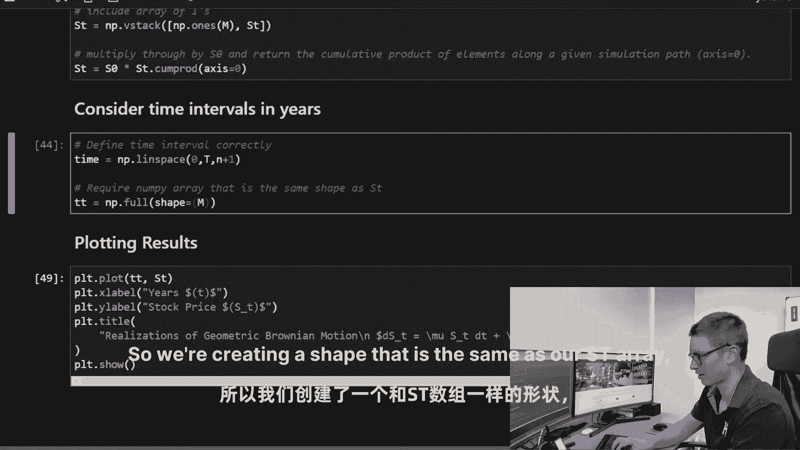

等于m n加1，现在是M n。

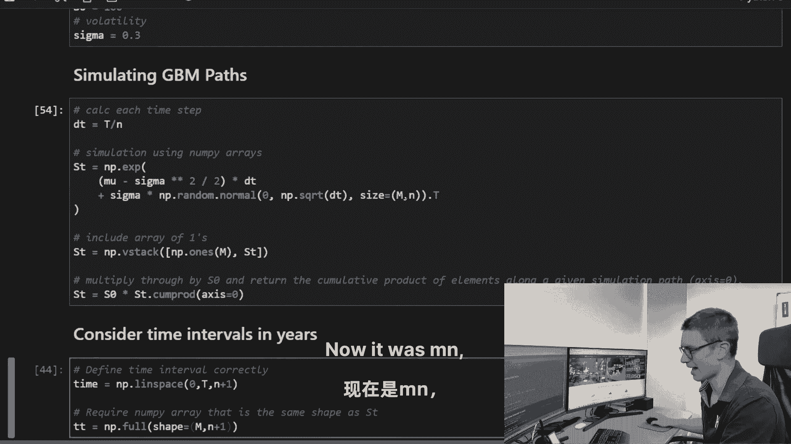

但现在我们实际上添加了一个数组，现在是mn加1，然后我们要填满整个值，所以我们的填充下划线值将等于时间，所以我要为每一个模拟都准备一个数组，那正好相当于，所以我们现在要取这个向量的转置，我们将运行。

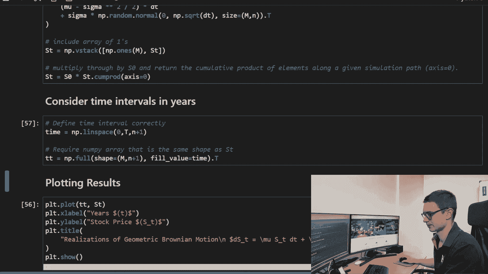

现在我们可以绘制这个图，你可以看到在x轴上有几年。

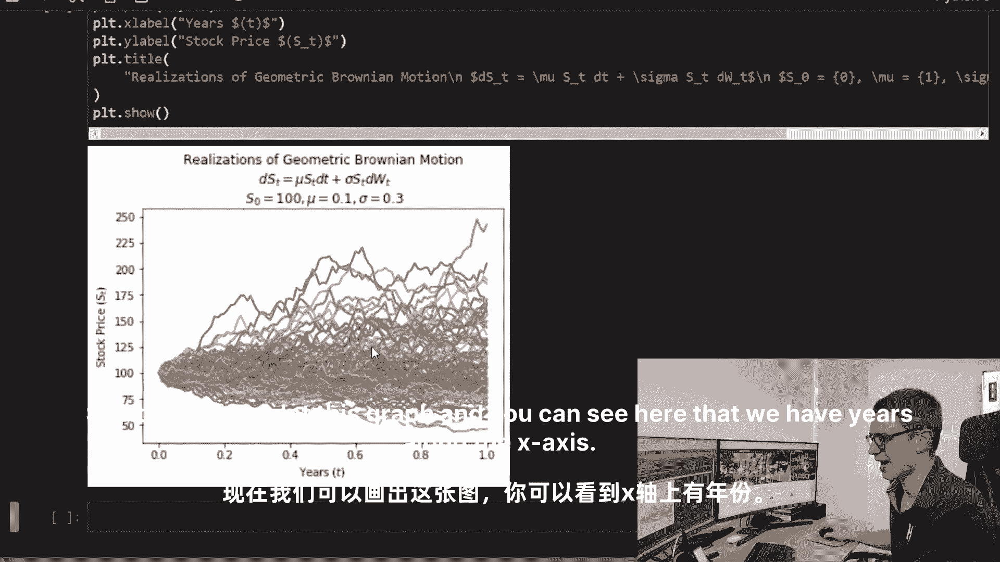

我们得到了沿y轴的股票价格，在这里我们得到了我们的分散，嗯，由于百分之三十的波动性和百分之十的平均值增加，几何布朗运动的漂移，希望你们能学到很多，如何模拟几何浏览，但是是的，一般来说。

几何品牌运动是期权定价理论的一个非常有用的模型，我希望你在下一个教程中从这个教程中得到很多价值，我们要学，好的，好的，我们如何实际使用金融数学，微积分，积分，并理解。

所以我们可以开始增加这些随机微分方程的复杂性，尝试添加不同的参数，所以如果你想了解更多关于这个跳跃的信息，请跳到我们下周的下一个视频中，按通知铃，所以当它通过时，你会得到通知，直到下次YouTube。

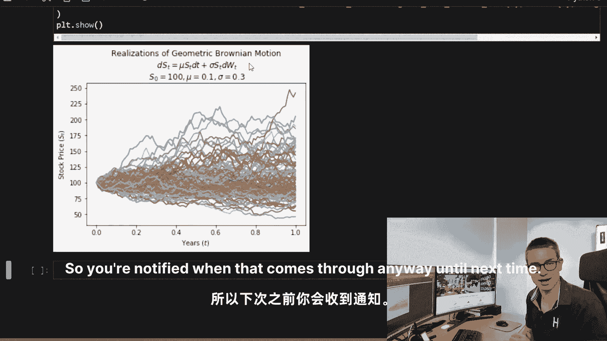